<p align="center">
  
</p>

<p align="center">
  <a href="https://normansrule.github.io/algorithm-forge/"><b>🌐 Open the site</b></a> ·
  <a href="https://normansrule.github.io/algorithm-forge/arena/"><b>🏟️ Practice Arena</b></a> ·
  <a href="https://normansrule.github.io/algorithm-forge/sims/"><b>👀 48 Simulations</b></a> ·
  <a href="https://normansrule.github.io/algorithm-forge/path.html"><b>🗺️ Learning Path</b></a> ·
  <a href="https://normansrule.github.io/algorithm-forge/cheatsheet.html"><b>📄 Cheat Sheet</b></a> ·
  <a href="https://normansrule.github.io/algorithm-forge/quiz.html"><b>🧠 Quiz</b></a>
</p>

<p align="center">
  <a href="https://github.com/Normansrule/algorithm-forge/actions/workflows/ci.yml"></a>
  
  
  
  
  
</p>

# Algorithm Forge

**Learn to build algorithms from nothing: see them move, arrange them in blocks, write them in pseudocode, get them
checked automatically, and prove how fast they are.** Then keep climbing until you think like a senior software
engineer and an algorithm designer.

The spine is Anany Levitin's *Introduction to the Design and Analysis of Algorithms* (3rd edition), all 12 chapters,
including the sections a one-semester course usually skips. It is aligned with CSC 501 (Algorithm Analysis and
Design) at California State University, Dominguez Hills (CSUDH). Five **Beyond** chapters then go past the book:
advanced data structures, advanced graphs, interview and production patterns, randomized and amortized algorithms,
and a senior engineer's playbook.

> **Start here →** [`lessons/00-start-here`](lessons/00-start-here/README.md) (10 minutes), then open the
> [Practice Arena](https://normansrule.github.io/algorithm-forge/arena/) and solve **Largest Element**. Nothing to install.

---

## 🔁 How it works — one loop, every algorithm

<p align="center"></p>

| Step | Where | What you do |
|---|---|---|
| 📖 **Learn** | [Lessons](lessons/) | Read one **Algorithm Build Card**: the problem in one line → a real-life picture → build it block by block → trace table → pseudocode · Python · Java → the math → common mistakes → self-check. |
| 👀 **See** | [Simulations](https://normansrule.github.io/algorithm-forge/sims/) | Watch it run on *your* input: highlighted pseudocode line, live operation counters, plain-English narration, and 🤔 *Predict* pauses. |
| 🧱 **Blocks** | [Arena](https://normansrule.github.io/algorithm-forge/arena/) | Drag the scrambled pseudocode lines into order and indent them. Decoy lines hide real mistakes. |
| ✍️ **Write** | Arena | Write it yourself in textbook-style pseudocode (or JavaScript / Python). |
| ✅ **Auto-check** | Arena | Hidden tests, random tests, **operation budgets** (e.g. binary search ≤ ⌊log₂ n⌋ + 1 comparisons) and a **growth check** that measures whether your algorithm is Θ(n), Θ(n log n), Θ(n²)… |
| 💡 **Nudge** | Arena | Wrong? You get a targeted nudge ("You start `maxval` at 0; what if every number is negative?"), never the answer. The hint ladder goes nudge → plan → exact step, and only then shows the solution. |
| 🧑‍💻 **Senior twist** | Arena | After you solve it, see how an experienced engineer would extend it, and where it shows up in real systems. |

### Pick your way in

Different brains, same destination. Start wherever it clicks:

| If you learn best by… | Start with | Then |
|---|---|---|
| **Seeing** | a simulation, like the [Sorting Studio](https://normansrule.github.io/algorithm-forge/sims/sorting-studio.html) | 👁 *Visualize* in the Arena: step through **your own** pseudocode with the array animating |
| **Stories and analogies** | the 📖 *Story* block at the top of every Build Card | the 🧮 *Math* block, once the picture is clear |
| **Doing / hands-on** | 🧱 Blocks mode in the Arena | ✋ *Trace it by hand* tables in the lessons |
| **Math first** | the [cheat sheets](cheatsheets/README.md) and each lesson's 🧮 *Math* block | the [Recurrence Lab](https://normansrule.github.io/algorithm-forge/sims/recurrence-lab.html) |
| **Code first** | ✍️ Write mode (pseudocode, JavaScript or Python) | the tested [Python library](src/python/) and [Java](src/java/) |

---

## 🏟️ Forge Arena — LeetCode-style practice for *pseudocode*

<p align="center"></p>

You write **Forge Pseudocode**, the same notation as the textbook and the lectures. A built-in interpreter runs it:

```text
ALGORITHM BinarySearch(A[0..n-1], K)
    l ← 0; r ← n − 1
    while l ≤ r do
        m ← ⌊(l + r)/2⌋
        if K = A[m] then return m
        else if K < A[m] then r ← m − 1
        else l ← m + 1
    return −1
```

`←` or `<-`, `for i ← 1 to n − 1 do`, `downto`, `repeat … until`, `A[0..n−1]` headers that bind `n`, `A[l..r]` headers
that bind `l` and `r`, `swap A[i] and A[j]`, `⌊ ⌋ ⌈ ⌉`, `div`, `mod`, `∞`, stacks, queues, priority queues, maps and
records. The full language reference is in [`cheatsheets/pseudocode-reference.md`](cheatsheets/pseudocode-reference.md).
Continuous Integration (CI) checks that every `ALGORITHM` block in the lessons parses as Forge Pseudocode, so the
notation you read is exactly the notation the Arena runs.

| | |
|---|---|
| 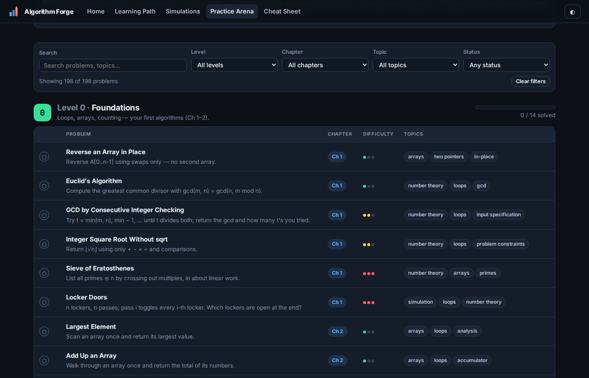 | 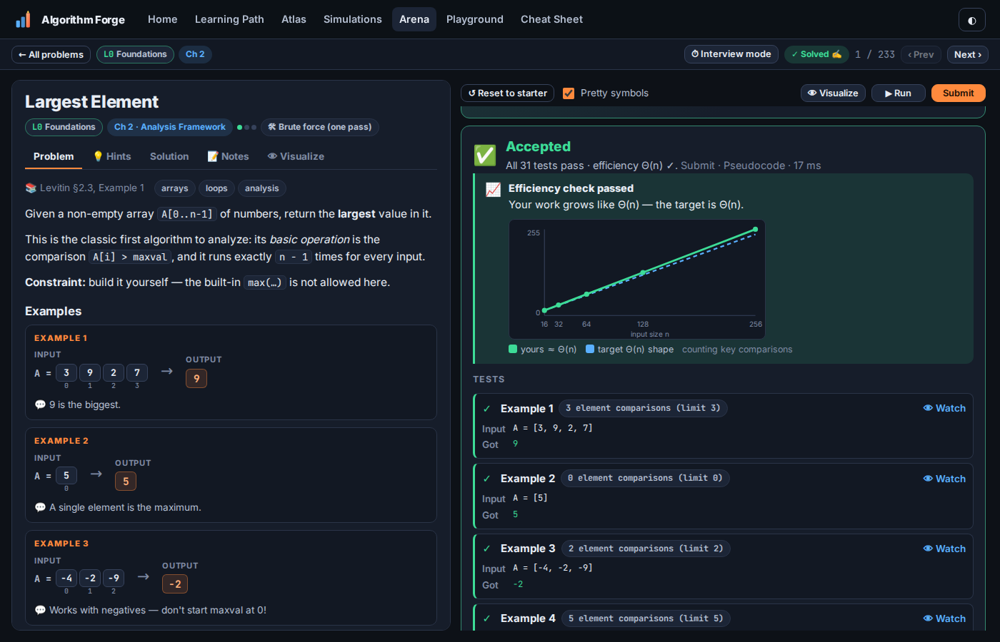 |
| **213 problems in 7 levels**, filterable by chapter, topic and status; your progress is saved in your browser. | **Accepted** — every test passed, and the growth check confirmed Θ(n). |
| 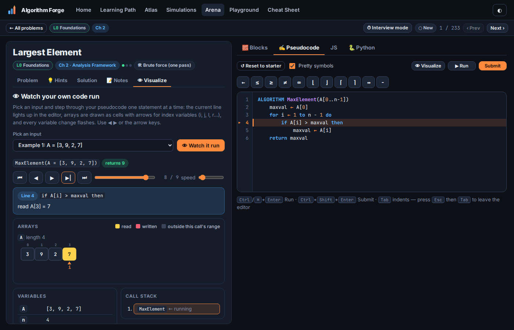 | 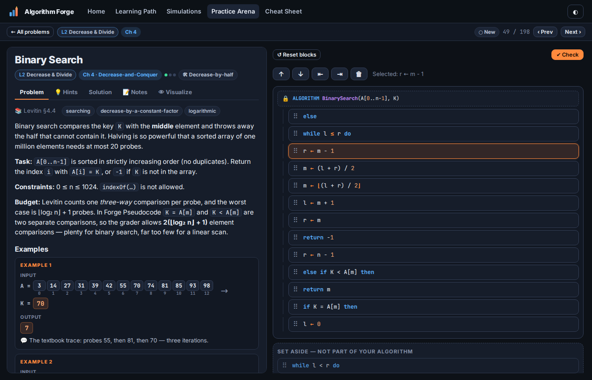 |
| **👁 Visualize** your own code: current line, variables, array cells with `i`/`j` pointer arrows, call stack. | **🧱 Blocks** (a Parsons puzzle): order and indent the lines. Great for a first pass on a new algorithm. |

### Seven levels, from first loop to algorithm designer

<p align="center"></p>

<!-- STARTERS:START -->
| Level | Name | Problems | Try this first |
|---|---|---|---|
| 0 | **Foundations** — Loops, arrays, counting — your first algorithms (Ch 1–2). | [14](https://normansrule.github.io/algorithm-forge/arena/?level=0) | [Largest Element](https://normansrule.github.io/algorithm-forge/arena/problem.html?id=max-element) |
| 1 | **Brute Force & Analysis** — Straightforward solutions and how to count their cost (Ch 2–3). | [33](https://normansrule.github.io/algorithm-forge/arena/?level=1) | [Are All Elements Distinct? (Brute Force)](https://normansrule.github.io/algorithm-forge/arena/problem.html?id=element-uniqueness-brute) |
| 2 | **Decrease & Divide** — Shrink the problem, split the problem (Ch 4–5). | [27](https://normansrule.github.io/algorithm-forge/arena/?level=2) | [Insertion Sort](https://normansrule.github.io/algorithm-forge/arena/problem.html?id=insertion-sort) |
| 3 | **Transform & Space-Time** — Presort, heaps, hashing, smarter string search (Ch 6–7). | [26](https://normansrule.github.io/algorithm-forge/arena/?level=3) | [Element Uniqueness by Presorting](https://normansrule.github.io/algorithm-forge/arena/problem.html?id=presort-uniqueness) |
| 4 | **Dynamic Programming, Greedy & Iterative Improvement** — Tables, greedy choices, flows and matchings (Ch 8–10). | [38](https://normansrule.github.io/algorithm-forge/arena/?level=4) | [Climbing Stairs (Fibonacci in Disguise)](https://normansrule.github.io/algorithm-forge/arena/problem.html?id=climbing-stairs) |
| 5 | **Hard Problems & Senior Patterns** — Backtracking, approximation, Nondeterministic Polynomial (NP)-hard problems, and the patterns senior engineers reach for (Ch 11–17). | [52](https://normansrule.github.io/algorithm-forge/arena/?level=5) | [Verify a Conjunctive Normal Form (CNF) Certificate](https://normansrule.github.io/algorithm-forge/arena/problem.html?id=sat-verify) |
| 6 | **Expert: Algorithm Designer** — The hardest set: bitmask Dynamic Programming, linear-time string algorithms, graph cut structure, branch-and-bound, cache design (Ch 12–17). | [23](https://normansrule.github.io/algorithm-forge/arena/?level=6) | [Count–Min Sketch (with Conservative Update)](https://normansrule.github.io/algorithm-forge/arena/problem.html?id=count-min-conservative) |
<!-- STARTERS:END -->

---

## 🗺️ Course map — every chapter: lesson · simulations · practice

Lessons open on GitHub; simulations and practice open on the live site.

<!-- COURSE-MAP:START -->
| # | Lesson | What you'll build | Simulations | Arena | Levitin |
|---|---|---|---|---|---|
| 0 | [Start Here](lessons/00-start-here/README.md) | How to learn here: the Build Card method, Forge Pseudocode, and picking your way in. | — | — | — |
| 1 | [Introduction](lessons/01-introduction/README.md) | What an algorithm really is, told through Euclid's 2,300-year-old greatest common divisor. | [GCD Three Ways + Sieve](https://normansrule.github.io/algorithm-forge/sims/euclid-gcd.html) | [8 problems](https://normansrule.github.io/algorithm-forge/arena/?chapter=1) | Ch 1 |
| 2 | [Analysis Framework](lessons/02-analysis-framework/README.md) | Count the basic operation; turn loops into sums and recursion into recurrences. | [Growth Rates](https://normansrule.github.io/algorithm-forge/sims/growth-rates.html) · [Recurrence Lab](https://normansrule.github.io/algorithm-forge/sims/recurrence-lab.html) · [Empirical Analysis Lab](https://normansrule.github.io/algorithm-forge/sims/empirical-lab.html) · [Tower of Hanoi](https://normansrule.github.io/algorithm-forge/sims/hanoi.html) · [Fibonacci Four Ways](https://normansrule.github.io/algorithm-forge/sims/fibonacci.html) | [17 problems](https://normansrule.github.io/algorithm-forge/arena/?chapter=2) | Ch 2 |
| 3 | [Brute Force & Exhaustive Search](lessons/03-brute-force/README.md) | Do exactly what the definition says, then measure what it costs. | [Sorting Studio](https://normansrule.github.io/algorithm-forge/sims/sorting-studio.html) · [String Matching](https://normansrule.github.io/algorithm-forge/sims/string-match.html) · [Closest Pair & Convex Hull](https://normansrule.github.io/algorithm-forge/sims/closest-pair-hull.html) · [Exhaustive Search](https://normansrule.github.io/algorithm-forge/sims/exhaustive-search.html) · [DFS and BFS](https://normansrule.github.io/algorithm-forge/sims/graph-traversal.html) | [22 problems](https://normansrule.github.io/algorithm-forge/arena/?chapter=3) | Ch 3 |
| 4 | [Decrease-and-Conquer](lessons/04-decrease-and-conquer/README.md) | Shrink the problem by one, by half, or by a variable amount — then extend the answer. | [Search Lab](https://normansrule.github.io/algorithm-forge/sims/search-lab.html) · [Topological Sorting](https://normansrule.github.io/algorithm-forge/sims/topo-sort.html) · [Generating Permutations and Subsets](https://normansrule.github.io/algorithm-forge/sims/combinatorics.html) · [The Game of Nim](https://normansrule.github.io/algorithm-forge/sims/nim.html) | [19 problems](https://normansrule.github.io/algorithm-forge/arena/?chapter=4) | Ch 4 |
| 5 | [Divide-and-Conquer](lessons/05-divide-and-conquer/README.md) | Split, solve, stitch — and read the cost straight off the Master Theorem. | [Sorting Studio](https://normansrule.github.io/algorithm-forge/sims/sorting-studio.html) · [Binary Tree Traversals](https://normansrule.github.io/algorithm-forge/sims/tree-traversals.html) · [Karatsuba and Strassen](https://normansrule.github.io/algorithm-forge/sims/karatsuba-strassen.html) · [Closest Pair & Convex Hull](https://normansrule.github.io/algorithm-forge/sims/closest-pair-hull.html) · [Tower of Hanoi](https://normansrule.github.io/algorithm-forge/sims/hanoi.html) | [8 problems](https://normansrule.github.io/algorithm-forge/arena/?chapter=5) | Ch 5 |
| 6 | [Transform-and-Conquer](lessons/06-transform-and-conquer/README.md) | Change the problem's shape until it becomes easy: presort, balance, heapify. | [Heap Lab](https://normansrule.github.io/algorithm-forge/sims/heap-lab.html) · [Search Trees](https://normansrule.github.io/algorithm-forge/sims/search-trees.html) · [Gaussian Elimination](https://normansrule.github.io/algorithm-forge/sims/gaussian.html) · [Horner and Binary Powers](https://normansrule.github.io/algorithm-forge/sims/horner-binexp.html) | [17 problems](https://normansrule.github.io/algorithm-forge/arena/?chapter=6) | Ch 6 |
| 7 | [Space-Time Tradeoffs](lessons/07-space-time-tradeoffs/README.md) | Spend memory to buy speed: counting sorts, shift tables, hashing, B-trees. | [Sorting Studio](https://normansrule.github.io/algorithm-forge/sims/sorting-studio.html) · [String Matching](https://normansrule.github.io/algorithm-forge/sims/string-match.html) · [Hashing Lab](https://normansrule.github.io/algorithm-forge/sims/hashing.html) · [B-Tree Lab](https://normansrule.github.io/algorithm-forge/sims/b-tree.html) | [9 problems](https://normansrule.github.io/algorithm-forge/arena/?chapter=7) | Ch 7 |
| 8 | [Dynamic Programming (DP)](lessons/08-dynamic-programming/README.md) | Solve every overlapping subproblem once, write it in a table, never recompute. | [DP Table Studio](https://normansrule.github.io/algorithm-forge/sims/dp-studio.html) · [Optimal BST](https://normansrule.github.io/algorithm-forge/sims/optimal-bst.html) · [Warshall & Floyd](https://normansrule.github.io/algorithm-forge/sims/warshall-floyd.html) | [20 problems](https://normansrule.github.io/algorithm-forge/arena/?chapter=8) | Ch 8 |
| 9 | [Greedy Technique](lessons/09-greedy/README.md) | Grab the best-looking piece every time — and prove it never backfires. | [Greedy Graph Algorithms](https://normansrule.github.io/algorithm-forge/sims/greedy-graphs.html) · [Huffman Codes](https://normansrule.github.io/algorithm-forge/sims/huffman.html) · [When Greedy Works](https://normansrule.github.io/algorithm-forge/sims/greedy-choices.html) | [12 problems](https://normansrule.github.io/algorithm-forge/arena/?chapter=9) | Ch 9 |
| 10 | [Iterative Improvement](lessons/10-iterative-improvement/README.md) | Start feasible, keep improving, prove you're done: simplex, flows, matchings. | [Simplex Method](https://normansrule.github.io/algorithm-forge/sims/simplex.html) · [Maximum Flow](https://normansrule.github.io/algorithm-forge/sims/max-flow.html) · [Bipartite Matching](https://normansrule.github.io/algorithm-forge/sims/bipartite-matching.html) · [Stable Marriage](https://normansrule.github.io/algorithm-forge/sims/stable-marriage.html) | [7 problems](https://normansrule.github.io/algorithm-forge/arena/?chapter=10) | Ch 10 |
| 11 | [Limitations of Algorithm Power](lessons/11-limitations/README.md) | Lower bounds, decision trees, and deterministic Polynomial time (P) versus Nondeterministic Polynomial time (NP). | [Decision Trees & Lower Bounds](https://normansrule.github.io/algorithm-forge/sims/decision-trees.html) · [P vs NP Lab](https://normansrule.github.io/algorithm-forge/sims/p-np.html) | [6 problems](https://normansrule.github.io/algorithm-forge/arena/?chapter=11) | Ch 11 |
| 12 | [Coping with Limitations](lessons/12-coping-with-limitations/README.md) | When exact is too slow: backtracking, branch-and-bound, approximation, root finding. | [Backtracking](https://normansrule.github.io/algorithm-forge/sims/backtracking.html) · [Branch-and-Bound](https://normansrule.github.io/algorithm-forge/sims/branch-and-bound.html) · [TSP Approximations](https://normansrule.github.io/algorithm-forge/sims/tsp-approx.html) · [Bin Packing](https://normansrule.github.io/algorithm-forge/sims/bin-packing.html) · [Root Finding](https://normansrule.github.io/algorithm-forge/sims/root-finding.html) | [15 problems](https://normansrule.github.io/algorithm-forge/arena/?chapter=12) | Ch 12 |
| 13 | [Advanced Data Structures](lessons/13-advanced-data-structures/README.md) 🚀 | Union–find, Fenwick and segment trees, tries, skip lists, caches, storage engines. | [Union-Find](https://normansrule.github.io/algorithm-forge/sims/union-find.html) · [Segment Tree & Fenwick](https://normansrule.github.io/algorithm-forge/sims/segment-tree.html) · [Trie](https://normansrule.github.io/algorithm-forge/sims/trie.html) | [11 problems](https://normansrule.github.io/algorithm-forge/arena/?chapter=13) | Beyond |
| 14 | [Advanced Graphs](lessons/14-advanced-graphs/README.md) 🚀 | Negative edges, heuristics, components, bridges — modeling real problems as graphs. | [Shortest Paths+](https://normansrule.github.io/algorithm-forge/sims/shortest-paths-plus.html) · [Strongly Connected Components](https://normansrule.github.io/algorithm-forge/sims/scc.html) | [10 problems](https://normansrule.github.io/algorithm-forge/arena/?chapter=14) | Beyond |
| 15 | [DP & Interview Patterns](lessons/15-dp-and-interview-patterns/README.md) 🚀 | Recognize the pattern in seconds: two pointers, sliding window, monotonic stack, and more. | [Interview Patterns](https://normansrule.github.io/algorithm-forge/sims/patterns.html) | [18 problems](https://normansrule.github.io/algorithm-forge/arena/?chapter=15) | Beyond |
| 16 | [Randomized, Amortized & Streaming](lessons/16-randomized-amortized-streaming/README.md) 🚀 | Why array doubling is cheap on average, and how sketches count billions in kilobytes. | [Amortized Analysis](https://normansrule.github.io/algorithm-forge/sims/amortized.html) · [Bloom Filter](https://normansrule.github.io/algorithm-forge/sims/bloom-filter.html) | [7 problems](https://normansrule.github.io/algorithm-forge/arena/?chapter=16) | Beyond |
| 17 | [Senior Engineer Playbook](lessons/17-senior-engineer-playbook/README.md) 🚀 | Clarify, estimate, choose, prove, test, ship — the process behind every good design. | — | [7 problems](https://normansrule.github.io/algorithm-forge/arena/?chapter=17) | Beyond |

🚀 = Beyond the textbook (senior-engineer level).
<!-- COURSE-MAP:END -->

---

## 👀 Visual gallery

<table>
<tr>
<td width="50%"><a href="https://normansrule.github.io/algorithm-forge/sims/search-lab.html"></a><br><sub><b>Binary search</b>: at most ⌊log₂ n⌋ + 1 comparisons (Levitin §4.4)</sub></td>
<td width="50%"><a href="https://normansrule.github.io/algorithm-forge/sims/growth-rates.html"></a><br><sub><b>Orders of growth</b>: why Θ matters more than the constant (§2.2)</sub></td>
</tr>
<tr>
<td><a href="https://normansrule.github.io/algorithm-forge/sims/recurrence-lab.html"></a><br><sub><b>Recursion tree</b>: T(n) = 2T(n/2) + n → n log₂ n (§5.1, Master Theorem)</sub></td>
<td><a href="https://normansrule.github.io/algorithm-forge/sims/dp-studio.html"></a><br><sub><b>Dynamic Programming (DP)</b>: the W = 5 knapsack table fills to $37, then traces back (§8.2)</sub></td>
</tr>
<tr>
<td><a href="https://normansrule.github.io/algorithm-forge/sims/graph-traversal.html"></a><br><sub><b>Breadth-First Search (BFS)</b>: the queue expands one distance level at a time (§3.5)</sub></td>
<td><a href="https://normansrule.github.io/algorithm-forge/sims/sorting-studio.html?race=1">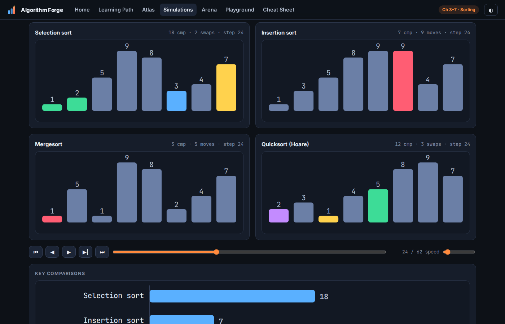</a><br><sub><b>Sorting Studio</b>: race selection, insertion, merge and quick sort on the same input</sub></td>
</tr>
<tr>
<td><a href="https://normansrule.github.io/algorithm-forge/sims/dp-studio.html">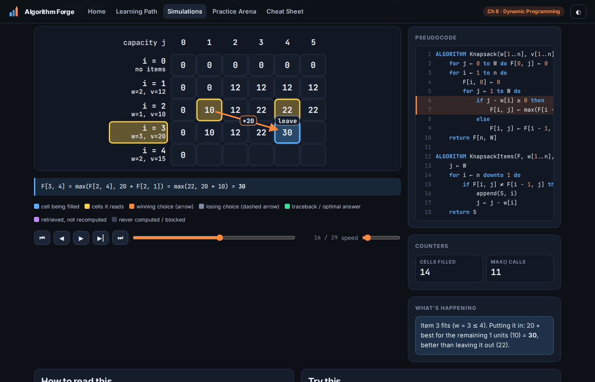</a><br><sub><b>DP Studio</b>: every cell shows the two cells it reads and the choice it makes</sub></td>
<td><a href="https://normansrule.github.io/algorithm-forge/sims/graph-traversal.html">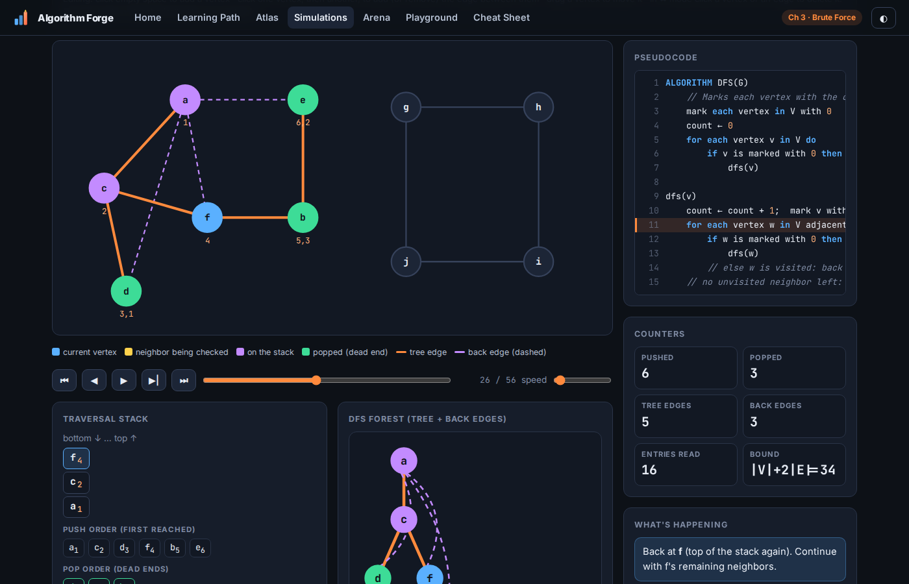</a><br><sub><b>Graph traversal</b>: Depth-First Search (DFS) stack, tree and back edges, push/pop order</sub></td>
</tr>
<tr>
<td><a href="https://normansrule.github.io/algorithm-forge/sims/greedy-graphs.html">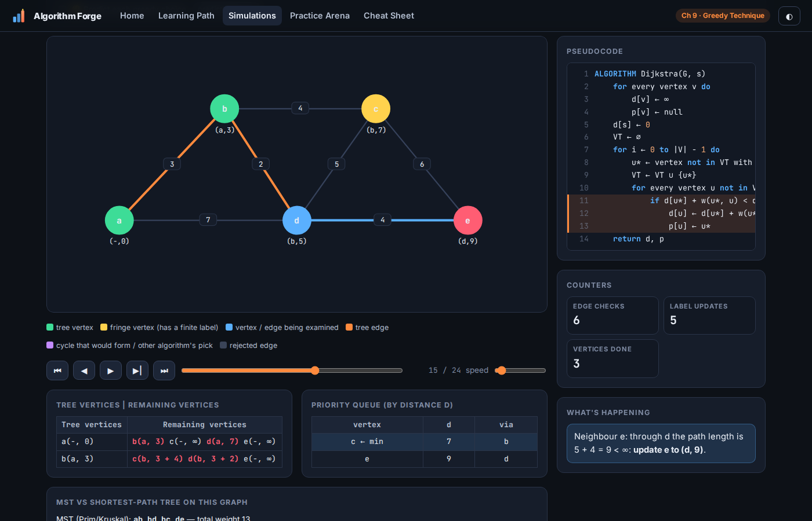</a><br><sub><b>Greedy graphs</b>: Dijkstra's labels d(v) and the priority queue, step by step</sub></td>
<td><a href="https://normansrule.github.io/algorithm-forge/sims/backtracking.html">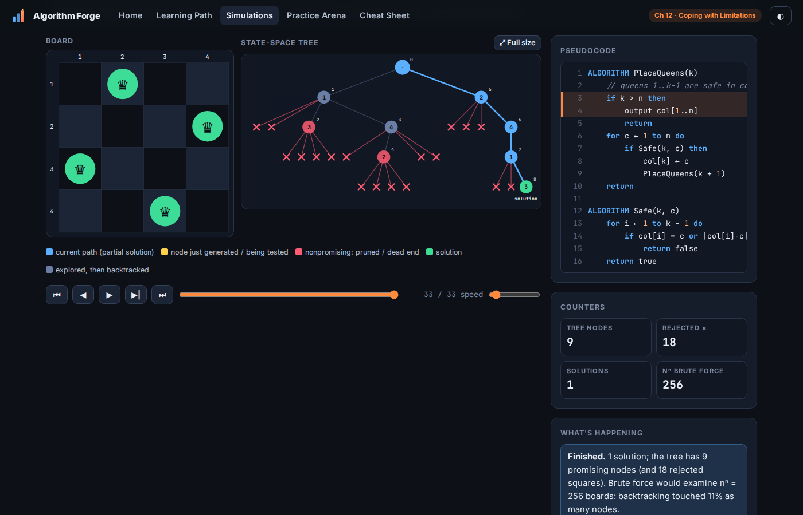</a><br><sub><b>Backtracking</b>: the n-Queens state-space tree with pruned branches</sub></td>
</tr>
<tr>
<td><a href="https://normansrule.github.io/algorithm-forge/sims/string-match.html">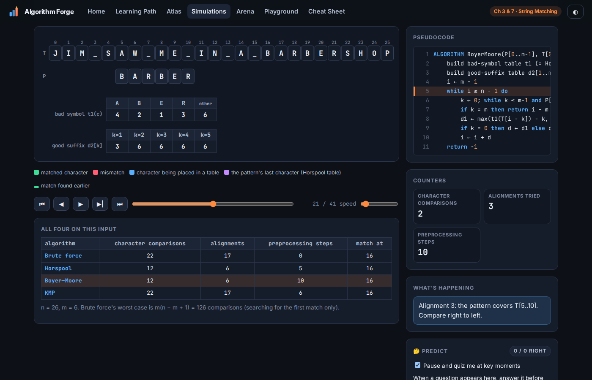</a><br><sub><b>String matching</b>: Boyer–Moore bad-symbol and good-suffix shifts</sub></td>
<td><a href="https://normansrule.github.io/algorithm-forge/sims/heap-lab.html">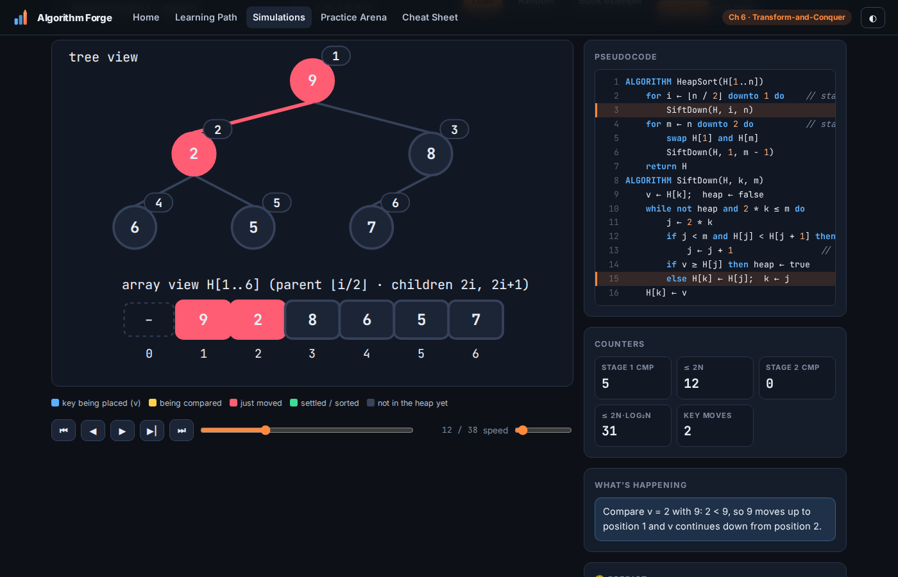</a><br><sub><b>Heap Lab</b>: the tree and the array stay in sync during heapify and heapsort</sub></td>
</tr>
</table>

---

## 📝 CSC 501 practice kit

Everything from the course, redone so you can learn from it rather than just read it:

| | What you get |
|---|---|
| [**Quiz bank**](practice/quizzes/README.md) · [interactive quiz](https://normansrule.github.io/algorithm-forge/quiz.html) | All 19 course quiz questions, plus 98 new ones (117 in the interactive quiz). Every answer explains why it's right *and* why each distractor is wrong. |
| [**Assignment 1**](practice/assignments/assignment-1.md) (Ch 1–2) · [**Assignment 2**](practice/assignments/assignment-2.md) (Ch 3–4) | Worked solutions to the Levitin exercises: idea → pseudocode → why it's correct → count → Θ. Most are also Arena problems. |
| [**Midterm 1**](practice/midterm-1/README.md) · [**Practice Exam 2**](practice/midterm-1/practice-exam-2.md) | The sample exam and Midterm 1 fully worked (linear algorithms, recursive + non-recursive designs, exhaustive search, backward substitution), plus a fresh exam in the same style. |
| [**Exam strategies**](practice/exam-strategies.md) | How to attack each of the four question types, with fill-in templates. |
| [**Empirical-analysis lab**](practice/empirical-analysis-lab/README.md) · [in-browser lab](https://normansrule.github.io/algorithm-forge/sims/empirical-lab.html) | The SortAnalysis project: why the given counter is misplaced, the fix, Java + Python experiments on 20 random arrays per size, scatter plots, the ≈ n²/4 hypothesis and the n = 10,000 estimate (≈ 25,007,000 comparisons). |

<p align="center"></p>

---

## 💻 Code you can run

```bash
# 1) The site: every page is plain HTML/JS, so any static server works
python3 -m http.server 8000 --directory docs      # then open http://localhost:8000

# 2) Python library: every algorithm in the course, instrumented with operation counters
python3 -m venv .venv && . .venv/bin/activate     # a virtual environment (needed on recent Ubuntu/Debian)
python3 -m pip install -e . pytest                 # installs the algoforge package (src/python)
python3 -m pytest                                  # the whole test suite

# 3) Java: core algorithms + the SortAnalysis empirical project
javac -d build src/java/algoforge/*.java && java -cp build algoforge.SelfTest
cd practice/empirical-analysis-lab && javac -d build SortAnalysis.java && java -cp build SortAnalysis 20; cd -

# 4) The pseudocode engine and the problem bank
node tests/engine/forge-pseudo.test.mjs            # interpreter unit tests
node tools/validate-problems.mjs                   # every problem: reference solution passes,
                                                   # starter fails, every known mistake is caught
node tools/check-lesson-pseudocode.mjs             # every lesson ALGORITHM block is valid pseudocode
python3 tools/check_links.py                       # every link in the repo and site resolves
```

```python
from algoforge.ch04_decrease_conquer import insertion_sort
from algoforge.counters import OpCounter

c = OpCounter()
print(insertion_sort([89, 45, 68, 90, 29, 34, 17], counter=c))   # [17, 29, 34, 45, 68, 89, 90]
print(c["comparisons"])   # the exact key-comparison count Levitin analyzes
```

---

## 🧱 What's inside

```text
algorithm-forge/
├── README.md                  ← you are here (home base)
├── lessons/                   ← 18 lessons: 00 Start Here · 01–12 Levitin · 13–17 Beyond the textbook
├── practice/                  ← quizzes · assignments · midterm · exam strategies · empirical-analysis lab
├── cheatsheets/               ← asymptotics · sums & recurrences · design strategies · complexity table · pseudocode
├── docs/                      ← the GitHub Pages site (no build step)
│   ├── index.html path.html cheatsheet.html quiz.html
│   ├── sims/                  ← 48 interactive simulations
│   ├── arena/                 ← the Arena UI, grading worker, and problems/ (213 problems in 11 packs)
│   ├── engine/                ← forge-pseudo.js (interpreter) · forge-check.js (grader)
│   └── assets/                ← design system: forge.css · forge-kit.js
├── src/python/algoforge/      ← tested Python implementations with operation counters
├── src/java/algoforge/        ← Java implementations + self-test
├── tests/                     ← pytest suite + engine tests
├── tools/                     ← validators, link checker, visual generators
└── assets/                    ← README animations (svg/) and screenshots (img/)
```

**How a problem is graded:** [`docs/engine/forge-check.js`](docs/engine/forge-check.js) runs your code on
hand-written edge cases plus seeded random tests, compares against a reference oracle, enforces operation budgets,
fits your operation counts over doubling input sizes to an efficiency class, and matches wrong outputs against known
**mutants** (real student mistakes) to choose the nudge. The problem format is documented in
[`docs/arena/PROBLEM_FORMAT.md`](docs/arena/PROBLEM_FORMAT.md); adding a problem or simulation is covered in
[`CONTRIBUTING.md`](CONTRIBUTING.md).

---

## 🚀 Publish the site (one time)

1. Push this repository to GitHub as `Normansrule/algorithm-forge`.
2. **Settings → Pages → Build and deployment → Source: Deploy from a branch → Branch: `main`, folder: `/docs`** → Save.
3. After about a minute the site is live at **https://normansrule.github.io/algorithm-forge/**.

The Continuous Integration (CI) workflow in [`.github/workflows/ci.yml`](.github/workflows/ci.yml) runs every test,
validator and link check on each push.

---

## 📚 References and further learning (English)

- **Primary:** A. Levitin, *Introduction to the Design and Analysis of Algorithms*, 3rd ed., Pearson, 2012.
  Lessons cite sections like "(Levitin §4.4)". The book's text is not reproduced here; all explanations, examples
  and problems are original or paraphrased, so buy or borrow the book.
- T. H. Cormen, C. E. Leiserson, R. L. Rivest, C. Stein, *Introduction to Algorithms* (CLRS), 4th ed., MIT Press.
- R. Sedgewick, K. Wayne, *Algorithms*, 4th ed.: [algs4.cs.princeton.edu](https://algs4.cs.princeton.edu/)
- Massachusetts Institute of Technology (MIT) OpenCourseWare 6.006 *Introduction to Algorithms*:
  [ocw.mit.edu/courses/6-006-introduction-to-algorithms-spring-2020](https://ocw.mit.edu/courses/6-006-introduction-to-algorithms-spring-2020/)
- [VisuAlgo](https://visualgo.net/en), for more animations; [cp-algorithms.com](https://cp-algorithms.com/), for competitive-programming depth.
- YouTube (English): Abdul Bari's *Algorithms* playlist; William Fiset's graph theory series; Back To Back SWE.

## 🤝 Contributing & license

Issues and pull requests are welcome; see [`CONTRIBUTING.md`](CONTRIBUTING.md). Code and original content are
released under the [MIT License](LICENSE). Textbook content is © Pearson Education and is only cited, never copied.

<p align="center"><sub>Built by Aleksander Norman: learn it visually, build it by hand, prove it with math.</sub></p>
