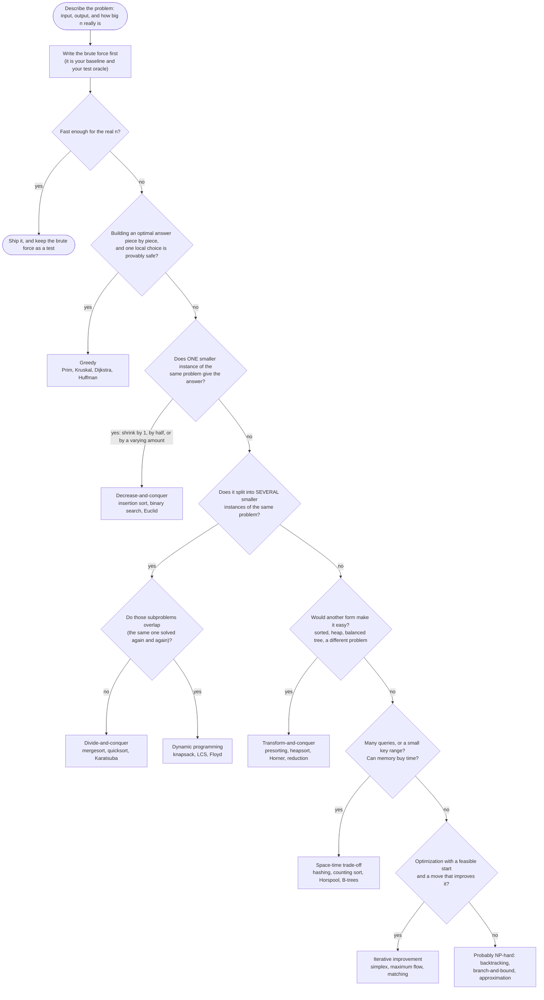

# 🧭 Design Strategies Cheat Sheet — Which Strategy Fits My Problem?

> **Use it when** you face a new problem and don't know where to start. Follow the flowchart, then copy the
> template for the strategy it points to. Every template below is real **Forge Pseudocode**: it runs in the
> Practice Arena and was checked by `tools/check-pseudocode-snippets.mjs`.
> Live, printable version: <https://normansrule.github.io/algorithm-forge/cheatsheet.html#strategies>

Acronyms on this page: Dynamic Programming (DP), Traveling Salesman Problem (TSP), Minimum Spanning Tree (MST),
Longest Common Subsequence (LCS), Depth-First Search (DFS), Breadth-First Search (BFS),
Adelson-Velsky–Landis (AVL) tree, Binary Search Tree (BST), Nondeterministic Polynomial time (NP).

---

## 1. The decision flowchart



**Three questions that settle most cases**

1. *What is the smallest version of this problem, and how does the answer for a bigger one reuse it?* (decrease,
   divide, DP)
2. *If I take the obvious best-looking step, can I prove I never regret it?* (greedy — prove it with an exchange
   argument, or find a counterexample on a tiny input)
3. *Would the problem be trivial if the data were sorted / in a heap / in a hash table?* (transform, space-time)

## 2. The strategies at a glance

| Strategy | Core move | Typical recurrence or count | Signature problems |
|---|---|---|---|
| Brute force | Do what the definition says | a sum over all pairs or positions | selection sort, string matching, closest pair, element uniqueness |
| Exhaustive search | Generate every candidate, keep the best | $2^n$ subsets or $n!$ permutations | TSP, knapsack, assignment, subset-sum |
| Decrease-and-conquer | Solve **one** smaller instance, extend it | $T(n) = T(n-1) + f(n)$ or $T(n/b) + f(n)$ | insertion sort, topological sort, binary search, Euclid, quickselect |
| Divide-and-conquer | Solve **several** independent smaller instances, combine | $T(n) = aT(n/b) + f(n)$ | mergesort, quicksort, Karatsuba, Strassen, closest pair |
| Transform-and-conquer | Change the representation or the problem | cost of the transform + cost of the easy version | presorting, Gaussian elimination, heaps, AVL and 2-3 trees, Horner, reductions |
| Space-time trade-off | Precompute a table or index | extra memory $\Theta(\text{range})$ or $\Theta(n)$ | counting sort, Horspool, Boyer–Moore, hashing, B-trees |
| Dynamic programming | Solve each overlapping subproblem **once**, in a table | table size × work per cell | coin-row, change-making, knapsack, LCS, optimal BST, Warshall, Floyd |
| Greedy | Take the locally best piece; never undo | often a sort plus a heap: $\Theta(n \log n)$ | Prim, Kruskal, Dijkstra, Huffman, activity selection |
| Iterative improvement | Start feasible; improve until no move helps | number of improving steps × cost per step | simplex, maximum flow, bipartite matching, stable marriage |
| Backtracking / branch-and-bound | Build partial solutions; abandon hopeless ones early | exponential worst case, much less in practice | n-queens, subset-sum, Hamiltonian circuit, knapsack, assignment |
| Approximation | Accept a provably near-optimal answer quickly | polynomial | twice-around-the-tree TSP, greedy knapsack, first-fit decreasing bin packing |

## 3. Templates in Forge Pseudocode

Each template is the smallest real algorithm that shows the strategy's shape. Keep the shape, swap the details.

### Brute force — check every pair

<!-- test: {"args": [[3, 1, 4, 1, 5]], "expect": false} -->
```
ALGORITHM UniqueElements(A[0..n-1])
    // Brute force: compare every pair exactly once
    for i ← 0 to n - 2 do
        for j ← i + 1 to n - 1 do
            if A[i] = A[j] then return false
    return true
```
Cost: $\sum_{i=0}^{n-2}(n-1-i) = n(n-1)/2$ comparisons in the worst case.

### Exhaustive search — try every subset

<!-- test: {"args": [[7, 3, 4, 5], [42, 12, 40, 25], 10], "expect": 65} -->
```
ALGORITHM BestSubsetValue(W[0..n-1], V[0..n-1], cap)
    // Exhaustive search: each number mask in 0 .. 2^n - 1 encodes one subset of the items
    best ← 0
    for mask ← 0 to 2^n - 1 do
        weight ← 0
        value ← 0
        m ← mask
        for i ← 0 to n - 1 do
            if m mod 2 = 1 then
                weight ← weight + W[i]
                value ← value + V[i]
            m ← m div 2
        if weight ≤ cap and value > best then best ← value
    return best
```
Cost: $\Theta(n 2^n)$. Fine for $n \le 20$, hopeless for $n = 60$.

### Decrease-and-conquer — by one (insertion sort)

<!-- test: {"args": [[89, 45, 68, 90, 29, 34, 17]], "expect": [17, 29, 34, 45, 68, 89, 90]} -->
```
ALGORITHM InsertionSort(A[0..n-1])
    // Decrease by one: A[0..i-1] is already sorted; insert A[i] into it
    for i ← 1 to n - 1 do
        v ← A[i]
        j ← i - 1
        while j ≥ 0 and A[j] > v do
            A[j + 1] ← A[j]
            j ← j - 1
        A[j + 1] ← v
    return A
```

### Decrease-and-conquer — by a constant factor (binary search)

<!-- test: {"args": [[3, 14, 27, 31, 39, 42, 55, 70, 74, 81, 85, 93, 98], 70], "expect": 7} -->
```
ALGORITHM BinarySearch(A[0..n-1], K)
    // Decrease by half: each comparison throws away half of the remaining range
    l ← 0
    r ← n - 1
    while l ≤ r do
        m ← ⌊(l + r) / 2⌋
        if K = A[m] then return m
        else if K < A[m] then r ← m - 1
        else l ← m + 1
    return -1
```

### Decrease-and-conquer — variable size (Euclid)

<!-- test: {"args": [60, 24], "expect": 12} -->
```
ALGORITHM Euclid(m, n)
    // Variable-size decrease: gcd(m, n) = gcd(n, m mod n)
    while n ≠ 0 do
        r ← m mod n
        m ← n
        n ← r
    return m
```

### Divide-and-conquer — mergesort

<!-- test: {"args": [[8, 3, 2, 9, 7, 1, 5, 4]], "expect": [1, 2, 3, 4, 5, 7, 8, 9]} -->
```
ALGORITHM Mergesort(A[0..n-1])
    // Divide: split into halves. Conquer: sort each. Combine: merge.
    if n > 1 then
        B ← A[0..⌊n/2⌋ - 1]
        C ← A[⌊n/2⌋..n - 1]
        Mergesort(B)
        Mergesort(C)
        Merge(B, C, A)
    return A

ALGORITHM Merge(B, C, A)
    // Merges sorted lists B and C into A
    p ← length(B)
    q ← length(C)
    i ← 0
    j ← 0
    k ← 0
    while i < p and j < q do
        if B[i] ≤ C[j] then
            A[k] ← B[i]
            i ← i + 1
        else
            A[k] ← C[j]
            j ← j + 1
        k ← k + 1
    while i < p do
        A[k] ← B[i]
        i ← i + 1
        k ← k + 1
    while j < q do
        A[k] ← C[j]
        j ← j + 1
        k ← k + 1
```
Recurrence: $C(n) = 2C(n/2) + (n - 1)$ comparisons in the worst case, so $\Theta(n \log n)$ by the Master Theorem.

### Transform-and-conquer — presort, then scan

<!-- test: {"args": [[3, 1, 4, 1, 5]], "expect": false} -->
```
ALGORITHM PresortUnique(A[0..n-1])
    // Transform: after sorting, equal elements sit next to each other
    B ← sorted(A)
    for i ← 0 to n - 2 do
        if B[i] = B[i + 1] then return false
    return true
```
Cost: $\Theta(n \log n)$ for the sort + $\Theta(n)$ for the scan, instead of $\Theta(n^2)$.

### Space-time trade-off — distribution counting

<!-- test: {"args": [[13, 11, 12, 13, 12, 12], 11, 13], "expect": [11, 12, 12, 12, 13, 13]} -->
```
ALGORITHM CountingSort(A[0..n-1], l, u)
    // Space for time: count each value in the small range l..u, then place keys directly
    D ← array(u - l + 1, 0)
    for i ← 0 to n - 1 do
        D[A[i] - l] ← D[A[i] - l] + 1
    for j ← 1 to u - l do
        D[j] ← D[j - 1] + D[j]
    S ← array(n, 0)
    for i ← n - 1 downto 0 do
        j ← A[i] - l
        S[D[j] - 1] ← A[i]
        D[j] ← D[j] - 1
    return S
```
Cost: $\Theta(n + (u - l))$, with no key comparisons at all. Stable, because the last loop runs right to left.

### Dynamic programming — coin-row

<!-- test: {"args": [[5, 1, 2, 10, 6, 2]], "expect": 17} -->
```
ALGORITHM CoinRow(C[1..n])
    // F[i] = best total using only the first i coins (no two adjacent)
    F ← array(n + 1, 0)
    F[1] ← C[1]
    for i ← 2 to n do
        F[i] ← max(C[i] + F[i - 2], F[i - 1])
    return F[n]
```
The recipe: (1) define what a table cell means in words, (2) write the recurrence, (3) find the base cases,
(4) fill the table in an order where every cell's inputs are ready, (5) trace back if you need the choices.

### Greedy — activity selection

<!-- test: {"args": [[1, 3, 0, 5, 8, 5], [2, 4, 6, 7, 9, 9]], "expect": 4} -->
```
ALGORITHM MaxActivities(S[0..n-1], E[0..n-1])
    // Greedy: activities are already sorted by finish time;
    // always take the next one that starts after the last chosen one ends
    count ← 1
    lastEnd ← E[0]
    for i ← 1 to n - 1 do
        if S[i] ≥ lastEnd then
            count ← count + 1
            lastEnd ← E[i]
    return count
```
Why it is safe: the activity that ends first leaves the most room for the rest (an exchange argument).
With the sort, the cost is $\Theta(n \log n)$.

### Iterative improvement — augmenting paths (bipartite matching)

<!-- test: {"args": [[[0, 1], [0], [1, 2]], 3], "expect": 3} -->
```
ALGORITHM MaxMatching(adj, m)
    // adj[u] = right-side vertices that left vertex u may be matched to; m = size of the right side
    // Start with the empty matching (feasible) and grow it along augmenting paths
    matchR ← array(m, -1)
    size ← 0
    for u ← 0 to length(adj) - 1 do
        seen ← array(m, false)
        if Augment(u, adj, matchR, seen) then size ← size + 1
    return size

ALGORITHM Augment(u, adj, matchR, seen)
    // Finds an alternating path from u to a free right vertex and flips it
    for each v in adj[u] do
        if not seen[v] then
            seen[v] ← true
            if matchR[v] = -1 or Augment(matchR[v], adj, matchR, seen) then
                matchR[v] ← u
                return true
    return false
```
Each successful augmentation adds one matched pair; when none exists, the matching is maximum (Levitin §10.3).

### Backtracking — n-queens

<!-- test: {"args": [6], "expect": 4} -->
```
ALGORITHM CountQueens(n)
    // Place one queen per row; back up as soon as a placement is attacked
    col ← array(n, 0)
    return Place(0, n, col)

ALGORITHM Place(r, n, col)
    if r = n then return 1
    total ← 0
    for c ← 0 to n - 1 do
        ok ← true
        for k ← 0 to r - 1 do
            if col[k] = c or |col[k] - c| = r - k then ok ← false
        if ok then
            col[r] ← c
            total ← total + Place(r + 1, n, col)
    return total
```

### Branch-and-bound — knapsack with an optimistic bound

<!-- test: {"args": [[4, 7, 5, 3], [40, 42, 25, 12], 10], "expect": 65} -->
```
ALGORITHM KnapsackBB(W[0..n-1], V[0..n-1], cap)
    // Items are pre-sorted by value/weight ratio, best first
    best ← [0]
    Explore(0, 0, 0, W, V, cap, best)
    return best[0]

ALGORITHM Explore(i, w, v, W, V, cap, best)
    if v > best[0] then best[0] ← v
    if i = length(W) then return 0
    // Bound: fill the remaining capacity at the best remaining ratio (never an underestimate)
    ub ← v + (cap - w) * V[i] / W[i]
    if ub ≤ best[0] then return 0
    if w + W[i] ≤ cap then Explore(i + 1, w + W[i], v + V[i], W, V, cap, best)
    Explore(i + 1, w, v, W, V, cap, best)
    return 0
```
The bound prunes every branch that cannot beat the best complete solution found so far (Levitin §12.2).

## 4. Proof tools that go with each strategy

| Strategy | How you argue it is correct | How you get its cost |
|---|---|---|
| Brute force, iterative loops | loop invariant (initialization, maintenance, termination) | sums |
| Decrease / divide-and-conquer | induction on n | recurrences, Master Theorem |
| Dynamic programming | the recurrence is correct (optimal substructure) + fill order | table size × work per cell |
| Greedy | exchange argument, or "greedy stays ahead" | usually sort + heap operations |
| Iterative improvement | a certificate of optimality (min cut, no augmenting path) | number of iterations × cost each |
| Backtracking / branch-and-bound | every pruned branch provably contains no better solution | worst case exponential; measure in practice |

---
⬅️ [Cheat sheet page](https://normansrule.github.io/algorithm-forge/cheatsheet.html) · Lesson: [Start Here](../lessons/00-start-here/README.md) · [Senior Engineer Playbook](../lessons/17-senior-engineer-playbook/README.md)
