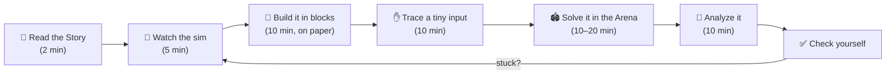
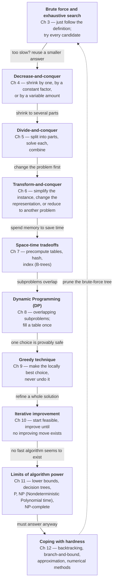
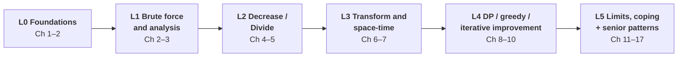

# 00 · Start Here — How to Learn in the Forge

> **Algorithm Forge** teaches you to *build* algorithms from nothing — picture first, then words, then blocks of
> pseudocode, then real code, then the math that proves how fast it is. You do not need to be "a math person" or
> "a visual person." You need a method and a lot of small, honest reps. This page gives you both.

**Badges:** 🎮 [All simulations](https://normansrule.github.io/algorithm-forge/sims/) · 🏟️ [Practice Arena](https://normansrule.github.io/algorithm-forge/arena/) · 🐍 [Python library](../../src/python/algoforge/) · 📝 [Practice sets](../../practice/) · ➡️ [First lesson: Introduction](../01-introduction/README.md)

---

## 1. What this repo is (and the order to use it in)

Every chapter of the course (and of Levitin's *Introduction to the Design and Analysis of Algorithms*, 3rd ed.) has:

| Piece | Where | What it is for |
|---|---|---|
| 📘 Lesson | `lessons/NN-*/README.md` | The explanation, built as a stack of **Algorithm Build Cards** |
| 🎮 Simulation | `docs/sims/*.html` (live on the site) | Watch the algorithm run step by step on *your* input, with the current pseudocode line highlighted |
| 🏟️ Arena | `docs/arena/` (live on the site) | Write Forge Pseudocode, run it against hidden tests, see operation counts |
| 🐍 / ☕ Code | `src/python/algoforge/`, `src/java/` | Tested, instrumented implementations (they count basic operations for you) |
| 📝 Practice | `practice/` | Quizzes, assignment-style sets, midterm-style questions, the empirical-analysis lab |

A good loop for one algorithm takes 30–60 minutes:



The loop is deliberately circular. If you get stuck at *any* step, go back to the picture.

---

## 2. Find your way in — tips for different kinds of learners

Nobody is only one "type" of learner, and research on fixed learning styles is weak. But everyone has a
*favorite first door*. Pick yours, then walk through the others too — the understanding that sticks is the one you
have seen from several sides.

### 👀 "I need to see it"
- Open the simulation **before** reading the lesson. Press ▶, then step backward and forward with the player.
- Use the sim's custom-input box: type the exact array from a trace table in the lesson and watch it match.
- Draw every algorithm as boxes and arrows on paper. For arrays, draw cells; for recursion, draw the call tree.
- In the lessons, look for the 👀 **See it** section and the mermaid diagrams — they are there for you.

### 🗣️ "I need to hear / read it in words"
- Read the 📖 **Story** first, then say the algorithm out loud in one sentence ("Find the smallest, swap it to the
  front, repeat on the rest").
- Explain the algorithm to a rubber duck (or a friend) without looking. Where you stumble is what you don't know yet.
- Each sim narrates every frame in a full sentence; read the narration panel instead of watching the bars.

### ✋ "I learn by doing"
- Go straight to the 🏟️ Arena problem for the algorithm and try it cold. Fail fast, then read the Build Card.
- Do the ✋ **Trace it by hand** table with a pencil *before* looking at the filled-in one.
- Break things on purpose: change `<` to `≤`, or `n - 1` to `n`, in the Arena and predict what goes wrong.

### ∑ "Show me the math first"
- Jump to the 🧮 **Analyze it** block of each card, then go back and read the code to see *why* the sum looks that way.
- Chapter 2 ([Analysis Framework](../02-analysis-framework/README.md)) is your home base — it has every summation
  formula and recurrence technique used later.
- Try to prove each algorithm correct with a loop invariant or induction before you trust the trace.

### 🗺️ "I need the big picture first"
- Read only the **"The big idea in 60 seconds"** section of every lesson (1–17) in one sitting. It takes about an hour
  and gives you the whole map.
- Keep the [design-strategy map](#4-the-design-strategy-map) below open. For each new algorithm, ask: *which box is it in?*
- Use the "How a senior engineer thinks" sections — they connect textbook ideas to real systems.

### 🐾 "I need tiny steps"
- Use the 🧱 **Build it in blocks** section: it grows the pseudocode one block at a time. Copy each block onto
  paper before reading the next one.
- Use the smallest input possible (n = 3 or 4). Tiny inputs are not cheating; they are how professionals debug.
- In the sim, turn the speed all the way down and use **Step** instead of **Play**.
- Stop after each card. One card fully understood beats a chapter skimmed.

---

## 3. The Algorithm Build Card method

Every major algorithm in every lesson is presented as the same card. Once you know the card, you know how to learn
*any* algorithm — including ones that are not in this repo.

| Part | Question it answers | Why it helps |
|---|---|---|
| 🎯 **Problem in one sentence** | What goes in, what comes out? | If you cannot say it in one sentence, you cannot design it. |
| 📖 **Story** | What real-life action does this copy? | Your intuition already knows many algorithms (sorting cards, looking up a word). |
| 👀 **See it** | What does it look like while running? | Pictures show *invariants* — what stays true each step. |
| 🧱 **Build it in blocks** | How would I write it from scratch? | Four blocks: **1 state/variables**, **2 loop or recursion skeleton**, **3 the decision**, **4 the return**. |
| ✋ **Trace it by hand** | Does my mental model match reality? | A trace table is the single best debugging tool you own. |
| 💻 **Code** | How does it look in Forge Pseudocode, Python, Java? | Same idea, three notations. |
| 🧮 **Analyze it** | How fast, in the best/worst/average case? | Input size → basic operation → sum or recurrence → efficiency class. |
| ⚠️ **Common mistakes** | Where do people (and I) usually slip? | Off-by-one bounds, wrong counter placement, forgotten base cases. |
| 🔁 **Variations / real use** | Where does this show up in real software? | Transfers the idea beyond the exam. |

### The four blocks, in one example

Here is the Build Card idea on the tiniest possible problem, *find the largest element of an array*.

**Block 1 — state.** What do I need to remember while I work? "The biggest value seen so far."

```
maxval ← A[0]
```

**Block 2 — skeleton.** How do I visit everything? "Look at each remaining element once."

```
maxval ← A[0]
for i ← 1 to n - 1 do
    // ... decision goes here
```

**Block 3 — decision.** What do I do with each element? "If it beats the champion, it becomes the champion."

```
maxval ← A[0]
for i ← 1 to n - 1 do
    if A[i] > maxval then
        maxval ← A[i]
```

**Block 4 — return.** What is the answer when the loop is over?

```
ALGORITHM MaxElement(A[0..n-1])
    // Returns the value of the largest element in A
    maxval ← A[0]
    for i ← 1 to n - 1 do
        if A[i] > maxval then
            maxval ← A[i]
    return maxval
```

That is the entire method. Big algorithms (Dijkstra, dynamic programming tables, simplex) are still just these four
blocks — the state is richer and the decision is smarter.

### How to write your own trace table

1. One column per variable that changes, plus one for "what just happened."
2. One row per loop iteration (or per recursive call).
3. Fill it **before** running the code. Then run the sim or Arena with the same input and compare.
4. When they disagree, the first row where they differ is where your mental model is wrong.

---

## 4. The design-strategy map

The course is organized by **design strategy**, not by problem. Each strategy is a *question you ask* about a new
problem. They are roughly ordered from "least cleverness required" to "most."



**How to use the map on a new problem:**

1. Write the brute-force solution first (Chapter 3). It is your correctness oracle and your baseline.
2. Ask: *Can I solve a slightly smaller instance and extend it?* → decrease-and-conquer.
3. Ask: *Can I split it into independent halves?* → divide-and-conquer.
4. Ask: *Would sorting, balancing, or re-representing the input make it easy?* → transform-and-conquer.
5. Ask: *Would a table, hash, or index make lookups instant?* → space-time tradeoff.
6. Ask: *Do subproblems repeat?* → dynamic programming. *Is one choice always safe?* → greedy.
7. If none work and the problem looks like "try all subsets/orderings," check Chapter 11 — it may be NP-hard, and
   Chapter 12 tells you how to cope.

---

## 5. Forge Pseudocode — the complete reference

All lessons, simulations, and the Arena use **Forge Pseudocode**, a Levitin-style pseudocode that the Arena
actually executes. Write it the way you would on an exam, and it will run.

### 5.1 Anatomy of an algorithm

```
ALGORITHM SequentialSearch(A[0..n-1], K)
    // Searches for a given value in a given array by sequential search
    // Input: An array A[0..n-1] and a search key K
    // Output: The index of the first element equal to K, or -1 if none
    i ← 0
    while i < n and A[i] ≠ K do
        i ← i + 1
    if i < n then
        return i
    else
        return -1
```

- **Header:** `ALGORITHM Name(parameters)`. A parameter written `A[0..n-1]` binds **both** the array `A` and its
  length `n`. A parameter written `A[l..r]` binds `l` and `r` as the first and last index of the part you are
  working on.
- **Comments:** start with `//`. The Input/Output comment lines are optional for the Arena but expected on exams.
- **Blocks:** by indentation, 4 spaces per level (no `begin`/`end`, no braces).

### 5.2 Statements and operators

| You want | Write | Also accepted |
|---|---|---|
| Assignment | `x ← 5` | `x <- 5`, `x := 5` |
| Equality test | `x = y` | |
| Not equal / ≤ / ≥ | `x ≠ y`, `x ≤ y`, `x ≥ y` | `!=`, `<=`, `>=` |
| Boolean logic | `and`, `or`, `not` | |
| Integer division, remainder | `m div n`, `m mod n` | |
| Floor, ceiling | `⌊x⌋`, `⌈x⌉` | `floor(x)`, `ceil(x)` |
| Swap two cells | `swap A[i] and A[j]` | `A[i] ↔ A[j]` |
| Return | `return x` | |
| Infinity, booleans, nothing | `∞`, `true`, `false`, `null` | `infinity` |
| Character / string literal | `'A'`, `"text"` | |
| List literal | `[]` (empty), `[i, j]` | |

`and` / `or` short-circuit, left to right. That is what makes `while i < n and A[i] ≠ K` safe: when `i = n`, the
array is never touched.

### 5.3 Loops and branches

```
for i ← 0 to n - 1 do          // counts up, both ends inclusive
    ...
for i ← n - 1 downto 0 do      // counts down, both ends inclusive
    ...
for each x in S do             // every element of a list / array
    ...
while condition do             // test before each pass (may run 0 times)
    ...
repeat                         // test after each pass (runs at least once)
    ...
until condition

if condition then
    ...
else if other condition then
    ...
else
    ...
```

A `for i ← a to b` loop whose `a > b` runs **zero** times. This is exactly why `for i ← 1 to n - 1` is safe for a
one-element array.

### 5.4 Arrays, views, and copies

```
ALGORITHM SumRange(A[l..r])
    // Adds up A[l], ..., A[r]
    s ← 0
    for i ← l to r do
        s ← s + A[i]
    return s
```

- `SumRange(A[0..n-1])` sums the whole array. `SumRange(A[3..7])` sums positions 3 through 7.
- Calling `F(A[l..s-1])` passes a **view** of the same array — changes made inside `F` are visible to the caller.
  This is how in-place recursive sorts (quicksort, mergesort) are written.
- `B ← A[0..m-1]` makes a **copy** of the first `m` elements.
- Two-dimensional arrays: create with `matrix(r, c, fill)` and index as `M[i, j]`.

### 5.5 Built-in functions

| Built-in | Meaning |
|---|---|
| `length(A)` | number of elements |
| `array(n, fill)` | new array of `n` cells, all equal to `fill` |
| `matrix(r, c, fill)` | new `r × c` table, all cells `fill` |
| `min(a, b)`, `max(a, b)`, `abs(x)`, `sqrt(x)`, `floor(x)`, `ceil(x)`, `log2(x)` | the usual math |
| `append(L, x)` | add `x` at the end of list `L` |
| `push(S, x)`, `pop(S)`, `top(S)` | stack operations |
| `enqueue(Q, x)`, `dequeue(Q)`, `front(Q)` | queue operations |
| `isEmpty(C)` | true if a list/stack/queue has no elements |

Lessons write an empty list as `[]` and a small literal list as `[a, b]`.

### 5.6 Calling other algorithms and recursion

You may put several `ALGORITHM` blocks together; any of them may call the others, including itself.

```
ALGORITHM F(n)
    // Computes n! recursively
    if n = 0 then
        return 1
    else
        return F(n - 1) * n
```

### 5.7 Style rules that save points on exams

1. Name the input size in the header (`A[0..n-1]`) so the reader knows what `n` means.
2. Always state what the algorithm returns in an `// Output:` comment.
3. Use 0-based indexing, like Levitin and like the Arena. If you switch to 1-based, say so.
4. Keep one idea per line. The grader (and the Arena's highlighter) reads line by line.

### 5.8 Translating to Python and Java

| Forge | Python | Java |
|---|---|---|
| `for i ← 0 to n - 1 do` | `for i in range(n):` | `for (int i = 0; i <= n - 1; i++)` |
| `for i ← n - 1 downto 0 do` | `for i in range(n - 1, -1, -1):` | `for (int i = n - 1; i >= 0; i--)` |
| `m div n`, `m mod n` | `m // n`, `m % n` | `m / n`, `m % n` (ints) |
| `swap A[i] and A[j]` | `A[i], A[j] = A[j], A[i]` | `int t = A[i]; A[i] = A[j]; A[j] = t;` |
| `repeat … until c` | `while True: …; if c: break` | `do { … } while (!c);` |

⚠️ In Python and Java, `%` on a negative number behaves differently (Python: `-7 % 3 == 2`; Java: `-7 % 3 == -1`).
The algorithms in this course use `mod` only on non-negative numbers unless a lesson says otherwise.

---

## 6. Study plans

### 6.1 A 12-week plan (one semester)

Plan on about 6–8 hours per week: 2 for lessons + sims, 2–3 for the Arena, 2–3 for written practice.

| Week | Chapters | Lessons | Do in the Arena / Practice | Milestone |
|---|---|---|---|---|
| 1 | 1 | [01 Introduction](../01-introduction/README.md) | Level 0 — gcd, sieve, basic loops | Can write any algorithm as a Build Card |
| 2 | 2.1–2.3 | [02 Analysis](../02-analysis-framework/README.md) (first half) | Level 0–1 — count operations, set up sums | Can turn a loop nest into a sum and simplify it |
| 3 | 2.4–2.7 | [02 Analysis](../02-analysis-framework/README.md) (second half) | Recurrence Lab sim; empirical-analysis lab | Can solve recurrences by backward substitution |
| 4 | 3 | [03 Brute Force](../03-brute-force/README.md) | Level 1 — sorts, string match, exhaustive search, Depth-First Search (DFS) / Breadth-First Search (BFS) | Assignment 1 & 2 style problems |
| 5 | 4 | [04 Decrease-and-Conquer](../04-decrease-and-conquer/README.md) | Level 2 — insertion sort, topological sort, binary search | Can write recursive **and** iterative versions |
| 6 | 5 | [05 Divide-and-Conquer](../05-divide-and-conquer/README.md) | Level 2 — mergesort, quicksort, tree traversals | Can set up $T(n)=aT(n/b)+f(n)$ and use the Master Theorem |
| 7 | review + 6.1–6.3 | [06 Transform-and-Conquer](../06-transform-and-conquer/README.md) (start) | Midterm practice set | **Midterm 1** |
| 8 | 6 | [06 Transform-and-Conquer](../06-transform-and-conquer/README.md) | Level 3 — presorting, heaps, Horner, AVL (Adelson-Velsky–Landis) trees | Can pick a representation that makes a problem easy |
| 9 | 7 | [07 Space-Time Tradeoffs](../07-space-time-tradeoffs/README.md) | Level 3 — counting sort, Horspool, hashing | Can trade memory for time on purpose |
| 10 | 8 | [08 Dynamic Programming](../08-dynamic-programming/README.md) | Level 4 — coin-row, knapsack, Warshall/Floyd | Can define a DP table and its recurrence |
| 11 | 9–10 | [09 Greedy](../09-greedy/README.md), [10 Iterative Improvement](../10-iterative-improvement/README.md) | Level 4 — Prim, Kruskal, Dijkstra, Huffman, max-flow | Can argue why a greedy choice is safe (or find a counterexample) |
| 12 | 11–12 (+13–17 as bonus) | [11 Limitations](../11-limitations/README.md), [12 Coping](../12-coping-with-limitations/README.md) | Level 5 — backtracking, branch-and-bound, approximation | **Final**; senior-pattern tracks as time allows |

### 6.2 Crash plan — the 5 days before an exam

| Day | Focus | Concrete tasks |
|---|---|---|
| −5 | **Map** | Read every "Big idea in 60 seconds" for the exam's chapters. Rebuild the strategy map from memory. |
| −4 | **Analysis mechanics** | Do 5 sums and 5 recurrences by backward substitution from [02](../02-analysis-framework/README.md) without looking. |
| −3 | **Design drills** | For each chapter, design one algorithm from scratch in both recursive and nonrecursive form; analyze both. |
| −2 | **Timed mock** | Do a midterm-style set from `practice/` under time pressure. Mark every place you hesitated. |
| −1 | **Patch holes** | Re-watch sims only for the algorithms you hesitated on. Re-do their trace tables. Sleep. |

Exam-day reminders: state input size and basic operation explicitly; write the recurrence **with** its initial
condition; show at least three steps of backward substitution before you generalize; always finish with the
efficiency class ($\Theta(\cdot)$ if you can, $O(\cdot)$ if you only proved an upper bound).

---

## 7. How the Practice Arena levels map to chapters

The Arena groups problems into six levels. Each level is a gate: you should be comfortable with most of a level
before moving on.



| Level | Chapters | You can… | Arena link |
|---|---|---|---|
| **L0** Foundations | 1–2 | write loops and simple recursion in Forge Pseudocode; count basic operations | [`?level=0`](https://normansrule.github.io/algorithm-forge/arena/?level=0) |
| **L1** Brute force & analysis | 2–3 | implement sorts, searches, exhaustive search, DFS / BFS; state their $\Theta$ | [`?level=1`](https://normansrule.github.io/algorithm-forge/arena/?level=1) |
| **L2** Decrease / Divide | 4–5 | write binary search, topological sort, mergesort, quicksort; solve their recurrences | [`?level=2`](https://normansrule.github.io/algorithm-forge/arena/?level=2) |
| **L3** Transform & space-time | 6–7 | use presorting, heaps, balanced trees, hashing, string-matching tables | [`?level=3`](https://normansrule.github.io/algorithm-forge/arena/?level=3) |
| **L4** DP / greedy / iterative improvement | 8–10 | build DP tables, prove greedy choices, run augmenting-path and simplex ideas | [`?level=4`](https://normansrule.github.io/algorithm-forge/arena/?level=4) |
| **L5** Limits, coping + senior patterns | 11–17 | argue lower bounds, reduce between problems, backtrack, branch-and-bound, approximate; use interview/production patterns | [`?level=5`](https://normansrule.github.io/algorithm-forge/arena/?level=5) |

You can also filter by chapter, e.g. [`?chapter=3`](https://normansrule.github.io/algorithm-forge/arena/?chapter=3).

---

## 8. Habits of people who get good at this

1. **Brute force first, always.** A slow correct answer is a test oracle for your fast answer.
2. **Tiny inputs.** n = 0, 1, 2, and 3 catch most bugs. Empty array. All equal. Already sorted. Reversed.
3. **Name the invariant.** "At the top of the loop, `A[0..i-1]` is sorted" is worth more than 20 lines of code.
4. **Count, don't guess.** Put a counter on the basic operation and check your formula on n = 1, 2, 4, 8, 16.
5. **Explain it in one sentence.** If you cannot, you are not done understanding it.
6. **Revisit.** Come back to an algorithm three days later and rebuild it from the blank page.

---

## 📚 Go deeper

- Levitin, *Introduction to the Design and Analysis of Algorithms*, 3rd ed. — Preface and §1.2 (the problem-solving
  process) explain the strategy-first organization this repo follows.
- MIT (Massachusetts Institute of Technology) OpenCourseWare 6.006 *Introduction to Algorithms* (Spring 2020): <https://ocw.mit.edu/courses/6-006-introduction-to-algorithms-spring-2020/>
- MIT OpenCourseWare 6.046J *Design and Analysis of Algorithms* (Spring 2015): <https://ocw.mit.edu/courses/6-046j-design-and-analysis-of-algorithms-spring-2015/>
- Sedgewick & Wayne, *Algorithms*, 4th ed. — companion site: <https://algs4.cs.princeton.edu/home/>
- Cormen, Leiserson, Rivest, Stein, *Introduction to Algorithms* (CLRS) — the standard reference when you want more proofs.
- David Galles' algorithm visualizations (University of San Francisco): <https://www.cs.usfca.edu/~galles/visualization/Algorithms.html>
- Abdul Bari — *Algorithms* lecture playlist on YouTube (English, whiteboard style; great for the "tiny steps" learner).

➡️ **Next:** [01 · Introduction — What Is an Algorithm?](../01-introduction/README.md)
