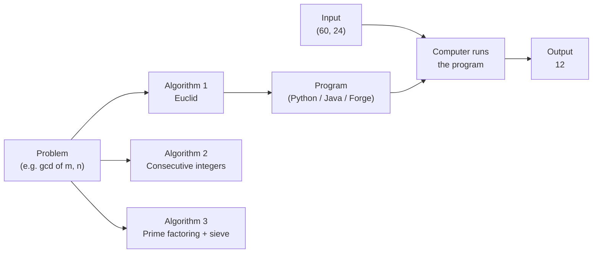
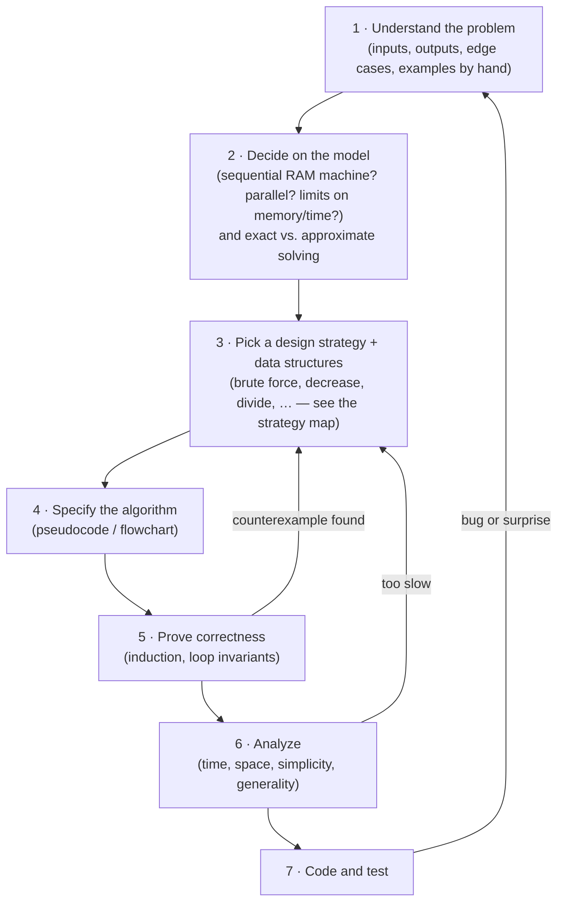

# Chapter 1 · Introduction — What Is an Algorithm?

**Why this chapter matters.** Before you can design fast algorithms you need a precise idea of what an algorithm
*is*, how to write one down so a machine (or a reader) cannot misread it, and how the same problem can have several
algorithms of wildly different speed. This chapter gives you that vocabulary with one tiny problem — the greatest
common divisor — solved three ways, plus the Sieve of Eratosthenes, the standard problem-solving process, the
problem types you will meet in every later chapter, and the data structures every later chapter assumes you know.
(Levitin Chapter 1.)

🎮 [Sim: gcd three ways + sieve](https://normansrule.github.io/algorithm-forge/sims/euclid-gcd.html) ·
🏟️ [Arena: Chapter 1 problems](https://normansrule.github.io/algorithm-forge/arena/?chapter=1) ·
🐍 [Code: `ch01_intro.py`](../../src/python/algoforge/ch01_intro.py) ·
📝 [Practice](../../practice/) ·
⬅️ [00 Start Here](../00-start-here/README.md) · ➡️ [02 Analysis Framework](../02-analysis-framework/README.md)

---

## Contents

1. [The big idea in 60 seconds](#the-big-idea-in-60-seconds)
2. [What exactly is an algorithm?](#what-exactly-is-an-algorithm)
3. [Build Card A — Euclid's algorithm](#build-card-a--euclids-algorithm)
4. [Build Card B — Consecutive integer checking](#build-card-b--consecutive-integer-checking)
5. [Build Card C — The middle-school procedure](#build-card-c--the-middle-school-procedure)
6. [Build Card D — Sieve of Eratosthenes](#build-card-d--sieve-of-eratosthenes)
7. [Build Card E — Comparison counting sort (stability and in-place)](#build-card-e--comparison-counting-sort)
8. [The algorithmic problem-solving process](#the-algorithmic-problem-solving-process)
9. [Important problem types](#important-problem-types)
10. [Fundamental data structures](#fundamental-data-structures)
11. [How a senior engineer thinks about this chapter](#how-a-senior-engineer-thinks-about-this-chapter)
12. [Check yourself](#-check-yourself)
13. [Go deeper](#-go-deeper)

---

## The big idea in 60 seconds

An **algorithm** is a finite list of unambiguous instructions that turns *every* legal input into the correct
output in a finite amount of time. A **program** is an algorithm written in a particular language, working on
particular data structures — "program = algorithm + data structure."

The same problem can be solved by very different algorithms. For $\gcd(m, n)$:

- **Euclid** repeatedly replaces $(m, n)$ by $(n,\ m \bmod n)$ — a handful of steps even for huge numbers.
- **Consecutive integer checking** tries $t = \min(m, n), \min(m,n) - 1, \dots$ until $t$ divides both — simple but
  slow.
- **Middle-school factoring** multiplies the common prime factors — familiar, but "factor the number" is not yet a
  precise instruction, so it is not an algorithm until you specify *how* (for example, with the sieve).

So the two big questions of this whole subject are already visible: **how do I design an algorithm?** and **how do I
know how good it is?**



---

## What exactly is an algorithm?

Levitin's definition, in one sentence: an algorithm is a sequence of unambiguous instructions for solving a
problem — producing the required output for any legitimate input in a finite amount of time (Levitin §1.1).

Unpack that into five checkable properties:

| Property | Plain meaning | Euclid's algorithm passes because… |
|---|---|---|
| **Unambiguous (definite)** | Every step means exactly one thing | "$r \leftarrow m \bmod n$" has one meaning |
| **Input range specified** | We say which inputs are legal | Non-negative integers, not both zero |
| **Correct output for every legal input** | Not just for the examples we tried | Proven by the identity $\gcd(m,n)=\gcd(n, m \bmod n)$ |
| **Finite** | It always stops | The second number strictly decreases and can't go below 0 |
| **Effective** | Each step can actually be carried out | Division with remainder is mechanical |

Things people get wrong about the definition:

- **"If it works on my test cases, it's correct."** No — correctness means *every* legal input. Testing can show
  the presence of bugs, not their absence.
- **"An algorithm is code."** No — the same algorithm can be written in English, as a flowchart, in pseudocode, or
  in any programming language. Levitin uses pseudocode; so do we (Forge Pseudocode, see
  [00 Start Here §5](../00-start-here/README.md#5-forge-pseudocode--the-complete-reference)).
- **"Legal inputs are obvious."** They are not. $\gcd(0, 0)$ is undefined, and the consecutive-integer algorithm
  crashes if either input is 0. Always state the input range.

> 🧠 **Where the word comes from.** "Algorithm" comes from the name of the 9th-century Persian mathematician
> Muhammad ibn Musa al-Khwarizmi, whose book on calculating with Hindu–Arabic numerals spread "algorism" through Europe.

---

## Build Card A — Euclid's algorithm

### 🎯 Problem in one sentence
Given two non-negative integers $m$ and $n$, not both zero → return the largest integer that divides both.

### 📖 Story
You want to tile a $60 \times 24$ floor with the largest possible **square** tiles, no cutting. Lay down
$24 \times 24$ squares along the long side: two fit, leaving a $12 \times 24$ strip. Now tile *that* strip with
$12 \times 12$ squares: exactly two fit, nothing left over. The last square size that fit perfectly — 12 — is the
answer. Every "leftover strip" step is one $m \bmod n$.

### 👀 See it
Open the [gcd sim](https://normansrule.github.io/algorithm-forge/sims/euclid-gcd.html), choose **Euclid**, and type
`60, 24`, then try `89, 55` (the slowest case for numbers that size — see the analysis).

```
 (m, n)          m mod n
 (60, 24)  ──▶   60 = 2·24 + 12    remainder 12
 (24, 12)  ──▶   24 = 2·12 +  0    remainder  0
 (12,  0)  ──▶   n = 0, stop: answer is m = 12
```

### 🧱 Build it in blocks

**Block 1 — state.** We only ever need the current pair $(m, n)$ and a temporary remainder $r$.

```
// state: m, n (current pair), r (remainder)
```

**Block 2 — skeleton.** Keep going as long as the second number is not zero.

```
while n ≠ 0 do
    // replace (m, n) by (n, m mod n)
```

**Block 3 — the step (the "decision" is the loop test itself).** Compute the remainder, then shift.

```
while n ≠ 0 do
    r ← m mod n
    m ← n
    n ← r
```

**Block 4 — return.** When $n = 0$, $\gcd(m, 0) = m$.

```
while n ≠ 0 do
    r ← m mod n
    m ← n
    n ← r
return m
```

### ✋ Trace it by hand

Input $(m, n) = (1071, 462)$:

| Iteration | m | n | r ← m mod n | new (m, n) |
|---|---|---|---|---|
| 1 | 1071 | 462 | 1071 − 2·462 = **147** | (462, 147) |
| 2 | 462 | 147 | 462 − 3·147 = **21** | (147, 21) |
| 3 | 147 | 21 | 147 − 7·21 = **0** | (21, 0) |
| stop | 21 | 0 | — | return **21** |

Three divisions. Check: $1071 = 3^2 \cdot 7 \cdot 17$ and $462 = 2 \cdot 3 \cdot 7 \cdot 11$, common part
$3 \cdot 7 = 21$. ✔

What if $m < n$? Try $(24, 60)$: the first step computes $24 \bmod 60 = 24$ and the pair becomes $(60, 24)$ — the
algorithm swaps them for free and costs one extra division.

### 💻 Code

```
ALGORITHM Euclid(m, n)
    // Computes gcd(m, n) by Euclid's algorithm
    // Input: Two nonnegative, not-both-zero integers m and n
    // Output: Greatest common divisor of m and n
    while n ≠ 0 do
        r ← m mod n
        m ← n
        n ← r
    return m
```

The recursive version is the identity itself:

```
ALGORITHM EuclidRec(m, n)
    // Recursive Euclid: gcd(m, 0) = m; gcd(m, n) = gcd(n, m mod n)
    if n = 0 then
        return m
    return EuclidRec(n, m mod n)
```

<details>
<summary>🐍 Python</summary>

```python
def euclid(m: int, n: int) -> int:
    """gcd(m, n) for nonnegative m, n, not both zero."""
    if m < 0 or n < 0 or (m == 0 and n == 0):
        raise ValueError("need nonnegative integers, not both zero")
    while n != 0:
        m, n = n, m % n
    return m


def euclid_rec(m: int, n: int) -> int:
    return m if n == 0 else euclid_rec(n, m % n)
```
</details>

<details>
<summary>☕ Java</summary>

```java
public static long euclid(long m, long n) {
    if (m < 0 || n < 0 || (m == 0 && n == 0))
        throw new IllegalArgumentException("nonnegative, not both zero");
    while (n != 0) {
        long r = m % n;
        m = n;
        n = r;
    }
    return m;
}

public static long euclidRec(long m, long n) {
    return n == 0 ? m : euclidRec(n, m % n);
}
```
</details>

### 🧮 Analyze it

- **Why is it correct?** If $d$ divides $m$ and $n$, then it divides $r = m - qn$. Conversely, if $d$ divides $n$
  and $r$, it divides $m = qn + r$. So the pairs $(m, n)$ and $(n, r)$ have *exactly the same* common divisors, hence
  the same greatest one. At the end $\gcd(m, 0) = m$.
- **Why does it stop?** The second number goes $n > r_1 > r_2 > \dots \ge 0$: a strictly decreasing sequence of
  non-negative integers must reach 0.
- **Input size / basic operation.** Size: the magnitude of the numbers (really, their number of digits). Basic
  operation: the `mod` (division).
- **How fast?** A key fact: after **two** iterations the first number is at most half of what it was
  (if $n \le m/2$ then $r < n \le m/2$; if $n > m/2$ then $r = m - n < m/2$). So the number of divisions is at most
  about $2\log_2 m$ — logarithmic, $O(\log n)$ for $m \ge n$. That means proportional to the number of digits.
- **Worst case.** Consecutive Fibonacci numbers: $(89, 55)$ needs 9 divisions, because every quotient is 1 and the
  remainders walk down the Fibonacci sequence $34, 21, 13, 8, 5, 3, 2, 1, 0$. (Lamé's theorem; you'll see the exact
  analysis in Levitin §4.5 and §11.1.)

| Input | Divisions |
|---|---|
| (60, 24) | 2 |
| (1071, 462) | 3 |
| (89, 55) | 9 |
| (31415, 14142) | 10 |

### ⚠️ Common mistakes
- **Wrong assignment order:** writing `m ← n` *before* `r ← m mod n` destroys `m`. Always compute `r` first (or use a
  simultaneous assignment like Python's `m, n = n, m % n`).
- **Returning `n` instead of `m`.** When the loop ends, `n` is 0.
- **Forgetting the input range:** $\gcd(0, 0)$ has no answer; a robust implementation rejects it.
- **Negative inputs:** `%` on negatives differs between Java and Python. Take absolute values first if you must
  accept negatives.

### 🔁 Variations / where it's used
- **Extended Euclid** also finds $x, y$ with $mx + ny = \gcd(m, n)$ — the core of computing modular inverses in
  RSA (Rivest–Shamir–Adleman) cryptography.
- **Reducing fractions** (`Fraction` in Python, `BigInteger.gcd` in Java).
- **Least common multiple:** $\text{lcm}(m, n) = m \cdot n / \gcd(m, n)$ (divide first to avoid overflow).
- The same "replace the problem by a smaller equivalent one" pattern is the heart of **decrease-and-conquer**
  (Chapter 4).

---

## Build Card B — Consecutive integer checking

### 🎯 Problem in one sentence
Same problem: given positive integers $m, n$ → return $\gcd(m, n)$, this time by trying candidate divisors from the
top down.

### 📖 Story
You are looking for the largest size of box that exactly fills two shelves of lengths 60 cm and 24 cm. You pick up
the 24 cm box (it can't be bigger than the shorter shelf), test both shelves, fail, grab the 23 cm box, test, fail…
until one fits both. Honest, but you may try many boxes.

### 👀 See it
In the [gcd sim](https://normansrule.github.io/algorithm-forge/sims/euclid-gcd.html) pick **Consecutive integer
checking** and compare its step counter with Euclid's on the same input.

```
t:   24  23  22  21  20  19  18  17  16  15  14  13  12
60?  ✗   ✗   ✗   ✗   ✓   ✗   ✗   ✗   ✗   ✓   ✗   ✗   ✓
24?  ·   ·   ·   ·   ✗   ·   ·   ·   ·   ✗   ·   ·   ✓  ← stop, gcd = 12
```

### 🧱 Build it in blocks

**Block 1 — state.** The candidate divisor $t$ starts at the largest possible value.

```
t ← min(m, n)
```

**Block 2 — skeleton.** Count $t$ downward.

```
t ← min(m, n)
while t > 0 do
    // test t
    t ← t - 1
```

**Block 3 — decision.** $t$ is the answer the first time it divides both numbers.

```
t ← min(m, n)
while t > 0 do
    if m mod t = 0 then
        if n mod t = 0 then
            return t
    t ← t - 1
```

**Block 4 — return.** The loop always returns by $t = 1$ for positive inputs; the final `return` is only a safety net.

### ✋ Trace it by hand

Input $(60, 24)$: $t$ goes 24, 23, …, 12. Only rows where $60 \bmod t = 0$ need the second test.

| t | 60 mod t | 24 mod t | divisions so far |
|---|---|---|---|
| 24 | 12 | — | 1 |
| 23 | 14 | — | 2 |
| 22 | 16 | — | 3 |
| 21 | 18 | — | 4 |
| 20 | **0** | 4 | 6 |
| 19 | 3 | — | 7 |
| 18 | 6 | — | 8 |
| 17 | 9 | — | 9 |
| 16 | 12 | — | 10 |
| 15 | **0** | 9 | 12 |
| 14 | 4 | — | 13 |
| 13 | 8 | — | 14 |
| 12 | **0** | **0** | 16 → return **12** |

13 candidates, 16 divisions — versus 2 for Euclid.

### 💻 Code

```
ALGORITHM ConsecutiveIntegerGCD(m, n)
    // Computes gcd(m, n) by checking t = min(m, n), min(m, n) - 1, ...
    // Input: Two POSITIVE integers m and n
    // Output: gcd(m, n)
    t ← min(m, n)
    while t > 0 do
        if m mod t = 0 then
            if n mod t = 0 then
                return t
        t ← t - 1
    return 1
```

<details>
<summary>🐍 Python</summary>

```python
def consecutive_integer_gcd(m: int, n: int) -> int:
    if m <= 0 or n <= 0:
        raise ValueError("this algorithm needs positive integers")
    t = min(m, n)
    while t > 0:
        if m % t == 0 and n % t == 0:
            return t
        t -= 1
    return 1
```
</details>

<details>
<summary>☕ Java</summary>

```java
public static long consecutiveIntegerGcd(long m, long n) {
    if (m <= 0 || n <= 0) throw new IllegalArgumentException("positive only");
    for (long t = Math.min(m, n); t > 0; t--) {
        if (m % t == 0 && n % t == 0) return t;
    }
    return 1;
}
```
</details>

### 🧮 Analyze it
- **Basic operation:** the `mod`. **Size:** the magnitude of $\min(m, n)$.
- **Best case:** $\min(m,n)$ divides the other number: 2 divisions, e.g. $(60, 12)$.
- **Worst case:** $\gcd = 1$ (e.g. two consecutive integers): $t$ runs all the way down to 1, up to
  $2\min(m, n)$ divisions → $\Theta(\min(m, n))$.
- Compare: for $(1071, 462)$ this algorithm tries $462 - 21 + 1 = 442$ candidates; Euclid does 3 divisions.
- **Subtle point:** linear in the *value* $\min(m,n)$ means **exponential in the number of digits**. A 20-digit input
  could need about $10^{20}$ steps. Euclid needs about 100.

### ⚠️ Common mistakes
- **Zero input:** if $m = 0$ or $n = 0$, then $t = 0$ and `m mod 0` is a division by zero. Unlike Euclid, this
  algorithm's legal input range is **positive** integers only — say so in the header.
- **Counting up from 1** and returning the first common divisor gives 1 every time. You must count *down* (or count up
  and remember the last success, which never stops early).

### 🔁 Variations / where it's used
This is **brute force** (Chapter 3) in miniature: follow the definition ("the greatest common divisor") directly and
test candidates. It is a perfectly good **test oracle** for Euclid on small numbers.

---

## Build Card C — The middle-school procedure

### 🎯 Problem in one sentence
Given $m, n \ge 2$ → factor both into primes, keep the common prime factors (with multiplicity), and multiply them.

### 📖 Story
Two recipes list their ingredients as prime "atoms": $60 = 2 \cdot 2 \cdot 3 \cdot 5$ and
$24 = 2 \cdot 2 \cdot 2 \cdot 3$. The largest recipe you could make from *either* pantry is the shared atoms:
$2 \cdot 2 \cdot 3 = 12$.

### 👀 See it
```
60 = 2 · 2 · 3 · 5
24 = 2 · 2 · 2 · 3
     ─────────
     2 · 2 · 3      = 12
```

### 🧱 Build it in blocks
1. **State:** two lists of prime factors, `Fm` and `Fn` (in nondecreasing order), and a product `g`.
2. **Skeleton:** walk both sorted lists with two pointers `i`, `j` (like merging).
3. **Decision:** if `Fm[i] = Fn[j]`, it is a common factor — multiply it into `g`, advance both; otherwise advance
   the pointer at the smaller factor.
4. **Return:** `g`.

```
ALGORITHM CommonFactorProduct(Fm[0..a-1], Fn[0..b-1])
    // Input: prime factorizations of m and n as nondecreasing lists
    // Output: the product of the common prime factors = gcd(m, n)
    g ← 1
    i ← 0
    j ← 0
    while i < a and j < b do
        if Fm[i] = Fn[j] then
            g ← g * Fm[i]
            i ← i + 1
            j ← j + 1
        else if Fm[i] < Fn[j] then
            i ← i + 1
        else
            j ← j + 1
    return g
```

### ✋ Trace it by hand
`Fm = [2, 2, 3, 5]`, `Fn = [2, 2, 2, 3]`:

| i | j | Fm[i] | Fn[j] | action | g |
|---|---|---|---|---|---|
| 0 | 0 | 2 | 2 | equal → multiply | 2 |
| 1 | 1 | 2 | 2 | equal → multiply | 4 |
| 2 | 2 | 3 | 2 | 3 > 2 → j++ | 4 |
| 2 | 3 | 3 | 3 | equal → multiply | 12 |
| 3 | 4 | — | — | j = b, stop | **12** |

### 💻 Code

<details>
<summary>🐍 Python (with a simple trial-division factorizer)</summary>

```python
def prime_factors(n: int) -> list[int]:
    """Prime factors of n >= 2 in nondecreasing order, by trial division."""
    fs, p = [], 2
    while p * p <= n:
        while n % p == 0:
            fs.append(p)
            n //= p
        p += 1
    if n > 1:
        fs.append(n)
    return fs


def middle_school_gcd(m: int, n: int) -> int:
    fm, fn = prime_factors(m), prime_factors(n)
    g, i, j = 1, 0, 0
    while i < len(fm) and j < len(fn):
        if fm[i] == fn[j]:
            g *= fm[i]; i += 1; j += 1
        elif fm[i] < fn[j]:
            i += 1
        else:
            j += 1
    return g
```
</details>

<details>
<summary>☕ Java</summary>

```java
static java.util.List<Long> primeFactors(long n) {
    java.util.List<Long> fs = new java.util.ArrayList<>();
    for (long p = 2; p * p <= n; p++)
        while (n % p == 0) { fs.add(p); n /= p; }
    if (n > 1) fs.add(n);
    return fs;
}

static long middleSchoolGcd(long m, long n) {
    var fm = primeFactors(m); var fn = primeFactors(n);
    long g = 1; int i = 0, j = 0;
    while (i < fm.size() && j < fn.size()) {
        long a = fm.get(i), b = fn.get(j);
        if (a == b) { g *= a; i++; j++; }
        else if (a < b) i++;
        else j++;
    }
    return g;
}
```
</details>

### 🧮 Analyze it
- The common-factor walk is linear in the number of prime factors (at most $\log_2 m + \log_2 n$ of them).
- The expensive part is **factoring**. Trial division up to $\sqrt{m}$ is $O(\sqrt{m})$ divisions — again exponential
  in the number of digits. No known classical algorithm factors large numbers in polynomial time; RSA's security rests
  on that.

### ⚠️ Common mistakes
- **"Is this even an algorithm?"** As taught in school — "find the prime factors" — **no**: the step is not
  unambiguous until you say *how* to factor. The sieve (next card) plus trial division makes it one.
- **Forgetting multiplicity:** both 60 and 24 contain $2^2$, so the gcd contains $2^2$, not just 2.

### 🔁 Where it shows up
The idea "represent a number by its prime exponents" is a **representation change** — an early taste of
transform-and-conquer (Chapter 6). $\gcd$ = elementwise *min* of exponents; $\text{lcm}$ = elementwise *max*.

---

## Build Card D — Sieve of Eratosthenes

### 🎯 Problem in one sentence
Given an integer $n \ge 2$ → return all primes $\le n$.

### 📖 Story
Write the numbers 2 to 30 on a board. Circle 2, then cross out every second number after it. The next uncrossed
number, 3, is prime; cross out every third number. Keep going. Whatever survives is prime — each composite number is
crossed out by one of its prime factors.

### 👀 See it
In the [gcd + sieve sim](https://normansrule.github.io/algorithm-forge/sims/euclid-gcd.html), switch to **Sieve** and
try $n = 30$ and $n = 100$. Watch which cells are crossed out **twice** — that's wasted work.

```
p = 2 (start at 4):   4 6 8 10 12 14 16 18 20 22 24 26 28 30   crossed
p = 3 (start at 9):   9 [12] 15 [18] 21 [24] 27 [30]           [ ] = already crossed
p = 5 (start at 25): 25 [30]
p = 6?  already crossed, skip.   p = 7?  7·7 = 49 > 30, stop the outer loop.
survivors: 2 3 5 7 11 13 17 19 23 29
```

### 🧱 Build it in blocks

**Block 1 — state.** An array `A[2..n]` where `A[p] = p` means "still a candidate", 0 means "eliminated."

```
A ← array(n + 1, 0)
for p ← 2 to n do
    A[p] ← p
```

**Block 2 — skeleton.** Only primes up to $\lfloor\sqrt n\rfloor$ need to do any eliminating.

```
for p ← 2 to ⌊sqrt(n)⌋ do
    // if p is still a candidate, eliminate its multiples
```

**Block 3 — decision + inner loop.** Start crossing at $p^2$: every smaller multiple $kp$ with $k < p$ was already
crossed out by the prime factors of $k$.

```
for p ← 2 to ⌊sqrt(n)⌋ do
    if A[p] ≠ 0 then
        j ← p * p
        while j ≤ n do
            A[j] ← 0
            j ← j + p
```

**Block 4 — return.** Copy the survivors into a list.

```
L ← []
for p ← 2 to n do
    if A[p] ≠ 0 then
        append(L, A[p])
return L
```

### ✋ Trace it by hand ($n = 30$)

| p | A[p] ≠ 0? | j runs over | newly eliminated | already 0 (wasted) |
|---|---|---|---|---|
| 2 | yes | 4, 6, …, 30 | 4 6 8 10 12 14 16 18 20 22 24 26 28 30 (14) | — |
| 3 | yes | 9, 12, …, 30 | 9 15 21 27 (4) | 12 18 24 30 |
| 4 | no (crossed by 2) | — | — | — |
| 5 | yes | 25, 30 | 25 (1) | 30 |
| — | $\lfloor\sqrt{30}\rfloor = 5$, outer loop ends | | | |

Total eliminations executed: $14 + 8 + 2 = 24$. Primes $\le 30$: **2, 3, 5, 7, 11, 13, 17, 19, 23, 29**.

### 💻 Code

```
ALGORITHM Sieve(n)
    // Implements the sieve of Eratosthenes
    // Input: An integer n ≥ 2
    // Output: List L of all primes less than or equal to n
    A ← array(n + 1, 0)
    for p ← 2 to n do
        A[p] ← p
    for p ← 2 to ⌊sqrt(n)⌋ do
        if A[p] ≠ 0 then
            j ← p * p
            while j ≤ n do
                A[j] ← 0
                j ← j + p
    L ← []
    for p ← 2 to n do
        if A[p] ≠ 0 then
            append(L, A[p])
    return L
```

<details>
<summary>🐍 Python</summary>

```python
from math import isqrt

def sieve(n: int) -> list[int]:
    """All primes <= n (n >= 2)."""
    is_cand = [False, False] + [True] * (n - 1)
    for p in range(2, isqrt(n) + 1):
        if is_cand[p]:
            for j in range(p * p, n + 1, p):
                is_cand[j] = False
    return [p for p in range(2, n + 1) if is_cand[p]]
```
</details>

<details>
<summary>☕ Java</summary>

```java
public static java.util.List<Integer> sieve(int n) {
    boolean[] composite = new boolean[n + 1];
    for (int p = 2; (long) p * p <= n; p++)
        if (!composite[p])
            for (int j = p * p; j <= n; j += p) composite[j] = true;
    java.util.List<Integer> primes = new java.util.ArrayList<>();
    for (int p = 2; p <= n; p++) if (!composite[p]) primes.add(p);
    return primes;
}
```
</details>

### 🧮 Analyze it
- **Input size:** $n$ (its magnitude). **Basic operation:** eliminating a number (`A[j] ← 0`).
- **Why stop at $\sqrt{n}$?** A composite $c \le n$ has a prime factor $\le \sqrt{c} \le \sqrt{n}$, so it is crossed
  out by then.
- **Count:** the prime $p$ does about $(n - p^2)/p + 1 \approx n/p$ eliminations, so the total is roughly
  $n \sum_{p \le \sqrt n,\ p \text{ prime}} \tfrac{1}{p}$. The sum of prime reciprocals grows like $\ln\ln x$, giving
  $\Theta(n \log\log n)$ — almost linear. Measured:

| n | eliminations | $n \ln\ln n$ |
|---|---|---|
| 30 | 24 | ≈ 37 |
| 1,000 | 1,411 | ≈ 1,933 |
| 1,000,000 | 2,122,048 | ≈ 2,625,792 |

- **Space:** $\Theta(n)$ for the array — a classic **space-for-time** trade (Chapter 7).

### ⚠️ Common mistakes
- **Starting at `2 * p`** is correct but wasteful; starting at `p * p` is the optimization. Starting at `p` itself
  would eliminate the prime!
- **Outer loop bound `p < sqrt(n)`** misses $p = \sqrt{n}$ when $n$ is a perfect square (e.g. $n = 25$ would leave
  25 marked prime). Use `p ≤ ⌊sqrt(n)⌋` or `p * p ≤ n`.
- **Floating-point `sqrt`** can be off by one for big $n$; integer `p * p ≤ n` is safer.

### 🔁 Variations / where it's used
Segmented sieves (primes in a window $[L, R]$ with $O(\sqrt R)$ memory), linear sieves that also record the smallest
prime factor (instant factoring of every number $\le n$), and precomputed prime tables in competitive programming
and number-theory libraries.

---

## Build Card E — Comparison counting sort

This one comes from Levitin's section on problem types (Exercise 1.3.1) and is the cleanest way to learn two words
you'll use again and again: **stable** and **in-place**.

### 🎯 Problem in one sentence
Given an array of $n$ orderable items → output them sorted, by counting for each item how many items are smaller.

### 📖 Story
Line up a class by height without moving anyone: each student counts how many classmates are shorter. A student with
count 3 goes to spot 3. Then everyone walks to their spot at once.

### 🧱 Build it in blocks
1. **State:** `Count[0..n-1]` all zero; output array `S[0..n-1]`.
2. **Skeleton:** compare every pair $(i, j)$ with $i < j$ exactly once.
3. **Decision:** the larger of the pair gets `+1`. Ties give the point to `A[i]` (the earlier one).
4. **Return:** place `A[i]` at `S[Count[i]]`.

```
ALGORITHM ComparisonCountingSort(A[0..n-1])
    // Sorts A by comparison counting
    // Output: Array S[0..n-1] of A's elements sorted in nondecreasing order
    Count ← array(n, 0)
    S ← array(n, 0)
    for i ← 0 to n - 2 do
        for j ← i + 1 to n - 1 do
            if A[i] < A[j] then
                Count[j] ← Count[j] + 1
            else
                Count[i] ← Count[i] + 1
    for i ← 0 to n - 1 do
        S[Count[i]] ← A[i]
    return S
```

### ✋ Trace it by hand
`A = [52, 17, 88, 17, 30]` (two 17s — call them 17ᵃ at index 1 and 17ᵇ at index 3):

| after pass i | Count |
|---|---|
| start | [0, 0, 0, 0, 0] |
| i = 0 (52 vs 17, 88, 17, 30) | [3, 0, 1, 0, 0] |
| i = 1 (17ᵃ vs 88, 17ᵇ, 30) | [3, 1, 2, 0, 1] |
| i = 2 (88 vs 17ᵇ, 30) | [3, 1, 4, 0, 1] |
| i = 3 (17ᵇ vs 30) | [3, 1, 4, 0, 2] |

Placement: 52 → S[3], 17ᵃ → S[1], 88 → S[4], 17ᵇ → S[0], 30 → S[2], so `S = [17ᵇ, 17ᵃ, 30, 52, 88]`.

<details>
<summary>🐍 Python and ☕ Java</summary>

```python
def comparison_counting_sort(a):
    n = len(a); count = [0] * n; s = [None] * n
    for i in range(n - 1):
        for j in range(i + 1, n):
            if a[i] < a[j]: count[j] += 1
            else:           count[i] += 1
    for i in range(n):
        s[count[i]] = a[i]
    return s
```

```java
static int[] comparisonCountingSort(int[] a) {
    int n = a.length; int[] count = new int[n], s = new int[n];
    for (int i = 0; i < n - 1; i++)
        for (int j = i + 1; j < n; j++)
            if (a[i] < a[j]) count[j]++; else count[i]++;
    for (int i = 0; i < n; i++) s[count[i]] = a[i];
    return s;
}
```
</details>

### 🧮 Analyze it
Comparisons: $\sum_{i=0}^{n-2}\sum_{j=i+1}^{n-1} 1 = \sum_{i=0}^{n-2}(n-1-i) = \frac{n(n-1)}{2} \in \Theta(n^2)$,
the same for every input. Extra space: two arrays of size $n$.

- **Stable?** No — the trace shows 17ᵃ and 17ᵇ swapped their relative order. (Changing the test to `A[i] ≤ A[j]`
  makes it stable. Try it!)
- **In-place?** No — it needs $\Theta(n)$ extra memory for `Count` and `S`.

### 🔁 Where it's used
The "count how many are smaller, then place" idea becomes **distribution counting** (counting sort) in Chapter 7,
which runs in linear time when keys come from a small range — the inner engine of radix sort.

---

## The algorithmic problem-solving process

Levitin §1.2 describes the process as a sequence of decisions, with loops back whenever something fails. In our own
words:



A few TA notes on each step:

1. **Understand.** Work 2–3 examples by hand, *including a weird one* (empty input, zero, duplicates). Most exam
   mistakes are misreadings, not bad algorithms.
2. **Model.** These lessons assume the **Random-Access Machine (RAM)** model: instructions run one after another, and
   each basic operation takes constant time. Also decide early whether an **approximate** answer is acceptable
   (square roots, integrals, or intractable problems like the Traveling Salesman Problem (TSP)).
3. **Strategy + data structures.** "Program = algorithm + data structure." Choosing a heap instead of a sorted list
   can change the efficiency class.
4. **Specify.** Natural language is ambiguous; flowcharts don't scale; pseudocode is the sweet spot.
5. **Prove.** For iterative algorithms, a **loop invariant** (true before and after each iteration, and useful at the
   end). For recursive ones, **induction**. To show an algorithm is *incorrect*, one counterexample is enough.
6. **Analyze.** Time efficiency, space efficiency, **simplicity** (easier to get right and maintain), and
   **generality** (does it solve a more general problem for free?). Chapter 2 is entirely about this step.
7. **Code.** A correct algorithm can still be implemented badly — test with edge cases, and check that the
   operation counts match your analysis.

**Is it optimal?** Once you have an algorithm, ask whether a faster one can exist. That is the study of **lower
bounds** (Chapter 11).

---

## Important problem types

(Levitin §1.3.) Almost every problem you meet will be one of these — or a disguise of one.

| Type | The task | Examples in these lessons | In real software |
|---|---|---|---|
| **Sorting** | Rearrange items into nondecreasing order of a *key* | selection, bubble, insertion, merge, quick, heap sort | database `ORDER BY`, search result ranking |
| **Searching** | Find an item with a given key | sequential search, binary search, Binary Search Trees (BSTs), hashing | indexes, caches, dictionaries |
| **String processing** | Search, compare, transform sequences of characters | brute-force matching, Horspool, Boyer–Moore, edit distance | `grep`, text editors, genome analysis |
| **Graph problems** | Reason about vertices joined by edges | Depth-First Search (DFS), Breadth-First Search (BFS), shortest paths, Minimum Spanning Tree (MST), topological sort | maps and routing, social networks, build systems |
| **Combinatorial problems** | Find a permutation/subset/combination that satisfies constraints or optimizes a cost | TSP, knapsack, assignment, graph coloring | scheduling, logistics, chip layout |
| **Geometric problems** | Points, lines, polygons | closest pair, convex hull | graphics, robotics, Geographic Information Systems (GIS) |
| **Numerical problems** | Continuous math: equations, integrals, functions | Gaussian elimination, root finding, Horner's rule | simulation, machine learning, finance |

Two sorting words to know from day one:

- **Stable:** equal keys keep their original relative order. Matters when you sort by one field after another
  (sort by first name, then *stably* by last name → ties in last name stay ordered by first name).
- **In-place:** uses only $O(1)$ extra memory beyond the input (a few variables).

---

## Fundamental data structures

(Levitin §1.4.) Every later chapter uses these without re-explaining them.

### Linear structures

| Structure | Access $i$-th item | Insert/delete at front | Insert/delete in middle (given position) | Notes |
|---|---|---|---|---|
| **Array** | $\Theta(1)$ | $\Theta(n)$ (shift) | $\Theta(n)$ | contiguous memory, cache-friendly |
| **Singly linked list** | $\Theta(i)$ | $\Theta(1)$ | $\Theta(1)$ once you have the predecessor | extra pointer per node |
| **Doubly linked list** | $\Theta(\min(i, n-i))$ | $\Theta(1)$ | $\Theta(1)$ given the node | can walk both ways |

- A **string** is an array (or list) of characters; a **bit string** uses only 0s and 1s.
- A **stack** is Last-In-First-Out (LIFO): `push`, `pop`, `top`. It powers recursion and DFS.
- A **queue** is First-In-First-Out (FIFO): `enqueue`, `dequeue`, `front`. It powers BFS.
- A **priority queue** returns the item with the highest priority first: `insert`, `deleteMax` (or `deleteMin`).
  A sorted array makes `deleteMax` fast but inserts slow; an unsorted array the reverse; a **heap** (Chapter 6) makes
  both $O(\log n)$.

### Graphs

A graph $G = (V, E)$ is a set of vertices and a set of edges (pairs of vertices). Undirected edges are unordered
pairs; a **directed graph (digraph)** uses ordered pairs. Two standard representations, for this 4-vertex example:

```
   a ─── b
   │ ╲   │
   │  ╲  │
   c    d          edges: a–b, a–c, a–d, b–d
```

| Adjacency matrix | a | b | c | d |
|---|---|---|---|---|
| **a** | 0 | 1 | 1 | 1 |
| **b** | 1 | 0 | 0 | 1 |
| **c** | 1 | 0 | 0 | 0 |
| **d** | 1 | 1 | 0 | 0 |

Adjacency lists: `a → b, c, d` · `b → a, d` · `c → a` · `d → a, b`.

| | Adjacency matrix | Adjacency lists |
|---|---|---|
| Memory | $\Theta(\lvert V\rvert^2)$ | $\Theta(\lvert V\rvert + \lvert E\rvert)$ |
| "Is $(u, v)$ an edge?" | $\Theta(1)$ | $\Theta(\deg u)$ |
| "List all neighbors of $u$" | $\Theta(\lvert V\rvert)$ | $\Theta(\deg u)$ |
| Best for | **dense** graphs ($\lvert E\rvert$ close to $\lvert V\rvert^2$) | **sparse** graphs (most real ones) |

Vocabulary: **weighted graph** (numbers on edges; the matrix stores weights, with $\infty$ for "no edge"),
**path**, **simple path** (no repeated vertices), **cycle**, **connected** (a path between every pair),
**connected components**, **acyclic**. A complete undirected graph has $\lvert V\rvert(\lvert V\rvert - 1)/2$ edges.

### Trees

- A **(free) tree** is a connected acyclic graph. It always has exactly $\lvert E\rvert = \lvert V\rvert - 1$ edges.
  A **forest** is an acyclic graph (a set of trees).
- A **rooted tree** picks one vertex as the root; this gives parent/child, ancestor/descendant, leaf, subtree, depth,
  and **height** (length of the longest root-to-leaf path).
- An **ordered tree** fixes the order of children; a **binary tree** has at most a left and a right child per node.
  A **Binary Search Tree (BST)** keeps left-subtree keys < node key < right-subtree keys.
- For a binary tree with $n$ nodes, the height $h$ satisfies $\lfloor \log_2 n \rfloor \le h \le n - 1$. The upper
  bound is a "stick" (every node has one child); the lower bound holds because a binary tree of height $h$ has at most
  $1 + 2 + \dots + 2^h = 2^{h+1} - 1$ nodes, so $n \le 2^{h+1} - 1 < 2^{h+1}$, giving $h > \log_2 n - 1$.
- Implementation: nodes with left/right pointers, or the **first child–next sibling** representation for trees with
  any number of children.

### Sets and dictionaries

- A **set** supports membership, union, intersection. Two implementations: a **bit vector** (one bit per possible
  element — great when the universe is small) or a **list** of the elements.
- A **dictionary** supports `search`, `insert`, `delete` by key. Implementations range from arrays to balanced search
  trees (Chapter 6) to hash tables (Chapter 7).
- The **union-find** (disjoint sets) problem — partition elements into groups and merge groups — becomes important in
  Kruskal's algorithm (Chapter 9).

An **Abstract Data Type (ADT)** is a set of objects plus the operations on them (e.g. "priority queue"), independent
of how it is implemented (e.g. "heap").

---

## How a senior engineer thinks about this chapter

- **Correctness beats speed — until it doesn't.** In practice you write the obvious version (consecutive integer
  checking, brute force) first, test it, and keep it as an **oracle** for randomized testing of the fast version.
  Most production bugs in "clever" code are found this way.
- **Input size is measured in bits, not values.** An algorithm that is "linear in $n$" where $n$ is a *number*
  (not a count of items) is exponential in the input length. Cryptography, big-integer libraries, and pseudo-polynomial
  algorithms (knapsack by dynamic programming) all live on this distinction.
- **Use the library, but know what it does.** `math.gcd`, `BigInteger.gcd`, and `std::gcd` all use Euclid-style
  algorithms (sometimes the binary gcd variant that replaces division by shifts). You should be able to say why they're
  fast.
- **Data structure choice is the algorithm choice.** Switching from adjacency matrix to adjacency lists turns a
  $\Theta(V^2)$ graph traversal into $\Theta(V + E)$ — a 1000× speedup on a sparse million-vertex graph.
- **Specify the legal inputs in the interface.** Half of real-world "algorithm bugs" are really unhandled inputs:
  zeros, negatives, empty collections, duplicates. Write them in the header comment and check them in code.

---

## ✅ Check yourself

**1. (Concept)** Which property of an algorithm does the middle-school gcd procedure violate as usually taught, and how
do you fix it?

<details><summary>Answer</summary>

It is not **unambiguous/effective**: "find the prime factors" doesn't say *how*. Fix it by specifying a method — e.g.
generate the primes up to $\sqrt{m}$ with the sieve of Eratosthenes and use trial division — and by stating the input
range ($m, n \ge 2$; the procedure is undefined for 1 or 0).
</details>

**2. (Trace)** Trace Euclid's algorithm on $\gcd(31415, 14142)$. How many divisions? Then estimate how many divisions
consecutive integer checking would need.

<details><summary>Answer</summary>

Remainders: $31415 \bmod 14142 = 3131$, then $1618, 1513, 105, 43, 19, 5, 4, 1, 0$ → **10 divisions**, gcd = 1.

Consecutive integer checking starts at $t = 14142$ and, since the gcd is 1, goes all the way down to 1: at least
14,142 divisions (up to about twice that when the first test succeeds). Euclid is over 1,000× faster here.
</details>

**3. (Concept)** Why does the sieve start crossing out at $p^2$ and not at $2p$? Why may the outer loop stop at
$\lfloor\sqrt n\rfloor$?

<details><summary>Answer</summary>

Any multiple $kp$ with $2 \le k < p$ has a prime factor smaller than $p$ (a prime factor of $k$), so it was already
crossed out. And every composite $c \le n$ has a prime factor $\le \sqrt c \le \sqrt n$, so after processing all $p \le
\lfloor\sqrt n\rfloor$ every composite is gone.
</details>

**4. (Analysis)** For $m \ge n > 0$, show that Euclid's algorithm makes $O(\log n)$ divisions. (Hint: what happens
to the first number over two iterations?)

<details><summary>Answer</summary>

After one step $(m, n) \to (n, r)$, after two steps $(n, r) \to (r, \cdot)$. Claim: $r < m/2$. If $n \le m/2$,
then $r < n \le m/2$. If $n > m/2$, then $m = 1 \cdot n + r$, so $r = m - n < m/2$. So every two iterations the
first number at least halves; it can halve only about $\log_2 m$ times before reaching 1. Hence at most about
$2\log_2 m$ divisions; since after the first step the pair is $(n, r)$ with $r < n$, the same argument gives
$O(\log n)$.
</details>

**5. (Design — linear algorithm)** Design an algorithm that computes $\lfloor\sqrt n\rfloor$ for a positive integer
$n$ using only assignment, comparison, and the four arithmetic operations (Levitin Exercise 1.1.4). What is its
efficiency? Can you do better?

<details><summary>Answer</summary>

```
ALGORITHM IntSqrt(n)
    // Output: ⌊√n⌋ for a positive integer n
    k ← 1
    while (k + 1) * (k + 1) ≤ n do
        k ← k + 1
    return k
```

The loop runs $\lfloor\sqrt n\rfloor - 1$ times: $\Theta(\sqrt n)$ multiplications. Better: **binary search** on $k$
in $[1, n]$ ($\Theta(\log n)$, Chapter 4) or **Newton's method** $x \leftarrow (x + n/x)/2$ (quadratic convergence).
</details>

**6. (Design — recursive + nonrecursive)** Write Euclid's algorithm both recursively and non-recursively. Which uses
more memory, and why?

<details><summary>Answer</summary>

See the two versions in [Build Card A](#-code). The recursive one uses a call stack frame per division — $O(\log n)$
extra memory — unless the language performs tail-call elimination (Python and Java don't). The iterative one uses
$O(1)$ extra memory. Both do exactly the same divisions.
</details>

**7. (Puzzle, Levitin Exercise 1.1.12 — locker doors)** $n$ closed lockers; on pass $i$ ($i = 1..n$) you toggle every
$i$-th locker. Which are open at the end?

<details><summary>Answer</summary>

Locker $k$ is toggled once for each divisor of $k$. Divisors come in pairs $(d, k/d)$ except when $d = k/d$, i.e.
when $k$ is a perfect square. So exactly the **perfect squares** $1, 4, 9, \dots$ are open — $\lfloor\sqrt n\rfloor$
of them.
</details>

**8. (Stability)** Is comparison counting sort stable? If not, change one character to make it stable.

<details><summary>Answer</summary>

Not stable (see the 17ᵃ / 17ᵇ trace). Change `if A[i] < A[j]` to `if A[i] ≤ A[j]`: then on a tie the *later*
element $A[j]$ gets the point and ends up later in $S$, preserving input order.
</details>

**9. (Data structures)** You need to check "is there an edge between $u$ and $v$?" a billion times on a graph with
10,000 vertices and 30,000 edges. Matrix or lists? How much memory does each need?

<details><summary>Answer</summary>

Matrix: $10^8$ cells (≈ 12.5 MB as bits, 100 MB as bytes) but $\Theta(1)$ per query. Lists: about
$10^4 + 2 \cdot 3\cdot 10^4 = 7\cdot10^4$ entries, but each query costs $\Theta(\deg u)$ (average degree 6). With a
billion queries, the matrix (or a hash set of edges, which gives expected $O(1)$ with list-sized memory) wins. A
senior answer mentions the hash set.
</details>

**10. (Tree bounds)** Prove $\lfloor\log_2 n\rfloor \le h \le n - 1$ for a binary tree with $n$ nodes and height $h$.

<details><summary>Answer</summary>

Upper: each level holds at least one node, so $n \ge h + 1$. Lower: level $i$ holds at most $2^i$ nodes, so
$n \le 2^{h+1} - 1 < 2^{h+1}$, so $\log_2 n < h + 1$, i.e. $h > \log_2 n - 1$; since $h$ is an integer,
$h \ge \lfloor \log_2 n \rfloor$.
</details>

---

## 📚 Go deeper

**Book (Levitin, 3rd ed.)**
- §1.1 What Is an Algorithm? (gcd three ways, sieve) · §1.2 Fundamentals of Algorithmic Problem Solving ·
  §1.3 Important Problem Types · §1.4 Fundamental Data Structures
- Good exercises: 1.1.4 (integer square root), 1.1.12 (locker doors), 1.2.9 (improving a closest-elements algorithm),
  1.3.1 (comparison counting sort), 1.4.6 (binary tree height bounds).

**Repo**
- 🎮 [gcd three ways + sieve simulation](https://normansrule.github.io/algorithm-forge/sims/euclid-gcd.html)
- 🏟️ [Arena — Chapter 1](https://normansrule.github.io/algorithm-forge/arena/?chapter=1) ·
  [Level 0](https://normansrule.github.io/algorithm-forge/arena/?level=0)
- 🐍 [`ch01_intro.py`](../../src/python/algoforge/ch01_intro.py) · 📝 [Practice sets](../../practice/)

**English-language resources**
- cp-algorithms — Euclidean algorithm: <https://cp-algorithms.com/algebra/euclid-algorithm.html>
- cp-algorithms — Sieve of Eratosthenes: <https://cp-algorithms.com/algebra/sieve-of-eratosthenes.html>
- Sedgewick & Wayne, *Algorithms* 4th ed., §1.3 Bags, Queues, and Stacks — <https://algs4.cs.princeton.edu/home/>
- MIT (Massachusetts Institute of Technology) OpenCourseWare 6.006 (Spring 2020), the first two sessions, "Algorithms and Computation" and "Data Structures and
  Dynamic Arrays": <https://ocw.mit.edu/courses/6-006-introduction-to-algorithms-spring-2020/>
- Cormen, Leiserson, Rivest, and Stein (CLRS), *Introduction to Algorithms*, Chapter 1 (The Role of Algorithms in Computing) and §31.2 (Greatest common
  divisor).

➡️ **Next:** [02 · Fundamentals of the Analysis of Algorithm Efficiency](../02-analysis-framework/README.md)
