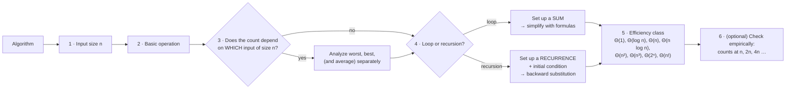
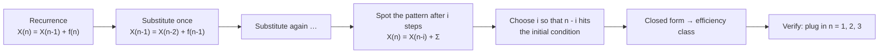
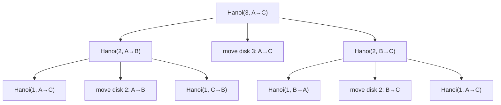

# Chapter 2 · Fundamentals of the Analysis of Algorithm Efficiency

**Why this chapter matters.** Every other chapter ends with the same question: *how fast is it?* This chapter is the
toolbox for answering it — choosing an input size and a basic operation, telling best/worst/average cases apart,
comparing growth rates with $O$, $\Omega$ and $\Theta$, turning loops into **sums** and recursion into
**recurrences**, and solving them by hand. It also shows how to check your math with experiments (and how a
misplaced counter can quietly lie to you). If you master one chapter for practice exams and interviews, make it this one.
(Levitin Chapter 2.)

🎮 Sims: [growth rates](https://normansrule.github.io/algorithm-forge/sims/growth-rates.html) ·
[recurrence lab](https://normansrule.github.io/algorithm-forge/sims/recurrence-lab.html) ·
[empirical lab](https://normansrule.github.io/algorithm-forge/sims/empirical-lab.html) ·
[Tower of Hanoi](https://normansrule.github.io/algorithm-forge/sims/hanoi.html) ·
[Fibonacci](https://normansrule.github.io/algorithm-forge/sims/fibonacci.html) ·
🏟️ [Arena: Chapter 2](https://normansrule.github.io/algorithm-forge/arena/?chapter=2) ·
🐍 [Code: `ch02_analysis.py`](../../src/python/algoforge/ch02_analysis.py) ·
📝 [Practice](../../practice/) ·
⬅️ [01 Introduction](../01-introduction/README.md) · ➡️ [03 Brute Force](../03-brute-force/README.md)

---

## Contents

1. [The big idea in 60 seconds](#the-big-idea-in-60-seconds)
2. [Part 1 — The analysis framework](#part-1--the-analysis-framework-levitin-21)
3. [Part 2 — Asymptotic notations: O, Ω, Θ](#part-2--asymptotic-notations-levitin-22)
4. [Part 3 — Analyzing nonrecursive algorithms](#part-3--analyzing-nonrecursive-algorithms-levitin-23)
   — Build Cards: [UniqueElements](#build-card-a--element-uniqueness), [MatrixMultiplication](#build-card-b--matrix-multiplication), [Binary digits](#build-card-c--counting-binary-digits-iterative)
5. [Part 4 — Analyzing recursive algorithms](#part-4--analyzing-recursive-algorithms-levitin-24)
   — Build Cards: [Factorial](#build-card-d--recursive-factorial), [Tower of Hanoi](#build-card-e--tower-of-hanoi), [BinRec](#build-card-f--counting-binary-digits-recursive)
6. [The recurrence gym — many recurrences solved step by step](#the-recurrence-gym)
7. [Part 5 — Fibonacci and the characteristic equation](#part-5--fibonacci-numbers-and-the-characteristic-equation-levitin-25)
   — Build Card: [Fibonacci three ways](#build-card-g--computing-the-nth-fibonacci-number-three-algorithms)
8. [Part 6 — Empirical analysis](#part-6--empirical-analysis-levitin-26) — Build Card: [instrumenting insertion sort](#build-card-h--instrumenting-insertion-sort-the-counter-bug)
9. [Part 7 — Algorithm visualization](#part-7--algorithm-visualization-levitin-27)
10. [How a senior engineer thinks about this chapter](#how-a-senior-engineer-thinks-about-this-chapter)
11. [Check yourself](#-check-yourself)
12. [Go deeper](#-go-deeper)

---

## The big idea in 60 seconds

We don't time algorithms with a stopwatch — that measures the computer, the language, and the programmer, too.
Instead we **count how many times the most important operation runs**, as a function of the input size $n$. Call it
$C(n)$. Then the running time is roughly

$$T(n) \approx c_{op} \cdot C(n)$$

where $c_{op}$ is the time for one basic operation on some machine. We care about **how $C(n)$ grows** as $n$ gets
large, ignoring constant factors — that's what $O$, $\Omega$, and $\Theta$ express.

- For a **loop**, $C(n)$ is a **sum**; simplify it with a few standard formulas.
- For **recursion**, $C(n)$ satisfies a **recurrence**; solve it by **backward substitution** (or the characteristic
  equation, or later the Master Theorem).
- When the math gets hard, **measure**: count operations in real runs and look at how the counts grow when $n$
  doubles.



---

## Part 1 — The analysis framework (Levitin §2.1)

We judge algorithms on **time efficiency** (how fast) and **space efficiency** (how much extra memory). Modern
memory is plentiful, so most of these lessons focus on time — but space matters again in Chapter 7.

### 1.1 Measuring input size

The input size $n$ should be the natural "amount of stuff" the algorithm processes.

| Problem | Natural input size | Basic operation |
|---|---|---|
| Search for a key in a list of $n$ items | $n$, the number of items | key comparison |
| Sort an array | $n$, the number of elements | key comparison |
| Multiply two $n \times n$ matrices | the order $n$ (or total elements $N = n^2$ — say which!) | multiplication of two numbers |
| Evaluate a polynomial of degree $n$ | $n$ (or $n + 1$ coefficients) | multiplication |
| Check whether an integer $n$ is prime | the number of **bits** $b = \lfloor \log_2 n \rfloor + 1$ | division |
| A typical graph problem | $\lvert V\rvert$ and/or $\lvert E\rvert$ | visiting a vertex or traversing an edge |
| Spell-check a text | number of characters or number of words | character or word comparison |

⚠️ **Number problems are measured in bits.** For algorithms whose input is a single number $n$ (primality, gcd,
factorial, Fibonacci), the honest input size is $b = \lfloor \log_2 n\rfloor + 1$. An algorithm doing $n$ steps is
then doing about $2^b$ steps — exponential in the input size.

### 1.2 The basic operation and the running-time estimate

The **basic operation** is the operation that contributes most to the total running time — usually the one in the
innermost loop. Counting it gives $C(n)$, and $T(n) \approx c_{op}\,C(n)$.

This rough formula already answers useful questions. Suppose $C(n) = \tfrac12 n(n-1)$:

$$\frac{T(2n)}{T(n)} \approx \frac{c_{op}\tfrac12 (2n)(2n-1)}{c_{op}\tfrac12 n(n-1)} \approx \frac{4n^2}{n^2} = 4.$$

Doubling the input quadruples the time — and notice that $c_{op}$ and the $\tfrac12$ cancelled out. That's why we
can ignore constant factors when we care about **order of growth**.

### 1.3 Orders of growth

Values of the important functions (rounded):

| $n$ | $\log_2 n$ | $n$ | $n\log_2 n$ | $n^2$ | $n^3$ | $2^n$ | $n!$ |
|---|---|---|---|---|---|---|---|
| 10 | 3.3 | 10 | 33 | 100 | 1,000 | 1,024 | 3.6·10⁶ |
| 100 | 6.6 | 100 | 664 | 10⁴ | 10⁶ | 1.3·10³⁰ | 9.3·10¹⁵⁷ |
| 1,000 | 10 | 1,000 | 1.0·10⁴ | 10⁶ | 10⁹ | 1.1·10³⁰¹ | 4.0·10²⁵⁶⁷ |
| 10⁴ | 13.3 | 10⁴ | 1.3·10⁵ | 10⁸ | 10¹² | — | — |
| 10⁶ | 19.9 | 10⁶ | 2.0·10⁷ | 10¹² | 10¹⁸ | — | — |

At a billion operations per second, $2^{100}$ operations take about $4 \cdot 10^{13}$ years — thousands of times
the age of the universe. Exponential and factorial algorithms are practical only for tiny $n$.

👀 Open the [growth-rates sim](https://normansrule.github.io/algorithm-forge/sims/growth-rates.html) and drag the
$n$ slider: watch $2^n$ leave the chart while $n\log n$ barely lifts off the floor.

**What happens when $n$ doubles?**

| Class | $\log n$ | $n$ | $n \log n$ | $n^2$ | $n^3$ | $2^n$ |
|---|---|---|---|---|---|---|
| Time multiplies by | $+1$ step | ×2 | a bit more than ×2 | ×4 | ×8 | squared ($2^{2n} = (2^n)^2$) |

### 1.4 Worst, best, and average cases

For many algorithms the count depends not only on $n$ but on **which** input of size $n$ you get. Sequential search
is the standard example:

```
ALGORITHM SequentialSearch(A[0..n-1], K)
    // Output: index of the first element equal to K, or -1
    i ← 0
    while i < n and A[i] ≠ K do
        i ← i + 1
    if i < n then
        return i
    else
        return -1
```

Basic operation: the key comparison `A[i] ≠ K`.

- **Worst case** $C_{worst}(n)$: the maximum over all inputs of size $n$. Here, $K$ is last or absent:
  $C_{worst}(n) = n$.
- **Best case** $C_{best}(n)$: the minimum. Here, $K = A[0]$: $C_{best}(n) = 1$.
- **Average case** $C_{avg}(n)$: the **expected** count under stated assumptions about the inputs. It is **not**
  $(C_{best} + C_{worst})/2$.

Average case for sequential search. Assume (a) the probability of a successful search is $p$ ($0 \le p \le 1$), and
(b) if successful, the match is equally likely at each position. A match at position $i$ (0-based) costs $i + 1$
comparisons with probability $p/n$; an unsuccessful search costs $n$ with probability $1-p$:

$$C_{avg}(n) = \sum_{i=0}^{n-1}(i+1)\cdot\frac{p}{n} + n(1-p) = \frac{p}{n}\cdot\frac{n(n+1)}{2} + n(1-p) = \frac{p(n+1)}{2} + n(1-p).$$

- $p = 1$ (always found): $(n+1)/2$ — about half the list, as intuition says.
- $p = 0$ (never found): $n$.

**Which case matters?** The worst case gives a *guarantee*. The best case is mostly useful when it's also typical
(insertion sort on almost-sorted data). The average case describes "typical" behavior but needs a probability model,
and it's usually the hardest to compute.

### 1.5 Amortized efficiency (the idea)

Sometimes one operation is expensive but it makes the next many operations cheap. **Amortized analysis** charges
the total cost of a *sequence* of $n$ operations, then divides by $n$.

Example — a dynamic array (Python `list`, Java `ArrayList`) that doubles its capacity when full. Appending when full
copies all current elements. Starting from capacity 1, the copies happen at sizes $1, 2, 4, \dots$; for $n$ appends
the total copying is

$$1 + 2 + 4 + \dots + 2^{k} < 2n \quad (2^k < n),$$

so $n$ appends cost fewer than $n + 2n = 3n$ element writes: **$O(1)$ amortized per append**, even though a single
append can cost $\Theta(n)$. (Measured: 1,000 appends → 1,023 copies.) Chapter 16 formalizes this with the potential
method.

---

## Part 2 — Asymptotic notations (Levitin §2.2)

We compare the growth of functions *ignoring constant multiples and small $n$*. Throughout, $t(n)$ is an
algorithm's count and $g(n)$ a simple comparison function like $n^2$.

### 2.1 The three definitions

| Notation | Read as | Definition (there exist constants $c > 0$ and $n_0 \ge 0$ such that for all $n \ge n_0$…) |
|---|---|---|
| $t(n) \in O(g(n))$ | "grows **no faster** than $g$" (upper bound) | $t(n) \le c\,g(n)$ |
| $t(n) \in \Omega(g(n))$ | "grows **at least as fast** as $g$" (lower bound) | $t(n) \ge c\,g(n)$ |
| $t(n) \in \Theta(g(n))$ | "grows **at the same rate** as $g$" (tight) | $c_2\,g(n) \le t(n) \le c_1\,g(n)$ for some $c_1, c_2 > 0$ |

```
   Big-O: t ≤ c·g              Big-Ω: t ≥ c·g              Big-Θ: sandwiched
   |           c·g /           |      t   /                |          c₁·g /
   |             /  t          |        / /  c·g           |        t   /  /
   |           / .·´           |      / /.·´               |      .·´ / .·´ c₂·g
   |         /.·´              |    //.´                   |    /.·´.·´
   |      .·/                  |  ./´                      |  ./·´
   |__.·´_|___________ n       |_/___|____________ n       |_/___|____________ n
          n₀                         n₀                          n₀
```

Think of them as $\le$, $\ge$, and $=$ for growth rates.

### 2.2 Proving membership straight from the definition

**Example 1.** $100n + 5 \in O(n^2)$. For $n \ge 5$: $100n + 5 \le 100n + n = 101n \le 101n^2$. So $c = 101$,
$n_0 = 5$ works. (Many other pairs work too; you only need one.)

**Example 2.** $\tfrac12 n(n-1) \in \Theta(n^2)$.
- Upper: $\tfrac12 n(n-1) = \tfrac12 n^2 - \tfrac12 n \le \tfrac12 n^2$ for all $n \ge 0$.
- Lower: $\tfrac12 n^2 - \tfrac12 n \ge \tfrac12 n^2 - \tfrac12 n\cdot\tfrac12 n = \tfrac14 n^2$ for all $n \ge 2$.
- So $c_2 = \tfrac14$, $c_1 = \tfrac12$, $n_0 = 2$.

**Example 3.** $n^3 \notin O(n^2)$. Suppose $n^3 \le c\,n^2$ for all $n \ge n_0$. Dividing by $n^2$: $n \le c$ for
all large $n$ — impossible. (To *disprove* membership, assume constants exist and derive a contradiction.)

**Example 4.** $10n \in O(n^2)$ since $10n \le 10n^2$ for $n \ge 1$ ($c = 10$, $n_0 = 1$), or
$10n \le n^2$ for $n \ge 10$ ($c = 1$, $n_0 = 10$). And $5n + 20 \in O(n)$ since $5n + 20 \le 10n$ for $n \ge 4$.

### 2.3 Useful properties

1. $f(n) \in O(f(n))$.
2. $f(n) \in O(g(n))$ **iff** $g(n) \in \Omega(f(n))$.
3. **Transitivity:** $f \in O(g)$ and $g \in O(h)$ ⇒ $f \in O(h)$ (like $a \le b \le c$).
4. **Sum rule:** if $t_1 \in O(g_1)$ and $t_2 \in O(g_2)$, then $t_1 + t_2 \in O(\max\{g_1, g_2\})$. (Same for
   $\Omega$ and $\Theta$.)

The sum rule is why **an algorithm made of consecutive parts is as slow as its slowest part**. Sorting
($\Theta(n\log n)$) followed by a linear scan ($\Theta(n)$) is $\Theta(n \log n)$ overall.

*Proof sketch of the sum rule.* With $t_1 \le c_1 g_1$ for $n \ge n_1$ and $t_2 \le c_2 g_2$ for $n \ge n_2$: for
$n \ge \max(n_1, n_2)$, $t_1 + t_2 \le c_1 g_1 + c_2 g_2 \le (c_1 + c_2)\max\{g_1, g_2\}$.

### 2.4 Comparing growth with limits (usually easier)

Compute $L = \lim_{n\to\infty} \dfrac{t(n)}{g(n)}$:

| Limit $L$ | Meaning | Conclusion |
|---|---|---|
| $0$ | $t$ grows **slower** | $t \in O(g)$, but $t \notin \Theta(g)$ |
| $0 < L < \infty$ | same order | $t \in \Theta(g)$ |
| $\infty$ | $t$ grows **faster** | $t \in \Omega(g)$, but $t \notin \Theta(g)$ |

Two power tools:

- **L'Hôpital's rule:** if $t(n)\to\infty$ and $g(n)\to\infty$ and the derivatives exist, then
  $\lim \dfrac{t(n)}{g(n)} = \lim \dfrac{t'(n)}{g'(n)}$.
- **Stirling's formula:** $n! \approx \sqrt{2\pi n}\left(\dfrac{n}{e}\right)^n$ for large $n$.

**Example A — $\tfrac12 n(n-1)$ vs. $n^2$.**
$\displaystyle\lim_{n\to\infty}\frac{\tfrac12 n(n-1)}{n^2} = \frac12\lim_{n\to\infty}\left(1 - \frac1n\right) = \frac12$, a positive constant, so $\tfrac12 n(n-1) \in \Theta(n^2)$.

**Example B — $\log_2 n$ vs. $\sqrt n$** (L'Hôpital):

$$\lim_{n\to\infty}\frac{\log_2 n}{\sqrt n} = \lim_{n\to\infty}\frac{(\log_2 e)\,\frac1n}{\frac{1}{2\sqrt n}} = 2\log_2 e\,\lim_{n\to\infty}\frac{\sqrt n}{n} = 2\log_2 e \lim_{n\to\infty}\frac{1}{\sqrt n} = 0.$$

So $\log_2 n$ grows slower than $\sqrt n$ — in fact slower than $n^\varepsilon$ for any $\varepsilon > 0$.

**Example C — $n!$ vs. $2^n$** (Stirling):

$$\lim_{n\to\infty}\frac{n!}{2^n} = \lim_{n\to\infty}\frac{\sqrt{2\pi n}\,(n/e)^n}{2^n} = \lim_{n\to\infty}\sqrt{2\pi n}\left(\frac{n}{2e}\right)^n = \infty.$$

So $n! \in \Omega(2^n)$ but not $\Theta(2^n)$: factorial beats every fixed exponential.

**Example D — $2^n$ vs. $3^n$.** $\lim (2/3)^n = 0$. Different exponential bases are **different classes** — unlike
logarithms, where $\log_a n = \log_a b \cdot \log_b n$ differs only by a constant, so the base doesn't matter inside
$\Theta(\log n)$.

### 2.5 The basic efficiency classes

| Class | Name | Typical source | Example |
|---|---|---|---|
| $1$ | constant | no loop over the input | access `A[i]`; push onto a stack |
| $\log n$ | logarithmic | cut the problem by a constant factor each step | binary search, Euclid |
| $n$ | linear | one pass over the input | sequential search, max element |
| $n\log n$ | linearithmic ("n-log-n") | divide-and-conquer with linear combine | mergesort, heapsort |
| $n^2$ | quadratic | two nested loops | selection sort, element uniqueness |
| $n^3$ | cubic | three nested loops | definition-based matrix multiplication, Gaussian elimination |
| $2^n$ | exponential | all subsets | exhaustive knapsack, Tower of Hanoi |
| $n!$ | factorial | all permutations | exhaustive Traveling Salesman Problem (TSP), assignment |

Ordering to memorize:
$\;1 < \log n < n^{\varepsilon} < n < n\log n < n^2 < n^3 < a^n < n! < n^n\;$ (for $0<\varepsilon<1 < a$).

---

## Part 3 — Analyzing nonrecursive algorithms (Levitin §2.3)

### The plan

1. Decide on the parameter $n$ indicating input size.
2. Identify the basic operation (usually in the innermost loop).
3. Check whether the count depends only on $n$. If not, analyze worst / best / average separately.
4. Set up a **sum** expressing how many times the basic operation runs.
5. Simplify the sum with standard formulas — to a closed form, or at least to its order of growth.

### The summation toolkit

Two rules:

$$\sum_{i=l}^{u} c\,a_i = c\sum_{i=l}^{u} a_i \qquad\qquad \sum_{i=l}^{u}(a_i \pm b_i) = \sum_{i=l}^{u} a_i \pm \sum_{i=l}^{u} b_i$$

Splitting a range: $\sum_{i=l}^{u} a_i = \sum_{i=l}^{m} a_i + \sum_{i=m+1}^{u} a_i$.

Six formulas (memorize the first four):

| # | Sum | Closed form | Order |
|---|---|---|---|
| S1 | $\sum_{i=l}^{u} 1$ | $u - l + 1$ (number of terms!) | — |
| S2 | $\sum_{i=1}^{n} i = 1 + 2 + \dots + n$ | $\dfrac{n(n+1)}{2}$ | $\approx \tfrac12 n^2 \in \Theta(n^2)$ |
| S3 | $\sum_{i=1}^{n} i^2$ | $\dfrac{n(n+1)(2n+1)}{6}$ | $\approx \tfrac13 n^3 \in \Theta(n^3)$ |
| S4 | $\sum_{i=0}^{n} a^i$ ($a \ne 1$) | $\dfrac{a^{n+1} - 1}{a - 1}$; for $a=2$: $2^{n+1} - 1$ | $\Theta(a^n)$ for $a > 1$ |
| S5 | $\sum_{i=1}^{n} i^k$ | $\approx \dfrac{n^{k+1}}{k+1}$ | $\Theta(n^{k+1})$ |
| S6 | $\sum_{i=1}^{n}\frac1i$ (harmonic) | $\approx \ln n + 0.5772$ | $\Theta(\log n)$ |
| S7 | $\sum_{i=1}^{n} \lg i$ | $\approx n\lg n$ | $\Theta(n\log n)$ |

> 🧠 **The number-of-terms trap.** $\sum_{i=l}^{u} 1 = u - l + 1$, **not** $u - l$. From $i = 0$ to $n - 1$ there
> are $n$ terms; from $i = 1$ to $n - 1$ there are $n - 1$.

### Warm-up: MaxElement

```
ALGORITHM MaxElement(A[0..n-1])
    maxval ← A[0]
    for i ← 1 to n - 1 do
        if A[i] > maxval then
            maxval ← A[i]
    return maxval
```

Size $n$; basic operation: the comparison `A[i] > maxval` (it runs every iteration; the assignment doesn't). Same
count for every input:

$$C(n) = \sum_{i=1}^{n-1} 1 = (n-1) - 1 + 1 = n - 1 \in \Theta(n).$$

---

### Build Card A — Element uniqueness

#### 🎯 Problem in one sentence
Given an array of $n$ elements → return `true` if all elements are distinct, `false` otherwise.

#### 📖 Story
Checking a guest list for duplicate names by comparing each name with every name below it on the list.

#### 👀 See it
Every pair $(i, j)$ with $i < j$ is one cell above the diagonal of an $n \times n$ grid:

```
        j=0  j=1  j=2  j=3  j=4
 i=0     ·    ■    ■    ■    ■      4 comparisons
 i=1     ·    ·    ■    ■    ■      3
 i=2     ·    ·    ·    ■    ■      2
 i=3     ·    ·    ·    ·    ■      1
                                  ────
                                   10 = 5·4/2
```

#### 🧱 Build it in blocks

**Block 1 — state:** just loop indices.
**Block 2 — skeleton:** every pair once — `j` starts just after `i`.

```
for i ← 0 to n - 2 do
    for j ← i + 1 to n - 1 do
        // compare A[i] and A[j]
```

**Block 3 — decision:** a single equal pair decides the answer.

```
for i ← 0 to n - 2 do
    for j ← i + 1 to n - 1 do
        if A[i] = A[j] then
            return false
```

**Block 4 — return:** survived all pairs ⇒ distinct.

```
return true
```

#### ✋ Trace it by hand
`A = [3, 8, 5, 8]`:

| i | j | A[i] | A[j] | equal? | comparisons so far |
|---|---|---|---|---|---|
| 0 | 1 | 3 | 8 | no | 1 |
| 0 | 2 | 3 | 5 | no | 2 |
| 0 | 3 | 3 | 8 | no | 3 |
| 1 | 2 | 8 | 5 | no | 4 |
| 1 | 3 | 8 | 8 | **yes** → return `false` | 5 |

#### 💻 Code

```
ALGORITHM UniqueElements(A[0..n-1])
    // Determines whether all the elements in a given array are distinct
    // Input: An array A[0..n-1]
    // Output: true if all elements are distinct, false otherwise
    for i ← 0 to n - 2 do
        for j ← i + 1 to n - 1 do
            if A[i] = A[j] then
                return false
    return true
```

<details>
<summary>🐍 Python</summary>

```python
def unique_elements(a) -> bool:
    n = len(a)
    for i in range(n - 1):
        for j in range(i + 1, n):
            if a[i] == a[j]:
                return False
    return True
```
</details>

<details>
<summary>☕ Java</summary>

```java
static boolean uniqueElements(int[] a) {
    int n = a.length;
    for (int i = 0; i <= n - 2; i++)
        for (int j = i + 1; j <= n - 1; j++)
            if (a[i] == a[j]) return false;
    return true;
}
```
</details>

#### 🧮 Analyze it
- Size $n$; basic operation: the comparison `A[i] = A[j]`.
- The count depends on the input (it can stop early). **Worst case:** all distinct, or the only equal pair is the
  last one checked. Then every pair is compared:

$$C_{worst}(n) = \sum_{i=0}^{n-2}\sum_{j=i+1}^{n-1} 1 = \sum_{i=0}^{n-2}\big[(n-1) - (i+1) + 1\big] = \sum_{i=0}^{n-2}(n-1-i)$$
$$= (n-1) + (n-2) + \dots + 1 = \frac{(n-1)n}{2} \approx \frac12 n^2 \in \Theta(n^2).$$

- **Best case:** $A[0] = A[1]$ → 1 comparison.

#### ⚠️ Common mistakes
- Starting `j` at 0 (or at `i`) compares an element with itself and always returns `false`.
- Counting the inner loop as $n - i$ instead of $n - 1 - i$ terms — use formula S1 carefully.

#### 🔁 Variations / real use
Presort first (Chapter 6) and check neighbors: $\Theta(n\log n)$. Or put elements into a hash set (Chapter 7):
expected $\Theta(n)$. Real code (`len(set(a)) == len(a)`) does the latter.

---

### Build Card B — Matrix multiplication

#### 🎯 Problem in one sentence
Given two $n \times n$ matrices $A$ and $B$ → return $C = AB$, where $C[i,j] = \sum_{k=0}^{n-1} A[i,k]\,B[k,j]$.

#### 📖 Story
Each entry of $C$ is a "dot product": walk along row $i$ of $A$ and down column $j$ of $B$, multiplying pairs and
adding them up — like totaling a shopping bill (quantities × prices).

#### 👀 See it
```
      A (row i)            B (column j)          C[i, j]
  [ a  b  c ]   ×     [ x ]                  = a·x + b·y + c·z
                      [ y ]
                      [ z ]
```

#### 🧱 Build it in blocks
1. **State:** result matrix `C ← matrix(n, n, 0)`.
2. **Skeleton:** one loop for the row `i`, one for the column `j` — every cell of $C$.
3. **Decision/work:** an inner loop over `k` accumulates the dot product.
4. **Return:** `C`.

```
ALGORITHM MatrixMultiplication(A[0..n-1], B[0..n-1])
    // Multiplies two square matrices of order n by the definition-based algorithm
    // Input: Two n-by-n matrices A and B
    // Output: Matrix C = AB
    C ← matrix(n, n, 0)
    for i ← 0 to n - 1 do
        for j ← 0 to n - 1 do
            C[i, j] ← 0
            for k ← 0 to n - 1 do
                C[i, j] ← C[i, j] + A[i, k] * B[k, j]
    return C
```

#### ✋ Trace it by hand
$A = \begin{bmatrix}1 & 2\\ 3 & 4\end{bmatrix}$, $B = \begin{bmatrix}5 & 6\\ 7 & 8\end{bmatrix}$:

| i | j | k = 0 | k = 1 | C[i, j] |
|---|---|---|---|---|
| 0 | 0 | 1·5 = 5 | 5 + 2·7 = 19 | 19 |
| 0 | 1 | 1·6 = 6 | 6 + 2·8 = 22 | 22 |
| 1 | 0 | 3·5 = 15 | 15 + 4·7 = 43 | 43 |
| 1 | 1 | 3·6 = 18 | 18 + 4·8 = 50 | 50 |

8 multiplications $= 2^3$. ✔

<details>
<summary>🐍 Python</summary>

```python
def matrix_multiply(a, b):
    n = len(a)
    c = [[0] * n for _ in range(n)]
    for i in range(n):
        for j in range(n):
            s = 0
            for k in range(n):
                s += a[i][k] * b[k][j]
            c[i][j] = s
    return c
```
</details>

<details>
<summary>☕ Java</summary>

```java
static long[][] multiply(long[][] a, long[][] b) {
    int n = a.length;
    long[][] c = new long[n][n];
    for (int i = 0; i < n; i++)
        for (int j = 0; j < n; j++) {
            long s = 0;
            for (int k = 0; k < n; k++) s += a[i][k] * b[k][j];
            c[i][j] = s;
        }
    return c;
}
```
</details>

#### 🧮 Analyze it
Size: matrix order $n$. Basic operation: multiplication in the innermost loop. No early exit, so one case:

$$M(n) = \sum_{i=0}^{n-1}\sum_{j=0}^{n-1}\sum_{k=0}^{n-1} 1 = \sum_{i=0}^{n-1}\sum_{j=0}^{n-1} n = \sum_{i=0}^{n-1} n^2 = n^3.$$

Additions: also $n^3$ (counting the $+$ into $C[i,j]$). Time estimate
$T(n) \approx c_m n^3 + c_a n^3 = (c_m + c_a)\,n^3 \in \Theta(n^3)$.

⚠️ If you measure size by the number of elements $N = n^2$, the same algorithm is $\Theta(N^{1.5})$. State which size
you use!

#### ⚠️ Common mistakes
- Forgetting to reset the accumulator for each $(i, j)$.
- Mixing up indices: it's `A[i, k] * B[k, j]` — the shared index $k$ is the one summed over.

#### 🔁 Variations / real use
Strassen's algorithm ($\Theta(n^{\log_2 7}) \approx \Theta(n^{2.807})$, Chapter 5). Real libraries (BLAS (Basic Linear Algebra Subprograms), NumPy)
still use $\Theta(n^3)$ arithmetic but reorder the loops into cache-sized **blocks** — 10–100× faster than the naive
triple loop, same efficiency class. Constant factors matter!

#### Bonus: Gaussian elimination (Levitin Exercise 2.3.11)

```
ALGORITHM GaussianEliminationForward(A[0..n-1])
    // A is an n-by-(n+1) augmented matrix; makes it upper-triangular
    for i ← 0 to n - 2 do
        for j ← i + 1 to n - 1 do
            for k ← i to n do
                A[j, k] ← A[j, k] - A[i, k] * A[j, i] / A[i, i]
```

Count the innermost statement: the $k$-loop has $n - i + 1$ iterations, the $j$-loop $n - 1 - i$:

$$C(n) = \sum_{i=0}^{n-2}(n-1-i)(n-i+1).$$

Substitute $t = n - 1 - i$ (so $t$ runs $1..n-1$ and $n - i + 1 = t + 2$):

$$C(n) = \sum_{t=1}^{n-1} t(t+2) = \sum_{t=1}^{n-1}t^2 + 2\sum_{t=1}^{n-1}t = \frac{(n-1)n(2n-1)}{6} + (n-1)n = \frac{(n-1)n(2n+5)}{6} \approx \frac{n^3}{3} \in \Theta(n^3).$$

(Check: $n = 3$ gives $\tfrac{2\cdot3\cdot11}{6} = 11$; by hand, $i = 0$: $2 \times 4 = 8$, $i = 1$: $1\times3 = 3$. ✔)

⚠️ **This pseudocode has a real bug** — and fixing it is also the "glaring inefficiency" that Levitin Exercise 2.3.11(b) asks you to remove.
When $k = i$, the statement sets $A[j, i]$ to 0; every later $k$ then uses the *new* $A[j, i] = 0$ as the multiplier.
Fix: compute the multiplier once, before the $k$-loop — `temp ← A[j, i] / A[i, i]`, then
`A[j, k] ← A[j, k] - A[i, k] * temp`. This is correct *and* removes a division from the innermost loop.

---

### Build Card C — Counting binary digits (iterative)

#### 🎯 Problem in one sentence
Given a positive integer $n$ → return the number of digits in its binary representation.

#### 📖 Story
How many times can you fold a strip of paper of length $n$ in half (rounding down) before it's length 1? Each fold
is one binary digit dropped off the right end.

#### 👀 See it
```
n = 13 = 1101₂
13 → 6 → 3 → 1       three halvings, so 3 + 1 = 4 binary digits
```

#### 🧱 Build it in blocks
1. **State:** `count ← 1` (every positive integer has at least one digit).
2. **Skeleton:** `while n > 1 do` … halve `n`.
3. **Work:** `count ← count + 1`, `n ← ⌊n/2⌋`.
4. **Return:** `count`.

```
ALGORITHM Binary(n)
    // Input: A positive decimal integer n
    // Output: The number of binary digits in n's binary representation
    count ← 1
    while n > 1 do
        count ← count + 1
        n ← ⌊n / 2⌋
    return count
```

#### ✋ Trace it by hand ($n = 13$)

| test `n > 1` | n before | count after | n after |
|---|---|---|---|
| 13 > 1 ✔ | 13 | 2 | 6 |
| 6 > 1 ✔ | 6 | 3 | 3 |
| 3 > 1 ✔ | 3 | 4 | 1 |
| 1 > 1 ✘ | 1 | — | return **4** |

4 comparisons $= \lfloor\log_2 13\rfloor + 1 = 3 + 1$.

<details>
<summary>🐍 Python and ☕ Java</summary>

```python
def binary_digits(n: int) -> int:
    count = 1
    while n > 1:
        count += 1
        n //= 2
    return count          # same as n.bit_length() for n >= 1
```

```java
static int binaryDigits(long n) {
    int count = 1;
    while (n > 1) { count++; n /= 2; }
    return count;         // same as 64 - Long.numberOfLeadingZeros(n)
}
```
</details>

#### 🧮 Analyze it
Basic operation: the comparison `n > 1` (it runs once more than the loop body). The loop variable is **halved**, not
decremented, so a sum over $i = 1..n$ is the wrong model. Instead: the body runs as many times as you can halve $n$
before reaching 1, which is $\lfloor\log_2 n\rfloor$ times, so the comparison runs

$$C(n) = \lfloor \log_2 n\rfloor + 1 \in \Theta(\log n).$$

#### ⚠️ Common mistakes
Setting up $\sum_{i=1}^{n} 1$ for a loop that halves $n$. Always ask: *how does the loop variable change?*

---

## Part 4 — Analyzing recursive algorithms (Levitin §2.4)

### The plan

1. Decide on the input-size parameter $n$.
2. Identify the basic operation.
3. Check whether the count can differ for inputs of the same size (if so, handle cases separately).
4. Set up a **recurrence relation**, **with an initial condition**, for the number of basic operations.
5. Solve it — by **backward substitution** here, or by the characteristic equation (Part 5) or the Master Theorem
   (Chapter 5) — or at least find its order of growth.

### Backward substitution in one picture



---

### Build Card D — Recursive factorial

#### 🎯 Problem in one sentence
Given a non-negative integer $n$ → return $n! = 1 \cdot 2 \cdots n$ (with $0! = 1$).

#### 📖 Story
Russian nesting dolls: to open doll $n$ you must first open doll $n - 1$ inside it; the smallest doll (0) is solid
and just "is" 1. On the way back out, each doll multiplies by its own number.

#### 👀 See it
```
F(4) = F(3)·4
         F(3) = F(2)·3
                  F(2) = F(1)·2
                           F(1) = F(0)·1
                                    F(0) = 1          ← base case, 0 multiplications
                           = 1 ·1 = 1                 (mult #1)
                  = 1 ·2 = 2                          (mult #2)
         = 2 ·3 = 6                                   (mult #3)
= 6 ·4 = 24                                           (mult #4)
```

#### 🧱 Build it in blocks
1. **State:** none beyond $n$ — recursion keeps it on the call stack.
2. **Skeleton:** `if n = 0 then … else …`
3. **Decision:** base case returns 1; otherwise recurse on $n - 1$.
4. **Return:** `F(n - 1) * n`.

```
ALGORITHM F(n)
    // Computes n! recursively
    // Input: A nonnegative integer n
    // Output: The value of n!
    if n = 0 then
        return 1
    else
        return F(n - 1) * n
```

#### ✋ Trace it by hand
See the picture above: $F(4) = 24$ with exactly 4 multiplications.

<details>
<summary>🐍 Python and ☕ Java</summary>

```python
def factorial(n: int) -> int:
    return 1 if n == 0 else factorial(n - 1) * n
```

```java
static java.math.BigInteger factorial(int n) {
    return n == 0 ? java.math.BigInteger.ONE
                  : factorial(n - 1).multiply(java.math.BigInteger.valueOf(n));
}
```
</details>

#### 🧮 Analyze it
Basic operation: multiplication. Let $M(n)$ = number of multiplications for input $n$. Computing $F(n)$ does all the
multiplications of $F(n-1)$, plus one more:

$$M(n) = M(n-1) + 1 \quad\text{for } n > 0, \qquad M(0) = 0.$$

Backward substitution:

$$\begin{aligned}
M(n) &= M(n-1) + 1 \\
     &= [M(n-2) + 1] + 1 = M(n-2) + 2 \\
     &= [M(n-3) + 1] + 2 = M(n-3) + 3 \\
     &\;\;\vdots \\
     &= M(n-i) + i \qquad\text{(general pattern)} \\
     &= M(n-n) + n = M(0) + n = n. \qquad (i = n)
\end{aligned}$$

$M(n) = n \in \Theta(n)$ multiplications. (But remember: $n$ is a *value*; in bits, this is exponential — and the
numbers themselves get huge, so each multiplication isn't really constant time.)

#### ⚠️ Common mistakes
- **Confusing the two recurrences.** $F(n) = F(n-1)\cdot n$ defines the **values** $n!$. $M(n) = M(n-1) + 1$ counts
  the **work**. Students mix these up constantly.
- **Wrong initial condition:** $M(0) = 0$, not 1 — the base case does *no* multiplications.

---

### Build Card E — Tower of Hanoi

#### 🎯 Problem in one sentence
Move $n$ disks of different sizes from peg A to peg C using peg B, one disk at a time, never putting a larger disk on
a smaller one → output the sequence of moves.

#### 📖 Story
To move a stack of $n$ plates, you must first get the top $n - 1$ plates out of the way (onto the spare peg), move the
biggest plate, then put the $n - 1$ plates back on top of it. How do you move $n - 1$ plates? The same way.

#### 👀 See it
Play with the [Hanoi sim](https://normansrule.github.io/algorithm-forge/sims/hanoi.html) for $n = 3$ and $n = 4$ and
look at its call tree view.



#### 🧱 Build it in blocks
1. **State:** $n$ and the names of the three pegs (source, target, spare).
2. **Skeleton:** base case $n = 1$; otherwise two recursive calls around one move.
3. **Decision:** which peg plays which role in each call — the only tricky part.
4. **Return:** the number of moves made (so we can check the analysis).

```
ALGORITHM Hanoi(n, source, target, spare)
    // Moves n disks from source to target using spare; returns the number of moves
    // Input: n ≥ 1 and three distinct peg names
    if n = 1 then
        // move disk 1 from source to target
        return 1
    moves ← Hanoi(n - 1, source, spare, target)
    moves ← moves + 1
    // (that +1 is: move disk n from source to target)
    moves ← moves + Hanoi(n - 1, spare, target, source)
    return moves
```

#### ✋ Trace it by hand ($n = 3$, A → C)

| # | move | produced by |
|---|---|---|
| 1 | disk 1: A → C | Hanoi(1, A→C) inside Hanoi(2, A→B) |
| 2 | disk 2: A → B | Hanoi(2, A→B) |
| 3 | disk 1: C → B | Hanoi(1, C→B) |
| 4 | disk 3: A → C | Hanoi(3, A→C) |
| 5 | disk 1: B → A | Hanoi(1, B→A) inside Hanoi(2, B→C) |
| 6 | disk 2: B → C | Hanoi(2, B→C) |
| 7 | disk 1: A → C | Hanoi(1, A→C) |

7 moves $= 2^3 - 1$.

<details>
<summary>🐍 Python</summary>

```python
def hanoi(n: int, src="A", dst="C", spare="B", moves=None):
    """Returns the list of moves (disk, from, to)."""
    if moves is None:
        moves = []
    if n == 1:
        moves.append((1, src, dst))
        return moves
    hanoi(n - 1, src, spare, dst, moves)
    moves.append((n, src, dst))
    hanoi(n - 1, spare, dst, src, moves)
    return moves
```
</details>

<details>
<summary>☕ Java</summary>

```java
static long hanoi(int n, char src, char dst, char spare, StringBuilder out) {
    if (n == 1) { out.append("1:").append(src).append("->").append(dst).append('\n'); return 1; }
    long moves = hanoi(n - 1, src, spare, dst, out);
    out.append(n).append(':').append(src).append("->").append(dst).append('\n');
    moves += 1;
    moves += hanoi(n - 1, spare, dst, src, out);
    return moves;
}
```
</details>

#### 🧮 Analyze it
Basic operation: moving one disk. $M(n)$ = moves for $n$ disks:

$$M(n) = M(n-1) + 1 + M(n-1) = 2M(n-1) + 1 \quad (n > 1), \qquad M(1) = 1.$$

Backward substitution:

$$\begin{aligned}
M(n) &= 2M(n-1) + 1 \\
     &= 2[2M(n-2) + 1] + 1 = 2^2 M(n-2) + 2 + 1 \\
     &= 2^2[2M(n-3) + 1] + 2 + 1 = 2^3 M(n-3) + 2^2 + 2 + 1 \\
     &\;\;\vdots \\
     &= 2^i M(n-i) + 2^{i-1} + \dots + 2 + 1 = 2^i M(n-i) + 2^i - 1 \\
     &= 2^{n-1} M(1) + 2^{n-1} - 1 \qquad (i = n-1)\\
     &= 2^{n-1} + 2^{n-1} - 1 = 2^n - 1.
\end{aligned}$$

$M(n) = 2^n - 1 \in \Theta(2^n)$. Check: $M(1)=1, M(2)=3, M(3)=7$ ✔. The call tree has $2^n - 1$ nodes too —
one move per call. This is **optimal**: no algorithm can do it in fewer moves, so the puzzle is inherently
exponential. (64 disks at one move per second: about 585 billion years.)

#### ⚠️ Common mistakes
- Writing $M(n) = M(n-1) + 1$ (forgetting that there are **two** recursive calls).
- Losing the geometric series: $1 + 2 + \dots + 2^{i-1} = 2^i - 1$ (formula S4).
- Mixing up the peg roles in the recursive calls — trace $n = 2$ to check.

#### 🔁 Variations
The same "two recursive calls on $n - 1$" shape appears in naive subset generation and in badly written recursive
Fibonacci — a warning sign of exponential time.

---

### Build Card F — Counting binary digits (recursive)

#### 🎯 Problem in one sentence
Same as Card C, recursively: the number of binary digits of $n$ is one more than that of $\lfloor n/2\rfloor$.

```
ALGORITHM BinRec(n)
    // Input: A positive decimal integer n
    // Output: The number of binary digits in n's binary representation
    if n = 1 then
        return 1
    else
        return BinRec(⌊n / 2⌋) + 1
```

#### ✋ Trace ($n = 13$)
`BinRec(13) = BinRec(6) + 1 = (BinRec(3) + 1) + 1 = ((BinRec(1) + 1) + 1) + 1 = 4`. Three additions.

#### 🧮 Analyze it
Basic operation: the addition. $A(n)$ = additions:

$$A(n) = A(\lfloor n/2\rfloor) + 1 \quad (n > 1), \qquad A(1) = 0.$$

The floor makes direct substitution awkward, so solve it for $n = 2^k$ first (then use the **smoothness rule**:
for a nicely growing function, the order of growth found for powers of 2 holds for all $n$).

With $n = 2^k$: $A(2^k) = A(2^{k-1}) + 1$, $A(2^0) = 0$.

$$\begin{aligned}
A(2^k) &= A(2^{k-1}) + 1 \\
       &= [A(2^{k-2}) + 1] + 1 = A(2^{k-2}) + 2 \\
       &= A(2^{k-3}) + 3 \\
       &\;\;\vdots \\
       &= A(2^{k-i}) + i \\
       &= A(2^{0}) + k = k \qquad (i = k).
\end{aligned}$$

So $A(n) = \log_2 n \in \Theta(\log n)$. (In fact $A(n) = \lfloor\log_2 n\rfloor$ exactly for every $n \ge 1$ — we
checked it for all $n$ up to 5,000.)

<details>
<summary>🐍 Python and ☕ Java</summary>

```python
def bin_rec(n: int) -> int:
    return 1 if n == 1 else bin_rec(n // 2) + 1
```

```java
static int binRec(long n) { return n == 1 ? 1 : binRec(n / 2) + 1; }
```
</details>

⚠️ **Common mistake:** treating $n/2$ like $n - 1$ and getting $\Theta(n)$. Halving recurrences produce logarithms.

---

## The recurrence gym

Work each one yourself first; then open the solution. Every solution uses the same four moves: **substitute,
substitute, spot the pattern, hit the initial condition.** Try them in the
[recurrence lab](https://normansrule.github.io/algorithm-forge/sims/recurrence-lab.html), which expands the
substitutions for you and plots the values.

| # | Recurrence | Answer | Class |
|---|---|---|---|
| R1 | $M(n) = M(n-1) + 1$, $M(0) = 0$ | $n$ | $\Theta(n)$ |
| R2 | $x(n) = x(n-1) + 5$, $x(1) = 0$ | $5(n-1)$ | $\Theta(n)$ |
| R3 | $x(n) = 3x(n-1)$, $x(1) = 4$ | $4\cdot 3^{n-1}$ | $\Theta(3^n)$ |
| R4 | $M(n) = 2M(n-1) + 1$, $M(1) = 1$ (Hanoi) | $2^n - 1$ | $\Theta(2^n)$ |
| R5 | $T(n) = T(n-1) + n$, $T(0) = 0$ | $n(n+1)/2$ | $\Theta(n^2)$ |
| R6 | $Q(n) = Q(n-1) + 2n - 1$, $Q(1) = 1$ | $n^2$ | $\Theta(n^2)$ |
| R7 | $A(n) = A(n/2) + 1$, $A(1) = 0$ | $\log_2 n$ | $\Theta(\log n)$ |
| R8 | $x(n) = x(n/3) + 1$, $x(1) = 1$ | $\log_3 n + 1$ | $\Theta(\log n)$ |
| R9 | $T(n) = T(n/2) + \log_2 n$, $T(1) = 1$ | $1 + \frac{\log_2 n(\log_2 n + 1)}{2}$ | $\Theta(\log^2 n)$ |
| R10 | $T(n) = 2T(n/2) + 1$, $T(1) = 1$ | $2n - 1$ | $\Theta(n)$ |
| R11 | $T(n) = 2T(n/2) + n$, $T(1) = 0$ | $n\log_2 n$ | $\Theta(n\log n)$ |

<details>
<summary><b>R2</b> — x(n) = x(n−1) + 5, x(1) = 0</summary>

$$x(n) = x(n-1) + 5 = x(n-2) + 2\cdot5 = x(n-3) + 3\cdot5 = \dots = x(n-i) + 5i.$$

Hit $x(1)$ with $i = n - 1$: $x(n) = x(1) + 5(n-1) = 5(n-1)$. Check: $x(2) = 0 + 5 = 5 = 5(2-1)$ ✔.
</details>

<details>
<summary><b>R3</b> — x(n) = 3x(n−1), x(1) = 4</summary>

$$x(n) = 3x(n-1) = 3^2 x(n-2) = 3^3 x(n-3) = \dots = 3^i x(n-i).$$

With $i = n - 1$: $x(n) = 3^{n-1}x(1) = 4\cdot 3^{n-1}$. Check: $x(2) = 12 = 4\cdot 3$ ✔.
</details>

<details>
<summary><b>R5</b> — T(n) = T(n−1) + n, T(0) = 0 (a decrease-by-one algorithm doing linear extra work)</summary>

$$\begin{aligned}
T(n) &= T(n-1) + n \\
     &= [T(n-2) + (n-1)] + n = T(n-2) + (n-1) + n \\
     &= T(n-3) + (n-2) + (n-1) + n \\
     &\;\;\vdots \\
     &= T(n-i) + (n-i+1) + \dots + (n-1) + n.
\end{aligned}$$

With $i = n$: $T(n) = T(0) + 1 + 2 + \dots + n = \dfrac{n(n+1)}{2} \in \Theta(n^2)$.

Check: $T(1) = 1$, $T(2) = 3$, $T(3) = 6$ ✔. (Insertion sort's worst case and selection sort have exactly this
shape.) If instead $T(1) = 1$ is given, stop at $i = n - 1$: $T(n) = T(1) + 2 + \dots + n = n(n+1)/2$ — same answer.
</details>

<details>
<summary><b>R6</b> — Q(n) = Q(n−1) + 2n − 1, Q(1) = 1 (Levitin Exercise 2.4.4 — "what does it compute?")</summary>

$$Q(n) = Q(n-1) + (2n-1) = Q(n-2) + (2n-3) + (2n-1) = \dots = Q(1) + \sum_{j=2}^{n}(2j - 1) = \sum_{j=1}^{n}(2j-1).$$

$\sum_{j=1}^{n}(2j-1) = 2\cdot\frac{n(n+1)}{2} - n = n^2$. The algorithm computes $n^2$ — the sum of the first $n$
odd numbers. Check: $Q(2) = 1 + 3 = 4$, $Q(3) = 9$ ✔.
</details>

<details>
<summary><b>R8</b> — x(n) = x(n/3) + 1, x(1) = 1, for n = 3ᵏ</summary>

$$x(3^k) = x(3^{k-1}) + 1 = x(3^{k-2}) + 2 = \dots = x(3^{k-i}) + i = x(3^0) + k = 1 + k.$$

Since $k = \log_3 n$: $x(n) = \log_3 n + 1 \in \Theta(\log n)$.
</details>

<details>
<summary><b>R9</b> — T(n) = T(n/2) + log₂ n, T(1) = 1 (decrease-by-half with logarithmic extra work)</summary>

Let $n = 2^k$, so $\log_2 n = k$ and $T(2^k) = T(2^{k-1}) + k$.

$$\begin{aligned}
T(2^k) &= T(2^{k-1}) + k \\
       &= [T(2^{k-2}) + (k-1)] + k \\
       &= T(2^{k-3}) + (k-2) + (k-1) + k \\
       &\;\;\vdots \\
       &= T(2^{k-i}) + (k-i+1) + \dots + (k-1) + k \\
       &= T(2^0) + 1 + 2 + \dots + k \qquad (i = k) \\
       &= 1 + \frac{k(k+1)}{2}.
\end{aligned}$$

Back to $n$: $T(n) = 1 + \dfrac{\log_2 n\,(\log_2 n + 1)}{2} \in \Theta(\log^2 n)$.

Check by iteration: $T(2) = 1 + 1 = 2$, $T(4) = 2 + 2 = 4$, $T(8) = 4 + 3 = 7$, $T(16) = 7 + 4 = 11$; formula at
$n = 16$: $1 + \frac{4\cdot5}{2} = 11$ ✔.
</details>

<details>
<summary><b>R10</b> — T(n) = 2T(n/2) + 1, T(1) = 1 (e.g., recursive max of an array by halves)</summary>

$n = 2^k$:

$$\begin{aligned}
T(2^k) &= 2T(2^{k-1}) + 1 \\
       &= 2[2T(2^{k-2}) + 1] + 1 = 2^2T(2^{k-2}) + 2 + 1 \\
       &= 2^3T(2^{k-3}) + 2^2 + 2 + 1 \\
       &= 2^iT(2^{k-i}) + 2^i - 1 \\
       &= 2^kT(1) + 2^k - 1 = 2\cdot 2^k - 1 \qquad (i = k).
\end{aligned}$$

$T(n) = 2n - 1 \in \Theta(n)$. Two half-size calls with $O(1)$ combine is **still linear**.
</details>

<details>
<summary><b>R11</b> — T(n) = 2T(n/2) + n, T(1) = 0 (mergesort's shape — preview of Chapter 5)</summary>

$n = 2^k$:

$$\begin{aligned}
T(2^k) &= 2T(2^{k-1}) + 2^k \\
       &= 2[2T(2^{k-2}) + 2^{k-1}] + 2^k = 2^2T(2^{k-2}) + 2^k + 2^k \\
       &= 2^3T(2^{k-3}) + 3\cdot 2^k \\
       &= 2^iT(2^{k-i}) + i\cdot 2^k \\
       &= 2^kT(1) + k\cdot2^k = k\cdot 2^k \qquad (i = k).
\end{aligned}$$

$T(n) = n\log_2 n \in \Theta(n\log n)$. Check: $T(2) = 2$, $T(4) = 2\cdot2 + 4 = 8 = 4\cdot 2$ ✔.
</details>

> 🧠 **Patterns worth memorizing.** "$-1$ with $+c$" → linear. "$-1$ with $+n$" → quadratic. "$/2$ with $+c$" →
> logarithmic. "$/2$ with $+\log n$" → $\log^2 n$. "two calls on $n-1$" → exponential. "two calls on $n/2$ with $+n$"
> → $n\log n$.

---

## Part 5 — Fibonacci numbers and the characteristic equation (Levitin §2.5)

The Fibonacci numbers $0, 1, 1, 2, 3, 5, 8, 13, 21, \dots$ are defined by

$$F(n) = F(n-1) + F(n-2) \quad (n > 1), \qquad F(0) = 0,\; F(1) = 1.$$

Backward substitution gets messy here (two terms on the right). Instead, use the method for **second-order linear
homogeneous recurrences with constant coefficients**.

### The method

For $a\,x(n) + b\,x(n-1) + c\,x(n-2) = 0$:

1. Write the **characteristic equation** $a r^2 + b r + c = 0$ and find its roots $r_1, r_2$.
2. General solution:
   - two distinct real roots: $x(n) = \alpha r_1^n + \beta r_2^n$;
   - one repeated root $r$: $x(n) = \alpha r^n + \beta n r^n$.
3. Use the two initial conditions to solve for $\alpha$ and $\beta$.

### Worked example 1 — Fibonacci

Rewrite: $F(n) - F(n-1) - F(n-2) = 0$. Characteristic equation: $r^2 - r - 1 = 0$, so

$$r_{1,2} = \frac{1 \pm \sqrt{5}}{2}, \qquad \phi = \frac{1+\sqrt5}{2} \approx 1.61803,\quad \hat\phi = \frac{1-\sqrt5}{2} \approx -0.61803.$$

General solution $F(n) = \alpha\phi^n + \beta\hat\phi^n$. Initial conditions:

- $F(0) = 0$: $\alpha + \beta = 0$, so $\beta = -\alpha$.
- $F(1) = 1$: $\alpha\phi + \beta\hat\phi = \alpha(\phi - \hat\phi) = \alpha\sqrt5 = 1$, so $\alpha = 1/\sqrt5$.

$$F(n) = \frac{1}{\sqrt5}\left(\phi^n - \hat\phi^n\right).$$

Since $\lvert\hat\phi\rvert < 1$, the second term vanishes fast: $F(n) = \text{round}(\phi^n/\sqrt5)$ and
$F(n) \in \Theta(\phi^n)$. Fibonacci numbers grow exponentially.

### Worked example 2 — distinct roots

$x(n) = 5x(n-1) - 6x(n-2)$, $x(0) = 0$, $x(1) = 1$.
Characteristic equation $r^2 - 5r + 6 = 0 = (r-2)(r-3)$, roots 2 and 3. $x(n) = \alpha 2^n + \beta 3^n$.
$x(0)$: $\alpha + \beta = 0$. $x(1)$: $2\alpha + 3\beta = 1$ ⇒ $\beta = 1, \alpha = -1$.
$$x(n) = 3^n - 2^n.$$
Check: $x(2) = 5\cdot1 - 6\cdot0 = 5 = 9 - 4$ ✔, $x(3) = 5\cdot5 - 6\cdot1 = 19 = 27 - 8$ ✔.

### Worked example 3 — repeated root

$x(n) = 4x(n-1) - 4x(n-2)$, $x(0) = 1$, $x(1) = 4$.
$r^2 - 4r + 4 = (r-2)^2$: repeated root 2. $x(n) = \alpha 2^n + \beta n 2^n$.
$x(0) = \alpha = 1$; $x(1) = 2\alpha + 2\beta = 4$ ⇒ $\beta = 1$.
$$x(n) = (n+1)\,2^n.$$
Check: $x(2) = 4\cdot4 - 4\cdot1 = 12 = 3\cdot4$ ✔.

---

### Build Card G — Computing the nth Fibonacci number (three algorithms)

#### 🎯 Problem in one sentence
Given $n \ge 0$ → return $F(n)$.

#### 📖 Story
Rabbits: each mature pair produces one new pair per month; newborns mature in a month. The population next month is
this month's plus last month's. The naive recursive algorithm is like asking your two parents to recount the whole
family tree from scratch every time — over and over.

#### 👀 See it
In the [Fibonacci sim](https://normansrule.github.io/algorithm-forge/sims/fibonacci.html), compare the **call tree**
of the recursive version with the two-variable **sliding window** of the iterative one.

```
                    F(5)
              ┌──────┴──────┐
            F(4)           F(3)            ← F(3) computed twice,
          ┌──┴──┐        ┌──┴──┐              F(2) three times,
        F(3)   F(2)    F(2)   F(1)            F(1) five times …
       ┌─┴─┐   ┌┴┐     ┌┴┐
     F(2) F(1) F(1)F(0) F(1)F(0)
     ┌┴┐
   F(1)F(0)
```

#### 🧱 Build it in blocks (iterative version)
1. **State:** the last two values, `prev ← 0` (that's $F(0)$), `curr ← 1` (that's $F(1)$).
2. **Skeleton:** `for i ← 2 to n do` — each pass slides the window one step.
3. **Work:** `next ← prev + curr`, then shift: `prev ← curr`, `curr ← next`.
4. **Return:** `curr` (with $n = 0$ handled up front).

#### 💻 Code

```
ALGORITHM FibRecursive(n)
    // Computes the nth Fibonacci number recursively by definition
    if n ≤ 1 then
        return n
    else
        return FibRecursive(n - 1) + FibRecursive(n - 2)

ALGORITHM FibIterative(n)
    // Computes the nth Fibonacci number iteratively, keeping only two values
    if n = 0 then
        return 0
    prev ← 0
    curr ← 1
    for i ← 2 to n do
        next ← prev + curr
        prev ← curr
        curr ← next
    return curr
```

<details>
<summary>🐍 Python (recursive, iterative, and matrix-power in Θ(log n) multiplications)</summary>

```python
def fib_recursive(n: int) -> int:
    return n if n <= 1 else fib_recursive(n - 1) + fib_recursive(n - 2)


def fib_iterative(n: int) -> int:
    prev, curr = 0, 1
    for _ in range(n):
        prev, curr = curr, prev + curr
    return prev


def fib_matrix(n: int) -> int:
    """[[F(n+1), F(n)], [F(n), F(n-1)]] = [[1, 1], [1, 0]]^n, by repeated squaring."""
    def mul(x, y):
        return [[x[0][0]*y[0][0] + x[0][1]*y[1][0], x[0][0]*y[0][1] + x[0][1]*y[1][1]],
                [x[1][0]*y[0][0] + x[1][1]*y[1][0], x[1][0]*y[0][1] + x[1][1]*y[1][1]]]
    result, base = [[1, 0], [0, 1]], [[1, 1], [1, 0]]
    while n > 0:
        if n & 1:
            result = mul(result, base)
        base = mul(base, base)
        n >>= 1
    return result[0][1]
```
</details>

<details>
<summary>☕ Java</summary>

```java
static long fibRecursive(int n) {
    return n <= 1 ? n : fibRecursive(n - 1) + fibRecursive(n - 2);
}

static long fibIterative(int n) {
    long prev = 0, curr = 1;
    for (int i = 0; i < n; i++) { long next = prev + curr; prev = curr; curr = next; }
    return prev;   // overflows long after n = 92; use BigInteger beyond that
}
```
</details>

#### ✋ Trace it by hand (iterative, $n = 6$)

| i | prev | curr (= F(i)) |
|---|---|---|
| start | 0 | 1 |
| 2 | 1 | 1 |
| 3 | 1 | 2 |
| 4 | 2 | 3 |
| 5 | 3 | 5 |
| 6 | 5 | **8** |

#### 🧮 Analyze it

**Recursive version.** Basic operation: addition. $A(n) = A(n-1) + A(n-2) + 1$ for $n > 1$, $A(0) = A(1) = 0$.
This is **inhomogeneous** (the $+1$). Trick: let $B(n) = A(n) + 1$. Then

$$B(n) - 1 = [B(n-1) - 1] + [B(n-2) - 1] + 1 \;\Rightarrow\; B(n) = B(n-1) + B(n-2),\quad B(0) = B(1) = 1.$$

That's the Fibonacci recurrence shifted by one: $B(n) = F(n+1)$. So

$$A(n) = F(n+1) - 1 = \frac{1}{\sqrt5}\left(\phi^{n+1} - \hat\phi^{n+1}\right) - 1 \in \Theta(\phi^n).$$

Check: $A(2) = 1 = F(3) - 1$, $A(5) = 7 = F(6) - 1$ ✔. Exponential — computing $F(50)$ this way takes about
$2 \cdot 10^{10}$ additions, because the same values are recomputed again and again.

**Iterative version:** $n - 1$ additions → $\Theta(n)$. (The numbers have $\Theta(n)$ bits, so for huge $n$ each
addition isn't really $O(1)$.)

**Closed-form version:** $\text{round}(\phi^n/\sqrt5)$ with exponentiation by squaring is $\Theta(\log n)$
multiplications — but floating-point rounding breaks it: with 64-bit doubles it first gives a wrong answer at
$n = 71$.

**Matrix version:** $\begin{bmatrix}F(n+1) & F(n)\\ F(n) & F(n-1)\end{bmatrix} = \begin{bmatrix}1 & 1\\ 1 & 0\end{bmatrix}^n$
for $n \ge 1$; computing the power by repeated squaring takes $\Theta(\log n)$ matrix multiplications, exact with
integers.

#### ⚠️ Common mistakes
- Believing "recursive = elegant = fine." Two recursive calls on sizes $n-1$ and $n-2$ is exponential.
- Forgetting the $+1$ in $A(n)$ (the addition performed at each non-leaf call).
- Using `int`/`long` for large $n$: overflow at $F(47)$ for 32-bit `int` and $F(93)$ for 64-bit `long`.

#### 🔁 Variations / real use
The fix for the recursive version — store each $F(k)$ the first time you compute it — is **memoization**, the seed of
**Dynamic Programming (DP)** (Chapter 8). Repeated squaring is **exponentiation by squaring** (Chapters 4 and 6),
used in cryptography to compute $a^n \bmod m$ in $O(\log n)$ multiplications.

---

## Part 6 — Empirical analysis (Levitin §2.6)

When math gets hard (average cases, complex algorithms), **experiment**.

### The plan

1. Decide the experiment's **purpose** (check a formula? compare two algorithms? guess an efficiency class?).
2. Pick the **metric**: an **operation count** or **physical time**.
3. Pick the **input sample**: sizes (e.g. doubling: 1000, 2000, 4000, …), how many instances per size, how they're
   generated (random, sorted, reversed, …).
4. Implement the algorithm (plus a counter or a timer).
5. Generate the inputs.
6. Run and record.
7. Analyze: tables, scatterplots, **ratios** $M(2n)/M(n)$, and log–log plots.

### Counting vs. timing

| | Operation count | Physical time |
|---|---|---|
| Machine-independent? | yes | no |
| Noise | none | operating-system scheduling, caches, Just-In-Time (JIT) compiler warm-up, garbage collection |
| Captures constant factors & memory effects? | no | yes |
| Best for | checking a formula / efficiency class | "is it fast enough on *this* machine?", profiling bottlenecks |

Timing tips: use `time.perf_counter()` (Python) or `System.nanoTime()` (Java), repeat each measurement and take the
**median**, run very fast code in a loop and divide, and in Java discard the first runs (JIT warm-up).

### Reading growth from doubling ratios

If sizes double, look at $r = M(2n)/M(n)$:

| $r$ approaches | Suggests |
|---|---|
| 1 | $\Theta(\log n)$ (differences grow by a constant instead) |
| 2 | $\Theta(n)$ |
| a bit over 2 (e.g. 2.1–2.2, drifting down) | $\Theta(n\log n)$ |
| 4 | $\Theta(n^2)$ |
| 8 | $\Theta(n^3)$ |
| $M(n+1)/M(n)$ constant $> 1$ | exponential |

On a **log–log plot** a power law $M(n) \approx c\,n^k$ becomes a straight line with slope $k$.

---

### Build Card H — Instrumenting insertion sort (the counter bug)

This card is about **measuring** an algorithm correctly. The algorithm is insertion sort (fully covered in Chapter 4);
we use it because its inner loop makes counter placement genuinely tricky.

#### 🎯 Problem in one sentence
Given an array → sort it by insertion sort **and** return the exact number of key comparisons `A[j] > v` performed.

#### 📖 Story
You sort a hand of cards: take the next card and slide it left past every bigger card. To count "how many times I
looked at a card to compare", you must also count the **last look** — the card that turned out *not* to be bigger
and stopped you.

#### 👀 See it
In the [empirical lab](https://normansrule.github.io/algorithm-forge/sims/empirical-lab.html), switch between
"counter inside the loop body" and "counter on every test" and run on a sorted array.

```
while j ≥ 0 and A[j] > v do        ← the comparison is evaluated HERE, each time the test runs
    count ← count + 1              ← ✗ BUGGY: runs only when the test was TRUE
    A[j + 1] ← A[j]
    j ← j - 1
```

The loop test runs one extra time — the time it **fails**. If it fails because `A[j] > v` is false (not because
`j < 0`), that final comparison really happened but the buggy counter never sees it.

#### 🧱 Build it in blocks
1. **State:** `count ← 0` plus insertion sort's `i`, `v`, `j`.
2. **Skeleton:** split the compound test so the key comparison gets its own line:
   `while j ≥ 0 do` … (the `j ≥ 0` part is an index check, not a key comparison).
3. **Decision:** count **first**, then compare: `count ← count + 1`; `if A[j] > v then` shift, `else` stop the loop.
4. **Return:** the count (and the sorted array).

Forge Pseudocode has no `break`, so we stop the loop with a flag:

```
ALGORITHM InsertionSortCount(A[0..n-1])
    // Sorts A by insertion sort; returns the number of key comparisons A[j] > v
    count ← 0
    for i ← 1 to n - 1 do
        v ← A[i]
        j ← i - 1
        moving ← true
        while j ≥ 0 and moving do
            count ← count + 1
            if A[j] > v then
                A[j + 1] ← A[j]
                j ← j - 1
            else
                moving ← false
        A[j + 1] ← v
    return count
```

#### ✋ Trace it by hand — `A = [4, 7, 2, 9, 3]`

| i | v | comparisons made (`A[j] > v`?) | why the loop stopped | correct count | buggy count (body only) |
|---|---|---|---|---|---|
| 1 | 7 | 4 > 7 ✘ | `A[j] ≤ v` | 1 | 0 |
| 2 | 2 | 7 > 2 ✔, 4 > 2 ✔ | `j < 0` (no comparison) | 2 | 2 |
| 3 | 9 | 7 > 9 ✘ | `A[j] ≤ v` | 1 | 0 |
| 4 | 3 | 9 ✔, 7 ✔, 4 ✔, 2 > 3 ✘ | `A[j] ≤ v` | 4 | 3 |
| | | | **total** | **8** | **5** |

The buggy counter misses exactly one comparison for every pass that stopped on `A[j] ≤ v`.

#### 💻 Code

<details>
<summary>🐍 Python — correct and buggy counters side by side</summary>

```python
def insertion_sort_count(a):
    """Returns (sorted copy, exact number of key comparisons)."""
    a = list(a)
    count = 0
    for i in range(1, len(a)):
        v, j = a[i], i - 1
        while j >= 0:
            count += 1                 # count EVERY evaluation of a[j] > v
            if a[j] > v:
                a[j + 1] = a[j]
                j -= 1
            else:
                break
        a[j + 1] = v
    return a, count


def insertion_sort_count_BUGGY(a):
    a = list(a)
    count = 0
    for i in range(1, len(a)):
        v, j = a[i], i - 1
        while j >= 0 and a[j] > v:
            count += 1                 # ✗ misses the final, failing comparison
            a[j + 1] = a[j]
            j -= 1
        a[j + 1] = v
    return a, count
```
</details>

<details>
<summary>☕ Java</summary>

```java
static long insertionSortCount(int[] a) {
    long count = 0;
    for (int i = 1; i < a.length; i++) {
        int v = a[i], j = i - 1;
        while (j >= 0) {
            count++;                    // count before deciding
            if (a[j] > v) { a[j + 1] = a[j]; j--; }
            else break;
        }
        a[j + 1] = v;
    }
    return count;
}

// A compact alternative that keeps the compound condition:
//   while (j >= 0 && ++count > 0 && a[j] > v) { ... }
// works because && short-circuits: count increments exactly when a[j] > v is evaluated.
// Clever, but harder to read — prefer the explicit version.
```
</details>

#### 🧮 Analyze it — what the two counters report

| Input (size $n$) | Correct count | Buggy count | Theory |
|---|---|---|---|
| sorted, $n = 1000$ | 999 | **0** | $C_{best}(n) = n - 1$ |
| reversed, $n = 1000$ | 499,500 | 499,500 | $C_{worst}(n) = n(n-1)/2$ |
| random, $n = 1000$ | 251,387 | 250,393 | $C_{avg}(n) \approx n^2/4 = 250{,}000$ |

- On reversed input the bug is invisible: every pass stops because `j < 0`, which is not a key comparison.
- On sorted input the bug is total: it reports **0** comparisons for an algorithm that clearly compares.
- On random input it's off by up to $n - 1$ — small relative error, but it would make you "confirm" the wrong
  best-case formula.

Doubling experiment with the correct counter (random inputs, 3 runs averaged):

| n | comparisons | ratio to previous | $n^2/4$ |
|---|---|---|---|
| 500 | 62,890 | — | 62,500 |
| 1,000 | 254,691 | 4.05 | 250,000 |
| 2,000 | 1,010,201 | 3.97 | 1,000,000 |
| 4,000 | 4,012,267 | 3.97 | 4,000,000 |
| 8,000 | 15,946,281 | 3.97 | 16,000,000 |

Ratios ≈ 4 ⇒ quadratic, matching $C_{avg}(n) \approx n^2/4$.

#### ⚠️ Common mistakes (instrumentation)
- **Counter in the loop body** of a `while` whose condition contains the basic operation (this card).
- **Basic operation in several places** (e.g. a comparison in both an `if` and an `else if`): every occurrence needs
  a counter.
- **Counting the index check** `j ≥ 0` as a key comparison.
- **Never testing the instrumented program**: always check the counter on inputs where you know the exact answer
  (sorted → $n-1$, reversed → $n(n-1)/2$).
- **Timing tiny inputs once**: noise dominates; repeat and take the median.

#### 🔁 Where it's used
Every performance test suite, benchmark harness (JMH (Java Microbenchmark Harness), `pytest-benchmark`, Google
Benchmark), and profiler is a grown-up version of this. The [`src/python/algoforge`](../../src/python/algoforge/)
library in this repo instruments every algorithm with counters placed exactly this way.

### Generating random inputs

Library generators (`random` in Python, `java.util.Random`) produce **pseudorandom** numbers. A classic generator is
the **linear congruential method**: $r_i = (a\,r_{i-1} + b) \bmod m$ — simple, but only good if $m$, $a$, $b$ are
chosen carefully (Levitin §2.6 gives the classical recommendations). Always **record the seed** so experiments can be
reproduced.

---

## Part 7 — Algorithm visualization (Levitin §2.7)

**Algorithm visualization** uses images to convey information about an algorithm. Two kinds:

- **Static:** a sequence of still pictures (the trace tables and text diagrams in these lessons).
- **Dynamic (algorithm animation):** a continuous movie of the algorithm's operations — every sim in this repo.

What makes a visualization actually teach (and how the Forge sims follow it):

| Principle | In the Forge sims |
|---|---|
| Consistent visual meaning | fixed colors: compare, swap/write, done, active, pivot, excluded — with a legend |
| Interactivity | type your own input, random button, algorithm pickers |
| Clear, concise narration | every frame has a sentence saying *what* happened and *why* |
| Adjustable speed and stepping | player with step, back, and speed controls |
| Link to the code | the current pseudocode line is highlighted |
| Show the analysis | live operation counters next to the animation |
| "Predict the next step" | prompts where it's natural, to keep you active rather than passive |

Visualization is also a research tool: watching algorithms run on many inputs has led people to conjectures about
their behavior that were later proved.

---

## How a senior engineer thinks about this chapter

- **Big-O is a first filter, not the final word.** $\Theta(n\log n)$ vs. $\Theta(n^2)$ decides whether you can sort
  a billion items at all. But between two $\Theta(n\log n)$ sorts, constant factors, memory access patterns, and
  branch prediction decide the winner — that's why real libraries use hybrids (Timsort, introsort, pdqsort).
- **Know your $n$.** For $n \le 50$, a $\Theta(n^2)$ algorithm with tiny constants beats a $\Theta(n\log n)$ one
  with big constants. Library sorts switch to insertion sort for small subarrays for exactly this reason.
- **Cache effects are real constant factors.** Scanning an array (sequential, prefetched) can be 10–100× faster than
  chasing the same number of linked-list pointers. The asymptotic class hides this; your users don't.
- **Worst case is a security property.** Hash tables with predictable hashing, or quicksort with a naive pivot, can be
  forced into their worst case by an adversary. Production systems randomize (hash seeds, random pivots) or pick
  algorithms with guaranteed bounds.
- **Amortized is not "average."** Amortized $O(1)$ is a guarantee over any sequence; a single operation can still
  spike (a latency problem in real-time systems — some systems use incremental resizing to avoid it).
- **Measure what you claim.** Before optimizing, profile. After optimizing, run a doubling experiment. And test your
  counters — the insertion-sort bug above has fooled experienced people.

---

## ✅ Check yourself

**1. (Concept)** For each, give a natural input size, the basic operation, and whether the count can differ for inputs
of the same size (Levitin Exercise 2.1.1 style): (a) summing $n$ numbers, (b) computing $n!$ by the loop
`for i ← 1 to n`, (c) Euclid's algorithm, (d) the sieve of Eratosthenes, (e) pen-and-paper multiplication of two
$n$-digit numbers.

<details><summary>Answer</summary>

(a) $n$; addition; no. (b) the magnitude of $n$ (really its number of bits); multiplication; no. (c) the magnitude of
the numbers (e.g. of the smaller one, or its number of digits); `mod`; **yes** — e.g. $(60, 12)$ vs. $(89, 55)$.
(d) the magnitude of $n$; eliminating a number; no. (e) $n$; multiplying two digits; no ($n^2$ digit
multiplications).
</details>

**2. (Ordering)** Order by growth, slowest first: $0.001n^3$, $\log_2^2 n$, $\sqrt n + 100$, $3^n$, $n\log_2 n$,
$2^{2n}$, $(n-2)!$, $\ln n$, $100n$.

<details><summary>Answer</summary>

$\ln n \prec \log_2^2 n \prec \sqrt n + 100 \prec 100n \prec n\log_2 n \prec 0.001n^3 \prec 3^n \prec 2^{2n} = 4^n
\prec (n-2)!$.

Justifications: $\lim \ln n/\log^2 n = 0$; $\log^2 n \in o(\sqrt n)$ (L'Hôpital twice); constants like $0.001$ and
$100$ don't change classes; $3^n/4^n = (3/4)^n \to 0$; factorial beats any exponential (Stirling).
</details>

**3. (Definition proof)** Prove $3n^2 + 7n \in \Theta(n^2)$ directly from the definition.

<details><summary>Answer</summary>

Lower: $3n^2 + 7n \ge 3n^2$ for $n \ge 0$ ($c_2 = 3$). Upper: $7n \le 7n^2$ for $n \ge 1$, so
$3n^2 + 7n \le 10n^2$ ($c_1 = 10$). Take $n_0 = 1$.
</details>

**4. (Sum)** How many times does `x ← x + 1` run? Give the exact count and the class.

```
for i ← 1 to n do
    for j ← 1 to i do
        for k ← 1 to 5 do
            x ← x + 1
```

<details><summary>Answer</summary>

$\sum_{i=1}^{n}\sum_{j=1}^{i}\sum_{k=1}^{5}1 = \sum_{i=1}^{n}\sum_{j=1}^{i}5 = 5\sum_{i=1}^{n}i = \frac{5n(n+1)}{2}
\in \Theta(n^2)$. The constant inner loop only changes the constant.
</details>

**5. (Exam style — recursive + nonrecursive, compare)** Design a recursive and a nonrecursive algorithm to compute
$S(n) = 1^3 + 2^3 + \dots + n^3$. Analyze both and say which is better.

<details><summary>Answer</summary>

```
ALGORITHM SumCubesRec(n)
    // Input: n ≥ 1
    if n = 1 then
        return 1
    return SumCubesRec(n - 1) + n * n * n

ALGORITHM SumCubesIter(n)
    s ← 0
    for i ← 1 to n do
        s ← s + i * i * i
    return s
```

Recursive: multiplications $M(n) = M(n-1) + 2$, $M(1) = 0$ ⇒ backward substitution
$M(n) = M(n-i) + 2i = M(1) + 2(n-1) = 2(n-1) \in \Theta(n)$. Iterative: $\sum_{i=1}^{n}2 = 2n \in \Theta(n)$.
Same class; the iterative one avoids $\Theta(n)$ stack frames (no stack-overflow risk), so it's better in practice.
Best of all: $S(n) = \left(\frac{n(n+1)}{2}\right)^2$ — $\Theta(1)$ arithmetic operations.
</details>

**6. (Exam style — set up and solve a recurrence)** A decrease-and-conquer algorithm reduces a problem of size $n$ to
**one** problem of size $n/2$; splitting and combining together take $\log_2 n$ time; a size-1 problem takes constant
time 1. Set up the recurrence and solve it by backward substitution. Then redo it for "size $n - 1$, with split+combine
costing $n$."

<details><summary>Answer</summary>

(a) $T(n) = T(n/2) + \log_2 n$, $T(1) = 1$. With $n = 2^k$: $T(2^k) = T(2^{k-1}) + k = T(2^{k-2}) + (k-1) + k = \dots
= T(1) + (1 + 2 + \dots + k) = 1 + \frac{k(k+1)}{2}$. So $T(n) = 1 + \frac{\log_2 n(\log_2 n + 1)}{2} \in
\Theta(\log^2 n)$. (Full derivation: gym problem R9.)

(b) $T(n) = T(n-1) + n$, $T(1) = 1$: $T(n) = T(n-i) + (n-i+1) + \dots + n$; with $i = n - 1$,
$T(n) = 1 + 2 + \dots + n = \frac{n(n+1)}{2} \in \Theta(n^2)$.
</details>

**7. (Characteristic equation)** Solve $x(n) = x(n-1) + 6x(n-2)$, $x(0) = 2$, $x(1) = 1$.

<details><summary>Answer</summary>

$r^2 - r - 6 = (r - 3)(r + 2) = 0$, roots $3$ and $-2$. $x(n) = \alpha 3^n + \beta(-2)^n$.
$x(0)$: $\alpha + \beta = 2$. $x(1)$: $3\alpha - 2\beta = 1$. Then $3\alpha - 2(2 - \alpha) = 1 \Rightarrow
5\alpha = 5 \Rightarrow \alpha = 1, \beta = 1$. $x(n) = 3^n + (-2)^n$. Check $x(2) = 1 + 12 = 13 = 9 + 4$ ✔.
</details>

**8. (Recursive analysis)** How many additions does `FibRecursive(n)` make? Prove it with the substitution
$B(n) = A(n) + 1$. How many times is `FibRecursive(1)` called (Levitin Exercise 2.5.7)?

<details><summary>Answer</summary>

$A(n) = F(n+1) - 1$ (derivation in [Build Card G](#build-card-g--computing-the-nth-fibonacci-number-three-algorithms)). The number of calls to $F(1)$, $C(n)$, satisfies
the same recurrence $C(n) = C(n-1) + C(n-2)$ with $C(0) = 0$, $C(1) = 1$ — identical to Fibonacci — so $C(n) = F(n)$.
(And calls to $F(0)$: $Z(n) = F(n-1)$ for $n \ge 1$.)
</details>

**9. (Empirical — counter placement)** A student instruments selection sort with a counter inside
`if A[j] < A[min] then count ← count + 1; min ← j`. What does the counter actually count? Where should it go?

<details><summary>Answer</summary>

It counts **how many times the minimum was updated**, not comparisons. The comparison runs every inner iteration, so
`count ← count + 1` must go **before** the `if` (as the first statement of the inner loop body). Test: on any input
of size $n$ the correct counter must give exactly $n(n-1)/2$.
</details>

**10. (Empirical — ratios)** An unknown algorithm's operation counts at $n = 1000, 2000, 4000, 8000$ are
$9{,}966$, $21{,}932$, $47{,}863$, $103{,}726$. Guess its class.

<details><summary>Answer</summary>

Ratios: $2.20$, $2.18$, $2.17$ — slightly above 2 and slowly drifting down: typical of $\Theta(n\log n)$. Check:
$n\log_2 n$ at $n=1000$ is $\approx 9{,}966$ — it matches exactly.
</details>

---

## 📚 Go deeper

**Book (Levitin, 3rd ed.)**
- §2.1 The Analysis Framework · §2.2 Asymptotic Notations and Basic Efficiency Classes · §2.3 Mathematical Analysis
  of Nonrecursive Algorithms · §2.4 Mathematical Analysis of Recursive Algorithms · §2.5 Example: Computing the nth
  Fibonacci Number · §2.6 Empirical Analysis of Algorithms · §2.7 Algorithm Visualization
- Appendix A (useful formulas for the analysis of algorithms) and Appendix B (short tutorial on recurrence relations —
  the characteristic-equation method in full).
- Good exercises: 2.1.1, 2.2.5 (ordering functions), 2.3.4 (what does this algorithm compute?), 2.4.1 (solve
  recurrences), 2.4.4, 2.5.7 (counting calls in recursive Fibonacci), 2.6.1 (counter placement).

**Repo**
- 🎮 [Growth rates](https://normansrule.github.io/algorithm-forge/sims/growth-rates.html) ·
  [Recurrence lab](https://normansrule.github.io/algorithm-forge/sims/recurrence-lab.html) ·
  [Empirical lab](https://normansrule.github.io/algorithm-forge/sims/empirical-lab.html) ·
  [Hanoi](https://normansrule.github.io/algorithm-forge/sims/hanoi.html) ·
  [Fibonacci](https://normansrule.github.io/algorithm-forge/sims/fibonacci.html)
- 🏟️ [Arena — Chapter 2](https://normansrule.github.io/algorithm-forge/arena/?chapter=2) ·
  🐍 [`ch02_analysis.py`](../../src/python/algoforge/ch02_analysis.py) · 📝 [Practice](../../practice/) (includes the
  empirical-analysis lab)

**English-language resources**
- Sedgewick & Wayne, *Algorithms* 4th ed., §1.4 Analysis of Algorithms (doubling experiments, tilde notation):
  <https://algs4.cs.princeton.edu/14analysis/>
- MIT (Massachusetts Institute of Technology) OpenCourseWare 6.006 (Spring 2020) — video sessions and recitations on asymptotic analysis and recurrences:
  <https://ocw.mit.edu/courses/6-006-introduction-to-algorithms-spring-2020/>
- MIT OpenCourseWare 6.042J *Mathematics for Computer Science* — chapters on sums, asymptotics and recurrences
  (the free textbook by Lehman, Leighton, and Meyer).
- Cormen, Leiserson, Rivest, and Stein (CLRS), *Introduction to Algorithms* — Chapter 3 (Growth of Functions) and Chapter 4 (Divide-and-Conquer:
  substitution, recursion-tree, and master methods).
- cp-algorithms — Fibonacci numbers (matrix form, fast doubling): <https://cp-algorithms.com/algebra/fibonacci-numbers.html>
- Abdul Bari — YouTube videos on asymptotic notations and on solving recurrence relations (English).

➡️ **Next:** [03 · Brute Force and Exhaustive Search](../03-brute-force/README.md)
