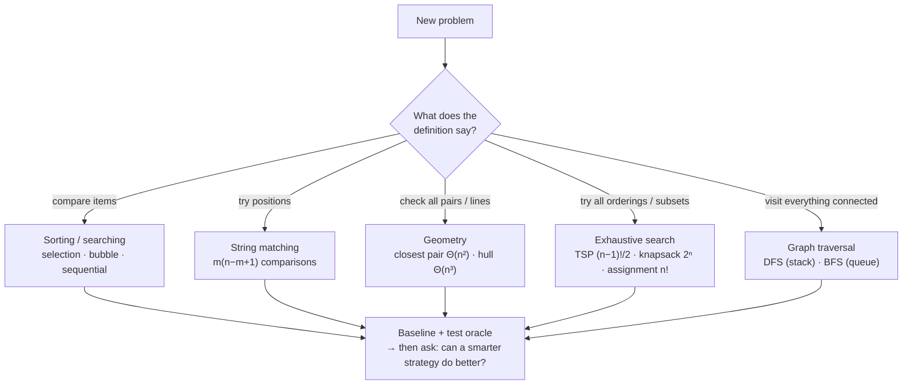
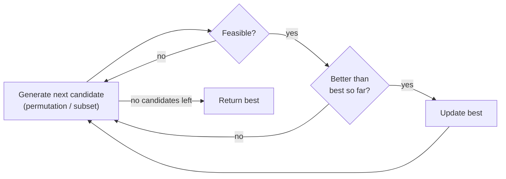
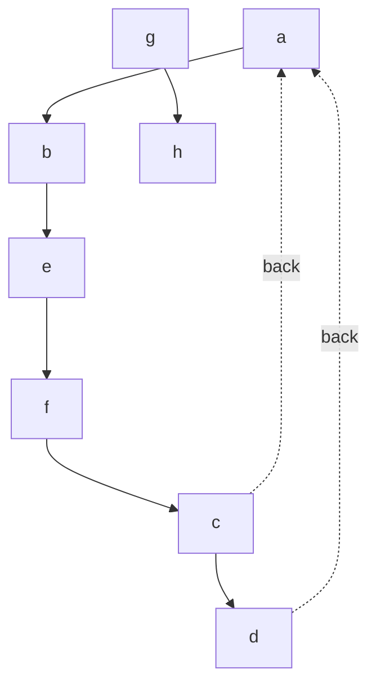

# 03 · Brute Force and Exhaustive Search

**Why this chapter matters.** Brute force means "just do what the definition says" — compare every pair, try every
position, list every candidate. It is the first design strategy because it is the one you can *always* apply, and
because its answers are easy to trust. You'll use it as a baseline, as a test oracle for clever algorithms, and — more
often than textbooks admit — as the real production solution when inputs are small. This chapter builds the classic
brute-force algorithms (selection and bubble sort, sequential search, string matching, closest pair, convex hull),
the exhaustive-search trio (Traveling Salesman Problem (TSP), knapsack, assignment), and the two graph traversals every later chapter
depends on: Depth-First Search (DFS) and Breadth-First Search (BFS). (Levitin Chapter 3.)

🎮 Sims: [sorting studio](https://normansrule.github.io/algorithm-forge/sims/sorting-studio.html) ·
[string match](https://normansrule.github.io/algorithm-forge/sims/string-match.html) ·
[closest pair & hull](https://normansrule.github.io/algorithm-forge/sims/closest-pair-hull.html) ·
[exhaustive search](https://normansrule.github.io/algorithm-forge/sims/exhaustive-search.html) ·
[graph traversal](https://normansrule.github.io/algorithm-forge/sims/graph-traversal.html) ·
🏟️ [Arena: Chapter 3](https://normansrule.github.io/algorithm-forge/arena/?chapter=3) ·
🐍 [Code: `ch03_brute_force.py`](../../src/python/algoforge/ch03_brute_force.py) ·
📝 [Practice](../../practice/) ·
⬅️ [02 Analysis Framework](../02-analysis-framework/README.md) · ➡️ [04 Decrease-and-Conquer](../04-decrease-and-conquer/README.md)

---

## Contents

1. [The big idea in 60 seconds](#the-big-idea-in-60-seconds)
2. [Build Card A — Selection sort](#build-card-a--selection-sort)
3. [Build Card B — Bubble sort](#build-card-b--bubble-sort)
4. [Build Card C — Sequential search with a sentinel](#build-card-c--sequential-search-with-a-sentinel)
5. [Build Card D — Brute-force string matching](#build-card-d--brute-force-string-matching)
6. [Bonus — Brute-force polynomial evaluation](#bonus--brute-force-polynomial-evaluation)
7. [Build Card E — Closest pair by brute force](#build-card-e--closest-pair-by-brute-force)
8. [Build Card F — Convex hull by brute force](#build-card-f--convex-hull-by-brute-force)
9. [Exhaustive search](#exhaustive-search) — Build Cards [G TSP](#build-card-g--traveling-salesman-problem-by-exhaustive-search), [H Knapsack](#build-card-h--knapsack-by-exhaustive-search), [I Assignment](#build-card-i--assignment-problem-by-exhaustive-search)
10. [Graph traversal](#graph-traversal) — Build Cards [J DFS](#build-card-j--depth-first-search-dfs), [K BFS](#build-card-k--breadth-first-search-bfs)
11. [How a senior engineer thinks about this chapter](#how-a-senior-engineer-thinks-about-this-chapter)
12. [Check yourself](#-check-yourself)
13. [Go deeper](#-go-deeper)

---

## The big idea in 60 seconds

**Brute force** is a straightforward approach based directly on the problem statement and the definitions involved.
Sorting? Repeatedly pick the smallest. Searching? Look at each item. String matching? Try the pattern at every
position. Closest pair? Measure every pair.

**Exhaustive search** is brute force for combinatorial problems: **generate every candidate** (every permutation,
every subset), **check each one**, and **keep the best**. It's always correct, and it's usually exponential or
factorial — fine for $n \le 10$ or so, hopeless for $n = 50$.

**Graph traversal** (DFS and BFS) systematically visits every vertex and edge — brute force for graphs, and the
engine inside dozens of smarter algorithms.

| Strength | Weakness |
|---|---|
| Applies to almost every problem | Rarely efficient |
| Simple to write, easy to trust | Some brute-force algorithms are unacceptably slow |
| Reasonable for important problems (sorting small arrays, matrix multiplication, string search) | Not as "constructive" as other strategies — it doesn't teach you much about the problem |
| Perfect baseline and test oracle | |



---

## Build Card A — Selection sort

### 🎯 Problem in one sentence
Given an array of $n$ orderable elements → rearrange it into nondecreasing order by repeatedly **selecting** the
smallest remaining element.

### 📖 Story
Picking a team by height, shortest first: scan everyone left, point at the shortest, have them swap places with
whoever is standing in the next open spot at the front. Repeat with the people who haven't been placed.

### 👀 See it
In the [sorting studio](https://normansrule.github.io/algorithm-forge/sims/sorting-studio.html), pick **Selection
sort** and type `29, 10, 14, 37, 13`.

```
pass i = 1:   10 │ 29  14  37  13        sorted part │ unsorted part
                    ↑           ↑
                    i         min (13)   → swap A[1] and A[4]
              10  13 │ 14  37  29
```

The invariant: **before pass $i$, `A[0..i-1]` holds the $i$ smallest elements in sorted order**, and they never move
again.

### 🧱 Build it in blocks

**Block 1 — state.** The index of the smallest element found so far in this pass.

```
minIdx ← i
```

**Block 2 — skeleton.** One pass per position `i` (the last element falls into place automatically), and inside it a
scan of everything to the right.

```
for i ← 0 to n - 2 do
    minIdx ← i
    for j ← i + 1 to n - 1 do
        // is A[j] a new minimum?
```

**Block 3 — decision.** Update the minimum, then put it in position `i`.

```
for i ← 0 to n - 2 do
    minIdx ← i
    for j ← i + 1 to n - 1 do
        if A[j] < A[minIdx] then
            minIdx ← j
    swap A[i] and A[minIdx]
```

**Block 4 — return.** The array, now sorted.

### ✋ Trace it by hand — `A = [29, 10, 14, 37, 13]`

| i | scanned `A[i+1..4]` | comparisons | minIdx (value) | array after swap |
|---|---|---|---|---|
| 0 | 10, 14, 37, 13 | 4 | 1 (10) | [**10**, 29, 14, 37, 13] |
| 1 | 14, 37, 13 | 3 | 4 (13) | [10, **13**, 14, 37, 29] |
| 2 | 37, 29 | 2 | 2 (14) — swap with itself | [10, 13, **14**, 37, 29] |
| 3 | 29 | 1 | 4 (29) | [10, 13, 14, **29**, 37] |
| | | **10** | | 3 real swaps (4 executed) |

### 💻 Code

```
ALGORITHM SelectionSort(A[0..n-1])
    // Sorts a given array by selection sort
    // Input: An array A[0..n-1] of orderable elements
    // Output: Array A[0..n-1] sorted in nondecreasing order
    for i ← 0 to n - 2 do
        minIdx ← i
        for j ← i + 1 to n - 1 do
            if A[j] < A[minIdx] then
                minIdx ← j
        swap A[i] and A[minIdx]
    return A
```

<details>
<summary>🐍 Python</summary>

```python
def selection_sort(a):
    a = list(a)
    n = len(a)
    for i in range(n - 1):
        min_idx = i
        for j in range(i + 1, n):
            if a[j] < a[min_idx]:
                min_idx = j
        a[i], a[min_idx] = a[min_idx], a[i]
    return a
```
</details>

<details>
<summary>☕ Java</summary>

```java
static void selectionSort(int[] a) {
    int n = a.length;
    for (int i = 0; i <= n - 2; i++) {
        int minIdx = i;
        for (int j = i + 1; j <= n - 1; j++)
            if (a[j] < a[minIdx]) minIdx = j;
        int t = a[i]; a[i] = a[minIdx]; a[minIdx] = t;
    }
}
```
</details>

### 🧮 Analyze it
- **Size:** $n$. **Basic operation:** the key comparison `A[j] < A[minIdx]`.
- The count does **not** depend on the input — every pass scans the whole unsorted part:

$$C(n) = \sum_{i=0}^{n-2}\sum_{j=i+1}^{n-1}1 = \sum_{i=0}^{n-2}(n-1-i) = (n-1) + (n-2) + \dots + 1 = \frac{n(n-1)}{2} \in \Theta(n^2).$$

- **Swaps:** exactly $n - 1$ executed (one per pass) → $\Theta(n)$. This is selection sort's claim to fame: the fewest
  writes of any simple sort — useful when writing is expensive (flash memory, moving heavy objects).
- **Space:** in-place, $\Theta(1)$ extra.
- **Stable?** **No.** Example: `[5ᵃ, 5ᵇ, 2]` → pass 0 swaps `5ᵃ` with `2` → `[2, 5ᵇ, 5ᵃ]`. The long-distance swap jumps
  an element over its equal twin.

**Correctness (induction on $n$, as in the lecture).** Base: $n = 1$ is sorted. Step: for $n = k + 1$ the first pass
puts the smallest element at `A[0]`; the remaining passes are exactly selection sort on the $k$ elements
`A[1..k]`, which by hypothesis sorts them — and all of them are $\ge$ `A[0]`. So the whole array is sorted.

### ⚠️ Common mistakes
- **Swapping inside the inner loop** (every time a smaller element is seen) — that turns it into a clumsy exchange
  sort with $\Theta(n^2)$ swaps.
- **Comparing with `A[i]` instead of `A[minIdx]`.** You must compare with the *current* minimum.
- **Outer loop to `n - 1`**: harmless (inner loop is empty) but shows you haven't noticed the last element is placed
  automatically.
- **Counting comparisons as $n^2$**: it's $n(n-1)/2$ — about half.

### 🔁 Variations / where it's used
Recursive formulation: put the minimum first, then sort `A[1..n-1]` — the recurrence $C(n) = C(n-1) + (n-1)$ gives the
same $n(n-1)/2$ (see [Check yourself Q6](#-check-yourself)). **Heapsort** (Chapter 6) is selection sort with a smarter
"find the minimum": a heap brings each selection down from $\Theta(n)$ to $\Theta(\log n)$.

---

## Build Card B — Bubble sort

### 🎯 Problem in one sentence
Given an array → sort it by repeatedly comparing **adjacent** elements and swapping them if they're out of order.

### 📖 Story
Bubbles in a glass: on each pass the largest remaining bubble rises to the top. Each pass fixes one more element at
the end of the array.

### 👀 See it
[Sorting studio](https://normansrule.github.io/algorithm-forge/sims/sorting-studio.html) → **Bubble sort** → same
input `29, 10, 14, 37, 13`. Turn on "early exit" and try `1, 2, 3, 5, 4`.

```
pass 0:  [29 10] 14  37  13   swap →  10 29 14 37 13
          10 [29 14] 37  13   swap →  10 14 29 37 13
          10  14 [29 37] 13   ok
          10  14  29 [37 13]  swap →  10 14 29 13 │37   ← 37 bubbled to its final place
```

### 🧱 Build it in blocks

**Block 1 — state:** nothing but indices (plus, in the improved version, a `swapped` flag).

**Block 2 — skeleton:** pass `i` compares pairs `(j, j+1)` for `j` from 0 up to the last unsettled pair.

```
for i ← 0 to n - 2 do
    for j ← 0 to n - 2 - i do
        // compare A[j] and A[j + 1]
```

**Block 3 — decision:** swap if out of order (strictly — that keeps it stable).

```
for i ← 0 to n - 2 do
    for j ← 0 to n - 2 - i do
        if A[j + 1] < A[j] then
            swap A[j] and A[j + 1]
```

**Block 4 — return:** `A`.

### ✋ Trace it by hand — `A = [29, 10, 14, 37, 13]`

| pass i | pairs compared (j = 0 … 3 − i) | swaps | array after pass |
|---|---|---|---|
| 0 | (29,10)✔ (29,14)✔ (29,37) (37,13)✔ | 3 | [10, 14, 29, 13, **37**] |
| 1 | (10,14) (14,29) (29,13)✔ | 1 | [10, 14, 13, **29**, **37**] |
| 2 | (10,14) (14,13)✔ | 1 | [10, 13, **14**, **29**, **37**] |
| 3 | (10,13) | 0 | [**10**, **13**, 14, 29, 37] |
| | **10 comparisons** | **5 swaps** | |

5 swaps = the number of **inversions** (out-of-order pairs) in the input: (29,10), (29,14), (29,13), (14,13), (37,13).
Every adjacent swap removes exactly one inversion.

### 💻 Code

```
ALGORITHM BubbleSort(A[0..n-1])
    // Sorts a given array by bubble sort
    // Output: Array A[0..n-1] sorted in nondecreasing order
    for i ← 0 to n - 2 do
        for j ← 0 to n - 2 - i do
            if A[j + 1] < A[j] then
                swap A[j] and A[j + 1]
    return A

ALGORITHM BubbleSortEarlyExit(A[0..n-1])
    // Stops as soon as a pass makes no swaps
    i ← 0
    swapped ← true
    while i ≤ n - 2 and swapped do
        swapped ← false
        for j ← 0 to n - 2 - i do
            if A[j + 1] < A[j] then
                swap A[j] and A[j + 1]
                swapped ← true
        i ← i + 1
    return A
```

<details>
<summary>🐍 Python</summary>

```python
def bubble_sort(a, early_exit=True):
    a = list(a)
    n = len(a)
    for i in range(n - 1):
        swapped = False
        for j in range(n - 1 - i):
            if a[j + 1] < a[j]:
                a[j], a[j + 1] = a[j + 1], a[j]
                swapped = True
        if early_exit and not swapped:
            break
    return a
```
</details>

<details>
<summary>☕ Java</summary>

```java
static void bubbleSort(int[] a) {
    int n = a.length;
    boolean swapped = true;
    for (int i = 0; i <= n - 2 && swapped; i++) {
        swapped = false;
        for (int j = 0; j <= n - 2 - i; j++)
            if (a[j + 1] < a[j]) { int t = a[j]; a[j] = a[j + 1]; a[j + 1] = t; swapped = true; }
    }
}
```
</details>

### 🧮 Analyze it
- **Basic operation:** the comparison `A[j + 1] < A[j]`. Basic version, every input:

$$C(n) = \sum_{i=0}^{n-2}\sum_{j=0}^{n-2-i}1 = \sum_{i=0}^{n-2}(n-1-i) = \frac{n(n-1)}{2} \in \Theta(n^2).$$

- **Swaps** = number of inversions: 0 (sorted) up to $n(n-1)/2$ (reversed) → $S_{worst}(n) = n(n-1)/2 \in \Theta(n^2)$.
  On average, $n(n-1)/4$.
- **Early-exit version:** best case (already sorted) is one pass, $n - 1$ comparisons → $\Theta(n)$. Worst case is
  still $\Theta(n^2)$. On `[1, 2, 3, 5, 4]`: pass 0 makes 4 comparisons and 1 swap; pass 1 makes 3 comparisons and no
  swaps → stop after 7 comparisons instead of 10.
- **Stable:** yes (it only swaps strictly out-of-order neighbors). **In-place:** yes.

### ⚠️ Common mistakes
- **Inner bound `n - 1 - i`** instead of `n - 2 - i` reads `A[j + 1]` past the end on the first pass.
- **Using `≤` in the swap test** breaks stability and does useless swaps of equal elements.
- **Thinking early exit makes it fast.** It only helps on nearly-sorted inputs; one small element at the end
  ("turtle") still needs $n - 1$ passes.

### 🔁 Variations / where it's used
Cocktail shaker sort (alternating directions, fixes turtles faster), comb sort (compares elements a shrinking gap
apart). In practice, **insertion sort** (Chapter 4) dominates all of these among the simple sorts. Bubble sort's real
value is teaching: inversions, stability, and the idea that a pass can prove "already sorted."

---

## Build Card C — Sequential search with a sentinel

### 🎯 Problem in one sentence
Given an array of $n$ elements and a key $K$ → return the index of the first element equal to $K$, or $-1$, making
only **one** comparison per element.

### 📖 Story
Looking for your friend in a line of people — but you stand at the end of the line yourself. Now you can walk
without checking "have I reached the end?" at every step: you're guaranteed to find *someone* who matches, and if it's
you, your friend wasn't there.

### 👀 See it
```
Plain:      i < n ?  A[i] ≠ K ?    ← two tests per step
Sentinel:   A = [31  7  58  7  12 │ 40]      (append K = 40 as a sentinel)
                                     ↑ search is guaranteed to stop here at the latest
            only   A[i] ≠ K ?       ← one test per step
```

### 🧱 Build it in blocks
1. **State:** place the sentinel `K` at position `n`; index `i ← 0`.
2. **Skeleton:** `while A[i] ≠ K do i ← i + 1` — no bounds check needed.
3. **Decision:** where did we stop? Before `n` = real match; at `n` = only the sentinel.
4. **Return:** `i` or `-1`.

```
ALGORITHM SentinelSearch(A[0..n-1], K)
    // Sequential search with the search key as a sentinel
    // Input: An array A of n elements and a search key K
    // Output: Index of the first element of A equal to K, or -1
    // Note: appends one cell to A (the sentinel)
    append(A, K)
    i ← 0
    while A[i] ≠ K do
        i ← i + 1
    if i < n then
        return i
    else
        return -1
```

### ✋ Trace it by hand — `A = [31, 7, 58, 7, 12]`

| K | comparisons `A[i] ≠ K` | stopped at | result |
|---|---|---|---|
| 7 | 31≠7 ✔, 7≠7 ✘ → **2** | i = 1 | 1 (the *first* 7) |
| 12 | 5 | i = 4 | 4 |
| 40 | 6 (5 real + sentinel) | i = 5 = n | −1 |

<details>
<summary>🐍 Python and ☕ Java</summary>

```python
def sentinel_search(a, key):
    b = list(a) + [key]          # copy so the caller's list is untouched
    i = 0
    while b[i] != key:
        i += 1
    return i if i < len(a) else -1
```

```java
// Assumes the array has one spare slot at index n (a.length == n + 1).
static int sentinelSearch(int[] a, int n, int key) {
    a[n] = key;
    int i = 0;
    while (a[i] != key) i++;
    return i < n ? i : -1;
}
```
</details>

### 🧮 Analyze it
- Key comparisons: worst case $n + 1$ (not found), best case 1. Average for a successful search with equally likely
  positions: $(n+1)/2$. Class: $\Theta(n)$ worst and average.
- The gain is a **constant factor**: the plain version does about $2n$ comparisons in the worst case ($n$ key
  comparisons + $n + 1$ index checks); the sentinel version about $n$.
- If the array is **sorted**, you can stop as soon as `A[i] > K` — still $\Theta(n)$, but faster on unsuccessful
  searches. (Binary search, Chapter 4, is the real fix: $\Theta(\log n)$.)

### ⚠️ Common mistakes
- Forgetting there must be **room** for the sentinel (Java arrays can't grow).
- Returning `i` without checking `i < n` — "found" the sentinel.
- In the plain version, writing `A[i] ≠ K and i < n` (wrong order) — reads `A[n]` before checking the bound.

### 🔁 Where it's used
Sentinels simplify loops everywhere: a dummy head node in linked lists, a `'\0'` terminator in C strings, a `+∞`
sentinel at the end of each run in merge sort's merge.

---

## Build Card D — Brute-force string matching

### 🎯 Problem in one sentence
Given a text $T$ of $n$ characters and a pattern $P$ of $m \le n$ characters → return the index of the first position
where $P$ occurs in $T$ (or $-1$).

### 📖 Story
Sliding a stencil along a sentence: line it up at the start, compare letter by letter; at the first mismatch slide
it one position right and start over.

### 👀 See it
[String-match sim](https://normansrule.github.io/algorithm-forge/sims/string-match.html) → **Brute force** → text
`ABRACADABRA`, pattern `CAD`.

```
A B R A C A D A B R A
C                       shift 0: C≠A  ✘ (1 comparison)
  C                     shift 1: C≠B  ✘ (1)
    C                   shift 2: C≠R  ✘ (1)
      C                 shift 3: C≠A  ✘ (1)
        C A D           shift 4: C=C, A=A, D=D  ✔ (3)  → return 4
```

### 🧱 Build it in blocks

**Block 1 — state:** shift `i` (where the pattern starts in the text) and `j` (how many characters matched).

**Block 2 — skeleton:** try every shift where the pattern still fits: `i` from 0 to `n - m`.

```
for i ← 0 to n - m do
    j ← 0
    // compare P[0..m-1] with T[i..i+m-1]
```

**Block 3 — decision:** extend the match while characters agree.

```
for i ← 0 to n - m do
    j ← 0
    while j < m and P[j] = T[i + j] do
        j ← j + 1
    if j = m then
        return i
```

**Block 4 — return:** `-1` if no shift matched.

### ✋ Trace it by hand — worst case: $T$ = `AAAAAAAAAB` ($n = 10$), $P$ = `AAB` ($m = 3$)

| shift i | text window | comparisons | result |
|---|---|---|---|
| 0 | AAA | A=A, A=A, B≠A → 3 | ✘ |
| 1 | AAA | 3 | ✘ |
| 2 | AAA | 3 | ✘ |
| 3 | AAA | 3 | ✘ |
| 4 | AAA | 3 | ✘ |
| 5 | AAA | 3 | ✘ |
| 6 | AAA | 3 | ✘ |
| 7 | AAB | 3 | ✔ return 7 |
| | | **24** $= m(n - m + 1) = 3 \cdot 8$ | |

### 💻 Code

```
ALGORITHM BruteForceStringMatch(T[0..n-1], P[0..m-1])
    // Implements brute-force string matching
    // Input: Text T of n characters, pattern P of m characters
    // Output: Index of the first character of the first matching substring, or -1
    for i ← 0 to n - m do
        j ← 0
        while j < m and P[j] = T[i + j] do
            j ← j + 1
        if j = m then
            return i
    return -1
```

<details>
<summary>🐍 Python</summary>

```python
def brute_force_match(text: str, pattern: str) -> int:
    n, m = len(text), len(pattern)
    for i in range(n - m + 1):
        j = 0
        while j < m and pattern[j] == text[i + j]:
            j += 1
        if j == m:
            return i
    return -1
```
</details>

<details>
<summary>☕ Java</summary>

```java
static int bruteForceMatch(String t, String p) {
    int n = t.length(), m = p.length();
    for (int i = 0; i <= n - m; i++) {
        int j = 0;
        while (j < m && p.charAt(j) == t.charAt(i + j)) j++;
        if (j == m) return i;
    }
    return -1;
}
```
</details>

### 🧮 Analyze it
- **Size:** $n$ and $m$. **Basic operation:** character comparison.
- **Worst case:** at each of the $n - m + 1$ shifts, all $m$ characters are compared (mismatch on the last one, as in
  the trace): $C_{worst} = m(n - m + 1) \in O(nm)$. For $m$ much smaller than $n$ that's $\Theta(nm)$.
- **Best case (successful):** match at shift 0, $m$ comparisons.
- **Average case on natural-language text:** most shifts fail on the first or second character, so it behaves like
  $\Theta(n + m)$ — in practice about linear. That's why this naive algorithm is still used for short patterns.

### ⚠️ Common mistakes
- **Loop to `n - 1`** instead of `n - m`: reads past the end of the text.
- **Loop to `n - m - 1`**: misses a match at the very end (e.g. `"AB"` in `"XAB"`).
- **Mismatch counting:** a failed window costs `j + 1` comparisons (the matched ones plus the failing one), not `j`.

### 🔁 Variations / where it's used
Finding **all** occurrences (don't return; record and continue). Chapter 7 speeds this up with precomputed shift
tables (Horspool, Boyer–Moore) and Knuth–Morris–Pratt (KMP) avoids re-comparing matched characters. C's `strstr`
and many `indexOf` implementations use brute force for short patterns or as a fallback.

---

## Bonus — Brute-force polynomial evaluation

From the lecture: evaluate $p(x) = a_n x^n + \dots + a_1 x + a_0$ at a point $x$.

```
ALGORITHM PolyBruteForce(a[0..k], x)
    // a[i] is the coefficient of x^i; the degree is n = k
    p ← 0
    for i ← k downto 0 do
        power ← 1
        for j ← 1 to i do
            power ← power * x
        p ← p + a[i] * power
    return p

ALGORITHM PolyBetter(a[0..k], x)
    p ← a[0]
    power ← 1
    for i ← 1 to k do
        power ← power * x
        p ← p + a[i] * power
    return p
```

(The header `a[0..k]` binds `k` = the last index, which is the degree $n$.) Multiplications: brute force
$\sum_{i=0}^{n}(i + 1) = \frac{(n+1)(n+2)}{2} \in \Theta(n^2)$ (the $i$ for $x^i$ plus one for $a_i$). The better
version reuses $x^{i-1}$ to get $x^i$: $2n$ multiplications, $\Theta(n)$. Horner's rule (Chapter 6) gets it to $n$.
The lesson: **brute force often recomputes things; spotting the recomputation is the first improvement.**

---

## Build Card E — Closest pair by brute force

### 🎯 Problem in one sentence
Given $n \ge 2$ points in the plane → return the smallest distance between any two of them (and which pair).

### 📖 Story
Air-traffic control wants the two planes that are closest together. The honest way: measure the distance between
every pair of planes and keep the smallest.

### 👀 See it
[Closest pair & hull sim](https://normansrule.github.io/algorithm-forge/sims/closest-pair-hull.html) → **Closest
pair (brute force)** → click to add points, or type `(1,1) (4,5) (7,2) (5,4) (9,8)`.

```
 y
 8 |                          P4
 6 |
 5 |         P1
 4 |            P3                 closest: P1–P3, distance √2
 2 |                  P2
 1 |  P0
   +──────────────────────────── x
      1      4  5     7     9
```

### 🧱 Build it in blocks
1. **State:** the best squared distance so far `d ← ∞` (and the best pair).
2. **Skeleton:** all pairs `i < j`, exactly like element uniqueness.
3. **Decision:** compute the **squared** distance (no square root!) and keep the minimum.
4. **Return:** `sqrt(d)` once, at the end.

```
ALGORITHM BruteForceClosestPair(X[0..n-1], Y)
    // Finds the distance between the two closest points in the plane by brute force
    // Input: n ≥ 2 points; point i is (X[i], Y[i])
    // Output: The distance between the closest pair of points
    d ← ∞
    for i ← 0 to n - 2 do
        for j ← i + 1 to n - 1 do
            dx ← X[i] - X[j]
            dy ← Y[i] - Y[j]
            d ← min(d, dx * dx + dy * dy)
    return sqrt(d)
```

### ✋ Trace it by hand
Points P0(1,1), P1(4,5), P2(7,2), P3(5,4), P4(9,8):

| pair | $dx^2 + dy^2$ | best so far |
|---|---|---|
| P0–P1 | 9 + 16 = 25 | **25** |
| P0–P2 | 36 + 1 = 37 | 25 |
| P0–P3 | 16 + 9 = 25 | 25 (tie, not smaller) |
| P0–P4 | 64 + 49 = 113 | 25 |
| P1–P2 | 9 + 9 = 18 | **18** |
| P1–P3 | 1 + 1 = 2 | **2** |
| P1–P4 | 25 + 9 = 34 | 2 |
| P2–P3 | 4 + 4 = 8 | 2 |
| P2–P4 | 4 + 36 = 40 | 2 |
| P3–P4 | 16 + 16 = 32 | 2 |

10 pairs $= 5\cdot4/2$. Answer: P1–P3, distance $\sqrt2 \approx 1.414$.

<details>
<summary>🐍 Python</summary>

```python
from math import sqrt, inf

def closest_pair_brute(points):
    """points: list of (x, y). Returns (distance, i, j)."""
    best, bi, bj = inf, -1, -1
    n = len(points)
    for i in range(n - 1):
        xi, yi = points[i]
        for j in range(i + 1, n):
            dx, dy = xi - points[j][0], yi - points[j][1]
            d2 = dx * dx + dy * dy
            if d2 < best:
                best, bi, bj = d2, i, j
    return sqrt(best), bi, bj
```
</details>

<details>
<summary>☕ Java</summary>

```java
static double closestPairBrute(double[] x, double[] y) {
    int n = x.length;
    double best = Double.POSITIVE_INFINITY;
    for (int i = 0; i < n - 1; i++)
        for (int j = i + 1; j < n; j++) {
            double dx = x[i] - x[j], dy = y[i] - y[j];
            best = Math.min(best, dx * dx + dy * dy);
        }
    return Math.sqrt(best);
}
```
</details>

### 🧮 Analyze it
Basic operation: computing a squared distance (two multiplications, or count one "distance evaluation"):

$$C(n) = \sum_{i=0}^{n-2}\sum_{j=i+1}^{n-1}1 = \frac{n(n-1)}{2} \in \Theta(n^2).$$

Only **one** square root at the end. Since $\sqrt{\ }$ is increasing, the pair minimizing $d^2$ also minimizes $d$.

### ⚠️ Common mistakes
- **Taking `sqrt` inside the loop:** slower, and introduces floating-point error for no reason.
- **Comparing a point with itself** (`j` starting at `i`): distance 0 always wins.
- **Integer overflow** when squaring large coordinates in Java `int` — use `long` or `double`.

### 🔁 Variations / where it's used
Divide-and-conquer brings this down to $\Theta(n\log n)$ (Chapter 5). In practice, spatial indexes (grids, k-d trees)
answer nearest-neighbor queries in games, Geographic Information Systems (GIS), and clustering. For $n \le$ a few hundred, brute force is often
fastest — no preprocessing, perfect cache behavior.

---

## Build Card F — Convex hull by brute force

### 🎯 Problem in one sentence
Given $n$ points in the plane → find the **extreme points**: the corners of the smallest convex polygon containing all
of them.

### 📖 Story
Hammer nails into a board at the points and stretch a rubber band around all of them; let go. The band snaps onto the
convex hull; the nails it touches are the extreme points.

### 👀 See it
[Closest pair & hull sim](https://normansrule.github.io/algorithm-forge/sims/closest-pair-hull.html) → **Convex hull
(brute force)**. Watch each candidate segment turn green (all other points on one side) or red.

```
 y
 6 |          D
   |        ╱    ╲
 4 |      ╱        ╲ C          hull edges: AB, BC, CD, DA
 3 |    ╱      F    │           E and F are inside
 2 |  ╱   E         │
   |╱               │
 0 A───────────────B
   0   2   3   4   6  7   x
```

Key fact: the segment $P_iP_j$ is on the hull's boundary **iff all other points lie on the same side** of the line
through $P_i$ and $P_j$.

### 🧱 Build it in blocks

**Block 1 — state:** the line through $(x_1, y_1)$ and $(x_2, y_2)$ as $ax + by = c$, with
$a = y_2 - y_1$, $b = x_1 - x_2$, $c = x_1y_2 - y_1x_2$. For any point, the sign of $ax + by - c$ tells which side it's
on (0 = on the line).

**Block 2 — skeleton:** every pair $(i, j)$, and for each pair every other point $k$.

**Block 3 — decision:** count points with positive and negative signs; if one of the counts is 0, the segment is a
hull edge.

**Block 4 — return:** the list of hull edges (their endpoints are the extreme points).

```
ALGORITHM BruteForceHullEdges(X[0..n-1], Y)
    // Finds the edges of the convex hull of n points by brute force
    // Input: points (X[i], Y[i]), no three collinear
    // Output: List of index pairs [i, j] such that segment PiPj is a hull edge
    E ← []
    for i ← 0 to n - 2 do
        for j ← i + 1 to n - 1 do
            a ← Y[j] - Y[i]
            b ← X[i] - X[j]
            c ← X[i] * Y[j] - Y[i] * X[j]
            pos ← 0
            neg ← 0
            for k ← 0 to n - 1 do
                if k ≠ i and k ≠ j then
                    s ← a * X[k] + b * Y[k] - c
                    if s > 0 then
                        pos ← pos + 1
                    else if s < 0 then
                        neg ← neg + 1
            if pos = 0 or neg = 0 then
                append(E, [i, j])
    return E
```

### ✋ Trace it by hand
Points A(0,0), B(6,0), C(7,4), D(3,6), E(2,2), F(4,3). A few of the 15 pairs (values of $ax + by - c$ at the other
four points, in alphabetical order):

| segment | $(a, b, c)$ | signs at the other points | hull edge? |
|---|---|---|---|
| AB | (0, −6, 0) | C −24, D −36, E −12, F −18 | ✔ all negative |
| BC | (4, −1, 24) | A −24, D −18, E −18, F −11 | ✔ |
| CD | (2, 4, 30) | A −30, B −18, E −18, F −10 | ✔ |
| AD | (6, −3, 0) | B +36, C +30, E +6, F +15 | ✔ all positive |
| AC | (4, −7, 0) | B +24, D −30, E −6, F −5 | ✘ mixed |
| BD | (6, 3, 36) | A −36, C +18, E −18, F −3 | ✘ |
| EF | (1, −2, −2) | A +2, B +8, C +1, D −7 | ✘ |

All 15 pairs checked: exactly **AB, BC, CD, DA** pass → extreme points A, B, C, D.

<details>
<summary>🐍 Python</summary>

```python
def brute_force_hull_edges(pts):
    n, edges = len(pts), []
    for i in range(n - 1):
        (x1, y1) = pts[i]
        for j in range(i + 1, n):
            (x2, y2) = pts[j]
            a, b, c = y2 - y1, x1 - x2, x1 * y2 - y1 * x2
            pos = neg = 0
            for k in range(n):
                if k != i and k != j:
                    s = a * pts[k][0] + b * pts[k][1] - c
                    pos += s > 0
                    neg += s < 0
            if pos == 0 or neg == 0:
                edges.append((i, j))
    return edges
```
</details>

<details>
<summary>☕ Java</summary>

```java
static java.util.List<int[]> hullEdges(long[] x, long[] y) {
    int n = x.length; var edges = new java.util.ArrayList<int[]>();
    for (int i = 0; i < n - 1; i++)
        for (int j = i + 1; j < n; j++) {
            long a = y[j] - y[i], b = x[i] - x[j], c = x[i] * y[j] - y[i] * x[j];
            int pos = 0, neg = 0;
            for (int k = 0; k < n; k++) {
                if (k == i || k == j) continue;
                long s = a * x[k] + b * y[k] - c;
                if (s > 0) pos++; else if (s < 0) neg++;
            }
            if (pos == 0 || neg == 0) edges.add(new int[]{i, j});
        }
    return edges;
}
```
</details>

### 🧮 Analyze it
Basic operation: evaluating the sign $ax + by - c$ for one point. There are $n(n-1)/2$ pairs, and each checks $n - 2$
other points:

$$C(n) = \frac{n(n-1)}{2}(n-2) \in \Theta(n^3).$$

For our 6 points: $15 \times 4 = 60$ sign evaluations.

### ⚠️ Common mistakes
- **Collinear points on the hull.** If a third point lies *on* the line ($s = 0$) the simple test accepts both the
  long segment and the short ones. A robust version also checks that $s = 0$ points lie *between* the endpoints.
- **Using floating point** for integer coordinates — use exact integer arithmetic (`long`) so signs are exact.
- **Returning edges but claiming "points in order."** The brute-force output is an unordered set of edges; walking
  them into a polygon is extra work.

### 🔁 Variations / where it's used
Quickhull (Chapter 5) and Graham scan / Andrew's monotone chain run in $\Theta(n\log n)$. Convex hulls are used in
collision detection (games, robotics), computing the diameter of a point set, and as a preprocessing step in
geographic and image analysis.

---

## Exhaustive search

**Exhaustive search** solves combinatorial problems — "find the best permutation / subset / assignment" — by brute
force:

1. **Generate** every potential solution systematically (all permutations, all subsets, …).
2. **Evaluate** each: discard infeasible ones; for an optimization problem, keep the best so far.
3. **Announce** the best when the generation ends.



The catch: the number of candidates explodes.

| n | $2^n$ (subsets) | $n!$ (permutations) | $(n-1)!/2$ (distinct tours) |
|---|---|---|---|
| 5 | 32 | 120 | 12 |
| 10 | 1,024 | 3,628,800 | 181,440 |
| 20 | 1,048,576 | 2.4·10¹⁸ | 6.1·10¹⁶ |
| 30 | 1.1·10⁹ | 2.7·10³² | 4.4·10³⁰ |

---

### Build Card G — Traveling Salesman Problem by exhaustive search

#### 🎯 Problem in one sentence
Given $n$ cities and the distance between every pair → find the shortest tour that visits each city exactly once and
returns to the start (a shortest **Hamiltonian circuit** in a weighted complete graph).

#### 📖 Story
A delivery driver with four stops wants the shortest loop from the depot and back. With four stops you can list every
route on a napkin. With forty, you can't — no matter how fast your computer.

#### 👀 See it
[Exhaustive-search sim](https://normansrule.github.io/algorithm-forge/sims/exhaustive-search.html) → **TSP**. Our
example:

```
        3
   A ─────── B          AB = 3   AC = 6   AD = 4
   │ ╲     ╱ │          BC = 2   BD = 7   CD = 5
 4 │  6╲ ╱7  │ 2
   │    ╳    │
   │  ╱   ╲  │
   D ─────── C
        5
```

#### 🧱 Build it in blocks
1. **State:** the tour under construction `tour[0..n-1]` with `tour[0] = 0` fixed (start city), a `used` array, and
   `best ← ∞`.
2. **Skeleton:** recursively fill position `k` with every unused city (this generates all $(n-1)!$ permutations of
   the other cities).
3. **Decision:** when the tour is complete (`k = n`), compute its length including the return edge; keep the minimum.
4. **Return:** `best`.

```
ALGORITHM TSPExhaustive(D[0..n-1])
    // Solves the TSP by exhaustive search
    // Input: n-by-n distance matrix D, n ≥ 2
    // Output: Length of a shortest tour
    tour ← array(n, 0)
    used ← array(n, false)
    used[0] ← true
    return Extend(D, tour, used, 1, n)

ALGORITHM Extend(D, tour, used, k, n)
    // tour[0..k-1] is fixed; tries every unused city at position k
    if k = n then
        return TourLength(D, tour, n)
    best ← ∞
    for c ← 1 to n - 1 do
        if not used[c] then
            used[c] ← true
            tour[k] ← c
            best ← min(best, Extend(D, tour, used, k + 1, n))
            used[c] ← false
    return best

ALGORITHM TourLength(D, tour, n)
    total ← 0
    for i ← 0 to n - 2 do
        total ← total + D[tour[i], tour[i + 1]]
    return total + D[tour[n - 1], tour[0]]
```

#### ✋ Trace it by hand — all tours starting at A

| tour | cost | note |
|---|---|---|
| A→B→C→D→A | 3 + 2 + 5 + 4 = **14** | optimal |
| A→B→D→C→A | 3 + 7 + 5 + 6 = 21 | |
| A→C→B→D→A | 6 + 2 + 7 + 4 = 19 | |
| A→C→D→B→A | 6 + 5 + 7 + 3 = 21 | reverse of A→B→D→C→A |
| A→D→B→C→A | 4 + 7 + 2 + 6 = 19 | reverse of A→C→B→D→A |
| A→D→C→B→A | 4 + 5 + 2 + 3 = **14** | reverse of the optimal tour |

$3! = 6$ permutations, but only $3!/2 = 3$ **distinct** tours — each tour appears with its reverse.

<details>
<summary>🐍 Python</summary>

```python
from itertools import permutations
from math import inf

def tsp_exhaustive(d):
    """d: n x n distance matrix. Returns (best_length, best_tour)."""
    n = len(d)
    best, best_tour = inf, None
    for perm in permutations(range(1, n)):
        tour = (0,) + perm
        length = sum(d[tour[i]][tour[i + 1]] for i in range(n - 1)) + d[tour[-1]][0]
        if length < best:
            best, best_tour = length, tour
    return best, best_tour
```
</details>

<details>
<summary>☕ Java</summary>

```java
static int best;
static int tspExhaustive(int[][] d) {
    int n = d.length; best = Integer.MAX_VALUE;
    int[] tour = new int[n]; boolean[] used = new boolean[n]; used[0] = true;
    extend(d, tour, used, 1, 0);
    return best;
}
static void extend(int[][] d, int[] tour, boolean[] used, int k, int lenSoFar) {
    int n = d.length;
    if (k == n) { best = Math.min(best, lenSoFar + d[tour[n - 1]][0]); return; }
    for (int c = 1; c < n; c++) if (!used[c]) {
        used[c] = true; tour[k] = c;
        extend(d, tour, used, k + 1, lenSoFar + d[tour[k - 1]][c]);
        used[c] = false;
    }
}
```
</details>

#### 🧮 Analyze it
Fixing the start city leaves $(n-1)!$ permutations; each tour's length costs $n$ additions. Total
$\Theta(n \cdot (n-1)!) = \Theta(n!)$. Skipping mirror images halves the count to $(n-1)!/2$ — a constant factor that
doesn't change the class. At $n = 20$: $6.1\cdot10^{16}$ tours; at a billion tours per second, about 2 years.

#### ⚠️ Common mistakes
- Not fixing the start city (counts $n!$ tours, each $n$ times over via rotations).
- Forgetting the return edge back to the start.
- Believing "$(n-1)!/2$" makes it practical — it's still factorial.

#### 🔁 Variations / where it's used
Branch-and-bound and approximation algorithms (Chapter 12), dynamic programming over subsets (Held–Karp,
$\Theta(n^2 2^n)$). Real routing (delivery, drilling circuit boards, genome assembly) uses heuristics and solvers like
Concorde.

---

### Build Card H — Knapsack by exhaustive search

#### 🎯 Problem in one sentence
Given $n$ items with weights $w_i$ and values $v_i$ and a knapsack of capacity $W$ → find the most valuable subset
whose total weight is $\le W$.

#### 📖 Story
Packing a carry-on with an 8 kg limit: every combination of items is either too heavy or has some total value; pick
the best one that fits.

#### 👀 See it
[Exhaustive-search sim](https://normansrule.github.io/algorithm-forge/sims/exhaustive-search.html) → **Knapsack**.
Each subset is a bit string: bit $i$ = 1 means "take item $i$." Our instance, $W = 8$:

| item | 1 | 2 | 3 | 4 |
|---|---|---|---|---|
| weight | 3 | 4 | 5 | 2 |
| value | \$25 | \$30 | \$45 | \$12 |

#### 🧱 Build it in blocks
1. **State:** `bestValue ← 0`, `bestMask ← 0`.
2. **Skeleton:** count `mask` from 0 to $2^n - 1$ — each number is one subset.
3. **Decision:** decode the bits with `mod 2` / `div 2`, total the weight and value; keep it if feasible and better.
4. **Return:** `bestValue` (and `bestMask` tells you which items).

```
ALGORITHM KnapsackExhaustive(w[0..n-1], v, W)
    // Solves the 0/1 knapsack problem by trying all 2^n subsets
    // Input: weights w[0..n-1], values v[0..n-1], capacity W
    // Output: The largest total value of a subset with total weight ≤ W
    subsets ← 1
    for i ← 1 to n do
        subsets ← subsets * 2
    bestValue ← 0
    for mask ← 0 to subsets - 1 do
        weight ← 0
        value ← 0
        bits ← mask
        for i ← 0 to n - 1 do
            if bits mod 2 = 1 then
                weight ← weight + w[i]
                value ← value + v[i]
            bits ← bits div 2
        if weight ≤ W and value > bestValue then
            bestValue ← value
    return bestValue
```

#### ✋ Trace it by hand — all 16 subsets

| subset | weight | value | | subset | weight | value |
|---|---|---|---|---|---|---|
| ∅ | 0 | \$0 | | {2,3} | 9 | infeasible |
| {1} | 3 | \$25 | | {2,4} | 6 | \$42 |
| {2} | 4 | \$30 | | {3,4} | 7 | \$57 |
| {3} | 5 | \$45 | | {1,2,3} | 12 | infeasible |
| {4} | 2 | \$12 | | {1,2,4} | 9 | infeasible |
| {1,2} | 7 | \$55 | | {1,3,4} | 10 | infeasible |
| {1,3} | 8 | **\$70** ✔ best | | {2,3,4} | 11 | infeasible |
| {1,4} | 5 | \$37 | | {1,2,3,4} | 14 | infeasible |

Optimal: items {1, 3}, weight exactly 8, value \$70. Notice the greedy idea "take the best value per kg first"
(item 3 at \$9/kg, then item 1 at \$8.33/kg) happens to work here — but it fails on other instances (Chapter 9).

<details>
<summary>🐍 Python</summary>

```python
def knapsack_exhaustive(weights, values, capacity):
    n = len(weights)
    best_value, best_subset = 0, ()
    for mask in range(1 << n):
        w = v = 0
        for i in range(n):
            if mask >> i & 1:
                w += weights[i]
                v += values[i]
        if w <= capacity and v > best_value:
            best_value, best_subset = v, tuple(i for i in range(n) if mask >> i & 1)
    return best_value, best_subset
```
</details>

<details>
<summary>☕ Java</summary>

```java
static int knapsackExhaustive(int[] w, int[] v, int cap) {
    int n = w.length, best = 0;
    for (int mask = 0; mask < (1 << n); mask++) {
        int tw = 0, tv = 0;
        for (int i = 0; i < n; i++)
            if ((mask >> i & 1) == 1) { tw += w[i]; tv += v[i]; }
        if (tw <= cap && tv > best) best = tv;
    }
    return best;
}
```
</details>

#### 🧮 Analyze it
$2^n$ subsets, each decoded and totaled in $\Theta(n)$ → $\Theta(n\,2^n)$ (often stated as $\Omega(2^n)$). With
Gray-code order (Chapter 4) each subset differs from the previous one by one item, so each can be updated in $O(1)$ →
$\Theta(2^n)$. Still exponential: 40 items is about $10^{12}$ subsets.

#### ⚠️ Common mistakes
- Forgetting the empty set (value 0 is a legal answer when nothing fits).
- Using `1 << n` with $n \ge 31$ in Java `int` — overflow. (But if $n \ge 31$, exhaustive search is the wrong tool
  anyway.)
- Stopping at the first feasible subset — this is an **optimization** problem; you must see them all.

#### 🔁 Variations / where it's used
Dynamic programming solves knapsack in $\Theta(nW)$ (Chapter 8) — *pseudo*-polynomial, since $W$ is a number.
Branch-and-bound (Chapter 12) prunes the subset tree. Knapsack models budget allocation, cargo loading, and
cryptographic schemes.

---

### Build Card I — Assignment problem by exhaustive search

#### 🎯 Problem in one sentence
Given $n$ people, $n$ jobs, and a cost matrix $C$ where $C[i, j]$ is the cost of giving job $j$ to person $i$ →
assign one different job to each person so the total cost is minimal.

#### 📖 Story
Four contractors bid on four jobs. Each contractor gets exactly one job. Which pairing costs the least?

#### 👀 See it
An assignment is a **permutation**: pick one entry in each row, never two in the same column.

```
            job 1  job 2  job 3  job 4
person 1  [   8    (3)     9      6  ]
person 2  [  (4)    8      5      2  ]     optimal: (2, 1, 3, 4)
person 3  [   6     5     (3)     8  ]     = 3 + 4 + 3 + 4 = 14
person 4  [   9     2      7     (4) ]
```

#### 🧱 Build it in blocks
1. **State:** `used[0..n-1]` — which jobs are taken.
2. **Skeleton:** recursively choose a job for person `i`, then for person `i + 1`, …
3. **Decision:** only unused jobs; the cost of a choice is `C[i, j]` plus the best cost for the remaining people.
4. **Return:** the minimum over all choices (0 when every person is assigned).

```
ALGORITHM AssignmentExhaustive(C[0..n-1])
    // Solves the assignment problem by trying all n! assignments
    // Input: n-by-n cost matrix C
    // Output: Minimum total cost
    used ← array(n, false)
    return Assign(C, used, 0, n)

ALGORITHM Assign(C, used, i, n)
    // Best total cost for persons i..n-1, given the jobs marked in used
    if i = n then
        return 0
    best ← ∞
    for j ← 0 to n - 1 do
        if not used[j] then
            used[j] ← true
            best ← min(best, C[i, j] + Assign(C, used, i + 1, n))
            used[j] ← false
    return best
```

#### ✋ Trace it by hand — the 24 assignments (job for persons 1, 2, 3, 4)

| jobs | cost | jobs | cost | jobs | cost | jobs | cost |
|---|---|---|---|---|---|---|---|
| 1 2 3 4 | 23 | 2 1 3 4 | **14** | 3 1 2 4 | 22 | 4 1 2 3 | 22 |
| 1 2 4 3 | 31 | 2 1 4 3 | 22 | 3 1 4 2 | 23 | 4 1 3 2 | 15 |
| 1 3 2 4 | 22 | 2 3 1 4 | 18 | 3 2 1 4 | 27 | 4 2 1 3 | 27 |
| 1 3 4 2 | 23 | 2 3 4 1 | 25 | 3 2 4 1 | 34 | 4 2 3 1 | 26 |
| 1 4 2 3 | 22 | 2 4 1 3 | 18 | 3 4 1 2 | 19 | 4 3 1 2 | 19 |
| 1 4 3 2 | 15 | 2 4 3 1 | 17 | 3 4 2 1 | 25 | 4 3 2 1 | 25 |

Unique optimum: person 1 → job 2, person 2 → job 1, person 3 → job 3, person 4 → job 4, total **14**.

⚠️ Note the trap: picking the smallest entry in each row greedily (3, 2, 3, 2) wants jobs 2, 4, 3, 2 — job 2 twice,
not a valid assignment.

<details>
<summary>🐍 Python</summary>

```python
from itertools import permutations

def assignment_exhaustive(c):
    n = len(c)
    return min((sum(c[i][p[i]] for i in range(n)), p) for p in permutations(range(n)))
```
</details>

<details>
<summary>☕ Java</summary>

```java
static int assign(int[][] c, boolean[] used, int i) {
    int n = c.length;
    if (i == n) return 0;
    int best = Integer.MAX_VALUE;
    for (int j = 0; j < n; j++) if (!used[j]) {
        used[j] = true;
        best = Math.min(best, c[i][j] + assign(c, used, i + 1));
        used[j] = false;
    }
    return best;
}
```
</details>

#### 🧮 Analyze it
$n!$ permutations, each with $n$ additions (the recursive version shares prefix sums, but the number of leaves is
still $n!$) → $\Theta(n \cdot n!)$ or simply "factorial." For $n = 20$, $2.4\cdot10^{18}$ assignments.

#### ⚠️ Common mistakes
- Letting two people take the same job (forgetting `used`).
- Forgetting to **undo** `used[j] ← false` after the recursive call — later branches then see phantom taken jobs.

#### 🔁 Variations / where it's used
Unlike TSP and knapsack, the assignment problem has a **polynomial** algorithm: the Hungarian method,
$\Theta(n^3)$. It's also a special case of maximum-weight bipartite matching and of linear programming (Chapter 10).
Lesson: *exhaustive search being slow doesn't mean the problem is hard.*

**Final comments on exhaustive search.** It is realistic only for small instances. Sometimes much better algorithms
exist (Euler circuits, shortest paths, Minimum Spanning Trees (MST), assignment). For many problems (TSP, knapsack) no
polynomial algorithm is known, and exhaustive search or a smarter variant (backtracking, branch-and-bound) is the only
way to get an exact answer — see Chapters 11–12.

---

## Graph traversal

Many problems need to process **all** vertices and edges of a graph systematically. The two fundamental methods:

| | DFS | BFS |
|---|---|---|
| Idea | go as deep as possible, backtrack at dead ends | visit all neighbors, then their neighbors — level by level |
| Data structure | **stack** (or recursion) | **queue** |
| Undirected edge types | tree edges, **back** edges | tree edges, **cross** edges |
| Vertex orderings | two: when pushed (discovered), when popped (dead end) | one: same for enqueue and dequeue |
| Adjacency matrix | $\Theta(\lvert V\rvert^2)$ | $\Theta(\lvert V\rvert^2)$ |
| Adjacency lists | $\Theta(\lvert V\rvert + \lvert E\rvert)$ | $\Theta(\lvert V\rvert + \lvert E\rvert)$ |
| Special power | cycles, articulation points, topological sort (Chapter 4) | **shortest paths by number of edges** |

We use one example graph for both (vertices checked in alphabetical order; two components):

```
    a ──── b          g ──── h
    │ ╲    │
    │  ╲   │          adjacency lists:
    d ── c e          a: b c d     e: b f
          ╲│          b: a e       f: c e
           f          c: a d f     g: h
                      d: a c       h: g
edges: a–b a–c a–d b–e c–d c–f e–f g–h
```

---

### Build Card J — Depth-First Search (DFS)

#### 🎯 Problem in one sentence
Given a graph → visit every vertex, always moving from the current vertex to an **unvisited neighbor** when possible
and **backtracking** when stuck, numbering vertices in the order they're reached.

#### 📖 Story
Exploring a maze with a ball of string: keep walking into new corridors; at a dead end, follow the string back to the
last junction that still has an unexplored corridor.

#### 👀 See it
[Graph-traversal sim](https://normansrule.github.io/algorithm-forge/sims/graph-traversal.html) → **DFS** → load the
example or draw your own graph. The stack panel shows each vertex with (push order, pop order).

#### 🧱 Build it in blocks

**Block 1 — state:** `mark[0..n-1]`, all 0 = "unvisited"; a global visit `count`.

**Block 2 — skeleton:** an outer loop that starts a new search from every still-unvisited vertex (this handles graphs
that aren't connected), and a recursive `Visit`.

```
for v ← 0 to n - 1 do
    if mark[v] = 0 then
        // start a new DFS tree at v
```

**Block 3 — decision:** in `Visit(v)`, number `v`, then recurse into each neighbor that is still unmarked.

```
count ← count + 1
mark[v] ← count
for each w in adj[v] do
    if mark[w] = 0 then
        Visit(w)
```

**Block 4 — return:** the `mark` array (visit order); the tree edges are the `v → w` calls you made.

```
ALGORITHM DFS(adj[0..n-1])
    // Depth-first search of a graph given by adjacency lists
    // Input: adj[v] = list of neighbors of vertex v, vertices 0..n-1
    // Output: mark[v] = the order in which v was first reached
    mark ← array(n, 0)
    count ← 0
    for v ← 0 to n - 1 do
        if mark[v] = 0 then
            count ← Visit(adj, v, mark, count)
    return mark

ALGORITHM Visit(adj, v, mark, count)
    // Visits all unvisited vertices reachable from v; returns the updated count
    count ← count + 1
    mark[v] ← count
    for each w in adj[v] do
        if mark[w] = 0 then
            count ← Visit(adj, w, mark, count)
    return count
```

#### ✋ Trace it by hand

| step | action | stack (bottom → top) | edge classified |
|---|---|---|---|
| 1 | visit **a** (1) | a | — |
| 2 | a → b unvisited: visit **b** (2) | a b | a–b tree |
| 3 | b → a visited (parent); b → e: visit **e** (3) | a b e | b–e tree |
| 4 | e → b parent; e → f: visit **f** (4) | a b e f | e–f tree |
| 5 | f → c: visit **c** (5) | a b e f c | f–c tree |
| 6 | c → a visited, not parent | a b e f c | **c–a back** |
| 7 | c → d: visit **d** (6) | a b e f c d | c–d tree |
| 8 | d → a visited | a b e f c d | **d–a back** |
| 9 | d dead end → pop d; c, f, e, b dead ends → pop; a's remaining neighbors c, d already visited → pop a | (empty) | — |
| 10 | new tree: visit **g** (7), g → h: visit **h** (8); pop h, pop g | | g–h tree |

Orders (vertex$_{\text{push},\,\text{pop}}$): $a_{1,6}$, $b_{2,5}$, $e_{3,4}$, $f_{4,3}$, $c_{5,2}$, $d_{6,1}$,
$g_{7,8}$, $h_{8,7}$.

- **Push (discovery) order:** a b e f c d g h
- **Pop (dead-end) order:** d c f e b a h g

DFS forest (tree edges solid, back edges dotted):



#### 💻 Code

<details>
<summary>🐍 Python (recursive, and iterative with an explicit stack)</summary>

```python
def dfs(adj):
    """adj: dict vertex -> sorted list of neighbors. Returns (push_order, pop_order, tree, back)."""
    mark, push, pop, tree, back = {}, [], [], [], []

    def visit(v, parent):
        mark[v] = len(push) + 1
        push.append(v)
        for w in adj[v]:
            if w not in mark:
                tree.append((v, w))
                visit(w, v)
            elif w != parent and mark[w] < mark[v]:
                back.append((v, w))
        pop.append(v)

    for v in adj:
        if v not in mark:
            visit(v, None)
    return push, pop, tree, back


def dfs_iterative(adj, start):
    """Explicit-stack DFS: mark on pop, push neighbors in REVERSE so the smallest is explored first."""
    order, seen, stack = [], set(), [start]
    while stack:
        u = stack.pop()
        if u in seen:
            continue
        seen.add(u)
        order.append(u)
        for w in reversed(adj[u]):
            if w not in seen:
                stack.append(w)
    return order
```
</details>

<details>
<summary>☕ Java</summary>

```java
static int count;
static int[] dfs(java.util.List<java.util.List<Integer>> adj) {
    int n = adj.size(); int[] mark = new int[n]; count = 0;
    for (int v = 0; v < n; v++) if (mark[v] == 0) visit(adj, v, mark);
    return mark;
}
static void visit(java.util.List<java.util.List<Integer>> adj, int v, int[] mark) {
    mark[v] = ++count;
    for (int w : adj.get(v)) if (mark[w] == 0) visit(adj, w, mark);
}
```
</details>

#### 🧮 Analyze it
- Each vertex is visited once; each adjacency entry is examined once (twice per undirected edge, once from each end).
- **Adjacency lists:** $\Theta(\lvert V\rvert + \lvert E\rvert)$.
- **Adjacency matrix:** finding the neighbors of a vertex scans a whole row: $\Theta(\lvert V\rvert^2)$.
- In an undirected graph DFS produces only **tree** and **back** edges — never cross edges — because if an edge
  $(u, v)$ led to an already-finished, unrelated vertex, DFS would have followed it earlier.

#### ⚠️ Common mistakes
- **Marking on pop instead of push** in the recursive version — vertices get visited twice.
- **Forgetting the outer loop** → misses other components (our g–h).
- **Calling an edge back to the parent a "back edge."** In an undirected graph the tree edge is seen again from the
  child; it's the same edge, not a cycle.
- **Iterative DFS order surprise:** a stack reverses neighbor order; push neighbors in reverse to match the recursive
  order.
- **Deep recursion** on long paths overflows the call stack (Python's default limit is ~1000 frames) — use the
  explicit-stack version for big graphs.

#### 🔁 Variations / where it's used
Connectivity and connected components; **acyclicity** (a graph is acyclic iff DFS finds no back edge); articulation
points and biconnected components; topological sorting of DAGs (Directed Acyclic Graphs) from the pop order
(Chapter 4); strongly connected components (Chapter 14); backtracking search (Chapter 12) is DFS over a tree of partial
solutions. Real uses: garbage collectors (mark phase), build systems, maze generation, and web crawlers.

---

### Build Card K — Breadth-First Search (BFS)

#### 🎯 Problem in one sentence
Given a graph → visit every vertex **level by level**: first the start, then all its neighbors, then all *their*
unvisited neighbors, and so on.

#### 📖 Story
A rumor spreading: first your friends hear it, then friends-of-friends, then the next ring out. Or ripples on a pond.

#### 👀 See it
[Graph-traversal sim](https://normansrule.github.io/algorithm-forge/sims/graph-traversal.html) → **BFS**. Watch the
queue panel and the level numbers.

#### 🧱 Build it in blocks
1. **State:** `mark[0..n-1]`, `count`, and a queue `Q`.
2. **Skeleton:** outer loop over start vertices (for disconnected graphs); inside, `while not isEmpty(Q)`.
3. **Decision:** for the vertex at the front, mark and enqueue each unvisited neighbor **when it's first seen**, then
   dequeue the front.
4. **Return:** `mark` (the BFS order).

```
ALGORITHM BFS(adj[0..n-1])
    // Breadth-first search of a graph given by adjacency lists
    // Input: adj[v] = list of neighbors of vertex v, vertices 0..n-1
    // Output: mark[v] = the order in which v was reached
    mark ← array(n, 0)
    count ← 0
    for v ← 0 to n - 1 do
        if mark[v] = 0 then
            count ← count + 1
            mark[v] ← count
            Q ← []
            enqueue(Q, v)
            while not isEmpty(Q) do
                u ← front(Q)
                for each w in adj[u] do
                    if mark[w] = 0 then
                        count ← count + 1
                        mark[w] ← count
                        enqueue(Q, w)
                dequeue(Q)
    return mark
```

#### ✋ Trace it by hand

| front u | neighbors examined | newly marked (order) | queue after dequeue | edges |
|---|---|---|---|---|
| a | b, c, d | b(2), c(3), d(4) | b c d | a–b, a–c, a–d tree |
| b | a ✓, e | e(5) | c d e | b–e tree |
| c | a ✓, d ✓, f | f(6) | d e f | c–f tree; **c–d cross** |
| d | a ✓, c ✓ | — | e f | — |
| e | b ✓, f ✓ | — | f | **e–f cross** |
| f | c ✓, e ✓ | — | (empty) | — |
| g (new tree) | h | g(7), h(8) | … empty | g–h tree |

BFS order: **a b c d e f g h**. Levels (distance in edges from the root): a 0; b, c, d 1; e, f 2; g 0; h 1.

BFS forest (tree edges solid, cross edges dotted):

```
level 0          a                    g
               ╱ │ ╲                  │
level 1       b  c┈┈d                 h
              │  │
level 2       e┈┈f
```

Both cross edges join vertices on the **same** level here; in general a cross edge joins the same or **adjacent**
levels (proof in [Check yourself Q10](#-check-yourself)).

#### 💻 Code

<details>
<summary>🐍 Python (with distances = shortest path lengths in edges)</summary>

```python
from collections import deque

def bfs(adj, start):
    """Returns (order, dist) for the component containing start."""
    dist = {start: 0}
    order = [start]
    q = deque([start])
    while q:
        u = q.popleft()
        for w in adj[u]:
            if w not in dist:
                dist[w] = dist[u] + 1
                order.append(w)
                q.append(w)
    return order, dist
```
</details>

<details>
<summary>☕ Java</summary>

```java
static int[] bfs(java.util.List<java.util.List<Integer>> adj) {
    int n = adj.size(), count = 0; int[] mark = new int[n];
    java.util.ArrayDeque<Integer> q = new java.util.ArrayDeque<>();
    for (int v = 0; v < n; v++) {
        if (mark[v] != 0) continue;
        mark[v] = ++count; q.add(v);
        while (!q.isEmpty()) {
            int u = q.poll();
            for (int w : adj.get(u))
                if (mark[w] == 0) { mark[w] = ++count; q.add(w); }
        }
    }
    return mark;
}
```
</details>

#### 🧮 Analyze it
Same as DFS: $\Theta(\lvert V\rvert + \lvert E\rvert)$ with adjacency lists, $\Theta(\lvert V\rvert^2)$ with an
adjacency matrix. Each vertex is enqueued and dequeued exactly once; each list entry examined once.

#### ⚠️ Common mistakes
- **Marking on dequeue instead of enqueue:** a vertex can be enqueued several times (by several neighbors) — wasted
  work, and wrong distances in weighted variants.
- **Using a stack by accident** (e.g. `list.pop()` in Python instead of `popleft()`) turns BFS into a DFS-like order.
- **`list.pop(0)` in Python** is $\Theta(n)$ per call — use `collections.deque`.

#### 🔁 Variations / where it's used
**Shortest paths in unweighted graphs** (fewest edges) — BFS's superpower: social-network "degrees of separation,"
routing hops in networks, puzzle solvers (fewest moves). Bipartiteness testing (2-color by level parity).
Web crawlers and garbage collectors (Cheney's algorithm). With edge weights you need Dijkstra's algorithm
(Chapter 9); with 0/1 weights, a deque-based "0-1 BFS."

---

## How a senior engineer thinks about this chapter

- **Brute force is the default for small $n$.** Sorting 20 items, matching a 5-character pattern in a log line,
  finding the closest of 100 points — brute force is simpler, has no setup cost, and is often *faster* because of
  tiny constants and sequential memory access. Library sorts switch to a simple quadratic sort below ~16–32 elements.
- **Write the brute-force version first and keep it.** It's your oracle for property-based and randomized testing:
  generate 10,000 random small inputs, compare the fast algorithm's answer with brute force. This catches bugs that
  code review never will.
- **Know the wall.** $n^2$ is fine to about $10^4$–$10^5$; $n^3$ to a few hundred or thousand; $2^n$ to about 25–30;
  $n!$ to about 10–12. When the product manager says "just try all combinations," do this arithmetic out loud.
- **Exhaustive search + pruning is a real tool.** Boolean satisfiability (SAT) solvers, constraint solvers, and chess engines are exhaustive
  search with brilliant pruning (Chapter 12). Many NP-hard (Nondeterministic Polynomial-time hard, Chapter 11) production problems are solved exactly because real
  instances prune well.
- **Graph representation is a performance decision.** Most real graphs are sparse (road networks: average degree
  ~3). Adjacency lists (or compressed sparse row arrays) make DFS/BFS linear; a matrix makes them quadratic and may not
  even fit in memory.
- **Recursion depth is a production concern.** A recursive DFS on a 10-million-vertex path graph will crash. Iterative
  traversals with explicit stacks are the norm in production code.

---

## ✅ Check yourself

**1. (Trace)** Sort `E, X, A, M, P, L, E` alphabetically by selection sort and by bubble sort. For each, how many key
comparisons? Is the relative order of the two E's preserved?

<details><summary>Answer</summary>

Both do $7\cdot6/2 = 21$ comparisons (basic bubble sort, no early exit).

Selection sort passes (call the E's E₀ and E₆ by their starting index):

| pass | minimum found | array after the swap |
|---|---|---|
| 0 | A (index 2) | A X E₀ M P L E₆ |
| 1 | E₀ (index 2; E₆ is not *smaller*) | A E₀ X M P L E₆ |
| 2 | E₆ (index 6) | A E₀ E₆ M P L X |
| 3 | L (index 5) | A E₀ E₆ L P M X |
| 4 | M (index 5) | A E₀ E₆ L M P X |
| 5 | P (stays) | A E₀ E₆ L M P X |

Here the two E's happen to keep their order, but selection sort is **not stable** in general (see `[5ᵃ, 5ᵇ, 2]`).

Bubble sort: **stable** — it never swaps equal neighbors — so the E's keep their order.
</details>

**2. (Analysis)** Is bubble sort with early exit $\Theta(n)$ in the best case and $\Theta(n^2)$ in the worst? Give
inputs for each and their exact comparison counts.

<details><summary>Answer</summary>

Best: sorted input, one pass, $n - 1$ comparisons. Worst: reversed input — every pass swaps, all $n - 1$ passes run:
$n(n-1)/2$ comparisons. Also worst-ish: `[2, 3, …, n, 1]` — the 1 moves one step left per pass, so all passes are
needed.
</details>

**3. (String matching)** How many character comparisons does brute-force matching make for pattern `00001` in a text
of 1000 zeros? For pattern `10000`? For `01010`?

<details><summary>Answer</summary>

There are $1000 - 5 + 1 = 996$ shifts. `00001`: each shift compares 4 zeros then fails on the 1 → $5 \times 996 =
4980$. `10000`: fails on the first character → $996$. `01010`: matches `0`, fails on `1` → $2 \times 996 = 1992$.
</details>

**4. (Design — linear algorithm)** Design a $\Theta(n)$ algorithm that counts the substrings of a text that start with
`A` and end with `B` (Levitin Exercise 3.2.8 style). Try it on `BAXABBAB`.

<details><summary>Answer</summary>

Scan left to right keeping `countA` = number of A's seen so far; at each `B`, every earlier A starts one valid
substring, so add `countA` to the total.

```
ALGORITHM CountAB(T[0..n-1])
    countA ← 0
    total ← 0
    for i ← 0 to n - 1 do
        if T[i] = 'A' then
            countA ← countA + 1
        else if T[i] = 'B' then
            total ← total + countA
    return total
```

`BAXABBAB`: B(0 A's) +0, A, X, A, B +2, B +2, A, B +3 → **7**. One pass: $\Theta(n)$ — versus the brute-force
"for each A, count the B's after it," which is $\Theta(n^2)$ in the worst case.
</details>

**5. (Design — recursive + nonrecursive, linear)** Rearrange an array of $n$ nonzero reals so all negatives come
before all positives, in $\Theta(n)$ time. Give (a) a recursive decrease-and-conquer algorithm and (b) a nonrecursive
one, and justify that both are linear.

<details><summary>Answer</summary>

```
ALGORITHM NegFirstRec(A[l..r])
    // Moves negatives before positives in A[l..r]
    if l ≥ r then
        return A
    if A[l] < 0 then
        return NegFirstRec(A[l + 1..r])
    if A[r] > 0 then
        return NegFirstRec(A[l..r - 1])
    swap A[l] and A[r]
    return NegFirstRec(A[l + 1..r - 1])

ALGORITHM NegFirstIter(A[0..n-1])
    i ← 0
    j ← n - 1
    while i < j do
        if A[i] < 0 then
            i ← i + 1
        else if A[j] > 0 then
            j ← j - 1
        else
            swap A[i] and A[j]
            i ← i + 1
            j ← j - 1
    return A
```

(a) Each call does $O(1)$ work and shrinks the range by at least 1: $T(n) \le T(n-1) + c$, $T(1) = c$, so by backward
substitution $T(n) \le T(n - i) + ic = c + (n-1)c = cn \in \Theta(n)$. (b) Each iteration increases $i$ or decreases
$j$ (or both), and the loop stops when they meet: at most $n - 1$ iterations, $\Theta(n)$.
</details>

**6. (Recurrence by backward substitution)** Write selection sort recursively ("put the minimum at `A[l]`, then sort
`A[l+1..r]`"). Set up the recurrence for key comparisons and solve it.

<details><summary>Answer</summary>

Finding the minimum of $n$ elements costs $n - 1$ comparisons, then recurse on $n - 1$ elements:
$C(n) = C(n-1) + (n-1)$, $C(1) = 0$.

$$C(n) = C(n-2) + (n-2) + (n-1) = \dots = C(n-i) + \sum_{k=n-i}^{n-1}k = C(1) + \sum_{k=1}^{n-1}k = \frac{n(n-1)}{2}.$$

Same as the iterative count, $\Theta(n^2)$.
</details>

**7. (Exhaustive search + analysis — magic squares)** A magic square of order $n$ arranges $1, \dots, n^2$ in an
$n \times n$ grid so every row, column, and both main diagonals have the same sum. (a) Prove that sum must be
$n(n^2+1)/2$. (b) Design an exhaustive-search algorithm that generates all magic squares of order $n$. (c) Analyze it.

<details><summary>Answer</summary>

(a) The total of all entries is $1 + 2 + \dots + n^2 = n^2(n^2+1)/2$. The $n$ rows partition the entries and all have
the same sum $M$, so $nM = n^2(n^2+1)/2$, giving $M = n(n^2+1)/2$. (For $n = 3$: 15.)

(b) Generate every permutation of $1..n^2$, place it row by row in the grid, check the $2n + 2$ line sums against $M$,
and output the grid if all match.

```
ALGORITHM MagicSquares(n)
    // Exhaustive search: try every arrangement of 1..n² and keep the magic ones
    // Output: the list of all magic squares of order n, each written row by row
    M ← n * (n * n + 1) div 2        // the magic sum from part (a)
    p ← array(n * n, 0)              // the permutation being built = the grid, row by row
    used ← array(n * n + 1, false)   // used[v] is true if v is already in p
    found ← []
    Place(0)
    return found

ALGORITHM Place(k)
    // The recursive "used[]" permutation pattern from Build Card I
    // (n, M, p, used and found are shared with MagicSquares)
    if k = n * n then                // a complete grid: check it
        if IsMagic(p, n, M) then
            append(found, copy(p))
        return
    for v ← 1 to n * n do
        if not used[v] then
            used[v] ← true
            p[k] ← v
            Place(k + 1)
            used[v] ← false          // undo, then try the next value

ALGORITHM IsMagic(p, n, M)
    // Do all rows, columns and both diagonals of the grid p sum to M? (cell r, c is p[r·n + c])
    d1 ← 0
    d2 ← 0
    for r ← 0 to n - 1 do
        rowSum ← 0
        colSum ← 0
        for c ← 0 to n - 1 do
            rowSum ← rowSum + p[r * n + c]
            colSum ← colSum + p[c * n + r]
        if rowSum ≠ M or colSum ≠ M then
            return false
        d1 ← d1 + p[r * n + r]
        d2 ← d2 + p[r * n + (n - 1 - r)]
    return d1 = M and d2 = M
```

Run it in the Arena with `n = 1` (one square) and `n = 2` (none). For `n = 3` it stops at the Arena's 2,000,000-step
limit, which is part (c) showing up in practice.

(c) There are $(n^2)!$ permutations; checking one costs $(2n+2)$ sums of $n$ numbers, $\Theta(n^2)$. Total
$\Theta(n^2 \cdot (n^2)!)$. For $n = 3$: $9! = 362{,}880$ grids (finds 8 magic squares — all rotations/reflections of
one); for $n = 4$: $16! \approx 2.1\cdot10^{13}$ — already impractical. Backtracking that checks each row as soon as
it's filled prunes enormously (Chapter 12).
</details>

**8. (Exhaustive search — partition problem)** Given $n$ positive integers, decide whether they can be split into two
subsets with equal sums. Design an exhaustive search that generates as few subsets as possible.

<details><summary>Answer</summary>

Compute the total $S$. If $S$ is odd, answer "no" immediately. Otherwise look for a subset with sum $S/2$. Because a
subset and its complement are both solutions, it's enough to examine subsets that **contain the first element** (half
of all subsets, $2^{n-1}$), or those with at most $\lfloor n/2 \rfloor$ elements. Each sum costs $O(n)$, so
$O(n\,2^{n-1}) = O(n 2^n)$ — still exponential (partition is NP-complete, Chapter 11).
</details>

**9. (DFS/BFS trace)** On the example graph above, start DFS and BFS at vertex **f** instead of `a` (alphabetical
neighbor order). Give the DFS push and pop orders and the BFS order.

<details><summary>Answer</summary>

**DFS from f:** f → c → a → b → e. At e, neighbor b is the parent and f is already visited (**back edge e–f**), so
pop e, then pop b. Back at a, neighbor d is new → visit d; its neighbor c is visited (**back edge d–c**) → pop d, pop a.
c's remaining neighbors are done → pop c; f's neighbor e is done → pop f. Then the new tree g → h.

- Push order: **f c a b e d g h** · pop order: **e b d a c f h g**
- Tree edges: f–c, c–a, a–b, b–e, a–d, g–h · back edges: e–f, d–c

**BFS from f:** queue f → dequeue f, add c, e → dequeue c, add a, d → dequeue e, add b → a, d, b add nothing new.
Then the new tree g, h.

- BFS order: **f c e a d b g h** · levels: f 0; c, e 1; a, d, b 2
- Tree edges: f–c, f–e, c–a, c–d, e–b, g–h · cross edges: a–b and a–d (both joining level 2 to level 2)
</details>

**10. (Proof, Levitin Exercise 3.5 style)** Prove that in the BFS forest of an undirected graph, a cross edge joins
vertices on the same level or on two adjacent levels.

<details><summary>Answer</summary>

In BFS, a vertex's level equals its shortest-path distance (in edges) from its tree's root: $\text{level}(x) = d(x)$.
Suppose a cross edge $(u, v)$ had $\text{level}(u) \ge \text{level}(v) + 2$. Then the path "shortest path to $v$, then
edge $(v, u)$" has length $d(v) + 1 \le d(u) - 1 < d(u)$ — contradicting that $d(u)$ is the shortest distance. So
$\lvert\text{level}(u) - \text{level}(v)\rvert \le 1$.
</details>

---

## 📚 Go deeper

**Book (Levitin, 3rd ed.)**
- §3.1 Selection Sort and Bubble Sort · §3.2 Sequential Search and Brute-Force String Matching · §3.3 Closest-Pair and
  Convex-Hull Problems by Brute Force · §3.4 Exhaustive Search · §3.5 Depth-First Search and Breadth-First Search
- Good exercises: 3.1.2 (brute-force $a^n$ and $a^n \bmod m$), 3.2.8 (A…B substrings), 3.2.4 (string-matching
  counts), 3.3.3 (post-office location), 3.4.6 (partition problem), 3.4.9 (magic squares), 3.5.5 (BFS cross edges).

**Repo**
- 🎮 [Sorting studio](https://normansrule.github.io/algorithm-forge/sims/sorting-studio.html) ·
  [String match](https://normansrule.github.io/algorithm-forge/sims/string-match.html) ·
  [Closest pair & hull](https://normansrule.github.io/algorithm-forge/sims/closest-pair-hull.html) ·
  [Exhaustive search](https://normansrule.github.io/algorithm-forge/sims/exhaustive-search.html) ·
  [Graph traversal](https://normansrule.github.io/algorithm-forge/sims/graph-traversal.html)
- 🏟️ [Arena — Chapter 3](https://normansrule.github.io/algorithm-forge/arena/?chapter=3) ·
  [Level 1](https://normansrule.github.io/algorithm-forge/arena/?level=1) ·
  🐍 [`ch03_brute_force.py`](../../src/python/algoforge/ch03_brute_force.py) · 📝 [Practice](../../practice/)

**English-language resources**
- Sedgewick & Wayne, *Algorithms* 4th ed. — §2.1 Elementary Sorts: <https://algs4.cs.princeton.edu/21elementary/> ·
  §4.1 Undirected Graphs (DFS, BFS): <https://algs4.cs.princeton.edu/41graph/> · §5.3 Substring Search:
  <https://algs4.cs.princeton.edu/53substring/>
- VisuAlgo — sorting: <https://visualgo.net/en/sorting> · graph traversal (DFS/BFS): <https://visualgo.net/en/dfsbfs>
- cp-algorithms — Depth-first search: <https://cp-algorithms.com/graph/depth-first-search.html> · Breadth-first
  search: <https://cp-algorithms.com/graph/breadth-first-search.html> · Convex hull construction:
  <https://cp-algorithms.com/geometry/convex-hull.html> · Finding the nearest pair of points:
  <https://cp-algorithms.com/geometry/nearest_points.html>
- MIT (Massachusetts Institute of Technology) OpenCourseWare 6.006 (Spring 2020) — lectures on Breadth-First Search and Depth-First Search:
  <https://ocw.mit.edu/courses/6-006-introduction-to-algorithms-spring-2020/>
- William Fiset — *Graph Theory* playlist on YouTube (English; DFS, BFS, and many later graph algorithms).
- Cormen, Leiserson, Rivest, and Stein (CLRS), *Introduction to Algorithms* — §22.2 Breadth-first search, §22.3 Depth-first search.

➡️ **Next:** [04 · Decrease-and-Conquer](../04-decrease-and-conquer/README.md)
