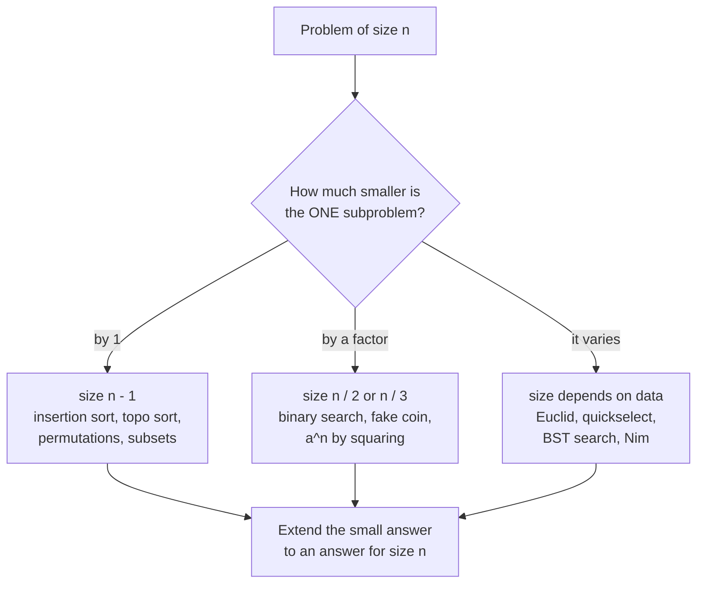
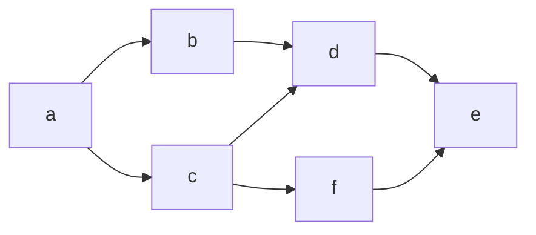

# Chapter 4 · Decrease-and-Conquer

Decrease-and-conquer is the most natural way humans solve problems: shrink the problem a little, solve the smaller version, then stretch that answer back to fit the original. It is the idea behind insertion sort, binary search, topological sorting, Euclid's algorithm and quickselect — and it is the bridge between plain brute force (Chapter 3) and full divide-and-conquer (Chapter 5). If you can spot *how much* a problem shrinks on each step — by one, by half, or by a varying amount — you can usually write down the recurrence and know the running time before you write a line of code.

🎮 **Simulations:** [Search Lab](https://normansrule.github.io/algorithm-forge/sims/search-lab.html) · [Topological Sort](https://normansrule.github.io/algorithm-forge/sims/topo-sort.html) · [Combinatorics](https://normansrule.github.io/algorithm-forge/sims/combinatorics.html) · [Nim](https://normansrule.github.io/algorithm-forge/sims/nim.html) · [Sorting Studio](https://normansrule.github.io/algorithm-forge/sims/sorting-studio.html) (insertion sort) · [Euclid's gcd](https://normansrule.github.io/algorithm-forge/sims/euclid-gcd.html)
🏟️ **Arena:** [Chapter 4 problems](https://normansrule.github.io/algorithm-forge/arena/?chapter=4)
🐍 **Code:** [`ch04_decrease_conquer.py`](../../src/python/algoforge/ch04_decrease_conquer.py)
📝 **Practice:** [practice/](../../practice/)

---

## Contents

1. [The big idea in 60 seconds](#the-big-idea-in-60-seconds)
2. [Quiz trap: what counts as decrease-and-conquer?](#quiz-trap-what-counts-as-decrease-and-conquer)
3. Decrease by a constant (by one)
   - [Build Card 4.1 — Insertion sort](#build-card-41--insertion-sort)
   - [Build Card 4.2 — Topological sorting](#build-card-42--topological-sorting)
   - [Build Card 4.3 — Generating permutations and subsets](#build-card-43--generating-permutations-and-subsets)
4. Decrease by a constant factor
   - [Build Card 4.4 — Binary search](#build-card-44--binary-search)
   - [Build Card 4.5 — Fake-coin puzzle (by 2 and by 3)](#build-card-45--fake-coin-puzzle-by-2-and-by-3)
   - [Build Card 4.6 — Russian peasant multiplication, Josephus, exponentiation by squaring](#build-card-46--russian-peasant-multiplication-josephus-exponentiation-by-squaring)
5. Variable-size decrease
   - [Build Card 4.7 — Euclid, quickselect and interpolation search](#build-card-47--euclid-quickselect-and-interpolation-search)
   - [Build Card 4.8 — Binary search tree operations and one-pile Nim](#build-card-48--binary-search-tree-operations-and-one-pile-nim)
6. [Worked exam problems](#worked-exam-problems)
7. [How a senior engineer thinks about this chapter](#how-a-senior-engineer-thinks-about-this-chapter)
8. [Check yourself](#-check-yourself)
9. [Go deeper](#-go-deeper)

---

## The big idea in 60 seconds

Every decrease-and-conquer algorithm has three moves (Levitin §4 introduction):

1. **Decrease** — turn the instance of size $n$ into **one** smaller instance of the *same* problem.
2. **Conquer** — solve that smaller instance (recursively, or by a loop that has already solved it).
3. **Extend** — use the smaller answer to build the answer for size $n$.

The only question that really matters is **how much smaller** the new instance is:

| Flavor | Shrinks by | Typical recurrence | Typical class | Examples |
|---|---|---|---|---|
| Decrease by a constant | 1 (sometimes 2) | $T(n) = T(n-1) + f(n)$ | $\Theta(n)$ … $\Theta(n^2)$ … $\Theta(n!)$ | insertion sort, topological sort, generating permutations/subsets |
| Decrease by a constant factor | half (or a third) | $T(n) = T(n/b) + f(n)$ | $\Theta(\log n)$ | binary search, fake coin, exponentiation by squaring, Russian peasant, Josephus |
| Variable-size decrease | a different amount each time | depends on the data | varies | Euclid's gcd, quickselect, interpolation search, binary search tree (BST) search, Nim |



**One problem, four strategies.** Computing $a^n$ shows the difference in one line each:

| Strategy | Formula | Multiplications |
|---|---|---|
| Brute force | $a \cdot a \cdots a$ ($n$ factors) | $n - 1$ |
| Decrease by one | $a^n = a^{n-1} \cdot a$ | $n - 1$ (same algorithm, different way of thinking about it) |
| Divide-and-conquer | $a^n = a^{\lfloor n/2 \rfloor} \cdot a^{\lceil n/2 \rceil}$, *both halves computed recursively* | still $\Theta(n)$ — the two halves repeat the same work |
| Decrease by a constant factor | $a^n = (a^{n/2})^2$ (times $a$ if $n$ is odd) | $\Theta(\log n)$ — compute the half **once**, square it |

The last two rows are the whole lesson in miniature: divide-and-conquer solves *several* subproblems and combines them; decrease-and-conquer solves *one* and extends it. When the subproblems are identical, solving one of them is a huge win.

---

## Quiz trap: what counts as decrease-and-conquer?

Instructors love this question because the answer depends on **how the algorithm reduces the instance**, not on what the code looks like.

- **Insertion sort** *is* decrease-by-one. To sort $A[0..n-1]$, assume $A[0..n-2]$ is already sorted (the smaller instance of the same problem), then *extend* by inserting $A[n-1]$ into place. The loop version is just the bottom-up form of that recursion. Levitin files it in §4.1 for exactly this reason.
- **Selection sort** is a trap in the other direction. Levitin places it under **brute force** (§3.1), because the natural description is "scan everything, pick the smallest, repeat" — the straightforward approach straight from the definition of sorted order. But you *can* view it as decrease-by-one: put the minimum in position 0, then sort $A[1..n-1]$ — a smaller instance of the same problem. If an exam asks "is selection sort decrease-and-conquer?", the safe answer is: *"Levitin classifies it as brute force, but structurally it reduces sorting $n$ items to sorting $n-1$ items, so it can also be described as decrease-by-one. The difference from insertion sort: selection sort does its work in the decrease step (finding the minimum), insertion sort does its work in the extend step (inserting)."*
- **Euclid's algorithm** is **variable-size decrease**. $\gcd(m, n) = \gcd(n, m \bmod n)$ replaces the instance by one smaller instance of the same problem, and how much smaller it gets depends on the numbers (sometimes a lot, sometimes a little). It is not divide-and-conquer: there is only one subproblem and there is nothing to combine.
- **Binary search** is decrease-by-a-constant-factor, *not* divide-and-conquer, in Levitin's taxonomy — even though some books call it a "degenerate" divide-and-conquer (Levitin §5 introduction explicitly recommends keeping them separate).

> **Rule of thumb:** one smaller subproblem → decrease-and-conquer. Two or more subproblems whose answers get combined → divide-and-conquer.

---

## Build Card 4.1 — Insertion sort

🎯 **Problem in one sentence:** array $A[0..n-1]$ of orderable items → the same array in nondecreasing order.

📖 **Story.** You are holding a hand of playing cards that is already sorted. A new card arrives. You slide it left past every bigger card until it sits just right of a card that is not bigger. That is the whole algorithm — done once per card.

👀 **See it:** [Sorting Studio → Insertion sort](https://normansrule.github.io/algorithm-forge/sims/sorting-studio.html)

```
 sorted part | unsorted part          new card v = A[i]
[ 3  7  9 ] | [ 1  5 ]                v = 1
[ 3  7  _ ]   9 shifts right          (9 > 1)
[ 3  _  7 ]   7 shifts right          (7 > 1)
[ _  3  7 ]   3 shifts right          (3 > 1)
[ 1  3  7  9 ] | [ 5 ]                 j fell off the left end: drop v at A[0]
```

🧱 **Build it in blocks.**

*Block 1 — state.* We need the element being inserted (`v`) and a scanning index (`j`) that walks left through the sorted part.

```
ALGORITHM InsertionSort(A[0..n-1])
    for i ← 1 to n - 1 do
        v ← A[i]
        j ← i - 1
```

*Block 2 — the loop skeleton.* Keep walking left while there is something to look at.

```
ALGORITHM InsertionSort(A[0..n-1])
    for i ← 1 to n - 1 do
        v ← A[i]
        j ← i - 1
        while j ≥ 0 do          // Block 3 adds the second test here
            j ← j - 1
```

*Block 3 — the decision.* Only keep walking while the element on the left is bigger than `v`; each bigger element shifts one slot right to make room.

```
        while j ≥ 0 and A[j] > v do
            A[j + 1] ← A[j]
            j ← j - 1
```

*Block 4 — the return.* The hole is at `j + 1`. Drop `v` in.

```
ALGORITHM InsertionSort(A[0..n-1])
    // Sorts A in nondecreasing order by insertion sort
    for i ← 1 to n - 1 do
        v ← A[i]
        j ← i - 1
        while j ≥ 0 and A[j] > v do
            A[j + 1] ← A[j]
            j ← j - 1
        A[j + 1] ← v
    return A
```

✋ **Trace it by hand** on $A = [7, 3, 9, 1, 5]$. "Comparisons" counts evaluations of `A[j] > v` (the basic operation).

| i | v | comparisons made | array after inserting v |
|---|---|---|---|
| 1 | 3 | 7>3 ✔ → 1 | [3, 7, 9, 1, 5] |
| 2 | 9 | 7>9 ✘ → 1 | [3, 7, 9, 1, 5] |
| 3 | 1 | 9>1 ✔, 7>1 ✔, 3>1 ✔ → 3 (then j = −1 stops the loop, no 4th comparison) | [1, 3, 7, 9, 5] |
| 4 | 5 | 9>5 ✔, 7>5 ✔, 3>5 ✘ → 3 | [1, 3, 5, 7, 9] |

Total: **8** key comparisons (worst case for $n = 5$ would be $5 \cdot 4 / 2 = 10$).

**The recursive (top-down) version** makes the decrease-by-one structure explicit:

```
ALGORITHM InsertionSortRec(A[0..n-1])
    // Top-down insertion sort: sort A[0..n-2], then insert A[n-1]
    if n ≤ 1 then
        return A
    InsertionSortRec(A[0..n-2])
    v ← A[n - 1]
    j ← n - 2
    while j ≥ 0 and A[j] > v do
        A[j + 1] ← A[j]
        j ← j - 1
    A[j + 1] ← v
    return A
```

💻 **Code.**

<details><summary>Python</summary>

```python
def insertion_sort(a):
    """Sort list a in place; return (a, comparisons)."""
    comps = 0
    for i in range(1, len(a)):
        v, j = a[i], i - 1
        while j >= 0:
            comps += 1
            if a[j] <= v:
                break
            a[j + 1] = a[j]
            j -= 1
        a[j + 1] = v
    return a, comps

def insertion_sort_rec(a, n=None):
    if n is None:
        n = len(a)
    if n <= 1:
        return a
    insertion_sort_rec(a, n - 1)          # decrease + conquer
    v, j = a[n - 1], n - 2                # extend: insert a[n-1]
    while j >= 0 and a[j] > v:
        a[j + 1] = a[j]
        j -= 1
    a[j + 1] = v
    return a
```

</details>

<details><summary>Java</summary>

```java
static void insertionSort(int[] a) {
    for (int i = 1; i < a.length; i++) {
        int v = a[i], j = i - 1;
        while (j >= 0 && a[j] > v) { a[j + 1] = a[j]; j--; }
        a[j + 1] = v;
    }
}

static void insertionSortRec(int[] a, int n) {
    if (n <= 1) return;
    insertionSortRec(a, n - 1);
    int v = a[n - 1], j = n - 2;
    while (j >= 0 && a[j] > v) { a[j + 1] = a[j]; j--; }
    a[j + 1] = v;
}
```

</details>

🧮 **Analyze it.**

- **Input size:** $n$. **Basic operation:** the key comparison `A[j] > v`.
- **Worst case** (strictly decreasing input): element $A[i]$ is compared with all $i$ elements to its left.
  $$C_{worst}(n) = \sum_{i=1}^{n-1} i = \frac{(n-1)n}{2} \in \Theta(n^2)$$
- **Best case** (already sorted): one comparison per $i$, so $C_{best}(n) = n - 1 \in \Theta(n)$. This is why insertion sort is great on *almost* sorted data.
- **Average case** (random distinct keys): each new element travels about half-way back, so $C_{avg}(n) \approx n^2/4 \in \Theta(n^2)$.
- **The recursive version's recurrence** (worst case, and also *every* case for the slide version that always sweeps all adjacent pairs):
  $$C(n) = C(n-1) + (n-1), \quad C(1) = 0.$$
  Backward substitution:
  $$C(n) = C(n-2) + (n-2) + (n-1) = C(n-3) + (n-3) + (n-2) + (n-1) = \dots = C(1) + \sum_{j=1}^{n-1} j = \frac{n(n-1)}{2}.$$
  (Checked numerically for $n = 1..10$: 0, 1, 3, 6, 10, 15, 21, 28, 36, 45.)
- **Space:** in place, $\Theta(1)$ extra (the recursive version uses $\Theta(n)$ stack). **Stable:** yes — equal keys never jump over each other because we stop on `A[j] > v`, not `≥`.

⚠️ **Common mistakes.**
- Writing `A[j] ≥ v` in the loop: still sorts, but equal keys get reordered (loses stability) and does extra work.
- Testing `A[j] > v` before `j ≥ 0`: reads `A[-1]`. The order of the `and` matters (short-circuit evaluation).
- Saying the best case is $\Theta(1)$: even a sorted array needs one comparison per element, so $\Theta(n)$.

🔁 **Variations / real software.**
- **Binary insertion sort** finds the slot with binary search: $\Theta(n \log n)$ comparisons, but still $\Theta(n^2)$ moves.
- **Shellsort** runs insertion sort on elements $h$ apart for shrinking gaps $h$.
- **Every production hybrid sort uses it on small pieces:** Timsort (Python, Java objects) builds short runs with binary insertion sort; introsort (C++ `std::sort`) and many quicksorts switch to insertion sort below roughly 16 elements.

---

## Build Card 4.2 — Topological sorting

🎯 **Problem in one sentence:** a directed graph (digraph) → a list of all its vertices such that every edge $u \to v$ has $u$ listed before $v$, or a report that no such list exists.

📖 **Story.** You are planning your degree. Some courses are prerequisites of others. You need *some* order to take them so that you never sit in a class before its prerequisites. Getting dressed works the same way: socks before shoes, shirt before jacket.

👀 **See it:** [Topological Sort sim](https://normansrule.github.io/algorithm-forge/sims/topo-sort.html)

Our example digraph (adjacency lists in alphabetical order):



### Key fact: a topological order exists ⇔ the digraph is a Directed Acyclic Graph (DAG)

**(⇒) If a topological order exists, there is no directed cycle.** Suppose a cycle $v_1 \to v_2 \to \dots \to v_k \to v_1$ existed, and look at whichever cycle vertex appears **leftmost** in the order. The cycle edge coming *into* it starts at a vertex that is further right — an edge pointing right-to-left. That breaks the definition. Contradiction.

**(⇐) Every DAG has a topological order.** First, every DAG has a **source** (a vertex with no incoming edges): if every vertex had an incoming edge, you could keep walking edges *backwards* forever; with only $n$ vertices you would repeat a vertex, which is a cycle. So take a source, list it first, delete it. What remains is still a DAG (deleting cannot create a cycle), so by induction on $n$ it can be ordered too. That argument *is* the source-removal algorithm below.

### Algorithm 1 — Depth-First Search (DFS) based

Run DFS. Record each vertex when it becomes a **dead end** (all its neighbors are finished) — i.e., when it is "popped off" the traversal stack. The **reverse** of that popping order is a topological order. If DFS ever meets a **back edge** (an edge to a vertex still on the stack), there is a cycle, so the digraph is not a DAG.

*Why reversing works:* when vertex $u$ is popped, every vertex reachable from $u$ has already been popped. So for every edge $u \to v$, $v$ is popped before $u$, and after reversing, $u$ comes before $v$.

🧱 **Build it in blocks.**

*Block 1 — state.* `state[v]` is 0 (unvisited), 1 (on the stack right now), or 2 (finished). `order` collects the popping order.

```
ALGORITHM TopoSortDFS(adj[0..n-1])
    state ← array(n, 0)
    order ← []
```

*Block 2 — skeleton.* Start a DFS from every unvisited vertex.

```
    for v ← 0 to n - 1 do
        if state[v] = 0 then
            if not DFSVisit(v, adj, state, order) then
                return "cycle: not a DAG"
```

*Block 3 — the decision (inside the visit).* Recurse into unvisited neighbors; an "on the stack" neighbor means a cycle.

```
ALGORITHM DFSVisit(v, adj, state, order)
    // Returns false if a back edge (a cycle) is found below v
    state[v] ← 1
    for each w in adj[v] do
        if state[w] = 0 then
            if not DFSVisit(w, adj, state, order) then
                return false
        else if state[w] = 1 then
            return false            // back edge: w is still on the stack
    state[v] ← 2
    append(order, v)        // v is popped: a dead end
    return true
```

*Block 4 — the return.* Reverse the popping order.

```
ALGORITHM TopoSortDFS(adj[0..n-1])
    // Returns a topological order of a DAG given by adjacency lists
    state ← array(n, 0)
    order ← []
    for v ← 0 to n - 1 do
        if state[v] = 0 then
            if not DFSVisit(v, adj, state, order) then
                return "cycle: not a DAG"
    return reverse(order)
```

✋ **Trace it by hand** (vertices visited in alphabetical order):

| Step | Action | Stack (bottom → top) | Pop order so far |
|---|---|---|---|
| 1 | visit a | a | |
| 2 | a→b, visit b | a b | |
| 3 | b→d, visit d | a b d | |
| 4 | d→e, visit e | a b d e | |
| 5 | e has no out-edges: pop e | a b d | e |
| 6 | d done: pop d | a b | e d |
| 7 | b done: pop b | a | e d b |
| 8 | a→c, visit c | a c | e d b |
| 9 | c→d: d already finished (not a back edge) | a c | e d b |
| 10 | c→f, visit f | a c f | e d b |
| 11 | f→e: e finished; pop f | a c | e d b f |
| 12 | pop c | a | e d b f c |
| 13 | pop a | — | e d b f c a |

Reverse → **a, c, f, b, d, e**. Check every edge: a→b ✔, a→c ✔, b→d ✔, c→d ✔, c→f ✔, d→e ✔, f→e ✔.

### Algorithm 2 — Source removal (Kahn's algorithm)

Repeatedly pick a source, output it, and delete it with its outgoing edges. If you run out of sources while vertices remain, the leftover part contains a cycle.

```
ALGORITHM TopoSortSourceRemoval(adj[0..n-1])
    // Kahn's algorithm with in-degree counts and a queue
    indeg ← array(n, 0)
    for v ← 0 to n - 1 do
        for each w in adj[v] do
            indeg[w] ← indeg[w] + 1
    Q ← []
    for v ← 0 to n - 1 do
        if indeg[v] = 0 then
            enqueue(Q, v)
    order ← []
    while not isEmpty(Q) do
        v ← dequeue(Q)
        append(order, v)
        for each w in adj[v] do
            indeg[w] ← indeg[w] - 1
            if indeg[w] = 0 then
                enqueue(Q, w)
    if length(order) < n then
        return "cycle: not a DAG"
    return order
```

✋ **Trace** (when several sources exist, take the alphabetically first):

| Round | Sources available | Remove | Order so far |
|---|---|---|---|
| 1 | a | a | a |
| 2 | b, c | b | a b |
| 3 | c (d still has c→d) | c | a b c |
| 4 | d, f | d | a b c d |
| 5 | f (e still has f→e) | f | a b c d f |
| 6 | e | e | a b c d f e |

Different algorithm, different (equally valid) answer: a DAG can have many topological orders — up to $n!$ when there are no edges at all.

💻 **Code.**

<details><summary>Python</summary>

```python
from collections import deque

def topo_sort_dfs(adj):
    """adj: dict vertex -> list of successors. Raises ValueError on a cycle."""
    state, order = {v: 0 for v in adj}, []
    def visit(v):
        state[v] = 1
        for w in adj[v]:
            if state[w] == 0:
                visit(w)
            elif state[w] == 1:
                raise ValueError("back edge %r->%r: not a DAG" % (v, w))
        state[v] = 2
        order.append(v)
    for v in adj:
        if state[v] == 0:
            visit(v)
    return order[::-1]

def topo_sort_kahn(adj):
    indeg = {v: 0 for v in adj}
    for v in adj:
        for w in adj[v]:
            indeg[w] += 1
    q = deque(v for v in adj if indeg[v] == 0)
    order = []
    while q:
        v = q.popleft()
        order.append(v)
        for w in adj[v]:
            indeg[w] -= 1
            if indeg[w] == 0:
                q.append(w)
    if len(order) < len(adj):
        raise ValueError("not a DAG")
    return order

g = {'a': ['b', 'c'], 'b': ['d'], 'c': ['d', 'f'], 'd': ['e'], 'e': [], 'f': ['e']}
print(topo_sort_dfs(g))   # ['a', 'c', 'f', 'b', 'd', 'e']
```

</details>

<details><summary>Java</summary>

```java
import java.util.*;

static List<Integer> topoSortKahn(List<List<Integer>> adj) {
    int n = adj.size();
    int[] indeg = new int[n];
    for (List<Integer> out : adj) for (int w : out) indeg[w]++;
    Deque<Integer> q = new ArrayDeque<>();
    for (int v = 0; v < n; v++) if (indeg[v] == 0) q.add(v);
    List<Integer> order = new ArrayList<>();
    while (!q.isEmpty()) {
        int v = q.poll();
        order.add(v);
        for (int w : adj.get(v)) if (--indeg[w] == 0) q.add(w);
    }
    if (order.size() < n) throw new IllegalArgumentException("not a DAG");
    return order;
}

static void dfsVisit(int v, List<List<Integer>> adj, int[] state, List<Integer> order) {
    state[v] = 1;
    for (int w : adj.get(v)) {
        if (state[w] == 0) dfsVisit(w, adj, state, order);
        else if (state[w] == 1) throw new IllegalArgumentException("not a DAG");
    }
    state[v] = 2;
    order.add(v);                       // popped: reverse this list at the end
}
```

</details>

🧮 **Analyze it.** Input size: $n$ vertices and $m$ edges. Both algorithms touch each vertex once and each edge once (DFS scans each adjacency list once; Kahn decrements one in-degree per edge).

| Representation | Time to find all neighbors of all vertices | Total |
|---|---|---|
| Adjacency **lists** | $\sum_v \deg^+(v) = m$ | $\Theta(n + m)$ |
| Adjacency **matrix** | each vertex scans a full row of length $n$ | $\Theta(n^2)$ |

For sparse graphs ($m \ll n^2$), lists win by a wide margin. Extra space: $\Theta(n)$ for the state/in-degree arrays plus the queue or recursion stack.

⚠️ **Common mistakes.**
- Outputting vertices in the order DFS **visits** them (push order) instead of reverse **pop** order. Push order of our example is a, b, d, e, c, f — which puts d before c, violating c→d.
- Treating an edge to a *finished* vertex (a cross/forward edge, like c→d above) as a cycle. Only edges to vertices *currently on the stack* are back edges.
- Forgetting to restart DFS from every unvisited vertex, so disconnected parts are skipped.

🔁 **Where it's used.** Build systems (Make, Bazel, Gradle) order compilation tasks; package managers (npm, pip, apt) order installs; spreadsheets recompute cells in dependency order; schedulers such as Apache Airflow run workflows defined as DAGs; compilers order instructions; course-planning tools order prerequisites. Detecting "not a DAG" is itself a feature: it is how these tools report circular dependencies.

---

## Build Card 4.3 — Generating permutations and subsets

🎯 **Problem in one sentence:** an integer $n$ → a list of all $n!$ permutations of $\{1, \dots, n\}$ (or all $2^n$ subsets of an $n$-element set), ideally with each item differing only slightly from the previous one.

📖 **Story.** A combination lock with numbered wheels, a group photo where everyone must stand in every possible order, a menu where you try every set of toppings. The trick for all of them: *if you already have every arrangement of $n-1$ things, you can get every arrangement of $n$ things by slotting the new thing into each gap.*

👀 **See it:** [Combinatorics sim](https://normansrule.github.io/algorithm-forge/sims/combinatorics.html) (Johnson–Trotter, lexicographic permutations, Gray code / subsets)

### Minimal-change permutations (decrease by one)

Get all permutations of $1..n-1$, then insert $n$ into each gap — moving **right to left** in the first permutation, then **left to right** in the next, alternating. Each new permutation differs from the previous by a swap of two neighbors (a "minimal change").

```
start                         1
insert 2 (right to left):     12   21
insert 3 into 12 (R to L):    123  132  312
insert 3 into 21 (L to R):    321  231  213
```

### Johnson–Trotter: the same list without recursion

Give every element an arrow (initially all ←). An element is **mobile** if its arrow points at a *smaller* adjacent element.

```
ALGORITHM JohnsonTrotter(n)
    // Generates all permutations of 1..n by adjacent swaps
    // Output: the list of permutations, in the order they are generated
    P ← array(n, 0)                  // the current permutation
    dir ← array(n, -1)               // arrow of the element at each position: -1 = ←, +1 = →
    for i ← 0 to n - 1 do
        P[i] ← i + 1                 // the first permutation ←1 ←2 ... ←n
    result ← [copy(P)]
    k ← LargestMobile(P, dir, n)     // position of the largest mobile element (-1 if none)
    while k ≥ 0 do
        t ← k + dir[k]               // the adjacent position its arrow points to
        swap P[k] and P[t]           // move the element...
        swap dir[k] and dir[t]       // ...and carry its arrow along
        for i ← 0 to n - 1 do        // reverse the arrow of every element larger than it
            if P[i] > P[t] then
                dir[i] ← -dir[i]
        append(result, copy(P))      // output the new permutation
        k ← LargestMobile(P, dir, n)
    return result

ALGORITHM LargestMobile(P, dir, n)
    // Mobile = its arrow points at a smaller adjacent element
    best ← -1
    for i ← 0 to n - 1 do
        t ← i + dir[i]
        if t ≥ 0 and t < n and P[t] < P[i] then
            if best = -1 or P[i] > P[best] then
                best ← i
    return best
```

✋ **Trace for n = 3** (arrows shown above each number):

| Permutation | Arrows | Largest mobile | Action |
|---|---|---|---|
| 1 2 3 | ← ← ← | 3 (points at 2) | swap 3 left |
| 1 3 2 | ← ← ← | 3 (points at 1) | swap 3 left |
| 3 1 2 | ← ← ← | 2 (points at 1; 3 is at the wall) | swap 2 left, flip arrow of 3 |
| 3 2 1 | → ← ← | 3 (points right at 2) | swap 3 right |
| 2 3 1 | ← → ← | 3 (points at 1) | swap 3 right |
| 2 1 3 | ← ← → | none | stop — 6 = 3! permutations |

### Lexicographic order (dictionary order)

To get the next permutation after $a_1 a_2 \dots a_n$:

1. Find the **largest** $i$ with $a_i < a_{i+1}$ (the rightmost "ascent"). If none, this is the last permutation.
2. Find the **largest** $j$ with $a_j > a_i$.
3. Swap $a_i$ and $a_j$.
4. Reverse $a_{i+1} \dots a_n$ (it was decreasing; now it is increasing).

```
ALGORITHM NextPermutation(A[0..n-1])
    // Rearranges A into the next permutation in lexicographic order
    i ← n - 2
    while i ≥ 0 and A[i] ≥ A[i + 1] do
        i ← i - 1
    if i < 0 then
        return false                 // A was the last permutation
    j ← n - 1
    while A[j] ≤ A[i] do
        j ← j - 1
    swap A[i] and A[j]
    l ← i + 1
    r ← n - 1
    while l < r do
        swap A[l] and A[r]
        l ← l + 1
        r ← r - 1
    return true
```

✋ **Trace:** next after **2 4 3 1**: rightmost ascent is 2<4 (i at "2"); rightmost element bigger than 2 is 3; swap → 3 4 2 1; reverse the tail "4 2 1" → **3 1 2 4**. More checks: 1 3 4 2 → 1 4 2 3; 3 5 4 2 1 → 4 1 2 3 5.

### Subsets: decrease by one, and the binary reflected Gray code

*Power set by decrease-by-one:* all subsets of $\{a_1..a_n\}$ = all subsets of $\{a_1..a_{n-1}\}$, plus each of those with $a_n$ added. For $\{a, b, c\}$: $\{\}$ → $\{\},\{a\}$ → $\{\},\{a\},\{b\},\{a,b\}$ → add $c$ to each of those four → 8 subsets.

*Bit strings:* subset ↔ bit string of length $n$ (bit $i$ = 1 means "element $i$ is in"). Counting 000, 001, …, 111 lists all subsets, but neighbors can differ in many bits (011 → 100 flips three).

*Binary Reflected Gray Code (BRGC):* each string differs from the previous one in **exactly one bit**.

```
ALGORITHM BRGC(n)
    // Returns the list of all 2^n bit strings in Gray code order
    if n = 1 then
        return ["0", "1"]
    L1 ← BRGC(n - 1)
    L ← []
    for each s in L1 do                      // L1 with "0" in front of every string...
        append(L, "0" + s)
    for i ← length(L1) - 1 downto 0 do       // ...followed by L1 in reverse order, "1" in front
        append(L, "1" + L1[i])
    return L
```

```
n=1:  0 1
n=2:  00 01 | 11 10                 (0+[0,1]  then  1+[1,0])
n=3:  000 001 011 010 | 110 111 101 100
```

💻 **Code.**

<details><summary>Python</summary>

```python
def johnson_trotter(n):
    p, d = list(range(1, n + 1)), [-1] * n      # -1 means arrow points left
    yield tuple(p)
    while True:
        k, ki = -1, -1
        for i in range(n):
            j = i + d[i]
            if 0 <= j < n and p[j] < p[i] and p[i] > k:
                k, ki = p[i], i
        if ki < 0:
            return
        j = ki + d[ki]
        p[ki], p[j] = p[j], p[ki]
        d[ki], d[j] = d[j], d[ki]
        for i in range(n):
            if p[i] > k:
                d[i] = -d[i]
        yield tuple(p)

def next_permutation(a):
    i = len(a) - 2
    while i >= 0 and a[i] >= a[i + 1]:
        i -= 1
    if i < 0:
        return False
    j = len(a) - 1
    while a[j] <= a[i]:
        j -= 1
    a[i], a[j] = a[j], a[i]
    a[i + 1:] = reversed(a[i + 1:])
    return True

def brgc(n):
    if n == 1:
        return ["0", "1"]
    l1 = brgc(n - 1)
    return ["0" + s for s in l1] + ["1" + s for s in reversed(l1)]

def power_set(items):
    if not items:
        return [[]]
    smaller = power_set(items[:-1])
    return smaller + [s + [items[-1]] for s in smaller]
```

</details>

<details><summary>Java</summary>

```java
static boolean nextPermutation(int[] a) {
    int i = a.length - 2;
    while (i >= 0 && a[i] >= a[i + 1]) i--;
    if (i < 0) return false;
    int j = a.length - 1;
    while (a[j] <= a[i]) j--;
    int t = a[i]; a[i] = a[j]; a[j] = t;
    for (int l = i + 1, r = a.length - 1; l < r; l++, r--) {
        t = a[l]; a[l] = a[r]; a[r] = t;
    }
    return true;
}

static List<String> brgc(int n) {
    if (n == 1) return new ArrayList<>(List.of("0", "1"));
    List<String> l1 = brgc(n - 1), out = new ArrayList<>();
    for (String s : l1) out.add("0" + s);
    for (int i = l1.size() - 1; i >= 0; i--) out.add("1" + l1.get(i));
    return out;
}
```

</details>

🧮 **Analyze it.** The output itself has size $n!$ (permutations) or $2^n$ (subsets), so no algorithm can beat $\Omega(n!)$ or $\Omega(2^n)$ items produced. Johnson–Trotter does $\Theta(n)$ work per permutation to find the largest mobile element, so $\Theta(n \cdot n!)$ total; the lexicographic step is $O(n)$ worst case but $O(1)$ amortized. BRGC produces $2^n$ strings of length $n$: $\Theta(n 2^n)$ characters written. The recurrence for the *number of strings* is $L(n) = 2L(n-1)$, $L(1) = 2$, so $L(n) = 2^n$.

⚠️ **Common mistakes.** Using the *first* ascent instead of the *last* in the lexicographic step; forgetting to flip arrows of elements *larger* than $k$ (not all elements) in Johnson–Trotter; assuming minimal-change order is lexicographic (it isn't: 132 is followed by 312).

🔁 **Where it's used.** Gray codes appear in rotary encoders (a sensor between two positions can only be off by one step), Karnaugh maps, and error-resistant counters. Python's `itertools.permutations` and C++ `std::next_permutation` generate lexicographic order. Exhaustive search (Chapter 3) and backtracking (Chapter 12) are built on these generators — and $n!$ grows so fast ($13! \approx 6.2 \times 10^9$) that generating everything is only feasible for tiny $n$.

---

## Build Card 4.4 — Binary search

🎯 **Problem in one sentence:** sorted array $A[0..n-1]$ and key $K$ → an index $m$ with $A[m] = K$, or $-1$.

📖 **Story.** Guess-the-number from 1 to 1000: "Is it bigger than 500?" — every answer throws away half of what is left. Ten questions always suffice because $2^{10} = 1024$.

👀 **See it:** [Search Lab → Binary search](https://normansrule.github.io/algorithm-forge/sims/search-lab.html)

```
index:  0  1  2  3  4  5  6  7  8  9 10 11 12
A:      2  9 15 21 28 33 40 47 56 61 70 84 95
        l                 m                 r      K = 61 > 40: go right
                             l     m        r      K = 61 = A[9]: found
```

🧱 **Build it in blocks.**

*Block 1 — state:* the live window `l..r`.

```
ALGORITHM BinarySearch(A[0..n-1], K)
    l ← 0
    r ← n - 1
```

*Block 2 — loop skeleton:* keep going while the window is non-empty; look at the middle.

```
    while l ≤ r do
        m ← ⌊(l + r) / 2⌋
```

*Block 3 — the decision:* three outcomes.

```
        if K = A[m] then
            return m
        else if K < A[m] then
            r ← m - 1
        else
            l ← m + 1
```

*Block 4 — the return:* window is empty → not found.

```
ALGORITHM BinarySearch(A[0..n-1], K)
    // Returns an index of K in sorted A, or -1
    l ← 0
    r ← n - 1
    while l ≤ r do
        m ← ⌊(l + r) / 2⌋
        if K = A[m] then
            return m
        else if K < A[m] then
            r ← m - 1
        else
            l ← m + 1
    return -1
```

✋ **Trace it by hand** on the array above.

| K | l | r | m | A[m] | outcome |
|---|---|---|---|---|---|
| 61 | 0 | 12 | 6 | 40 | 61 > 40 → l = 7 |
| 61 | 7 | 12 | 9 | 61 | **found at 9** (2 three-way comparisons) |
| 30 | 0 | 12 | 6 | 40 | 30 < 40 → r = 5 |
| 30 | 0 | 5 | 2 | 15 | 30 > 15 → l = 3 |
| 30 | 3 | 5 | 4 | 28 | 30 > 28 → l = 5 |
| 30 | 5 | 5 | 5 | 33 | 30 < 33 → r = 4; l > r → **−1** (4 comparisons = worst case for n = 13) |

💻 **Code.**

<details><summary>Python</summary>

```python
def binary_search(a, key):
    l, r = 0, len(a) - 1
    while l <= r:
        m = (l + r) // 2          # Python ints never overflow
        if key == a[m]:
            return m
        if key < a[m]:
            r = m - 1
        else:
            l = m + 1
    return -1
# Standard library: bisect.bisect_left(a, key) gives the insertion point.
```

</details>

<details><summary>Java</summary>

```java
static int binarySearch(int[] a, int key) {
    int l = 0, r = a.length - 1;
    while (l <= r) {
        int m = l + (r - l) / 2;          // avoids int overflow of (l + r)
        if (key == a[m]) return m;
        if (key < a[m]) r = m - 1; else l = m + 1;
    }
    return -1;
}
```

</details>

🧮 **Analyze it.** Basic operation: the three-way comparison of $K$ with $A[m]$. Worst case (unsuccessful search, or key found last): after one comparison, at most $\lfloor n/2 \rfloor$ elements remain.

$$C_{worst}(n) = C_{worst}(\lfloor n/2 \rfloor) + 1, \quad C_{worst}(1) = 1.$$

Backward substitution for $n = 2^k$:
$$C(2^k) = C(2^{k-1}) + 1 = C(2^{k-2}) + 2 = \dots = C(2^0) + k = 1 + k = \log_2 n + 1.$$

For every $n$: $C_{worst}(n) = \lfloor \log_2 n \rfloor + 1 = \lceil \log_2(n+1) \rceil$. Checked: $n = 13 \to 4$, $n = 1000 \to 10$, $n = 10^6 \to 20$. Best case: 1. Average: about $\log_2 n$ (successful) — $\Theta(\log n)$ in every non-best case.

Binary search is **optimal** among comparison-based searches of a sorted array (a decision-tree argument, Chapter 11). It needs random access, so it is *not* efficient on a linked list.

⚠️ **Common mistakes.**
- `while l < r` with `r ← m - 1`: skips checking a one-element window.
- `l ← m` instead of `l ← m + 1`: infinite loop when `r = l + 1`.
- `(l + r) / 2` overflowing 32-bit integers for huge arrays — the famous bug found in the Java library in 2006. Use `l + (r - l) / 2`.
- Running it on unsorted data. It returns *something* — just not the right thing.

🔁 **Variations.** Lower/upper bound (first/last position ≥ K); **bisection method** for solving $f(x) = 0$ (the continuous twin); "binary search on the answer" (find the smallest capacity/time that works — see [Chapter 15](../15-dp-and-interview-patterns/README.md)); `git bisect` binary-searches your commit history for the commit that introduced a bug.

---

## Build Card 4.5 — Fake-coin puzzle (by 2 and by 3)

🎯 **Problem in one sentence:** $n$ identical-looking coins, one of them lighter, and a balance scale → the fake coin, with as few weighings as possible.

📖 **Story.** A two-pan balance only answers "left heavier / right heavier / equal." Each weighing is a question with **three** possible answers — which is the hint that splitting into three piles should beat splitting into two.

👀 **See it:** [Search Lab → Fake coin](https://normansrule.github.io/algorithm-forge/sims/search-lab.html)

**Divide into two.** If $n > 1$, set one coin aside when $n$ is odd, and weigh the two halves of $\lfloor n/2 \rfloor$ coins. Lighter side holds the fake; if they balance, the set-aside coin is fake.

$$W_2(n) = W_2(\lfloor n/2 \rfloor) + 1, \quad W_2(1) = 0 \quad\Longrightarrow\quad W_2(n) = \lfloor \log_2 n \rfloor.$$

**Divide into three.** Make two piles of $\lceil n/3 \rceil$ coins each and put the rest ($n - 2\lceil n/3 \rceil$, possibly zero) aside. Weigh the two piles. If one side is lighter, the fake is there; if they balance, it is in the aside pile. Either way at most $\lceil n/3 \rceil$ coins remain.

🧱 **Build it in blocks** (coins given as an array of weights; `Sum(W, a, b)` adds $W[a..b]$):

```
ALGORITHM FakeCoin3(W[l..r])
    // Returns the index of the single lighter coin in W[l..r]
    // Block 1 — state: how many coins, pile size
    n ← r - l + 1
    if n = 1 then
        return l                          // Block 4 (base case)
    if n = 2 then
        if W[l] < W[r] then
            return l
        return r
    k ← ⌈n / 3⌉
    // Block 2 — one weighing of pile 1 = W[l..l+k-1] against pile 2 = W[l+k..l+2k-1]
    left ← Sum(W, l, l + k - 1)
    right ← Sum(W, l + k, l + 2 * k - 1)
    // Block 3 — the decision: recurse into exactly ONE pile
    if left < right then
        return FakeCoin3(W[l..l+k-1])
    else if right < left then
        return FakeCoin3(W[l+k..l+2*k-1])
    else
        return FakeCoin3(W[l+2*k..r])     // the aside pile (non-empty here)

ALGORITHM Sum(W, a, b)
    // Total weight of the coins W[a..b] (what the pan feels)
    total ← 0
    for i ← a to b do
        total ← total + W[i]
    return total
```

(For $n \ge 3$, the aside pile $n - 2\lceil n/3 \rceil$ is never empty when the piles balance, since a balance means the fake is not on the scale.)

✋ **Trace by hand:** $n = 20$, fake at index 13. $k = 7$: weigh 0–6 vs 7–13 → right is lighter → recurse on 7–13 ($n = 7$). $k = 3$: weigh 7–9 vs 10–12 → balance → aside pile 13–13 ($n = 1$) → answer 13. **2 weighings.** $\lceil \log_3 20 \rceil = 3$ is the worst case; we got lucky on the second one.

**Recurrence for $n = 3^k$:**
$$W_3(n) = W_3(n/3) + 1, \quad W_3(1) = 0.$$
Backward substitution: $W_3(3^k) = W_3(3^{k-1}) + 1 = W_3(3^{k-2}) + 2 = \dots = W_3(3^0) + k = k = \log_3 n.$ For general $n$ this scheme uses $\lceil \log_3 n \rceil$ weighings (checked numerically for $n = 1..29$).

**How much faster?** For large $n$,
$$\frac{W_2(n)}{W_3(n)} \approx \frac{\log_2 n}{\log_3 n} = \frac{\log_2 n}{\log_2 n / \log_2 3} = \log_2 3 \approx 1.585.$$
The divide-into-three algorithm uses about **1.58 times fewer** weighings — a constant factor, independent of $n$. Both are $\Theta(\log n)$.

<details><summary>Python</summary>

```python
import math

def fake_coin3(w, l=0, r=None):
    """Index of the lighter coin; returns (index, weighings)."""
    if r is None:
        r = len(w) - 1
    n = r - l + 1
    if n == 1:
        return l, 0
    if n == 2:
        return (l if w[l] < w[r] else r), 1
    k = math.ceil(n / 3)
    left, right = sum(w[l:l + k]), sum(w[l + k:l + 2 * k])
    if left < right:
        i, c = fake_coin3(w, l, l + k - 1)
    elif right < left:
        i, c = fake_coin3(w, l + k, l + 2 * k - 1)
    else:
        i, c = fake_coin3(w, l + 2 * k, r)
    return i, c + 1
```

</details>

<details><summary>Java</summary>

```java
static int fakeCoin3(int[] w, int l, int r) {
    int n = r - l + 1;
    if (n == 1) return l;
    if (n == 2) return w[l] < w[r] ? l : r;
    int k = (n + 2) / 3, left = 0, right = 0;
    for (int i = l; i < l + k; i++) left += w[i];
    for (int i = l + k; i < l + 2 * k; i++) right += w[i];
    if (left < right) return fakeCoin3(w, l, l + k - 1);
    if (right < left) return fakeCoin3(w, l + k, l + 2 * k - 1);
    return fakeCoin3(w, l + 2 * k, r);
}
```

</details>

⚠️ **Common mistakes.** Counting additions instead of weighings (the scale is the expensive resource); forgetting the case where the piles balance; making three piles of unequal size on the *scale* (the two weighed piles must be the same size).

🔁 **Variations.** The harder classic — 12 coins, the fake may be heavier *or* lighter, 3 weighings — uses the same "three outcomes per question" information argument (Levitin §11.2 problem family). Group testing (pooling blood samples) is the real-world cousin.

---

## Build Card 4.6 — Russian peasant multiplication, Josephus, exponentiation by squaring

Three short decrease-by-half algorithms that all reduce to **looking at the binary digits of $n$**.

👀 **See it:** [Search Lab → Russian peasant / exponentiation by squaring](https://normansrule.github.io/algorithm-forge/sims/search-lab.html)

### Russian peasant multiplication (multiplication à la russe)

🎯 **Problem:** positive integers $n, m$ → $n \cdot m$ using only halving, doubling and adding.

📖 **Story.** No times tables needed — just "cut in half" and "double," which is exactly what shift instructions do in hardware.

$$n \cdot m = \begin{cases} \dfrac{n}{2} \cdot 2m & n \text{ even} \\[4pt] \dfrac{n-1}{2} \cdot 2m + m & n \text{ odd} \end{cases} \qquad 1 \cdot m = m.$$

```
ALGORITHM RussianPeasant(n, m)
    // Block 1 — state: running total
    total ← 0
    // Block 2 — loop: halve n, double m
    while n ≥ 1 do
        // Block 3 — decision: odd n contributes the current m
        if n mod 2 = 1 then
            total ← total + m
        n ← n div 2
        m ← 2 * m
    // Block 4 — return
    return total
```

✋ **Trace:** $37 \times 21$.

| n | m | n odd? | add |
|---|---|---|---|
| 37 | 21 | yes | 21 |
| 18 | 42 | no | |
| 9 | 84 | yes | 84 |
| 4 | 168 | no | |
| 2 | 336 | no | |
| 1 | 672 | yes | 672 |

$21 + 84 + 672 = 777 = 37 \times 21$ ✔. The odd rows are exactly the 1-bits of $37 = 100101_2$: $37 \cdot 21 = (1 + 4 + 32) \cdot 21$.

**Analysis:** the loop runs $\lfloor \log_2 n \rfloor + 1$ times, i.e., once per bit of $n$: $\Theta(\log n)$ halvings/doublings (linear in the number of bits $b$, not "log log n").

### The Josephus problem

🎯 **Problem:** $n$ people in a circle numbered $1..n$; starting from person 1, every second person is eliminated → the survivor's number $J(n)$.

📖 **Story.** Going around the circle once removes all the even-numbered people — half the circle in one sweep. What is left is a smaller Josephus circle with relabeled seats.

- **$n = 2k$ (even):** after one lap, survivors are $1, 3, 5, \dots, 2k-1$ and it is person 1's turn again. New seat $j$ is old seat $2j - 1$, so $J(2k) = 2J(k) - 1$.
- **$n = 2k+1$ (odd):** after removing $2, 4, \dots, 2k$, person 1 is removed next, leaving $3, 5, \dots, 2k+1$ with person 3 next. New seat $j$ is old seat $2j + 1$, so $J(2k+1) = 2J(k) + 1$.
- $J(1) = 1$.

**Closed form:** $J(n)$ is a one-bit cyclic **left** shift of $n$'s binary representation.

✋ **Trace:** $n = 10$. Elimination order: 2, 4, 6, 8, 10, 3, 7, 1, 9 → survivor **5**. Recurrence: $J(2) = 2J(1) - 1 = 1$, $J(5) = 2J(2) + 1 = 3$, $J(10) = 2J(5) - 1 = 5$ ✔. Bit trick: $10 = 1010_2 \to 0101_2 = 5$ ✔. Another: $13 = 1101_2 \to 1011_2 = 11$ ✔.

<details><summary>Python (Josephus + Russian peasant)</summary>

```python
def josephus(n):
    if n == 1:
        return 1
    return 2 * josephus(n // 2) - 1 if n % 2 == 0 else 2 * josephus(n // 2) + 1

def josephus_bits(n):
    b = bin(n)[2:]
    return int(b[1:] + b[0], 2)

def russian_peasant(n, m):
    total = 0
    while n >= 1:
        if n & 1:
            total += m
        n >>= 1
        m <<= 1
    return total
```

</details>

<details><summary>Java (Josephus + Russian peasant)</summary>

```java
static int josephus(int n) {
    if (n == 1) return 1;
    return (n % 2 == 0) ? 2 * josephus(n / 2) - 1 : 2 * josephus(n / 2) + 1;
}

static long russianPeasant(long n, long m) {
    long total = 0;
    while (n >= 1) {
        if ((n & 1) == 1) total += m;
        n >>= 1;
        m <<= 1;
    }
    return total;
}
```

</details>

### Exponentiation by squaring

🎯 **Problem:** number $a$ and integer $n \ge 0$ → $a^n$ with few multiplications.

$$a^n = \begin{cases} 1 & n = 0 \\ (a^{n/2})^2 & n \text{ even} \\ (a^{(n-1)/2})^2 \cdot a & n \text{ odd} \end{cases}$$

```
ALGORITHM Power(a, n)
    // Computes a^n by decrease-by-half (exponentiation by squaring)
    if n = 0 then
        return 1
    if n = 1 then
        return a
    h ← Power(a, n div 2)            // ONE recursive call — the key
    if n mod 2 = 0 then
        return h * h
    return h * h * a
```

✋ **Trace** $a^{13}$: $13 \to 6 \to 3 \to 1$. Going back up: $a^1 = a$; $a^3 = (a)^2 \cdot a$ (2 mults); $a^6 = (a^3)^2$ (1); $a^{13} = (a^6)^2 \cdot a$ (2). Total **5** multiplications instead of 12.

🧮 **Analysis.** $M(n) = M(\lfloor n/2 \rfloor) + (1 \text{ or } 2)$, $M(1) = 0$. Each halving costs one squaring, plus one extra multiplication for every 1-bit except the leading one:
$$M(n) = \lfloor \log_2 n \rfloor + \nu(n) - 1,$$
where $\nu(n)$ is the number of 1s in binary (checked for $n$ = 13 → 5, 22 → 6, 31 → 8, 32 → 5, 1000 → 14). So $\lfloor \log_2 n \rfloor \le M(n) \le 2\lfloor \log_2 n \rfloor$: $\Theta(\log n)$. Chapter 6 revisits this as left-to-right and right-to-left **binary exponentiation**.

<details><summary>Python / Java</summary>

```python
def power(a, n):
    if n == 0:
        return 1
    if n == 1:
        return a
    h = power(a, n // 2)
    return h * h if n % 2 == 0 else h * h * a
# Built in: pow(a, n, mod) does modular exponentiation this way.
```

```java
static long power(long a, int n) {
    if (n == 0) return 1;
    if (n == 1) return a;
    long h = power(a, n / 2);
    return (n % 2 == 0) ? h * h : h * h * a;
}
```

</details>

⚠️ **Common mistakes.** Writing `Power(a, n div 2) * Power(a, n div 2)` — two calls turns $\Theta(\log n)$ back into $\Theta(n)$ (that *is* the divide-and-conquer version). Overflow: for $a^n \bmod p$, reduce modulo $p$ after every multiplication.

🔁 **Where it's used.** Modular exponentiation in RSA (Rivest–Shamir–Adleman) encryption, Diffie–Hellman and primality tests; fast Fibonacci via matrix powers; hardware multipliers use shift-and-add (Russian peasant).

---

## Build Card 4.7 — Euclid, quickselect and interpolation search

Variable-size decrease: each step produces one smaller instance, but **how much smaller depends on the data**.

### Euclid's algorithm

🎯 **Problem:** nonnegative integers $m, n$ (not both 0) → $\gcd(m, n)$.

```
ALGORITHM Euclid(m, n)
    while n ≠ 0 do
        r ← m mod n
        m ← n
        n ← r
    return m
```

✋ **Trace** $\gcd(252, 105)$: $252 \bmod 105 = 42$ → $\gcd(105, 42)$; $105 \bmod 42 = 21$ → $\gcd(42, 21)$; $42 \bmod 21 = 0$ → **21**. The second number went $105 \to 42 \to 21 \to 0$ — shrinking by different amounts each time.

🧮 **Analysis.** After any **two** consecutive steps, the second number is at most half of what it was (if $n \le m/2$ then $m \bmod n < n \le m/2$; otherwise $m \bmod n = m - n < m/2$). So the number of steps is $O(\log n)$. The worst case is consecutive Fibonacci numbers: $\gcd(89, 55)$ needs 9 divisions. See [Chapter 1](../01-introduction/README.md) and the [Euclid sim](https://normansrule.github.io/algorithm-forge/sims/euclid-gcd.html).

### Quickselect (partition-based selection)

🎯 **Problem in one sentence:** array of $n$ numbers and $k$ ($1 \le k \le n$) → the $k$-th smallest element (the median when $k = \lceil n/2 \rceil$).

📖 **Story.** You want the 5th-tallest person in a line. Pick someone, send shorter people to the left and taller to the right. If your pick ends up in position 5, done. If they end up in position 7, the answer is somewhere on the left — ignore the right side forever.

👀 **See it:** [Search Lab → Quickselect](https://normansrule.github.io/algorithm-forge/sims/search-lab.html)

**Lomuto partition** (one-directional scan). Pivot $p = A[l]$. Maintain three segments: `< p` | `≥ p` | unknown. Index $s$ marks the end of the `< p` segment.

```
 l      s                i          r
[p | < p ... | ≥ p ...  | unknown  ]
```

🧱 **Build it in blocks.**

*Block 1 — state:* pivot and the boundary $s$.

```
ALGORITHM LomutoPartition(A[l..r])
    p ← A[l]
    s ← l
```

*Block 2 — loop skeleton:* scan the unknown region left to right.

```
    for i ← l + 1 to r do
```

*Block 3 — the decision:* a smaller element grows the `< p` segment by one.

```
        if A[i] < p then
            s ← s + 1
            swap A[s] and A[i]
```

*Block 4 — the return:* put the pivot between the segments; report its position.

```
ALGORITHM LomutoPartition(A[l..r])
    // Partitions A[l..r] around p = A[l]; returns the pivot's final index
    p ← A[l]
    s ← l
    for i ← l + 1 to r do
        if A[i] < p then
            s ← s + 1
            swap A[s] and A[i]
    swap A[l] and A[s]
    return s
```

The selection driver (iterative, so it's plainly "decrease into one side"):

```
ALGORITHM Quickselect(A[0..n-1], k)
    // Returns the k-th smallest element (1-based k)
    l ← 0
    r ← n - 1
    while true do
        s ← LomutoPartition(A[l..r])
        if s = k - 1 then
            return A[s]
        else if s > k - 1 then
            r ← s - 1
        else
            l ← s + 1
```

(Note: `s` is an index in the whole array because `A[l..r]` is a view of the same array, so we compare directly with `k - 1`.)

✋ **Trace it by hand:** median of $A = [9, 4, 12, 1, 7, 15, 3, 10, 6]$, $n = 9$, $k = 5$ (target index 4).

*Partition 1* on $A[0..8]$, pivot $p = 9$:

| i | A[i] | A[i] < 9? | s | array after this step |
|---|---|---|---|---|
| 1 | 4 | yes | 1 | 9, 4, 12, 1, 7, 15, 3, 10, 6 (swap A[1] with itself) |
| 2 | 12 | no | 1 | 9, 4, 12, 1, 7, 15, 3, 10, 6 |
| 3 | 1 | yes | 2 | 9, 4, **1**, **12**, 7, 15, 3, 10, 6 |
| 4 | 7 | yes | 3 | 9, 4, 1, **7**, **12**, 15, 3, 10, 6 |
| 5 | 15 | no | 3 | 9, 4, 1, 7, 12, 15, 3, 10, 6 |
| 6 | 3 | yes | 4 | 9, 4, 1, 7, **3**, 15, **12**, 10, 6 |
| 7 | 10 | no | 4 | 9, 4, 1, 7, 3, 15, 12, 10, 6 |
| 8 | 6 | yes | 5 | 9, 4, 1, 7, 3, **6**, 12, 10, **15** |
| end | | | 5 | swap A[0], A[5] → **6, 4, 1, 7, 3, 9, 12, 10, 15** |

$s = 5 > 4$ → keep only $A[0..4] = [6, 4, 1, 7, 3]$.

*Partition 2* on $A[0..4]$, pivot 6: 4 < 6 (s=1), 1 < 6 (s=2), 7 no, 3 < 6 (s=3, swap with 7) → $[6, 4, 1, 3, 7]$, swap pivot → $[3, 4, 1, 6, 7]$, $s = 3 < 4$ → keep $A[4..4]$.

*Partition 3* on $A[4..4]$: $s = 4 = k - 1$ → **median = 7**. (Sorted: 1, 3, 4, 6, **7**, 9, 10, 12, 15 ✔.)

💻 **Code.**

<details><summary>Python</summary>

```python
def lomuto_partition(a, l, r):
    p, s = a[l], l
    for i in range(l + 1, r + 1):
        if a[i] < p:
            s += 1
            a[s], a[i] = a[i], a[s]
    a[l], a[s] = a[s], a[l]
    return s

def quickselect(a, k):
    """k-th smallest (1-based). Mutates a."""
    l, r = 0, len(a) - 1
    while True:
        s = lomuto_partition(a, l, r)
        if s == k - 1:
            return a[s]
        if s > k - 1:
            r = s - 1
        else:
            l = s + 1
```

</details>

<details><summary>Java</summary>

```java
static int lomutoPartition(int[] a, int l, int r) {
    int p = a[l], s = l;
    for (int i = l + 1; i <= r; i++)
        if (a[i] < p) { s++; int t = a[s]; a[s] = a[i]; a[i] = t; }
    int t = a[l]; a[l] = a[s]; a[s] = t;
    return s;
}

static int quickselect(int[] a, int k) {
    int l = 0, r = a.length - 1;
    while (true) {
        int s = lomutoPartition(a, l, r);
        if (s == k - 1) return a[s];
        if (s > k - 1) r = s - 1; else l = s + 1;
    }
}
```

</details>

🧮 **Analyze it.** Lomuto makes exactly $m - 1$ comparisons on a subarray of $m$ elements.

- **Best case:** the first split lands on $k - 1$: $n - 1$ comparisons, $\Theta(n)$.
- **"Average-like" case** (each split halves the array): $C(n) = C(n/2) + (n - 1)$, $C(1) = 0$. For $n = 2^k$, backward substitution gives $C(n) = \sum_{i=1}^{k} (2^i - 1) = 2n - 2 - \log_2 n \in \Theta(n)$. (Check: $C(2) = 1$, $C(4) = 4$.) A full random-input analysis also gives $\Theta(n)$ on average.
- **Worst case:** every split is lopsided (e.g., sorted input, $k = n$): $C(n) = (n-1) + (n-2) + \dots + 1 = n(n-1)/2 \in \Theta(n^2)$.
- A cleverer pivot rule (median of medians) gives $\Theta(n)$ worst case, but with a large constant.

### Interpolation search

🎯 **Problem:** sorted array, key $v$ → index of $v$ or $-1$ — but guess the position **from the value**, like opening a dictionary near the back for "W".

Assume values grow roughly linearly between $A[l]$ and $A[r]$; the line through $(l, A[l])$ and $(r, A[r])$ hits height $v$ at
$$x = l + \left\lfloor \frac{(v - A[l])(r - l)}{A[r] - A[l]} \right\rfloor.$$

```
ALGORITHM InterpolationSearch(A[0..n-1], v)
    l ← 0
    r ← n - 1
    while l ≤ r and A[l] ≤ v and v ≤ A[r] do
        if A[l] = A[r] then
            x ← l
        else
            x ← l + ⌊(v - A[l]) * (r - l) / (A[r] - A[l])⌋
        if A[x] = v then
            return x
        else if A[x] < v then
            l ← x + 1
        else
            r ← x - 1
    return -1
```

✋ **Trace:** $A = [3, 8, 15, 21, 30, 42, 47, 55, 63, 71, 80, 94]$.

| v | l | r | x computed | A[x] | outcome |
|---|---|---|---|---|---|
| 55 | 0 | 11 | $\lfloor 52 \cdot 11 / 91 \rfloor = 6$ | 47 | go right, l = 7 |
| 55 | 7 | 11 | $7 + \lfloor 0 \cdot 4 / 39 \rfloor = 7$ | 55 | **found** (2 probes) |
| 50 | 0 | 11 | $\lfloor 47 \cdot 11 / 91 \rfloor = 5$ | 42 | l = 6 |
| 50 | 6 | 11 | $6 + \lfloor 3 \cdot 5 / 47 \rfloor = 6$ | 47 | l = 7; now $A[7] = 55 > 50$ → **−1** |

🧮 **Analysis.** Average (keys spread uniformly): fewer than $\log_2 \log_2 n + 1$ probes — for $n = 10^6$ that is about 5 probes versus binary search's 20. Worst case: $\Theta(n)$. On $[1, 2, \dots, 9, 1000]$, searching for 9 takes 9 probes because the outlier 1000 makes every estimate land one step to the right of $l$. Worth it only for very large, evenly distributed arrays or very expensive comparisons (e.g., data on disk).

⚠️ **Common mistakes (all three).** Recursing into *both* sides in quickselect (that is quicksort — $\Theta(n \log n)$); using $k$ instead of $k-1$ with 0-based indices; dividing by $A[r] - A[l] = 0$ in interpolation search; claiming Euclid's steps halve $n$ every step (it is every *two* steps).

🔁 **Where it's used.** C++ `std::nth_element` and NumPy `np.partition` are quickselect variants (introselect guards the worst case); databases compute medians and percentiles this way; interpolation-like "learned index" ideas guess record positions from key values.

---

## Build Card 4.8 — Binary search tree operations and one-pile Nim

### BST search, insert, and max key

🎯 **Problem:** binary search tree (every key in a node's left subtree is smaller, every key in its right subtree is larger) and key $v$ → the node holding $v$ (search), or the tree with $v$ added (insert), or the largest key (max).

📖 **Story.** Each node is a signpost: "smaller → left, bigger → right." Every step discards an entire subtree — but *how big* that subtree is depends on the tree's shape. That is why this is variable-size decrease.

👀 **See it:** [Search Trees sim](https://normansrule.github.io/algorithm-forge/sims/search-trees.html)

```
            50
          /    \
        30      70          search 60:  50 → right → 70 → left → 60 ✔
       /  \    /  \         insert 65:  50 → 70 → 60 → right is empty → put 65 there
     20   40  60   80       max key:    50 → 70 → 80 (no right child) → 80
```

```
ALGORITHM BSTSearch(x, v)
    // x is a node (null for an empty tree)
    if x = null then
        return null
    if v = x.key then
        return x
    if v < x.key then
        return BSTSearch(x.left, v)
    return BSTSearch(x.right, v)

ALGORITHM BSTInsert(x, v)
    // Returns the root of the tree after inserting v
    if x = null then
        t ← new Node                 // a new leaf: left and right start as null
        t.key ← v
        return t
    if v < x.key then
        x.left ← BSTInsert(x.left, v)
    else if v > x.key then
        x.right ← BSTInsert(x.right, v)
    return x

ALGORITHM BSTMax(x)
    // x is a non-empty tree: keep going right
    while x.right ≠ null do
        x ← x.right
    return x.key
```

<details><summary>Python / Java</summary>

```python
class Node:
    def __init__(self, key):
        self.key, self.left, self.right = key, None, None

def bst_search(x, v):
    while x is not None and x.key != v:
        x = x.left if v < x.key else x.right
    return x

def bst_insert(x, v):
    if x is None:
        return Node(v)
    if v < x.key:
        x.left = bst_insert(x.left, v)
    elif v > x.key:
        x.right = bst_insert(x.right, v)
    return x

def bst_max(x):
    while x.right is not None:
        x = x.right
    return x.key
```

```java
static class Node { int key; Node left, right; Node(int k) { key = k; } }

static Node search(Node x, int v) {
    while (x != null && x.key != v) x = (v < x.key) ? x.left : x.right;
    return x;
}
static Node insert(Node x, int v) {
    if (x == null) return new Node(v);
    if (v < x.key) x.left = insert(x.left, v);
    else if (v > x.key) x.right = insert(x.right, v);
    return x;
}
static int max(Node x) { while (x.right != null) x = x.right; return x.key; }
```

</details>

🧮 **Analysis.** All three follow one root-to-node path, so the cost is $\Theta(h)$ where $h$ is the tree's height. $\lfloor \log_2 n \rfloor \le h \le n - 1$. Worst case (keys inserted in sorted order → a "stick"): $\Theta(n)$. Average for random insertion order: about $2 \ln n \approx 1.39 \log_2 n$ comparisons for a search, $\Theta(\log n)$. Chapter 6 fixes the worst case with balanced trees (Adelson-Velsky–Landis (AVL) trees and 2-3 trees).

### One-pile Nim

🎯 **Problem:** a pile of $n$ chips; players alternate removing between 1 and $m$ chips; whoever takes the last chip wins → who wins with perfect play, and what is the winning move?

📖 **Story.** Work **backwards** from tiny piles. With $m = 4$: a pile of 0 is a loss for the player to move (the opponent just took the last chip). Piles 1–4 are wins (take everything). Pile 5 is a loss: any move leaves 1–4, a win for the opponent. Piles 6–9 are wins (move to 5). Pile 10 is a loss …

👀 **See it:** [Nim sim](https://normansrule.github.io/algorithm-forge/sims/nim.html)

```
n:       0  1  2  3  4  5  6  7  8  9 10 11 ...
m = 4:   L  W  W  W  W  L  W  W  W  W  L  W ...     losing positions: multiples of 5
```

**Rule:** the player to move wins **iff $n$ is not a multiple of $m + 1$**, and the winning move is to take $n \bmod (m + 1)$ chips, leaving the opponent a multiple of $m + 1$. (Verified by brute-force game search for $n \le 20$, $m = 4$.)

```
ALGORITHM NimMove(n, m)
    // Returns how many chips to take, or 0 if the position is lost
    return n mod (m + 1)
```

**Why variable-size decrease?** Each move shrinks the pile by 1 to $m$ chips, chosen during play. Game length: at least $\lceil n/m \rceil$ moves, at most $n$ moves.

---

## Worked exam problems

These mirror the CSC 501 midterm style: **design** an algorithm, then **justify** its efficiency.

### Problem A — Negatives before positives (two linear algorithms)

> Rearrange an array of $n$ real numbers so that every negative element comes before every nonnegative element. Design (a) a recursive decrease-and-conquer algorithm and (b) a non-recursive algorithm. Justify that both are linear.

**(a) Recursive, decrease by one.** Solve the problem for $A[0..n-2]$; that call also reports how many negatives it found, `neg`, which are now in $A[0..neg-1]$. Extend: if $A[n-1]$ is negative, swap it into position `neg` (the first nonnegative slot) and grow the count.

```
ALGORITHM NegFirstRec(A[0..n-1])
    // Rearranges A so negatives come first; returns the number of negatives
    if n = 0 then
        return 0
    neg ← NegFirstRec(A[0..n-2])
    if A[n - 1] < 0 then
        swap A[neg] and A[n - 1]
        neg ← neg + 1
    return neg
```

✋ **Trace** on $[3, -1, 4, -5, -2, 6, -7]$ (state after each "extend" step, bottom-up):

| prefix size | array | neg |
|---|---|---|
| 1 | 3, −1, 4, −5, −2, 6, −7 | 0 |
| 2 | **−1, 3**, 4, −5, −2, 6, −7 | 1 |
| 3 | −1, 3, 4, −5, −2, 6, −7 | 1 |
| 4 | −1, **−5**, 4, **3**, −2, 6, −7 | 2 |
| 5 | −1, −5, **−2**, 3, **4**, 6, −7 | 3 |
| 6 | −1, −5, −2, 3, 4, 6, −7 | 3 |
| 7 | −1, −5, −2, **−7**, 4, 6, **3** | 4 |

**Why linear:** each call does a constant amount of work (one comparison, at most one swap) besides its recursive call:
$$T(n) = T(n-1) + c, \quad T(0) = c_0 \;\Rightarrow\; T(n) = T(n-2) + 2c = \dots = T(0) + nc \in \Theta(n).$$

**(b) Non-recursive, two pointers** (a Hoare-style partition around 0).

```
ALGORITHM NegFirstIter(A[0..n-1])
    i ← 0
    j ← n - 1
    while i < j do
        while i < j and A[i] < 0 do
            i ← i + 1                 // A[i] already in the right place
        while i < j and A[j] ≥ 0 do
            j ← j - 1                 // A[j] already in the right place
        if i < j then
            swap A[i] and A[j]
            i ← i + 1
            j ← j - 1
    return A
```

✋ **Trace** on the same input: i stops at 0 (value 3), j stops at 6 (value −7) → swap → $[-7, -1, 4, -5, -2, 6, 3]$, i = 1, j = 5. i skips −1, stops at 2 (value 4); j skips 6, stops at 4 (value −2) → swap → $[-7, -1, -2, -5, 4, 6, 3]$, i = j = 3 → stop.

**Why linear:** every basic step either increments $i$ or decrements $j$ (a swap does both), and $i$ never passes $j$. The gap $j - i$ starts at $n - 1$ and shrinks by at least 1 per step, so there are at most $n - 1$ steps: $\Theta(n)$ time, $\Theta(1)$ extra space.

<details><summary>Python / Java</summary>

```python
def neg_first_rec(a, n=None):
    if n is None:
        n = len(a)
    if n == 0:
        return 0
    neg = neg_first_rec(a, n - 1)
    if a[n - 1] < 0:
        a[neg], a[n - 1] = a[n - 1], a[neg]
        neg += 1
    return neg

def neg_first_iter(a):
    i, j = 0, len(a) - 1
    while i < j:
        while i < j and a[i] < 0:
            i += 1
        while i < j and a[j] >= 0:
            j -= 1
        if i < j:
            a[i], a[j] = a[j], a[i]
            i += 1
            j -= 1
    return a
```

```java
static int negFirstRec(double[] a, int n) {
    if (n == 0) return 0;
    int neg = negFirstRec(a, n - 1);
    if (a[n - 1] < 0) { double t = a[neg]; a[neg] = a[n - 1]; a[n - 1] = t; neg++; }
    return neg;
}

static void negFirstIter(double[] a) {
    int i = 0, j = a.length - 1;
    while (i < j) {
        while (i < j && a[i] < 0) i++;
        while (i < j && a[j] >= 0) j--;
        if (i < j) { double t = a[i]; a[i] = a[j]; a[j] = t; i++; j--; }
    }
}
```

</details>

(The recursive version uses $\Theta(n)$ stack depth — fine on paper, but in practice Python's default recursion limit of about 1000 would stop it on large inputs.)

### Problem B — "Professor H's" recurrence

> A decrease-and-conquer algorithm reduces size $n$ to $n/2$; decreasing plus extending cost $\log_2 n$; size 1 costs 1. Set up and solve the recurrence by backward substitution.

**(a) Recurrence:** $T(n) = T(n/2) + \log_2 n$ for $n > 1$, $T(1) = 1$.

**(b) Backward substitution**, with $n = 2^k$ (so $\log_2 n = k$ and $\log_2(n/2^i) = k - i$):

$$
\begin{aligned}
T(2^k) &= T(2^{k-1}) + k \\
       &= \big[T(2^{k-2}) + (k-1)\big] + k \\
       &= T(2^{k-3}) + (k-2) + (k-1) + k \\
       &\;\;\vdots \\
       &= T(2^{k-i}) + \sum_{j=k-i+1}^{k} j \qquad \text{(pattern after } i \text{ steps)} \\
       &= T(2^0) + \sum_{j=1}^{k} j \qquad (i = k) \\
       &= 1 + \frac{k(k+1)}{2}.
\end{aligned}
$$

Substituting $k = \log_2 n$:
$$T(n) = 1 + \frac{\log_2 n\,(\log_2 n + 1)}{2} \in \Theta(\log^2 n).$$

**Numerical check:** $T(2) = 2$, $T(4) = 4$, $T(8) = 7$, $T(16) = 11$, $T(1024) = 1 + 55 = 56$ — the recurrence and the formula agree for $k = 1..10$.

*Why the basic Master Theorem does not hand you this directly:* with $a = 1$, $b = 2$, the driving term $\log_2 n$ is not of the form $n^d$. The "extended" case ($f(n) \in \Theta(n^{\log_b a} \log^j n)$ gives $\Theta(n^{\log_b a} \log^{j+1} n)$) with $j = 1$ confirms $\Theta(\log^2 n)$ — see [Chapter 5](../05-divide-and-conquer/README.md).

---

## How a senior engineer thinks about this chapter

- **"Shrink by a factor" is the difference between fast and instant.** Any time a loop discards a constant *fraction* of the remaining work, you get $\log n$ steps. That pattern hides in rate limiters (exponential backoff), `git bisect`, B-tree lookups, and capacity planning ("binary search the smallest cluster size that meets the service-level objective (SLO)").
- **Binary search is easy to state and hard to get right.** Pick one invariant (`[l, r]` closed, or `[l, r)` half-open) and never mix them. In production, reach for the library (`bisect`, `Arrays.binarySearch`, `std::lower_bound`) unless you need a custom predicate.
- **Insertion sort is not a toy.** Real sorts are hybrids *because* insertion sort's tiny constant and $\Theta(n)$ best case beat $n \log n$ algorithms on small or nearly sorted inputs. Timsort goes further and detects existing sorted runs.
- **Topological sort is a correctness tool.** When a system has "must happen before" rules (migrations, service startup, build steps), model it as a DAG and let Kahn's algorithm both order the work and *report cycles with names* — that error message saves hours.
- **Quickselect beats sorting when you need one order statistic.** Need the 99th percentile latency out of a million samples? $\Theta(n)$ selection instead of $\Theta(n \log n)$ sorting — or a streaming sketch if the data does not fit in memory.
- **Recursion depth is a real resource.** Decrease-by-one recursion is $\Theta(n)$ deep. Python stops at about 1000 frames by default; Java may overflow its stack at tens of thousands. Decrease-by-half recursion is only $\Theta(\log n)$ deep, so it is always safe. When in doubt, write the loop.
- **Generating all permutations or subsets is a red flag at scale.** $2^{40}$ subsets is a trillion. Before writing an exhaustive generator, ask whether dynamic programming (Chapter 8), greedy (Chapter 9) or backtracking with pruning (Chapter 12) can avoid most of the space.

---

## ✅ Check yourself

**1. (Concept)** In one sentence, what distinguishes decrease-and-conquer from divide-and-conquer?

<details><summary>Answer</summary>

Decrease-and-conquer reduces the instance to **one** smaller instance and extends its solution; divide-and-conquer splits into **several** subinstances, solves them (usually all), and **combines** their solutions.

</details>

**2. (Classification trap)** Classify each as decrease-by-one, decrease-by-a-constant-factor, or variable-size decrease: insertion sort, binary search, Euclid's gcd, quickselect, Russian peasant multiplication, BST search.

<details><summary>Answer</summary>

Insertion sort: by one. Binary search: constant factor (half). Euclid: variable. Quickselect: variable (the split position depends on the data). Russian peasant: constant factor (half). BST search: variable (subtree sizes depend on the tree's shape).

</details>

**3. (Trace)** Run insertion sort on $[4, 2, 5, 1, 3]$. How many key comparisons?

<details><summary>Answer</summary>

i=1 (v=2): 4>2 → 1 comparison → [2,4,5,1,3]. i=2 (v=5): 4>5? no → 1 → [2,4,5,1,3]. i=3 (v=1): 5,4,2 all > 1 → 3 (then j = −1) → [1,2,4,5,3]. i=4 (v=3): 5>3, 4>3, 2>3? no → 3 → [1,2,3,4,5]. **Total 8.**

</details>

**4. (Trace)** Give the DFS-based and source-removal topological orders for edges $p \to q$, $p \to r$, $q \to s$, $r \to s$ (alphabetical tie-breaking).

<details><summary>Answer</summary>

DFS from p: p → q → s (pop s), pop q, then r (s done), pop r, pop p. Pop order s, q, r, p → reverse **p, r, q, s**. Source removal: p; then sources q, r → q; then r; then s → **p, q, r, s**. Both valid.

</details>

**5. (Proof)** Prove that a digraph with a directed cycle has no topological order.

<details><summary>Answer</summary>

Suppose it had one. Take the cycle vertex $v$ that appears leftmost in the order. The cycle contains an edge $u \to v$ with $u$ also on the cycle, so $u$ appears to the right of $v$ — an edge going right-to-left, contradicting the definition of a topological order.

</details>

**6. (Trace)** List the binary reflected Gray code for $n = 2$ and the lexicographic successor of $1\,5\,4\,3\,2$.

<details><summary>Answer</summary>

Gray code: 00, 01, 11, 10. Successor of 15432: rightmost ascent is 1<5 (i = position of 1); rightmost element bigger than 1 is 2; swap → 2 5 4 3 1; reverse the tail → **2 1 3 4 5**.

</details>

**7. (Analysis)** How many three-way comparisons does binary search make in the worst case on $n = 100$ elements? On $n = 10^9$?

<details><summary>Answer</summary>

$\lfloor \log_2 100 \rfloor + 1 = 6 + 1 = 7$. $\lfloor \log_2 10^9 \rfloor + 1 = 29 + 1 = 30$.

</details>

**8. (Analysis)** Set up and solve the recurrence for the divide-into-three fake-coin algorithm when $n = 3^k$. For large $n$, about how many times fewer weighings than divide-into-two?

<details><summary>Answer</summary>

$W(n) = W(n/3) + 1$, $W(1) = 0$ → $W(3^k) = k = \log_3 n$. Divide-into-two uses $\lfloor \log_2 n \rfloor$. Ratio $\log_2 n / \log_3 n = \log_2 3 \approx 1.585$ — about 1.58 times fewer, independent of $n$.

</details>

**9. (Trace)** Compute $26 \times 47$ by Russian peasant multiplication and find $J(12)$ for the Josephus problem.

<details><summary>Answer</summary>

n: 26, 13, 6, 3, 1 with m: 47, 94, 188, 376, 752. Odd n rows: 13 (94), 3 (376), 1 (752) → $94 + 376 + 752 = 1222 = 26 \times 47$ ✔. $12 = 1100_2$ → rotate left → $1001_2 = 9$, so $J(12) = 9$ (check: $J(12) = 2J(6) - 1$, $J(6) = 2J(3) - 1 = 2 \cdot 3 - 1 = 5$, so $J(12) = 9$ ✔).

</details>

**10. (Analysis)** Why is quickselect $\Theta(n)$ on average but quicksort $\Theta(n \log n)$, when both use the same partition?

<details><summary>Answer</summary>

Quickselect recurses into **one** side: roughly $n + n/2 + n/4 + \dots < 2n$. Quicksort recurses into **both** sides: each level of recursion does about $n$ work in total, over about $\log_2 n$ levels.

</details>

**11. (Design + analysis, exam style)** Design a decrease-by-half algorithm that counts the number of 1s in the binary representation of $n$, give its recurrence, and solve it.

<details><summary>Answer</summary>

`Ones(n)`: if $n = 0$ return 0; else return `Ones(n div 2) + (n mod 2)`. Recurrence (additions): $A(n) = A(\lfloor n/2 \rfloor) + 1$, $A(0) = 0$. For $n = 2^k$: $A(2^k) = A(2^{k-1}) + 1 = \dots = A(1) + k = k + 1$, so $A(n) = \lfloor \log_2 n \rfloor + 1 \in \Theta(\log n)$.

</details>

**12. (Design + analysis, exam style)** Solve $T(n) = T(n/2) + n$, $T(1) = 1$ by backward substitution for $n = 2^k$ and compare it with Problem B.

<details><summary>Answer</summary>

$T(2^k) = T(2^{k-1}) + 2^k = \dots = T(1) + (2^1 + 2^2 + \dots + 2^k) = 1 + (2^{k+1} - 2) = 2n - 1 \in \Theta(n)$. Problem B's driving term $\log n$ is much smaller, so its sum of $\log$s is only $\Theta(\log^2 n)$. Here the top level's $n$ dominates the geometric sum.

</details>

---

## 📚 Go deeper

**Book (Levitin, 3rd ed.)**
- §4.1 Insertion sort · §4.2 Topological sorting · §4.3 Generating combinatorial objects · §4.4 Decrease-by-a-constant-factor algorithms (binary search, fake coin, Russian peasant, Josephus) · §4.5 Variable-size-decrease algorithms (Euclid, selection problem, interpolation search, BST operations, Nim).
- Exercises worth doing: Levitin Exercises 4.1 (power set, insertion sort variants), 4.2 (topological sort proofs, largest number of orders), 4.4 (divide-into-three fake coin), 4.5 (largest key in a BST, Nim variants).
- Master Theorem extensions: Levitin Appendix B.

**English-language resources**
- Massachusetts Institute of Technology (MIT) OpenCourseWare 6.006 *Introduction to Algorithms* — lectures on binary search, graph search (DFS, topological sort): <https://ocw.mit.edu/courses/6-006-introduction-to-algorithms-spring-2020/>
- VisuAlgo — animated sorting, DFS / Breadth-First Search (BFS) and BST: <https://visualgo.net/en>
- cp-algorithms — [Topological sort](https://cp-algorithms.com/graph/topological-sort.html) · [Binary exponentiation](https://cp-algorithms.com/algebra/binary-exp.html) · [Gray code](https://cp-algorithms.com/algebra/gray-code.html) · [Josephus problem](https://cp-algorithms.com/others/josephus_problem.html)
- Sedgewick & Wayne, *Algorithms, 4th ed.* booksite (insertion sort, BSTs, topological sort): <https://algs4.cs.princeton.edu/>
- Abdul Bari (YouTube) — "Binary Search" and "Topological Sorting" lectures (search the channel by name).
- William Fiset (YouTube) — "Topological Sort Algorithm | Graph Theory" and "Kahn's Algorithm".
- Donald Knuth, *The Art of Computer Programming, Vol. 4A* — the definitive treatment of generating permutations, subsets and Gray codes.

**Next:** [Chapter 5 · Divide-and-Conquer](../05-divide-and-conquer/README.md) — what happens when the problem splits into *several* subproblems.
