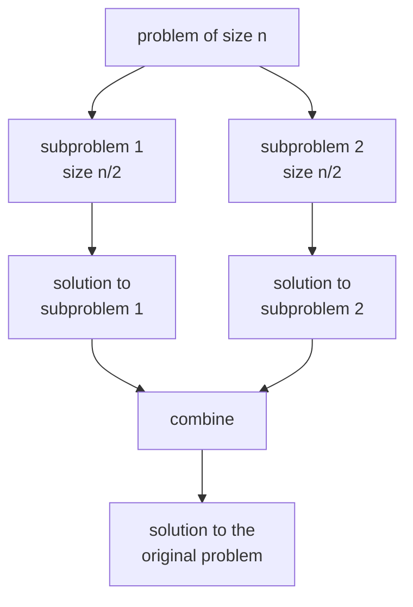
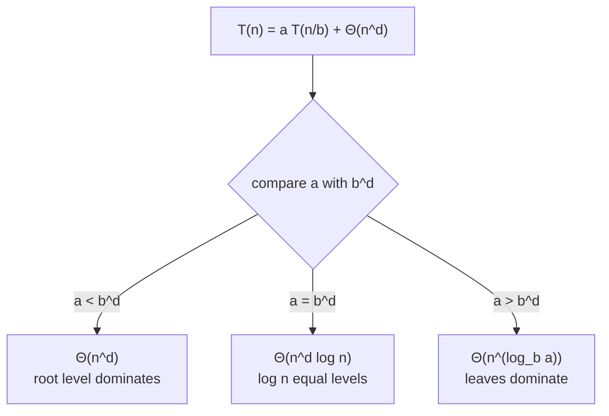
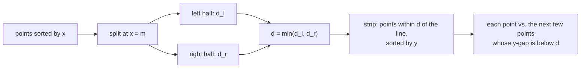

# Chapter 5 · Divide-and-Conquer

Divide-and-conquer is the most famous algorithm design strategy for a reason: split a problem into several smaller copies of itself, solve them, and stitch the answers together. Done well, the stitching is cheap and the splitting is balanced, and quadratic brute-force algorithms drop to $n \log n$ — or, as with Karatsuba and Strassen, a problem everyone assumed needed $n^2$ or $n^3$ steps suddenly doesn't. This chapter also gives you the **Master Theorem**, the single most useful tool for reading a recurrence and knowing the running time in ten seconds.

🎮 **Simulations:** [Sorting Studio](https://normansrule.github.io/algorithm-forge/sims/sorting-studio.html) (mergesort, quicksort) · [Tree Traversals](https://normansrule.github.io/algorithm-forge/sims/tree-traversals.html) · [Karatsuba & Strassen](https://normansrule.github.io/algorithm-forge/sims/karatsuba-strassen.html) · [Closest Pair & Hull](https://normansrule.github.io/algorithm-forge/sims/closest-pair-hull.html) · [Tower of Hanoi](https://normansrule.github.io/algorithm-forge/sims/hanoi.html) · [Recurrence Lab](https://normansrule.github.io/algorithm-forge/sims/recurrence-lab.html)
🏟️ **Arena:** [Chapter 5 problems](https://normansrule.github.io/algorithm-forge/arena/?chapter=5)
🐍 **Code:** [`ch05_divide_conquer.py`](../../src/python/algoforge/ch05_divide_conquer.py)
📝 **Practice:** [practice/](../../practice/)

---

## Contents

1. [The big idea in 60 seconds](#the-big-idea-in-60-seconds)
2. [The Master Theorem](#the-master-theorem)
3. [Build Card 5.1 — Mergesort (and bottom-up mergesort)](#build-card-51--mergesort-and-bottom-up-mergesort)
4. [Build Card 5.2 — Quicksort (recursive and non-recursive)](#build-card-52--quicksort-recursive-and-non-recursive)
5. [Build Card 5.3 — Binary tree traversals, height, nodes and leaves](#build-card-53--binary-tree-traversals-height-nodes-and-leaves)
6. [Build Card 5.4 — Karatsuba and Strassen](#build-card-54--karatsuba-and-strassen)
7. [Build Card 5.5 — Closest pair and quickhull](#build-card-55--closest-pair-and-quickhull)
8. [Build Card 5.6 — Tower of Hanoi](#build-card-56--tower-of-hanoi)
9. [Build Card 5.7 — Merge-style problems: union without duplicates, counting inversions, maximum subarray](#build-card-57--merge-style-problems)
10. [How a senior engineer thinks about this chapter](#how-a-senior-engineer-thinks-about-this-chapter)
11. [Check yourself](#-check-yourself)
12. [Go deeper](#-go-deeper)

---

## The big idea in 60 seconds

Three moves (Levitin §5 introduction):

1. **Divide** the instance into several smaller instances of the same problem (ideally about equal size).
2. **Conquer** each one recursively (tiny instances are solved directly).
3. **Combine** the sub-answers into an answer for the whole.



**Where does the work happen?** That question organizes the whole chapter:

| Algorithm | Divide step | Combine step |
|---|---|---|
| Mergesort | trivial (cut in half by position) | **all the work** (merge) |
| Quicksort | **all the work** (partition by value) | nothing |
| Tree algorithms | free (the tree is already split) | small (add, max, visit) |
| Karatsuba / Strassen | split digits / blocks | clever additions that save a multiplication |
| Closest pair | split by a vertical line | check a narrow strip |

**Relation to Chapter 4.** Decrease-and-conquer makes **one** smaller instance; divide-and-conquer makes **several** and must combine them. Binary search, with $a = 1$ subproblem, sits right on the border — Levitin files it under decrease-by-a-constant-factor.

---

## The Master Theorem

### The general divide-and-conquer recurrence

If an instance of size $n$ is split into $b$ pieces of size $n/b$, $a$ of which must be solved, and dividing plus combining costs $f(n)$:

$$T(n) = a\,T(n/b) + f(n), \qquad a \ge 1,\; b > 1.$$

### Deriving it by backward substitution (so you never have to memorize it)

Let $n = b^k$. Substitute the recurrence into itself:

$$
\begin{aligned}
T(n) &= a\,T(n/b) + f(n) \\
     &= a\big[a\,T(n/b^2) + f(n/b)\big] + f(n) = a^2 T(n/b^2) + a f(n/b) + f(n) \\
     &= a^3 T(n/b^3) + a^2 f(n/b^2) + a f(n/b) + f(n) \\
     &\;\;\vdots \\
     &= a^k T(1) + \sum_{j=0}^{k-1} a^j f\!\left(n/b^j\right).
\end{aligned}
$$

Two facts finish it. First, $a^k = a^{\log_b n} = n^{\log_b a}$ (the leaves of the recursion tree). Second, if $f(n) = n^d$, then

$$\sum_{j=0}^{k-1} a^j \left(\frac{n}{b^j}\right)^d = n^d \sum_{j=0}^{k-1} \left(\frac{a}{b^d}\right)^j,$$

a **geometric series with ratio $r = a / b^d$**:

- $r < 1$: the series is bounded by a constant → the top level dominates → $\Theta(n^d)$.
- $r = 1$: all $k = \log_b n$ terms equal 1 → $\Theta(n^d \log n)$.
- $r > 1$: the last term dominates, about $n^d r^{k} = a^k = n^{\log_b a}$ → the leaves dominate → $\Theta(n^{\log_b a})$.

### The theorem (Levitin §5 introduction, Appendix B)

If $f(n) \in \Theta(n^d)$ with $d \ge 0$, then

$$
T(n) \in \begin{cases}
\Theta(n^d) & \text{if } a < b^d \quad\text{(work shrinks going down: root dominates)}\\
\Theta(n^d \log n) & \text{if } a = b^d \quad\text{(every level costs the same)}\\
\Theta(n^{\log_b a}) & \text{if } a > b^d \quad\text{(work grows going down: leaves dominate)}
\end{cases}
$$

The same holds with $O$ or $\Omega$ in place of $\Theta$.



### Examples (work each one before peeking at the last column)

| Recurrence | a | b | d | compare | Answer | Where it comes from |
|---|---|---|---|---|---|---|
| $T(n) = T(n/2) + 1$ | 1 | 2 | 0 | $1 = 1$ | $\Theta(\log n)$ | binary search |
| $T(n) = T(n/2) + n$ | 1 | 2 | 1 | $1 < 2$ | $\Theta(n)$ | quickselect, lucky splits |
| $T(n) = 2T(n/2) + 1$ | 2 | 2 | 0 | $2 > 1$ | $\Theta(n)$ | tree traversal, divide-and-conquer max |
| $T(n) = 2T(n/2) + n$ | 2 | 2 | 1 | $2 = 2$ | $\Theta(n \log n)$ | mergesort, closest pair |
| $T(n) = 3T(n/2) + n$ | 3 | 2 | 1 | $3 > 2$ | $\Theta(n^{\log_2 3}) \approx \Theta(n^{1.585})$ | Karatsuba |
| $T(n) = 4T(n/2) + n$ | 4 | 2 | 1 | $4 > 2$ | $\Theta(n^2)$ | naive divide-and-conquer multiplication |
| $T(n) = 4T(n/2) + n^2$ | 4 | 2 | 2 | $4 = 4$ | $\Theta(n^2 \log n)$ | |
| $T(n) = 4T(n/2) + n^3$ | 4 | 2 | 3 | $4 < 8$ | $\Theta(n^3)$ | |
| $T(n) = 7T(n/2) + n^2$ | 7 | 2 | 2 | $7 > 4$ | $\Theta(n^{\log_2 7}) \approx \Theta(n^{2.807})$ | Strassen |
| $T(n) = 8T(n/2) + n^2$ | 8 | 2 | 2 | $8 > 4$ | $\Theta(n^3)$ | block matrix multiply |
| $T(n) = 9T(n/3) + n$ | 9 | 3 | 1 | $9 > 3$ | $\Theta(n^2)$ | |
| $T(n) = 3T(n/4) + n$ | 3 | 4 | 1 | $3 < 4$ | $\Theta(n)$ | |
| $T(n) = 2T(n/4) + \sqrt{n}$ | 2 | 4 | 1/2 | $2 = 2$ | $\Theta(\sqrt{n} \log n)$ | |

(Each row was checked by computing the exact recurrence with $T(1) = 1$ for $n = b^1..b^5$ and watching the ratio to the claimed class settle.)

### When the Master Theorem does **not** apply

| Recurrence | Why it fails | How to solve it | Answer |
|---|---|---|---|
| $T(n) = 2T(n/2) + n \log n$ | $f(n) = n \log n$ is not $\Theta(n^d)$ for any $d$ | backward substitution (below) | $\Theta(n \log^2 n)$ |
| $T(n) = 2T(n/2) + n/\log n$ | same reason | substitution: harmonic sum | $\Theta(n \log \log n)$ |
| $T(n) = T(n-1) + n$ | subproblem is $n - 1$, not $n/b$ | backward substitution | $\Theta(n^2)$ |
| $T(n) = 2T(n-1) + 1$ | subtract, not divide (Tower of Hanoi) | backward substitution | $\Theta(2^n)$ |
| $T(n) = T(n/3) + T(2n/3) + n$ | unequal pieces | recursion tree (each level ≤ n, depth $\log_{3/2} n$) | $\Theta(n \log n)$ |
| $T(n) = 2^n T(n/2) + n$ | $a$ is not a constant | — | not polynomially bounded |
| $T(n) = 0.5\,T(n/2) + n$ | $a < 1$ (less than one subproblem makes no sense) | — | — |

**Worked "interview question": $T(n) = 2T(n/2) + n\log_2 n$, $T(1) = 1$.** Let $n = 2^k$, so $\log_2(n/2^i) = k - i$.

$$
\begin{aligned}
T(2^k) &= 2T(2^{k-1}) + 2^k \cdot k \\
       &= 2\big[2T(2^{k-2}) + 2^{k-1}(k-1)\big] + 2^k k = 4T(2^{k-2}) + 2^k(k-1) + 2^k k \\
       &= 8T(2^{k-3}) + 2^k(k-2) + 2^k(k-1) + 2^k k \\
       &\;\;\vdots \\
       &= 2^k T(1) + 2^k \sum_{j=1}^{k} j = 2^k + 2^k \frac{k(k+1)}{2}.
\end{aligned}
$$

So $T(n) = n + \tfrac{1}{2} n \log_2 n (\log_2 n + 1) \in \Theta(n \log^2 n)$. (Verified for $k = 1..10$.) The pattern — every level costs about $n \cdot (\text{its own } \log)$ and there are $\log n$ levels — is the "extended Master Theorem": if $f(n) \in \Theta(n^{\log_b a} \log^j n)$ then $T(n) \in \Theta(n^{\log_b a} \log^{j+1} n)$.

👀 **Try it:** [Recurrence Lab](https://normansrule.github.io/algorithm-forge/sims/recurrence-lab.html) — type any $a$, $b$, $f(n)$ and watch the recursion tree's level sums.

---

## Build Card 5.1 — Mergesort (and bottom-up mergesort)

🎯 **Problem in one sentence:** array $A[0..n-1]$ → the same elements in nondecreasing order, guaranteed $\Theta(n \log n)$ and stable.

📖 **Story.** Two teaching assistants each alphabetize half of a stack of exams. To combine, you look at the top exam of each sorted pile and always take the one that comes first. One glance per exam — merging is fast because both piles are already sorted.

👀 **See it:** [Sorting Studio → Mergesort](https://normansrule.github.io/algorithm-forge/sims/sorting-studio.html)

```
                 6 2 9 4 1 8 3 7
               /                 \
          6 2 9 4               1 8 3 7          divide (by position)
          /     \               /     \
        6 2     9 4           1 8     3 7
        / \     / \           / \     / \
       6   2   9   4         1   8   3   7
        \ /     \ /           \ /     \ /
        2 6     4 9           1 8     3 7         merge
          \     /               \     /
          2 4 6 9               1 3 7 8
               \                 /
                 1 2 3 4 6 7 8 9
```

🧱 **Build it in blocks.**

*Block 1 — state (for merge):* three indices — next unused in B, next unused in C, next free slot in A.

```
ALGORITHM Merge(B[0..p-1], C[0..q-1], A[0..p+q-1])
    i ← 0
    j ← 0
    k ← 0
```

*Block 2 — loop skeleton:* while both piles still have cards.

```
    while i < p and j < q do
        ...
        k ← k + 1
```

*Block 3 — the decision:* take the smaller front element; `≤` (not `<`) keeps equal keys in their original order — that is what makes mergesort **stable**.

```
        if B[i] ≤ C[j] then
            A[k] ← B[i]
            i ← i + 1
        else
            A[k] ← C[j]
            j ← j + 1
```

*Block 4 — the return:* one pile is empty; copy the rest of the other.

```
ALGORITHM Merge(B[0..p-1], C[0..q-1], A[0..p+q-1])
    // Merges sorted B and C into A
    i ← 0
    j ← 0
    k ← 0
    while i < p and j < q do
        if B[i] ≤ C[j] then
            A[k] ← B[i]
            i ← i + 1
        else
            A[k] ← C[j]
            j ← j + 1
        k ← k + 1
    while i < p do
        A[k] ← B[i]
        i ← i + 1
        k ← k + 1
    while j < q do
        A[k] ← C[j]
        j ← j + 1
        k ← k + 1

ALGORITHM Mergesort(A[0..n-1])
    // Sorts A by recursive mergesort
    if n > 1 then
        h ← ⌊n / 2⌋
        B ← A[0..h-1]              // copies
        C ← A[h..n-1]              // copies
        Mergesort(B)
        Mergesort(C)
        Merge(B, C, A)
    return A
```

✋ **Trace it by hand** on $[6, 2, 9, 4, 1, 8, 3, 7]$ — counting key comparisons in each merge:

| Merge | Result | Comparisons |
|---|---|---|
| [6] + [2] | [2, 6] | 1 |
| [9] + [4] | [4, 9] | 1 |
| [2, 6] + [4, 9] | [2, 4, 6, 9] | 3 (2<4, 6>4, 6<9; then copy 9) |
| [1] + [8] | [1, 8] | 1 |
| [3] + [7] | [3, 7] | 1 |
| [1, 8] + [3, 7] | [1, 3, 7, 8] | 3 |
| [2, 4, 6, 9] + [1, 3, 7, 8] | [1, 2, 3, 4, 6, 7, 8, 9] | 7 |
| **Total** | | **17** |

This input happens to be a worst case: $n \log_2 n - n + 1 = 24 - 8 + 1 = 17$.

**Bottom-up (non-recursive) mergesort.** Skip the recursion: merge runs of width 1 into width 2, then 2 into 4, and so on.

```
ALGORITHM MergesortBottomUp(A[0..n-1])
    width ← 1
    while width < n do
        lo ← 0
        while lo < n - width do
            mid ← lo + width - 1
            hi ← min(lo + 2 * width - 1, n - 1)
            B ← A[lo..mid]
            C ← A[mid+1..hi]
            Merge(B, C, A[lo..hi])
            lo ← lo + 2 * width
        width ← 2 * width
    return A
```

| width | array after the pass |
|---|---|
| 1 | [2, 6, 4, 9, 1, 8, 3, 7] |
| 2 | [2, 4, 6, 9, 1, 3, 7, 8] |
| 4 | [1, 2, 3, 4, 6, 7, 8, 9] |

💻 **Code.**

<details><summary>Python</summary>

```python
def merge(b, c, a):
    i = j = k = 0
    while i < len(b) and j < len(c):
        if b[i] <= c[j]:
            a[k] = b[i]; i += 1
        else:
            a[k] = c[j]; j += 1
        k += 1
    a[k:] = b[i:] + c[j:]          # one of these is empty

def mergesort(a):
    if len(a) > 1:
        h = len(a) // 2
        b, c = a[:h], a[h:]
        mergesort(b)
        mergesort(c)
        merge(b, c, a)
    return a

def mergesort_bottom_up(a):
    n, width = len(a), 1
    while width < n:
        for lo in range(0, n - width, 2 * width):
            mid, hi = lo + width, min(lo + 2 * width, n)
            merged = a[lo:hi]
            merge(a[lo:mid], a[mid:hi], merged)
            a[lo:hi] = merged
        width *= 2
    return a
```

</details>

<details><summary>Java</summary>

```java
static void merge(int[] b, int[] c, int[] a) {
    int i = 0, j = 0, k = 0;
    while (i < b.length && j < c.length) a[k++] = (b[i] <= c[j]) ? b[i++] : c[j++];
    while (i < b.length) a[k++] = b[i++];
    while (j < c.length) a[k++] = c[j++];
}

static void mergesort(int[] a) {
    if (a.length < 2) return;
    int h = a.length / 2;
    int[] b = java.util.Arrays.copyOfRange(a, 0, h);
    int[] c = java.util.Arrays.copyOfRange(a, h, a.length);
    mergesort(b);
    mergesort(c);
    merge(b, c, a);
}
```

</details>

🧮 **Analyze it.** Basic operation: key comparison. A merge of $n$ total elements makes between $\lfloor n/2 \rfloor$ and $n - 1$ comparisons (each comparison outputs one element; the last element is free).

$$C_{worst}(n) = 2C_{worst}(n/2) + (n - 1), \quad C_{worst}(1) = 0.$$

Master Theorem: $a = 2 = b^d = 2^1$ → $\Theta(n \log n)$. Exactly, for $n = 2^k$, backward substitution:

$$C(2^k) = 2C(2^{k-1}) + 2^k - 1 = 4C(2^{k-2}) + 2 \cdot 2^k - (1 + 2) = \dots = 2^k C(1) + k 2^k - (2^k - 1) = n\log_2 n - n + 1.$$

That is close to the information-theoretic minimum for comparison sorting, $\lceil \log_2 n! \rceil \approx n \log_2 n - 1.44n$. **All cases are $\Theta(n \log n)$.** Space: $\Theta(n)$ extra — the main drawback. Stable: yes.

⚠️ **Common mistakes.** Using `<` in the merge (breaks stability); forgetting to copy the leftovers; recursing on `A[0..h]` and `A[h..n-1]` (overlap → infinite recursion when $n = 2$); allocating new arrays inside the merge loop (kills performance — allocate one buffer once).

🔁 **Where it's used.** Timsort (Python `sorted`, Java `Arrays.sort` for objects, Android) is a mergesort that exploits existing sorted runs. External sorting of data larger than memory uses **multiway** mergesort. Sorting a **linked list** is best done by mergesort: splitting and merging need no random access and no extra array.

---

## Build Card 5.2 — Quicksort (recursive and non-recursive)

🎯 **Problem in one sentence:** array $A[0..n-1]$ → sorted in place, fast on average.

📖 **Story.** Pick one student (the pivot). Everyone shorter goes to the left wall, everyone taller to the right wall, and the pivot stands in the gap — **already in the exact spot they'll have in the final line.** Now do the same thing, separately, to each wall group.

👀 **See it:** [Sorting Studio → Quicksort](https://normansrule.github.io/algorithm-forge/sims/sorting-studio.html)

```
after partition:   [ all ≤ p ]  p  [ all ≥ p ]
                        ↓             ↓
                   sort left     sort right       (no combine step needed)
```

### Hoare partition (two-directional scan)

Pivot $p = A[l]$. Index $i$ scans **right** and stops at the first element $\ge p$; index $j$ scans **left** and stops at the first element $\le p$. If they have not crossed, swap and continue. When they cross, swap the pivot into position $j$.

🧱 **Build it in blocks.**

*Block 1 — state.*

```
ALGORITHM HoarePartition(A[l..r])
    p ← A[l]
    i ← l
    j ← r + 1
```

*Block 2 — loop skeleton:* keep scanning until the indices cross.

```
    repeat
        ...
    until i ≥ j
```

*Block 3 — the decision:* move each index to the next "wrong side" element; swap only if they have not crossed. (Stopping on elements **equal** to $p$ keeps splits balanced when there are many duplicates. The pivot $A[l]$ stops $j$, so $j$ never runs off the left end; we guard $i$ explicitly.)

```
        repeat i ← i + 1 until i > r or A[i] ≥ p
        repeat j ← j - 1 until A[j] ≤ p
        if i < j then
            swap A[i] and A[j]
```

*Block 4 — the return:* put the pivot at its final position $j$.

```
ALGORITHM HoarePartition(A[l..r])
    // Partitions A[l..r] around p = A[l]; returns the split position
    p ← A[l]
    i ← l
    j ← r + 1
    repeat
        repeat i ← i + 1 until i > r or A[i] ≥ p
        repeat j ← j - 1 until A[j] ≤ p
        if i < j then
            swap A[i] and A[j]
    until i ≥ j
    swap A[l] and A[j]
    return j

ALGORITHM Quicksort(A[l..r])
    // Sorts A[l..r] in place
    if l < r then
        s ← HoarePartition(A[l..r])
        Quicksort(A[l..s-1])
        Quicksort(A[s+1..r])
    return A
```

✋ **Trace it by hand** on $[6, 10, 3, 8, 1, 9, 4, 7]$.

*First partition of A[0..7], pivot 6:*

| step | i stops at | j stops at | action | array |
|---|---|---|---|---|
| 1 | 1 (10 ≥ 6) | 6 (4 ≤ 6; skipped 7) | i < j: swap | 6, **4**, 3, 8, 1, 9, **10**, 7 |
| 2 | 3 (8; skipped 3) | 4 (1; skipped 9) | i < j: swap | 6, 4, 3, **1**, **8**, 9, 10, 7 |
| 3 | 4 (8) | 3 (1) | crossed: stop | |
| end | | | swap A[0], A[3] | **1, 4, 3, 6**, 8, 9, 10, 7 → s = 3 |

*Remaining partitions:*

| subarray | pivot | result | s |
|---|---|---|---|
| A[0..2] = 1, 4, 3 | 1 | 1, 4, 3 (i stops at 4, j runs down to the pivot) | 0 |
| A[1..2] = 4, 3 | 4 | 3, 4 (i runs past the end, j stops at 3) | 2 |
| A[4..7] = 8, 9, 10, 7 | 8 | swap 9↔7 → 8, 7, 10, 9; cross; pivot swap → 7, 8, 10, 9 | 5 |
| A[6..7] = 10, 9 | 10 | 9, 10 | 7 |

Final: $[1, 3, 4, 6, 7, 8, 9, 10]$ with 22 key comparisons in total.

**Lomuto variant.** Replace `HoarePartition` with the one-directional `LomutoPartition` from [Chapter 4](../04-decrease-and-conquer/README.md#build-card-47--euclid-quickselect-and-interpolation-search). Simpler to get right, but it does more swaps and degrades to $\Theta(n^2)$ when all keys are equal (every element goes to one side).

**Median-of-three pivot.** Look at $A[l]$, $A[\lfloor (l+r)/2 \rfloor]$, $A[r]$; swap their median into $A[l]$, then partition as usual. Sorted and reverse-sorted inputs now split perfectly.

```
ALGORITHM MedianOfThree(A[l..r])
    m ← ⌊(l + r) / 2⌋
    if A[m] < A[l] then
        swap A[m] and A[l]
    if A[r] < A[l] then
        swap A[r] and A[l]
    if A[r] < A[m] then
        swap A[r] and A[m]
    swap A[l] and A[m]           // median now at A[l], used as the pivot
```

### The non-recursive version (explicit stack)

Recursion is just the computer keeping a to-do list for you. We can keep it ourselves: a stack of subarray boundaries still to be sorted.

```
ALGORITHM QuicksortIterative(A[0..n-1])
    // Quicksort with an explicit stack of (l, r) pairs
    S ← []
    push(S, 0)
    push(S, n - 1)
    while not isEmpty(S) do
        r ← pop(S)
        l ← pop(S)
        if l < r then
            s ← HoarePartition(A[l..r])
            // push the LARGER side first so the smaller side is processed next
            if s - l > r - s then
                push(S, l)
                push(S, s - 1)
                push(S, s + 1)
                push(S, r)
            else
                push(S, s + 1)
                push(S, r)
                push(S, l)
                push(S, s - 1)
    return A
```

Processing the smaller side first guarantees the stack never holds more than about $\log_2 n$ pending subarrays, even on the worst input (with the order reversed, a sorted input would pile up $\Theta(n)$ entries).

💻 **Code.**

<details><summary>Python</summary>

```python
def hoare_partition(a, l, r):
    p, i, j = a[l], l, r + 1
    while True:
        i += 1
        while i <= r and a[i] < p:
            i += 1
        j -= 1
        while a[j] > p:
            j -= 1
        if i >= j:
            break
        a[i], a[j] = a[j], a[i]
    a[l], a[j] = a[j], a[l]
    return j

def quicksort(a, l=0, r=None):
    if r is None:
        r = len(a) - 1
    if l < r:
        s = hoare_partition(a, l, r)
        quicksort(a, l, s - 1)
        quicksort(a, s + 1, r)
    return a

def quicksort_iterative(a):
    stack = [(0, len(a) - 1)]
    while stack:
        l, r = stack.pop()
        if l < r:
            s = hoare_partition(a, l, r)
            left, right = (l, s - 1), (s + 1, r)
            if s - l > r - s:                       # larger side pushed first
                stack += [left, right]
            else:
                stack += [right, left]
    return a
```

</details>

<details><summary>Java</summary>

```java
static int hoarePartition(int[] a, int l, int r) {
    int p = a[l], i = l, j = r + 1;
    while (true) {
        do { i++; } while (i <= r && a[i] < p);
        do { j--; } while (a[j] > p);
        if (i >= j) break;
        int t = a[i]; a[i] = a[j]; a[j] = t;
    }
    int t = a[l]; a[l] = a[j]; a[j] = t;
    return j;
}

static void quicksort(int[] a, int l, int r) {
    if (l < r) {
        int s = hoarePartition(a, l, r);
        quicksort(a, l, s - 1);
        quicksort(a, s + 1, r);
    }
}

static void quicksortIterative(int[] a) {
    java.util.ArrayDeque<int[]> stack = new java.util.ArrayDeque<>();
    stack.push(new int[]{0, a.length - 1});
    while (!stack.isEmpty()) {
        int[] lr = stack.pop();
        int l = lr[0], r = lr[1];
        if (l >= r) continue;
        int s = hoarePartition(a, l, r);
        int[] left = {l, s - 1}, right = {s + 1, r};
        if (s - l > r - s) { stack.push(left); stack.push(right); }
        else               { stack.push(right); stack.push(left); }
    }
}
```

</details>

🧮 **Analyze it — recursive version (recurrence + backward substitution).** Basic operation: key comparison. Hoare's partition of $n$ elements makes $n + 1$ comparisons if the indices cross, $n$ if they meet.

*Best case — every split in the middle:*
$$C_{best}(n) = 2C_{best}(n/2) + n, \quad C_{best}(1) = 0.$$
$$C(2^k) = 2C(2^{k-1}) + 2^k = 4C(2^{k-2}) + 2 \cdot 2^k = \dots = 2^k C(1) + k \cdot 2^k = n \log_2 n.$$

*Worst case — every split is lopsided.* With the first element as pivot, this happens on an **already sorted** array: $i$ stops immediately at $A[l+1]$, $j$ slides all the way back to the pivot, the split is $s = l$, and the problem shrinks by only one:
$$C_{worst}(n) = C_{worst}(n-1) + (n + 1), \quad C_{worst}(1) = 0.$$
$$C(n) = C(n-2) + n + (n+1) = \dots = C(1) + \sum_{m=2}^{n} (m+1) = \frac{(n+1)(n+2)}{2} - 3 \in \Theta(n^2).$$
(Verified by instrumented runs: $n = 5 \to 18$, $n = 8 \to 42$, $n = 10 \to 63$.) Why sorted input is the worst: the pivot is the minimum every time, so one side is always empty.

*Average case* (all orders of distinct keys equally likely; split position $s$ uniform):
$$C_{avg}(n) = \frac{1}{n}\sum_{s=0}^{n-1}\big[(n+1) + C_{avg}(s) + C_{avg}(n-1-s)\big] \approx 2n \ln n \approx 1.39\, n\log_2 n.$$
Only about 39% more comparisons than the best case — and quicksort's inner loop is so tight that it usually beats mergesort and heapsort in practice.

**Analyze it — non-recursive version (counting method).** Count comparisons partition by partition. Every element becomes a pivot at most once, so there are at most $n$ partition calls. A call on $m$ elements costs at most $m + 1$ comparisons.

- *Worst case:* the subarrays popped have sizes $n, n-1, \dots, 2$, so the total is $\sum_{m=2}^{n}(m+1) = \frac{(n+1)(n+2)}{2} - 3 \in O(n^2)$.
- *Best/average case:* subarrays at the same "depth" are disjoint, so all partitions at one depth cost at most $n + (\text{number of subarrays}) \le 2n$ comparisons. With balanced splits there are about $\log_2 n$ depths → $O(n \log n)$.
- *Extra space:* the stack holds $O(\log n)$ pairs when the smaller side is processed first.

Same algorithm, same comparisons — the explicit stack only changes who keeps the to-do list.

⚠️ **Common mistakes.**
- Letting $i$ run past $r$ (no sentinel or bounds check) — the classic out-of-bounds bug in Hoare partition.
- Scanning with `A[i] > p` / `A[j] < p` (not stopping on equals): arrays of equal keys become $\Theta(n^2)$.
- Recursing on `A[l..s]` and `A[s..r]` — the pivot is already placed; include it and you may loop forever.
- Claiming quicksort is stable (it is not) or needs no extra memory (it needs $O(\log n)$ stack at best, $O(n)$ if done naively).

🔁 **Variations / real software.**
- **Introsort** (C++ `std::sort`): quicksort with median-of-three, switches to heapsort if recursion gets too deep ($> 2\log_2 n$) and to insertion sort for tiny subarrays. Guaranteed $O(n \log n)$.
- **Dual-pivot quicksort** (Java `Arrays.sort` for primitives since Java 7). **Pattern-defeating quicksort** (Rust `sort_unstable`, Go's `sort` since 1.19).
- **Randomized pivot** makes the worst case vanishingly unlikely for any fixed input — important when an attacker picks the input.

---

## Build Card 5.3 — Binary tree traversals, height, nodes and leaves

🎯 **Problem in one sentence:** a binary tree → visit all nodes in a set order, or compute a property (height, number of nodes, number of leaves).

📖 **Story.** A binary tree is divide-and-conquer made physical: a root, a left subtree, a right subtree. Any question about the whole tree becomes "ask the left subtree, ask the right subtree, combine with the root."

👀 **See it:** [Tree Traversals sim](https://normansrule.github.io/algorithm-forge/sims/tree-traversals.html)

```
            A
          /   \
         B     C
        / \     \
       D   E     F
          /
         G
```

| Traversal | Rule | Order for the tree above |
|---|---|---|
| Preorder | root, left, right | A B D E G C F |
| Inorder | left, root, right | D B G E A C F |
| Postorder | left, right, root | D G E B F C A |

🧱 **Build it in blocks** (height as the example).

*Block 1 — state:* nothing but the node; the empty tree is the base case, with height −1 by convention (so a single node has height 0).

*Block 2 — skeleton:* recurse on both subtrees.

*Block 3 — decision/combine:* take the taller one.

*Block 4 — return:* add one edge for the root.

```
ALGORITHM Height(T)
    // Height of binary tree T (null = empty tree)
    if T = null then
        return -1
    return max(Height(T.left), Height(T.right)) + 1

ALGORITHM CountNodes(T)
    if T = null then
        return 0
    return CountNodes(T.left) + CountNodes(T.right) + 1

ALGORITHM CountLeaves(T)
    if T = null then
        return 0
    if T.left = null and T.right = null then
        return 1
    return CountLeaves(T.left) + CountLeaves(T.right)

ALGORITHM Inorder(T)
    if T ≠ null then
        Inorder(T.left)
        print T.key                  // visit the node
        Inorder(T.right)
```

✋ **Trace it by hand** (height): $h(G) = 0$, $h(E) = \max(0, -1) + 1 = 1$, $h(D) = 0$, $h(B) = \max(0, 1) + 1 = 2$, $h(F) = 0$, $h(C) = \max(-1, 0) + 1 = 1$, $h(A) = \max(2, 1) + 1 = \mathbf{3}$. Nodes: 7. Leaves: D, G, F → 3.

<details><summary>Python / Java</summary>

```python
class TreeNode:
    def __init__(self, key, left=None, right=None):
        self.key, self.left, self.right = key, left, right

def height(t):
    return -1 if t is None else max(height(t.left), height(t.right)) + 1

def count_nodes(t):
    return 0 if t is None else count_nodes(t.left) + count_nodes(t.right) + 1

def count_leaves(t):
    if t is None:
        return 0
    if t.left is None and t.right is None:
        return 1
    return count_leaves(t.left) + count_leaves(t.right)

def preorder(t):
    return [] if t is None else [t.key] + preorder(t.left) + preorder(t.right)

def inorder(t):
    return [] if t is None else inorder(t.left) + [t.key] + inorder(t.right)

def postorder(t):
    return [] if t is None else postorder(t.left) + postorder(t.right) + [t.key]
```

```java
static class TreeNode {
    char key; TreeNode left, right;
    TreeNode(char k, TreeNode l, TreeNode r) { key = k; left = l; right = r; }
}
static int height(TreeNode t) {
    return (t == null) ? -1 : Math.max(height(t.left), height(t.right)) + 1;
}
static int countLeaves(TreeNode t) {
    if (t == null) return 0;
    if (t.left == null && t.right == null) return 1;
    return countLeaves(t.left) + countLeaves(t.right);
}
static void inorder(TreeNode t, StringBuilder out) {
    if (t == null) return;
    inorder(t.left, out); out.append(t.key); inorder(t.right, out);
}
```

</details>

🧮 **Analyze it.** Input size: $n$ = number of nodes. For `Height`, count additions: $A(n) = A(n_L) + A(n_R) + 1$ for $n > 0$, $A(0) = 0$, whose solution is $A(n) = n$ (one addition per node, whatever the shape). Count comparisons `T = null` instead and you get more: each of the $n$ real nodes is checked, *and* each of the $n + 1$ empty subtrees (in the **extended tree**, a tree with $n$ internal nodes has exactly $n + 1$ external "null" nodes) — so $2n + 1$ checks. Either way: **$\Theta(n)$** for traversals, height, node and leaf counts. Tree algorithms follow $T(n) = T(n_L) + T(n_R) + \Theta(1)$ — the Master Theorem needs equal halves, but this sums to $\Theta(n)$ for any shape.

⚠️ **Common mistakes.** Defining the height of the empty tree as 0 (then a single node has height 1 — pick one convention and state it); counting a node with one child as a leaf; forgetting that inorder on a *binary search tree (BST)* yields sorted order (a free sorting algorithm and a correctness test).

🔁 **Where it's used.** Preorder = serializing/copying a tree, printing a directory listing. Postorder = freeing memory, computing folder sizes, evaluating expression trees. Inorder = sorted output of a BST. Compilers walk abstract syntax trees in all three orders.

---

## Build Card 5.4 — Karatsuba and Strassen

👀 **See it:** [Karatsuba & Strassen sim](https://normansrule.github.io/algorithm-forge/sims/karatsuba-strassen.html)

### Large-integer multiplication (Karatsuba)

🎯 **Problem in one sentence:** two $n$-digit integers → their product, with fewer than $n^2$ digit multiplications.

📖 **Story.** Grade-school multiplication multiplies every digit by every digit: $n^2$ one-digit products. Split each number into a high half and a low half. The obvious split needs **four** half-size products. Karatsuba's trick (1960) gets away with **three** — and saving one of four at *every* level of recursion compounds into a different exponent.

Write $x = x_1 10^m + x_0$ and $y = y_1 10^m + y_0$ with $m = n/2$. Then

$$x \cdot y = \underbrace{x_1 y_1}_{c_2} 10^{2m} + \underbrace{(x_1 y_0 + x_0 y_1)}_{c_1} 10^m + \underbrace{x_0 y_0}_{c_0}.$$

The middle term looks like it needs two products, but

$$c_1 = (x_1 + x_0)(y_1 + y_0) - c_2 - c_0.$$

So: **three multiplications** ($c_2$, $c_0$, and $(x_1 + x_0)(y_1 + y_0)$) plus a few additions and subtractions.

🧱 **Build it in blocks.**

```
ALGORITHM Karatsuba(x, y, n)
    // Multiplies nonnegative integers x and y with at most n digits
    // Block 1 — base case: small numbers are multiplied directly. It must cover n ≤ 3, not
    // just n = 1: the sums in Block 3 can have m + 1 digits, which is only fewer than n once n ≥ 4
    if n ≤ 3 then
        return x * y
    // Block 2 — split (p = 10^m)
    m ← ⌈n / 2⌉
    p ← 10^m
    x1 ← x div p
    x0 ← x mod p
    y1 ← y div p
    y0 ← y mod p
    // Block 3 — three recursive products instead of four
    c2 ← Karatsuba(x1, y1, n - m)
    c0 ← Karatsuba(x0, y0, m)
    c1 ← Karatsuba(x1 + x0, y1 + y0, m + 1) - c2 - c0
    // Block 4 — combine with shifts and additions
    return c2 * p * p + c1 * p + c0
```

(Multiplying by $10^m$ is just appending zeros — a shift, not a real multiplication.)

✋ **Trace it by hand:** $1234 \times 5678$, $m = 2$.

| quantity | value |
|---|---|
| $x_1, x_0, y_1, y_0$ | 12, 34, 56, 78 |
| $c_2 = 12 \times 56$ | 672 |
| $c_0 = 34 \times 78$ | 2652 |
| $(12 + 34)(56 + 78) = 46 \times 134$ | 6164 |
| $c_1 = 6164 - 672 - 2652$ | 2840 |
| result $= 672 \cdot 10^4 + 2840 \cdot 10^2 + 2652$ | $6{,}720{,}000 + 284{,}000 + 2{,}652 = \mathbf{7{,}006{,}652}$ ✔ |

In the idealized count, a 4-digit product needs $3^2 = 9$ one-digit multiplications instead of $4^2 = 16$. (Real runs need a few more small products because sums such as $12 + 34$ can carry into an extra digit; that overhead doesn't change the growth rate.)

🧮 **Analyze it.** One-digit multiplications for $n = 2^k$:

- Four-product split: $M(n) = 4M(n/2)$, $M(1) = 1$ → $M(n) = 4^k = n^2$. No gain at all.
- Karatsuba: $M(n) = 3M(n/2)$, $M(1) = 1$. Backward substitution: $M(2^k) = 3M(2^{k-1}) = 3^2 M(2^{k-2}) = \dots = 3^k M(1) = 3^k$. Using $a^{\log_b c} = c^{\log_b a}$:
$$M(n) = 3^{\log_2 n} = n^{\log_2 3} \approx n^{1.585}.$$

Counting additions too, $A(n) = 3A(n/2) + cn$; the Master Theorem ($3 > 2^1$) gives $\Theta(n^{\log_2 3})$ as well, so the whole algorithm is $\Theta(n^{1.585})$. For $n = 1024$ digits: $3^{10} = 59{,}049$ versus $1{,}048{,}576$ one-digit products.

### Strassen's matrix multiplication

🎯 **Problem in one sentence:** two $n \times n$ matrices → their product, with fewer than $n^3$ scalar multiplications.

Split each matrix into four $n/2 \times n/2$ blocks. The block formula $C_{00} = A_{00}B_{00} + A_{01}B_{10}$ (and three more like it) needs **8** half-size products. Strassen (1969) found **7**:

$$
\begin{aligned}
M_1 &= (A_{00} + A_{11})(B_{00} + B_{11}) & M_5 &= (A_{00} + A_{01})\,B_{11} \\
M_2 &= (A_{10} + A_{11})\,B_{00}          & M_6 &= (A_{10} - A_{00})(B_{00} + B_{01}) \\
M_3 &= A_{00}\,(B_{01} - B_{11})          & M_7 &= (A_{01} - A_{11})(B_{10} + B_{11}) \\
M_4 &= A_{11}\,(B_{10} - B_{00})          &     &
\end{aligned}
$$

$$
C = \begin{bmatrix} M_1 + M_4 - M_5 + M_7 & M_3 + M_5 \\ M_2 + M_4 & M_1 + M_3 - M_2 + M_6 \end{bmatrix}
$$

✋ **Check it with numbers** (1×1 blocks): $A = \begin{bmatrix}1 & 3\\7 & 5\end{bmatrix}$, $B = \begin{bmatrix}6 & 8\\4 & 2\end{bmatrix}$.

| M | computation | value |
|---|---|---|
| $M_1$ | $(1+5)(6+2)$ | 48 |
| $M_2$ | $(7+5)\cdot 6$ | 72 |
| $M_3$ | $1\cdot(8-2)$ | 6 |
| $M_4$ | $5\cdot(4-6)$ | −10 |
| $M_5$ | $(1+3)\cdot 2$ | 8 |
| $M_6$ | $(7-1)(6+8)$ | 84 |
| $M_7$ | $(3-5)(4+2)$ | −12 |

$C_{00} = 48 - 10 - 8 - 12 = 18$, $C_{01} = 6 + 8 = 14$, $C_{10} = 72 - 10 = 62$, $C_{11} = 48 + 6 - 72 + 84 = 66$. Direct: $1\cdot6 + 3\cdot4 = 18$, $1\cdot8 + 3\cdot2 = 14$, $7\cdot6 + 5\cdot4 = 62$, $7\cdot8 + 5\cdot2 = 66$ ✔.

<details><summary>Python (Karatsuba + Strassen)</summary>

```python
def karatsuba(x, y):
    if x < 10 or y < 10:
        return x * y
    n = max(len(str(x)), len(str(y)))
    m = n // 2
    x1, x0 = divmod(x, 10 ** m)
    y1, y0 = divmod(y, 10 ** m)
    c2 = karatsuba(x1, y1)
    c0 = karatsuba(x0, y0)
    c1 = karatsuba(x1 + x0, y1 + y0) - c2 - c0
    return c2 * 10 ** (2 * m) + c1 * 10 ** m + c0

def strassen(A, B):
    """A, B: n x n lists of lists, n a power of 2."""
    n = len(A)
    if n == 1:
        return [[A[0][0] * B[0][0]]]
    h = n // 2
    def quad(M, r, c):
        return [row[c * h:(c + 1) * h] for row in M[r * h:(r + 1) * h]]
    def add(X, Y):
        return [[a + b for a, b in zip(r, s)] for r, s in zip(X, Y)]
    def sub(X, Y):
        return [[a - b for a, b in zip(r, s)] for r, s in zip(X, Y)]
    a00, a01, a10, a11 = quad(A, 0, 0), quad(A, 0, 1), quad(A, 1, 0), quad(A, 1, 1)
    b00, b01, b10, b11 = quad(B, 0, 0), quad(B, 0, 1), quad(B, 1, 0), quad(B, 1, 1)
    m1 = strassen(add(a00, a11), add(b00, b11))
    m2 = strassen(add(a10, a11), b00)
    m3 = strassen(a00, sub(b01, b11))
    m4 = strassen(a11, sub(b10, b00))
    m5 = strassen(add(a00, a01), b11)
    m6 = strassen(sub(a10, a00), add(b00, b01))
    m7 = strassen(sub(a01, a11), add(b10, b11))
    c00 = add(sub(add(m1, m4), m5), m7)
    c01 = add(m3, m5)
    c10 = add(m2, m4)
    c11 = add(sub(add(m1, m3), m2), m6)
    return [l + r for l, r in zip(c00, c01)] + [l + r for l, r in zip(c10, c11)]
```

</details>

<details><summary>Java (Karatsuba with BigInteger)</summary>

```java
static java.math.BigInteger karatsuba(java.math.BigInteger x, java.math.BigInteger y) {
    int n = Math.max(x.bitLength(), y.bitLength());
    if (n <= 32) return x.multiply(y);                 // small: multiply directly
    int m = n / 2;                                     // split by bits, not digits
    java.math.BigInteger x1 = x.shiftRight(m), x0 = x.subtract(x1.shiftLeft(m));
    java.math.BigInteger y1 = y.shiftRight(m), y0 = y.subtract(y1.shiftLeft(m));
    java.math.BigInteger c2 = karatsuba(x1, y1), c0 = karatsuba(x0, y0);
    java.math.BigInteger c1 = karatsuba(x1.add(x0), y1.add(y0)).subtract(c2).subtract(c0);
    return c2.shiftLeft(2 * m).add(c1.shiftLeft(m)).add(c0);
}
```

</details>

🧮 **Analyze it.** Multiplications: $M(n) = 7M(n/2)$, $M(1) = 1$ → $M(2^k) = 7^k = n^{\log_2 7} \approx n^{2.807}$, versus $n^3$ for the definition-based algorithm. Additions: $A(n) = 7A(n/2) + 18(n/2)^2$, $A(1) = 0$; Master Theorem ($7 > 2^2$) → $\Theta(n^{\log_2 7})$. If $n$ is not a power of 2, pad with zero rows and columns.

⚠️ **Common mistakes.** Forgetting that saving *one* multiplication only matters because it is saved at *every* level; mixing up $M_2$/$M_5$ signs (always check with a 2×2 numeric example like the one above); claiming Strassen is always faster in practice — see the senior-engineer notes.

🔁 **Where it's used.** CPython multiplies big integers with Karatsuba above a size cutoff; the GNU Multiple Precision Arithmetic Library (GMP) uses Karatsuba, Toom–Cook and Fast Fourier Transform (FFT) based methods at increasing sizes. Strassen-like schemes appear in some high-performance linear algebra for very large matrices; asymptotically faster (but impractical) algorithms push the exponent below 2.372.

---

## Build Card 5.5 — Closest pair and quickhull

👀 **See it:** [Closest Pair & Hull sim](https://normansrule.github.io/algorithm-forge/sims/closest-pair-hull.html)

### Closest pair of points

🎯 **Problem in one sentence:** $n$ points in the plane → the two points with the smallest distance between them, in $O(n \log n)$ instead of brute force's $\Theta(n^2)$.

📖 **Story.** Draw a vertical line through the middle of a map of cities. The closest pair is either entirely west, entirely east — or it straddles the line. The first two are recursive calls. The clever part: straddling pairs can only live in a thin strip around the line, and in that strip each city has only a handful of candidates.

**Algorithm** (points presorted by $x$ into $P$ and by $y$ into $Q$):

1. If $n \le 3$, use brute force.
2. **Divide:** the first $\lceil n/2 \rceil$ points of $P$ go left, the rest right; the line is $x = m$, the $x$-coordinate of the last left point.
3. **Conquer:** recursively get $d_l$ and $d_r$; let $d = \min(d_l, d_r)$.
4. **Combine:** collect the points with $|x - m| < d$ into strip $S$, **in increasing $y$ order** (taken from $Q$). For each point in $S$, compare it only with the points that follow it in $S$ while their $y$-difference is less than $d$.
5. Return the best of $d$ and the strip's best.

**Why only a few comparisons per strip point?** For a point $p$ in the strip, any partner $q$ closer than $d$ lies in a $2d \times d$ rectangle above $p$ (width $2d$ across the line, height $d$). Cut that rectangle into eight $d/2 \times d/2$ squares. Each square lies entirely on one side of the line, and its diagonal is $d/\sqrt{2} < d$, so it can hold **at most one** point (two points on the same side are at least $d$ apart). So at most 8 points including $p$ — at most 7 comparisons, a constant. (A sharper geometric argument, used by Levitin, brings it down to at most 5.)



🧱 **Pseudocode.**

```
ALGORITHM ClosestPair(P, Q)
    // P: points sorted by x (ties by y); Q: the same points sorted by y (n ≥ 2, all distinct)
    // A point is a record with fields .x and .y
    n ← length(P)
    if n ≤ 3 then
        return BruteForceClosest(P)
    h ← ⌈n / 2⌉
    Pl ← P[0..h - 1]                 // the first h points (a copy)
    Pr ← P[h..n - 1]                 // the rest
    Ql ← []
    Qr ← []
    for each q in Q do               // split Q by half, keeping y-order
        if InLeftHalf(q, P[h - 1]) then
            append(Ql, q)
        else
            append(Qr, q)
    dl ← ClosestPair(Pl, Ql)
    dr ← ClosestPair(Pr, Qr)
    d ← min(dl, dr)
    m ← P[h - 1].x
    S ← []
    for each q in Q do
        if |q.x - m| < d then
            append(S, q)             // the strip, still in y-order
    best ← d
    for i ← 0 to length(S) - 2 do
        k ← i + 1
        while k ≤ length(S) - 1 and S[k].y - S[i].y < best do
            best ← min(best, Dist(S[i], S[k]))
            k ← k + 1
    return best

ALGORITHM InLeftHalf(q, last)
    // Is q at or before last in (x, then y) order? last = the final point of the left half
    return q.x < last.x or (q.x = last.x and q.y ≤ last.y)

ALGORITHM BruteForceClosest(P[0..n-1])
    best ← ∞
    for i ← 0 to n - 2 do
        for j ← i + 1 to n - 1 do
            best ← min(best, Dist(P[i], P[j]))
    return best

ALGORITHM Dist(p, q)
    return sqrt((p.x - q.x)² + (p.y - q.y)²)
```

✋ **Trace it by hand.** Points: (1,3), (2,7), (3,1), (4,5), (5,6), (7,2), (8,8), (9,4).

| step | detail |
|---|---|
| split | left = (1,3), (2,7), (3,1), (4,5); right = (5,6), (7,2), (8,8), (9,4); $m = 4$ |
| left best | (1,3)–(3,1) and (2,7)–(4,5) both $\sqrt{8} \approx 2.83$ |
| right best | (7,2)–(9,4) $= \sqrt{8} \approx 2.83$ |
| $d$ | $\approx 2.83$ |
| strip $\lvert x - 4\rvert < 2.83$, by $y$ | (3,1), (4,5), (5,6), (2,7) |
| (3,1) | next point (4,5) has $y$-gap 4 ≥ d → stop, no comparisons |
| (4,5) | vs (5,6): $\sqrt{2} \approx 1.41$ → best; vs (2,7): $y$-gap 2 < 2.83 → $\sqrt 8$ |
| (5,6) | vs (2,7): $y$-gap 1 → $\sqrt{10} \approx 3.16$ |
| answer | **(4,5)–(5,6), distance $\sqrt 2$** — a pair that straddles the line, found only by the strip step |

🧮 **Analyze it.** With the $y$-sorted list split in linear time (not re-sorted), divide + combine is $\Theta(n)$:
$$T(n) = 2T(n/2) + \Theta(n) \;\Rightarrow\; \Theta(n \log n)$$
(Master Theorem: $a = 2 = 2^1$), plus $O(n \log n)$ for the initial sorts. If you lazily **re-sort the strip** at every level, the combine step costs $\Theta(n \log n)$ and you get $T(n) = 2T(n/2) + n \log n \in \Theta(n \log^2 n)$ — exactly the "Master Theorem not applicable" example above.

### Quickhull (convex hull)

🎯 **Problem in one sentence:** $n$ points → the vertices of the smallest convex polygon containing them all (the convex hull).

📖 **Story.** Stretch a rubber band around nails on a board. The leftmost and rightmost nails, $P_1$ and $P_n$, are certainly on the band. The nail **farthest** from the line $P_1P_n$ is too. Recursively, only points *outside* the new triangle's sides can still matter — everything inside is discarded, like quicksort discarding the pivot's neighborhood.

**Farthest-from-the-line test** uses a determinant: for points $q_1, q_2, q_3$,

$$\text{area2}(q_1, q_2, q_3) = (x_2 - x_1)(y_3 - y_1) - (y_2 - y_1)(x_3 - x_1),$$

which is positive iff $q_3$ is to the **left** of the directed line $q_1 \to q_2$, and its size is proportional to the distance from the line.

```
ALGORITHM Quickhull(P[0..n-1])
    // P: points sorted by x (ties by y), n ≥ 2; a point is a record with fields .x and .y
    // Returns the hull vertices clockwise, starting from P[0]
    P1 ← P[0]
    Pn ← P[n - 1]
    return [P1] + Hull(P1, Pn, P) + [Pn] + Hull(Pn, P1, P)

ALGORITHM Hull(a, b, S)
    // Hull vertices strictly left of the directed line a → b, in order from a to b
    L ← []
    for each q in S do                  // the points q of S with Area2(a, b, q) > 0
        if Area2(a, b, q) > 0 then
            append(L, q)
    if isEmpty(L) then
        return []
    f ← L[0]
    for each q in L do                  // f = the point of L farthest from the line
        if Area2(a, b, q) > Area2(a, b, f) then
            f ← q
    return Hull(a, f, L) + [f] + Hull(f, b, L)

ALGORITHM Area2(a, b, q)
    // Twice the signed area of triangle a, b, q: positive iff q is left of a → b
    return (b.x - a.x) * (q.y - a.y) - (b.y - a.y) * (q.x - a.x)
```

✋ **Trace** on the same eight points: $P_1 = (1,3)$, $P_n = (9,4)$.

| call | points left of the line | farthest point |
|---|---|---|
| Hull((1,3) → (9,4)) (upper) | (2,7), (4,5), (5,6), (8,8) | (8,8), area2 = 33 |
| Hull((1,3) → (8,8)) | (2,7), (5,6) | (2,7), area2 = 23 |
| Hull((1,3)→(2,7)), Hull((2,7)→(8,8)) | none | — |
| Hull((9,4) → (1,3)) (lower) | (3,1), (7,2) | (3,1), area2 = 18 |
| Hull((9,4) → (3,1)) | (7,2) | (7,2), area2 = 6 |

Hull: **(1,3), (2,7), (8,8), (9,4), (7,2), (3,1)**. Points (4,5) and (5,6) are inside.

🧮 **Analyze it.** Finding the farthest point and filtering is $\Theta(n)$ per call. Worst case (every point ends up on the hull in a bad order, like quicksort's lopsided splits): $\Theta(n^2)$. On typical random inputs most points are discarded early, so it runs much faster — close to linear under reasonable distribution assumptions — plus $O(n \log n)$ to presort. Guaranteed $O(n \log n)$ algorithms exist (Graham scan, Andrew's monotone chain).

<details><summary>Python (closest pair + quickhull)</summary>

```python
import math

def closest_pair(points):
    P = sorted(points)
    Q = sorted(points, key=lambda p: p[1])
    return _cp(P, Q)

def _cp(P, Q):
    n = len(P)
    if n <= 3:
        return min(math.dist(P[i], P[j]) for i in range(n) for j in range(i + 1, n))
    h = (n + 1) // 2
    Pl, Pr = P[:h], P[h:]
    left_set = set(Pl)                       # assumes distinct points
    Ql = [p for p in Q if p in left_set]
    Qr = [p for p in Q if p not in left_set]
    d = min(_cp(Pl, Ql), _cp(Pr, Qr))
    m = P[h - 1][0]
    S = [p for p in Q if abs(p[0] - m) < d]
    best = d
    for i in range(len(S)):
        k = i + 1
        while k < len(S) and S[k][1] - S[i][1] < best:
            best = min(best, math.dist(S[i], S[k]))
            k += 1
    return best

def area2(a, b, c):
    return (b[0] - a[0]) * (c[1] - a[1]) - (b[1] - a[1]) * (c[0] - a[0])

def quickhull(points):
    P = sorted(points)
    def hull(a, b, S):
        L = [q for q in S if area2(a, b, q) > 0]
        if not L:
            return []
        f = max(L, key=lambda q: area2(a, b, q))
        return hull(a, f, L) + [f] + hull(f, b, L)
    return [P[0]] + hull(P[0], P[-1], P) + [P[-1]] + hull(P[-1], P[0], P)

pts = [(1, 3), (2, 7), (3, 1), (4, 5), (5, 6), (7, 2), (8, 8), (9, 4)]
print(closest_pair(pts))   # 1.414...
print(quickhull(pts))      # [(1, 3), (2, 7), (8, 8), (9, 4), (7, 2), (3, 1)]
```

</details>

<details><summary>Java (quickhull core)</summary>

```java
static long area2(int[] a, int[] b, int[] c) {
    return (long) (b[0] - a[0]) * (c[1] - a[1]) - (long) (b[1] - a[1]) * (c[0] - a[0]);
}

static void hull(int[] a, int[] b, java.util.List<int[]> s, java.util.List<int[]> out) {
    java.util.List<int[]> left = new java.util.ArrayList<>();
    int[] far = null;
    long best = 0;
    for (int[] q : s) {
        long ar = area2(a, b, q);
        if (ar > 0) {
            left.add(q);
            if (ar > best) { best = ar; far = q; }
        }
    }
    if (far == null) return;
    hull(a, far, left, out);
    out.add(far);
    hull(far, b, left, out);
}
```

</details>

⚠️ **Common mistakes.** Closest pair: forgetting the strip entirely (misses straddling pairs like the one in our trace); sorting the strip by $x$ instead of $y$; comparing each strip point with *all* later strip points (back to $\Theta(n^2)$). Quickhull: using `≥ 0` for "left of" (collinear points get included twice); forgetting the lower hull.

🔁 **Where it's used.** Collision detection and nearest-neighbor queries in games and robotics (usually via k-d trees or grids built on the same "only nearby cells matter" idea); convex hulls in computer graphics, geographic information systems (GIS), and as a first step for many geometry algorithms (Qhull is a widely used library based on quickhull).

---

## Build Card 5.6 — Tower of Hanoi

🎯 **Problem in one sentence:** $n$ disks on peg A (largest at the bottom) → all on peg C, moving one disk at a time and never placing a larger disk on a smaller one.

📖 **Story.** You can't move the biggest disk until the $n - 1$ disks on top of it are out of the way — on the spare peg. Then move the big disk once. Then bring the $n - 1$ disks back on top of it. The two "move $n-1$ disks" jobs are the same problem, smaller.

👀 **See it:** [Tower of Hanoi sim](https://normansrule.github.io/algorithm-forge/sims/hanoi.html)

```
ALGORITHM Hanoi(n, source, via, target)
    // Moves n disks from peg source to peg target using peg via
    if n = 1 then
        print "move disk 1 from", source, "to", target
        return
    Hanoi(n - 1, source, target, via)
    print "move disk", n, "from", source, "to", target
    Hanoi(n - 1, via, source, target)
```

✋ **Trace it by hand** ($n = 3$, A → C):

| # | disk | move |
|---|---|---|
| 1 | 1 | A → C |
| 2 | 2 | A → B |
| 3 | 1 | C → B |
| 4 | 3 | A → C |
| 5 | 1 | B → A |
| 6 | 2 | B → C |
| 7 | 1 | A → C |

🧮 **Analyze it.** Moves: $M(n) = 2M(n-1) + 1$, $M(1) = 1$. Backward substitution:
$$M(n) = 2[2M(n-2) + 1] + 1 = 2^2 M(n-2) + 2 + 1 = \dots = 2^{n-1} M(1) + 2^{n-2} + \dots + 2 + 1 = 2^n - 1.$$
$\Theta(2^n)$ — and provably optimal, so no cleverness can help. (Note: subproblems of size $n - 1$, not $n/b$, so the Master Theorem does not apply.)

<details><summary>Python / Java</summary>

```python
def hanoi(n, src="A", via="B", dst="C", moves=None):
    if moves is None:
        moves = []
    if n == 1:
        moves.append((1, src, dst))
    else:
        hanoi(n - 1, src, dst, via, moves)
        moves.append((n, src, dst))
        hanoi(n - 1, via, src, dst, moves)
    return moves
```

```java
static void hanoi(int n, char from, char via, char to, java.util.List<String> moves) {
    if (n == 1) { moves.add("1:" + from + "->" + to); return; }
    hanoi(n - 1, from, to, via, moves);
    moves.add(n + ":" + from + "->" + to);
    hanoi(n - 1, via, from, to, moves);
}
```

</details>

⚠️ **Common mistake:** swapping the roles of the pegs in the two recursive calls. Say it out loud: "first move $n-1$ out of the way (to *via*), last move $n-1$ onto the big disk (from *via*)."

---

## Build Card 5.7 — Merge-style problems

The merge step is a reusable tool: two sorted sequences, two fingers, one pass.

### (a) Union of two sorted sequences without duplicates — course midterm Q1

> Two $n$-element sorted sequences $A$ and $B$ may contain duplicates (they are not sets). Compute a sequence representing the set $A \cup B$ (no duplicates) in $O(n)$ time, and justify the bound.

🎯 **Problem:** sorted $A[0..n-1]$, sorted $B[0..n-1]$ → sorted $C$ containing each distinct value of $A \cup B$ exactly once.

📖 **Story.** Merge two sorted guest lists into one invitation list. Because the output is being produced in sorted order, a duplicate can only ever be equal to **the last name you wrote down**. One comparison with the last output element removes every duplicate — within $A$, within $B$, and across both.

🧱 **Build it in blocks.**

```
ALGORITHM SortedUnion(A[0..n-1], B[0..n-1])
    // Block 1 — state: two fingers and the output
    i ← 0
    j ← 0
    C ← []
    // Block 2 — skeleton: standard merge loop
    while i < n and j < n do
        // Block 3 — decision: take the smaller; equal values advance both
        if A[i] < B[j] then
            x ← A[i]
            i ← i + 1
        else if B[j] < A[i] then
            x ← B[j]
            j ← j + 1
        else
            x ← A[i]
            i ← i + 1
            j ← j + 1
        AppendIfNew(C, x)
    while i < n do
        AppendIfNew(C, A[i])
        i ← i + 1
    while j < n do
        AppendIfNew(C, B[j])
        j ← j + 1
    // Block 4 — return
    return C

ALGORITHM AppendIfNew(C, x)
    // C is sorted, so a duplicate of x can only be C's last element
    if length(C) = 0 or C[length(C) - 1] ≠ x then
        append(C, x)
```

✋ **Trace it by hand:** $A = [1, 2, 2, 4, 7, 7, 9]$, $B = [2, 3, 4, 4, 8, 9, 9]$.

| comparison | x | last of C | action | C |
|---|---|---|---|---|
| A[0]=1 < B[0]=2 | 1 | — | append | 1 |
| A[1]=2 = B[0]=2 | 2 | 1 | append (both advance) | 1, 2 |
| A[2]=2 < B[1]=3 | 2 | 2 | skip | 1, 2 |
| B[1]=3 < A[3]=4 | 3 | 2 | append | 1, 2, 3 |
| A[3]=4 = B[2]=4 | 4 | 3 | append (both advance) | 1, 2, 3, 4 |
| B[3]=4 < A[4]=7 | 4 | 4 | skip | 1, 2, 3, 4 |
| A[4]=7 < B[4]=8 | 7 | 4 | append | 1, 2, 3, 4, 7 |
| A[5]=7 < B[4]=8 | 7 | 7 | skip | 1, 2, 3, 4, 7 |
| B[4]=8 < A[6]=9 | 8 | 7 | append | 1, 2, 3, 4, 7, 8 |
| A[6]=9 = B[5]=9 | 9 | 8 | append (both advance) | 1, 2, 3, 4, 7, 8, 9 |
| leftover B[6]=9 | 9 | 9 | skip | **1, 2, 3, 4, 7, 8, 9** |

**Justification of $O(n)$.** Each iteration of every loop advances $i$ or $j$ (or both) by one, and neither ever moves backward. So there are at most $2n$ iterations in total. Each iteration does $O(1)$ work: at most two comparisons between $A$ and $B$, one comparison with the last element of $C$, one append (amortized $O(1)$). Total: $O(2n) = O(n)$. The output is correct because it is produced in nondecreasing order, so equal values are adjacent in the output stream and the "compare with last" test removes all repeats.

<details><summary>Python / Java</summary>

```python
def sorted_union(a, b):
    i = j = 0
    c = []
    def add(x):
        if not c or c[-1] != x:
            c.append(x)
    while i < len(a) and j < len(b):
        if a[i] < b[j]:
            add(a[i]); i += 1
        elif b[j] < a[i]:
            add(b[j]); j += 1
        else:
            add(a[i]); i += 1; j += 1
    for x in a[i:]:
        add(x)
    for x in b[j:]:
        add(x)
    return c
```

```java
static java.util.List<Integer> sortedUnion(int[] a, int[] b) {
    java.util.List<Integer> c = new java.util.ArrayList<>();
    int i = 0, j = 0;
    while (i < a.length || j < b.length) {
        int x;
        if (j == b.length || (i < a.length && a[i] < b[j])) x = a[i++];
        else if (i == a.length || b[j] < a[i]) x = b[j++];
        else { x = a[i]; i++; j++; }
        if (c.isEmpty() || c.get(c.size() - 1) != x) c.add(x);
    }
    return c;
}
```

</details>

⚠️ **Common mistakes:** checking only $A[i] = B[j]$ for duplicates (misses repeats *inside* $A$ or $B$); using a hash set (correct, but the output is unsorted and the bound becomes expected, not worst-case); concatenating and re-sorting ($O(n \log n)$ — fails the requirement).

### (b) Counting inversions

🎯 **Problem:** array $A[0..n-1]$ → the number of pairs $i < j$ with $A[i] > A[j]$ (a measure of "how unsorted" it is), in $O(n \log n)$.

📖 **Idea.** Mergesort already compares left-half and right-half elements. When a **right** element $C[j]$ is copied out before the remaining left elements $B[i..p-1]$, it is smaller than **all** of them — that is $p - i$ inversions counted in one step.

```
ALGORITHM SortCount(A[0..n-1])
    // Returns the number of inversions; sorts A as a side effect
    if n ≤ 1 then
        return 0
    h ← ⌊n / 2⌋
    B ← A[0..h-1]
    C ← A[h..n-1]
    count ← SortCount(B) + SortCount(C)
    i ← 0
    j ← 0
    k ← 0
    while i < h and j < n - h do
        if B[i] ≤ C[j] then
            A[k] ← B[i]
            i ← i + 1
        else
            A[k] ← C[j]
            j ← j + 1
            count ← count + (h - i)        // C[j] jumps over h - i left elements
        k ← k + 1
    while i < h do                          // copy the leftovers of B (if any) into A[k..n-1]
        A[k] ← B[i]
        i ← i + 1
        k ← k + 1
    while j < n - h do                      // ...or the leftovers of C
        A[k] ← C[j]
        j ← j + 1
        k ← k + 1
    return count
```

✋ **Trace:** $A = [3, 8, 6, 1, 5]$. Split [3, 8] | [6, 1, 5] and [6] | [1, 5].

| merge | cross inversions counted |
|---|---|
| [3] + [8] | 0 |
| [1] + [5] | 0 |
| [6] + [1, 5] | 1 jumps over 6 (1), 5 jumps over 6 (1) → 2 |
| [3, 8] + [1, 5, 6] | 1 jumps over 3, 8 (2); 5 jumps over 8 (1); 6 jumps over 8 (1) → 4 |
| **total** | **6** — matches brute force: (3,1), (8,6), (8,1), (8,5), (6,1), (6,5) |

Same recurrence as mergesort: $T(n) = 2T(n/2) + \Theta(n) \in \Theta(n \log n)$ (brute force checks all $n(n-1)/2$ pairs).

### (c) Maximum subarray

🎯 **Problem:** array of numbers (some negative) → the largest sum of a contiguous block.

📖 **Idea.** The best block lies entirely in the left half, entirely in the right half, or **crosses the middle**. A crossing block is "best suffix of the left half" + "best prefix of the right half" — each found by one linear scan outward from the middle.

```
ALGORITHM MaxSubarray(A[l..r])
    if l = r then
        return A[l]
    m ← ⌊(l + r) / 2⌋
    best ← max(MaxSubarray(A[l..m]), MaxSubarray(A[m+1..r]))
    s ← 0
    leftBest ← -∞
    for i ← m downto l do
        s ← s + A[i]
        leftBest ← max(leftBest, s)
    s ← 0
    rightBest ← -∞
    for j ← m + 1 to r do
        s ← s + A[j]
        rightBest ← max(rightBest, s)
    return max(best, leftBest + rightBest)
```

✋ **Trace:** $A = [-2, 5, -1, 4, -6, 3, 2, -3]$. Left half $[-2, 5, -1, 4]$ → best 8 (5, −1, 4). Right half $[-6, 3, 2, -3]$ → best 5 (3, 2). Crossing: best left suffix ending at index 3: sums 4, 3, 8, 6 → 8; best right prefix from index 4: sums −6, −3, −1, −4 → −1; crossing = 7. Answer: $\max(8, 5, 7) = \mathbf{8}$ (indices 1..3).

$T(n) = 2T(n/2) + \Theta(n) \in \Theta(n \log n)$. (A one-pass dynamic-programming solution, **Kadane's algorithm**, does it in $\Theta(n)$ — a good reminder that divide-and-conquer is not always the end of the story.)

<details><summary>Python (inversions + maximum subarray)</summary>

```python
def sort_count(a):
    if len(a) <= 1:
        return 0
    h = len(a) // 2
    b, c = a[:h], a[h:]
    count = sort_count(b) + sort_count(c)
    i = j = k = 0
    while i < len(b) and j < len(c):
        if b[i] <= c[j]:
            a[k] = b[i]; i += 1
        else:
            a[k] = c[j]; j += 1
            count += len(b) - i
        k += 1
    a[k:] = b[i:] + c[j:]
    return count

def max_subarray(a, l=0, r=None):
    if r is None:
        r = len(a) - 1
    if l == r:
        return a[l]
    m = (l + r) // 2
    best = max(max_subarray(a, l, m), max_subarray(a, m + 1, r))
    s, left_best = 0, float("-inf")
    for i in range(m, l - 1, -1):
        s += a[i]; left_best = max(left_best, s)
    s, right_best = 0, float("-inf")
    for j in range(m + 1, r + 1):
        s += a[j]; right_best = max(right_best, s)
    return max(best, left_best + right_best)
```

</details>

<details><summary>Java (inversions)</summary>

```java
static long sortCount(int[] a) {
    if (a.length <= 1) return 0;
    int h = a.length / 2;
    int[] b = java.util.Arrays.copyOfRange(a, 0, h), c = java.util.Arrays.copyOfRange(a, h, a.length);
    long count = sortCount(b) + sortCount(c);
    int i = 0, j = 0, k = 0;
    while (i < b.length && j < c.length) {
        if (b[i] <= c[j]) a[k++] = b[i++];
        else { a[k++] = c[j++]; count += b.length - i; }
    }
    while (i < b.length) a[k++] = b[i++];
    while (j < c.length) a[k++] = c[j++];
    return count;
}
```

</details>

---

## How a senior engineer thinks about this chapter

- **Production sorts are hybrids, and for good reasons.** Recursion overhead dominates on tiny subarrays, so every serious sort switches to insertion sort below a cutoff (roughly 16–32 elements). Introsort adds a heapsort fallback to cap quicksort's worst case. Timsort exploits the fact that real data is often partly sorted (log files, appended records) and is stable, which matters when you sort by one key after another.
- **Stability is a product requirement, not trivia.** Sorting a table by "city" and then by "last name" only gives "by name, then city" if the second sort is stable. That is why Java sorts objects with Timsort (stable) but primitives with dual-pivot quicksort (stability is meaningless for plain ints).
- **Quicksort's worst case is a security issue.** If users control the input, a deterministic pivot can be attacked into $\Theta(n^2)$. Randomize, use median-of-three plus an introsort fallback, or use a library sort.
- **Asymptotics vs. constants.** Karatsuba wins only above a few dozen machine words; Strassen needs large matrices and is less numerically stable, and cache-friendly $n^3$ blocked multiplication (Basic Linear Algebra Subprograms, BLAS) is usually faster in practice. Know the crossover points, measure, and let libraries choose.
- **Divide-and-conquer parallelizes naturally.** Independent subproblems map onto fork/join pools (Java `ForkJoinPool`, parallel streams), graphics processing unit (GPU) kernels, and MapReduce-style jobs. The combine step is usually the bottleneck — design it to be cheap.
- **Memory hierarchy loves divide-and-conquer.** Recursively halving eventually makes subproblems fit in cache ("cache-oblivious" algorithms), which is a hidden reason mergesort-style and blocked algorithms beat naive loops on real hardware.
- **Always write the recurrence first.** Before coding a recursive solution in an interview or design review, write $T(n) = aT(n/b) + f(n)$. If it says $\Theta(n^2)$, you've saved yourself an hour.

---

## ✅ Check yourself

**1. (Master Theorem)** Solve $T(n) = 2T(n/2) + n^2$ and $T(n) = 16T(n/4) + n^2$.

<details><summary>Answer</summary>

First: $a = 2 < b^d = 4$ → $\Theta(n^2)$. Second: $a = 16 = 4^2$ → $\Theta(n^2 \log n)$.

</details>

**2. (Concept)** Why doesn't the Master Theorem solve $T(n) = 2T(n/2) + n\log n$, and what is the answer?

<details><summary>Answer</summary>

$f(n) = n \log n$ is not $\Theta(n^d)$ for any constant $d$ (it's bigger than $n^1$ but smaller than $n^{1+\epsilon}$). Backward substitution with $n = 2^k$ gives $T(n) = n + \tfrac12 n\log_2 n(\log_2 n + 1) \in \Theta(n \log^2 n)$.

</details>

**3. (Trace)** Merge $[1, 4, 7, 9]$ with $[2, 3, 8]$. How many comparisons?

<details><summary>Answer</summary>

1<2 → 1; 4>2 → 2; 4>3 → 3; 4<8 → 4; 7<8 → 7; 9>8 → 8; then copy 9. Result [1, 2, 3, 4, 7, 8, 9] with **6** comparisons ($= n - 1$ for $n = 7$, a worst case).

</details>

**4. (Trace)** Apply one Hoare partition (first element as pivot) to $[5, 1, 9, 3, 7, 2]$.

<details><summary>Answer</summary>

p = 5. i stops at 9 (index 2), j stops at 2 (index 5) → swap → [5, 1, 2, 3, 7, 9]. i moves to 7 (index 4), j moves to 3 (index 3) → crossed. Swap pivot with A[3] → **[3, 1, 2, 5, 7, 9]**, s = 3.

</details>

**5. (Analysis)** Why is an already-sorted array the worst case for quicksort with a first-element pivot? How many comparisons for $n = 6$?

<details><summary>Answer</summary>

The pivot is always the minimum, so the left part is empty and the right part has $n - 1$ elements — the problem shrinks by one per partition. Comparisons: $(n+1)(n+2)/2 - 3 = 7 \cdot 8/2 - 3 = 25$.

</details>

**6. (Exam style: recursive vs. non-recursive quicksort)** Give the worst-case recurrence for recursive quicksort, solve it by backward substitution, and explain how you'd count comparisons for the explicit-stack version.

<details><summary>Answer</summary>

$C(n) = C(n-1) + (n+1)$, $C(1) = 0$ → $C(n) = \sum_{m=2}^{n}(m+1) = (n+1)(n+2)/2 - 3 \in O(n^2)$. For the stack version, count per partition call: at most $n$ calls (each element is a pivot at most once), a call on $m$ elements costs $\le m+1$ comparisons, so worst case $\sum (m+1) \in O(n^2)$; with balanced splits each depth level costs $O(n)$ over $O(\log n)$ levels → $O(n \log n)$.

</details>

**7. (Trace)** Give the preorder, inorder and postorder of: root 8 with left child 3 (children 1 and 6) and right child 10 (right child 14).

<details><summary>Answer</summary>

Preorder: 8 3 1 6 10 14. Inorder: 1 3 6 8 10 14 (sorted — it's a BST). Postorder: 1 6 3 14 10 8. Height: 2.

</details>

**8. (Trace)** Compute $21 \times 43$ with one level of Karatsuba ($m = 1$).

<details><summary>Answer</summary>

$x_1 = 2, x_0 = 1, y_1 = 4, y_0 = 3$. $c_2 = 8$, $c_0 = 3$, $(2+1)(4+3) = 21$, $c_1 = 21 - 8 - 3 = 10$. Result $8 \cdot 100 + 10 \cdot 10 + 3 = 903$ ✔.

</details>

**9. (Analysis)** How many scalar multiplications does Strassen's algorithm use for two $8 \times 8$ matrices (recursing down to $1 \times 1$)? The definition-based algorithm?

<details><summary>Answer</summary>

$7^3 = 343$ versus $8^3 = 512$.

</details>

**10. (Design, exam style)** Two sorted sequences may contain duplicates. Give an $O(n)$ algorithm for their **intersection** as a set (no duplicates), and justify the bound.

<details><summary>Answer</summary>

Merge-walk with two fingers: if $A[i] < B[j]$ advance $i$; if $B[j] < A[i]$ advance $j$; if equal, output the value unless it equals the last output, then advance both. Each step advances at least one finger that never moves back, so there are at most $2n$ steps of $O(1)$ work → $O(n)$.

</details>

**11. (Design)** Count inversions in $[4, 3, 2, 1]$ using the merge-count idea. What is the maximum number of inversions for an array of size $n$?

<details><summary>Answer</summary>

[4]+[3] → 1; [2]+[1] → 1; [3, 4] + [1, 2]: 1 jumps over 2 elements, 2 jumps over 2 → 4. Total **6** $= \binom{4}{2}$. The maximum is $n(n-1)/2$ (strictly decreasing array).

</details>

**12. (Analysis)** Solve Hanoi's recurrence and explain why the Master Theorem does not apply.

<details><summary>Answer</summary>

$M(n) = 2M(n-1) + 1$, $M(1) = 1$ → $M(n) = 2^n - 1$. The subproblems have size $n - 1$, not $n/b$ for a constant $b > 1$, so the recurrence is not of the form $aT(n/b) + f(n)$.

</details>

---

## 📚 Go deeper

**Book (Levitin, 3rd ed.)**
- Chapter 5 introduction (general recurrence, Master Theorem) · §5.1 Mergesort · §5.2 Quicksort · §5.3 Binary tree traversals and related properties · §5.4 Multiplication of large integers and Strassen's matrix multiplication · §5.5 The closest-pair and convex-hull problems by divide-and-conquer.
- Appendix B for recurrence-solving techniques; §2.4 for Tower of Hanoi's recurrence; §11.2 for the $\lceil \log_2 n! \rceil$ lower bound on comparison sorting.
- Exercises worth doing: Levitin Exercises 5.1 (divide-and-conquer max/min, inversion counting, bottom-up mergesort, tromino puzzle), 5.2 (quicksort traces, Dutch national flag), 5.3 (height, leaves), 5.4 (Karatsuba by hand), 5.5 (closest pair in one dimension).

**English-language resources**
- Massachusetts Institute of Technology (MIT) OpenCourseWare 6.046J *Design and Analysis of Algorithms* (divide-and-conquer, Strassen, FFT): <https://ocw.mit.edu/courses/6-046j-design-and-analysis-of-algorithms-spring-2015/>
- MIT OpenCourseWare 6.006 *Introduction to Algorithms* (mergesort, recurrences): <https://ocw.mit.edu/courses/6-006-introduction-to-algorithms-spring-2020/>
- Cormen, Leiserson, Rivest, Stein — *Introduction to Algorithms* (CLRS), chapter on divide-and-conquer (maximum subarray, Strassen, the Master method with its proof).
- VisuAlgo sorting animations (merge sort, quick sort, randomized quick sort): <https://visualgo.net/en/sorting>
- Sedgewick & Wayne, *Algorithms, 4th ed.* — Mergesort and Quicksort sections: <https://algs4.cs.princeton.edu/22mergesort/> · <https://algs4.cs.princeton.edu/23quicksort/>
- Abdul Bari (YouTube) — "Master Theorem", "Merge Sort", "Quick Sort", "Strassen's Matrix Multiplication" lectures.
- Tim Peters's design notes on Timsort: `listsort.txt` in the CPython source repository.

**Previous / next:** [Chapter 4 · Decrease-and-Conquer](../04-decrease-and-conquer/README.md) · [Chapter 6 · Transform-and-Conquer](../06-transform-and-conquer/README.md)
