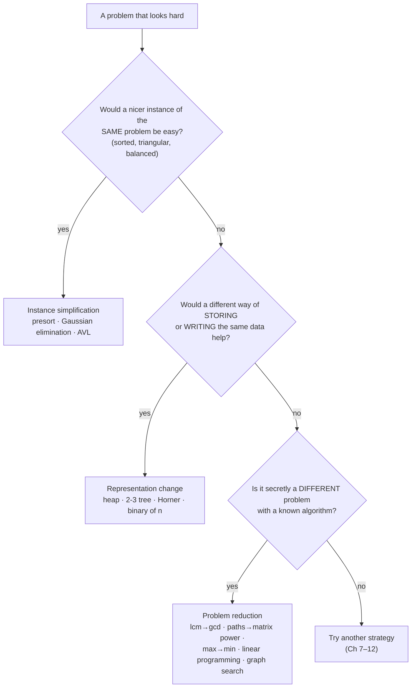
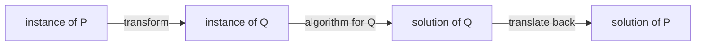

# Chapter 6 · Transform-and-Conquer

Some problems are hard in the form they arrive in and easy in a different form. Transform-and-conquer is the discipline of asking *"what shape would make this trivial?"* — then paying once to get there. Sort the data and duplicates sit side by side. Rearrange equations into a triangle and they solve themselves from the bottom up. Store keys in a heap and the maximum is always on top. Rewrite a polynomial in nested form and half the multiplications vanish. Or recognize that your problem is secretly a different one someone has already solved. This chapter is where you stop inventing algorithms from scratch and start **reusing** them.

🎮 **Simulations:** [Heap Lab](https://normansrule.github.io/algorithm-forge/sims/heap-lab.html) · [Search Trees](https://normansrule.github.io/algorithm-forge/sims/search-trees.html) (binary search tree (BST), Adelson-Velsky–Landis (AVL) rotations, 2-3 trees) · [Gaussian Elimination](https://normansrule.github.io/algorithm-forge/sims/gaussian.html) · [Horner & Binary Exponentiation](https://normansrule.github.io/algorithm-forge/sims/horner-binexp.html) · [Sorting Studio](https://normansrule.github.io/algorithm-forge/sims/sorting-studio.html) (heapsort)
🏟️ **Arena:** [Chapter 6 problems](https://normansrule.github.io/algorithm-forge/arena/?chapter=6)
🐍 **Code:** [`ch06_transform_conquer.py`](../../src/python/algoforge/ch06_transform_conquer.py)
📝 **Practice:** [practice/](../../practice/)

---

## Contents

1. [The big idea in 60 seconds](#the-big-idea-in-60-seconds)
2. [Build Card 6.1 — Presorting](#build-card-61--presorting)
3. [Build Card 6.2 — Gaussian elimination](#build-card-62--gaussian-elimination)
4. [Build Card 6.3 — Balanced search trees: AVL and 2-3 trees](#build-card-63--balanced-search-trees-avl-and-2-3-trees)
5. [Build Card 6.4 — Heaps, heapsort and priority queues](#build-card-64--heaps-heapsort-and-priority-queues)
6. [Build Card 6.5 — Horner's rule and binary exponentiation](#build-card-65--horners-rule-and-binary-exponentiation)
7. [Build Card 6.6 — Problem reduction](#build-card-66--problem-reduction)
8. [Worked interview and exam problems](#worked-interview-and-exam-problems)
9. [How a senior engineer thinks about this chapter](#how-a-senior-engineer-thinks-about-this-chapter)
10. [Check yourself](#-check-yourself)
11. [Go deeper](#-go-deeper)

---

## The big idea in 60 seconds

Two stages (Levitin §6 introduction):

1. **Transform** the instance into a form that is easier to work with.
2. **Conquer** the transformed instance.

There are three flavors, depending on *what* you transform into:

| Flavor | Transform into … | Examples in this chapter |
|---|---|---|
| **Instance simplification** | a simpler or more convenient instance of the **same** problem | presorting, Gaussian elimination (triangular system), AVL rotations (balanced tree) |
| **Representation change** | a **different representation** of the same instance | 2-3 trees, heaps, Horner's nested form, binary digits of $n$ for exponentiation |
| **Problem reduction** | a **different problem** you already know how to solve | lcm via gcd, counting paths via matrix powers, max via min, linear programming, state-space graph search |



**The one rule of transform-and-conquer:** the transformation must be cheap enough. Total cost = transform + solve the new form + translate the answer back. If that total isn't smaller than solving the original directly, the transformation isn't worth it.

---

## Build Card 6.1 — Presorting

🎯 **Problem in one sentence:** a list of $n$ items → an answer (are all items distinct? what is the most frequent value? is $K$ present?) that becomes easy once the list is sorted.

📖 **Story.** Find duplicate names on an unsorted sign-in sheet: you compare every name with every other — $n^2/2$ checks. Alphabetize the sheet first and duplicates end up **next to each other**; one pass down the page finds them.

👀 **See it:** [Sorting Studio](https://normansrule.github.io/algorithm-forge/sims/sorting-studio.html) — sort first, then watch the adjacent-pair scan.

```
unsorted:  7  3  9  3  5         brute force: compare all 10 pairs
sorted:    3  3  5  7  9         presort: compare 4 adjacent pairs
           └──┘ duplicate!
```

### Element uniqueness

🧱 **Build it in blocks.**

*Block 1 — transform:* sort. *Block 2 — skeleton:* walk adjacent pairs. *Block 3 — decision:* equal neighbors → not unique. *Block 4 — return:* survived the scan → unique.

```
ALGORITHM PresortElementUniqueness(A[0..n-1])
    // Returns true if all elements of A are distinct
    A ← sorted(A)                            // Block 1: transform (any Θ(n log n) sort)
    for i ← 0 to n - 2 do                    // Block 2
        if A[i] = A[i + 1] then              // Block 3
            return false
    return true                              // Block 4
```

### Mode (most frequent value)

After sorting, equal values form **runs**. The mode is the value with the longest run.

```
ALGORITHM PresortMode(A[0..n-1])
    // Returns a most frequent value of A
    A ← sorted(A)
    i ← 0
    modeFrequency ← 0
    while i ≤ n - 1 do
        runLength ← 1
        runValue ← A[i]
        while i + runLength ≤ n - 1 and A[i + runLength] = runValue do
            runLength ← runLength + 1
        if runLength > modeFrequency then
            modeFrequency ← runLength
            modeValue ← runValue
        i ← i + runLength
    return modeValue
```

✋ **Trace it by hand** on $[5, 1, 5, 7, 6, 5, 7]$ → sorted $[1, 5, 5, 5, 6, 7, 7]$.

| i | run value | run length | best so far |
|---|---|---|---|
| 0 | 1 | 1 | 1 (freq 1) |
| 1 | 5 | 3 | **5 (freq 3)** |
| 4 | 6 | 1 | 5 (freq 3) |
| 5 | 7 | 2 | 5 (freq 3) |
| 7 | — | stop | mode = **5** |

### Searching: sort once, search many times

One search: sequential search $\Theta(n)$ beats sort + binary search $\Theta(n \log n)$. But for $m$ searches, sequential costs about $m \cdot n/2$ comparisons, while presorting costs about $n \log_2 n + m \log_2 n$. Presorting wins once $m$ exceeds roughly $2\log_2 n$ — about 40 searches for a million items. That is why dictionaries, phone books and database indexes are sorted.

💻 **Code.**

<details><summary>Python</summary>

```python
def presort_unique(a):
    b = sorted(a)
    return all(b[i] != b[i + 1] for i in range(len(b) - 1))

def presort_mode(a):
    b = sorted(a)
    i, best_val, best_freq = 0, None, 0
    while i < len(b):
        run = 1
        while i + run < len(b) and b[i + run] == b[i]:
            run += 1
        if run > best_freq:
            best_val, best_freq = b[i], run
        i += run
    return best_val
```

</details>

<details><summary>Java</summary>

```java
static boolean presortUnique(int[] a) {
    int[] b = a.clone();
    java.util.Arrays.sort(b);
    for (int i = 0; i + 1 < b.length; i++) if (b[i] == b[i + 1]) return false;
    return true;
}

static int presortMode(int[] a) {
    int[] b = a.clone();
    java.util.Arrays.sort(b);
    int i = 0, bestVal = b[0], bestFreq = 0;
    while (i < b.length) {
        int run = 1;
        while (i + run < b.length && b[i + run] == b[i]) run++;
        if (run > bestFreq) { bestFreq = run; bestVal = b[i]; }
        i += run;
    }
    return bestVal;
}
```

</details>

🧮 **Analyze it.** Total time = sorting + scanning. With a $\Theta(n \log n)$ sort (mergesort, heapsort):

| Problem | Brute force | Presort-based |
|---|---|---|
| Element uniqueness | $\Theta(n^2)$ (all pairs) | $\Theta(n \log n) + \Theta(n) = \Theta(n \log n)$ |
| Mode | $\Theta(n^2)$ worst (count every value against a list of seen values) | $\Theta(n \log n) + \Theta(n) = \Theta(n \log n)$ |
| $m$ searches | $\Theta(mn)$ | $\Theta((n + m)\log n)$ |

**Why can't the sort itself be faster? The $\Omega(n \log n)$ lower bound.** Any comparison-based sort can be drawn as a binary **decision tree**: each internal node is a comparison, each leaf is one final ordering. A correct sort needs a different leaf for each of the $n!$ possible orderings, and a binary tree with $n!$ leaves has height at least $\lceil \log_2 n! \rceil$. So some input forces

$$\lceil \log_2 n! \rceil \approx n \log_2 n - 1.44\,n \in \Omega(n \log n)$$

comparisons. (Quick self-contained bound: $n! \ge (n/2)^{n/2}$, so $\log_2 n! \ge \frac{n}{2}\log_2 \frac{n}{2}$.) Mergesort's worst case, $n \log_2 n - n + 1$, is within a few percent of this, so presort-based algorithms are as fast as comparison sorting allows. Only non-comparison tricks (hashing, counting sort — Chapter 7) can go below it.

⚠️ **Common mistakes.** Forgetting to count the sort in the running time ("the scan is linear, so it's $O(n)$" — no, it's $\Theta(n \log n)$); sorting the caller's array in place when they didn't expect it (copy first, as the code does); comparing $A[i]$ with $A[i+1]$ up to $i = n - 1$ (off the end).

🔁 **Where it's used.** `SELECT DISTINCT` and `GROUP BY` in databases often run as sort-then-scan (a "sort aggregate") when data is too big for a hash table; the Unix pipeline `sort | uniq -c` is presorting plus run-length counting; many geometric algorithms (closest pair, convex hull sweep) start by sorting points.

---

## Build Card 6.2 — Gaussian elimination

🎯 **Problem in one sentence:** a system of $n$ linear equations in $n$ unknowns → the values of the unknowns.

📖 **Story.** A triangular system is easy: the last equation has one unknown, so solve it; substitute upward, and each equation above has just one new unknown. Gaussian elimination transforms any (nonsingular) system into an equivalent triangular one — **instance simplification**.

👀 **See it:** [Gaussian Elimination sim](https://normansrule.github.io/algorithm-forge/sims/gaussian.html)

Allowed moves (they never change the solution): swap two equations; multiply an equation by a nonzero constant; subtract a multiple of one equation from another.

✋ **Trace it by hand** on

$$
\begin{aligned}
2x_1 + x_2 - x_3 &= -3 \\
4x_1 + x_2 + 2x_3 &= 8 \\
-2x_1 + 3x_2 + x_3 &= -5
\end{aligned}
$$

Augmented matrix $[A \mid b]$ and the elimination steps:

```
  [  2   1  -1 | -3 ]
  [  4   1   2 |  8 ]   row2 - (2)·row1
  [ -2   3   1 | -5 ]   row3 - (-1)·row1

  [  2   1  -1 | -3 ]
  [  0  -1   4 | 14 ]
  [  0   4   0 | -8 ]   row3 - (-4)·row2

  [  2   1  -1 | -3 ]
  [  0  -1   4 | 14 ]
  [  0   0  16 | 48 ]   upper-triangular
```

Back substitution: $x_3 = 48/16 = 3$; $x_2 = (14 - 4 \cdot 3)/(-1) = -2$; $x_1 = (-3 - 1 \cdot (-2) + 1 \cdot 3)/2 = 1$. Check in row 2: $4 - 2 + 6 = 8$ ✔.

🧱 **Build it in blocks.**

*Block 1 — state:* the augmented matrix $A[0..n-1, 0..n]$ (row $i$ is equation $i + 1$; column $n$ holds $b$). The
book numbers rows and columns from 1; we count from 0 so the code runs as written in the Arena and matches Python and Java.

*Block 2 — skeleton:* for each pivot column $i$, fix every row below it.

```
for i ← 0 to n - 2 do
    for j ← i + 1 to n - 1 do
        ...
```

*Block 3 — the decision / improvement:* the multiplier $A[j,i]/A[i,i]$ does not depend on $k$, so compute it **once per row**, not once per entry (the "improved inner loop"). Also swap in the row with the largest $|A[j,i]|$ (**partial pivoting**) so we never divide by zero and round-off stays small.

*Block 4 — return:* back substitution.

```
ALGORITHM GaussElimination(A[0..n-1, 0..n])
    // Forward elimination with partial pivoting and the improved inner loop
    // Input: augmented matrix of a nonsingular system (column n holds the right-hand sides)
    // Output: an equivalent upper-triangular augmented matrix
    for i ← 0 to n - 2 do
        pivotRow ← i
        for j ← i + 1 to n - 1 do
            if abs(A[j, i]) > abs(A[pivotRow, i]) then
                pivotRow ← j
        for k ← i to n do
            swap A[i, k] and A[pivotRow, k]
        for j ← i + 1 to n - 1 do
            temp ← A[j, i] / A[i, i]             // computed once per row
            for k ← i to n do
                A[j, k] ← A[j, k] - A[i, k] * temp
    return A

ALGORITHM BackSubstitution(A[0..n-1, 0..n])
    // Solves an upper-triangular augmented system; x[j] is the unknown x_(j+1)
    x ← array(n, 0)
    for j ← n - 1 downto 0 do
        t ← 0
        for k ← j + 1 to n - 1 do
            t ← t + A[j, k] * x[k]
        x[j] ← (A[j, n] - t) / A[j, j]
    return x
```

(The hand trace above skipped pivoting to keep the numbers friendly; with pivoting, row 2 would be swapped to the top first. The final answer is the same.)

💻 **Code.**

<details><summary>Python</summary>

```python
from fractions import Fraction

def gauss_solve(A, b):
    """Solve A x = b exactly using Fractions and partial pivoting."""
    n = len(A)
    M = [[Fraction(v) for v in row] + [Fraction(bi)] for row, bi in zip(A, b)]
    for i in range(n - 1):
        p = max(range(i, n), key=lambda r: abs(M[r][i]))
        M[i], M[p] = M[p], M[i]
        for j in range(i + 1, n):
            temp = M[j][i] / M[i][i]
            for k in range(i, n + 1):
                M[j][k] -= M[i][k] * temp
    x = [Fraction(0)] * n
    for j in range(n - 1, -1, -1):
        t = sum(M[j][k] * x[k] for k in range(j + 1, n))
        x[j] = (M[j][n] - t) / M[j][j]
    return x

print(gauss_solve([[2, 1, -1], [4, 1, 2], [-2, 3, 1]], [-3, 8, -5]))  # [1, -2, 3]
```

</details>

<details><summary>Java</summary>

```java
static double[] gaussSolve(double[][] a, double[] b) {
    int n = b.length;
    double[][] m = new double[n][n + 1];
    for (int i = 0; i < n; i++) { System.arraycopy(a[i], 0, m[i], 0, n); m[i][n] = b[i]; }
    for (int i = 0; i < n - 1; i++) {
        int p = i;
        for (int j = i + 1; j < n; j++) if (Math.abs(m[j][i]) > Math.abs(m[p][i])) p = j;
        double[] t = m[i]; m[i] = m[p]; m[p] = t;
        for (int j = i + 1; j < n; j++) {
            double temp = m[j][i] / m[i][i];
            for (int k = i; k <= n; k++) m[j][k] -= m[i][k] * temp;
        }
    }
    double[] x = new double[n];
    for (int j = n - 1; j >= 0; j--) {
        double s = 0;
        for (int k = j + 1; k < n; k++) s += m[j][k] * x[k];
        x[j] = (m[j][n] - s) / m[j][j];
    }
    return x;
}
```

</details>

🧮 **Analyze it.** Input size $n$; basic operation: the multiplication in the innermost loop. Forward elimination:

$$C(n) = \sum_{i=1}^{n-1}\sum_{j=i+1}^{n}\sum_{k=i}^{n+1} 1 = \sum_{i=1}^{n-1} (n - i)(n + 2 - i) = \frac{n(n-1)(2n+5)}{6} \approx \frac{n^3}{3} \in \Theta(n^3).$$

(Checked: $n = 2, 3, 4, 10$ give 3, 11, 26, 375.) Without the improvement, the division is also inside the $k$ loop — same class, noticeably slower. Back substitution is $\Theta(n^2)$. **Total: $\Theta(n^3)$.**

**LU (lower–upper) decomposition — the reusable by-product.** Record each multiplier in a lower-triangular matrix $L$ (1s on the diagonal) and keep the final triangle as $U$. Then $A = LU$. For our system:

$$
L = \begin{bmatrix} 1 & 0 & 0 \\ 2 & 1 & 0 \\ -1 & -4 & 1 \end{bmatrix}, \quad
U = \begin{bmatrix} 2 & 1 & -1 \\ 0 & -1 & 4 \\ 0 & 0 & 16 \end{bmatrix}, \quad LU = A.
$$

To solve $Ax = b$ for a *new* right-hand side, solve $Ly = b$ (forward substitution) then $Ux = y$ (back substitution): only $\Theta(n^2)$ each time. Factor once in $\Theta(n^3)$, solve many times cheaply — the same "pay once" logic as presorting. The same elimination also gives the determinant (the product of $U$'s diagonal, times $-1$ for each row swap: here $2 \cdot (-1) \cdot 16 = -32$) and, applied to $[A \mid I]$, the inverse.

⚠️ **Common mistakes.** Dividing by a zero (or tiny) pivot — always pivot; updating $A[j,i]$ first and then using the *changed* value as the multiplier for the rest of the row (that is exactly why `temp` is saved before the $k$ loop); starting the $k$ loop at 1 instead of $i$ (harmless but wasteful — those entries are already 0).

🔁 **Where it's used.** Every linear-algebra library (the Linear Algebra PACKage (LAPACK), NumPy's `numpy.linalg.solve`, MATLAB's backslash) solves systems via LU with partial pivoting. Circuit simulators (SPICE-style nodal analysis, where SPICE = Simulation Program with Integrated Circuit Emphasis), structural engineering, least-squares fitting, and computer graphics all end in "solve a linear system."

---

## Build Card 6.3 — Balanced search trees: AVL and 2-3 trees

🎯 **Problem in one sentence:** a dynamic set of keys → search, insert and delete in $O(\log n)$ **worst case**, not just on average.

📖 **Story.** A plain binary search tree (BST) built from sorted input becomes a stick — every search walks the whole list. Two fixes: **AVL trees** keep the binary shape but *rotate* whenever one side gets too tall (instance simplification: turn an unbalanced tree into a balanced one); **2-3 trees** allow nodes with two keys so the tree can stay perfectly level (representation change).

👀 **See it:** [Search Trees sim](https://normansrule.github.io/algorithm-forge/sims/search-trees.html)

### AVL trees

An **AVL tree** (Adelson-Velsky and Landis, 1962) is a BST in which every node's **balance factor** — height of left subtree minus height of right subtree, with the empty tree's height $= -1$ — is $-1$, $0$ or $+1$.

After inserting a key as in a normal BST, walk back up. At the **first** (deepest) node whose balance factor became $\pm 2$, apply one of four rotations.

**The four rotations** (small cases first, then the general shape; $T_1..T_4$ are subtrees):

```
1) R-rotation (single right): new key went into the LEFT subtree of the LEFT child

        3                 2
       /                 / \
      2        ==>      1   3
     /
    1

   general:         r                    c
                   / \                  / \
                  c   T3      ==>      T1  r
                 / \                      / \
                T1  T2                   T2  T3

2) L-rotation (single left): mirror image — RIGHT subtree of the RIGHT child

    1                     2
     \                   / \
      2        ==>      1   3
       \
        3

3) LR-rotation (double left-right): new key went into the RIGHT subtree of the LEFT child
   = L-rotation at the child, then R-rotation at the root

      3               3               2
     /               /               / \
    1       ==>     2       ==>     1   3
     \             /
      2           1

   general:          r                         g
                    / \                      /   \
                   c   T4                   c     r
                  / \          ==>         / \   / \
                 T1  g                    T1 T2 T3  T4
                    / \
                   T2  T3

4) RL-rotation (double right-left): mirror image of LR

    1               1                  2
     \               \                / \
      3     ==>       2      ==>     1   3
     /                 \
    2                   3
```

Every rotation keeps the in-order sequence ($T_1 < c < T_2 < r < T_3$, etc.), so the BST property survives, and it takes $O(1)$ pointer changes.

🧱 **Build it in blocks.**

```
ALGORITHM RotateRight(r)
    c ← r.left
    r.left ← c.right
    c.right ← r
    UpdateHeight(r)                       // r is now below c, so r first
    UpdateHeight(c)
    return c                              // c is the new subtree root

ALGORITHM RotateLeft(r)
    c ← r.right
    r.right ← c.left
    c.left ← r
    UpdateHeight(r)
    UpdateHeight(c)
    return c

ALGORITHM Height(t)
    // The empty tree has height -1, a single node height 0
    if t = null then
        return -1
    return t.height

ALGORITHM UpdateHeight(t)
    t.height ← 1 + max(Height(t.left), Height(t.right))

ALGORITHM AVLInsert(t, key)
    // Returns the root of the subtree after inserting key
    // Block 1 — ordinary BST insertion
    if t = null then
        t ← new Node                      // a new leaf: left and right start as null
        t.key ← key
        t.height ← 0
        return t
    if key < t.key then
        t.left ← AVLInsert(t.left, key)
    else
        t.right ← AVLInsert(t.right, key)
    // Block 2 — recompute height and balance on the way back up
    UpdateHeight(t)
    bf ← Height(t.left) - Height(t.right)
    // Block 3 — the decision: which of the four rotations?
    if bf = 2 and key < t.left.key then
        return RotateRight(t)                              // R
    if bf = 2 then
        t.left ← RotateLeft(t.left)
        return RotateRight(t)                              // LR
    if bf = -2 and key > t.right.key then
        return RotateLeft(t)                               // L
    if bf = -2 then
        t.right ← RotateRight(t.right)
        return RotateLeft(t)                               // RL
    // Block 4 — balanced: return the (possibly new) subtree root
    return t
```

✋ **Trace it by hand: build the AVL tree for 5, 6, 8, 3, 2, 4, 7** (balance factors in brackets).

```
insert 5:   5[0]

insert 6:   5[-1]
             \
              6[0]

insert 8:   5[-2]  ← unbalanced; 8 went right-right  → L-rotation at 5
             \
              6[-1]
               \
                8[0]
            result:      6[0]
                        /    \
                     5[0]    8[0]

insert 3:          6[1]
                  /    \
               5[1]    8[0]
               /
            3[0]

insert 2:          6[2]
                  /    \
               5[2]  ← deepest unbalanced node; 2 went left-left → R-rotation at 5
               /
            3[1]
            /
         2[0]
            result:        6[1]
                          /    \
                       3[0]    8[0]
                       /  \
                    2[0]  5[0]

insert 4:          6[2]  ← unbalanced; 4 went into the RIGHT subtree of the LEFT child (3)
                  /    \                                   → LR-rotation at 6
               3[-1]   8[0]
               /  \
            2[0]  5[1]
                  /
               4[0]
            result:          5[0]
                           /      \
                        3[0]      6[-1]
                        /  \         \
                     2[0]  4[0]      8[0]

insert 7:            5[-1]
                   /      \
                3[0]      6[-2]  ← unbalanced; 7 went into the LEFT subtree of the RIGHT child (8)
                /  \         \                             → RL-rotation at 6
             2[0]  4[0]      8[1]
                             /
                          7[0]
            final:           5[0]
                           /      \
                        3[0]      7[0]
                        /  \      /  \
                     2[0] 4[0] 6[0]  8[0]
```

Seven keys, perfectly balanced, height 2 — while the plain BST for the same order would have height 3, and sorted input would give height 6.

🧮 **Analyze it.** The height of an AVL tree with $n$ nodes satisfies $\lfloor \log_2 n \rfloor \le h < 1.4405 \log_2(n + 2) - 1.3277$; experiments show the average height is about $1.01 \log_2 n + 0.1$ for large $n$. Search and insertion are $\Theta(\log n)$ in the worst case (one root-to-leaf path, at most one single or double rotation per insertion). Deletion is also $\Theta(\log n)$ but may need rotations all the way up. Cost: extra field per node (height or balance), frequent rotations, trickier code. Red-black trees relax the balance rule (one path may be up to twice as long as another) and rotate less often.

### 2-3 trees

A **2-3 tree** has two kinds of nodes: a **2-node** holds one key and has two children; a **3-node** holds two keys $k_1 < k_2$ and has three children (keys $< k_1$, between, $> k_2$). **All leaves are on the same level** — the tree is perfectly height-balanced by construction.

**Insertion:** always insert into a leaf. If the leaf now has three keys, **split** it: the smallest and largest keys become two separate nodes, and the **middle key is promoted** to the parent. If the parent overflows too, split it the same way; if the root splits, the tree grows one level taller — at the top, so every leaf stays on the same level.

```
ALGORITHM Insert23(root, key)
    // Inserts key into the 2-3 tree with this root; returns the (possibly new) root
    // A node is a record: .keys = its 1 or 2 keys in order; .kids = [] for a leaf, else its 2 or 3 children
    if root = null then
        return NewNode([key], [])
    split ← InsertBelow(root, key)
    if split = null then
        return root
    (mid, left, right) ← split             // the root itself split: make a new root
    return NewNode([mid], [left, right])   // the tree grows one level taller, at the top

ALGORITHM InsertBelow(node, key)
    // Inserts key into node's subtree. Returns null, or (middle key, left half, right half)
    // when node overflowed to 3 keys and had to split
    i ← 0                                  // i = the slot (and child) where key belongs
    while i < length(node.keys) and node.keys[i] < key do
        i ← i + 1
    if isEmpty(node.kids) then             // a leaf: add key, keeping the keys sorted
        PutAt(node.keys, i, key)
    else
        split ← InsertBelow(node.kids[i], key)
        if split = null then
            return null
        (mid, left, right) ← split         // child i split: its middle key moves up into node
        PutAt(node.keys, i, mid)
        node.kids[i] ← left
        PutAt(node.kids, i + 1, right)
    if length(node.keys) < 3 then
        return null
    // 3 keys: split into a 2-node with the smallest key and a 2-node with the largest key
    K ← node.keys
    if isEmpty(node.kids) then
        return (K[1], NewNode([K[0]], []), NewNode([K[2]], []))
    C ← node.kids
    return (K[1], NewNode([K[0]], [C[0], C[1]]), NewNode([K[2]], [C[2], C[3]]))

ALGORITHM NewNode(keys, kids)
    t ← new Node
    t.keys ← keys
    t.kids ← kids
    return t

ALGORITHM PutAt(L, i, x)
    // Inserts x into list L at position i, shifting L[i..] one place right
    append(L, x)
    for j ← length(L) - 1 downto i + 1 do
        L[j] ← L[j - 1]
    L[i] ← x
```

✋ **Trace it by hand: build the 2-3 tree for 9, 5, 8, 3, 2, 4, 7.**

```
insert 9:   [9]

insert 5:   [5 9]

insert 8:   [5 8 9]  overflow → split, promote 8
                 [8]
                /   \
             [5]     [9]

insert 3:        [8]
                /   \
            [3 5]    [9]

insert 2:        [8]
                /   \
          [2 3 5]    [9]      overflow → split leaf, promote 3
                 [3 8]
                /  |  \
             [2]  [5]  [9]

insert 4:        [3 8]
                /  |  \
             [2] [4 5] [9]

insert 7:        [3 8]
                /  |  \
             [2] [4 5 7] [9]   overflow → split leaf, promote 5 into [3 8]
                [3 5 8]        overflow at the root → split, promote 5 (tree grows)
            final:
                     [5]
                   /     \
                [3]       [8]
               /   \     /   \
             [2]   [4] [7]   [9]
```

🧮 **Analyze it.** A 2-3 tree of height $h$ holds at least as many keys as a full binary tree ($2^{h+1} - 1$) and at most as many as a full ternary tree of 3-nodes ($3^{h+1} - 1$). Hence

$$\log_3(n + 1) - 1 \le h \le \log_2(n + 1) - 1,$$

and search, insertion and deletion are all $\Theta(\log n)$ in the worst case. Generalizing to more keys per node gives 2-3-4 trees and **B-trees** (Chapter 7), the structure behind nearly every database index and file system.

<details><summary>Python (AVL insertion)</summary>

```python
class AVLNode:
    def __init__(self, key):
        self.key, self.left, self.right, self.height = key, None, None, 0

def h(t):
    return -1 if t is None else t.height

def _update(t):
    t.height = 1 + max(h(t.left), h(t.right))

def rotate_right(r):
    c = r.left
    r.left, c.right = c.right, r
    _update(r); _update(c)
    return c

def rotate_left(r):
    c = r.right
    r.right, c.left = c.left, r
    _update(r); _update(c)
    return c

def avl_insert(t, key):
    if t is None:
        return AVLNode(key)
    if key < t.key:
        t.left = avl_insert(t.left, key)
    else:
        t.right = avl_insert(t.right, key)
    _update(t)
    bf = h(t.left) - h(t.right)
    if bf == 2:
        if key >= t.left.key:                 # LR case (key went into the left child's right subtree)
            t.left = rotate_left(t.left)
        return rotate_right(t)                # R (or second half of LR)
    if bf == -2:
        if key < t.right.key:                 # RL case
            t.right = rotate_right(t.right)
        return rotate_left(t)                 # L (or second half of RL)
    return t

root = None
for k in [5, 6, 8, 3, 2, 4, 7]:
    root = avl_insert(root, k)
print(root.key, root.left.key, root.right.key)   # 5 3 7
```

</details>

<details><summary>Java (AVL insertion)</summary>

```java
static class AVLNode { int key, height; AVLNode left, right; AVLNode(int k) { key = k; } }

static int h(AVLNode t) { return t == null ? -1 : t.height; }
static void update(AVLNode t) { t.height = 1 + Math.max(h(t.left), h(t.right)); }

static AVLNode rotateRight(AVLNode r) {
    AVLNode c = r.left; r.left = c.right; c.right = r; update(r); update(c); return c;
}
static AVLNode rotateLeft(AVLNode r) {
    AVLNode c = r.right; r.right = c.left; c.left = r; update(r); update(c); return c;
}

static AVLNode avlInsert(AVLNode t, int key) {
    if (t == null) return new AVLNode(key);
    if (key < t.key) t.left = avlInsert(t.left, key); else t.right = avlInsert(t.right, key);
    update(t);
    int bf = h(t.left) - h(t.right);
    if (bf == 2) {
        if (key >= t.left.key) t.left = rotateLeft(t.left);
        return rotateRight(t);
    }
    if (bf == -2) {
        if (key < t.right.key) t.right = rotateRight(t.right);
        return rotateLeft(t);
    }
    return t;
}
```

</details>

⚠️ **Common mistakes.** Rotating at the root instead of at the **deepest** unbalanced node; choosing a single rotation for a "zig-zag" (LR/RL) shape — it just moves the imbalance to the other side; forgetting to update heights bottom-up (child before new parent); in 2-3 trees, splitting a node *before* it overflows, or pushing the smallest key up instead of the middle one.

🔁 **Where it's used.** Java's `TreeMap`/`TreeSet` and C++ `std::map`/`std::set` are red-black trees (a binary encoding of 2-3-4 trees); B-trees and B+-trees index nearly every relational database and file system; balanced trees give *ordered* operations (range queries, predecessor/successor) that hash tables cannot.

---

## Build Card 6.4 — Heaps, heapsort and priority queues

🎯 **Problem in one sentence:** a collection of keys → a structure that always knows the largest key and supports "remove the largest" and "insert" in $O(\log n)$.

📖 **Story.** An office hierarchy where every manager outranks their direct reports — but coworkers at the same level are in no particular order. The boss at the top is the "maximum." When the boss leaves, someone is promoted through a short chain of comparisons, never involving most of the company.

👀 **See it:** [Heap Lab](https://normansrule.github.io/algorithm-forge/sims/heap-lab.html)

**Definition.** A (max-)**heap** is a binary tree with one key per node such that

1. **shape property:** it is *essentially complete* — every level is full except possibly the last, which is filled from the left;
2. **parental dominance:** every key is $\ge$ the keys of its children.

Keys are ordered **top-down** along every path, but **not** left-to-right.

**Array representation (1-based).** Store the nodes level by level, left to right, in $H[1..n]$. No pointers needed:

| relation | index |
|---|---|
| left child of $j$ | $2j$ |
| right child of $j$ | $2j + 1$ |
| parent of $j$ | $\lfloor j/2 \rfloor$ |
| parental (non-leaf) nodes | $1 .. \lfloor n/2 \rfloor$ |
| leaves | $\lfloor n/2 \rfloor + 1 .. n$ |

```
               20                   index:  1   2   3   4   5   6   7
             /    \                 H:     20  12  15   9   5   8   3
           12      15
          /  \    /  \              height = ⌊log2 7⌋ = 2
         9    5  8    3
```

### Bottom-up heap construction

🧱 **Build it in blocks.**

*Block 1 — state:* put the keys into $H[1..n]$ in the given order.

*Block 2 — skeleton:* process parental nodes from the **last** one ($\lfloor n/2 \rfloor$) back to the root. Leaves are already heaps.

*Block 3 — the decision (sift down):* compare the key with its **larger** child; if the child is bigger, move the child up and continue from there.

*Block 4 — the return:* when every parental node has been sifted, $H$ is a heap.

```
ALGORITHM HeapBottomUp(H[1..n])
    // Turns H into a max-heap by sifting down every parental node
    for i ← ⌊n / 2⌋ downto 1 do
        k ← i
        v ← H[k]
        heap ← false
        while not heap and 2 * k ≤ n do
            j ← 2 * k
            if j < n then                       // two children
                if H[j] < H[j + 1] then
                    j ← j + 1                   // j = the larger child
            if v ≥ H[j] then
                heap ← true
            else
                H[k] ← H[j]
                k ← j
        H[k] ← v
    return H
```

✋ **Trace it by hand** on $5, 12, 3, 9, 20, 8, 15$ ($n = 7$, parental nodes 3, 2, 1):

| sift at | key | what happens | array after | comparisons |
|---|---|---|---|---|
| 3 | 3 | children 8, 15 → larger is 15 > 3 → swap down | 5, 12, **15**, 9, 20, 8, **3** | 2 |
| 2 | 12 | children 9, 20 → larger is 20 > 12 → swap down | 5, **20**, 15, 9, **12**, 8, 3 | 2 |
| 1 | 5 | children 20, 15 → 20 > 5 → down; children 9, 12 → 12 > 5 → down | **20, 12**, 15, 9, **5**, 8, 3 | 4 |

Result: the heap drawn above, using **8** comparisons — exactly the worst-case bound $2(n - \log_2(n+1)) = 2(7 - 3) = 8$.

**Why bottom-up construction is linear.** Take a full tree: $n = 2^{h+1} - 1$. A key at level $i$ (root at level 0) sifts down at most $h - i$ levels, at 2 comparisons per level, and level $i$ has $2^i$ keys:

$$C_{worst}(n) = \sum_{i=0}^{h-1} 2(h - i)\,2^i = 2\big(n - \log_2(n+1)\big) \in \Theta(n).$$

(Verified by instrumented runs on increasing input: $n = 7, 15, 31, 63$ give $8, 22, 52, 114$ — exactly the formula.) Intuition: most nodes are near the bottom and can sift only a little.

### Top-down insertion, and delete-max

**Insert** a key: place it at position $n + 1$ (keeps the shape), then **sift up** — swap with the parent while it is bigger. At most $h$ comparisons: $O(\log n)$. Building a heap by $n$ successive insertions ("top-down") costs $O(n \log n)$ — slower than bottom-up.

✋ Insert 25 into $20, 12, 15, 9, 5, 8, 3$: placed at index 8 (parent 9) → swap → parent at index 2 is 12 → swap → parent at index 1 is 20 → swap → $25, 20, 15, 12, 5, 8, 3, 9$.

**Delete the maximum:** swap the root with the last key, shrink the heap by one, and sift the new root down. At most $2h$ comparisons: $O(\log n)$.

✋ Delete-max from $20, 12, 15, 9, 5, 8, 3$: move 3 to the root → larger child 15 → swap → larger child of index 3 is 8 → swap → $15, 12, 8, 9, 5, 3$; returned 20.

```
ALGORITHM HeapInsert(H[1..m], n, v)
    // H[1..n] is a max-heap inside an array with room to grow (n < m)
    // Adds v and returns the new heap size
    n ← n + 1
    H[n] ← v
    k ← n
    while k > 1 and H[⌊k / 2⌋] < H[k] do     // sift up
        swap H[k] and H[⌊k / 2⌋]
        k ← ⌊k / 2⌋
    return n

ALGORITHM HeapDeleteMax(H[1..m], n)
    // H[1..n] is a non-empty max-heap; afterwards the heap is H[1..n-1]
    // Returns the maximum
    biggest ← H[1]
    H[1] ← H[n]
    n ← n - 1
    SiftDown(H, 1, n)
    return biggest

ALGORITHM SiftDown(H, k, n)
    // Sifts H[k] down within the heap H[1..n]: the inner loop of HeapBottomUp
    v ← H[k]
    heap ← false
    while not heap and 2 * k ≤ n do
        j ← 2 * k
        if j < n and H[j] < H[j + 1] then
            j ← j + 1                       // j = the larger child
        if v ≥ H[j] then
            heap ← true
        else
            H[k] ← H[j]
            k ← j
    H[k] ← v
```

### Heapsort

**Stage 1:** build a heap (bottom-up). **Stage 2:** repeat $n - 1$ times — swap the root (the current maximum) with the last element of the heap, shrink the heap by one, sift the new root down. The maxima pile up at the end of the array in sorted order.

✋ **Trace** on the heap $20, 12, 15, 9, 5, 8, 3$ ( | separates the heap from the sorted tail):

| after removing | array |
|---|---|
| 20 | 15, 12, 8, 9, 5, 3 \| 20 |
| 15 | 12, 9, 8, 3, 5 \| 15, 20 |
| 12 | 9, 5, 8, 3 \| 12, 15, 20 |
| 9 | 8, 5, 3 \| 9, 12, 15, 20 |
| 8 | 5, 3 \| 8, 9, 12, 15, 20 |
| 5 | 3 \| 5, 8, 9, 12, 15, 20 |

💻 **Code.**

<details><summary>Python</summary>

```python
def sift_down(h, k, n):
    """h is 1-based: h[0] unused; sift h[k] down within h[1..n]."""
    v = h[k]
    while 2 * k <= n:
        j = 2 * k
        if j < n and h[j] < h[j + 1]:
            j += 1
        if v >= h[j]:
            break
        h[k] = h[j]
        k = j
    h[k] = v

def heap_bottom_up(keys):
    h = [None] + list(keys)
    n = len(keys)
    for i in range(n // 2, 0, -1):
        sift_down(h, i, n)
    return h

def heap_insert(h, v):
    h.append(v)
    k = len(h) - 1
    while k > 1 and h[k // 2] < h[k]:
        h[k], h[k // 2] = h[k // 2], h[k]
        k //= 2

def heapsort(keys):
    h = heap_bottom_up(keys)
    for n in range(len(keys), 1, -1):
        h[1], h[n] = h[n], h[1]
        sift_down(h, 1, n - 1)
    return h[1:]

print(heap_bottom_up([5, 12, 3, 9, 20, 8, 15])[1:])  # [20, 12, 15, 9, 5, 8, 3]
print(heapsort([5, 12, 3, 9, 20, 8, 15]))             # [3, 5, 8, 9, 12, 15, 20]
# Library priority queue: heapq is a MIN-heap on a 0-based list.
```

</details>

<details><summary>Java</summary>

```java
static void siftDown(int[] h, int k, int n) {          // 1-based, h[0] unused
    int v = h[k];
    while (2 * k <= n) {
        int j = 2 * k;
        if (j < n && h[j] < h[j + 1]) j++;
        if (v >= h[j]) break;
        h[k] = h[j];
        k = j;
    }
    h[k] = v;
}

static void heapsort(int[] h, int n) {                   // sorts h[1..n]
    for (int i = n / 2; i >= 1; i--) siftDown(h, i, n);
    for (int m = n; m > 1; m--) {
        int t = h[1]; h[1] = h[m]; h[m] = t;
        siftDown(h, 1, m - 1);
    }
}
// Library: java.util.PriorityQueue is a binary MIN-heap.
```

</details>

🧮 **Analyze it.**

- Stage 1 (bottom-up construction): $\le 2(n - \log_2(n+1))$ comparisons → $O(n)$.
- Stage 2: removing the root from a heap of size $i$ costs at most $2\lfloor \log_2 i \rfloor$ comparisons, so
$$C_2(n) \le 2\sum_{i=1}^{n-1}\lfloor \log_2 i \rfloor \le 2(n-1)\log_2(n-1) \le 2n \log_2 n.$$
- **Heapsort is $\Theta(n \log n)$ in both the worst and average cases**, sorts **in place** ($O(1)$ extra space), but is **not stable** (a heap can swap equal keys past each other: sorting $1_a, 1_b$ … can reorder them). In practice it is slower than quicksort because it jumps around memory (poor cache locality).

**Priority queues.** A priority queue supports *find-max*, *delete-max*, and *insert*. With a heap: $O(1)$, $O(\log n)$, $O(\log n)$. For "smallest = highest priority," use a **min-heap** — or reduce to a max-heap by negating keys (that is problem reduction, Build Card 6.6).

⚠️ **Common mistakes.** Swapping with the *first* child that is bigger instead of the *larger* child (breaks the heap); starting bottom-up construction at $i = n$ (wasted work on leaves) or at $i = 1$ going up (wrong — you must go from $\lfloor n/2 \rfloor$ down to 1); mixing 0-based formulas ($2j+1$, $2j+2$, $\lfloor (j-1)/2 \rfloor$) with 1-based ones; believing a heap is sorted.

🔁 **Where it's used.** Dijkstra's and Prim's algorithms (Chapter 9), event-driven simulation, operating-system schedulers, top-$k$ queries (keep a min-heap of size $k$), merging $k$ sorted files, Huffman coding. Python's `heapq`, Java's `PriorityQueue`, C++ `std::priority_queue`. Introsort falls back to heapsort for its $O(n \log n)$ worst-case guarantee.

---

## Build Card 6.5 — Horner's rule and binary exponentiation

👀 **See it:** [Horner & Binary Exponentiation sim](https://normansrule.github.io/algorithm-forge/sims/horner-binexp.html)

### Horner's rule

🎯 **Problem in one sentence:** coefficients of $p(x) = a_n x^n + \dots + a_1 x + a_0$ and a value $x$ → $p(x)$ with only $n$ multiplications.

📖 **Story.** Representation change: factor $x$ out again and again.

$$3x^4 - 2x^3 + 0x^2 + 5x - 7 = x\Big(x\big(x(3x - 2) + 0\big) + 5\Big) - 7.$$

Evaluate from the inside out: multiply by $x$, add the next coefficient, repeat.

🧱 **Build it in blocks.**

```
ALGORITHM Horner(P[0..n], x)
    // P[i] is the coefficient of x^i; evaluates the polynomial at x
    // Block 1 — state: start with the leading coefficient
    p ← P[n]
    // Block 2 — loop over the remaining coefficients, highest to lowest
    for i ← n - 1 downto 0 do
        // Block 3 — multiply by x, add the next coefficient
        p ← x * p + P[i]
    // Block 4 — return
    return p
```

✋ **Trace it by hand:** $p(x) = 3x^4 - 2x^3 + 0x^2 + 5x - 7$ at $x = 2$.

| coefficients | 3 | −2 | 0 | 5 | −7 |
|---|---|---|---|---|---|
| running value $p$ | 3 | $2 \cdot 3 - 2 = 4$ | $2 \cdot 4 + 0 = 8$ | $2 \cdot 8 + 5 = 21$ | $2 \cdot 21 - 7 = \mathbf{35}$ |

Check: $48 - 16 + 0 + 10 - 7 = 35$ ✔.

**Free bonus — synthetic division.** The intermediate values $3, 4, 8, 21$ are the coefficients of the **quotient** of $p(x)$ divided by $(x - 2)$, and the last value, 35, is the **remainder**:
$$3x^4 - 2x^3 + 5x - 7 = (x - 2)(3x^3 + 4x^2 + 8x + 21) + 35.$$

🧮 **Analyze it.** Exactly $n$ multiplications and $n$ additions. Compare: computing each $a_i x^i$ from scratch is $\Theta(n^2)$ multiplications; keeping a running power is about $2n$. Horner's $n$ is optimal for general polynomials.

### Binary exponentiation (left-to-right and right-to-left)

🎯 **Problem:** $a$ and $n$ → $a^n$, by representing $n$ in binary — Horner's rule applied to the polynomial $n = b_k 2^k + \dots + b_1 2 + b_0$.

Since $a^n = a^{(\dots(b_k \cdot 2 + b_{k-1}) \cdot 2 + \dots) + b_0}$, each Horner step "times 2, plus bit" becomes "**square**, then **multiply by $a$ if the bit is 1**."

```
ALGORITHM LeftRightBinaryExponentiation(a, b[0..k])
    // b[i] is bit i of n: b[0] is the last bit and b[k] = 1 is the leading bit
    // (so n = 22 = 10110 in binary is passed as b = [0, 1, 1, 0, 1])
    product ← a
    for i ← k - 1 downto 0 do
        product ← product * product
        if b[i] = 1 then
            product ← product * a
    return product

ALGORITHM RightLeftBinaryExponentiation(a, b[0..k])
    // Multiplies together the terms a^(2^i) whose bit b[i] is 1
    term ← a                        // a^(2^0)
    if b[0] = 1 then
        product ← a
    else
        product ← 1
    for i ← 1 to k do
        term ← term * term          // a^(2^i)
        if b[i] = 1 then
            product ← product * term
    return product
```

✋ **Trace:** $a^{22}$, $22 = 10110_2$.

*Left to right* (scan bits 1, 0, 1, 1, 0):

| bit | operation | accumulator |
|---|---|---|
| 1 (leading) | start | $a^1$ |
| 0 | square | $a^2$ |
| 1 | square, multiply | $a^5$ |
| 1 | square, multiply | $a^{11}$ |
| 0 | square | $a^{22}$ |

*Right to left* (scan bits 0, 1, 1, 0, 1):

| i | bit | term $a^{2^i}$ | product |
|---|---|---|---|
| 0 | 0 | $a$ | 1 |
| 1 | 1 | $a^2$ | $a^2$ |
| 2 | 1 | $a^4$ | $a^6$ |
| 3 | 0 | $a^8$ | $a^6$ |
| 4 | 1 | $a^{16}$ | $a^{22}$ |

Both: 4 squarings + 2 extra multiplications = 6 multiplications (versus 21 by brute force).

<details><summary>Python (Horner + both binary exponentiations)</summary>

```python
def horner(coeffs_high_to_low, x):
    p = 0
    for c in coeffs_high_to_low:
        p = p * x + c
    return p

def synthetic_division(coeffs_high_to_low, x0):
    vals, p = [], 0
    for c in coeffs_high_to_low:
        p = p * x0 + c
        vals.append(p)
    return vals[:-1], vals[-1]          # quotient coefficients, remainder

def lr_binary_exp(a, n):
    bits = bin(n)[2:]
    product = a
    for bit in bits[1:]:
        product *= product
        if bit == "1":
            product *= a
    return product

def rl_binary_exp(a, n):
    term, product = a, 1
    while n > 0:
        if n & 1:
            product *= term
        n >>= 1
        if n:
            term *= term
    return product

print(horner([3, -2, 0, 5, -7], 2), synthetic_division([3, -2, 0, 5, -7], 2))
print(lr_binary_exp(3, 22) == 3 ** 22 == rl_binary_exp(3, 22))
```

</details>

<details><summary>Java (Horner + modular left-to-right exponentiation)</summary>

```java
static long horner(long[] coeffsHighToLow, long x) {
    long p = 0;
    for (long c : coeffsHighToLow) p = p * x + c;
    return p;
}

static long modPow(long a, long n, long mod) {          // assumes n >= 1
    long product = a % mod;
    for (int i = 62 - Long.numberOfLeadingZeros(n); i >= 0; i--) {
        product = product * product % mod;
        if (((n >> i) & 1) == 1) product = product * a % mod;
    }
    return product;
}
```

</details>

🧮 **Analyze it.** Let $b = \lfloor \log_2 n \rfloor + 1$ be the number of bits. Left-to-right: $b - 1$ squarings plus one multiplication per 1-bit after the first, so $b - 1 \le M(n) \le 2(b - 1)$ — $\Theta(\log n)$. Right-to-left: the same count, but it needs extra memory for the current term; its advantage is that it can process bits as they are produced (e.g., while computing $n \bmod 2$).

⚠️ **Common mistakes.** Reading the coefficient list in the wrong order (Horner needs highest degree first); forgetting zero coefficients (the $0x^2$ above); in left-to-right exponentiation, squaring *before* handling the leading bit (starting from 1 costs one wasted squaring but still works; starting from $a$ and also processing the leading bit double-counts it).

🔁 **Where it's used.** Horner's rule is how every math library evaluates polynomial approximations of `sin`, `exp`, `log`; it also underlies Rabin–Karp rolling hashes (Chapter 7) and parsing digit strings ("value = value × 10 + digit"). Binary exponentiation powers RSA (Rivest–Shamir–Adleman) encryption, Diffie–Hellman, primality tests, and fast Fibonacci by matrix powers.

---

## Build Card 6.6 — Problem reduction

🎯 **Idea in one sentence:** to solve problem $P$, transform its instances into instances of a problem $Q$ that you already know how to solve, then translate $Q$'s answer back.



📖 **Story.** A mathematician is asked to boil water from an empty kettle: fill it, put it on the stove. Next, she is given a kettle *already full* and says: "empty it — that reduces it to the problem I already solved." A joke, but also the attitude: reuse beats reinvention, **as long as the reduction is cheap**.

### (a) Least common multiple via gcd

$$\operatorname{lcm}(m, n) = \frac{m \cdot n}{\gcd(m, n)}.$$

✋ $\operatorname{lcm}(18, 84)$: $\gcd(18, 84) = 6$ by Euclid ($84 \bmod 18 = 12$, $18 \bmod 12 = 6$, $12 \bmod 6 = 0$), so $\operatorname{lcm} = 18 \cdot 84 / 6 = 252$. Much faster than factoring both numbers into primes.

```
ALGORITHM LeastCommonMultiple(m, n)
    return (m div Euclid(m, n)) * n      // divide first to keep numbers small

ALGORITHM Euclid(m, n)
    // gcd(m, n) by Euclid's algorithm (Lesson 1)
    while n ≠ 0 do
        r ← m mod n
        m ← n
        n ← r
    return m
```

### (b) Counting paths via adjacency-matrix powers

**Fact:** if $A$ is the adjacency matrix of a graph, the entry $(i, j)$ of $A^k$ equals the number of walks (paths that may repeat vertices) of length $k$ from $i$ to $j$. (Induction: a walk of length $k$ to $j$ is a walk of length $k - 1$ to some neighbor of $j$, plus one edge — exactly the sum in matrix multiplication.)

✋ Graph with vertices $a, b, c, d$ and edges $a$–$b$, $a$–$c$, $b$–$c$, $b$–$d$, $c$–$d$:

$$
A = \begin{bmatrix} 0&1&1&0\\ 1&0&1&1\\ 1&1&0&1\\ 0&1&1&0 \end{bmatrix}, \quad
A^2 = \begin{bmatrix} 2&1&1&2\\ 1&3&2&1\\ 1&2&3&1\\ 2&1&1&2 \end{bmatrix}, \quad
A^3 = \begin{bmatrix} 2&5&5&2\\ 5&4&5&5\\ 5&5&4&5\\ 2&5&5&2 \end{bmatrix}.
$$

$A^2[a][d] = 2$: the walks $a$–$b$–$d$ and $a$–$c$–$d$. $A^3[a][b] = 5$: $a$–$b$–$a$–$b$, $a$–$b$–$c$–$b$, $a$–$b$–$d$–$b$, $a$–$c$–$a$–$b$, $a$–$c$–$d$–$b$. With binary exponentiation (Build Card 6.5), $A^k$ takes only $O(\log k)$ matrix multiplications.

### (c) Maximization ↔ minimization

$$\max_x f(x) = -\min_x \big(-f(x)\big).$$

A minimization routine therefore solves maximization problems too. The same trick turns a max-heap into a min-heap (store $-key$) — which is exactly how Python programmers get a max-heap out of the min-heap module `heapq`.

### (d) Reduction to linear programming

A **linear program** maximizes or minimizes a linear function subject to linear constraints. Many optimization problems can be phrased that way and handed to a solver (simplex method, Chapter 10). Example: a workshop makes chairs (profit \$30, 2 hours of labor, 1 unit of wood each) and tables (profit \$50, 3 hours, 4 units of wood), with 60 hours and 80 units of wood available:

$$
\begin{aligned}
\text{maximize } \; & 30x + 50y \\
\text{subject to } \; & 2x + 3y \le 60 \\
& x + 4y \le 80 \\
& x, y \ge 0.
\end{aligned}
$$

If $x, y$ must be whole numbers, it becomes **integer** linear programming — a much harder problem in general (Chapter 11). The continuous knapsack problem reduces to a linear program; the 0/1 knapsack reduces to an integer linear program.

### (e) Reduction to graph problems: state-space graphs

Model each configuration of a puzzle as a **vertex** and each legal move as an **edge**; then "solve the puzzle in the fewest moves" becomes "find a shortest path," solved by Breadth-First Search (BFS).

✋ **Two-jug puzzle:** jugs of 3 and 5 liters, unlimited water; measure exactly 4 liters. State = (liters in 3-jug, liters in 5-jug); moves = fill, empty, or pour one jug into the other until the source is empty or the target is full. BFS from $(0, 0)$ explores 15 reachable states and finds a shortest solution of 6 moves:

```
(0,0) --fill 5--> (0,5) --pour 5→3--> (3,2) --empty 3--> (0,2)
      --pour 5→3--> (2,0) --fill 5--> (2,5) --pour 5→3--> (3,4)   ✔ 4 liters in the 5-jug
```

<details><summary>Python (lcm, path counting, jug puzzle BFS)</summary>

```python
from collections import deque
from math import gcd

def lcm(m, n):
    return m // gcd(m, n) * n

def mat_mult(X, Y):
    return [[sum(X[i][k] * Y[k][j] for k in range(len(Y))) for j in range(len(Y[0]))]
            for i in range(len(X))]

def count_walks(A, k):
    """A^k by right-to-left binary exponentiation."""
    n = len(A)
    result = [[int(i == j) for j in range(n)] for i in range(n)]
    base = A
    while k:
        if k & 1:
            result = mat_mult(result, base)
        base = mat_mult(base, base)
        k >>= 1
    return result

def jug_puzzle(cap_a=3, cap_b=5, goal=4):
    start = (0, 0)
    parent = {start: None}
    q = deque([start])
    while q:
        a, b = q.popleft()
        if b == goal or a == goal:
            path, s = [], (a, b)
            while s is not None:
                path.append(s)
                s = parent[s]
            return path[::-1]
        t1, t2 = min(a, cap_b - b), min(b, cap_a - a)
        for nxt in [(cap_a, b), (a, cap_b), (0, b), (a, 0),
                    (a - t1, b + t1), (a + t2, b - t2)]:
            if nxt not in parent:
                parent[nxt] = (a, b)
                q.append(nxt)
    return None

print(lcm(18, 84))                       # 252
A = [[0, 1, 1, 0], [1, 0, 1, 1], [1, 1, 0, 1], [0, 1, 1, 0]]
print(count_walks(A, 3)[0][1])           # 5
print(jug_puzzle())                      # [(0,0),(0,5),(3,2),(0,2),(2,0),(2,5),(3,4)]
```

</details>

<details><summary>Java (lcm)</summary>

```java
static long gcd(long m, long n) { while (n != 0) { long r = m % n; m = n; n = r; } return m; }
static long lcm(long m, long n) { return m / gcd(m, n) * n; }
```

</details>

⚠️ **Common mistakes.** Computing $m \cdot n$ before dividing (overflow — divide first); forgetting that $A^k$ counts *walks* (vertices may repeat), not simple paths; reducing in the wrong direction (to show $P$ is easy, reduce $P$ **to** a problem known to be easy; to show $P$ is hard, reduce a known hard problem **to** $P$ — Chapter 11).

🔁 **Where it's used.** Everywhere: Structured Query Language (SQL) query planners reduce joins to sorting or hashing; compilers reduce register allocation to graph coloring; logistics companies reduce routing and scheduling to integer programs solved by commercial solvers; game artificial intelligence (AI) reduces planning to shortest paths in a state graph.

---

## Worked interview and exam problems

### Problem 1 — Pairs whose sum is a multiple of 60 (course interview problem)

> Given $n$ integers, count the pairs $(i < j)$ with $A[i] + A[j]$ divisible by 60 — in **linear** time. Brute force checks all $n(n-1)/2$ pairs: $O(n^2)$.

**Transform (representation change):** only each number's **remainder mod 60** matters. $A[i] + A[j]$ is a multiple of 60 exactly when the remainders $r_i + r_j \equiv 0 \pmod{60}$: either both are 0, both are 30, or they are $r$ and $60 - r$ for some $1 \le r \le 29$. Count how many numbers fall in each of the 60 buckets, then combine bucket counts:

$$\text{pairs} = \binom{c_0}{2} + \binom{c_{30}}{2} + \sum_{r=1}^{29} c_r \cdot c_{60-r}.$$

🧱 **Pseudocode.**

```
ALGORITHM PairsDivisibleBy60(A[0..n-1])
    // Block 1 — state: 60 remainder buckets
    c ← array(60, 0)
    // Block 2 — one pass: bucket every number
    for i ← 0 to n - 1 do
        r ← A[i] mod 60                   // use a nonnegative remainder
        c[r] ← c[r] + 1
    // Block 3 — combine complementary buckets
    count ← c[0] * (c[0] - 1) div 2 + c[30] * (c[30] - 1) div 2
    for r ← 1 to 29 do
        count ← count + c[r] * c[60 - r]
    // Block 4 — return
    return count
```

✋ **Trace:** $A = [30, 20, 150, 100, 40, 60, 90, 45, 15, 120, 75]$.

| remainder $r$ | numbers | $c_r$ |
|---|---|---|
| 0 | 60, 120 | 2 |
| 15 | 15, 75 | 2 |
| 20 | 20 | 1 |
| 30 | 30, 150, 90 | 3 |
| 40 | 100, 40 | 2 |
| 45 | 45 | 1 |

$\binom{2}{2} + \binom{3}{2} + c_{15}c_{45} + c_{20}c_{40} = 1 + 3 + 2 \cdot 1 + 1 \cdot 2 = \mathbf{8}$. Brute force agrees: (30, 150), (30, 90), (150, 90), (20, 100), (20, 40), (60, 120), (45, 15), (45, 75).

**Why linear:** one pass of $n$ constant-time steps to fill buckets, then a fixed 30-iteration loop (independent of $n$): $\Theta(n) + \Theta(1) = \Theta(n)$ time, $\Theta(1)$ extra space (60 counters). A one-pass variant adds, for each new number with remainder $r$, the count of previously seen numbers with remainder $(60 - r) \bmod 60$, then increments $c_r$ — same result, same bound.

<details><summary>Python / Java</summary>

```python
def pairs_divisible_by_60(a):
    c = [0] * 60
    for x in a:
        c[x % 60] += 1                 # Python's % is already nonnegative
    count = c[0] * (c[0] - 1) // 2 + c[30] * (c[30] - 1) // 2
    for r in range(1, 30):
        count += c[r] * c[60 - r]
    return count

def pairs_divisible_by_60_one_pass(a):
    seen, count = [0] * 60, 0
    for x in a:
        r = x % 60
        count += seen[(60 - r) % 60]
        seen[r] += 1
    return count
```

```java
static long pairsDivisibleBy60(int[] a) {
    long[] c = new long[60];
    for (int x : a) c[((x % 60) + 60) % 60]++;       // Java's % can be negative
    long count = c[0] * (c[0] - 1) / 2 + c[30] * (c[30] - 1) / 2;
    for (int r = 1; r < 30; r++) count += c[r] * c[60 - r];
    return count;
}
```

</details>

⚠️ **Traps:** double-counting by summing $c_r c_{60-r}$ for $r = 1..59$; treating buckets 0 and 30 like the others ($c_0 \cdot c_0$ counts each element paired with itself); negative inputs in Java/C (`%` returns negative remainders); `int` overflow of the count for large $n$ (the answer can be about $n^2/2$).

### Problem 2 — Minimum and maximum with at most $\lceil 3n/2 \rceil - 2$ comparisons (sample exam)

> Design a transform-and-conquer algorithm that finds both the smallest and largest of $n$ numbers with no more than $3n/2$ comparisons, and justify the count.

The obvious method — find the max ($n - 1$ comparisons), then the min ($n - 1$) — uses $2n - 2$.

**Transform:** pair the elements up. One comparison per pair splits the input into **winners** (the larger of each pair) and **losers** (the smaller). The maximum must be a winner and the minimum must be a loser, so the problem becomes two independent, half-size problems: *max of the winners* and *min of the losers*.

Equivalently, process the pairs one at a time: compare the two elements of a pair with each other (1 comparison), then the smaller with the current min (1) and the larger with the current max (1) — **3 comparisons per 2 elements** instead of 4.

```
ALGORITHM MinMax(A[0..n-1])
    // Returns (min, max) using at most ⌈3n/2⌉ - 2 comparisons
    if n mod 2 = 1 then
        lo ← A[0]
        hi ← A[0]
        start ← 1
    else
        if A[0] < A[1] then                   // 1 comparison
            lo ← A[0]
            hi ← A[1]
        else
            lo ← A[1]
            hi ← A[0]
        start ← 2
    i ← start
    while i < n - 1 do
        if A[i] < A[i + 1] then               // 1 comparison
            small ← A[i]
            big ← A[i + 1]
        else
            small ← A[i + 1]
            big ← A[i]
        if small < lo then                    // 1 comparison
            lo ← small
        if big > hi then                      // 1 comparison
            hi ← big
        i ← i + 2
    return (lo, hi)
```

**Justification of the count.**

- **$n$ even:** 1 comparison for the first pair, then $(n - 2)/2$ more pairs at 3 comparisons each: $1 + \frac{3(n-2)}{2} = \frac{3n}{2} - 2$.
- **$n$ odd:** the first element initializes both min and max (0 comparisons), then $(n-1)/2$ pairs at 3 each: $\frac{3(n-1)}{2} = \frac{3n + 1}{2} - 2 = \lceil 3n/2 \rceil - 2$.

So $C(n) = \lceil 3n/2 \rceil - 2 \le 3n/2$ for every $n \ge 2$. (Checked by instrumented runs for $n = 2..11$: 1, 3, 4, 6, 7, 9, 10, 12, 13, 15.) ✋ On $[7, 2, 9, 4, 1, 8, 6, 3, 5]$ ($n = 9$): 12 comparisons, result $(1, 9)$. This is **optimal**: an adversary argument (Chapter 11) shows every comparison-based algorithm needs $\lceil 3n/2 \rceil - 2$ in the worst case.

<details><summary>Python</summary>

```python
def min_max(a):
    n = len(a)
    if n % 2:
        lo = hi = a[0]
        i = 1
    else:
        lo, hi = (a[0], a[1]) if a[0] < a[1] else (a[1], a[0])
        i = 2
    while i < n - 1:
        small, big = (a[i], a[i + 1]) if a[i] < a[i + 1] else (a[i + 1], a[i])
        if small < lo:
            lo = small
        if big > hi:
            hi = big
        i += 2
    return lo, hi
```

</details>

### Problem 3 — The $k$-th smallest element in a heap needs $\Omega(k)$ time (sample exam)

> Show that finding the $k$-th smallest element in a heap takes at least $\Omega(k)$ time in the worst case.

For the $k$-th **smallest**, use a **min-heap** (the mirror image of this chapter's max-heap: every parent $\le$ its children). Everything below applies verbatim to the $k$-th **largest** in a max-heap. *(In a max-heap the $k$-th smallest is even harder — for $k = 1$ the minimum can be any of the roughly $n/2$ leaves, so it needs $\Omega(n)$ — so the $\Omega(k)$ lower bound holds there too.)*

**Argument (adversary / "what must be looked at").** Let $x$ be the $k$-th smallest key and let $T$ be the set of the $k$ smallest keys' positions. Because every node's ancestors are smaller than it, $T$ is a connected set containing the root. Consider the **frontier** of $T$: the children of $T$'s nodes that are not in $T$. Each frontier node $c$ holds a key larger than $x$ — but nothing the heap structure says forces that: $c$'s only guaranteed relation is to its parent, which is in $T$ and *smaller* than $x$. If an algorithm never examines $c$, an adversary could change $c$'s key (and nothing else) to a value between its parent's key and $x$; the array is still a valid heap, yet now $x$ is only the $(k+1)$-th smallest. So a correct algorithm must examine **every** frontier node.

How many frontier nodes are there? $T$ has $k$ nodes and therefore $2k$ child slots, of which $k - 1$ are filled by $T$'s own non-root nodes. That leaves $2k - (k - 1) = k + 1$ frontier positions. Take, for example, a sorted array $1, 2, \dots, n$ (a valid min-heap) with $n \ge 2k + 1$: $T$ is positions $1..k$ and the frontier is positions $k+1..2k+1$, all present. Hence at least $k + 1$ keys must be examined on this input: **$\Omega(k)$** in the worst case. $\blacksquare$

**Matching upper bound (for context).** Keep an auxiliary min-heap of "candidates," starting with the root; $k - 1$ times, remove the smallest candidate and add its two children. That costs $O(k \log k)$; a more intricate algorithm by Frederickson achieves $O(k)$, matching the lower bound.

---

## How a senior engineer thinks about this chapter

- **"Sort first" is the most underrated optimization.** Deduplicating, grouping, joining, finding gaps, merging intervals, two-pointer tricks — sorting turns all of them into a linear scan. When a colleague writes a double loop over a list, the first question is: *would sorting make this one pass?*
- **Presort vs. hashing is a real engineering choice.** Hashing gives expected $O(n)$ for uniqueness and counting, so why ever sort? Because sorting gives a *worst-case* guarantee (no adversarial collisions), uses little extra memory, produces ordered output you may need anyway, streams well to disk (external mergesort), and is cache-friendly. Hashing wins for in-memory data with no need for order. Databases implement both (sort-aggregate vs. hash-aggregate) and let the planner pick.
- **Balanced trees vs. hash tables:** reach for a hash map by default, but use an ordered map (red-black tree, B-tree, skip list) when you need range queries, "next larger key," sorted iteration, or predictable worst-case latency.
- **Heaps are the workhorse of scheduling.** Timers in event loops, task queues, Dijkstra, "top $k$ items in a stream" (min-heap of size $k$, $O(n \log k)$) — any time you repeatedly need "the next most urgent thing."
- **Never invert a matrix to solve $Ax = b$.** Factor ($A = LU$) and substitute; it's faster and more accurate. Use library routines (LAPACK via NumPy/SciPy) that pivot for numerical stability.
- **Reductions are how professionals solve problems quickly.** Most "new" problems are old problems in disguise: shortest paths, matching, flows, linear or integer programming, Boolean satisfiability (SAT). Recognizing the disguise lets you use a battle-tested solver instead of writing a buggy one — and reduction is also how you recognize a problem as NP-hard (NP = nondeterministic polynomial time) before wasting a week on it (Chapter 11).

---

## ✅ Check yourself

**1. (Concept)** Name the flavor of transform-and-conquer used by each: presorting for element uniqueness, heapsort, Horner's rule, computing lcm via gcd, AVL rotations.

<details><summary>Answer</summary>

Presorting: instance simplification. Heapsort: representation change (the heap). Horner: representation change (nested form of the polynomial). lcm via gcd: problem reduction. AVL rotations: instance simplification (a balanced instance of the same BST).

</details>

**2. (Analysis)** Why can't any comparison-based sort guarantee fewer than about $n \log_2 n$ comparisons?

<details><summary>Answer</summary>

Its decision tree must have at least $n!$ leaves (one per ordering), and a binary tree with $L$ leaves has height at least $\lceil \log_2 L \rceil$. So the worst case needs $\ge \lceil \log_2 n! \rceil \approx n \log_2 n - 1.44n$ comparisons.

</details>

**3. (Trace)** Solve by Gaussian elimination: $x + y = 3$, $2x - y = 0$.

<details><summary>Answer</summary>

$[1\ 1 \mid 3]$, $[2\ {-1} \mid 0]$ → row2 − 2·row1 → $[0\ {-3} \mid -6]$ → $y = 2$, $x = 3 - 2 = 1$.

</details>

**4. (Trace)** Build the AVL tree for 1, 2, 3, 4, 5, 6 (in that order). Which rotations happen?

<details><summary>Answer</summary>

Insert 3 → L-rotation at 1 → 2(1, 3). Insert 5 → L-rotation at 3 → 2(1, 4(3, 5)). Insert 6 → node 2 has balance −2 (6 went right-right) → L-rotation at 2 → **4(2(1, 3), 5(·, 6))**. Three single L-rotations.

</details>

**5. (Trace)** Build the 2-3 tree for 1, 2, 3, 4, 5, 6, 7.

<details><summary>Answer</summary>

[1 2 3] splits → [2] with [1], [3]. Insert 4 → [3 4]; insert 5 → [3 4 5] splits, 4 goes up → [2 4] with [1], [3], [5]. Insert 6 → [5 6]; insert 7 → [5 6 7] splits, 6 goes up → [2 4 6] splits, 4 goes up. Final: **[4]** with children [2] (children [1], [3]) and [6] (children [5], [7]).

</details>

**6. (Trace)** Construct a max-heap bottom-up from $4, 10, 3, 5, 1$. Then give the array after one delete-max.

<details><summary>Answer</summary>

Parental nodes 2, 1. Sift at 2 (key 10, children 5, 1): no change. Sift at 1 (key 4, children 10, 3): swap with 10 → at index 2 children 5, 1 → swap with 5 → **10, 5, 3, 4, 1**. Delete-max: move 1 to the root → 1, 5, 3, 4 → larger child 5 → swap → at index 2 child 4 → swap → **5, 4, 3, 1**.

</details>

**7. (Analysis)** Why is bottom-up heap construction $O(n)$ while inserting keys one at a time is $O(n \log n)$?

<details><summary>Answer</summary>

Bottom-up sifts *down*: the many nodes near the leaves move only a short distance, and the sum $\sum 2(h - i)2^i = 2(n - \log_2(n+1))$ is linear. Top-down insertion sifts *up*: the many late-inserted nodes are deep and can each travel up to $\log_2 n$ levels, giving $\sum \log_2 i \in \Theta(n \log n)$ in the worst case.

</details>

**8. (Trace)** Use Horner's rule to evaluate $p(x) = 2x^3 - 6x^2 + 2x - 1$ at $x = 3$, and give the quotient of $p(x)/(x - 3)$.

<details><summary>Answer</summary>

2 → $3 \cdot 2 - 6 = 0$ → $3 \cdot 0 + 2 = 2$ → $3 \cdot 2 - 1 = 5$. $p(3) = 5$; quotient $2x^2 + 0x + 2$, remainder 5.

</details>

**9. (Trace)** Compute $a^{13}$ by left-to-right binary exponentiation. How many multiplications?

<details><summary>Answer</summary>

$13 = 1101_2$: start $a$; bit 1 → square, multiply → $a^3$; bit 0 → square → $a^6$; bit 1 → square, multiply → $a^{13}$. 3 squarings + 2 multiplications = **5**.

</details>

**10. (Design, interview)** Count pairs whose sum is divisible by 60 in $[60, 60, 60, 25, 35, 95]$.

<details><summary>Answer</summary>

Remainders: 0, 0, 0, 25, 35, 35. $\binom{3}{2} = 3$ from bucket 0, plus $c_{25} \cdot c_{35} = 1 \cdot 2 = 2$ → **5**. (Check: the three pairs of 60s; 25+35 = 60; 25+95 = 120.)

</details>

**11. (Exam style)** How many comparisons does the pairwise min-max algorithm make for $n = 100$ and $n = 101$? Why is this better than $2n - 2$?

<details><summary>Answer</summary>

$n = 100$: $3 \cdot 100/2 - 2 = 148$. $n = 101$: $\lceil 303/2 \rceil - 2 = 150$. Each pair costs 3 comparisons for 2 elements (compare the pair, then smaller vs. min and larger vs. max), instead of 2 comparisons per element.

</details>

**12. (Exam style)** Explain in two sentences why finding the $k$-th smallest in a min-heap needs $\Omega(k)$ time.

<details><summary>Answer</summary>

The $k$ smallest keys form a connected set containing the root, and the $k + 1$ nodes just below that set could each, as far as the heap order is concerned, hold a key smaller than the answer. An algorithm that skips any of them can be fooled by an adversary, so it must look at $\ge k + 1$ keys.

</details>

---

## 📚 Go deeper

**Book (Levitin, 3rd ed.)**
- Chapter 6 introduction (three flavors) · §6.1 Presorting · §6.2 Gaussian elimination (LU decomposition, matrix inverse, determinant) · §6.3 Balanced search trees (AVL trees, 2-3 trees) · §6.4 Heaps and heapsort · §6.5 Horner's rule and binary exponentiation · §6.6 Problem reduction (lcm, counting paths, optimization, linear programming, state-space graphs).
- §11.2 for decision trees and the $\lceil \log_2 n! \rceil$ bound; §11.1 for adversary arguments (min-max lower bound); §7.4 for B-trees; §10.1 for the simplex method.
- Exercises worth doing: Levitin Exercises 6.1 (presorting, closest numbers), 6.3 (AVL and 2-3 constructions), 6.4 (heap construction and heapsort traces, $k$-th smallest in a heap), 6.5 (Horner, synthetic division), 6.6 (reductions).

**English-language resources**
- Massachusetts Institute of Technology (MIT) OpenCourseWare 6.006 *Introduction to Algorithms* — lectures on heaps/priority queues, binary trees and AVL trees: <https://ocw.mit.edu/courses/6-006-introduction-to-algorithms-spring-2020/>
- VisuAlgo — [binary heap](https://visualgo.net/en/heap) and [BST/AVL](https://visualgo.net/en/bst) animations.
- Sedgewick & Wayne, *Algorithms, 4th ed.* — [Priority queues](https://algs4.cs.princeton.edu/24pq/) and [Balanced search trees (2-3 trees, red-black BSTs)](https://algs4.cs.princeton.edu/33balanced/).
- cp-algorithms — [Binary exponentiation](https://cp-algorithms.com/algebra/binary-exp.html) · [Gauss method for solving systems](https://cp-algorithms.com/linear_algebra/linear-system-gauss.html)
- Gilbert Strang, *Linear Algebra* lectures on MIT OpenCourseWare 18.06 (elimination and LU factorization): <https://ocw.mit.edu/courses/18-06-linear-algebra-spring-2010/>
- Abdul Bari (YouTube) — "Heap Sort", "AVL Trees – Insertion and Rotations", "2-3 Trees" lectures.

**Previous / next:** [Chapter 5 · Divide-and-Conquer](../05-divide-and-conquer/README.md) · [Chapter 7 · Space and Time Trade-Offs](../07-space-time-tradeoffs/README.md)
