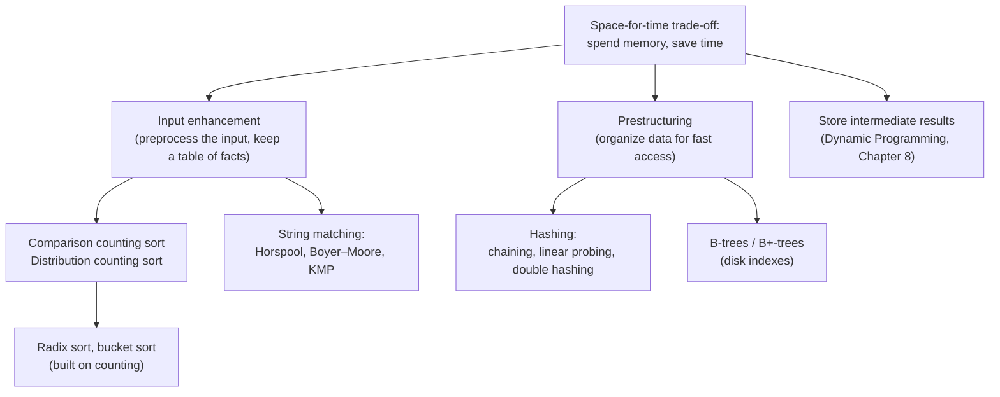
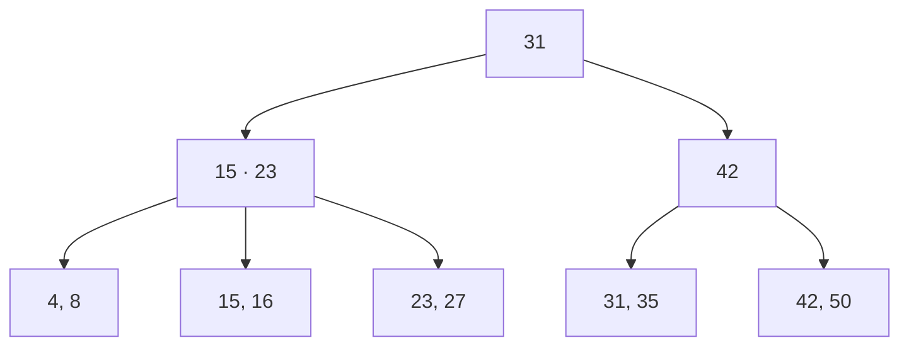

# Chapter 7 · Space-and-Time Trade-Offs

Almost every fast program you have ever used is fast because somebody decided to **spend memory to save time**. A search engine keeps an index so it never rereads the web; a database keeps a B-tree so it never scans the whole disk; your language's dictionary keeps a hash table so a lookup costs one probe instead of a thousand comparisons. This chapter turns that instinct into three concrete design moves — *input enhancement*, *prestructuring*, and *storing intermediate results* — and shows how each one produces a classic algorithm: counting sorts, radix and bucket sort, the Horspool, Boyer–Moore and Knuth–Morris–Pratt (KMP) string matchers, hashing, and B-trees. Once you can spot "I could precompute a table here," you will see this chapter everywhere.

🎮 **Simulations:** [Sorting Studio (counting / radix / bucket)](https://normansrule.github.io/algorithm-forge/sims/sorting-studio.html) · [String Match (Horspool, Boyer–Moore, KMP)](https://normansrule.github.io/algorithm-forge/sims/string-match.html) · [Hashing Lab](https://normansrule.github.io/algorithm-forge/sims/hashing.html) · [B-Tree Lab](https://normansrule.github.io/algorithm-forge/sims/b-tree.html)<br>
🏟️ **Arena problems:** [Chapter 7 set](https://normansrule.github.io/algorithm-forge/arena/?chapter=7)<br>
🐍 **Code:** [`ch07_space_time.py`](../../src/python/algoforge/ch07_space_time.py)<br>
📝 **Practice:** [practice folder](../../practice/)

---

## The big idea in 60 seconds

Time and memory are two currencies. Most of the time memory is the cheaper one, so we "buy" speed with it. There are three ways to do the buying:

1. **Input enhancement** — look at the input (or part of it) *once*, write down a small table of facts about it, and use those facts to skip work later. *Counting sorts* count keys before placing them; *string matchers* study the pattern before sliding it across the text.
2. **Prestructuring** — organize the data *before* anyone asks a question, so that every future question is cheap. *Hashing* and *B-trees* are the two giants here.
3. **Storing intermediate results** — solve each small subproblem once, write the answer in a table, and look it up instead of recomputing. That is **Dynamic Programming (DP)**, and it gets its own chapter ([Chapter 8](../08-dynamic-programming/README.md)).



The flip side also exists — spending time to save space (for example, compressing data) — but it is much rarer as a design technique. And sometimes you win on both at once: a sparse graph stored as adjacency lists is both smaller *and* faster to traverse than an adjacency matrix.

---

## Build Card 1 · Comparison Counting Sort

### 🎯 Problem in one sentence
Given an array `A[0..n-1]` of orderable items → return a new array `S` with the same items in nondecreasing order, by counting, for every item, how many items must come before it.

### 📖 Story
Picture six runners who finished a race but nobody wrote down the order. You ask every *pair* of runners, "who was faster?", and each time you put a tally mark next to the slower one. When you are done, a runner with 0 marks finished first, a runner with 3 marks had exactly 3 people ahead of them — so they stand in position 3. The tally sheet *is* the answer; you just read it off.

### 👀 See it
Open [Sorting Studio](https://normansrule.github.io/algorithm-forge/sims/sorting-studio.html) and pick *Comparison counting*. Watch the `Count` row: every comparison increments exactly one cell.

```
A      = [ 60  35  81  98  14  47 ]
                 each pair (i, j), i < j, is compared once
Count  = [  3   1   4   5   0   2 ]   ← "how many items go before me"
S      = [ 14  35  47  60  81  98 ]   ← S[Count[i]] = A[i]
```

### 🧱 Build it in blocks

**Block 1 — state.** One counter per element, all zero, plus an output array.

```
ALGORITHM ComparisonCountingSort(A[0..n-1])
    Count ← array(n, 0)
    S ← array(n, null)
```

**Block 2 — loop skeleton.** Visit every unordered pair `(i, j)` with `i < j` exactly once. (Run it as it stands: the
placeholder `print` lists each pair once. Block 3 replaces it.)

```
ALGORITHM ComparisonCountingSort(A[0..n-1])
    Count ← array(n, 0)
    S ← array(n, null)
    for i ← 0 to n - 2 do
        for j ← i + 1 to n - 1 do
            print A[i], A[j]            // placeholder: compare A[i] with A[j]
```

**Block 3 — the decision.** The larger of the two gets the tally (it has one more item in front of it).

```
            if A[i] < A[j] then
                Count[j] ← Count[j] + 1
            else
                Count[i] ← Count[i] + 1
```

**Block 4 — the return.** `Count[i]` is the final index of `A[i]`.

```
    for i ← 0 to n - 1 do
        S[Count[i]] ← A[i]
    return S
```

### ✋ Trace it by hand
Input `60, 35, 81, 98, 14, 47` (the course's Assignment 1 instance). Each row is the `Count` array after the outer pass `i` has finished all its `j` comparisons.

| after pass | Count[0] (60) | Count[1] (35) | Count[2] (81) | Count[3] (98) | Count[4] (14) | Count[5] (47) |
|---|---|---|---|---|---|---|
| start | 0 | 0 | 0 | 0 | 0 | 0 |
| i = 0 | 3 | 0 | 1 | 1 | 0 | 0 |
| i = 1 | 3 | 1 | 2 | 2 | 0 | 1 |
| i = 2 | 3 | 1 | 4 | 3 | 0 | 1 |
| i = 3 | 3 | 1 | 4 | 5 | 0 | 1 |
| i = 4 | 3 | 1 | 4 | 5 | 0 | 2 |

Pass `i = 0` compares 60 with 35, 81, 98, 14, 47: it beats 35, 14 and 47 (so `Count[0]` rises to 3) and loses to 81 and 98 (their counts rise to 1). Final placement: `S[3]=60, S[1]=35, S[4]=81, S[5]=98, S[0]=14, S[2]=47` → **14, 35, 47, 60, 81, 98**.

### 🔍 Is it stable? (the careful answer)
A sort is **stable** if equal keys leave in the same relative order they arrived in. Look at what happens when `A[i] = A[j]` with `i < j`: the test `A[i] < A[j]` is false, so the **else** branch fires and the *earlier* element `A[i]` gets the tally. The earlier copy is therefore pushed *behind* the later copy.

Try records `(3,a) (1,b) (3,c) (2,d) (3,e)`:

| record | (3,a) | (1,b) | (3,c) | (2,d) | (3,e) |
|---|---|---|---|---|---|
| Count with `<` (book / slide version) | 4 | 0 | 3 | 1 | 2 |
| Count with `≤` (one-character fix) | 2 | 0 | 3 | 1 | 4 |

With `<` the output is `(1,b) (2,d) (3,e) (3,c) (3,a)` — the three 3s come out in **exactly reversed** order. With `≤` it is `(1,b) (2,d) (3,a) (3,c) (3,e)` — stable.

**Conclusion.** The version in Levitin §7.1 and on the course slides (`if A[i] < A[j] then Count[j]++ else Count[i]++`) is **not stable** — the Assignment 1 answer is correct. It is not randomly unstable, either: it is deterministically *anti-stable*, reversing every group of equal keys. The reason is that for equal keys, `Count[i]` = (number of smaller items) + (number of equal items *to its right*). Changing `<` to `≤` credits the later copy instead, which makes it stable. (We checked both claims on 2,000 random arrays with duplicates.) It is also **not in place**: it needs the extra arrays `Count` and `S`.

### 💻 Code

```
ALGORITHM ComparisonCountingSort(A[0..n-1])
    // Sorts an array by comparison counting
    // Input: An array A[0..n-1] of orderable elements
    // Output: Array S[0..n-1] of A's elements sorted in nondecreasing order
    Count ← array(n, 0)
    for i ← 0 to n - 2 do
        for j ← i + 1 to n - 1 do
            if A[i] < A[j] then          // use ≤ here to make the sort stable
                Count[j] ← Count[j] + 1
            else
                Count[i] ← Count[i] + 1
    S ← array(n, null)
    for i ← 0 to n - 1 do
        S[Count[i]] ← A[i]
    return S
```

<details><summary>Python</summary>

```python
def comparison_counting_sort(a, stable=False):
    """Return a sorted copy of a. stable=True uses <= so equal keys keep their order."""
    n = len(a)
    count = [0] * n
    for i in range(n - 1):
        for j in range(i + 1, n):
            later_is_bigger = a[i] <= a[j] if stable else a[i] < a[j]
            if later_is_bigger:
                count[j] += 1
            else:
                count[i] += 1
    s = [None] * n
    for i in range(n):
        s[count[i]] = a[i]
    return s
```

</details>

<details><summary>Java</summary>

```java
static int[] comparisonCountingSort(int[] a) {
    int n = a.length;
    int[] count = new int[n];
    for (int i = 0; i < n - 1; i++)
        for (int j = i + 1; j < n; j++)
            if (a[i] < a[j]) count[j]++;   // use <= for a stable version
            else count[i]++;
    int[] s = new int[n];
    for (int i = 0; i < n; i++) s[count[i]] = a[i];
    return s;
}
```

</details>

### 🧮 Analyze it
- **Time:** the comparison runs once per pair: $\sum_{i=0}^{n-2}(n-1-i) = \frac{n(n-1)}{2} \in \Theta(n^2)$ in every case.
- **Moves:** only $n$ — each item is written once into `S`. That is its one virtue: when moving records is very expensive (huge records), counting first and moving once can pay off.
- **Space:** $\Theta(n)$ extra.
- **Correctness:** after all pairs are compared, `Count[i]` equals the number of items that are smaller than `A[i]` plus the number of equal items located after it. These values are all different and form exactly the set $\{0, 1, \dots, n-1\}$, so `S[Count[i]] ← A[i]` fills every slot once, in order.

### ⚠️ Common mistakes
- Believing it is stable "because it never swaps" — the tie rule decides, and the textbook tie rule reverses equal keys.
- Starting the inner loop at `j ← 0` — every pair gets counted twice and the indices overflow.
- Sorting in place with `A[Count[i]] ← A[i]` — you overwrite items you have not placed yet.

### 🔁 Variations / real software
Nobody ships this sort for speed, but the idea "compute each item's final rank, then write it once" appears in parallel sorting (every rank can be computed independently, so $n^2$ processors finish in constant time) and in the next card, which fixes the quadratic cost when keys come from a small range.

---

## Build Card 2 · Distribution Counting Sort

### 🎯 Problem in one sentence
Given `A[0..n-1]` whose keys are integers in a small known range `[l, u]` → return the items sorted, **stably**, in linear time, without ever comparing two keys.

### 📖 Story
A teacher returns graded quizzes (grades 0–3). She first counts: two 0s, one 1, three 2s, two 3s. So the 0s occupy slots 0–1, the 1 occupies slot 2, the 2s occupy slots 3–5 and the 3s occupy slots 6–7. Now she walks the pile once and drops each quiz straight into its slot. No quiz is ever compared with another quiz.

### 👀 See it
In [Sorting Studio](https://normansrule.github.io/algorithm-forge/sims/sorting-studio.html) choose *Distribution counting*. Watch the `D` array turn from frequencies into "last slot for this key" and count down as the right-to-left pass places records.

```
keys  0  1  2  3
freq  2  1  3  2         ← how many of each key
dist  2  3  6  8         ← running totals = one past the last slot for that key
         slots:  [0 1][2][3 4 5][6 7]
```

### 🧱 Build it in blocks

**Block 1 — state.** One counter per possible key value.

```
ALGORITHM DistributionCountingSort(A[0..n-1], l, u)
    D ← array(u - l + 1, 0)
    S ← array(n, null)
```

**Block 2 — count frequencies, then turn them into running totals.**

```
    for i ← 0 to n - 1 do
        D[A[i] - l] ← D[A[i] - l] + 1
    for j ← 1 to u - l do
        D[j] ← D[j - 1] + D[j]
```

**Block 3 — the placement rule.** Walk the input **right to left**; each item goes into the last free slot of its key's block.

```
    for i ← n - 1 downto 0 do
        j ← A[i] - l
        S[D[j] - 1] ← A[i]
        D[j] ← D[j] - 1
```

**Block 4 — return.**

```
    return S
```

### ✋ Trace it by hand
Records (grade, name): `(2,Ava) (0,Ben) (3,Cy) (2,Dee) (0,Eli) (1,Fay) (3,Gus) (2,Hal)`, range `[0, 3]`.

Frequencies `D = [2, 1, 3, 2]`; running totals `D = [2, 3, 6, 8]`.

| i | record | key j | slot `D[j]-1` | D after decrement |
|---|---|---|---|---|
| 7 | (2,Hal) | 2 | 5 | [2, 3, 5, 8] |
| 6 | (3,Gus) | 3 | 7 | [2, 3, 5, 7] |
| 5 | (1,Fay) | 1 | 2 | [2, 2, 5, 7] |
| 4 | (0,Eli) | 0 | 1 | [1, 2, 5, 7] |
| 3 | (2,Dee) | 2 | 4 | [1, 2, 4, 7] |
| 2 | (3,Cy) | 3 | 6 | [1, 2, 4, 6] |
| 1 | (0,Ben) | 0 | 0 | [0, 2, 4, 6] |
| 0 | (2,Ava) | 2 | 3 | [0, 2, 3, 6] |

Result: `(0,Ben) (0,Eli) (1,Fay) (2,Ava) (2,Dee) (2,Hal) (3,Cy) (3,Gus)` — Ava, Dee, Hal are still in their original order: **stable**.

**Why right to left?** The last 2 in the input (Hal) should be the last 2 in the output, and it is the first 2 we meet going right to left, so it takes the highest slot. If you walked left to right with the same "last slot" rule you would reverse equal keys (anti-stable again). Alternatively, walk left to right but first convert `D` into "first slot of each key" (shift the running totals right by one).

### 💻 Code

```
ALGORITHM DistributionCountingSort(A[0..n-1], l, u)
    // Sorts integers in the range [l, u] by distribution counting (stable)
    // Input: Array A[0..n-1] with l ≤ A[i] ≤ u
    // Output: Array S[0..n-1] of A's elements in nondecreasing order
    D ← array(u - l + 1, 0)
    for i ← 0 to n - 1 do
        D[A[i] - l] ← D[A[i] - l] + 1
    for j ← 1 to u - l do
        D[j] ← D[j - 1] + D[j]
    S ← array(n, null)
    for i ← n - 1 downto 0 do
        j ← A[i] - l
        S[D[j] - 1] ← A[i]
        D[j] ← D[j] - 1
    return S
```

<details><summary>Python</summary>

```python
def distribution_counting_sort(a, lo, hi, key=lambda x: x):
    """Stable sort of items whose integer key(x) lies in [lo, hi]."""
    d = [0] * (hi - lo + 1)
    for x in a:
        d[key(x) - lo] += 1
    for j in range(1, hi - lo + 1):
        d[j] += d[j - 1]
    s = [None] * len(a)
    for x in reversed(a):          # right to left keeps it stable
        j = key(x) - lo
        d[j] -= 1
        s[d[j]] = x
    return s
```

</details>

<details><summary>Java</summary>

```java
static int[] distributionCountingSort(int[] a, int lo, int hi) {
    int[] d = new int[hi - lo + 1];
    for (int x : a) d[x - lo]++;
    for (int j = 1; j < d.length; j++) d[j] += d[j - 1];
    int[] s = new int[a.length];
    for (int i = a.length - 1; i >= 0; i--) {
        int j = a[i] - lo;
        s[--d[j]] = a[i];
    }
    return s;
}
```

</details>

### 🧮 Analyze it
- **Time:** two passes over the input plus one pass over the range: $\Theta(n + k)$ where $k = u - l + 1$. When $k \in O(n)$ that is **linear**.
- **Space:** $\Theta(n + k)$.
- **Why it beats the $\Omega(n \log n)$ lower bound:** that bound is for algorithms that learn about the order *only by comparing keys*. This algorithm never compares keys; it uses them as array indices, which is extra information.
- **Correctness:** after the running-total pass, `D[j]` is one past the last slot reserved for key `l + j`; each placement fills that slot and moves the boundary down, so every key's block is filled exactly, from the top.

### ⚠️ Common mistakes
- Using it when the range is huge (keys up to $10^9$): the `D` array alone is gigabytes. Use radix sort instead.
- Forgetting the `- l` offset when keys don't start at 0.
- Walking left to right with the "last slot" rule — silently destroys stability, which radix sort depends on.

### 🔁 Variations / real software
Counting sort is the inner engine of radix sort, of suffix-array construction, and of histogram-based algorithms in image processing (8-bit pixel values have only 256 possible keys).

---

## Build Card 3 · Radix Sort (Least Significant Digit first)

### 🎯 Problem in one sentence
Given `n` integers with at most `d` digits → sort them by running a **stable** counting sort once per digit, from the Least Significant Digit (LSD) to the most significant.

### 📖 Story
The old punch-card sorting machines had ten bins. An operator fed the whole deck through sorting by the last column, stacked the bins in order 0–9, fed the deck again on the next column, and so on. After the last (leftmost) column, the deck was sorted — like magic, as long as every pass kept ties in order.

### 👀 See it
In [Sorting Studio](https://normansrule.github.io/algorithm-forge/sims/sorting-studio.html) choose *Radix (LSD)* and watch the digit being used light up in each number.

### 🧱 Build it in blocks

**Block 1 — state.** Which digit are we on? `place` = 1, 10, 100, …

```
ALGORITHM RadixSortLSD(A[0..n-1], d)
    place ← 1
```

**Block 2 — loop skeleton.** One pass per digit.

```
    for pass ← 1 to d do
        // stable sort of A by digit (A[i] div place) mod 10
        place ← place * 10
```

**Block 3 — the pass itself** is distribution counting with key = the current digit (range 0..9).

```
        A ← CountingSortByDigit(A, place)
```

**Block 4 — return** `A` after the last pass.

### ✋ Trace it by hand
Input `312, 507, 123, 918, 105, 311, 824, 530`.

| pass (digit) | result after the stable pass |
|---|---|
| ones | 530, 311, 312, 123, 824, 105, 507, 918 |
| tens | 105, 507, 311, 312, 918, 123, 824, 530 |
| hundreds | 105, 123, 311, 312, 507, 530, 824, 918 |

Look at 311 and 312 in the tens pass: both have tens digit 1, and they stay in the order the ones pass left them (311 before 312). That tie-keeping is exactly why LSD radix sort works.

### 💻 Code

```
ALGORITHM RadixSortLSD(A[0..n-1], d)
    // Sorts nonnegative integers with at most d decimal digits
    place ← 1
    for pass ← 1 to d do
        A ← CountingSortByDigit(A, place)
        place ← place * 10
    return A

ALGORITHM CountingSortByDigit(A[0..n-1], place)
    // Stable distribution counting on the digit (A[i] div place) mod 10
    D ← array(10, 0)
    for i ← 0 to n - 1 do
        digit ← (A[i] div place) mod 10
        D[digit] ← D[digit] + 1
    for j ← 1 to 9 do
        D[j] ← D[j - 1] + D[j]
    S ← array(n, null)
    for i ← n - 1 downto 0 do
        digit ← (A[i] div place) mod 10
        S[D[digit] - 1] ← A[i]
        D[digit] ← D[digit] - 1
    return S
```

<details><summary>Python</summary>

```python
def radix_sort_lsd(a, base=10):
    """Sort nonnegative integers. Each pass is a stable counting sort on one digit."""
    if not a:
        return a
    place, biggest = 1, max(a)
    while biggest // place > 0:
        d = [0] * base
        for x in a:
            d[(x // place) % base] += 1
        for j in range(1, base):
            d[j] += d[j - 1]
        out = [0] * len(a)
        for x in reversed(a):
            dig = (x // place) % base
            d[dig] -= 1
            out[d[dig]] = x
        a, place = out, place * base
    return a
```

</details>

<details><summary>Java</summary>

```java
static int[] radixSortLSD(int[] a) {
    int biggest = 0;
    for (int x : a) biggest = Math.max(biggest, x);
    for (long place = 1; biggest / place > 0; place *= 10) {
        int[] d = new int[10];
        for (int x : a) d[(int) (x / place % 10)]++;
        for (int j = 1; j < 10; j++) d[j] += d[j - 1];
        int[] out = new int[a.length];
        for (int i = a.length - 1; i >= 0; i--) {
            int dig = (int) (a[i] / place % 10);
            out[--d[dig]] = a[i];
        }
        a = out;
    }
    return a;
}
```

</details>

### 🧮 Analyze it
- **Time:** $\Theta(d(n + b))$ for $d$ digits in base $b$. For fixed-width keys (32-bit integers sorted in base $2^8$ = four passes) that is linear in $n$.
- **Space:** $\Theta(n + b)$.
- **Correctness (loop invariant):** after pass $t$, the array is sorted by the last $t$ digits. Pass $t+1$ sorts by digit $t+1$; items with *different* digit $t+1$ are now correctly ordered, and items with the *same* digit $t+1$ keep their previous order (stability), which was correct for the last $t$ digits. So after pass $t+1$ the array is sorted by the last $t+1$ digits.

### ⚠️ Common mistakes
- Using an unstable pass (for example, the textbook comparison counting sort) — the invariant collapses.
- Sorting most-significant digit first *with the LSD loop* — you get a sort by the last pass only.
- Forgetting negative numbers (offset them, or sort by sign separately).

### 🔁 Variations / real software
- **Most Significant Digit (MSD) radix sort** goes the other way: split into 10 buckets by the first digit, then *recursively* sort each bucket by the next digit, and concatenate. It does not need stability, it can stop early on short strings, and it is the natural choice for sorting strings (it is how many suffix-array and string-sorting libraries work).
- Radix sort is a workhorse for sorting keys on graphics processors, where its fixed, data-independent passes parallelize well.

---

## Build Card 4 · Bucket Sort

### 🎯 Problem in one sentence
Given `n` real numbers drawn roughly **uniformly** from `[0, 1)` → sort them in expected linear time by dropping each into one of `n` equal-width buckets, sorting each (tiny) bucket, and concatenating.

### 📖 Story
Sorting a stack of exam papers by score: you lay out ten trays labelled 0–9, 10–19, …, 90–99 and drop each paper in its tray. Each tray holds only a few papers, so sorting inside a tray is quick, and reading the trays left to right gives the whole ranking.

### 👀 See it
[Sorting Studio](https://normansrule.github.io/algorithm-forge/sims/sorting-studio.html) → *Bucket sort*. Then type a skewed input (every value below 0.2) to see what happens when the uniform assumption fails.

### 🧱 Build it in blocks

**Block 1 — state:** `n` empty buckets.

```
ALGORITHM BucketSort(A[0..n-1])
    B ← array(n, null)
    for i ← 0 to n - 1 do
        B[i] ← array(0, 0)          // an empty list
```

**Block 2 — scatter:** item `x` goes to bucket `⌊n·x⌋`.

```
    for i ← 0 to n - 1 do
        append(B[floor(n * A[i])], A[i])
```

**Block 3 — sort each bucket** (insertion sort is great for tiny lists).

```
    for i ← 0 to n - 1 do
        InsertionSort(B[i])
```

**Block 4 — gather:** concatenate buckets 0, 1, …, n−1.

```
    R ← array(0, 0)
    for i ← 0 to n - 1 do
        for each x in B[i] do
            append(R, x)
    return R
```

### ✋ Trace it by hand
`A = 0.61, 0.07, 0.33, 0.95, 0.29, 0.66, 0.12, 0.38`, so `n = 8` and bucket index = `⌊8x⌋`.

| bucket | range | contents (arrival order) | after sorting |
|---|---|---|---|
| 0 | [0, .125) | .07, .12 | .07, .12 |
| 1 | [.125, .25) | — | — |
| 2 | [.25, .375) | .33, .29 | .29, .33 |
| 3 | [.375, .5) | .38 | .38 |
| 4 | [.5, .625) | .61 | .61 |
| 5 | [.625, .75) | .66 | .66 |
| 6 | [.75, .875) | — | — |
| 7 | [.875, 1) | .95 | .95 |

Concatenated: **.07, .12, .29, .33, .38, .61, .66, .95**.

### 💻 Code
(Forge Pseudocode: the four blocks above, assembled.)

<details><summary>Python</summary>

```python
def bucket_sort(a):
    """Sort floats in [0, 1). Expected O(n) if the input is roughly uniform."""
    n = len(a)
    buckets = [[] for _ in range(n)]
    for x in a:
        buckets[int(n * x)].append(x)
    out = []
    for b in buckets:
        for i in range(1, len(b)):          # insertion sort inside the bucket
            v, j = b[i], i - 1
            while j >= 0 and b[j] > v:
                b[j + 1] = b[j]
                j -= 1
            b[j + 1] = v
        out.extend(b)
    return out
```

</details>

<details><summary>Java</summary>

```java
static double[] bucketSort(double[] a) {
    int n = a.length;
    List<List<Double>> buckets = new ArrayList<>();
    for (int i = 0; i < n; i++) buckets.add(new ArrayList<>());
    for (double x : a) buckets.get((int) (n * x)).add(x);
    double[] out = new double[n];
    int k = 0;
    for (List<Double> b : buckets) {
        Collections.sort(b);               // tiny lists: any simple sort is fine
        for (double x : b) out[k++] = x;
    }
    return out;
}
```

</details>

### 🧮 Analyze it
- **Expected time:** $\Theta(n)$ when inputs are independent and uniform — if bucket $i$ receives $n_i$ items, then $E[n_i^2] = 2 - 1/n$, so the $n$ insertion sorts together cost $O(n)$ on average.
- **Worst case:** everything lands in one bucket → the insertion sort costs $\Theta(n^2)$.
- **Space:** $\Theta(n)$.

### ⚠️ Common mistakes
- Using it on skewed data (all values in [0, 0.1)) — you pay the worst case.
- Values equal to exactly 1.0 → index `n`, out of bounds. Clamp or use `[0, 1)` strictly.

### 🔁 Variations / real software
Histogram-based "bucketing" is how databases estimate query selectivity, and a two-level bucket structure is how many external (disk-based) sorts partition data before sorting each piece in memory.

---

## String matching with input enhancement

**The problem.** Find the first place a *pattern* `P` of `m` characters occurs in a *text* `T` of `n` characters. Brute force (Chapter 3) aligns the pattern at every position and compares left to right: $O(nm)$ in the worst case. All three algorithms below *preprocess the pattern* into a small table so that, after a mismatch, the pattern can jump forward more than one position without ever skipping a real match.

| algorithm | compares within an alignment | preprocessing table(s) | worst case (find first) | typical |
|---|---|---|---|---|
| Brute force | left → right | none | $O(nm)$ | fast on natural text |
| Horspool | right → left | shift table `t(c)` | $O(nm)$ | often sublinear, ~$n/m$ alignments |
| Boyer–Moore | right → left | bad-symbol `t1` + good-suffix `d2` | $O(n + m)$ | sublinear on long patterns |
| KMP | left → right, never backs up in `T` | failure table LPS (Longest Proper Prefix that is also a Suffix) | $O(n + m)$ | linear, good for streams |

---

## Build Card 5 · Horspool's Algorithm

### 🎯 Problem in one sentence
Given pattern `P[0..m-1]` and text `T[0..n-1]` → return the index of the first occurrence of `P` in `T` (or −1), comparing right to left and shifting by a precomputed table indexed by the text character under the pattern's last position.

### 📖 Story
You are sliding a stencil that spells BARBER along a long banner. You always peek at the banner letter under the stencil's **last** letter. If that letter is an S, there is no S anywhere in BARBER, so the stencil can leap its full length. If it's a B, you slide just far enough to put the stencil's rightmost earlier B on top of it. The peek-then-leap rule is the whole algorithm.

### 👀 See it
[String Match](https://normansrule.github.io/algorithm-forge/sims/string-match.html) → *Horspool*. Watch for the text character under the pattern's last position: it alone decides the shift.

Shift table for `BARBER` (m = 6). Only the first m − 1 = 5 characters `B A R B E` contribute; the entry is the distance from the character's **rightmost** occurrence among them to the last position:

| c | B | A | R | E | any other |
|---|---|---|---|---|---|
| t(c) | 2 | 4 | 3 | 1 | 6 |

(`R` is 3, not 0: the final R is ignored, and the earlier R sits 3 places from the end.)

### 🧱 Build it in blocks

**Block 1 — the table.**

```
ALGORITHM ShiftTable(P[0..m-1])
    // A map from character to shift. Characters that are not stored shift by the full m:
    // look shifts up with get(Table, c, m)
    Table ← map()
    for j ← 0 to m - 2 do
        Table[P[j]] ← m - 1 - j        // later occurrences overwrite earlier ones
    return Table
```

(The book fills an array with one entry per character of the alphabet, all set to `m` first. A map with the
default `m` gives the same answers without listing the alphabet.)

**Block 2 — loop skeleton.** `i` is the text index under the pattern's last character.

```
ALGORITHM HorspoolMatching(P[0..m-1], T[0..n-1])
    Table ← ShiftTable(P)
    i ← m - 1
    while i ≤ n - 1 do
        i ← i + 1                      // placeholder: Block 3 compares right to left, then shifts
```

**Block 3 — the decision.** Count matches `k` from the right; on a full match return, otherwise shift by the table entry for `T[i]` (the character under the *last* pattern position, even if it matched).

```
        k ← 0
        while k ≤ m - 1 and P[m - 1 - k] = T[i - k] do
            k ← k + 1
        if k = m then
            return i - m + 1
        else
            i ← i + get(Table, T[i], m)
```

**Block 4 — not found.**

```
    return -1
```

### ✋ Trace it by hand
Text `A_RARE_BARBELL_BY_THE_BARBER_SHOP` (n = 33), pattern `BARBER`.

```
A_RARE_BARBELL_BY_THE_BARBER_SHOP
BARBER                               last char E ≠ R          t(E)=1 → shift 1
 BARBER                              '_' ≠ R                  t(_)=6 → shift 6
       BARBER                        L ≠ R                    t(L)=6 → shift 6
             BARBER                  T ≠ R                    t(T)=6 → shift 6
                   BARBER            R = R, then A ≠ E        t(R)=3 → shift 3
                      BARBER         all 6 match → found at index 22
```

| alignment | text under pattern | comparisons | char under last position | shift |
|---|---|---|---|---|
| 0 | `A_RARE` | 1 | E | 1 |
| 1 | `_RARE_` | 1 | _ | 6 |
| 7 | `BARBEL` | 1 | L | 6 |
| 13 | `L_BY_T` | 1 | T | 6 |
| 19 | `HE_BAR` | 2 | R | 3 |
| 22 | `BARBER` | 6 | — | match |

**12 character comparisons** versus **35** for brute force on the same input.

### 💻 Code

```
ALGORITHM HorspoolMatching(P[0..m-1], T[0..n-1])
    // Implements Horspool's string-matching algorithm
    // Output: index of the left end of the first matching substring, or -1
    Table ← ShiftTable(P)
    i ← m - 1
    while i ≤ n - 1 do
        k ← 0
        while k ≤ m - 1 and P[m - 1 - k] = T[i - k] do
            k ← k + 1
        if k = m then
            return i - m + 1
        else
            i ← i + get(Table, T[i], m)
    return -1
```

<details><summary>Python</summary>

```python
def shift_table(p):
    m = len(p)
    return {p[j]: m - 1 - j for j in range(m - 1)}   # missing chars → m

def horspool(p, t):
    m, n = len(p), len(t)
    table = shift_table(p)
    i = m - 1
    while i <= n - 1:
        k = 0
        while k < m and p[m - 1 - k] == t[i - k]:
            k += 1
        if k == m:
            return i - m + 1
        i += table.get(t[i], m)
    return -1
```

</details>

<details><summary>Java</summary>

```java
static int horspool(String p, String t) {
    int m = p.length(), n = t.length();
    Map<Character, Integer> table = new HashMap<>();
    for (int j = 0; j < m - 1; j++) table.put(p.charAt(j), m - 1 - j);
    int i = m - 1;
    while (i <= n - 1) {
        int k = 0;
        while (k < m && p.charAt(m - 1 - k) == t.charAt(i - k)) k++;
        if (k == m) return i - m + 1;
        i += table.getOrDefault(t.charAt(i), m);
    }
    return -1;
}
```

</details>

### 🧮 Analyze it
- **Preprocessing:** $\Theta(m + |\Sigma|)$ time and $\Theta(|\Sigma|)$ space, where $\Sigma$ is the alphabet.
- **Best case:** every alignment fails on its first comparison with a character not in the pattern → shifts of $m$ → about $n/m$ comparisons: *sublinear*.
- **Worst case:** $\Theta(nm)$. Example: text `000…0`, pattern `1000…0` (m − 1 zeros): each alignment matches m − 1 characters before failing, then shifts by 1.
- **Average on random text:** $\Theta(n)$ and in practice often much better than brute force.
- **Why the shift is safe:** any smaller shift would place some pattern character on top of the text character `c = T[i]` that is not equal to it — because `t(c)` aligns the *rightmost* possible `c` among the first `m−1` characters.

### ⚠️ Common mistakes
- Including the last pattern character when building the table (would give `t(R) = 0` for BARBER → infinite loop).
- Shifting by the table entry of the *mismatched* character instead of the character under the pattern's last position — that's Boyer–Moore's rule, not Horspool's.
- Comparing left to right inside an alignment (legal, but then you lose the reasoning that makes the shifts safe in Boyer–Moore).

### 🔁 Variations / real software
Horspool-style skip loops are inside many "find this literal string" routines. CPython's `str.find` historically used a simplified Boyer–Moore–Horspool/Sunday hybrid ("fastsearch"), and the Unix tool `grep` uses Boyer–Moore-family searches for fixed strings.

---

## Build Card 6 · Boyer–Moore Algorithm

### 🎯 Problem in one sentence
Same input and output as Horspool, but after a mismatch that follows `k > 0` matches, shift by the larger of two safe shifts: the **bad-symbol** shift `d1` and the **good-suffix** shift `d2(k)`.

### 📖 Story
Horspool only remembers "what letter was under my last position." Boyer–Moore also remembers "which ending of the pattern I already matched." If you already matched the ending `AB` of `BAOBAB`, the next alignment must put *another* copy of `AB` (or a matching prefix) over that spot — and `BAOBAB` has no other `AB`, so you can jump much farther.

### 👀 See it
[String Match](https://normansrule.github.io/algorithm-forge/sims/string-match.html) → *Boyer–Moore*: for every shift, ask yourself which rule produced it — the bad-symbol shift `d1` or the good-suffix shift `d2`.

**The two rules, precisely.** Suppose `k` characters matched (right to left) and the next text character `c` mismatched.

- **Bad-symbol shift:** $d_1 = \max(t_1(c) - k,\ 1)$, where $t_1$ is exactly Horspool's table. (We subtract `k` because `c` sits `k` places left of the last position.)
- **Good-suffix shift:** $d_2(k)$ = distance from the matched suffix of length `k` to its rightmost other occurrence in the pattern **that is not preceded by the same character** as the suffix; if none exists, align the longest suffix of that suffix which is also a *prefix* of the pattern; if even that fails, $d_2(k) = m$.
- **Shift:** if $k = 0$ use $d_1$ (= $t_1(c)$); otherwise use $d = \max(d_1, d_2(k))$.

Good-suffix tables (all computed from the definition and checked in Python):

| k | 1 | 2 | 3 | 4 | 5 |
|---|---|---|---|---|---|
| `BAOBAB` | 2 | 5 | 5 | 5 | 5 |
| `ABCBAB` | 2 | 4 | 4 | 4 | 4 |
| `WOWWOW` (course slide) | 2 | 5 | 3 | 3 | 3 |

For `BAOBAB` with `k = 1` (suffix `B`, preceded by `A`): the other `B` at index 3 is preceded by `O` ≠ `A`, so align it: shift 2. With `k = 2` (suffix `AB`): no other `AB` exists; the longest part of `AB` that is also a prefix is `B`, which needs a shift of 5.

### 🧱 Build it in blocks

**Block 1 — tables:** `t1 ← ShiftTable(P)` (Horspool's) and `d2 ← GoodSuffixTable(P)`.

**Block 2 — loop skeleton:** identical to Horspool (`i` = text index under the pattern's last character).

**Block 3 — the decision:**

```
        if k = m then
            return i - m + 1
        c ← T[i - k]                         // the text character that mismatched
        d1 ← max(get(t1, c, m) - k, 1)
        if k = 0 then
            i ← i + d1
        else
            i ← i + max(d1, d2[k])
```

**Block 4 — return −1** when the text runs out.

### ✋ Trace it by hand
Text `KIDS_AB_BAB_BAOBAB` (n = 18), pattern `BAOBAB`. `t1`: B → 2, A → 1, O → 3, others → 6.

```
KIDS_AB_BAB_BAOBAB
BAOBAB                 k=0, c=A: d1 = t1(A) = 1                      → shift 1
 BAOBAB                k=2 (AB matched), c='_': d1 = max(6-2,1) = 4,
                       d2(2) = 5                                     → shift 5  (good suffix wins)
      BAOBAB           k=0, c='_': d1 = 6                            → shift 6
            BAOBAB     all 6 match → found at index 12
```

Boyer–Moore: **4 alignments, 11 comparisons.** Horspool on the same input needs 7 alignments and 19 comparisons (its shifts after the partial matches are all 2); brute force needs 22.

### 💻 Code

```
ALGORITHM BoyerMoore(P[0..m-1], T[0..n-1])
    t1 ← ShiftTable(P)                  // Horspool's table (paste ShiftTable from above)
    d2 ← GoodSuffixTable(P)             // d2[k] for k = 1..m-1
    i ← m - 1
    while i ≤ n - 1 do
        k ← 0
        while k ≤ m - 1 and P[m - 1 - k] = T[i - k] do
            k ← k + 1
        if k = m then
            return i - m + 1
        d1 ← max(get(t1, T[i - k], m) - k, 1)
        if k = 0 then
            i ← i + d1
        else
            i ← i + max(d1, d2[k])
    return -1

ALGORITHM GoodSuffixTable(P[0..m-1])
    // d2[k] for k = 1..m-1, straight from the definition (Θ(m³), fine for teaching)
    d2 ← array(m, 0)                    // d2[0] is unused
    for k ← 1 to m - 1 do
        s ← 1
        while not SafeShift(P, k, s) do  // the smallest safe shift wins
            s ← s + 1
        d2[k] ← s
    return d2

ALGORITHM SafeShift(P[0..m-1], k, s)
    // After matching the last k characters, can the pattern move s places without skipping a match?
    for q ← m - k to m - 1 do            // the matched suffix must still agree where it overlaps
        if q - s ≥ 0 and P[q - s] ≠ P[q] then
            return false
    q ← m - k - 1 - s                    // the character that would sit on the mismatch position
    if q ≥ 0 and P[q] = P[m - k - 1] then
        return false                     // the same character would mismatch again
    return true
```

<details><summary>Python</summary>

```python
def good_suffix_table(p):
    """d2[k], k = 1..m-1, straight from the definition (cubic, fine for teaching)."""
    m = len(p)
    d2 = {}
    for k in range(1, m):
        for s in range(1, m + 1):                     # smallest safe shift wins
            ok = all(q - s < 0 or p[q - s] == p[q] for q in range(m - k, m))
            q = m - k - 1 - s                         # char that would sit on the mismatch
            if ok and q >= 0 and p[q] == p[m - k - 1]:
                ok = False                            # same char would mismatch again
            if ok:
                d2[k] = s
                break
    return d2

def boyer_moore(p, t):
    m, n = len(p), len(t)
    t1 = {p[j]: m - 1 - j for j in range(m - 1)}
    d2 = good_suffix_table(p)
    i = m - 1
    while i <= n - 1:
        k = 0
        while k < m and p[m - 1 - k] == t[i - k]:
            k += 1
        if k == m:
            return i - m + 1
        d1 = max(t1.get(t[i - k], m) - k, 1)
        i += d1 if k == 0 else max(d1, d2[k])
    return -1
```

</details>

<details><summary>Java</summary>

```java
static int[] goodSuffixTable(String p) {
    int m = p.length();
    int[] d2 = new int[m];                       // d2[k] for k = 1..m-1
    for (int k = 1; k < m; k++) {
        for (int s = 1; s <= m; s++) {
            boolean ok = true;
            for (int q = m - k; q < m && ok; q++)
                if (q - s >= 0 && p.charAt(q - s) != p.charAt(q)) ok = false;
            int q = m - k - 1 - s;
            if (ok && q >= 0 && p.charAt(q) == p.charAt(m - k - 1)) ok = false;
            if (ok) { d2[k] = s; break; }
        }
    }
    return d2;
}

static int boyerMoore(String p, String t) {
    int m = p.length(), n = t.length();
    Map<Character, Integer> t1 = new HashMap<>();
    for (int j = 0; j < m - 1; j++) t1.put(p.charAt(j), m - 1 - j);
    int[] d2 = goodSuffixTable(p);
    int i = m - 1;
    while (i <= n - 1) {
        int k = 0;
        while (k < m && p.charAt(m - 1 - k) == t.charAt(i - k)) k++;
        if (k == m) return i - m + 1;
        int d1 = Math.max(t1.getOrDefault(t.charAt(i - k), m) - k, 1);
        i += (k == 0) ? d1 : Math.max(d1, d2[k]);
    }
    return -1;
}
```

</details>

### 🧮 Analyze it
- **Preprocessing:** the good-suffix table can be built in $O(m)$ with a suffix-border trick (our teaching version above is cubic but obviously correct).
- **Search:** best case about $n/m$ comparisons. For finding the *first* occurrence the worst case is linear, $O(n + m)$ (Cole proved at most about $3n$ comparisons for aperiodic patterns); reporting *all* occurrences stays linear with Galil's extra rule.
- **Safety:** each of `d1` and `d2` is individually safe (never skips a match), so their maximum is safe.

### ⚠️ Common mistakes
- Forgetting the `max(…, 1)` in `d1` — `t1(c) − k` can be zero or negative, which would move the pattern backwards.
- Using `d2` when `k = 0` (it is undefined there).
- Ignoring the "not preceded by the same character" clause — you get a correct but weaker (smaller) shift table.

### 🔁 Variations / real software
Boyer–Moore and its descendants power fast literal search in text editors and `grep`. For many patterns at once, the Aho–Corasick automaton (a multi-pattern cousin of KMP) is used instead, for example in intrusion detection systems and virus scanners.

---

## Build Card 7 · Knuth–Morris–Pratt (KMP)

### 🎯 Problem in one sentence
Given `P` and `T` → find occurrences of `P` scanning `T` strictly left to right, **never moving backward in the text**, using a table `LPS` of the Longest Proper Prefix of `P[0..i]` that is also a Suffix of it.

### 📖 Story
You are reading a stream of characters over a network and cannot rewind. You've matched `ABAB` of `ABABCABAB` and the next character is wrong. Instead of starting over, you notice that the last `AB` you read is also the pattern's first `AB` — so you already hold 2 matched characters and simply continue from there. `LPS` records, for every prefix of the pattern, "how much of me can I keep after a mismatch."

### 👀 See it
[String Match](https://normansrule.github.io/algorithm-forge/sims/string-match.html) → *KMP*. Notice that the text pointer only ever moves right; only the pattern pointer falls back.

`LPS` for `ababaca` (course slide) and for our pattern `ABABCABAB`:

| index | 0 | 1 | 2 | 3 | 4 | 5 | 6 | 7 | 8 |
|---|---|---|---|---|---|---|---|---|---|
| `ababaca` | a | b | a | b | a | c | a | | |
| LPS | 0 | 0 | 1 | 2 | 3 | 0 | 1 | | |
| `ABABCABAB` | A | B | A | B | C | A | B | A | B |
| LPS | 0 | 0 | 1 | 2 | 0 | 1 | 2 | 3 | 4 |

`LPS[8] = 4` because `ABAB` is both a prefix and a suffix of `ABABCABAB`, and no longer proper prefix is.

### 🧱 Build it in blocks

**Block 1 — state:** the LPS array, and `k` = length of the current border (prefix-that-is-also-suffix).

```
ALGORITHM BuildLPS(P[0..m-1])
    LPS ← array(m, 0)
    k ← 0
```

**Block 2 — loop skeleton:** extend one character at a time.

```
    for i ← 1 to m - 1 do
        // try to extend the border of P[0..i-1] by P[i]
```

**Block 3 — the decision:** if `P[i]` doesn't extend the current border, fall back to the next-shorter border `LPS[k-1]`; if it does, grow by one.

```
        while k > 0 and P[i] ≠ P[k] do
            k ← LPS[k - 1]
        if P[i] = P[k] then
            k ← k + 1
        LPS[i] ← k
```

**Block 4 — return LPS**, then search with the *same* fallback logic, where `j` = number of pattern characters currently matched:

```
ALGORITHM KMPSearch(P[0..m-1], T[0..n-1])
    LPS ← BuildLPS(P)
    j ← 0
    for i ← 0 to n - 1 do
        while j > 0 and T[i] ≠ P[j] do
            j ← LPS[j - 1]
        if T[i] = P[j] then
            j ← j + 1
        if j = m then
            return i - m + 1
    return -1

ALGORITHM BuildLPS(P[0..m-1])
    // Blocks 1–4 put together
    LPS ← array(m, 0)
    k ← 0
    for i ← 1 to m - 1 do
        while k > 0 and P[i] ≠ P[k] do
            k ← LPS[k - 1]
        if P[i] = P[k] then
            k ← k + 1
        LPS[i] ← k
    return LPS
```

### ✋ Trace it by hand
**Building LPS for `ABABCABAB`:**

| i | P[i] | k before | fallbacks | P[i] = P[k]? | LPS[i] |
|---|---|---|---|---|---|
| 1 | B | 0 | — | B vs A: no | 0 |
| 2 | A | 0 | — | A vs A: yes | 1 |
| 3 | B | 1 | — | B vs B: yes | 2 |
| 4 | C | 2 | k ← LPS[1] = 0 | C vs A: no | 0 |
| 5 | A | 0 | — | yes | 1 |
| 6 | B | 1 | — | yes | 2 |
| 7 | A | 2 | — | yes | 3 |
| 8 | B | 3 | — | yes | 4 |

**Searching** `T = ABABDABABCABABCABAB` (n = 19):

- `i = 0..3`: `ABAB` matches, `j = 4`.
- `i = 4`: `D ≠ P[4] = C` → `j ← LPS[3] = 2`; `D ≠ P[2] = A` → `j ← LPS[1] = 0`; `D ≠ A` → move on.
- `i = 5..13`: `ABABCABAB` matches → **occurrence at index 5**; continuing for more matches, `j ← LPS[8] = 4` (keep `ABAB`).
- `i = 14..18`: `CABAB` extends that kept `ABAB` → **occurrence at index 10** (overlapping the first one!).

Total: 21 character comparisons for n = 19 — never more than $2n$.

The course's slide exercise (text `ababcababcac`, pattern `ababaca`) ends with **no occurrence** after 17 comparisons: both partial matches `abab` break on a `c`.

### 💻 Code
(Forge Pseudocode: `BuildLPS` and `KMPSearch` above.)

<details><summary>Python</summary>

```python
def build_lps(p):
    lps, k = [0] * len(p), 0
    for i in range(1, len(p)):
        while k > 0 and p[i] != p[k]:
            k = lps[k - 1]
        if p[i] == p[k]:
            k += 1
        lps[i] = k
    return lps

def kmp_search_all(p, t):
    """Return every start index of p in t (overlaps included)."""
    lps, j, hits = build_lps(p), 0, []
    for i, ch in enumerate(t):
        while j > 0 and ch != p[j]:
            j = lps[j - 1]
        if ch == p[j]:
            j += 1
        if j == len(p):
            hits.append(i - len(p) + 1)
            j = lps[j - 1]
    return hits
```

</details>

<details><summary>Java</summary>

```java
static int[] buildLps(String p) {
    int[] lps = new int[p.length()];
    int k = 0;
    for (int i = 1; i < p.length(); i++) {
        while (k > 0 && p.charAt(i) != p.charAt(k)) k = lps[k - 1];
        if (p.charAt(i) == p.charAt(k)) k++;
        lps[i] = k;
    }
    return lps;
}

static List<Integer> kmpSearchAll(String p, String t) {
    int[] lps = buildLps(p);
    List<Integer> hits = new ArrayList<>();
    int j = 0;
    for (int i = 0; i < t.length(); i++) {
        while (j > 0 && t.charAt(i) != p.charAt(j)) j = lps[j - 1];
        if (t.charAt(i) == p.charAt(j)) j++;
        if (j == p.length()) { hits.add(i - j + 1); j = lps[j - 1]; }
    }
    return hits;
}
```

</details>

### 🧮 Analyze it
- **Time:** $O(m)$ to build, $O(n)$ to search, $O(n + m)$ total, in the **worst** case. Amortized argument: `j` goes up by at most 1 per text character (at most $n$ increases in total), and every fallback decreases `j` by at least 1, so there are at most $n$ fallbacks in total.
- **Space:** $O(m)$.
- **Correctness:** if `P[0..j-1]` matches the text ending at `i−1` and `T[i] ≠ P[j]`, any alignment that could still succeed must overlap the matched part in a border of `P[0..j-1]`; `LPS` jumps to the longest such border first, so no candidate is skipped.

### ⚠️ Common mistakes
- Using `if` instead of `while` for the fallback — you fall back only one level and miss borders of borders.
- Setting `LPS[0]` to anything but 0 (a *proper* prefix of a 1-character string is empty).
- After a full match, resetting `j ← 0` — you miss overlapping occurrences such as the one at index 10 above.

### 🔁 Variations / real software
The prefix-function idea is the basis of the Aho–Corasick multi-pattern automaton, of streaming matchers that cannot buffer the text, and of many "find the period of a string" tricks in competitive programming.

---

## Build Card 8 · Hashing (separate chaining, linear probing, double hashing)

### 🎯 Problem in one sentence
Maintain a **dictionary** (a set of keys supporting *search*, *insert*, *delete*) so that each operation takes $O(1)$ time on average, by computing each key's home cell with a **hash function** `h(K)` into a table of `m` cells.

### 📖 Story
A coat check with 11 numbered hooks. The attendant computes your hook from your ticket number (ticket mod 11) instead of searching every hook. Two people can map to the same hook — a **collision**. Either the hook holds a little chain of coats (*separate chaining*, also called open hashing), or the attendant walks to the next empty hook (*linear probing*, a kind of closed hashing / open addressing) or jumps by a personal step size (*double hashing*).

### 👀 See it
[Hashing Lab](https://normansrule.github.io/algorithm-forge/sims/hashing.html): insert keys, switch the collision strategy, and watch the probe counts grow as the load factor rises.

Keys `23, 14, 9, 6, 30, 12, 18, 34`, table size `m = 11`, `h(K) = K mod 11`:

| key | 23 | 14 | 9 | 6 | 30 | 12 | 18 | 34 |
|---|---|---|---|---|---|---|---|---|
| h(K) | 1 | 3 | 9 | 6 | 8 | 1 | 7 | 1 |

```
Separate chaining                 Linear probing                    Double hashing, s(K) = 7 − (K mod 7)
 0: —                              0: —                              0: —
 1: 23 → 12 → 34                   1: 23                             1: 23
 2: —                              2: 12   (1 taken → 2)             2: 34   (1 taken, step 1 → 2)
 3: 14                             3: 14                             3: 14
 4: —                              4: 34   (1,2,3 taken → 4)         4: —
 5: —                              5: —                              5: 12   (1 taken, step 2 → 3 taken → 5)
 6: 6                              6: 6                              6: 6
 7: 18                             7: 18                             7: 18
 8: 30                             8: 30                             8: 30
 9: 9                              9: 9                              9: 9
10: —                             10: —                             10: —
```

Notice the **cluster** 1–4 that linear probing builds: every key that hashes anywhere into 1..4 now has to walk to 5. Double hashing gives colliding keys *different* step sizes, so clusters do not merge as easily.

### 🧱 Build it in blocks (closed hashing with linear probing)

**Block 1 — state:** `H[0..m-1]`, every cell `null`; a special marker `DELETED` for removed keys.

**Block 2 — the probe loop** (shared by all three operations): start at `h(K)`, step `+1 mod m`.

```
    i ← h(K)
    while H[i] ≠ null do
        // examine H[i]
        i ← (i + 1) mod m
```

**Block 3 — the decisions:**
- *search*: return `true` if `H[i] = K`; reaching `null` means "not present." `DELETED` cells are **skipped, not treated as empty**.
- *insert*: the first `null` **or** `DELETED` cell can take the key.
- *delete*: find the key and overwrite it with `DELETED` (a "tombstone").

**Block 4 — the table must never be full:** keep $\alpha = n/m$ below about 0.7 and **rehash** (allocate a table roughly twice as large, reinsert everything) when it grows past that.

### ✋ Trace it by hand
Build the linear-probing table above yourself, counting probes: every key lands on its first probe except 12 (2 probes: cells 1, 2) and 34 (4 probes: cells 1, 2, 3, 4). Average successful search = 12 / 8 = **1.5** probes.

Chaining on the same keys: the chain at cell 1 is `23 → 12 → 34`, so finding them costs 1, 2, 3 probes; every other key costs 1. Average = 11 / 8 = **1.375** probes, very close to the formula $1 + \alpha/2 = 1 + 0.727/2 \approx 1.36$.

**Why lazy (tombstone) deletion?** Suppose we delete 12 from the linear-probing table by setting cell 2 to `null`. A search for 34 starts at cell 1 (23, not it), moves to cell 2, sees `null`, and wrongly stops: "34 is not here." The empty cell broke the probe chain that 34 used when it was inserted. A `DELETED` marker says "keep walking," so the chain stays intact. Tombstones accumulate, so real tables rehash periodically to clear them.

### 💻 Code

```
DELETED ← "DELETED"             // the tombstone marker: any value that is never a real key

ALGORITHM LinearProbingSearch(H[0..m-1], K)
    i ← h(K)
    while H[i] ≠ null do
        if H[i] = K then
            return i
        i ← (i + 1) mod m
    return -1

ALGORITHM LinearProbingInsert(H[0..m-1], K)
    // assumes the table is not full (load factor kept below 1)
    i ← h(K)
    while H[i] ≠ null and H[i] ≠ DELETED do
        i ← (i + 1) mod m
    H[i] ← K

ALGORITHM LinearProbingDelete(H[0..m-1], K)
    i ← LinearProbingSearch(H, K)
    if i ≠ -1 then
        H[i] ← DELETED          // tombstone: keeps probe chains unbroken

ALGORITHM h(K)
    return K mod m              // the example's hash function (m is the caller's table size)
```

<details><summary>Python</summary>

```python
class LinearProbingTable:
    _DELETED = object()

    def __init__(self, m=11):
        self.m, self.n = m, 0
        self.cells = [None] * m

    def _probe(self, key):
        i = hash(key) % self.m
        for _ in range(self.m):
            yield i
            i = (i + 1) % self.m

    def search(self, key):
        for i in self._probe(key):
            if self.cells[i] is None:
                return False
            if self.cells[i] == key:          # a tombstone never equals a key
                return True
        return False

    def insert(self, key):
        if self.search(key):
            return
        if (self.n + 1) / self.m > 0.7:       # keep the load factor low
            self._rehash(2 * self.m + 1)
        for i in self._probe(key):
            if self.cells[i] is None or self.cells[i] is self._DELETED:
                self.cells[i] = key
                self.n += 1
                return

    def delete(self, key):
        for i in self._probe(key):
            if self.cells[i] is None:
                return
            if self.cells[i] == key:
                self.cells[i] = self._DELETED
                self.n -= 1
                return

    def _rehash(self, new_m):
        old = [c for c in self.cells if c is not None and c is not self._DELETED]
        self.m, self.n, self.cells = new_m, 0, [None] * new_m
        for k in old:
            self.insert(k)
```

</details>

<details><summary>Java</summary>

```java
static class ChainedHashTable {
    private List<LinkedList<Integer>> buckets = new ArrayList<>();
    private int n = 0;

    ChainedHashTable(int m) { for (int i = 0; i < m; i++) buckets.add(new LinkedList<>()); }

    private int h(int key) { return Math.floorMod(key, buckets.size()); }

    boolean search(int key) { return buckets.get(h(key)).contains(key); }

    void insert(int key) {
        if (search(key)) return;
        buckets.get(h(key)).add(key);
        if (++n > buckets.size()) rehash(2 * buckets.size() + 1);   // keep alpha <= 1
    }

    void delete(int key) {
        if (buckets.get(h(key)).remove(Integer.valueOf(key))) n--;  // real deletion is easy here
    }

    private void rehash(int newM) {
        List<LinkedList<Integer>> old = buckets;
        buckets = new ArrayList<>();
        for (int i = 0; i < newM; i++) buckets.add(new LinkedList<>());
        for (LinkedList<Integer> chain : old)
            for (int key : chain) buckets.get(h(key)).add(key);
    }
}
```

</details>

### 🧮 Analyze it
With a good hash function and **load factor** $\alpha = n/m$, the expected number of probes (key comparisons) is:

| scheme | successful search $S$ | unsuccessful search $U$ |
|---|---|---|
| separate chaining | $\approx 1 + \alpha/2$ | $= \alpha$ |
| linear probing | $\approx \tfrac12\left(1 + \tfrac{1}{1-\alpha}\right)$ | $\approx \tfrac12\left(1 + \tfrac{1}{(1-\alpha)^2}\right)$ |
| double hashing (idealized) | $\approx \tfrac{1}{\alpha}\ln\tfrac{1}{1-\alpha}$ | $\approx \tfrac{1}{1-\alpha}$ |

Plugging in numbers shows why tables are resized long before they are full:

| $\alpha$ | chaining S / U | linear probing S / U | double hashing S / U |
|---|---|---|---|
| 0.50 | 1.25 / 0.50 | 1.5 / 2.5 | 1.39 / 2.0 |
| 0.75 | 1.38 / 0.75 | 2.5 / 8.5 | 1.85 / 4.0 |
| 0.90 | 1.45 / 0.90 | 5.5 / 50.5 | 2.56 / 10.0 |
| 0.95 | 1.48 / 0.95 | 10.5 / 200.5 | 3.15 / 20.0 |

- **Worst case:** all keys collide → $\Theta(n)$ per operation. Hashing's $O(1)$ is an *average-case* promise that depends on the hash function.
- Chaining still works when $n > m$ (chains just get longer); closed hashing cannot hold more than $m$ keys.
- **The birthday paradox** says collisions arrive much sooner than intuition expects. With 365 "cells," 23 keys already collide with probability 0.507; with 50 keys, 0.970. In general, the first collision is expected after about $\sqrt{\pi m / 2} \approx 1.25\sqrt{m}$ insertions. For a table of $m = 1000$, 38 keys give better-than-even odds of a collision. So: **plan for collisions; don't hope to avoid them.**

**What makes a good hash function?**
1. Deterministic and fast (it runs on every operation).
2. Spreads keys evenly and uses *all* of the key (hashing only the first 3 characters of Uniform Resource Locators (URLs) is a disaster).
3. For `K mod m`, choose `m` prime and not close to a power of 2, so patterns in the low bits of keys don't all collide.
4. For strings, use a polynomial rolling hash, $h = (\dots((c_0 \cdot a + c_1) \cdot a + c_2)\dots) \bmod m$ (Java's `String.hashCode` uses $a = 31$).
5. For double hashing, the step `s(K)` must never be 0 and must be relatively prime to `m` (automatic when `m` is prime).
6. When adversaries choose the keys (web servers hashing request parameters), use a *randomized* (universal or keyed) hash so nobody can force all keys into one cell.

### ⚠️ Common mistakes
- Setting a deleted cell to `null` in open addressing (breaks searches, as shown above).
- Letting a closed table fill up: an insert into a full table loops forever; at $\alpha = 0.95$ linear probing already needs about 200 probes for an unsuccessful search.
- Using a non-prime `m` with `K mod m` for keys that share a factor with `m` (e.g., all keys even and `m = 10` → half the table unused).
- Mutating a key object after inserting it (its hash changes; the table can no longer find it).

### 🔁 Variations / real software
- Java's `HashMap` uses separate chaining, a default load factor of 0.75, and converts long chains into small balanced trees.
- CPython's `dict` and `set` use open addressing with a pseudo-random probe sequence and resize when about two-thirds full.
- **Extendible hashing** (databases) grows a disk-based table one bucket at a time; **consistent hashing** spreads keys across servers; **Bloom filters** trade exactness for tiny space (see [Chapter 16](../16-randomized-amortized-streaming/README.md)).

---

## Build Card 9 · B-Trees (and B+-trees)

### 🎯 Problem in one sentence
Keep a huge sorted set of keys **on disk** so that search, insert, and delete each touch only a handful of disk pages — about $\log_{m/2} n$ — by using fat, perfectly balanced search-tree nodes with up to `m` children each.

### 📖 Story
A library card catalog: the first drawer label says "A–F | G–M | N–S | T–Z", each drawer has dividers, and the cards live behind the dividers. You open three things — cabinet, drawer, divider — to find any book among a million. A B-tree is exactly that, with every "drawer" sized to one disk page.

### 👀 See it
[B-Tree Lab](https://normansrule.github.io/algorithm-forge/sims/b-tree.html): choose the order, insert keys one at a time and watch leaves split and separator keys climb.

**Definition (the version in Levitin §7.4, which is really a B+-tree).** All records live in the **leaves**, in sorted order. Each internal node with `c` children holds `c − 1` separator keys `K1 < … < K(c−1)`; child `T0` has keys `< K1`, child `Ti` has keys in `[Ki, K(i+1))`. A B-tree of **order m**:
- the root is a leaf or has between 2 and `m` children;
- every other internal node has between $\lceil m/2 \rceil$ and `m` children;
- all leaves are at the same depth (perfect balance).

### 🧱 Build it in blocks

**Block 1 — state:** nodes = pages; an internal node stores sorted separators and child pointers; a leaf stores sorted keys (records).

**Block 2 — descend:** from the root, pick the child whose key range contains `K` (binary search inside the page), until you reach a leaf.

```
ALGORITHM BTreeSearch(root, K)
    // A node is a record: .keys = its sorted keys (separators in an internal node, records in a leaf)
    //                     .child = its list of children (empty for a leaf)
    node ← root
    while not isEmpty(node.child) do            // not a leaf yet
        i ← 0
        while i < length(node.keys) and node.keys[i] ≤ K do
            i ← i + 1                           // i = number of separators ≤ K (binary search also works)
        node ← node.child[i]
    return K in node.keys
```

**Block 3 — insert:** descend to the right leaf and insert in sorted position. If the leaf **overflows**, split it in half and copy the smallest key of the new right half up into the parent as a new separator. If the parent now has more than `m` children, split it too, *moving* its middle separator up. If the root splits, a new root appears — the only way the tree grows taller, which is why all leaves stay at the same depth.

**Block 4 — return / invariants:** every node except the root stays at least half full, so height stays logarithmic.

### ✋ Trace it by hand
Order `m = 4` (internal nodes have ≤ 4 children), leaves hold at most 3 keys. Insert `15, 42, 8, 23, 4, 16, 31, 50, 27, 35`:

| insert | tree after the insert (`[separators \| children]`, leaves in parentheses) |
|---|---|
| 15, 42, 8 | `(8,15,42)` — one leaf is the root |
| 23 | leaf overflows `(8,15,23,42)` → split: `[23 \| (8,15) (23,42)]` |
| 4 | `[23 \| (4,8,15) (23,42)]` |
| 16 | left leaf overflows → `(4,8) (15,16)`, 15 goes up: `[15 23 \| (4,8) (15,16) (23,42)]` |
| 31 | `[15 23 \| (4,8) (15,16) (23,31,42)]` |
| 50 | right leaf splits → `[15 23 42 \| (4,8) (15,16) (23,31) (42,50)]` |
| 27 | `[15 23 42 \| (4,8) (15,16) (23,27,31) (42,50)]` |
| 35 | leaf `(23,27,31,35)` splits into `(23,27) (31,35)` and 31 is *copied* up → the root now has 4 separators and 5 children → **the root splits** and its middle separator 31 *moves* up into a new root |

Final tree after inserting 35:



Search for 27: root (27 < 31 → left), node `15 · 23` (27 ≥ 23 → third child), leaf `(23, 27)` → found. Three page reads.

### 💻 Code
(Forge Pseudocode for search is in Block 2; insertion is easiest to read in a real language.)

<details><summary>Python</summary>

```python
import bisect

class BPlusTree:
    """Levitin-style B-tree: records in leaves, order m internal nodes."""

    class Node:
        def __init__(self, leaf):
            self.leaf, self.keys, self.kids = leaf, [], []

    def __init__(self, order=4, leaf_capacity=3):
        self.m, self.cap = order, leaf_capacity
        self.root = self.Node(leaf=True)

    def search(self, key):
        node = self.root
        while not node.leaf:
            node = node.kids[bisect.bisect_right(node.keys, key)]
        return key in node.keys

    def insert(self, key):
        split = self._insert(self.root, key)
        if split:                                   # root split: tree grows taller
            sep, right = split
            new_root = self.Node(leaf=False)
            new_root.keys, new_root.kids = [sep], [self.root, right]
            self.root = new_root

    def _insert(self, node, key):
        if node.leaf:
            bisect.insort(node.keys, key)
            if len(node.keys) <= self.cap:
                return None
            mid = (len(node.keys) + 1) // 2
            right = self.Node(leaf=True)
            right.keys, node.keys = node.keys[mid:], node.keys[:mid]
            return right.keys[0], right             # COPY smallest key up
        i = bisect.bisect_right(node.keys, key)
        split = self._insert(node.kids[i], key)
        if not split:
            return None
        sep, right_child = split
        node.keys.insert(i, sep)
        node.kids.insert(i + 1, right_child)
        if len(node.kids) <= self.m:
            return None
        mid = len(node.keys) // 2
        up = node.keys[mid]                         # MOVE middle separator up
        right = self.Node(leaf=False)
        right.keys, right.kids = node.keys[mid + 1:], node.kids[mid + 1:]
        node.keys, node.kids = node.keys[:mid], node.kids[:mid + 1]
        return up, right
```

</details>

<details><summary>Java</summary>

```java
static class BPlusTree {
    static class Node {
        boolean leaf; List<Integer> keys = new ArrayList<>(); List<Node> kids = new ArrayList<>();
        Node(boolean leaf) { this.leaf = leaf; }
    }
    final int m, cap;
    Node root = new Node(true);
    BPlusTree(int order, int leafCapacity) { m = order; cap = leafCapacity; }

    static int upperBound(List<Integer> keys, int key) {       // # of keys <= key
        int lo = 0, hi = keys.size();
        while (lo < hi) { int mid = (lo + hi) >>> 1; if (keys.get(mid) <= key) lo = mid + 1; else hi = mid; }
        return lo;
    }

    boolean search(int key) {
        Node node = root;
        while (!node.leaf) node = node.kids.get(upperBound(node.keys, key));
        return node.keys.contains(key);
    }

    void insert(int key) {
        Object[] split = insert(root, key);
        if (split != null) {
            Node r = new Node(false);
            r.keys.add((Integer) split[0]); r.kids.add(root); r.kids.add((Node) split[1]);
            root = r;
        }
    }

    private Object[] insert(Node node, int key) {
        if (node.leaf) {
            node.keys.add(upperBound(node.keys, key), key);
            if (node.keys.size() <= cap) return null;
            int mid = (node.keys.size() + 1) / 2;
            Node right = new Node(true);
            right.keys.addAll(node.keys.subList(mid, node.keys.size()));
            node.keys.subList(mid, node.keys.size()).clear();
            return new Object[] { right.keys.get(0), right };
        }
        int i = upperBound(node.keys, key);
        Object[] split = insert(node.kids.get(i), key);
        if (split == null) return null;
        node.keys.add(i, (Integer) split[0]);
        node.kids.add(i + 1, (Node) split[1]);
        if (node.kids.size() <= m) return null;
        int mid = node.keys.size() / 2;
        int up = node.keys.get(mid);
        Node right = new Node(false);
        right.keys.addAll(node.keys.subList(mid + 1, node.keys.size()));
        right.kids.addAll(node.kids.subList(mid + 1, node.kids.size()));
        node.keys.subList(mid, node.keys.size()).clear();
        node.kids.subList(mid + 1, node.kids.size()).clear();
        return new Object[] { up, right };
    }
}
```

</details>

### 🧮 Analyze it
- **Height bound.** Counting the fewest keys a tree of height $h$ can hold (root with 2 children, every other node half full) gives $n \ge 4\lceil m/2 \rceil^{h-1} - 1$, hence
  $$h \le \left\lfloor \log_{\lceil m/2 \rceil} \frac{n+1}{4} \right\rfloor + 1.$$
  For $n = 10^8$ records: $m = 50 \Rightarrow h \le 6$; $m = 100 \Rightarrow h \le 5$; $m = 250 \Rightarrow h \le 4$.
- **Cost model:** what matters is *disk page reads* = $h + 1$, not key comparisons. Search, insert, delete are all $O(\log_m n)$ page accesses; comparisons inside a page are cheap binary searches in Random-Access Memory (RAM).
- **Why disks love them:** a hard disk (or a Solid-State Drive (SSD)) reads a whole page (commonly 4–16 kilobytes) at once, and one access costs as much as millions of in-memory comparisons. A binary tree wastes a page read on each single key; a B-tree node fills the page with hundreds of keys, so the fan-out is in the hundreds and the height is 3–4 even for billions of records. With the root and first level cached in memory, a lookup often costs one or two actual reads.

### ⚠️ Common mistakes
- Moving (instead of copying) the separator when a **leaf** splits in a B+-tree — the key must stay in the leaf because the leaves hold the records. When an **internal** node splits, the middle separator *moves* up.
- Thinking B-trees are about fewer comparisons. They are about fewer **page reads**.
- Forgetting that a node may be under-full after a delete: real implementations borrow from a sibling or merge.

### 🔁 Variations / real software
- Almost every relational database index (PostgreSQL, MySQL's InnoDB, SQLite) is a B+-tree; leaves are linked left-to-right so range queries (`WHERE age BETWEEN 20 AND 30`) are a descent plus a sequential scan.
- File systems such as the New Technology File System (NTFS) on Windows, Btrfs on Linux, and the Apple File System (APFS) use B-tree variants for directories and metadata.
- A **2-3 tree** (Chapter 6) is a B-tree of order 3; a **2-3-4 tree** is order 4 and is the blueprint of red-black trees.

---

## How a senior engineer thinks about this chapter

- **"What will I ask this data again and again?"** If the same question repeats, precompute: an index, a hash map, a lookup table, a cache. The one-time cost is paid back on the second query.
- **Memory is a budget, not free.** A counting sort over a range of $10^9$ is a 4-gigabyte mistake. Before building a table, estimate its size; after building it, measure the hit rate.
- **Average-case guarantees need an adversary check.** Hash tables are $O(1)$ *on average with a good hash*. If users control the keys, use a randomized hash or a balanced tree fallback (this is exactly why Java's `HashMap` turns long chains into trees).
- **Know the memory hierarchy.** The B-tree lesson generalizes: choose node sizes to match the unit the hardware fetches (disk page, cache line). Cache-friendly linear probing often beats pointer-chasing chaining in practice despite worse probe counts.
- **Stability is a contract.** If your sort feeds another sort (radix passes, multi-key sorts, "sort by date, then by name"), prove it is stable — the counting-sort tie rule above shows how one character decides it.
- **Pick the string matcher by workload:** a one-off search in short text → the library's `find`. Long patterns over big alphabets → Boyer–Moore family. Streams you cannot rewind, or guaranteed worst-case bounds → KMP. Many patterns at once → Aho–Corasick. Many queries on one fixed text → build a suffix array or index once.

---

## ✅ Check yourself

**1.** Run comparison counting sort on `47, 12, 47, 5`. What are the final `Count` values, and do the two 47s keep their order?

<details><summary>Answer</summary>

`Count = [3, 1, 2, 0]`: the first 47 gets the tally when the two 47s are compared (the test `47 < 47` is false), so it goes to slot 3 and the second 47 to slot 2. The equal keys are **reversed** — not stable. Using `≤` gives `Count = [2, 1, 3, 0]`, which is stable.
</details>

**2.** Why must distribution counting fill `S` from right to left (with the "last slot" running totals)?

<details><summary>Answer</summary>

The rightmost copy of each key should take the highest slot reserved for that key. Walking right to left meets that copy first, so equal keys end up in their original order (stable). Radix sort's correctness depends on this.
</details>

**3.** Distribution counting sorts `n` keys in $\Theta(n + k)$ time. Why doesn't that contradict the $\Omega(n \log n)$ lower bound for sorting?

<details><summary>Answer</summary>

That bound applies to comparison-based sorts only. Distribution counting never compares keys; it uses each key as an array index, which relies on the keys being small integers.
</details>

**4.** Build Horspool's shift table for `LEADER` (m = 6).

<details><summary>Answer</summary>

Use only the first 5 characters `L E A D E`: `L` → 5, `E` → 1 (its rightmost occurrence among the first five is at index 4), `A` → 3, `D` → 2, every other character (including `R`) → 6.
</details>

**5.** In Boyer–Moore with pattern `BAOBAB`, 1 character has matched and the mismatching text character is `B`. What is the shift?

<details><summary>Answer</summary>

$d_1 = \max(t_1(B) - 1, 1) = \max(2 - 1, 1) = 1$ and $d_2(1) = 2$, so $d = \max(1, 2) = 2$.
</details>

**6.** Compute the `LPS` array for `AABAAAB`.

<details><summary>Answer</summary>

`[0, 1, 0, 1, 2, 2, 3]`. The interesting step is `i = 5`: the current border is `AA` (`k = 2`), but `P[5] = A ≠ P[2] = B`, so fall back to `k = LPS[1] = 1`; now `P[5] = A = P[1]`, so `k = 2`. At `i = 6`, `P[6] = B = P[2]`, so `k = 3`.
</details>

**7.** Why is KMP's search $O(n)$ even though it contains a `while` loop inside a `for` loop?

<details><summary>Answer</summary>

Amortization: `j` increases by at most 1 per text character (≤ n increases total) and each iteration of the `while` loop decreases `j` by at least 1. You cannot decrease more than you increased, so the `while` loop runs at most n times overall.
</details>

**8.** In a linear-probing table, why can't you delete a key by setting its cell to empty?

<details><summary>Answer</summary>

Another key may have probed *past* that cell when it was inserted. An empty cell makes a later search for that key stop early and report "not found." Use a tombstone (`DELETED`) that searches skip over and inserts may reuse.
</details>

**9.** With load factor $\alpha = 0.9$, estimate the probes for an unsuccessful search under chaining and under linear probing.

<details><summary>Answer</summary>

Chaining: $U = \alpha = 0.9$. Linear probing: $U \approx \frac12(1 + 1/(1-0.9)^2) = \frac12(1 + 100) = 50.5$. This is why open-addressing tables resize at modest load factors.
</details>

**10.** A hash table has 1,000 cells. Roughly how many random keys make a collision more likely than not?

<details><summary>Answer</summary>

About $1.18\sqrt{1000} \approx 38$ keys (birthday paradox). Direct computation: 38 keys → collision probability ≈ 0.51.
</details>

**11.** Using the course's hash function `h(K) = K mod 1003`, where does the key 314159265 go?

<details><summary>Answer</summary>

$314159265 \bmod 1003 = 608$, so cell 608.
</details>

**12.** A B-tree of order 100 stores $10^8$ records. At most how many levels does a search visit, and why is that the right cost measure?

<details><summary>Answer</summary>

$h \le \lfloor \log_{50}((10^8 + 1)/4) \rfloor + 1 = 5$, so at most 6 nodes (height + 1). Each node is one disk page; page reads dominate the running time by orders of magnitude over in-memory comparisons.
</details>

---

## 📚 Go deeper

**Book sections (Levitin, 3rd ed.)**
- §7.1 Sorting by Counting (comparison counting, distribution counting) — also Levitin Exercise 1.3.1 for the stability question.
- §7.2 Input Enhancement in String Matching (Horspool, Boyer–Moore).
- §7.3 Hashing (open and closed hashing, load factor, probe estimates).
- §7.4 B-Trees.
- Knuth–Morris–Pratt is only mentioned by Levitin; see the resources below.

**English-language resources**
- Sedgewick & Wayne, *Algorithms*, 4th ed., companion site: [Radix sorts (5.1)](https://algs4.cs.princeton.edu/51radix/), [Substring search (5.3)](https://algs4.cs.princeton.edu/53substring/), [Hash tables (3.4)](https://algs4.cs.princeton.edu/34hash/).
- [cp-algorithms: Prefix function and KMP](https://cp-algorithms.com/string/prefix-function.html) and [String hashing](https://cp-algorithms.com/string/string-hashing.html).
- [VisuAlgo: Hash Table](https://visualgo.net/en/hashtable) (linear probing, double hashing, separate chaining) and [VisuAlgo: Sorting](https://visualgo.net/en/sorting) (counting and radix sort).
- [David Galles' B-Tree visualization (University of San Francisco)](https://www.cs.usfca.edu/~galles/visualization/BTree.html).
- [Massachusetts Institute of Technology (MIT) OpenCourseWare 6.006 Introduction to Algorithms (Spring 2020)](https://ocw.mit.edu/courses/6-006-introduction-to-algorithms-spring-2020/) — lectures on hashing and linear-time sorting.
- Cormen, Leiserson, Rivest, Stein (CLRS), *Introduction to Algorithms*: chapters "Sorting in Linear Time", "Hash Tables", "B-Trees", and "String Matching".
- Abdul Bari's YouTube lectures on KMP and hashing (search "Abdul Bari KMP algorithm").

➡️ Next: [Chapter 8 · Dynamic Programming](../08-dynamic-programming/README.md) — the third space-for-time flavor, storing intermediate results.
