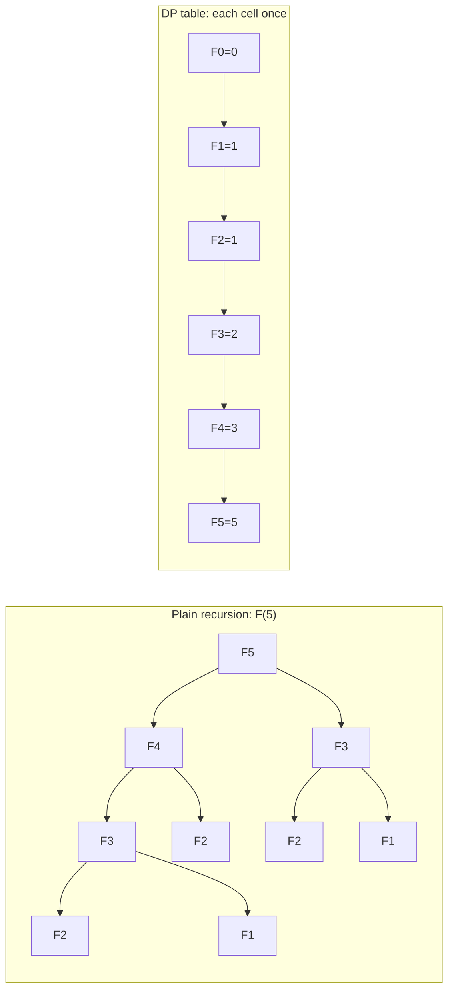
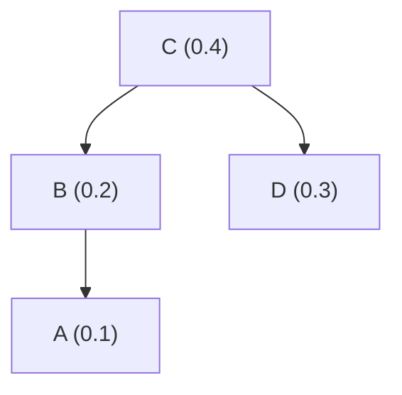

# Chapter 8 · Dynamic Programming

Dynamic Programming (DP) is the technique that turns "this recursion would take until the sun burns out" into "done in a millisecond." Whenever a problem breaks into smaller subproblems **that overlap** — the same small question gets asked again and again — DP solves each small question once, writes the answer in a table, and builds bigger answers from the table. It is behind spell checkers and `diff`, gene-sequence alignment, route planning, knapsack-style budgeting, speech recognition, and a huge share of technical interview questions. This lesson gives you a five-step recipe and then applies it to twelve problems, from a row of coins to optimal binary search trees and all-pairs shortest paths, so the recipe becomes a reflex.

🎮 **Simulations:** [DP Studio (coin-row, change-making, robot coins, knapsack + memory function, binomial, Longest Common Subsequence (LCS) / edit distance)](https://normansrule.github.io/algorithm-forge/sims/dp-studio.html) · [Optimal Binary Search Tree (BST)](https://normansrule.github.io/algorithm-forge/sims/optimal-bst.html) · [Warshall & Floyd](https://normansrule.github.io/algorithm-forge/sims/warshall-floyd.html)<br>
🏟️ **Arena problems:** [Chapter 8 set](https://normansrule.github.io/algorithm-forge/arena/?chapter=8)<br>
🐍 **Code:** [`ch08_dynamic_programming.py`](../../src/python/algoforge/ch08_dynamic_programming.py)<br>
📝 **Practice:** [practice folder](../../practice/)

---

## The big idea in 60 seconds

Write the answer to a big problem in terms of answers to smaller problems (a **recurrence**). If those smaller problems keep repeating, plain recursion recomputes them exponentially many times. DP instead:

1. solves every distinct subproblem **once**,
2. **records** its answer in a table,
3. reads the table whenever that answer is needed again.

The word "programming" is Richard Bellman's 1950s word for *planning* (think "television programming"), not coding.



The left tree computes `F3` twice and `F2` three times; for `F(50)` it would make about 40 billion calls. The right side makes 50 additions.

### DP vs divide-and-conquer vs memoization

| | Divide-and-conquer (Chapter 5) | Memoization (top-down DP) | Bottom-up DP (tabulation) |
|---|---|---|---|
| subproblems | independent, don't overlap | overlap | overlap |
| direction | top-down recursion | top-down recursion + cache | bottom-up loops over a table |
| solves | each subproblem as often as it appears (fine, since no overlap) | only subproblems actually reached | *every* subproblem in the table |
| typical examples | mergesort, quicksort, binary search | knapsack memory function, tree DPs | coin-row, knapsack table, Floyd |
| strengths | simple, parallel | easy to write from the recurrence; skips unneeded cells | no recursion depth limit; easy to shrink memory |

**Two ingredients make a problem DP-friendly:**
- **Optimal substructure** (the *principle of optimality*): an optimal solution is built from optimal solutions to its subproblems.
- **Overlapping subproblems**: the recursion revisits the same subproblems.

### The 5-step DP recipe

Every card below follows these five steps, and they map onto the Build blocks:

1. **Define the subproblem** — in words, with indices: "`F(i)` = the best amount obtainable from the first `i` coins." *(Block 1: the table.)*
2. **Write the recurrence** — how does `F(i)` depend on smaller subproblems? Usually "consider the last decision." *(Block 3.)*
3. **Base cases** — the smallest subproblems, answered directly. *(Block 1.)*
4. **Fill order** — an order in which every cell's dependencies are already computed. *(Block 2.)*
5. **Reconstruct the answer** — the value is in some cell; the *choices* are recovered by walking back through the table. *(Block 4.)*

### Warm-up: Fibonacci, top-down vs bottom-up

```
ALGORITHM FibMemo(n, Memo[0..n])
    // Memo filled with -1 before the first call
    if n ≤ 1 then
        return n
    if Memo[n] = -1 then
        Memo[n] ← FibMemo(n - 1, Memo) + FibMemo(n - 2, Memo)
    return Memo[n]

ALGORITHM FibBottomUp(n)
    if n ≤ 1 then
        return n
    prev ← 0
    cur ← 1
    for i ← 2 to n do
        next ← prev + cur
        prev ← cur
        cur ← next
    return cur
```

The naive recursion makes $2F(n+1) - 1$ calls — exponential, about $1.618^n$. Both DP versions take $\Theta(n)$ time; the bottom-up version needs only $\Theta(1)$ space because each value depends on just the previous two. (See the [Fibonacci simulation](https://normansrule.github.io/algorithm-forge/sims/fibonacci.html) from Chapter 2.)

---

## Build Card 1 · Coin-Row

### 🎯 Problem in one sentence
Given a row of `n` coins with positive values `c1, …, cn` → pick the maximum total value such that **no two picked coins are adjacent**.

### 📖 Story
Houses on a street keep cash on the porch, and neighbors will notice if two adjacent porches are emptied on the same night. (Interviewers call this "House Robber.") At every house you make one decision: take this one (and skip the previous) or leave it (and keep whatever was best up to the previous house).

### 👀 See it
[DP Studio](https://normansrule.github.io/algorithm-forge/sims/dp-studio.html) → *Coin-row*: each new cell glows with the two cells it reads from, and the backtracking path is drawn at the end.

### 🧱 Build it in blocks

**Block 1 — subproblem, table and base cases.** `F[i]` = the most we can collect from the first `i` coins. `F[0] = 0` (no coins), `F[1] = c1`.

```
ALGORITHM CoinRow(C[1..n])
    F ← array(n + 1, 0)
    F[1] ← C[1]
```

**Block 2 — fill order:** left to right, because `F[i]` needs `F[i-1]` and `F[i-2]`.

```
    for i ← 2 to n do
        // compute F[i]
```

**Block 3 — the recurrence.** Split all allowed selections into those *with* coin `i` (then coin `i−1` is excluded, best is `c_i + F[i−2]`) and those *without* it (best is `F[i−1]`):

$$F(i) = \max\{\,c_i + F(i-2),\ F(i-1)\,\},\qquad F(0) = 0,\ F(1) = c_1.$$

```
        F[i] ← max(C[i] + F[i - 2], F[i - 1])
```

**Block 4 — reconstruct.** Walk back from `i = n`: if `c_i + F[i−2] > F[i−1]` coin `i` was taken → jump to `i − 2`; otherwise → `i − 1`.

```
    return F[n]
```

### ✋ Trace it by hand
Coins `5, 1, 2, 10, 6, 2` (the course example):

| i | 0 | 1 | 2 | 3 | 4 | 5 | 6 |
|---|---|---|---|---|---|---|---|
| c_i | — | 5 | 1 | 2 | 10 | 6 | 2 |
| F(i) | 0 | 5 | 5 | 7 | 15 | 15 | 17 |

- `F(2) = max(1 + 0, 5) = 5`; `F(3) = max(2 + 5, 5) = 7`; `F(4) = max(10 + 5, 7) = 15`; `F(5) = max(6 + 7, 15) = 15`; `F(6) = max(2 + 15, 15) = 17`.
- **Backtrack:** i = 6: 2 + F(4) = 17 > F(5) = 15 → take coin 6 (value 2), go to 4. i = 4: 10 + F(2) = 15 > F(3) = 7 → take coin 4 (value 10), go to 2. i = 2: 1 + F(0) = 1 < F(1) = 5 → skip, go to 1. i = 1: take coin 1 (value 5).
- **Answer: 17 = 5 + 10 + 2** (coins 1, 4, 6).

### 💻 Code

```
ALGORITHM CoinRow(C[1..n])
    // Maximum value of non-adjacent coins
    // Input: coin values C[1..n], positive integers
    // Output: the largest amount that can be picked up
    F ← array(n + 1, 0)
    F[1] ← C[1]
    for i ← 2 to n do
        F[i] ← max(C[i] + F[i - 2], F[i - 1])
    return F[n]
```

<details><summary>Python</summary>

```python
def coin_row(coins):
    """Return (best total, 1-based indices of the coins taken)."""
    n = len(coins)
    c = [0] + coins                         # 1-based
    f = [0] * (n + 1)
    if n:
        f[1] = c[1]
    for i in range(2, n + 1):
        f[i] = max(c[i] + f[i - 2], f[i - 1])
    taken, i = [], n
    while i >= 1:
        if i == 1 or c[i] + f[i - 2] > f[i - 1]:
            taken.append(i)
            i -= 2
        else:
            i -= 1
    return f[n], taken[::-1]
```

</details>

<details><summary>Java</summary>

```java
static int coinRow(int[] coins) {            // coins[0..n-1]
    int n = coins.length;
    if (n == 0) return 0;
    int prev2 = 0, prev1 = coins[0];          // F(i-2), F(i-1): O(1) space
    for (int i = 1; i < n; i++) {
        int cur = Math.max(coins[i] + prev2, prev1);
        prev2 = prev1;
        prev1 = cur;
    }
    return prev1;
}
```

</details>

### 🧮 Analyze it
- **Time** $\Theta(n)$; **space** $\Theta(n)$ for the table (or $\Theta(1)$ with two variables if you don't need the reconstruction).
- **Optimal substructure:** if an optimal selection for `i` coins takes coin `i`, the rest of it must be an optimal selection for the first `i − 2` coins (otherwise swap in a better one and beat the "optimal" selection). Same argument for the case without coin `i`.

### ⚠️ Common mistakes
- Greedy "always take the largest remaining coin that's allowed": on `5, 1, 2, 10, 6, 2` that takes 10, then 5, then 2 … it happens to work here, but on `3, 4, 3` it picks 4 (total 4) instead of 3 + 3 = 6.
- Off-by-one between the 1-based recurrence and 0-based arrays.

### 🔁 Variations / real software
Circular rows (first and last coins are adjacent: run the DP twice), trees (no parent–child pair: a tree DP), and "maximum-weight independent set on a path," which appears in scheduling non-conflicting jobs.

---

## Build Card 2 · Change-Making (general denominations)

### 🎯 Problem in one sentence
Given coin denominations `d1 < d2 < … < dm` (with `d1 = 1`) and an amount `n` → use the **fewest** coins that sum to `n`.

### 📖 Story
In a country with coins worth 1, 3 and 4, a cashier owes you 6. The "greedy" cashier grabs the biggest coin first: 4 + 1 + 1 = **3 coins**. A smarter cashier notices 3 + 3 = **2 coins**. Greedy is optimal for American-style coins ([Chapter 9](../09-greedy/README.md)) but not for every coin system; DP is always right.

### 👀 See it
[DP Studio](https://normansrule.github.io/algorithm-forge/sims/dp-studio.html) → *Change-making*: set denominations `1, 3, 4`, amount 6, and compare with the greedy answer shown beside it.

### 🧱 Build it in blocks

**Block 1 — table and base case.** `F[a]` = the fewest coins that make amount `a`. `F[0] = 0`.

```
ALGORITHM ChangeMaking(D[1..m], n)
    F ← array(n + 1, 0)
```

**Block 2 — fill order:** amounts 1, 2, …, n (each needs smaller amounts only).

```
    for a ← 1 to n do
        best ← ∞
        // try every coin as the "last coin"
        F[a] ← best
```

**Block 3 — the recurrence.** The last coin used is some `d_j ≤ a`; what remains is an optimal change for `a − d_j`:

$$F(a) = \min_{j:\ d_j \le a} F(a - d_j) + 1,\qquad F(0) = 0.$$

```
        j ← 1
        while j ≤ m and D[j] ≤ a do
            best ← min(F[a - D[j]], best)
            j ← j + 1
        F[a] ← best + 1
```

**Block 4 — reconstruct:** store which coin achieved the minimum at each amount (`Last[a]`), then repeatedly subtract it from `n`.

### ✋ Trace it by hand
Denominations `1, 3, 4`, amount 6:

| amount a | 0 | 1 | 2 | 3 | 4 | 5 | 6 |
|---|---|---|---|---|---|---|---|
| F(a) | 0 | 1 | 2 | 1 | 1 | 2 | 2 |
| best last coin | — | 1 | 1 | 3 | 4 | 1 | 3 |

`F(6) = min(F(5), F(3), F(2)) + 1 = min(2, 1, 2) + 1 = 2`, achieved by last coin 3. Reconstruct: 6 → (coin 3) → 3 → (coin 3) → 0. **Answer: 3 + 3, two coins.** Greedy gives 4 + 1 + 1, three coins.

### 💻 Code

```
ALGORITHM ChangeMaking(D[1..m], n)
    // Fewest coins of denominations 1 = D[1] < D[2] < ... < D[m] adding up to n
    F ← array(n + 1, 0)
    for a ← 1 to n do
        best ← ∞
        j ← 1
        while j ≤ m and D[j] ≤ a do
            best ← min(F[a - D[j]], best)
            j ← j + 1
        F[a] ← best + 1
    return F[n]
```

<details><summary>Python</summary>

```python
def change_making(denoms, amount):
    """Return (fewest coins, list of coins). Returns (inf, []) if impossible."""
    INF = float("inf")
    f = [0] + [INF] * amount
    last = [0] * (amount + 1)
    for a in range(1, amount + 1):
        for d in denoms:
            if d <= a and f[a - d] + 1 < f[a]:
                f[a], last[a] = f[a - d] + 1, d
    if f[amount] == INF:
        return INF, []
    coins, a = [], amount
    while a > 0:
        coins.append(last[a])
        a -= last[a]
    return f[amount], coins
```

</details>

<details><summary>Java</summary>

```java
static int changeMaking(int[] denoms, int amount) {   // returns -1 if impossible
    int INF = Integer.MAX_VALUE / 2;
    int[] f = new int[amount + 1];
    Arrays.fill(f, INF);
    f[0] = 0;
    for (int a = 1; a <= amount; a++)
        for (int d : denoms)
            if (d <= a) f[a] = Math.min(f[a], f[a - d] + 1);
    return f[amount] >= INF ? -1 : f[amount];
}
```

</details>

### 🧮 Analyze it
- **Time** $\Theta(nm)$, **space** $\Theta(n)$. Note that this is *pseudo-polynomial*: polynomial in the *value* `n`, which is exponential in the number of bits needed to write `n`.
- **Optimal substructure:** remove the last coin from an optimal solution for `a`; what's left must be optimal for `a − d_j`, or we could improve the whole.

### ⚠️ Common mistakes
- Initializing `F` with 0 instead of ∞ for unreachable amounts (only a problem when there is no 1-coin).
- Trusting greedy for arbitrary coin systems.

### 🔁 Variations / real software
Counting the *number of ways* to make change (sum instead of min — watch the loop order to avoid counting permutations), minimum-cost resource bundling, and the unbounded knapsack problem.

---

## Build Card 3 · Robot Coin Collecting (plus path counting and binomial coefficients)

### 🎯 Problem in one sentence
Given an `n × m` board where some cells hold a coin → find the maximum number of coins a robot can collect going from the top-left cell to the bottom-right cell, moving only **right** or **down**.

### 📖 Story
A warehouse robot must cross the floor from the loading dock (top left) to the shipping door (bottom right), only moving forward along two conveyor directions, picking up parcels on the way. Every cell can be entered only from its left or its upper neighbor — so the best haul *into* a cell is the better of those two hauls, plus that cell's coin.

### 👀 See it
[DP Studio](https://normansrule.github.io/algorithm-forge/sims/dp-studio.html) → *Robot coins*: click cells to place coins, then watch the table fill row by row and the optimal path light up.

### 🧱 Build it in blocks

**Block 1 — table and base cases.** `F[i, j]` = the most coins the robot can bring into cell `(i, j)`. Pad with row 0 and column 0 of zeros so borders need no special case. `c_ij` = 1 if cell `(i, j)` holds a coin, 0 otherwise.

**Block 2 — fill order:** row by row, left to right (each cell needs its upper and left neighbors).

**Block 3 — the recurrence:**

$$F(i, j) = \max\{F(i-1, j),\ F(i, j-1)\} + c_{ij},\qquad F(0, j) = F(i, 0) = 0.$$

**Block 4 — reconstruct:** from `(n, m)` step to whichever of the upper / left neighbors has the larger `F`, until `(1, 1)`.

### ✋ Trace it by hand
Our own 5 × 6 board (● = coin):

```
      1  2  3  4  5  6
  1   .  ●  .  .  ●  .
  2   ●  .  .  ●  .  .
  3   .  ●  ●  .  .  ●
  4   .  .  ●  .  ●  .
  5   ●  .  .  ●  .  ●
```

Table `F(i, j)`:

| i \ j | 1 | 2 | 3 | 4 | 5 | 6 |
|---|---|---|---|---|---|---|
| 1 | 0 | 1 | 1 | 1 | 2 | 2 |
| 2 | 1 | 1 | 1 | 2 | 2 | 2 |
| 3 | 1 | 2 | 3 | 3 | 3 | 4 |
| 4 | 1 | 2 | 4 | 4 | 5 | 5 |
| 5 | 2 | 2 | 4 | 5 | 5 | **6** |

**Maximum: 6 coins.** One optimal path (follow the larger neighbor backward, preferring "up" on ties): (1,1) → (1,2) → (2,2) → (3,2) → (3,3) → (4,3) → (4,4) → (4,5) → (4,6) → (5,6), collecting the coins at (1,2), (3,2), (3,3), (4,3), (4,5), (5,6).

### 💻 Code

```
ALGORITHM RobotCoinCollection(C[0..n-1, 0..m-1])
    // The board has rows 1..n and columns 1..m; C[i - 1, j - 1] = 1 if cell (i, j) has a coin, else 0
    // (Forge arrays start at 0, so the input board is indexed from 0; the table F keeps the book's 1..n)
    F ← matrix(n + 1, m + 1, 0)          // row 0 and column 0 stay 0
    for i ← 1 to n do
        for j ← 1 to m do
            F[i, j] ← max(F[i - 1, j], F[i, j - 1]) + C[i - 1, j - 1]
    return F[n, m]
```

<details><summary>Python</summary>

```python
def robot_coins(board):
    """board: list of rows of 0/1. Returns (max coins, path as 1-based (row, col))."""
    n, m = len(board), len(board[0])
    f = [[0] * (m + 1) for _ in range(n + 1)]
    for i in range(1, n + 1):
        for j in range(1, m + 1):
            f[i][j] = max(f[i - 1][j], f[i][j - 1]) + board[i - 1][j - 1]
    path, i, j = [(n, m)], n, m
    while (i, j) != (1, 1):
        if j == 1 or (i > 1 and f[i - 1][j] >= f[i][j - 1]):
            i -= 1
        else:
            j -= 1
        path.append((i, j))
    return f[n][m], path[::-1]
```

</details>

<details><summary>Java</summary>

```java
static int robotCoins(int[][] board) {
    int n = board.length, m = board[0].length;
    int[][] f = new int[n + 1][m + 1];
    for (int i = 1; i <= n; i++)
        for (int j = 1; j <= m; j++)
            f[i][j] = Math.max(f[i - 1][j], f[i][j - 1]) + board[i - 1][j - 1];
    return f[n][m];
}
```

</details>

### 🧮 Analyze it
- **Time and space** $\Theta(nm)$ (space drops to $\Theta(m)$ with a single rolling row if you don't need the path).
- **Optimal substructure:** the part of an optimal path that ends at the cell before `(i, j)` must itself be optimal for that cell.
- Compare with brute force: there are $\binom{n+m-2}{n-1}$ monotone paths — 126 on this small board, astronomically many on a 100 × 100 one.

### ⚠️ Common mistakes
- Forgetting cells you cannot enter (walls): set their `F` to $-\infty$.
- Filling column by column but reading `F[i, j−1]` before it's computed — any order works as long as up and left are done first.

### 🔁 Mini-card: path counting on a street grid
**Problem.** How many shortest routes (right/down moves only) lead from corner A to corner B of a grid of intersections? **Recurrence:** paths into an intersection = paths from above + paths from the left; blocked intersections get 0; the first row and column get 1.

Our 4 × 5 grid of intersections with a closed intersection at row 2, column 3 (✖):

| | c1 | c2 | c3 | c4 | c5 |
|---|---|---|---|---|---|
| r1 | 1 | 1 | 1 | 1 | 1 |
| r2 | 1 | 2 | ✖ 0 | 1 | 2 |
| r3 | 1 | 3 | 3 | 4 | 6 |
| r4 | 1 | 4 | 7 | 11 | **17** |

**17 routes.** Without the closure it would be $\binom{7}{3} = 35$ — the number of ways to choose which 3 of the 7 moves go down.

### 🔁 Mini-card: binomial coefficients (Pascal's triangle)
$\binom{n}{k} = \binom{n-1}{k-1} + \binom{n-1}{k}$ for $0 < k < n$, with $\binom{n}{0} = \binom{n}{n} = 1$. Fill row by row, only columns $0..\min(i, k)$:

| n \ k | 0 | 1 | 2 | 3 |
|---|---|---|---|---|
| 0 | 1 | | | |
| 1 | 1 | 1 | | |
| 2 | 1 | 2 | 1 | |
| 3 | 1 | 3 | 3 | 1 |
| 4 | 1 | 4 | 6 | 4 |
| 5 | 1 | 5 | 10 | 10 |
| 6 | 1 | 6 | 15 | **20** |

```
ALGORITHM Binomial(n, k)
    C ← matrix(n + 1, k + 1, 0)
    for i ← 0 to n do
        for j ← 0 to min(i, k) do
            if j = 0 or j = i then
                C[i, j] ← 1
            else
                C[i, j] ← C[i - 1, j - 1] + C[i - 1, j]
    return C[n, k]
```

Time $\Theta(nk)$ additions, and no multiplication — so no overflow in intermediate factorials. Path counting *is* this table rotated 45°.

---

## Build Card 4 · 0/1 Knapsack (bottom-up table, backtracking, memory function)

### 🎯 Problem in one sentence
Given `n` items with integer weights `w_i` and values `v_i`, and a knapsack of integer capacity `W` → choose a subset of items (each taken whole or not at all) of maximum total value whose total weight is at most `W`.

### 📖 Story
You're packing a 5 kg carry-on for a trip and every item has a "how glad I'll be to have it" score. For each item you face one yes/no decision. The DP table answers, for *every* smaller carry-on size and every prefix of your item list, "what's the best I could do?" — so the final decision for each item is just a lookup.

### 👀 See it
[DP Studio](https://normansrule.github.io/algorithm-forge/sims/dp-studio.html) → *Knapsack*: the table fills row by row, and each cell compares its two candidates (skip item / take item). Run the *memory function* version too, and compare which cells the top-down version actually touches.

### 🧱 Build it in blocks

**Block 1 — subproblem, table, base cases.** `V[i, j]` = the best value using only the first `i` items with capacity `j`. Row 0 (no items) and column 0 (no capacity) are all zeros.

```
ALGORITHM KnapsackDP(Weights[0..n-1], Values[0..n-1], W)
    V ← matrix(n + 1, W + 1, 0)
```

**Block 2 — fill order:** row by row (item by item), each row left to right; every cell reads only the row above.

```
    for i ← 1 to n do
        for j ← 1 to W do
            // decide about item i (stored at index i - 1)
```

**Block 3 — the recurrence.** Either item `i` is left out (best is `V[i−1, j]`), or, if it fits, it is taken (value `v_i` plus the best for the remaining capacity with the first `i−1` items):

$$V[i, j] = \begin{cases} \max\{V[i-1, j],\ v_i + V[i-1, j - w_i]\} & \text{if } j \ge w_i \\ V[i-1, j] & \text{if } j < w_i \end{cases}$$

```
            if j ≥ Weights[i - 1] then
                V[i, j] ← max(V[i - 1, j], Values[i - 1] + V[i - 1, j - Weights[i - 1]])
            else
                V[i, j] ← V[i - 1, j]
```

**Block 4 — reconstruct.** Start at `(n, W)`. If `V[i, j] ≠ V[i−1, j]`, item `i` must be in the knapsack: record it and subtract its weight from `j`. Move up one row either way.

```
    j ← W
    for i ← n downto 1 do
        if V[i, j] ≠ V[i - 1, j] then
            // item i is in an optimal subset
            j ← j - Weights[i - 1]
    return V[n, W]
```

### ✋ Trace it by hand — the classic instance
Capacity `W = 5`; items (weight, value): 1: (2, 12), 2: (1, 10), 3: (3, 20), 4: (2, 15).

| i \ j | 0 | 1 | 2 | 3 | 4 | 5 |
|---|---|---|---|---|---|---|
| 0 | 0 | 0 | 0 | 0 | 0 | 0 |
| 1: w=2, v=12 | 0 | 0 | 12 | 12 | 12 | 12 |
| 2: w=1, v=10 | 0 | 10 | 12 | 22 | 22 | 22 |
| 3: w=3, v=20 | 0 | 10 | 12 | 22 | 30 | 32 |
| 4: w=2, v=15 | 0 | 10 | 15 | 25 | 30 | **37** |

A few cells worked out: `V[3, 4] = max(V[2, 4], 20 + V[2, 1]) = max(22, 30) = 30`. `V[4, 5] = max(V[3, 5], 15 + V[3, 3]) = max(32, 37) = 37`.

**Backtracking:** `V[4,5] = 37 ≠ V[3,5] = 32` → item 4 in, `j = 3`. `V[3,3] = 22 = V[2,3]` → item 3 out. `V[2,3] = 22 ≠ V[1,3] = 12` → item 2 in, `j = 2`. `V[1,2] = 12 ≠ V[0,2] = 0` → item 1 in, `j = 0`. **Optimal subset {1, 2, 4}, weight 5, value 37.**

### ✋ Trace it by hand — the course practice instance
Capacity `W = 5`; items: 1: (3, 13), 2: (2, 10), 3: (1, 6), 4: (2, 9).

| i \ j | 0 | 1 | 2 | 3 | 4 | 5 |
|---|---|---|---|---|---|---|
| 0 | 0 | 0 | 0 | 0 | 0 | 0 |
| 1: w=3, v=13 | 0 | 0 | 0 | 13 | 13 | 13 |
| 2: w=2, v=10 | 0 | 0 | 10 | 13 | 13 | 23 |
| 3: w=1, v=6 | 0 | 6 | 10 | 16 | 19 | 23 |
| 4: w=2, v=9 | 0 | 6 | 10 | 16 | 19 | **25** |

Row 3 details: `V[3,3] = max(13, 6 + V[2,2]) = max(13, 16) = 16`; `V[3,4] = max(13, 6 + V[2,3]) = 19`; `V[3,5] = max(23, 6 + V[2,4]) = max(23, 19) = 23`. Row 4: `V[4,5] = max(23, 9 + V[3,3]) = max(23, 25) = 25`.

**Backtracking:** `25 ≠ 23` → item 4 in, `j = 3`; `V[3,3] = 16 ≠ V[2,3] = 13` → item 3 in, `j = 2`; `V[2,2] = 10 ≠ V[1,2] = 0` → item 2 in, `j = 0`. **Optimal subset {2, 3, 4}, weight 5, value 25.**

> Heads-up: the practice slide lists item 3's value as 6 in the item list but as 5 in the table's row label. With value 5 the table's last two rows become `0 5 10 15 18 23` and `0 5 10 15 19 24`, and the optimal subset is **still {2, 3, 4}**, now worth 24.

### ✋ Memory function (top-down with a table)
Bottom-up fills all 20 non-trivial cells even though the answer needs only some of them. The **memory function** version recurses from `(n, W)` like plain recursion but stores each result, so each cell is computed at most once — and cells that are never needed are never computed. For the classic instance (— = never computed):

| i \ j | 0 | 1 | 2 | 3 | 4 | 5 |
|---|---|---|---|---|---|---|
| 0 | 0 | 0 | 0 | 0 | 0 | 0 |
| 1 | 0 | 0 | 12 | 12 | 12 | 12 |
| 2 | 0 | — | 12 | 22 | — | 22 |
| 3 | 0 | — | — | 22 | — | 32 |
| 4 | 0 | — | — | — | — | 37 |

Only **11 of the 20** cells were computed. (For the practice instance, 12 of 20.)

```
ALGORITHM MFKnapsack(i, j)
    // Uses global arrays Weights[0..n-1], Values[0..n-1] and table V[0..n, 0..W]
    // with row 0 and column 0 set to 0 and every other cell set to -1
    if V[i, j] < 0 then
        if j < Weights[i - 1] then
            value ← MFKnapsack(i - 1, j)
        else
            value ← max(MFKnapsack(i - 1, j), Values[i - 1] + MFKnapsack(i - 1, j - Weights[i - 1]))
        V[i, j] ← value
    return V[i, j]
```

### 💻 Code

```
ALGORITHM KnapsackDP(Weights[0..n-1], Values[0..n-1], W)
    // Bottom-up 0/1 knapsack; item i of the recurrence is stored at index i - 1
    V ← matrix(n + 1, W + 1, 0)
    for i ← 1 to n do
        for j ← 1 to W do
            if j ≥ Weights[i - 1] then
                V[i, j] ← max(V[i - 1, j], Values[i - 1] + V[i - 1, j - Weights[i - 1]])
            else
                V[i, j] ← V[i - 1, j]
    return V[n, W]
```

<details><summary>Python</summary>

```python
def knapsack(weights, values, cap):
    """Return (best value, sorted 1-based item numbers, full table)."""
    n = len(weights)
    v = [[0] * (cap + 1) for _ in range(n + 1)]
    for i in range(1, n + 1):
        w, val = weights[i - 1], values[i - 1]
        for j in range(1, cap + 1):
            v[i][j] = v[i - 1][j]
            if j >= w:
                v[i][j] = max(v[i][j], val + v[i - 1][j - w])
    items, j = [], cap
    for i in range(n, 0, -1):
        if v[i][j] != v[i - 1][j]:
            items.append(i)
            j -= weights[i - 1]
    return v[n][cap], sorted(items), v

def knapsack_memo(weights, values, cap):
    """Memory-function version; also returns how many cells it computed."""
    n = len(weights)
    v = [[0] * (cap + 1)] + [[0] + [-1] * cap for _ in range(n)]
    computed = 0

    def mf(i, j):
        nonlocal computed
        if v[i][j] < 0:
            computed += 1
            best = mf(i - 1, j)
            if j >= weights[i - 1]:
                best = max(best, values[i - 1] + mf(i - 1, j - weights[i - 1]))
            v[i][j] = best
        return v[i][j]

    return mf(n, cap), computed
```

</details>

<details><summary>Java</summary>

```java
static int knapsack(int[] weights, int[] values, int cap) {
    int n = weights.length;
    int[][] v = new int[n + 1][cap + 1];
    for (int i = 1; i <= n; i++)
        for (int j = 1; j <= cap; j++) {
            v[i][j] = v[i - 1][j];
            if (j >= weights[i - 1])
                v[i][j] = Math.max(v[i][j], values[i - 1] + v[i - 1][j - weights[i - 1]]);
        }
    return v[n][cap];
}

static int knapsackOneRow(int[] weights, int[] values, int cap) {
    int[] best = new int[cap + 1];                 // O(W) space
    for (int i = 0; i < weights.length; i++)
        for (int j = cap; j >= weights[i]; j--)    // right to left: each item used once
            best[j] = Math.max(best[j], values[i] + best[j - weights[i]]);
    return best[cap];
}
```

</details>

### 🧮 Analyze it
- **Time** $\Theta(nW)$, **space** $\Theta(nW)$ (or $\Theta(W)$ with one row filled right to left, if you don't need to backtrack). Backtracking costs $O(n)$.
- Like change-making this is **pseudo-polynomial**; the knapsack problem is NP-hard (NP = Nondeterministic Polynomial time) in general (Chapter 11), so no algorithm polynomial in the *number of bits* of `W` is known.
- **Memory function:** same worst-case time, but it touches only the reachable cells — a big win when weights are large and few capacities are actually reachable.
- **Optimal substructure:** if item `i` is in an optimal subset for `(i, j)`, the rest is an optimal subset of the first `i−1` items for capacity `j − w_i`; if it's not, the subset is optimal for `(i−1, j)`.

### ⚠️ Common mistakes
- One-row version filled **left to right** — lets an item be used many times (that is the *unbounded* knapsack).
- Mixing 1-based item numbers with 0-based arrays (`Weights[i]` vs `Weights[i-1]`).
- Backtracking by checking "did `V` increase along the row?" instead of comparing with the row above.

### 🔁 Variations / real software
Budget allocation (projects with costs and payoffs), cargo and container loading, choosing which ads fill a time slot, subset-sum and partition (value = weight), and cutting-stock problems in manufacturing.

---

## Build Card 5 · Optimal Binary Search Tree

### 🎯 Problem in one sentence
Given sorted keys `a1 < … < an` and the probability `p_i` of searching for each → build the Binary Search Tree (BST) that minimizes the **average number of comparisons** in a successful search.

### 📖 Story
A help-desk phone tree: the question asked first should split callers so that the *most frequent* requests are resolved after the fewest questions. Putting the most popular key at the root isn't always optimal, because the root also decides how lopsided the two subtrees become.

### 👀 See it
[Optimal BST](https://normansrule.github.io/algorithm-forge/sims/optimal-bst.html): the cost table and root table fill diagonal by diagonal; for each cell, check which roots were compared.

### 🧱 Build it in blocks

**Block 1 — subproblem and base cases.** `C[i, j]` = the smallest average comparisons for a BST on keys `a_i..a_j`. Empty ranges cost 0: `C[i, i−1] = 0`. A single key costs its probability: `C[i, i] = p_i`. `R[i, j]` records the best root.

**Block 2 — fill order:** by the length of the key range — diagonal by diagonal (`d = j − i` = 1, 2, …, n−1), because `C[i, j]` needs strictly shorter ranges.

**Block 3 — the recurrence.** Try every key `a_k` in the range as the root. Its subtrees are optimal trees for `a_i..a_{k−1}` and `a_{k+1}..a_j`; hanging them one level lower adds one comparison for *every* key in the range, i.e., the sum of their probabilities:

$$C[i, j] = \min_{i \le k \le j}\{\,C[i, k-1] + C[k+1, j]\,\} + \sum_{s=i}^{j} p_s .$$

**Block 4 — reconstruct:** the root of the whole tree is `R[1, n]`; its left subtree's root is `R[1, R[1,n]−1]`, and so on recursively.

### ✋ Trace it by hand
Keys A, B, C, D with probabilities 0.1, 0.2, 0.4, 0.3 (the course example).

Every candidate root, computed:

| range | k = candidates → cost | minimum | root |
|---|---|---|---|
| A..B | A: 0.5 · B: **0.4** | 0.4 | B |
| B..C | B: 1.0 · C: **0.8** | 0.8 | C |
| C..D | C: **1.0** · D: 1.1 | 1.0 | C |
| A..C | A: 1.5 · B: 1.2 · C: **1.1** | 1.1 | C |
| B..D | B: 1.9 · C: **1.4** · D: 1.7 | 1.4 | C |
| A..D | A: 2.4 · B: 2.1 · C: **1.7** · D: 2.1 | 1.7 | C |

Main table `C[i, j]` (rows `i` = 1..5, columns `j` = 0..4) and root table `R[i, j]`:

| C | j=0 | 1 | 2 | 3 | 4 |
|---|---|---|---|---|---|
| i=1 | 0 | 0.1 | 0.4 | 1.1 | **1.7** |
| i=2 | | 0 | 0.2 | 0.8 | 1.4 |
| i=3 | | | 0 | 0.4 | 1.0 |
| i=4 | | | | 0 | 0.3 |
| i=5 | | | | | 0 |

| R | j=1 | 2 | 3 | 4 |
|---|---|---|---|---|
| i=1 | 1 | 2 | 3 | **3** |
| i=2 | | 2 | 3 | 3 |
| i=3 | | | 3 | 3 |
| i=4 | | | | 4 |

**Reconstruct:** `R[1,4] = 3` → root **C**. Left keys A..B: `R[1,2] = 2` → **B**, whose left child is **A** (`R[1,1] = 1`). Right keys D..D: **D**.



Check: $1(0.4) + 2(0.2) + 2(0.3) + 3(0.1) = 0.4 + 0.4 + 0.6 + 0.3 = 1.7$ comparisons on average. ✓

### 💻 Code

```
ALGORITHM OptimalBST(P[1..n])
    // P[1..n]: search probabilities of sorted keys
    // Output: average comparisons of an optimal BST and the root table R
    C ← matrix(n + 2, n + 1, 0)
    R ← matrix(n + 2, n + 1, 0)
    for i ← 1 to n do
        C[i, i] ← P[i]
        R[i, i] ← i
    for d ← 1 to n - 1 do                // diagonal count
        for i ← 1 to n - d do
            j ← i + d
            minval ← ∞
            for k ← i to j do
                if C[i, k - 1] + C[k + 1, j] < minval then
                    minval ← C[i, k - 1] + C[k + 1, j]
                    kmin ← k
            R[i, j] ← kmin
            sum ← P[i]
            for s ← i + 1 to j do
                sum ← sum + P[s]
            C[i, j] ← minval + sum
    return C[1, n], R
```

<details><summary>Python</summary>

```python
def optimal_bst(p):
    """p[0..n-1] = probabilities of sorted keys. Returns (cost, root table, C table), 1-based tables."""
    n = len(p)
    c = [[0.0] * (n + 1) for _ in range(n + 2)]
    r = [[0] * (n + 1) for _ in range(n + 2)]
    prefix = [0.0]
    for x in p:
        prefix.append(prefix[-1] + x)
    for i in range(1, n + 1):
        c[i][i], r[i][i] = p[i - 1], i
    for d in range(1, n):
        for i in range(1, n - d + 1):
            j = i + d
            best, root = min((c[i][k - 1] + c[k + 1][j], k) for k in range(i, j + 1))
            c[i][j] = best + prefix[j] - prefix[i - 1]
            r[i][j] = root
    return c[1][n], r, c

def build_tree(r, i, j, keys):
    """Turn the root table into nested tuples (root, left, right)."""
    if i > j:
        return None
    k = r[i][j]
    return (keys[k - 1], build_tree(r, i, k - 1, keys), build_tree(r, k + 1, j, keys))
```

</details>

<details><summary>Java</summary>

```java
static double optimalBst(double[] p) {              // p[0..n-1]
    int n = p.length;
    double[][] c = new double[n + 2][n + 1];
    double[] prefix = new double[n + 1];
    for (int i = 1; i <= n; i++) { prefix[i] = prefix[i - 1] + p[i - 1]; c[i][i] = p[i - 1]; }
    for (int d = 1; d < n; d++)
        for (int i = 1; i + d <= n; i++) {
            int j = i + d;
            double best = Double.MAX_VALUE;
            for (int k = i; k <= j; k++)
                best = Math.min(best, c[i][k - 1] + c[k + 1][j]);
            c[i][j] = best + prefix[j] - prefix[i - 1];
        }
    return c[1][n];
}
```

</details>

### 🧮 Analyze it
- **Time** $\Theta(n^3)$ (about $n^3/6$ root trials), **space** $\Theta(n^2)$. Knuth's observation that the best root is monotone, $R[i, j-1] \le R[i, j] \le R[i+1, j]$, cuts the time to $\Theta(n^2)$.
- Brute force is hopeless: the number of BSTs on `n` keys is the Catalan number $\frac{1}{n+1}\binom{2n}{n}$, which grows like $4^n / n^{1.5}$.
- **Optimal substructure:** both subtrees of an optimal BST must themselves be optimal for their key ranges (otherwise replace one and lower the total).

### ⚠️ Common mistakes
- Filling row by row: `C[1, 3]` needs `C[2, 3]`, which is in a later row. Fill by diagonals (or by increasing range length).
- Forgetting the $\sum p_s$ term — it is what charges every key one extra comparison for being one level deeper.
- Assuming "most probable key at the root" is optimal: here it is (C, 0.4), but try probabilities 0.3, 0.3, 0.4 on three keys: putting the 0.4 key at the root gives 1.9 comparisons, while the middle key as root gives 1.7.

### 🔁 Variations / real software
Including unsuccessful-search probabilities (gaps between keys), static dictionaries such as keyword tables in compilers, and the closely related **matrix-chain multiplication** DP (same interval-shaped table, same diagonal fill order).

---

## Build Card 6 · Warshall's and Floyd's Algorithms

### 🎯 Problem in one sentence
Given a directed graph as an `n × n` matrix → **Warshall:** compute the *transitive closure* (is there any path from `i` to `j`?); **Floyd:** compute the length of the *shortest* path between **every** pair of vertices.

### 📖 Story
Airline routes. Warshall asks "can I get from city i to city j at all, with any number of connections?" Floyd asks "what's the cheapest way?" Both use the same trick: first allow no layovers, then allow layovers only in city 1, then in cities 1–2, then 1–3, … Each round adds one city to the list of allowed stopovers.

### 👀 See it
[Warshall & Floyd](https://normansrule.github.io/algorithm-forge/sims/warshall-floyd.html): follow row `k` and column `k` in each round — every cell that changes does so because of one entry in row `k` and one in column `k`.

### 🧱 Build it in blocks

**Block 1 — table.** `R(k)[i, j]` = 1 if there is a path from `i` to `j` using only vertices `1..k` as intermediate stops. `R(0)` = the adjacency matrix. Floyd: `D(k)[i, j]` = length of the shortest such path; `D(0)` = the weight matrix (∞ = no edge, 0 on the diagonal).

**Block 2 — fill order:** `k` = 1..n in the **outer** loop; all pairs `(i, j)` inside. The matrices can overwrite each other in place (row `k` and column `k` don't change during round `k`).

**Block 3 — the recurrence.** A path allowed to use `1..k` either avoids `k` (then it only uses `1..k−1`) or goes through `k` once (then it splits into `i → k` and `k → j`, each using only `1..k−1`):

$$R^{(k)}[i, j] = R^{(k-1)}[i, j] \ \text{or}\ \big(R^{(k-1)}[i, k] \ \text{and}\ R^{(k-1)}[k, j]\big)$$

$$D^{(k)}[i, j] = \min\{\,D^{(k-1)}[i, j],\ D^{(k-1)}[i, k] + D^{(k-1)}[k, j]\,\}$$

Practical rule for Warshall by hand: a 0 becomes 1 in round `k` exactly when its row has a 1 in column `k` **and** its column has a 1 in row `k`.

**Block 4 — the result** is `R(n)` / `D(n)`. To recover actual shortest paths in Floyd, also store `Next[i, j]` (or the last `k` that improved the cell).

### ✋ Trace it by hand — Warshall
Digraph on a, b, c, d with edges a→c, b→a, b→d, d→b (the course example):

```
        R(0)          R(1)          R(2)          R(3)          R(4)
      a b c d       a b c d       a b c d       a b c d       a b c d
  a   0 0 1 0       0 0 1 0       0 0 1 0       0 0 1 0       0 0 1 0
  b   1 0 0 1       1 0 1 1       1 0 1 1       1 0 1 1       1 1 1 1
  c   0 0 0 0       0 0 0 0       0 0 0 0       0 0 0 0       0 0 0 0
  d   0 1 0 0       0 1 0 0       1 1 1 1       1 1 1 1       1 1 1 1
```

- **k = a:** b reaches a, and a reaches c → `b→c` becomes 1.
- **k = b:** d reaches b, and b reaches a, c, d → `d→a`, `d→c`, `d→d` become 1.
- **k = c:** c reaches nothing → no change.
- **k = d:** b reaches d, and d reaches b → `b→b` becomes 1 (b lies on a cycle b→d→b).

### ✋ Trace it by hand — Floyd
Weighted digraph: a→c 3, b→a 2, c→b 7, c→d 1, d→a 6.

```
        D(0)                D(1)                D(2)                D(3)                D(4)
     a  b  c  d          a  b  c  d          a  b  c  d          a  b  c  d          a  b  c  d
a    0  ∞  3  ∞          0  ∞  3  ∞          0  ∞  3  ∞          0 10  3  4          0 10  3  4
b    2  0  ∞  ∞          2  0  5  ∞          2  0  5  ∞          2  0  5  6          2  0  5  6
c    ∞  7  0  1          ∞  7  0  1          9  7  0  1          9  7  0  1          7  7  0  1
d    6  ∞  ∞  0          6  ∞  9  0          6  ∞  9  0          6 16  9  0          6 16  9  0
```

- **k = a:** `b→c = b→a→c = 2 + 3 = 5`; `d→c = 6 + 3 = 9`.
- **k = b:** `c→a = c→b→a = 7 + 2 = 9`.
- **k = c:** `a→b = 3 + 7 = 10`, `a→d = 3 + 1 = 4`, `b→d = 5 + 1 = 6`, `d→b = 9 + 7 = 16`.
- **k = d:** `c→a` improves from 9 to `c→d→a = 1 + 6 = 7`.

### 💻 Code

```
ALGORITHM Warshall(A[0..n-1, 0..n-1])
    // Transitive closure of a digraph given by its adjacency matrix
    R ← A
    for k ← 0 to n - 1 do
        for i ← 0 to n - 1 do
            for j ← 0 to n - 1 do
                R[i, j] ← R[i, j] or (R[i, k] and R[k, j])
    return R

ALGORITHM Floyd(W[0..n-1, 0..n-1])
    // All-pairs shortest path lengths; W[i, j] = ∞ if there is no edge, W[i, i] = 0
    D ← W
    for k ← 0 to n - 1 do
        for i ← 0 to n - 1 do
            for j ← 0 to n - 1 do
                D[i, j] ← min(D[i, j], D[i, k] + D[k, j])
    return D
```

<details><summary>Python</summary>

```python
def warshall(adj):
    n = len(adj)
    r = [row[:] for row in adj]
    for k in range(n):
        for i in range(n):
            if r[i][k]:                       # small speed-up: skip rows that can't use k
                for j in range(n):
                    if r[k][j]:
                        r[i][j] = 1
    return r

def floyd(w):
    """w: matrix with float('inf') for missing edges. Returns (dist, next_hop)."""
    n = len(w)
    d = [row[:] for row in w]
    nxt = [[j if w[i][j] != float("inf") else None for j in range(n)] for i in range(n)]
    for k in range(n):
        for i in range(n):
            for j in range(n):
                if d[i][k] + d[k][j] < d[i][j]:
                    d[i][j] = d[i][k] + d[k][j]
                    nxt[i][j] = nxt[i][k]
    return d, nxt

def floyd_path(nxt, i, j):
    if nxt[i][j] is None:
        return []
    path = [i]
    while i != j:
        i = nxt[i][j]
        path.append(i)
    return path
```

</details>

<details><summary>Java</summary>

```java
static boolean[][] warshall(boolean[][] adj) {
    int n = adj.length;
    boolean[][] r = new boolean[n][];
    for (int i = 0; i < n; i++) r[i] = adj[i].clone();
    for (int k = 0; k < n; k++)
        for (int i = 0; i < n; i++)
            if (r[i][k])
                for (int j = 0; j < n; j++)
                    r[i][j] |= r[k][j];
    return r;
}

static final double INF = Double.POSITIVE_INFINITY;

static double[][] floyd(double[][] w) {
    int n = w.length;
    double[][] d = new double[n][];
    for (int i = 0; i < n; i++) d[i] = w[i].clone();
    for (int k = 0; k < n; k++)
        for (int i = 0; i < n; i++)
            for (int j = 0; j < n; j++)
                if (d[i][k] + d[k][j] < d[i][j]) d[i][j] = d[i][k] + d[k][j];
    return d;
}
```

</details>

### 🧮 Analyze it
- **Time** $\Theta(n^3)$ for both, **space** $\Theta(n^2)$ (in place). For sparse graphs, $n$ runs of Breadth-First Search (BFS) or Depth-First Search (DFS) (Warshall's job) or of Dijkstra (Floyd's job, nonnegative weights) can be faster.
- **Why in-place is safe:** in round `k`, `D[i, k]` and `D[k, j]` can't improve (going through `k` to reach `k` adds `D[k, k] = 0`), so reading "new" values is the same as reading old ones.
- **Negative weights:** Floyd handles negative edges; a **negative cycle** shows up as a negative number on the diagonal at the end.
- **Correctness** is the recurrence itself, proved by induction on `k`.

### ⚠️ Common mistakes
- Putting `k` in an inner loop — then you combine paths that aren't finished yet, and the answer can be wrong.
- Using a huge integer for ∞ and adding two of them → overflow into negative numbers. Guard with `if D[i,k] ≠ ∞ and D[k,j] ≠ ∞`.
- Forgetting `D[i, i] = 0` in the input.

### 🔁 Variations / real software
Reachability in dependency graphs (build systems, package managers, "which tables are affected by this change?"), precomputing distance tables for small maps in games, and transitive closure in database query engines. The same "add one allowed middle vertex at a time" pattern also computes widest paths and regular expressions from automata (Kleene's algorithm).

---

## Beyond the book: three string-and-sequence DPs every engineer meets

The next three cards are not in Levitin's Chapter 8, but they are the DPs you are most likely to meet in real code and interviews. They use exactly the same recipe.

## Build Card 7 · Longest Common Subsequence (LCS)

### 🎯 Problem in one sentence
Given strings `X[1..n]` and `Y[1..m]` → find the longest sequence of characters that appears in both **in the same order** (not necessarily contiguous).

### 📖 Story
Two versions of a document: the lines they share, in order, are the lines that "didn't change." Everything else is an insertion or a deletion. That is exactly what a `diff` tool shows you — the LCS is the unchanged skeleton.

### 👀 See it
[DP Studio](https://normansrule.github.io/algorithm-forge/sims/dp-studio.html) → *LCS*: matches extend the diagonal; the traceback path spells the answer.

### 🧱 Build it in blocks

**Block 1 — subproblem and base cases.** `L[i, j]` = length of an LCS of the prefixes `X[1..i]` and `Y[1..j]`. Row 0 and column 0 are 0 (an empty string has nothing in common with anything).

**Block 2 — fill order:** row by row, left to right (each cell reads up, left, and up-left).

**Block 3 — the recurrence.** Look at the last characters:

$$L[i, j] = \begin{cases} L[i-1, j-1] + 1 & \text{if } X_i = Y_j \\ \max\{L[i-1, j],\ L[i, j-1]\} & \text{otherwise} \end{cases}$$

If they match, some LCS ends with that character. If not, at least one of them is not the last character of an LCS, so drop one or the other.

**Block 4 — reconstruct:** from `(n, m)`: on a match, output the character and go diagonally; otherwise move toward the larger of up / left.

### ✋ Trace it by hand
`X = DYNAMIC`, `Y = DRAMATIC`:

| | ε | D | R | A | M | A | T | I | C |
|---|---|---|---|---|---|---|---|---|---|
| ε | 0 | 0 | 0 | 0 | 0 | 0 | 0 | 0 | 0 |
| D | 0 | **1** | 1 | 1 | 1 | 1 | 1 | 1 | 1 |
| Y | 0 | 1 | 1 | 1 | 1 | 1 | 1 | 1 | 1 |
| N | 0 | 1 | 1 | 1 | 1 | 1 | 1 | 1 | 1 |
| A | 0 | 1 | 1 | **2** | 2 | 2 | 2 | 2 | 2 |
| M | 0 | 1 | 1 | 2 | **3** | 3 | 3 | 3 | 3 |
| I | 0 | 1 | 1 | 2 | 3 | 3 | 3 | **4** | 4 |
| C | 0 | 1 | 1 | 2 | 3 | 3 | 3 | 4 | **5** |

**LCS length 5: `DAMIC`** (bold cells are the matches on the traceback path: D, A, M, I, C).

### 💻 Code

```
ALGORITHM LCSLength(X[0..n-1], Y[0..m-1])
    L ← matrix(n + 1, m + 1, 0)
    for i ← 1 to n do
        for j ← 1 to m do
            if X[i - 1] = Y[j - 1] then
                L[i, j] ← L[i - 1, j - 1] + 1
            else
                L[i, j] ← max(L[i - 1, j], L[i, j - 1])
    return L[n, m]
```

<details><summary>Python</summary>

```python
def lcs(x, y):
    """Return (length, one longest common subsequence)."""
    n, m = len(x), len(y)
    L = [[0] * (m + 1) for _ in range(n + 1)]
    for i in range(1, n + 1):
        for j in range(1, m + 1):
            if x[i - 1] == y[j - 1]:
                L[i][j] = L[i - 1][j - 1] + 1
            else:
                L[i][j] = max(L[i - 1][j], L[i][j - 1])
    out, i, j = [], n, m
    while i and j:
        if x[i - 1] == y[j - 1]:
            out.append(x[i - 1]); i -= 1; j -= 1
        elif L[i - 1][j] >= L[i][j - 1]:
            i -= 1
        else:
            j -= 1
    return L[n][m], "".join(reversed(out))
```

</details>

<details><summary>Java</summary>

```java
static String lcs(String x, String y) {
    int n = x.length(), m = y.length();
    int[][] L = new int[n + 1][m + 1];
    for (int i = 1; i <= n; i++)
        for (int j = 1; j <= m; j++)
            L[i][j] = x.charAt(i - 1) == y.charAt(j - 1)
                    ? L[i - 1][j - 1] + 1
                    : Math.max(L[i - 1][j], L[i][j - 1]);
    StringBuilder sb = new StringBuilder();
    for (int i = n, j = m; i > 0 && j > 0; ) {
        if (x.charAt(i - 1) == y.charAt(j - 1)) { sb.append(x.charAt(i - 1)); i--; j--; }
        else if (L[i - 1][j] >= L[i][j - 1]) i--;
        else j--;
    }
    return sb.reverse().toString();
}
```

</details>

### 🧮 Analyze it
- **Time** $\Theta(nm)$, **space** $\Theta(nm)$; the *length* alone needs only two rows, $\Theta(\min(n, m))$. Hirschberg's divide-and-conquer trick recovers the subsequence itself in linear space.
- Brute force would try all $2^n$ subsequences of `X`.
- **Optimal substructure** is the case analysis in Block 3.

### ⚠️ Common mistakes
- Confusing *subsequence* (gaps allowed) with *substring* (contiguous — a different DP where a mismatch resets the cell to 0).
- Thinking the LCS is unique — there can be many; the tie-breaking in the traceback picks one.

### 🔁 Variations / real software
`diff` and version-control tools compute a shortest edit script, which is the complement of an LCS (Myers' algorithm, used by `git diff`); bioinformatics aligns Deoxyribonucleic Acid (DNA) and protein sequences with weighted versions (Needleman–Wunsch for global, Smith–Waterman for local alignment).

---

## Build Card 8 · Edit Distance (Levenshtein distance)

### 🎯 Problem in one sentence
Given strings `A[1..n]` and `B[1..m]` → the minimum number of single-character **insertions, deletions, and substitutions** that turn `A` into `B`.

### 📖 Story
You typed `FORGE` but meant `FROGS`. A spell checker ranks suggestions by how few keystroke-edits separate them from what you typed. Each cell of the table answers: "how cheaply can I turn this prefix of what you typed into this prefix of the dictionary word?"

### 👀 See it
[DP Studio](https://normansrule.github.io/algorithm-forge/sims/dp-studio.html) → *Edit distance*: for each cell, note which of the three moves won.

### 🧱 Build it in blocks

**Block 1 — subproblem and base cases.** `E[i, j]` = edit distance between `A[1..i]` and `B[1..j]`. `E[i, 0] = i` (delete everything), `E[0, j] = j` (insert everything).

**Block 2 — fill order:** row by row, left to right.

**Block 3 — the recurrence.** The last operation either deletes `A_i`, inserts `B_j`, or aligns `A_i` with `B_j` (free if equal, a substitution otherwise):

$$E[i, j] = \min\{\,E[i-1, j] + 1,\ \ E[i, j-1] + 1,\ \ E[i-1, j-1] + [A_i \ne B_j]\,\}$$

**Block 4 — reconstruct:** walk back from `(n, m)` along any move that achieves the minimum, recording the operation.

### ✋ Trace it by hand
`A = FORGE` → `B = FROGS`:

| | ε | F | R | O | G | S |
|---|---|---|---|---|---|---|
| ε | 0 | 1 | 2 | 3 | 4 | 5 |
| F | 1 | 0 | 1 | 2 | 3 | 4 |
| O | 2 | 1 | 1 | 1 | 2 | 3 |
| R | 3 | 2 | 1 | 2 | 2 | 3 |
| G | 4 | 3 | 2 | 2 | 2 | 3 |
| E | 5 | 4 | 3 | 3 | 3 | **3** |

**Distance 3.** One optimal script (diagonal traceback): keep F, substitute O→R, substitute R→O, keep G, substitute E→S. Another: keep F, insert R, keep O, delete R, keep G, substitute E→S — also 3 operations.

### 💻 Code

```
ALGORITHM EditDistance(A[0..n-1], B[0..m-1])
    E ← matrix(n + 1, m + 1, 0)
    for i ← 0 to n do
        E[i, 0] ← i
    for j ← 0 to m do
        E[0, j] ← j
    for i ← 1 to n do
        for j ← 1 to m do
            if A[i - 1] = B[j - 1] then
                cost ← 0
            else
                cost ← 1
            E[i, j] ← min(E[i - 1, j] + 1, min(E[i, j - 1] + 1, E[i - 1, j - 1] + cost))
    return E[n, m]
```

<details><summary>Python</summary>

```python
def edit_distance(a, b):
    """Levenshtein distance using two rows: O(nm) time, O(m) space."""
    prev = list(range(len(b) + 1))
    for i in range(1, len(a) + 1):
        cur = [i] + [0] * len(b)
        for j in range(1, len(b) + 1):
            cur[j] = min(prev[j] + 1,                            # delete a[i-1]
                         cur[j - 1] + 1,                         # insert b[j-1]
                         prev[j - 1] + (a[i - 1] != b[j - 1]))   # keep / substitute
        prev = cur
    return prev[-1]
```

</details>

<details><summary>Java</summary>

```java
static int editDistance(String a, String b) {
    int[] prev = new int[b.length() + 1];
    for (int j = 0; j <= b.length(); j++) prev[j] = j;
    for (int i = 1; i <= a.length(); i++) {
        int[] cur = new int[b.length() + 1];
        cur[0] = i;
        for (int j = 1; j <= b.length(); j++) {
            int sub = prev[j - 1] + (a.charAt(i - 1) == b.charAt(j - 1) ? 0 : 1);
            cur[j] = Math.min(sub, Math.min(prev[j] + 1, cur[j - 1] + 1));
        }
        prev = cur;
    }
    return prev[b.length()];
}
```

</details>

### 🧮 Analyze it
- **Time** $\Theta(nm)$, **space** $\Theta(m)$ with two rows (full table needed to reconstruct the script, or use Hirschberg's trick).
- Relationship to LCS: with only insertions and deletions allowed (no substitutions), distance $= n + m - 2\cdot\text{LCS}$. For FORGE/FROGS, the LCS has length 3 (e.g., `FOG`), so the insert/delete-only distance is $5 + 5 - 6 = 4$ — substitutions save one step.

### ⚠️ Common mistakes
- Forgetting the base row and column (they are not zeros!).
- Charging a substitution when the characters are equal.

### 🔁 Variations / real software
Spell checkers and "did you mean…?" search suggestions, fuzzy matching in command-line tools, DNA read alignment, and plagiarism detection. Damerau–Levenshtein adds adjacent transpositions (FORGE → FROGE is one swap).

---

## Build Card 9 · Longest Increasing Subsequence (LIS)

### 🎯 Problem in one sentence
Given a sequence `A[0..n-1]` → find the longest subsequence whose values are **strictly increasing**.

### 📖 Story
Patience (the card game): deal cards one by one onto piles, always placing a card on the leftmost pile whose top card is at least as big; if none, start a new pile on the right. The number of piles you end up with is exactly the length of the longest increasing subsequence. That game *is* the fast algorithm.

### 👀 See it
[DP Studio](https://normansrule.github.io/algorithm-forge/sims/dp-studio.html) covers the sibling sequence DPs (LCS, edit distance); for LIS, the two trace tables below — the $O(n^2)$ table and the "tails" (patience piles) view — are your picture.

### 🧱 Build it in blocks — the $O(n^2)$ DP

**Block 1 — subproblem and base cases.** `L[i]` = length of the longest increasing subsequence that **ends at** `A[i]`. Every element alone is an increasing subsequence: `L[i] = 1` initially. `Prev[i]` remembers the element before `A[i]`.

**Block 2 — fill order:** `i` from left to right; for each `i`, look at every earlier `j`.

**Block 3 — the recurrence:**

$$L[i] = 1 + \max\{\,L[j] : j < i,\ A[j] < A[i]\,\}\quad(\text{or } 1 \text{ if no such } j)$$

**Block 4 — reconstruct:** the answer is $\max_i L[i]$; follow `Prev` back from the index that achieves it.

### 🧱 The $O(n \log n)$ upgrade
Keep `tails[len]` = the **smallest possible last value** of an increasing subsequence of length `len + 1` seen so far. `tails` is always sorted, so for each new `x` binary-search the first entry `≥ x`: replace it with `x` (a better, smaller ending for that length), or append `x` if all entries are smaller (a longer subsequence exists now). The final length of `tails` is the LIS length.

### ✋ Trace it by hand
`A = 5, 2, 8, 6, 3, 6, 9, 7`.

$O(n^2)$ table:

| i | 0 | 1 | 2 | 3 | 4 | 5 | 6 | 7 |
|---|---|---|---|---|---|---|---|---|
| A[i] | 5 | 2 | 8 | 6 | 3 | 6 | 9 | 7 |
| L[i] | 1 | 1 | 2 | 2 | 2 | 3 | **4** | 4 |
| Prev[i] | — | — | 0 | 0 | 1 | 4 | 5 | 5 |

Best `L = 4` at index 6; follow `Prev`: 6 → 5 → 4 → 1 gives **2, 3, 6, 9**. (2, 3, 6, 7 is another LIS.)

Tails trace:

| x | position (first tail ≥ x) | tails after |
|---|---|---|
| 5 | 0 (append) | [5] |
| 2 | 0 | [2] |
| 8 | 1 (append) | [2, 8] |
| 6 | 1 | [2, 6] |
| 3 | 1 | [2, 3] |
| 6 | 2 (append) | [2, 3, 6] |
| 9 | 3 (append) | [2, 3, 6, 9] |
| 7 | 3 | [2, 3, 6, 7] |

Length of `tails` = **4**. (Careful: `tails` itself is not always a real subsequence of `A`; here it happens to be one.)

### 💻 Code

```
ALGORITHM LISLength(A[0..n-1])
    // O(n log n): tails[0..len-1] holds the smallest ending value for each length
    tails ← array(n, 0)
    len ← 0
    for i ← 0 to n - 1 do
        lo ← 0
        hi ← len
        while lo < hi do                 // first position with tails[pos] ≥ A[i]
            mid ← (lo + hi) div 2
            if tails[mid] < A[i] then
                lo ← mid + 1
            else
                hi ← mid
        tails[lo] ← A[i]
        if lo = len then
            len ← len + 1
    return len
```

<details><summary>Python</summary>

```python
from bisect import bisect_left

def lis_quadratic(a):
    """O(n^2) DP. Returns one longest strictly increasing subsequence."""
    if not a:
        return []
    n = len(a)
    length, prev = [1] * n, [-1] * n
    for i in range(n):
        for j in range(i):
            if a[j] < a[i] and length[j] + 1 > length[i]:
                length[i], prev[i] = length[j] + 1, j
    i = max(range(n), key=length.__getitem__)
    out = []
    while i != -1:
        out.append(a[i])
        i = prev[i]
    return out[::-1]

def lis_fast(a):
    """O(n log n) patience method with parent links, returns one LIS."""
    tails_val, tails_idx, parent = [], [], [-1] * len(a)
    for i, x in enumerate(a):
        pos = bisect_left(tails_val, x)
        if pos > 0:
            parent[i] = tails_idx[pos - 1]
        if pos == len(tails_val):
            tails_val.append(x); tails_idx.append(i)
        else:
            tails_val[pos], tails_idx[pos] = x, i
    out, i = [], tails_idx[-1] if tails_idx else -1
    while i != -1:
        out.append(a[i])
        i = parent[i]
    return out[::-1]
```

</details>

<details><summary>Java</summary>

```java
static int lisLength(int[] a) {
    int[] tails = new int[a.length];
    int len = 0;
    for (int x : a) {
        int lo = 0, hi = len;
        while (lo < hi) {
            int mid = (lo + hi) >>> 1;
            if (tails[mid] < x) lo = mid + 1; else hi = mid;
        }
        tails[lo] = x;
        if (lo == len) len++;
    }
    return len;
}
```

</details>

### 🧮 Analyze it
- Quadratic DP: $\Theta(n^2)$ time, $\Theta(n)$ space. Patience version: $\Theta(n \log n)$ time, $\Theta(n)$ space.
- **Why `tails` works:** it is sorted (a length-`k+1` subsequence ending at `v` contains a length-`k` subsequence ending below `v`), and replacing an entry with a smaller value never hurts future extensions — an exchange argument inside a DP.

### ⚠️ Common mistakes
- Using `bisect_right` / "first tail > x" when the problem wants *strictly* increasing (that computes the longest **non-decreasing** subsequence).
- Answering with `L[n−1]` instead of `max(L)` — the LIS need not end at the last element.
- Printing `tails` as if it were the subsequence.

### 🔁 Variations / real software
Git's *patience diff* matches unique lines between two files using an LIS; box-stacking and envelope-nesting puzzles reduce to LIS after sorting; LIS also measures how "nearly sorted" a list is.

---

## How a senior engineer thinks about this chapter

- **Start from a brute-force recursion, then ask "what is the state?"** The state is the minimum information that determines the rest of the answer (`i` coins so far; item `i` and capacity `j`; prefixes `i` and `j`). The number of states times the work per state is your running time — estimate it before coding.
- **Memoize first, tabulate when it matters.** A memoized recursion is the fastest correct version to write. Switch to bottom-up when recursion depth, constant factors, or memory layout matter, or when you want the rolling-row space trick.
- **Space is usually the real limit.** A 10⁵ × 10⁵ table is 10¹⁰ cells. Rolling rows, Hirschberg's trick, and "store only what the recurrence reads" are standard moves.
- **Keep the reconstruction in mind from the start.** If users need the *plan* (which items, which edits, which path), either keep the full table or store parent pointers.
- **Pseudo-polynomial ≠ polynomial.** Knapsack and change-making are fast when `W` is small (budgets in dollars), hopeless when `W` is a 64-bit number. Say this out loud in design reviews.
- **Recognize the shapes:** 1-D sequence DPs (coin-row, LIS), 2-D grid/two-string DPs (robot, LCS, edit distance), interval DPs filled by diagonals (optimal BST, matrix chain), subset/capacity DPs (knapsack), and "allowed intermediate set" DPs over graphs (Floyd, Warshall, Bellman–Ford). Most interview DPs are one of these in disguise ([Chapter 15](../15-dp-and-interview-patterns/README.md)).

---

## ✅ Check yourself

**1.** Compute the coin-row answer for `4, 7, 2, 3, 9, 1` and list the coins.

<details><summary>Answer</summary>

F = 0, 4, 7, 7, 10, 16, 16 → **16**, from coins 7 (position 2) and 9 (position 5). (F(6) = max(1 + F(4), F(5)) = max(11, 16) = 16, so coin 6 is not taken.)
</details>

**2.** With denominations 1, 5, 6, 9, what is the fewest-coins change for 11, and what does greedy give?

<details><summary>Answer</summary>

DP: **2 coins** (5 + 6). Greedy: 9 + 1 + 1 = 3 coins.
</details>

**3.** What distinguishes DP from divide-and-conquer?

<details><summary>Answer</summary>

Overlapping subproblems. Divide-and-conquer splits into independent subproblems, so there is nothing to reuse; DP's subproblems repeat, so storing their answers avoids exponential recomputation.
</details>

**4.** In the knapsack table, how do you know whether item `i` is in the optimal subset during backtracking?

<details><summary>Answer</summary>

If `V[i, j] ≠ V[i−1, j]`, item `i` must be included (the best value changed when item `i` became available); record it and set `j ← j − w_i`. If they are equal, an optimal subset without item `i` exists.
</details>

**5.** Why does the one-row knapsack loop over capacities from `W` down to `w_i`?

<details><summary>Answer</summary>

Going right to left, `best[j − w_i]` still holds the value from the *previous* item row, so item `i` is counted at most once. Left to right would let it be reused (unbounded knapsack).
</details>

**6.** How many cells does the memory-function knapsack compute on the classic instance (W = 5, 4 items), and why fewer than bottom-up?

<details><summary>Answer</summary>

11 of the 20 non-trivial cells. It only computes cells reachable from `(4, 5)` through the recurrence; capacities that can never be reached by subtracting item weights are skipped.
</details>

**7.** Why must the optimal BST table be filled by diagonals?

<details><summary>Answer</summary>

`C[i, j]` depends on `C[i, k−1]` and `C[k+1, j]`, which are shorter key ranges. Filling by increasing range length (`j − i`) guarantees those are ready; row-by-row order would need `C[i+1, j]` from a later row.
</details>

**8.** In Floyd's algorithm, why must `k` be the outermost loop?

<details><summary>Answer</summary>

The invariant is "after round `k`, `D[i, j]` is the shortest path using intermediates from `{1..k}`." Every pair must be updated for a given `k` before any pair uses `k + 1`; with `k` inside, cells combine paths that are not yet optimal.
</details>

**9.** How does Floyd's algorithm reveal a negative cycle?

<details><summary>Answer</summary>

Some diagonal entry `D[i, i]` ends up negative: vertex `i` can reach itself with negative total weight.
</details>

**10.** What is the LCS of `ABCBDAB` and `BDCABA`, and its length?

<details><summary>Answer</summary>

Length **4** — for example `BCBA` (others: `BDAB`, `BCAB`).
</details>

**11.** What is the edit distance between `SNOWY` and `SUNNY`?

<details><summary>Answer</summary>

**3**: keep S, substitute N→U, substitute O→N, substitute W→N, keep Y (or insert U, keep N, substitute O→N, delete W, keep Y).
</details>

**12.** Run the `tails` method on `3, 1, 4, 1, 5, 9, 2, 6`. What is the LIS length?

<details><summary>Answer</summary>

tails: [3] → [1] → [1,4] → [1,4] → [1,4,5] → [1,4,5,9] → [1,2,5,9] → [1,2,5,6]. Length **4** (e.g., 1, 4, 5, 9 or 1, 4, 5, 6).
</details>

---

## 📚 Go deeper

**Book sections (Levitin, 3rd ed.)**
- §8.1 Three Basic Examples (coin-row, change-making, coin-collecting); Levitin Exercises 8.1 cover binomial coefficients and shortest-path counting.
- §8.2 The Knapsack Problem and Memory Functions.
- §8.3 Optimal Binary Search Trees.
- §8.4 Warshall's and Floyd's Algorithms.
- LCS, edit distance and LIS are not in Levitin; see below.

**English-language resources**
- [Massachusetts Institute of Technology (MIT) OpenCourseWare 6.006 Introduction to Algorithms (Spring 2020)](https://ocw.mit.edu/courses/6-006-introduction-to-algorithms-spring-2020/) — the four "Dynamic Programming" lectures use the SRTBOT framework (subproblems, relations, topological order, base cases, original problem, time), a close cousin of our 5-step recipe.
- [MIT OpenCourseWare 6.046J Design and Analysis of Algorithms (Spring 2015)](https://ocw.mit.edu/courses/6-046j-design-and-analysis-of-algorithms-spring-2015/) — advanced DP and all-pairs shortest paths.
- [cp-algorithms: Longest increasing subsequence](https://cp-algorithms.com/sequences/longest_increasing_subsequence.html) and [Floyd–Warshall](https://cp-algorithms.com/graph/all-pair-shortest-path-floyd-warshall.html).
- Cormen, Leiserson, Rivest, Stein (CLRS), *Introduction to Algorithms*: "Dynamic Programming" (rod cutting, matrix chain, LCS, optimal BST) and "All-Pairs Shortest Paths."
- Dasgupta, Papadimitriou, Vazirani, *Algorithms*, Chapter 6 "Dynamic programming" (edit distance, knapsack, chain matrix multiplication).
- Abdul Bari's YouTube lectures on 0/1 knapsack, optimal BST and Floyd–Warshall; Back To Back SWE (Software Engineering) on LCS and edit distance.

⬅️ Previous: [Chapter 7 · Space-and-Time Trade-Offs](../07-space-time-tradeoffs/README.md) · ➡️ Next: [Chapter 9 · Greedy Technique](../09-greedy/README.md)
