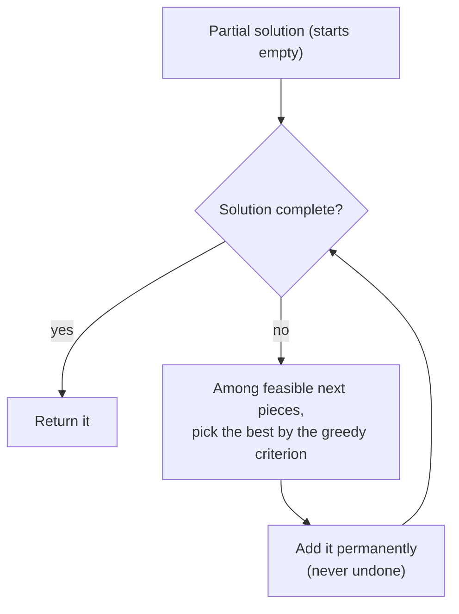
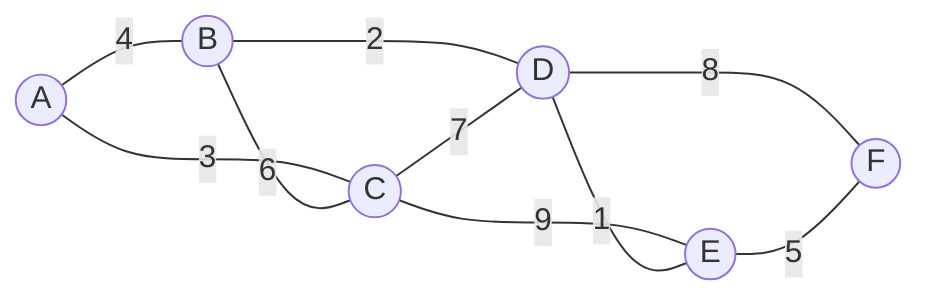
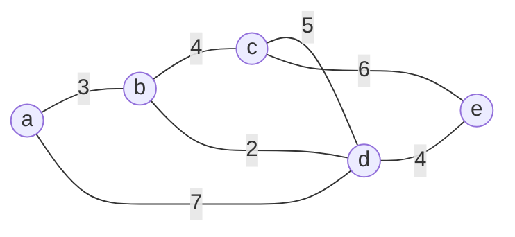
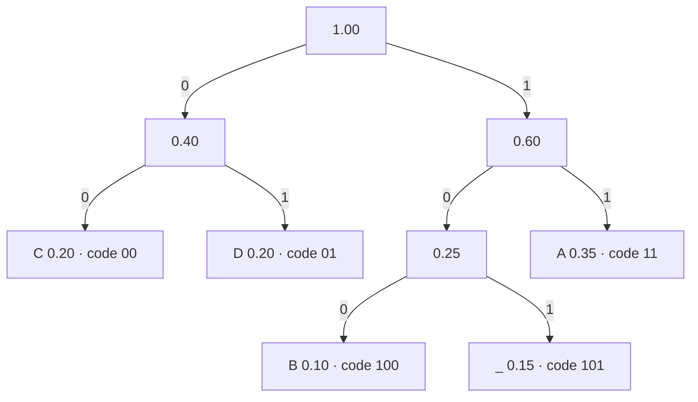

# Chapter 9 · Greedy Technique

A greedy algorithm builds a solution one piece at a time, and at every step it grabs the piece that looks best **right now** — and never takes it back. That sounds naive, and often it is: greedy can be badly wrong. But for a surprising family of problems it is provably optimal *and* blazing fast: making change with ordinary coins, scheduling the most meetings in one room, wiring a network as cheaply as possible with a Minimum Spanning Tree (MST), finding shortest routes (Dijkstra), and compressing files (Huffman codes). This chapter teaches you the algorithms **and** the two proof tools — the *exchange argument* and the *cut property* — that tell you when greedy is safe to trust.

🎮 **Simulations:** [Greedy Graphs (Prim, Kruskal + union-find, Dijkstra)](https://normansrule.github.io/algorithm-forge/sims/greedy-graphs.html) · [Huffman Coding](https://normansrule.github.io/algorithm-forge/sims/huffman.html) · [Greedy Choices (change-making, activity selection, fractional knapsack)](https://normansrule.github.io/algorithm-forge/sims/greedy-choices.html) · [MST: Borůvka & Filter-Kruskal](https://normansrule.github.io/algorithm-forge/sims/mst-modern.html)<br>
🏟️ **Arena problems:** [Chapter 9 set](https://normansrule.github.io/algorithm-forge/arena/?chapter=9)<br>
🐍 **Code:** [`ch09_greedy.py`](../../src/python/algoforge/ch09_greedy.py)<br>
📝 **Practice:** [practice folder](../../practice/)

---

## The big idea in 60 seconds

At every step a greedy algorithm makes a choice that is

- **feasible** — it doesn't break the problem's rules,
- **locally optimal** — it is the best-looking choice among the feasible ones, by some greedy criterion,
- **irrevocable** — once made, it is never undone.

Dynamic Programming (DP) from Chapter 8 considers *all* choices and keeps a table; greedy commits to *one* choice per step and keeps nothing. So greedy is usually simpler and faster — but it is only correct when you can **prove** that the local choice is always part of some optimal solution.



| greedy is **optimal** for | greedy is only a **heuristic / approximation** for |
|---|---|
| change-making with "normal" coin systems (e.g., 25, 10, 5, 1) | change-making with arbitrary coins (e.g., 4, 3, 1) |
| activity selection (earliest finish time) | 0/1 knapsack |
| fractional knapsack | traveling salesman (nearest neighbor) |
| minimum spanning tree (Prim, Kruskal) | graph coloring, set cover, bin packing |
| single-source shortest paths with nonnegative weights (Dijkstra) | shortest paths with negative edges |
| optimal prefix-free codes (Huffman) | Steiner trees |

**How do you prove a greedy algorithm right?** Two standard tools:
1. **Exchange argument:** take any optimal solution that disagrees with the greedy choice and swap the greedy choice in without making it worse. So some optimal solution agrees with greedy; repeat by induction.
2. **Cut property** (for spanning trees): the lightest edge crossing any cut belongs to some MST.

---

## Build Card 1 · Change-Making (greedy)

### 🎯 Problem in one sentence
Given denominations `d1 > d2 > … > dm` (with `dm = 1`) and an amount `n` → give change with the fewest coins by always taking as many of the largest coin as possible.

### 📖 Story
A cashier making 48 cents: a quarter (23 left), two dimes (3 left), three pennies. Six coins, and no one could do better with American coins.

### 👀 See it
[Greedy Choices](https://normansrule.github.io/algorithm-forge/sims/greedy-choices.html) → *Change-making*: switch the coin system to `4, 3, 1` and amount 6 to watch greedy lose against the DP answer.

### 🧱 Build it in blocks
**Block 1 — state:** counts `C[1..m]`, all 0. **Block 2 — loop:** denominations from largest to smallest. **Block 3 — the decision:** take `n div d_i` coins of `d_i`, keep the remainder. **Block 4 — return** `C` (and the total).

### ✋ Trace it by hand

| amount left | coin | how many | remainder |
|---|---|---|---|
| 48 | 25 | 1 | 23 |
| 23 | 10 | 2 | 3 |
| 3 | 5 | 0 | 3 |
| 3 | 1 | 3 | 0 |

**6 coins.** Counterexample: coins `{4, 3, 1}`, amount 6 → greedy 4 + 1 + 1 (3 coins), optimal 3 + 3 (2 coins, found by the DP in [Chapter 8](../08-dynamic-programming/README.md)).

### 💻 Code

```
ALGORITHM GreedyChange(D[1..m], n)
    // D[1] > D[2] > ... > D[m] = 1
    // Output: C[1..m], the number of coins of each denomination
    C ← array(m + 1, 0)
    for i ← 1 to m do
        C[i] ← n div D[i]
        n ← n mod D[i]
    return C
```

<details><summary>Python</summary>

```python
def greedy_change(denoms, amount):
    """denoms in any order; returns the list of coins greedy hands out."""
    coins = []
    for d in sorted(denoms, reverse=True):
        k, amount = divmod(amount, d)
        coins += [d] * k
    return coins
```

</details>

<details><summary>Java</summary>

```java
static List<Integer> greedyChange(int[] denomsDescending, int amount) {
    List<Integer> coins = new ArrayList<>();
    for (int d : denomsDescending)
        while (amount >= d) { coins.add(d); amount -= d; }
    return coins;
}
```

</details>

### 🧮 Analyze it
- **Time** $\Theta(m)$ with `div`/`mod` (after sorting the denominations once).
- **Why it's optimal for 25, 10, 5, 1 (exchange sketch):** an optimal solution never uses 5 pennies (swap for a nickel), 2 nickels (a dime), or 3 dimes (a quarter and a nickel), nor 2 dimes plus a nickel (a quarter). So the pennies, nickels and dimes of an optimal solution total at most 24 cents, meaning it must use exactly `n div 25` quarters — the greedy count — and the same argument repeats for the smaller coins.
- Coin systems for which greedy is always optimal are called *canonical*; checking canonicity is itself an interesting algorithmic problem.

### ⚠️ Common mistakes
- Assuming greedy works for every currency, or for "fewest stamps" with odd postage denominations.
- Forgetting to sort the denominations in decreasing order.

### 🔁 Variations / real software
Vending machines and cash registers use greedy change because national coin systems are designed to be canonical.

---

## Build Card 2 · Activity Selection (interval scheduling)

### 🎯 Problem in one sentence
Given `n` activities with start and end times → choose the **maximum number** of pairwise non-overlapping activities (an activity may start exactly when the previous one ends).

### 📖 Story
One meeting room, many requests. The trick is to ask: "which meeting frees the room **soonest**?" Book it, throw away everything that overlaps it, and repeat. Finishing early leaves the most room for everything else.

### 👀 See it
[Greedy Choices](https://normansrule.github.io/algorithm-forge/sims/greedy-choices.html) → *Activity selection*: intervals are drawn as bars on a timeline; then compare with the other "natural" greedy criteria discussed below (earliest start, shortest duration).

### 🧱 Build it in blocks

**Block 1 — state:** sort activities by end time (ties: earlier start first); `lastEnd ← −∞`; empty answer list.

**Block 2 — loop skeleton:** scan activities in that order.

**Block 3 — the decision:** if the activity starts no earlier than `lastEnd`, take it and set `lastEnd` to its end; otherwise skip it.

**Block 4 — return** the chosen list.

### ✋ Trace it by hand
A classic interview question: `Start = [1, 3, 0, 5, 8, 5]`, `End = [2, 4, 6, 7, 9, 9]`.

Sorted by end time (then start): 0:[1,2], 1:[3,4], 2:[0,6], 3:[5,7], 5:[5,9], 4:[8,9].

| activity (index: [start, end]) | start ≥ lastEnd? | action | lastEnd |
|---|---|---|---|
| 0: [1, 2] | 1 ≥ −∞ | **take** | 2 |
| 1: [3, 4] | 3 ≥ 2 | **take** | 4 |
| 2: [0, 6] | 0 < 4 | skip | 4 |
| 3: [5, 7] | 5 ≥ 4 | **take** | 7 |
| 5: [5, 9] | 5 < 7 | skip | 7 |
| 4: [8, 9] | 8 ≥ 7 | **take** | 9 |

**Answer: 4 activities, indices [0, 1, 3, 4].** (Checked against all 63 non-empty subsets by brute force.)

```
time:     0    1    2    3    4    5    6    7    8    9
act 0          [====]                                      ✔
act 1                    [====]                            ✔
act 2     [==============================]                 ✘
act 3                              [=========]             ✔
act 4                                             [====]   ✔
act 5                              [=====================] ✘
```

Other "natural" greedy rules fail: **earliest start** takes activity 2 ([0, 6]) first and ends with only 2 activities. **Shortest duration** happens to find 4 here, but on `[1,5], [4,7], [6,10]` it takes `[4,7]` (shortest), which blocks both others: 1 activity instead of 2.

### 💻 Code

```
ALGORITHM ActivitySelection(S[0..n-1], E[0..n-1])
    // Assumes activities are already sorted by end time E (ties by start time)
    // Output: list of chosen activity indices
    chosen ← array(0, 0)
    lastEnd ← -∞
    for i ← 0 to n - 1 do
        if S[i] ≥ lastEnd then
            append(chosen, i)
            lastEnd ← E[i]
    return chosen
```

<details><summary>Python</summary>

```python
def activity_selection(start, end):
    """Return original indices of a maximum set of non-overlapping activities."""
    order = sorted(range(len(start)), key=lambda i: (end[i], start[i]))
    chosen, last_end = [], float("-inf")
    for i in order:
        if start[i] >= last_end:
            chosen.append(i)
            last_end = end[i]
    return chosen
```

</details>

<details><summary>Java</summary>

```java
static List<Integer> activitySelection(int[] start, int[] end) {
    Integer[] order = new Integer[start.length];
    for (int i = 0; i < order.length; i++) order[i] = i;
    Arrays.sort(order, Comparator.<Integer>comparingInt(i -> end[i]).thenComparingInt(i -> start[i]));
    List<Integer> chosen = new ArrayList<>();
    long lastEnd = Long.MIN_VALUE;
    for (int i : order)
        if (start[i] >= lastEnd) { chosen.add(i); lastEnd = end[i]; }
    return chosen;
}
```

</details>

### 🧮 Analyze it
- **Time** $\Theta(n \log n)$ for sorting plus $\Theta(n)$ for the scan. **Space** $\Theta(n)$.
- **Correctness — the exchange argument.** Let `g` be the activity that ends first. Take *any* optimal schedule `O` and let `o` be its earliest-ending activity. Since `g` ends no later than `o`, and every other activity in `O` starts after `o` ends, replacing `o` by `g` creates no overlap. The new schedule has the same size, so it is also optimal — and it contains the greedy choice `g`. Remove `g` and everything overlapping it; what remains is a smaller instance of the same problem, and the optimal schedule minus `g` is optimal for it (optimal substructure). By induction, greedy's choices at every step extend to an optimal schedule, so greedy's final count equals the optimum.

### ⚠️ Common mistakes
- Sorting by start time or by duration.
- Using `>` instead of `≥` when "touching" intervals are allowed (or vice versa, when they aren't) — read the problem statement.
- Returning sorted positions instead of the original indices.

### 🔁 Variations / real software
Weighted interval scheduling (each activity has a value) needs DP, not greedy. "Minimum number of rooms to hold all meetings" (interval partitioning) is another greedy: sort by start and reuse the room that frees up earliest (a min-heap of end times). Calendar apps and cloud job schedulers use these patterns.

---

## Build Card 3 · Fractional Knapsack (and why 0/1 is different)

### 🎯 Problem in one sentence
Given items with weights and values and a capacity `W`, where you may take **any fraction** of an item → maximize total value by taking items in decreasing order of **value per unit weight**.

### 📖 Story
Filling a 5 kg bag at a bulk-food store with nuts, dried fruit and spices sold by weight. You scoop the most valuable-per-kilogram item first, then the next, and top the bag off with a partial scoop.

### 👀 See it
[Greedy Choices](https://normansrule.github.io/algorithm-forge/sims/greedy-choices.html) → *Fractional knapsack*: the bag fills item by item in ratio order, with a partial scoop at the end.

### 🧱 Build it in blocks
**Block 1 — state:** sort items by ratio `v_i / w_i`, descending; `cap ← W`; `total ← 0`. **Block 2 — loop:** items in that order while `cap > 0`. **Block 3 — decision:** take fraction `f = min(1, cap / w_i)`; add `f · v_i`; subtract `f · w_i`. **Block 4 — return** `total`.

### ✋ Trace it by hand
The Chapter 8 knapsack instance, `W = 5`: items 1: (2, 12), 2: (1, 10), 3: (3, 20), 4: (2, 15).

| item | ratio v/w | take | capacity left | value so far |
|---|---|---|---|---|
| 2 | 10.0 | all (1) | 4 | 10 |
| 4 | 7.5 | all (2) | 2 | 25 |
| 3 | 6.67 | 2/3 of it | 0 | 25 + 13.33 = **38.33** |

The fractional optimum 38.33 is an *upper bound* for the 0/1 version (whose true optimum is 37). That bound is exactly what branch-and-bound uses in [Chapter 12](../12-coping-with-limitations/README.md).

**Why greedy fails for 0/1:** capacity 6, items A: (4, 20) ratio 5.0, B: (3, 14) ratio 4.67, C: (3, 14) ratio 4.67. Greedy by ratio takes A (weight 4), then neither B nor C fits: value **20**. Optimal: B + C = **28**. With whole items, a great ratio can waste capacity; with fractions, it never does.

### 💻 Code

```
ALGORITHM FractionalKnapsack(Weights[0..n-1], Values[0..n-1], W)
    // Assumes items are sorted by Values[i] / Weights[i] in decreasing order
    total ← 0
    cap ← W
    for i ← 0 to n - 1 do
        if cap = 0 then
            return total
        f ← min(1, cap / Weights[i])
        total ← total + f * Values[i]
        cap ← cap - f * Weights[i]
    return total
```

<details><summary>Python</summary>

```python
def fractional_knapsack(weights, values, cap):
    order = sorted(range(len(weights)), key=lambda i: values[i] / weights[i], reverse=True)
    total = 0.0
    for i in order:
        if cap <= 0:
            break
        f = min(1.0, cap / weights[i])
        total += f * values[i]
        cap -= f * weights[i]
    return total
```

</details>

<details><summary>Java</summary>

```java
static double fractionalKnapsack(int[] w, int[] v, double cap) {
    Integer[] order = new Integer[w.length];
    for (int i = 0; i < order.length; i++) order[i] = i;
    Arrays.sort(order, (a, b) -> Double.compare((double) v[b] / w[b], (double) v[a] / w[a]));
    double total = 0;
    for (int i : order) {
        if (cap <= 0) break;
        double f = Math.min(1.0, cap / w[i]);
        total += f * v[i];
        cap -= f * w[i];
    }
    return total;
}
```

</details>

### 🧮 Analyze it
- **Time** $\Theta(n \log n)$ (sorting); $\Theta(n)$ is possible with a linear-time selection of the "split" item.
- **Exchange argument:** if an optimal solution holds some weight of a lower-ratio item while a higher-ratio item isn't fully taken, swap an equal weight — value can only go up. So an optimal solution fills items in ratio order, which is what greedy does.

### ⚠️ Common mistakes
- Sorting by value or by weight instead of by ratio.
- Applying this algorithm to 0/1 knapsack and calling it optimal.

### 🔁 Variations / real software
Linear-programming relaxations (Chapter 10) generalize "allow fractions to get an easy bound"; greedy-by-ratio is also the standard quick heuristic for 0/1 knapsack in practice (take the better of greedy and the single most valuable item for a 2-approximation).

---

## Build Card 4 · Prim's Algorithm (Minimum Spanning Tree)

### 🎯 Problem in one sentence
Given a connected, weighted, undirected graph → find a **spanning tree** (connects all vertices, no cycles) of minimum total edge weight, by growing one tree from a start vertex, always attaching the closest outside vertex.

### 📖 Story
Laying fiber between six buildings on a campus. Start at the server room. Repeatedly ask, "Of all buildings not yet connected, which one can I reach with the shortest new cable from **any** building already connected?" Lay that cable. Stop when everyone is connected.

### 👀 See it
[Greedy Graphs](https://normansrule.github.io/algorithm-forge/sims/greedy-graphs.html) → *Prim*: tree vertices are filled, fringe vertices show their label `(parent, weight)`, and the chosen edge flashes.

Our example graph (vertices A–F):



### 🧱 Build it in blocks

**Block 1 — state.** For every vertex outside the tree, a label `(parent, d)`: the cheapest known edge connecting it to the tree. Start vertex has `d = 0`; everyone else `∞`.

**Block 2 — loop skeleton:** repeat `n` times: pick the outside vertex with the smallest `d` (a priority queue does this), move it into the tree.

**Block 3 — the update:** for each neighbor `v` of the new tree vertex `u` still outside, if `w(u, v) < d(v)`, relabel `v` with `(u, w(u, v))`.

**Block 4 — return** the edges `(parent(v), v)` — `n − 1` of them — and their total weight.

### ✋ Trace it by hand
Start at A.

| step | tree vertices | fringe labels `vertex(parent, weight)` after the previous update | pick |
|---|---|---|---|
| 1 | A | B(A, 4), C(A, 3), D(−, ∞), E(−, ∞), F(−, ∞) | **C** via A–C (3) |
| 2 | A, C | B(A, 4), D(C, 7), E(C, 9), F(−, ∞) | **B** via A–B (4) |
| 3 | A, C, B | D(B, 2), E(C, 9), F(−, ∞) | **D** via B–D (2) |
| 4 | A, C, B, D | E(D, 1), F(D, 8) | **E** via D–E (1) |
| 5 | A, C, B, D, E | F(E, 5) | **F** via E–F (5) |

MST edges: A–C 3, A–B 4, B–D 2, D–E 1, E–F 5. **Total weight 15.** Notice step 2: B–C (6) would also connect B, but A–B (4) is the cheaper label, and step 3 shows D's label improving from 7 (via C) to 2 (via B).

### 💻 Code

```
ALGORITHM Prim(W[0..n-1, 0..n-1])
    // W[i, j] = edge weight, ∞ if no edge. Array-based "priority queue": O(n^2)
    // Output: parent[0..n-1]; the MST edges are (parent[v], v) for v ≠ 0
    inTree ← array(n, false)
    d ← array(n, ∞)
    parent ← array(n, -1)
    d[0] ← 0
    for step ← 1 to n do
        u ← -1
        for v ← 0 to n - 1 do
            if not inTree[v] and (u = -1 or d[v] < d[u]) then
                u ← v
        inTree[u] ← true
        for v ← 0 to n - 1 do
            if not inTree[v] and W[u, v] < d[v] then
                d[v] ← W[u, v]
                parent[v] ← u
    return parent
```

<details><summary>Python</summary>

```python
import heapq

def prim(adj, start):
    """adj: {u: {v: weight}} for an undirected connected graph.
    Returns (total weight, list of MST edges (parent, child, weight)).  O(m log n)."""
    in_tree, edges, total = {start}, [], 0
    heap = [(w, start, v) for v, w in adj[start].items()]
    heapq.heapify(heap)
    while heap and len(in_tree) < len(adj):
        w, u, v = heapq.heappop(heap)
        if v in in_tree:
            continue                      # stale entry: v was attached more cheaply already
        in_tree.add(v)
        edges.append((u, v, w))
        total += w
        for x, wx in adj[v].items():
            if x not in in_tree:
                heapq.heappush(heap, (wx, v, x))
    return total, edges
```

</details>

<details><summary>Java</summary>

```java
// adjacency list: adj.get(u) holds int[]{v, weight}
static int prim(List<List<int[]>> adj, int start) {
    int n = adj.size(), total = 0;
    boolean[] inTree = new boolean[n];
    PriorityQueue<int[]> pq = new PriorityQueue<>(Comparator.comparingInt(e -> e[1])); // {vertex, weight}
    pq.add(new int[] { start, 0 });
    while (!pq.isEmpty()) {
        int[] top = pq.poll();
        int u = top[0];
        if (inTree[u]) continue;                   // stale entry
        inTree[u] = true;
        total += top[1];
        for (int[] e : adj.get(u))
            if (!inTree[e[0]]) pq.add(new int[] { e[0], e[1] });
    }
    return total;
}
```

</details>

### 🧮 Analyze it
- **Time:** $O(n^2)$ with a weight matrix and an array scan (best for dense graphs); $O(m \log n)$ with adjacency lists and a binary min-heap (best for sparse graphs); $O(m + n \log n)$ with a Fibonacci heap.
- **Correctness — the cut property.** For any split (cut) of the vertices into two groups, a lightest edge crossing the cut belongs to some MST. *Proof sketch:* take an MST `T` that doesn't contain the lightest crossing edge `e = (u, v)`. Adding `e` to `T` creates a cycle; that cycle must cross the cut a second time, through some edge `e'` with `w(e') ≥ w(e)`. Swap `e'` out for `e`: still a spanning tree, weight no larger — so it is an MST containing `e`. Prim's choice at every step is exactly the lightest edge crossing the cut (tree vertices | the rest), so by induction every edge it adds belongs to an MST.

### ⚠️ Common mistakes
- Forgetting to skip stale heap entries in the lazy version (you'd add a vertex twice).
- Summing path lengths from the start (that's Dijkstra) instead of single edge weights.
- Running it on a disconnected graph and expecting a tree (you get a tree for one component only).

### 🔁 Variations / real software
Network design (cable, pipes, roads), approximation algorithms (MST-based 2-approximation for the metric Traveling Salesman Problem (TSP) in Chapter 12), and image segmentation on pixel-similarity graphs.

---

## Build Card 5 · Kruskal's Algorithm with Union-Find

### 🎯 Problem in one sentence
Same problem as Prim — find an MST — but by scanning **all edges in increasing weight order** and adding an edge whenever it joins two different components (i.e., creates no cycle).

### 📖 Story
Building roads between villages with a list of possible roads sorted by cost. Take the cheapest road; then the next cheapest, unless both ends are already connected by roads you've built (that road would be redundant). Keep going until every village is connected. The "are they already connected?" check is the job of the **union-find** data structure.

### 👀 See it
[Greedy Graphs](https://normansrule.github.io/algorithm-forge/sims/greedy-graphs.html) → *Kruskal*: components are colored, so you can see `find` and `union` at work. More union-find detail: [Union-Find lab](https://normansrule.github.io/algorithm-forge/sims/union-find.html) ([Chapter 13](../13-advanced-data-structures/README.md)).

### 🧱 Build it in blocks

**Block 1 — state:** edges sorted by weight; each vertex in its own set (`parent[v] = v`, `size[v] = 1`); empty tree.

**Block 2 — loop skeleton:** for each edge `(u, v)` in sorted order, stop once the tree has `n − 1` edges.

**Block 3 — the decision:** if `Find(u) ≠ Find(v)`, add the edge and `Union` the two sets; otherwise the edge would close a cycle — skip it.

**Block 4 — return** the tree edges.

**Union-find, two ways:**

| implementation | `find` | `union` | idea |
|---|---|---|---|
| quick-find | $O(1)$ | $O(n)$ | every element stores its set's name; union relabels a whole set |
| quick-union + **union by size** | $O(\log n)$ | $O(\log n)$ | forest of trees; attach the smaller tree under the larger root, so depth ≤ log n |
| … + **path compression** | amortized $O(\alpha(n))$ | amortized $O(\alpha(n))$ | during `find`, point visited nodes (closer) to the root |

$\alpha(n)$ is the inverse Ackermann function, at most 4 for any input that fits in our universe — effectively constant.

### ✋ Trace it by hand
Same graph as Prim. Sorted edges: D–E 1, B–D 2, A–C 3, A–B 4, E–F 5, B–C 6, C–D 7, D–F 8, C–E 9.

| edge | weight | Find(u) = Find(v)? | action | components afterwards |
|---|---|---|---|---|
| D–E | 1 | no | **add** | {A} {B} {C} {D,E} {F} |
| B–D | 2 | no | **add** | {A} {B,D,E} {C} {F} |
| A–C | 3 | no | **add** | {A,C} {B,D,E} {F} |
| A–B | 4 | no | **add** | {A,B,C,D,E} {F} |
| E–F | 5 | no | **add** | {A,B,C,D,E,F} — 5 edges, done |
| B–C, C–D, D–F, C–E | 6–9 | yes | skip (would form a cycle) | — |

Same MST as Prim, **total 15** (here the MST is unique because all weights are distinct).

### 💻 Code

```
ALGORITHM Find(parent[0..n-1], x)
    root ← x
    while parent[root] ≠ root do
        root ← parent[root]
    while parent[x] ≠ root do          // path compression
        next ← parent[x]
        parent[x] ← root
        x ← next
    return root

ALGORITHM Kruskal(n, U[0..m-1], V[0..m-1], Wt[0..m-1])
    // Edges (U[i], V[i]) with weight Wt[i], already sorted by weight
    // Output: total MST weight
    parent ← array(n, 0)
    size ← array(n, 1)
    for v ← 0 to n - 1 do
        parent[v] ← v
    total ← 0
    count ← 0
    for i ← 0 to m - 1 do
        ru ← Find(parent, U[i])
        rv ← Find(parent, V[i])
        if ru ≠ rv then
            if size[ru] < size[rv] then
                swap ru and rv
            parent[rv] ← ru             // union by size: small tree under big root
            size[ru] ← size[ru] + size[rv]
            total ← total + Wt[i]
            count ← count + 1
            if count = n - 1 then
                return total
    return total
```

<details><summary>Python</summary>

```python
class UnionFind:
    def __init__(self, items):
        self.parent = {x: x for x in items}
        self.size = {x: 1 for x in items}

    def find(self, x):
        root = x
        while self.parent[root] != root:
            root = self.parent[root]
        while self.parent[x] != root:              # path compression
            self.parent[x], x = root, self.parent[x]
        return root

    def union(self, a, b):
        ra, rb = self.find(a), self.find(b)
        if ra == rb:
            return False
        if self.size[ra] < self.size[rb]:
            ra, rb = rb, ra
        self.parent[rb] = ra                       # union by size
        self.size[ra] += self.size[rb]
        return True

def kruskal(vertices, edges):
    """edges: list of (weight, u, v). Returns (total, MST edges)."""
    uf, tree, total = UnionFind(vertices), [], 0
    for w, u, v in sorted(edges):
        if uf.union(u, v):
            tree.append((u, v, w))
            total += w
            if len(tree) == len(vertices) - 1:
                break
    return total, tree
```

</details>

<details><summary>Java</summary>

```java
static int[] ufParent, ufSize;

static int find(int x) {
    int root = x;
    while (ufParent[root] != root) root = ufParent[root];
    while (ufParent[x] != root) { int next = ufParent[x]; ufParent[x] = root; x = next; }
    return root;
}

static int kruskal(int n, int[][] edges) {            // edges: {u, v, weight}
    int[][] sorted = edges.clone();
    Arrays.sort(sorted, Comparator.comparingInt(e -> e[2]));
    ufParent = new int[n]; ufSize = new int[n];
    for (int v = 0; v < n; v++) { ufParent[v] = v; ufSize[v] = 1; }
    int total = 0, count = 0;
    for (int[] e : sorted) {
        int ru = find(e[0]), rv = find(e[1]);
        if (ru == rv) continue;                        // would close a cycle
        if (ufSize[ru] < ufSize[rv]) { int t = ru; ru = rv; rv = t; }
        ufParent[rv] = ru;
        ufSize[ru] += ufSize[rv];
        total += e[2];
        if (++count == n - 1) break;
    }
    return total;
}
```

</details>

### 🧮 Analyze it
- **Time** $O(m \log m)$ — dominated by sorting the edges; the union-find work is $O(m\,\alpha(n))$. Since $m \le n^2$, $\log m \le 2\log n$, so this is also $O(m \log n)$.
- **Correctness:** when Kruskal accepts edge `e = (u, v)`, consider the cut (u's component | everything else). No lighter edge crosses it (all lighter edges were already processed and either accepted or found to lie inside one component), so `e` is a lightest crossing edge — by the cut property it belongs to an MST.

### ⚠️ Common mistakes
- Detecting cycles by running a Depth-First Search (DFS) for every edge — correct but $O(mn)$. Use union-find.
- Union without "by size/rank": trees can degenerate into chains and `find` becomes $O(n)$.
- Forgetting that the result is a *forest* if the graph is disconnected.

### 🔁 Variations / real software
Single-linkage clustering is Kruskal stopped early (stop at `k` components → `k` clusters). Union-find itself is used for connected components in images, percolation simulations, and equivalence of variables in compilers and type checkers.

**Prim or Kruskal?** Dense graph given as a matrix → Prim with the $O(n^2)$ array version. Sparse edge list → Kruskal (or Prim with a heap). Edges arriving already sorted, or you want clusters → Kruskal.

### 📐 Side note: MST vs Steiner tree
An MST may only use the given vertices as junctions. If you may add **extra junction points** anywhere, you can do better. Four villages at the corners of a unit square: the MST uses three sides, length **3**. The shortest network with two extra junctions, where roads meet at 120° angles, has length $1 + \sqrt{3} \approx$ **2.732** — about 9% shorter. That is a *Steiner tree*. Finding optimal Steiner trees is NP-hard (NP = Nondeterministic Polynomial time; see Chapter 11), and an MST-based heuristic is a classic 2-approximation for it.

---

## Build Card 6 · Dijkstra's Algorithm (single-source shortest paths)

### 🎯 Problem in one sentence
Given a weighted graph (directed or undirected) with **nonnegative** edge weights and a source `s` → find the length of the shortest path from `s` to every vertex, plus the paths themselves (as a tree of parent pointers).

### 📖 Story
Pour water in at the source and let it flow along pipes whose lengths are the edge weights. Vertices get wet in order of their distance from the source. Dijkstra simulates that: it always "wets" (finalizes) the not-yet-final vertex that is closest to the source, then updates its neighbors' best-known distances.

### 👀 See it
[Greedy Graphs](https://normansrule.github.io/algorithm-forge/sims/greedy-graphs.html) → *Dijkstra*: each vertex shows its two labels `(parent, d)`; relaxations update the labels, and the shortest-path tree grows. Then add a negative edge and compare with the counterexample below.

The standard example graph (undirected, as in Levitin §9.3):



### 🧱 Build it in blocks

**Block 1 — labels.** Every vertex gets `d(v)` = length of the shortest path found so far (`∞` initially, `0` for `s`) and `parent(v)`.

**Block 2 — loop skeleton:** repeat until every reachable vertex is final: pick the non-final vertex `u` with the smallest `d(u)` (priority queue), make it final.

**Block 3 — the relaxation:** for each edge `(u, v)` with `v` not final:
if `d(u) + w(u, v) < d(v)` then `d(v) ← d(u) + w(u, v)` and `parent(v) ← u`.

**Block 4 — return** `d` and `parent`; the path to `v` is `v, parent(v), parent(parent(v)), …, s` read backwards.

### ✋ Trace it by hand
Source `a` (Levitin's table format: final "tree vertices" on the left, labels of the others on the right):

| tree vertex added | remaining vertices `vertex(parent, d)` after relaxing its edges |
|---|---|
| a(−, 0) | b(a, 3) · c(−, ∞) · d(a, 7) · e(−, ∞) |
| b(a, 3) | c(b, 3+4 = 7) · d(b, 3+2 = 5) · e(−, ∞) |
| d(b, 5) | c(b, 7) · e(d, 5+4 = 9) |
| c(b, 7) | e(d, 9) |
| e(d, 9) | — |

**Distances: a 0, b 3, d 5, c 7, e 9.** Shortest paths: a–b (3); a–b–d (5); a–b–c (7); a–b–d–e (9).

Two relaxations that *didn't* happen are worth noticing: when `d` became final (5), the edge d–c offered `5 + 5 = 10 > 7`, so c kept its label; when `c` became final (7), c–e offered `7 + 6 = 13 > 9`. (Removing the c–d edge of weight 5 changes nothing — we checked both versions.)

**Why negative edges break it — a concrete counterexample.** Directed graph: s→a (2), s→b (3), b→a (−2), a→t (1).

| step | finalize | labels afterwards |
|---|---|---|
| 1 | s (0) | a(s, 2), b(s, 3), t(−, ∞) |
| 2 | a (2) — smallest label, now "final" | b(s, 3), t(a, 3) |
| 3 | b (3) | edge b→a offers 3 − 2 = **1 < 2**, but a is already final — too late |
| 4 | t (3) | — |

Dijkstra reports `a = 2, t = 3`. The truth is `a = 1` (s→b→a) and `t = 2` (s→b→a→t). The proof below relies on "extending a path never makes it shorter"; a negative edge breaks exactly that. Use Bellman–Ford ([Chapter 14](../14-advanced-graphs/README.md)) when weights can be negative.

### 💻 Code

```
ALGORITHM Dijkstra(W[0..n-1, 0..n-1], s)
    // W[i, j] = weight of edge i → j (∞ if none), all weights ≥ 0
    // Output: dist[0..n-1] and parent[0..n-1]
    final ← array(n, false)
    dist ← array(n, ∞)
    parent ← array(n, -1)
    dist[s] ← 0
    for step ← 1 to n do
        u ← -1
        for v ← 0 to n - 1 do
            if not final[v] and (u = -1 or dist[v] < dist[u]) then
                u ← v
        if dist[u] = ∞ then
            return dist, parent          // the rest is unreachable
        final[u] ← true
        for v ← 0 to n - 1 do
            if not final[v] and dist[u] + W[u, v] < dist[v] then
                dist[v] ← dist[u] + W[u, v]
                parent[v] ← u
    return dist, parent
```

<details><summary>Python</summary>

```python
import heapq

def dijkstra(adj, source):
    """adj: {u: {v: weight >= 0}}. Returns (dist, parent). O((n + m) log n)."""
    dist = {v: float("inf") for v in adj}
    parent = {v: None for v in adj}
    dist[source] = 0
    heap, done = [(0, source)], set()
    while heap:
        d, u = heapq.heappop(heap)
        if u in done:
            continue                             # stale entry
        done.add(u)
        for v, w in adj[u].items():
            if v not in done and d + w < dist[v]:
                dist[v], parent[v] = d + w, u
                heapq.heappush(heap, (dist[v], v))
    return dist, parent

def path_to(parent, v):
    out = []
    while v is not None:
        out.append(v)
        v = parent[v]
    return out[::-1]
```

</details>

<details><summary>Java</summary>

```java
// adj.get(u) holds int[]{v, weight}; returns shortest distances from source
static long[] dijkstra(List<List<int[]>> adj, int source) {
    int n = adj.size();
    long[] dist = new long[n];
    Arrays.fill(dist, Long.MAX_VALUE);
    dist[source] = 0;
    PriorityQueue<long[]> pq = new PriorityQueue<>(Comparator.comparingLong(e -> e[1])); // {vertex, dist}
    pq.add(new long[] { source, 0 });
    while (!pq.isEmpty()) {
        long[] top = pq.poll();
        int u = (int) top[0];
        if (top[1] > dist[u]) continue;           // stale entry
        for (int[] e : adj.get(u)) {
            long nd = dist[u] + e[1];
            if (nd < dist[e[0]]) {
                dist[e[0]] = nd;
                pq.add(new long[] { e[0], nd });
            }
        }
    }
    return dist;
}
```

</details>

### 🧮 Analyze it
- **Time:** $O(n^2)$ with a weight matrix and array scans (dense graphs); $O(m \log n)$ with adjacency lists and a binary heap; $O(m + n \log n)$ with a Fibonacci heap (the best known bound for this approach).
- **Correctness (why the greedy choice is safe).** Claim: when `u` is chosen, `d(u)` is the true distance. Take any path from `s` to `u`. It starts inside the set of final vertices and must leave it through some first edge `(x, y)` with `y` not final. Then its length ≥ `d(x) + w(x, y)` ≥ `d(y)` ≥ `d(u)` — the first inequality because the rest of the path has **nonnegative** length, the last because `u` had the smallest label. So no path beats `d(u)`.

### ⚠️ Common mistakes
- Running it with negative edges (see the counterexample).
- Stopping the lazy heap version too early or not skipping stale entries.
- Confusing it with Prim (next section).
- Using it for "longest path" by negating weights — that creates negative edges.

### 🔁 Variations / real software
Link-state routing protocols such as Open Shortest Path First (OSPF) and Intermediate System to Intermediate System (IS-IS) run Dijkstra on each router to build its forwarding table. Map and navigation engines use Dijkstra's descendants (A* search with a distance heuristic, bidirectional search, contraction hierarchies). For unweighted graphs, Breadth-First Search (BFS) is Dijkstra with a plain queue.

### ⚖️ Prim vs Dijkstra, side by side
They look almost identical — grow a tree from a start vertex, always add the "closest" fringe vertex — but they measure "closest" differently.

| | Prim | Dijkstra |
|---|---|---|
| problem | minimum spanning tree | shortest paths from one source |
| label of fringe vertex `v` | weight of the **single cheapest edge** from the tree to `v` | length of the **whole path** `s → … → u → v` |
| update rule | `d(v) ← min(d(v), w(u, v))` | `d(v) ← min(d(v), d(u) + w(u, v))` |
| graphs | undirected | directed or undirected |
| negative weights | fine | breaks |
| output tree minimizes | total edge weight | each vertex's distance from `s` |

Tiny example: triangle X–Y (2), Y–Z (2), X–Z (3). MST = {X–Y, Y–Z}, total 4. Shortest-path tree from X = {X–Y, X–Z}, total 5 — but Z is 3 away from X instead of 4. **Different objectives, different trees.**

---

## Build Card 7 · Huffman Coding

### 🎯 Problem in one sentence
Given symbols with known frequencies → build a **prefix-free binary code** (no codeword is a prefix of another) that minimizes the average number of bits per symbol, by repeatedly merging the two least-frequent trees.

### 📖 Story
Morse code already had the right idea: frequent letters (E is a single dot) get short codes, rare letters get long ones. Huffman made it optimal and unambiguous: build a binary tree bottom-up, always joining the two rarest "clusters" first, so rare symbols sink deep (long codes) and common ones stay near the root (short codes). Reading the path from the root to a leaf — 0 for left, 1 for right — gives that leaf's codeword.

### 👀 See it
[Huffman Coding](https://normansrule.github.io/algorithm-forge/sims/huffman.html): the forest of weighted trees merges step by step; type any text to build its code and see the compressed bit length.

### 🧱 Build it in blocks

**Block 1 — state:** a min-priority queue of one-node trees, one per symbol, weighted by frequency.

**Block 2 — loop skeleton:** repeat `n − 1` times (each merge reduces the number of trees by one).

**Block 3 — the greedy choice:** remove the two trees of smallest weight, make them the left and right children of a new node whose weight is their sum, insert it back.

**Block 4 — return** the last tree; assign codewords by walking it (left edge = 0, right edge = 1).

### ✋ Trace it by hand — the Levitin §9.4 example
| symbol | A | B | C | D | _ |
|---|---|---|---|---|---|
| frequency | 0.35 | 0.10 | 0.20 | 0.20 | 0.15 |

Merges:
1. B (0.10) + _ (0.15) → 0.25
2. C (0.20) + D (0.20) → 0.40
3. {B,_} (0.25) + A (0.35) → 0.60
4. {C,D} (0.40) + {B,_,A} (0.60) → 1.00



| symbol | A | B | C | D | _ |
|---|---|---|---|---|---|
| codeword | 11 | 100 | 00 | 01 | 101 |
| length | 2 | 3 | 2 | 2 | 3 |

Average length $= 2(0.35) + 3(0.10) + 2(0.20) + 2(0.20) + 3(0.15) = 0.70 + 0.30 + 0.40 + 0.40 + 0.45 =$ **2.25 bits per symbol**. A fixed-length code for 5 symbols needs 3 bits, so the compression ratio is $(3 - 2.25)/3 =$ **25%**. Decoding `1001101101` is unambiguous because the code is prefix-free: `100 | 11 | 01 | 101` → **BAD_**.

### ✋ Trace it by hand — a practice instance (ties!)
| symbol | A | B | C | D | E |
|---|---|---|---|---|---|
| probability | 0.1 | 0.1 | 0.2 | 0.2 | 0.4 |

After the first merge (A + B → 0.2) there are **three** trees of weight 0.2 (AB, C, D), and later a tie at 0.4. Different tie-breaking gives different — equally optimal — trees:

**Tree 1 (on ties, merge the original single-symbol trees first):** A+B → 0.2; C+D → 0.4; AB+E → 0.6; CD+ABE → 1.0.

| symbol | A | B | C | D | E |
|---|---|---|---|---|---|
| codeword | 100 | 101 | 00 | 01 | 11 |
| length $l$ | 3 | 3 | 2 | 2 | 2 |

**Tree 2 (on ties, merge the newest combined tree first):** A+B → 0.2; AB+D → 0.4; C+ABD → 0.6; E+CABD → 1.0.

| symbol | A | B | C | D | E |
|---|---|---|---|---|---|
| codeword | 1100 | 1101 | 10 | 111 | 0 |
| length $l$ | 4 | 4 | 2 | 3 | 1 |

Both averages are equal:
- Tree 1: $0.1(3) + 0.1(3) + 0.2(2) + 0.2(2) + 0.4(2) = 2.2$
- Tree 2: $0.1(4) + 0.1(4) + 0.2(2) + 0.2(3) + 0.4(1) = 2.2$

The **variances** $\sum_i p_i (l_i - \bar{l})^2$ are not:
- Tree 1: $0.1(0.8)^2 \cdot 2 + 0.2(0.2)^2 \cdot 2 + 0.4(0.2)^2 = 0.128 + 0.016 + 0.016 =$ **0.16**
- Tree 2: $0.1(1.8)^2 \cdot 2 + 0.2(0.2)^2 + 0.2(0.8)^2 + 0.4(1.2)^2 = 0.648 + 0.008 + 0.128 + 0.576 =$ **1.36**

For data transmission (steadier bit rates, smaller buffers) prefer **Tree 1**, the minimum-variance code — obtained by merging the *oldest* trees first on ties. Compared with a 3-bit fixed code, both save $(3 - 2.2)/3 \approx$ 26.7%.

### 💻 Code

```
ALGORITHM Huffman(Symbols[0..n-1], Freq[0..n-1])
    // Q is a min-priority queue of trees keyed by weight (ties: the older tree comes out first)
    // A tree is a record with .weight, plus .symbol for a leaf or .left and .right for an internal node
    Q ← priorityQueue()
    for i ← 0 to n - 1 do
        leaf ← new Node
        leaf.symbol ← Symbols[i]
        leaf.weight ← Freq[i]
        insert(Q, leaf, leaf.weight)
    for step ← 1 to n - 1 do
        T1 ← deleteMin(Q)
        T2 ← deleteMin(Q)
        t ← new Node
        t.left ← T1                      // T1 = left (0)
        t.right ← T2                     // T2 = right (1)
        t.weight ← T1.weight + T2.weight
        insert(Q, t, t.weight)
    return deleteMin(Q)

ALGORITHM Codewords(t, prefix, codes)
    // Fills the map codes with symbol → codeword; call Codewords(root, "", map())
    if t.left = null then
        codes[t.symbol] ← prefix
    else
        Codewords(t.left, prefix + "0", codes)
        Codewords(t.right, prefix + "1", codes)
    return codes
```

<details><summary>Python</summary>

```python
import heapq
from itertools import count

def huffman_codes(freq):
    """freq: {symbol: weight}. Ties are broken in favor of older trees (min-variance)."""
    tick = count()
    heap = [(w, next(tick), sym) for sym, w in freq.items()]
    heapq.heapify(heap)
    if len(heap) == 1:
        return {heap[0][2]: "0"}
    while len(heap) > 1:
        w1, _, t1 = heapq.heappop(heap)
        w2, _, t2 = heapq.heappop(heap)
        heapq.heappush(heap, (w1 + w2, next(tick), (t1, t2)))
    codes = {}

    def walk(tree, prefix):
        if isinstance(tree, tuple):
            walk(tree[0], prefix + "0")
            walk(tree[1], prefix + "1")
        else:
            codes[tree] = prefix

    walk(heap[0][2], "")
    return codes

def average_length(freq, codes):
    return sum(freq[s] * len(codes[s]) for s in freq) / sum(freq.values())
```

</details>

<details><summary>Java</summary>

```java
static class HNode {
    final double w; final long order; final Character sym; final HNode left, right;
    HNode(double w, long order, Character sym, HNode l, HNode r) {
        this.w = w; this.order = order; this.sym = sym; left = l; right = r;
    }
}

static Map<Character, String> huffman(Map<Character, Double> freq) {
    PriorityQueue<HNode> pq = new PriorityQueue<>(
        Comparator.comparingDouble((HNode h) -> h.w).thenComparingLong(h -> h.order));
    long tick = 0;
    for (Map.Entry<Character, Double> e : freq.entrySet())
        pq.add(new HNode(e.getValue(), tick++, e.getKey(), null, null));
    while (pq.size() > 1) {
        HNode a = pq.poll(), b = pq.poll();
        pq.add(new HNode(a.w + b.w, tick++, null, a, b));
    }
    Map<Character, String> codes = new TreeMap<>();
    assign(pq.poll(), "", codes);
    return codes;
}

static void assign(HNode t, String prefix, Map<Character, String> codes) {
    if (t.sym != null) { codes.put(t.sym, prefix.isEmpty() ? "0" : prefix); return; }
    assign(t.left, prefix + "0", codes);
    assign(t.right, prefix + "1", codes);
}
```

</details>

### 🧮 Analyze it
- **Time** $O(n \log n)$ with a binary heap ($n - 1$ merges, each $O(\log n)$); $O(n)$ if the frequencies are already sorted (two-queue method).
- **Correctness sketch (exchange + optimal substructure).** (1) In some optimal tree, the two least-frequent symbols are siblings at the deepest level: if a deeper leaf had a higher frequency, swapping it with a rarer symbol can only reduce the average length. (2) Merging those two siblings into one symbol of combined weight gives a smaller instance whose optimal tree, expanded again, is optimal for the original — the average length changes by exactly the merged weight either way. Induction on `n` finishes the proof.
- Huffman is optimal among **symbol-by-symbol** prefix codes. Its average length $\bar l$ satisfies $H \le \bar l < H + 1$, where $H = -\sum p_i \log_2 p_i$ is the entropy (for the Levitin §9.4 example $H \approx 2.20$ bits vs 2.25).

### ⚠️ Common mistakes
- Merging the two *largest* trees, or re-sorting only once at the start (the merged node must go back into the queue).
- Assigning codes from the leaves upward and reading them in the wrong direction.
- Forgetting that the frequency table must be sent (or agreed) along with the compressed data.
- A one-symbol alphabet: give it the code `0`, not the empty string.

### 🔁 Variations / real software
DEFLATE — used by gzip, zip and Portable Network Graphics (PNG) images — combines LZ77 (Lempel–Ziv 1977) back-references with Huffman codes; the Joint Photographic Experts Group (JPEG) image format and many audio formats also use Huffman coding for their final entropy-coding stage. *Canonical Huffman codes* let a file store only the code lengths. Arithmetic coding and asymmetric numeral systems beat Huffman by coding fractions of a bit per symbol.

---

## How a senior engineer thinks about this chapter

- **"Greedy" is a hypothesis until proven.** Before shipping a greedy rule, spend five minutes hunting a counterexample on tiny inputs (brute force them in a script). If none turns up, write the exchange argument. If you find one, you probably need DP (Chapter 8) or search (Chapter 12).
- **The proof tells you the sort key.** Activity selection works by *end* time because the exchange argument needs "finishes no later"; fractional knapsack uses *ratio* because the exchange swaps equal weights. If you can't say why your sort key is right, you don't yet know that it is.
- **Priority queues are the engine.** Prim, Dijkstra and Huffman are all "pop the minimum, update, push." Know the lazy-deletion heap pattern cold, and know when an $O(n^2)$ array beats a heap (dense graphs).
- **Check the preconditions:** Dijkstra needs nonnegative weights; MST algorithms need an undirected, connected graph; Huffman needs known frequencies. Put assertions in code for these.
- **Greedy is also a great approximation.** When the exact problem is NP-hard (set cover, Steiner tree, bin packing, knapsack), a greedy algorithm with a proven approximation ratio is often what production systems actually run.
- **Ties matter.** Equal weights don't change the optimal cost of an MST or a Huffman code, but they change *which* tree you get — and sometimes a secondary metric like code-length variance. Make tie-breaking deterministic so results are reproducible and testable.

---

## ✅ Check yourself

**1.** Name the three properties every greedy choice must have.

<details><summary>Answer</summary>

Feasible (keeps the solution valid), locally optimal (best available by the greedy criterion), irrevocable (never undone).
</details>

**2.** Find a coin system and amount where greedy change-making is not optimal.

<details><summary>Answer</summary>

Coins {1, 3, 4}, amount 6: greedy gives 4 + 1 + 1 (3 coins), optimal is 3 + 3 (2 coins). Another: {1, 10, 25}, amount 30: greedy 25 + 5×1 (6 coins), optimal 3×10 (3 coins).
</details>

**3.** Why does activity selection sort by end time, and what goes wrong with earliest start time?

<details><summary>Answer</summary>

Finishing earliest leaves the most time for the remaining activities, and the exchange argument shows it can replace the first activity of any optimal schedule. Earliest start can pick a long activity that blocks many short ones: on the interview instance (`Start = [1, 3, 0, 5, 8, 5]`) it picks [0, 6] first and ends with 2 activities instead of 4.
</details>

**4.** Capacity 10; items (weight, value): (5, 30), (4, 28), (6, 30). What do fractional knapsack and greedy-by-ratio 0/1 knapsack give?

<details><summary>Answer</summary>

Ratios: 7, 6, 5. Fractional: take (4, 28) and (5, 30), then 1/6 of (6, 30) → 28 + 30 + 5 = **63**. Greedy 0/1: take ratio-7 and ratio-6 items (weight 9, value 58); the third doesn't fit → 58, which happens to be optimal here (other pairs: 60 but weight 11, or 58 with weight 10).
</details>

**5.** State the cut property and use it to explain why Kruskal never adds a wrong edge.

<details><summary>Answer</summary>

For any cut of the vertex set, a lightest edge crossing the cut belongs to some MST. When Kruskal accepts `(u, v)`, all lighter edges were already considered, so no lighter edge crosses the cut (u's component | the rest); the accepted edge is a lightest crossing edge.
</details>

**6.** What do union by size and path compression each buy you?

<details><summary>Answer</summary>

Union by size keeps every tree's depth ≤ log₂ n, so `find` is O(log n). Adding path compression makes a sequence of operations cost amortized O(α(n)) each — practically constant.
</details>

**7.** Prim's algorithm on a dense graph with n = 10,000 vertices given as a matrix: array version or heap version?

<details><summary>Answer</summary>

Array version, O(n²) = 10⁸ simple steps. With m ≈ n²/2 = 5·10⁷ edges, the heap version is O(m log n) ≈ 5·10⁷ · 13, which is worse.
</details>

**8.** Run Dijkstra from `b` on the example graph (ab 3, ad 7, bc 4, bd 2, cd 5, ce 6, de 4).

<details><summary>Answer</summary>

b 0; d 2 (b–d); a 3 (b–a); c 4 (b–c); e 6 (b–d–e). Order finalized: b, d, a, c, e.
</details>

**9.** Give the smallest graph you can on which Dijkstra fails because of a negative edge.

<details><summary>Answer</summary>

Directed: s→a (1), s→b (2), b→a (−2). Dijkstra finalizes a with distance 1, but s→b→a has length 0.
</details>

**10.** For frequencies A 0.4, B 0.3, C 0.2, D 0.1, build a Huffman code and give its average length.

<details><summary>Answer</summary>

Merge D+C → 0.3; then B (0.3) + DC (0.3) → 0.6; then A (0.4) + 0.6 → 1.0. Lengths: A 1, B 2, C 3, D 3. Average = 0.4 + 0.6 + 0.6 + 0.3 = **1.9 bits**.
</details>

**11.** Two Huffman trees for the same frequencies have the same average length. Why might you prefer one?

<details><summary>Answer</summary>

Lower variance of codeword lengths gives a steadier bit rate and smaller buffers in transmission. In the practice instance, Tree 1 (lengths 3, 3, 2, 2, 2) has variance 0.16 versus 1.36 for Tree 2 (4, 4, 2, 3, 1).
</details>

**12.** Four villages at the corners of a unit square: what is the MST length and the Steiner-tree length?

<details><summary>Answer</summary>

MST: 3 (three sides). Steiner tree: $1 + \sqrt{3} \approx 2.732$, using two extra junctions where roads meet at 120°.
</details>

---

## 📚 Go deeper

**Book sections (Levitin, 3rd ed.)**
- Chapter 9 introduction (change-making, the greedy criteria).
- §9.1 Prim's Algorithm.
- §9.2 Kruskal's Algorithm (including disjoint subsets and union-find algorithms).
- §9.3 Dijkstra's Algorithm.
- §9.4 Huffman Trees and Codes.
- Activity selection and fractional knapsack are not sections in Levitin; see CLRS below.

**English-language resources**
- Sedgewick & Wayne, *Algorithms*, 4th ed., companion site: [Union-Find (1.5)](https://algs4.cs.princeton.edu/15uf/), [Minimum Spanning Trees (4.3)](https://algs4.cs.princeton.edu/43mst/), [Shortest Paths (4.4)](https://algs4.cs.princeton.edu/44sp/), [Data Compression (5.5)](https://algs4.cs.princeton.edu/55compression/).
- [VisuAlgo: Minimum Spanning Tree](https://visualgo.net/en/mst), [Single-Source Shortest Paths](https://visualgo.net/en/sssp), and [Union-Find Disjoint Sets](https://visualgo.net/en/ufds).
- [cp-algorithms: Dijkstra](https://cp-algorithms.com/graph/dijkstra.html), [Prim](https://cp-algorithms.com/graph/mst_prim.html), [Kruskal](https://cp-algorithms.com/graph/mst_kruskal.html), and [Disjoint Set Union](https://cp-algorithms.com/data_structures/disjoint_set_union.html).
- [Massachusetts Institute of Technology (MIT) OpenCourseWare 6.046J Design and Analysis of Algorithms (Spring 2015)](https://ocw.mit.edu/courses/6-046j-design-and-analysis-of-algorithms-spring-2015/) — greedy algorithms and minimum spanning trees.
- Cormen, Leiserson, Rivest, Stein (CLRS), *Introduction to Algorithms*: "Greedy Algorithms" (activity selection, Huffman codes), "Minimum Spanning Trees", "Single-Source Shortest Paths", "Data Structures for Disjoint Sets".
- William Fiset's YouTube graph-theory playlist (Dijkstra, Prim, Kruskal, union-find) and Abdul Bari's greedy-method videos (Huffman coding, Prim and Kruskal).

⬅️ Previous: [Chapter 8 · Dynamic Programming](../08-dynamic-programming/README.md) · ➡️ Next: [Chapter 10 · Iterative Improvement](../10-iterative-improvement/README.md)
