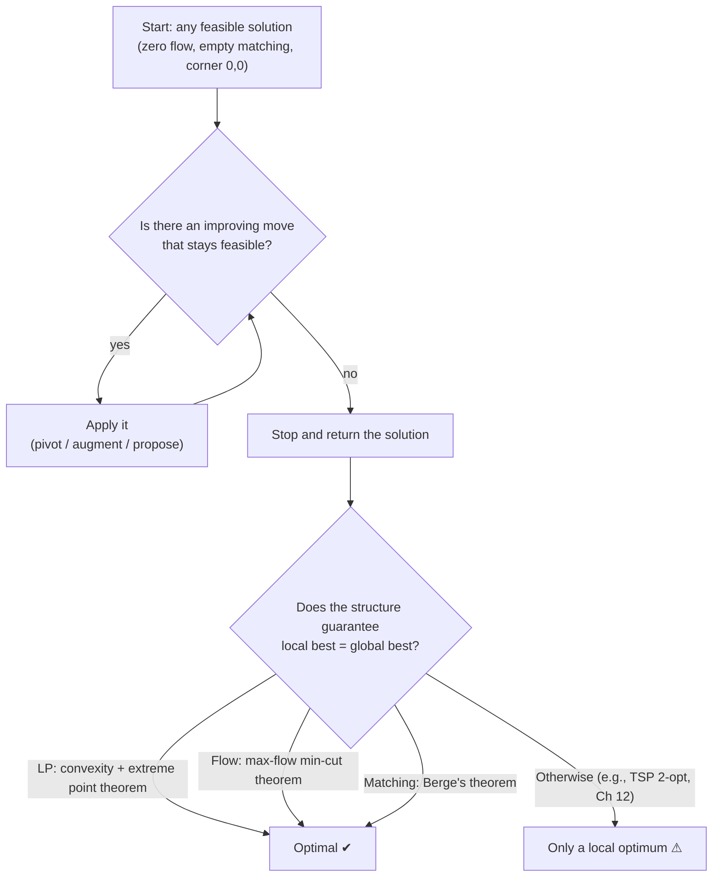
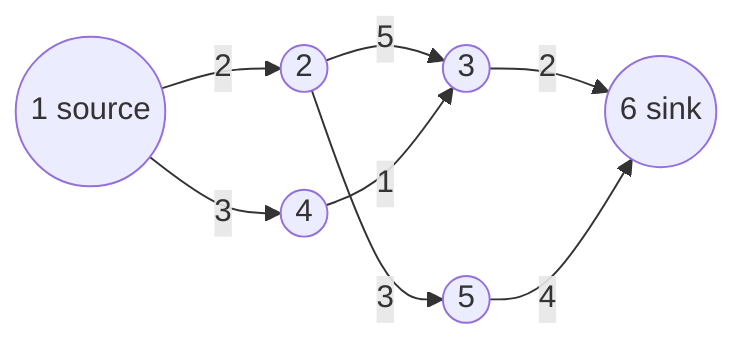
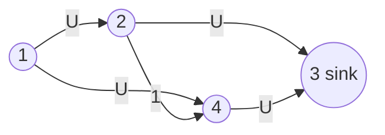
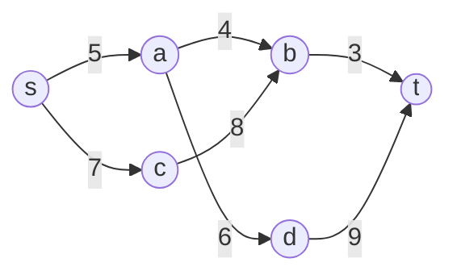
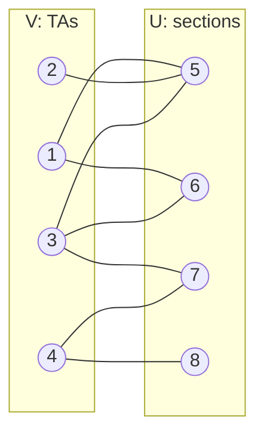
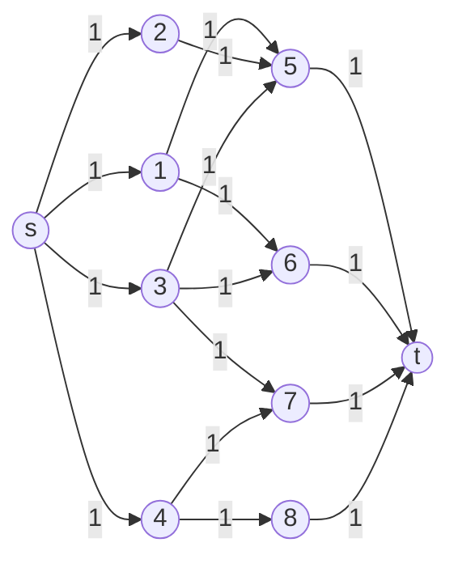

# 10 · Iterative Improvement — Start Feasible, Get Better, Prove You're Done

> Greedy algorithms (Chapter 9) build a solution one piece at a time and never look back. **Iterative improvement**
> does the opposite: it starts with a *complete* solution that already obeys every rule, then keeps swapping in a
> slightly better one until no improving move exists. The whole art is in one question: *when I can't improve
> locally, am I guaranteed to be at the global best?* For the four problems in this chapter — Linear Programming (LP),
> maximum flow, bipartite matching and stable marriage — the answer is **yes**, and understanding *why* is what turns
> these from recipes into tools you can reuse. They also run a surprising amount of the real world: airline schedules,
> network capacity planning, ad auctions, and the U.S. medical residency match.

**Badges:** 🎮 [Simplex](https://normansrule.github.io/algorithm-forge/sims/simplex.html) · [Max-flow](https://normansrule.github.io/algorithm-forge/sims/max-flow.html) · [Bipartite matching](https://normansrule.github.io/algorithm-forge/sims/bipartite-matching.html) · [Stable marriage](https://normansrule.github.io/algorithm-forge/sims/stable-marriage.html) · 🏟️ [Arena problems](https://normansrule.github.io/algorithm-forge/arena/?chapter=10) · 🐍 [Code](../../src/python/algoforge/ch10_iterative_improvement.py) · 📝 [Practice](../../practice/) · ⬅️ [09 Greedy](../09-greedy/README.md) · ➡️ [11 Limitations](../11-limitations/README.md)

---

## The big idea in 60 seconds

1. **Start with a feasible solution** — anything that satisfies all the constraints (often a "do nothing" solution:
   zero flow, empty matching, the corner $(0, 0)$ of a region).
2. **Look for a small change** that keeps the solution feasible *and* makes the objective better.
3. **If you find one, apply it and repeat. If you can't, stop** and return the current solution.

The danger is the classic **local optimum vs. global optimum** trap: hill-climbing can get stuck on a small hill.
Every algorithm in this chapter comes with a *theorem* saying the trap does not exist for its problem — and in two
cases (max-flow, matching) the trick that removes the trap is the same: allow the improving move to **undo** part of
an earlier decision.



| Problem | Feasible start | "Small improving move" | Why *stuck* means *optimal* |
|---|---|---|---|
| Linear Programming (LP) | corner $(0,\dots,0)$ | **pivot** to an adjacent corner with a better objective value | feasible region is convex; a corner with no better neighbor is globally optimal |
| Maximum flow | zero flow | push more flow along an **augmenting path** (may cancel flow on backward edges) | Max-Flow Min-Cut theorem: no augmenting path ⇒ a cut is full ⇒ nothing more can pass |
| Maximum bipartite matching | empty matching | flip an **augmenting path** (+1 edge) | Berge's theorem: no augmenting path ⇒ maximum |
| Stable marriage | everyone free | a free man **proposes** to his next choice | women only trade up; men go down their lists; at the end no pair can block |

---

## Card 1 · Linear Programming (LP) and the Simplex Method

### 🎯 Problem in one sentence
Given a linear objective $z = c_1x_1 + \dots + c_nx_n$ and linear constraints on non-negative variables, find values of
the variables that satisfy every constraint and make $z$ as large (or as small) as possible.

### 📖 Story
A tiny bakery makes trays of muffins ($x$) and trays of croissants ($y$). Each muffin tray earns \$3 and each croissant
tray \$5. The oven is available 4 hours (every tray takes 1 oven-hour), and the baker has 6 hours of labor (muffins take 1
hour per tray, croissants 3). How many of each should she bake?

$$
\begin{aligned}
\text{maximize}\quad & z = 3x + 5y\\
\text{subject to}\quad & x + y \le 4 \qquad \text{(oven)}\\
& x + 3y \le 6 \qquad \text{(labor)}\\
& x \ge 0,\; y \ge 0
\end{aligned}
$$

This is the course's running example (Levitin §10.1). Vocabulary:

- **Objective function** — the thing to maximize: $3x + 5y$.
- **Constraints** — the inequalities; the **nonnegativity constraints** $x, y \ge 0$ are listed separately.
- **Feasible solution** — a point that satisfies all constraints. **Feasible region** — the set of all of them.
- **Extreme point** — a corner of the feasible region.

### 👀 See it
🎮 Open the [Simplex simulation](https://normansrule.github.io/algorithm-forge/sims/simplex.html): drag the objective
line and watch the tableau pivot from corner to corner.

```
 y
 4 |
   | \
   |   \
 3 |     \
   |       \              legend:   \  = the line x + y = 4   (oven)
   |         \                      *  = the line x + 3y = 6  (labor)
 2 C           \                    :  = feasible region
   |:::::*       \                  O, A, B, C = extreme points
   |:::::::::::*   \
 1 |:::::::::::::::::B
   |:::::::::::::::::::\   *
   |:::::::::::::::::::::\       *
 0 O-----------------------A------------- x
   0     1     2     3     4     5     6
```

Now slide the **level line** $3x + 5y = z$ across the region. All level lines are parallel; increasing $z$ pushes the
line up and to the right. The last point of the region it touches is the optimum:

| Extreme point | $(x, y)$ | $z = 3x + 5y$ |
|---|---|---|
| O | $(0, 0)$ | 0 |
| A | $(4, 0)$ | 12 |
| **B** | $(3, 1)$ | **14** ← optimum |
| C | $(0, 2)$ | 10 |

**Extreme Point Theorem.** If an LP has a nonempty *bounded* feasible region, it has an optimal solution, and some
optimal solution is at an extreme point (Levitin §10.1). So we only need to check corners — but a problem with
$n$ variables and $m$ constraints can have up to $\binom{n+m}{m}$ corners, so checking them all is exponential.
Simplex checks them *cleverly*: it only walks to a neighboring corner, and only if the neighbor is better.

**Three possible outcomes** of any LP:

1. a finite optimal solution (maybe more than one — e.g., if the objective line is parallel to an edge of the region);
2. **unbounded** — the objective can grow forever inside the region;
3. **infeasible** — the constraints contradict each other, so the region is empty.

### Standard form and slack variables

Simplex wants the LP in **standard form**: (1) a maximization, (2) every constraint an *equation*, (3) every
variable non-negative. Any LP can be converted:

| If you have… | Convert it by… |
|---|---|
| minimize $f$ | maximize $-f$ |
| $a\cdot x \le b$ | add a **slack variable** $s \ge 0$: $a\cdot x + s = b$ |
| $a\cdot x \ge b$ | subtract a **surplus variable** $s \ge 0$: $a\cdot x - s = b$ |
| a variable $x$ with no sign restriction | replace it by $x' - x''$ with $x', x'' \ge 0$ |

For the bakery, add slacks $u$ (unused oven hours) and $v$ (unused labor hours):

$$
\begin{aligned}
\text{maximize}\quad & z = 3x + 5y + 0u + 0v\\
\text{subject to}\quad & x + y + u = 4\\
& x + 3y + v = 6\\
& x, y, u, v \ge 0
\end{aligned}
$$

### Basic feasible solutions = corners

With $m = 2$ equations and $n = 4$ unknowns, a **basic solution** sets $n - m = 2$ variables (**nonbasic**) to 0 and
solves for the other $m = 2$ (**basic**). It is a **basic feasible solution** if the basic variables come out
non-negative. All $\binom{4}{2} = 6$ choices, computed exactly:

| Basic variables | $(x, y, u, v)$ | Feasible? | $z$ | Corner |
|---|---|---|---|---|
| $u, v$ | $(0, 0, 4, 6)$ | ✔ | 0 | O |
| $x, v$ | $(4, 0, 0, 2)$ | ✔ | 12 | A |
| $x, y$ | $(3, 1, 0, 0)$ | ✔ | 14 | B |
| $y, u$ | $(0, 2, 2, 0)$ | ✔ | 10 | C |
| $x, u$ | $(6, 0, -2, 0)$ | ✘ ($u < 0$) | — | outside the region |
| $y, v$ | $(0, 4, 0, -6)$ | ✘ ($v < 0$) | — | outside the region |

The four feasible ones are *exactly* the four corners. That is the key fact: **basic feasible solutions correspond
one-to-one to extreme points**. So "walk from corner to adjacent corner" becomes pure algebra: "swap one basic
variable for one nonbasic variable."

### 🧱 Build it in blocks

**Block 1 — state.** A **tableau**: one row per constraint (its basic variable, its coefficients, its right-hand
side (RHS)) plus an **objective row** that starts as the *negated* objective coefficients.

```
      x    y    u    v  |  RHS
u  [  1    1    1    0  |   4 ]     ← basic variable u = 4
v  [  1    3    0    1  |   6 ]     ← basic variable v = 6
z  [ -3   -5    0    0  |   0 ]     ← objective row; z = 0 right now
```

**Block 2 — skeleton.** Repeat "test, choose, pivot" until the test says stop.

```
repeat
    if the objective row has no negative entry then
        return the tableau            // optimal
    // choose entering and departing variables, then pivot
```

**Block 3 — the decisions.**
- **Entering variable** (pivot column): the most negative entry of the objective row. A negative entry $-c$ means
  "raising this nonbasic variable from 0 increases $z$ by $c$ per unit" — so we pick the steepest climb.
- **Departing variable** (pivot row): for every **positive** entry in the pivot column, compute the
  **θ-ratio** $= \text{RHS} / \text{entry}$. The smallest θ is how far we can raise the entering variable before
  some basic variable hits 0. That variable departs.
- **Unbounded test**: if the pivot column has *no positive entry*, nothing ever stops the entering variable → stop,
  the LP is unbounded.

**Block 4 — pivot and loop back.** Divide the pivot row by the pivot element; subtract multiples of the new pivot row
from every other row (including the objective row) so the pivot column becomes a unit column; relabel the row with
the entering variable.

### ✋ Trace it by hand (exact fractions — checked in Python)

**Tableau 0** — basic feasible solution $(0, 0, 4, 6)$, $z = 0$ (corner O).

| basic | $x$ | $y$ | $u$ | $v$ | RHS | θ-ratio |
|---|---|---|---|---|---|---|
| $u$ | 1 | 1 | 1 | 0 | 4 | $4/1 = 4$ |
| $v$ | 1 | **3** | 0 | 1 | 6 | $6/3 = $ **2** ← min |
| $z$ | −3 | **−5** | 0 | 0 | 0 | |

Most negative objective entry: −5 → **$y$ enters**. θ-ratios 4 and 2 → **$v$ departs**. Pivot element = 3.

Row operations:
- new $y$-row $= v\text{-row} / 3 = (1/3,\ 1,\ 0,\ 1/3 \mid 2)$
- new $u$-row $= u\text{-row} - 1 \cdot (\text{new } y\text{-row}) = (2/3,\ 0,\ 1,\ -1/3 \mid 2)$
- new $z$-row $= z\text{-row} + 5 \cdot (\text{new } y\text{-row}) = (-4/3,\ 0,\ 0,\ 5/3 \mid 10)$

**Tableau 1** — basic feasible solution $(0, 2, 2, 0)$, $z = 10$ (corner C).

| basic | $x$ | $y$ | $u$ | $v$ | RHS | θ-ratio |
|---|---|---|---|---|---|---|
| $u$ | **2/3** | 0 | 1 | −1/3 | 2 | $2 \div 2/3 = $ **3** ← min |
| $y$ | 1/3 | 1 | 0 | 1/3 | 2 | $2 \div 1/3 = 6$ |
| $z$ | **−4/3** | 0 | 0 | 5/3 | 10 | |

Only negative entry: −4/3 → **$x$ enters**. θ-ratios 3 and 6 → **$u$ departs**. Pivot element = 2/3.

- new $x$-row $= u\text{-row} \div (2/3) = (1,\ 0,\ 3/2,\ -1/2 \mid 3)$
- new $y$-row $= y\text{-row} - \tfrac13 \cdot (\text{new } x\text{-row}) = (0,\ 1,\ -1/2,\ 1/2 \mid 1)$
- new $z$-row $= z\text{-row} + \tfrac43 \cdot (\text{new } x\text{-row}) = (0,\ 0,\ 2,\ 1 \mid 14)$

**Tableau 2** — basic feasible solution $(3, 1, 0, 0)$, $z = 14$ (corner B).

| basic | $x$ | $y$ | $u$ | $v$ | RHS |
|---|---|---|---|---|---|
| $x$ | 1 | 0 | 3/2 | −1/2 | 3 |
| $y$ | 0 | 1 | −1/2 | 1/2 | 1 |
| $z$ | 0 | 0 | 2 | 1 | **14** |

No negative entries in the objective row → **optimal**: $x = 3$, $y = 1$, $z = 14$. The walk was
O $(z=0)$ → C $(z=10)$ → B $(z=14)$ — each step to an *adjacent* corner, each step better.

> 💡 **Bonus insight (shadow prices).** The final objective-row entries under the slacks, 2 for $u$ and 1 for $v$,
> say what one more unit of each resource is worth. One extra oven hour ($x + y \le 5$) raises the optimum to
> $16 = 14 + 2$; one extra labor hour ($x + 3y \le 7$) raises it to $15 = 14 + 1$. (Both checked by re-solving.)
> This is why managers love LP: the answer comes with a price tag on every bottleneck.

### When simplex says "unbounded" or can't start

**Unbounded.** maximize $x + y$ subject to $x - y \le 1$, $x, y \ge 0$. After one pivot ($x$ enters, the slack
departs), the tableau is

| basic | $x$ | $y$ | $s$ | RHS |
|---|---|---|---|---|
| $x$ | 1 | −1 | 1 | 1 |
| $z$ | 0 | **−2** | 1 | 1 |

$y$ wants to enter (−2), but its column has **no positive entry** — raising $y$ never forces anything to 0 (e.g.,
$x = y + 1$ stays feasible for every $y$). Simplex stops: unbounded.

**Infeasible.** $x + y \le 1$ and $x + y \ge 3$ can't both hold. Here the slack trick gives no starting corner (the
origin violates $x + y \ge 3$). Real solvers handle this with a **Phase I** problem (add *artificial* variables and
first minimize their sum; if the minimum isn't 0, the LP is infeasible) or the **big-M** method. Levitin §10.1
mentions this "finding an initial basic feasible solution" issue; we only need the easy case $b \ge 0$ with $\le$
constraints, where the slacks give the starting corner for free.

### 💻 Code

**Forge Pseudocode** (tableau stored as a matrix; returns the optimal value or ∞ for unbounded):

```
ALGORITHM Simplex(T, basis, m, n)
    // Tableau simplex for: maximize c·x subject to Ax ≤ b, x ≥ 0, with b ≥ 0
    // Input: T — matrix with m + 1 rows and n + 1 columns (columns 0..n-1 are the
    //        variables including slacks, column n is the right-hand side);
    //        rows 0..m-1 are constraints, row m is the objective row (−c, 0, ..., 0)
    //        basis[0..m-1] — column index of the basic variable of each row
    // Output: the optimal value of z, or ∞ if the problem is unbounded
    while true do
        // optimality test + entering variable: most negative objective entry
        pc ← -1
        best ← 0
        for j ← 0 to n - 1 do
            if T[m, j] < best then
                best ← T[m, j]
                pc ← j
        if pc = -1 then
            return T[m, n]
        // departing variable: smallest θ-ratio over positive pivot-column entries
        pr ← -1
        for i ← 0 to m - 1 do
            if T[i, pc] > 0 then
                theta ← T[i, n] / T[i, pc]
                if pr = -1 or theta < bestTheta then
                    bestTheta ← theta
                    pr ← i
        if pr = -1 then
            return ∞
        // pivot: make column pc a unit column with its 1 in row pr
        p ← T[pr, pc]
        for j ← 0 to n do
            T[pr, j] ← T[pr, j] / p
        for i ← 0 to m do
            if i ≠ pr then
                f ← T[i, pc]
                for j ← 0 to n do
                    T[i, j] ← T[i, j] - f * T[pr, j]
        basis[pr] ← pc
```

<details><summary>🐍 Python (exact arithmetic with <code>Fraction</code>)</summary>

```python
from fractions import Fraction

def simplex(A, b, c):
    """Maximize c·x subject to A x <= b, x >= 0, assuming b >= 0.
    Returns (z, x) for the optimum, or (None, None) if unbounded."""
    m, n = len(A), len(c)
    # tableau: m constraint rows [A | I | b] + objective row [-c | 0 | 0]
    T = [[Fraction(v) for v in A[i]] + [Fraction(int(i == k)) for k in range(m)] + [Fraction(b[i])]
         for i in range(m)]
    T.append([Fraction(-v) for v in c] + [Fraction(0)] * (m + 1))
    basis = [n + i for i in range(m)]            # slacks start as the basic variables
    cols = n + m
    while True:
        pc = min(range(cols), key=lambda j: T[m][j])    # most negative entry
        if T[m][pc] >= 0:
            break                                       # optimal
        rows = [i for i in range(m) if T[i][pc] > 0]
        if not rows:
            return None, None                           # unbounded
        pr = min(rows, key=lambda i: T[i][-1] / T[i][pc])   # smallest theta
        p = T[pr][pc]
        T[pr] = [v / p for v in T[pr]]
        for i in range(m + 1):
            if i != pr and T[i][pc] != 0:
                f = T[i][pc]
                T[i] = [a - f * bb for a, bb in zip(T[i], T[pr])]
        basis[pr] = pc
    x = [Fraction(0)] * cols
    for i, var in enumerate(basis):
        x[var] = T[i][-1]
    return T[m][-1], x[:n]

if __name__ == "__main__":
    z, x = simplex([[1, 1], [1, 3]], [4, 6], [3, 5])
    print(z, x)                                         # 14 [Fraction(3, 1), Fraction(1, 1)]
    print(simplex([[1, -1]], [1], [1, 1]))              # (None, None): unbounded
```
</details>

<details><summary>☕ Java</summary>

```java
import java.util.Arrays;

public class Simplex {
    static final double EPS = 1e-9;

    /** Maximize c·x s.t. A x <= b, x >= 0 (b >= 0). Returns z, or +Infinity if unbounded. */
    public static double solve(double[][] A, double[] b, double[] c, double[] xOut) {
        int m = A.length, n = c.length, cols = n + m;
        double[][] T = new double[m + 1][cols + 1];
        int[] basis = new int[m];
        for (int i = 0; i < m; i++) {
            for (int j = 0; j < n; j++) T[i][j] = A[i][j];
            T[i][n + i] = 1;                 // slack
            T[i][cols] = b[i];
            basis[i] = n + i;
        }
        for (int j = 0; j < n; j++) T[m][j] = -c[j];
        while (true) {
            int pc = -1; double best = -EPS;
            for (int j = 0; j < cols; j++) if (T[m][j] < best) { best = T[m][j]; pc = j; }
            if (pc == -1) break;                                  // optimal
            int pr = -1; double bestTheta = Double.POSITIVE_INFINITY;
            for (int i = 0; i < m; i++)
                if (T[i][pc] > EPS && T[i][cols] / T[i][pc] < bestTheta) {
                    bestTheta = T[i][cols] / T[i][pc]; pr = i;
                }
            if (pr == -1) return Double.POSITIVE_INFINITY;        // unbounded
            double p = T[pr][pc];
            for (int j = 0; j <= cols; j++) T[pr][j] /= p;
            for (int i = 0; i <= m; i++) {
                if (i == pr) continue;
                double f = T[i][pc];
                for (int j = 0; j <= cols; j++) T[i][j] -= f * T[pr][j];
            }
            basis[pr] = pc;
        }
        Arrays.fill(xOut, 0);
        for (int i = 0; i < m; i++) if (basis[i] < n) xOut[basis[i]] = T[i][cols];
        return T[m][cols];
    }

    public static void main(String[] args) {
        double[] x = new double[2];
        double z = solve(new double[][]{{1, 1}, {1, 3}}, new double[]{4, 6}, new double[]{3, 5}, x);
        System.out.println(z + " " + Arrays.toString(x));
        // prints 14.0 [2.9999999999999996, 1.0000000000000002] — floating point! Round or use tolerances.
    }
}
```
</details>

### 🧮 Analyze it

- **One pivot** touches every entry of the tableau once: $\Theta(m \cdot (n + m))$ arithmetic operations.
- **Number of pivots.** In practice, typically between $m$ and $3m$ (Levitin §10.1) — this is why simplex is fast
  on real problems.
- **Worst case: exponential.** Klee and Minty (1972) built LPs (a "squashed cube") where Dantzig's
  most-negative-entry rule visits all $2^n$ corners.
- **Polynomial alternatives exist:** the ellipsoid method (Khachiyan, 1979) and **interior-point methods**
  (Karmarkar, 1984), which cut through the inside of the region instead of walking along its edges. Modern solvers
  offer both.
- **Cycling.** With *degenerate* corners (a basic variable equal to 0), simplex can pivot in a loop without improving.
  **Bland's rule** (always choose the lowest-indexed eligible variable) provably prevents it.
- Why "local = global" holds: the feasible region is **convex** and the objective is linear, so if no neighboring
  corner is better, no point anywhere is better.

### ⚠️ Common mistakes

- Forgetting to **negate** the objective coefficients in the initial objective row (then you'd stop immediately).
- Computing θ-ratios for **zero or negative** pivot-column entries. Only positive entries count; a negative entry
  means that variable *grows* as the entering variable grows.
- Picking the **largest** θ instead of the smallest — that jumps past a corner into infeasible territory (a basic
  variable becomes negative).
- Updating the objective row with the *old* pivot row instead of the *new* (divided) one.
- Reading the answer from the wrong place: the value of a basic variable is in the RHS column of *its* row; every
  nonbasic variable is 0.

### 🔁 Variations and real-world use

- **Integer Linear Programming (ILP)** — same model but some variables must be integers. NP-hard in general
  (NP = Nondeterministic Polynomial time; see Chapter 11), solved in practice by **branch-and-bound on top of LP relaxations** (Chapter 12). Airline **crew
  scheduling**, sports league scheduling and chip floor-planning are ILPs with millions of variables.
- **Dual simplex / sensitivity analysis** — the shadow prices above are the *dual* LP's solution; every LP has a
  twin whose optimum is the same number.
- **Solvers you'll meet:** Google OR-Tools (Google's Operations Research toolkit, with LP and integer solvers), HiGHS, Gurobi, CPLEX, SciPy's
  `scipy.optimize.linprog`. Engineers rarely write simplex — they write the *model* and pick a solver.
- **Max-flow is an LP** (next card), and so are shortest paths, assignment and min-cost flow — which is why LP is
  called the "mother problem" of combinatorial optimization.

---

## Card 2 · Maximum Flow — Ford–Fulkerson and the Shortest-Augmenting-Path Algorithm

### 🎯 Problem in one sentence
Given a directed network with a source, a sink and a capacity on every edge, send as much material as possible
from the source to the sink without exceeding any capacity and without losing or creating material at intermediate
vertices.

### 📖 Story
A city's water mains run from a reservoir (source) to a treatment plant (sink) through pumping stations. Each pipe
has a maximum rate. Water can't pile up in a station: what flows in must flow out. How many liters per second can the
system deliver? Replace "water" with "gigabits" and "pipes" with "links" and you have a data-center network; with
"trucks" and "roads", a supply chain.

### Definitions (Levitin §10.2)

- A **flow network**: a directed graph with vertices $1..n$, exactly one **source** (vertex 1, no entering edges),
  exactly one **sink** (vertex $n$, no leaving edges), and a positive integer **capacity** $u_{ij}$ on each edge.
- A **flow** assigns an amount $x_{ij}$ to each edge such that
  - **capacity constraints:** $0 \le x_{ij} \le u_{ij}$ for every edge;
  - **flow conservation:** for every intermediate vertex $i$ (not source or sink),
    $\displaystyle\sum_{j:(j,i)\in E} x_{ji} = \sum_{j:(i,j)\in E} x_{ij}$ (in = out).
- The **value** of the flow is the total leaving the source, which (by conservation) equals the total entering the
  sink: $v = \sum_j x_{1j} = \sum_j x_{jn}$.
- The **maximum-flow problem**: find a flow of maximum value.

It's an LP: maximize $v = \sum_j x_{1j}$ subject to conservation equations and $0 \le x_{ij} \le u_{ij}$. For the
network below that is 7 variables, 4 conservation equations and 7 capacity bounds. Simplex would work — but the
network structure lets us do much better.

### 👀 See it
🎮 Open the [Max-flow simulation](https://normansrule.github.io/algorithm-forge/sims/max-flow.html): edit capacities,
then watch the Breadth-First Search (BFS) labels spread, the augmenting path light up, and the minimum cut appear when the sink can't be
reached.

The course's example network (the classic one from Levitin §10.2, capacities on edges):



### Augmenting paths — and why you need to go *backwards*

A naive idea: "find any source-to-sink path with room on every edge, push as much as fits, repeat." Try it:

- Push 2 along $1 \to 2 \to 3 \to 6$. Now $1\to2$ and $3\to6$ are full.
- Look for another path using only edges with room: $1 \to 4 \to 3$ … but $3 \to 6$ is full, and $3$ has no other
  exit. **Stuck at value 2.**

But the true maximum is 3! The fix is to allow a path to **cancel** earlier flow. The path
$1 \to 4 \to 3 \leftarrow 2 \to 5 \to 6$ uses the edge $(2,3)$ *backwards*: we send 1 unit into vertex 3 from 4
instead of from 2, which frees 1 unit at vertex 2 to go down $2 \to 5 \to 6$ instead. Net effect: +1.

Formally, a **flow-augmenting path** is a source-to-sink path in the *undirected* version of the graph where each
consecutive pair $i, j$ is joined by either

- a **forward edge** $i \to j$ with unused capacity $r_{ij} = u_{ij} - x_{ij} > 0$, or
- a **backward edge** $j \to i$ with positive flow $x_{ji} > 0$.

Along it we can push $r = \min\{\,r_{ij} \text{ on forward edges},\ x_{ji} \text{ on backward edges}\,\}$:
**add** $r$ on forward edges and **subtract** $r$ on backward edges. Conservation still holds at every vertex on the
path (check the four cases: forward-in/forward-out, forward-in/backward-out, …).

**Ford–Fulkerson (augmenting-path) method:** start with the zero flow; while an augmenting path exists, augment; when
none exists, the flow is maximum. With integer capacities each augmentation adds at least 1, and the value can't
exceed the total capacity out of the source, so the method terminates.

### Why the *choice* of path matters

Consider this network with a huge capacity $U$ (Levitin §10.2):



A careless choice alternates $1\to2\to4\to3$ (value 1) and $1\to4\leftarrow2\to3$ (value 1, using $2\to4$
backwards) — each iteration adds only 1, so reaching the maximum $2U$ takes **$2U$ iterations**. With $U = 10^9$
that's two billion augmentations for a 4-vertex graph! (Worse: with irrational capacities, a bad choice may never
terminate.) Choosing **shortest** paths (fewest edges) finds $1\to2\to3$ and $1\to4\to3$ — done in **2
augmentations** (verified in Python with $U = 100$).

### 🧱 Build it in blocks — the Shortest-Augmenting-Path (Edmonds–Karp) algorithm

**Block 1 — state.** The flow $x_{ij}$ on every edge (start at 0), and for one search: two **labels** per vertex.

- first label $l_j$: how much extra flow can be brought from the source to $j$;
- second label: the vertex $i$ we came from, with **+** (reached by a forward edge) or **−** (by a backward edge).

**Block 2 — skeleton.** Breadth-First Search (BFS) from the source, labeling new vertices; the source is labeled
$\infty, -$.

```
repeat
    label source with (∞, −); put it in a queue
    while queue not empty and sink not labeled do
        i ← front of queue; dequeue
        // label unlabeled neighbors of i (Block 3)
    if sink not labeled then return current flow   // it is maximum
    augment along the labeled path                  // Block 4
```

**Block 3 — the decision (labeling rule).** For each unlabeled $j$:

- if $i \to j$ is an edge with $r_{ij} = u_{ij} - x_{ij} > 0$: label $j$ with $l_j = \min\{l_i, r_{ij}\}$, $\;i^+$;
- else if $j \to i$ is an edge with $x_{ji} > 0$: label $j$ with $l_j = \min\{l_i, x_{ji}\}$, $\;i^-$.

**Block 4 — augment.** $r = l_{\text{sink}}$. Walk the second labels back from the sink: on a $+$ label add $r$ to
that edge's flow, on a $-$ label subtract $r$. Erase all labels and search again.

### ✋ Trace it by hand — the course network

Neighbors are examined in increasing vertex order. (Every row below was produced by the Python code in this card.)

**Iteration 1** (all flows 0). Queue order: 1, 2, 4, 3, 5, 6.

| Vertex | Labeled from | Labels $l_j,\ i^\pm$ | Why |
|---|---|---|---|
| 1 | — | $\infty, -$ | source |
| 2 | 1 | $2, 1^+$ | $\min(\infty, 2-0)$ |
| 4 | 1 | $3, 1^+$ | $\min(\infty, 3-0)$ |
| 3 | 2 | $2, 2^+$ | $\min(2, 5-0)$ |
| 5 | 2 | $2, 2^+$ | $\min(2, 3-0)$ |
| 6 | 3 | $2, 3^+$ | $\min(2, 2-0)$ — sink labeled, stop |

Path (read labels backward from 6): $1 \to 2 \to 3 \to 6$, $r = 2$. Now $x_{12} = 2$, $x_{23} = 2$, $x_{36} = 2$. Value 2.

**Iteration 2.** Queue order: 1, 4, 3, 2, 5, 6.

| Vertex | Labels | Why |
|---|---|---|
| 1 | $\infty, -$ | source ($1\to2$ is full now, so 2 is *not* labeled from 1) |
| 4 | $3, 1^+$ | $\min(\infty, 3-0)$ |
| 3 | $1, 4^+$ | $\min(3, 1-0)$ |
| 2 | $1, 3^-$ | **backward** edge $2\to3$ carries $x_{23}=2$: $\min(1, 2)$ |
| 5 | $1, 2^+$ | $\min(1, 3-0)$ |
| 6 | $1, 5^+$ | $\min(1, 4-0)$ ($3\to6$ is full, so 6 is reached from 5) |

Path: $1 \to 4 \to 3 \leftarrow 2 \to 5 \to 6$, $r = 1$: $x_{14}=1$, $x_{43}=1$, $x_{23}=2-1=1$, $x_{25}=1$, $x_{56}=1$.
Value 3.

**Iteration 3.** Queue: 1, 4. From 1: edge $1\to2$ is full; $1\to4$ has room 2 → label 4 with $2, 1^+$. From 4: edge
$4\to3$ is full ($x_{43}=1=u_{43}$), and no edge *enters* 4 with flow except from 1 (already labeled). The queue
empties; **the sink is unlabeled → the flow is maximum.**

Final flow ($x/u$): $1\to2$: 2/2, $1\to4$: 1/3, $2\to3$: 1/5, $2\to5$: 1/3, $4\to3$: 1/1, $3\to6$: 2/2,
$5\to6$: 1/4. **Maximum flow value = 3.**

### Cuts and the Max-Flow Min-Cut Theorem

Split the vertices into $X$ (containing the source) and $\bar X$ (containing the sink). The **cut** $C(X, \bar X)$ is
the set of edges going from $X$ to $\bar X$; its **capacity** is the sum of their capacities. Every source-to-sink
path must use at least one edge of every cut — so a cut is a "bottleneck wall". For the course network:

| $X$ | Cut edges | Capacity |
|---|---|---|
| $\{1\}$ | $(1,2), (1,4)$ | $2 + 3 = 5$ |
| $\{1,2,3,4,5\}$ | $(3,6), (5,6)$ | $2 + 4 = 6$ |
| $\{1,2,4\}$ | $(2,3), (2,5), (4,3)$ | $5 + 3 + 1 = 9$ |
| $\{1,4\}$ | $(1,2), (4,3)$ | $2 + 1 = $ **3** ← minimum |

> **Max-Flow Min-Cut Theorem** (Ford & Fulkerson, 1956). The value of a maximum flow equals the capacity of a
> minimum cut.

**Proof sketch (two halves).**

1. *Any flow ≤ any cut.* The net flow across a cut (forward-crossing flow minus backward-crossing flow) equals the flow
   value $v$ (add up conservation over the vertices of $X$). Forward-crossing flow ≤ the cut's capacity, and
   backward-crossing flow ≥ 0, so $v \le c(X,\bar X)$.
2. *The final flow meets some cut exactly.* When the algorithm stops, let $X^*$ = the **labeled** vertices. The sink is
   not in $X^*$. Every edge from $X^*$ to $\bar X^*$ must be **full** (otherwise its head would have been labeled),
   and every edge from $\bar X^*$ to $X^*$ must carry **zero** flow (otherwise its tail would have been labeled via a
   backward edge). So the net flow across this cut is exactly its capacity: $v^* = c(X^*, \bar X^*)$.

By half 1, no flow can beat $v^*$ and no cut can be smaller than $c(X^*,\bar X^*)$ — so both are optimal.

**How to read the minimum cut from the final labeling:** the min cut is formed by **all edges from labeled to
unlabeled vertices on the last iteration**. In the course network, the last iteration labeled $\{1, 4\}$, so the min
cut is $\{(1,2), (4,3)\}$ with capacity 3 — both edges full, exactly as the theorem says.

### ✋ A second trace (our own network) — backward edge + a min cut in the middle



Neighbors examined in alphabetical order ($s$ first, $t$ last).

| Iter | Queue order | Key labels | Augmenting path | $r$ | Value |
|---|---|---|---|---|---|
| 1 | s, a, c, b, d, t | $a{:}\,5,s^+$; $b{:}\,4,a^+$; $t{:}\,3,b^+$ | $s\to a\to b\to t$ | 3 | 3 |
| 2 | s, a, c, b, d, t | $a{:}\,2,s^+$; $d{:}\,2,a^+$; $t{:}\,2,d^+$ ($b\to t$ is full) | $s\to a\to d\to t$ | 2 | 5 |
| 3 | s, c, b, a, d, t | $c{:}\,7,s^+$; $b{:}\,7,c^+$; $a{:}\,3,b^-$ (backward on $a\to b$, which carries 3); $d{:}\,3,a^+$; $t{:}\,3,d^+$ | $s\to c\to b\leftarrow a\to d\to t$ | 3 | 8 |
| 4 | s, c, b | $c{:}\,4,s^+$; $b{:}\,4,c^+$; nothing else reachable | — sink unlabeled | — | **8** |

Iteration 3 is the interesting one: $s\to a$ is already full, so $a$ can only be reached *backwards* from $b$ —
re-routing the 3 units that $a$ was sending to $b$ over to $d$, while $c$ takes over feeding $b$.

Final flows: $s\to a$ 5/5, $s\to c$ 3/7, $a\to b$ 0/4, $a\to d$ 5/6, $c\to b$ 3/8, $b\to t$ 3/3, $d\to t$ 5/9.

**Reading the min cut:** last labeled set $X^* = \{s, b, c\}$. Edges from $X^*$ to $\{a, d, t\}$: $(s,a)$ with
capacity 5 and $(b,t)$ with capacity 3 → **capacity 8 = max flow** ✔. Both are full; the only edge from unlabeled to
labeled, $(a,b)$, carries 0 ✔. A brute-force check of all 16 possible cuts confirms 8 is the unique minimum. In
plain words: *the bottlenecks are the pipe out of the reservoir to $a$ and the pipe from $b$ into the plant* — adding
capacity anywhere else is wasted money.

### 💻 Code

**Forge Pseudocode** (vertices $0..n-1$, source 0, sink $n-1$, capacities in a matrix):

```
ALGORITHM ShortestAugmentingPath(U, n)
    // Maximum flow by BFS augmenting paths (Edmonds–Karp) with Levitin's labels
    // Input: U — n × n capacity matrix (U[i, j] = 0 when there is no edge i → j);
    //        vertex 0 is the source and vertex n - 1 is the sink
    // Output: the value of a maximum flow (matrix X holds the flow)
    X ← matrix(n, n, 0)
    value ← 0
    while true do
        labeled ← array(n, false)
        L ← array(n, 0)            // first label: extra flow that can reach the vertex
        prev ← array(n, -1)        // second label: the vertex it was reached from
        dir ← array(n, 0)          // +1 = reached by a forward edge, -1 = by a backward edge
        labeled[0] ← true
        L[0] ← ∞
        Q ← []
        enqueue(Q, 0)
        while not isEmpty(Q) and not labeled[n - 1] do
            i ← dequeue(Q)
            for j ← 0 to n - 1 do
                if not labeled[j] then
                    if U[i, j] - X[i, j] > 0 then
                        L[j] ← min(L[i], U[i, j] - X[i, j])
                        prev[j] ← i
                        dir[j] ← 1
                        labeled[j] ← true
                        enqueue(Q, j)
                    else if X[j, i] > 0 then
                        L[j] ← min(L[i], X[j, i])
                        prev[j] ← i
                        dir[j] ← -1
                        labeled[j] ← true
                        enqueue(Q, j)
        if not labeled[n - 1] then
            return value           // no augmenting path: the flow is maximum
        r ← L[n - 1]
        j ← n - 1
        while j ≠ 0 do             // retrace the path from the sink using the second labels
            i ← prev[j]
            if dir[j] = 1 then
                X[i, j] ← X[i, j] + r
            else
                X[j, i] ← X[j, i] - r
            j ← i
        value ← value + r
```

<details><summary>🐍 Python (with the min cut)</summary>

```python
from collections import deque

def max_flow(n, edges, s, t):
    """edges: list of (i, j, capacity) with vertices 0..n-1.
    Returns (value, flow dict, min-cut edge list)."""
    cap, x = {}, {}
    for i, j, c in edges:
        cap[(i, j)] = c
        x[(i, j)] = 0
    out_nb = {v: [] for v in range(n)}
    in_nb = {v: [] for v in range(n)}
    for i, j, _ in edges:
        out_nb[i].append(j)
        in_nb[j].append(i)
    value = 0
    while True:
        label = {s: (float("inf"), None, "-")}      # vertex -> (l_j, from, sign)
        q = deque([s])
        while q and t not in label:
            i = q.popleft()
            for j in sorted(out_nb[i]):              # forward edges with room
                if j not in label and cap[(i, j)] - x[(i, j)] > 0:
                    label[j] = (min(label[i][0], cap[(i, j)] - x[(i, j)]), i, "+")
                    q.append(j)
            for j in sorted(in_nb[i]):               # backward edges with flow
                if j not in label and x[(j, i)] > 0:
                    label[j] = (min(label[i][0], x[(j, i)]), i, "-")
                    q.append(j)
        if t not in label:                           # maximum reached
            X = set(label)
            cut = [(i, j) for (i, j) in cap if i in X and j not in X]
            return value, x, cut
        r = label[t][0]
        j = t
        while j != s:
            _, i, sign = label[j]
            if sign == "+":
                x[(i, j)] += r
            else:
                x[(j, i)] -= r
            j = i
        value += r

if __name__ == "__main__":
    # course network, renumbered 0..5 (vertex k here = vertex k+1 on the slides)
    course = [(0, 1, 2), (0, 3, 3), (1, 2, 5), (1, 4, 3), (3, 2, 1), (2, 5, 2), (4, 5, 4)]
    v, flow, cut = max_flow(6, course, 0, 5)
    print(v, cut)                                    # 3 [(0, 1), (3, 2)]
```
</details>

<details><summary>☕ Java</summary>

```java
import java.util.ArrayDeque;

public class MaxFlow {
    /** Edmonds–Karp on a capacity matrix; source 0, sink n-1. Fills flow[][]. */
    public static int maxFlow(int[][] u, int[][] flow) {
        int n = u.length, value = 0;
        while (true) {
            int[] l = new int[n], prev = new int[n], dir = new int[n];
            boolean[] labeled = new boolean[n];
            labeled[0] = true; l[0] = Integer.MAX_VALUE;
            ArrayDeque<Integer> q = new ArrayDeque<>();
            q.add(0);
            while (!q.isEmpty() && !labeled[n - 1]) {
                int i = q.poll();
                for (int j = 0; j < n; j++) {
                    if (labeled[j]) continue;
                    if (u[i][j] - flow[i][j] > 0) {                 // forward edge
                        l[j] = Math.min(l[i], u[i][j] - flow[i][j]); prev[j] = i; dir[j] = 1;
                        labeled[j] = true; q.add(j);
                    } else if (flow[j][i] > 0) {                    // backward edge
                        l[j] = Math.min(l[i], flow[j][i]); prev[j] = i; dir[j] = -1;
                        labeled[j] = true; q.add(j);
                    }
                }
            }
            if (!labeled[n - 1]) return value;
            int r = l[n - 1];
            for (int j = n - 1; j != 0; j = prev[j]) {
                int i = prev[j];
                if (dir[j] == 1) flow[i][j] += r; else flow[j][i] -= r;
            }
            value += r;
        }
    }

    public static void main(String[] args) {
        int[][] u = new int[6][6];
        u[0][1] = 2; u[0][3] = 3; u[1][2] = 5; u[1][4] = 3; u[3][2] = 1; u[2][5] = 2; u[4][5] = 4;
        System.out.println(maxFlow(u, new int[6][6]));   // 3
    }
}
```
</details>

### 🧮 Analyze it

- **One BFS** with adjacency lists: $O(n + m) = O(m)$ for a connected network ($n$ vertices, $m$ edges). (With the
  matrix version in the pseudocode it is $O(n^2)$ per search.)
- **Number of augmentations:** Edmonds and Karp (1972) proved the shortest-augmenting-path algorithm needs at most
  $nm/2$ of them — independent of the capacities! (Intuition: shortest-path distances from the source never decrease,
  and each augmentation saturates a "bottleneck" edge that can't be a bottleneck again until its distance grows.)
- **Total:** $O(nm) \cdot O(m) = O(nm^2)$.
- Plain Ford–Fulkerson with arbitrary paths is only $O(m \cdot v^*)$ for integer capacities — *pseudo-polynomial*,
  because $v^*$ can be exponential in the number of bits of the input (the $2U$ example).
- Faster algorithms exist: Dinitz's algorithm $O(n^2 m)$; **preflow-push** (Goldberg–Tarjan) algorithms near
  $O(nm)$ — these temporarily violate conservation, so they are *not* iterative improvement in the strict sense
  (Levitin §10.2). In 2022 researchers announced an *almost-linear-time* max-flow algorithm, a landmark theoretical
  result.

### ⚠️ Common mistakes

- **Forgetting backward edges** — you'll get stuck below the maximum (value 2 instead of 3 on the course network).
- Using $u_{ij}$ instead of the **remaining** capacity $u_{ij} - x_{ij}$ when labeling.
- On a backward step, **adding** to the flow instead of subtracting.
- Reading the min cut from the *first* BFS instead of the **last** (failed) one.
- Counting edges from $\bar X$ to $X$ in the cut capacity. A cut's capacity only counts edges *from* $X$ *to* $\bar X$.
- Assuming the max flow is unique. The *value* is unique; the flow achieving it often isn't.

### 🔁 Variations and real-world use

- **Several sources/sinks:** add a super-source and a super-sink joined by infinite-capacity edges.
- **Vertex capacities:** split each vertex $v$ into $v_{in} \to v_{out}$ with an edge of the vertex's capacity.
- **Min-cost flow** — cheapest way to ship a given amount; logistics and ride-matching platforms use it.
- **Image segmentation ("graph cuts")** — pixels are vertices; a min cut separates foreground from background.
- **Baseball elimination, project selection, airline and network reliability** — classic max-flow/min-cut
  reductions (Kleinberg & Tardos, Ch. 7).
- **Bipartite matching** is a max-flow problem with unit capacities — next card.

---

## Card 3 · Maximum Matching in Bipartite Graphs

### 🎯 Problem in one sentence
In a graph whose vertices split into two sides with edges only between the sides, pick as many edges as possible
so that no two picked edges share a vertex.

### 📖 Story
Four teaching assistants (TAs) (V = {1, 2, 3, 4}) and four lab sections (U = {5, 6, 7, 8}). An edge means "this TA is
qualified and free for this section." We want to staff as many sections as possible, one TA per section, one section
per TA. The same model fits workers and machines, students and projects, ads and ad slots.

### Definitions

- **Bipartite graph:** vertices partition into $V$ and $U$ (not necessarily the same size); every edge joins a
  vertex of $V$ to a vertex of $U$.
- **Matching:** a set of edges, no two sharing a vertex. A **maximum** (maximum-cardinality) matching has as many
  edges as possible — it always exists but is often not unique. A **perfect** matching matches every vertex.
- For a matching $M$, a vertex is **matched** if it is an endpoint of an edge in $M$, otherwise **free**.

### Bipartite ⇔ no odd cycle ⇔ 2-colorable

These three statements are equivalent:

1. $G$ is bipartite.
2. $G$ is **2-colorable**: you can color vertices with two colors so every edge has differently colored ends.
3. $G$ has **no cycle of odd length**.

*Why.* (1⇔2) The two sides *are* the two colors. (2⇒3) Walking around a cycle, colors alternate, so you return to
the starting color only after an even number of steps. (3⇒2) Run BFS from any vertex and color by the parity of the
BFS level. If some edge joined two vertices of the same parity, the two BFS paths to them plus that edge would contain
an odd cycle — impossible. So BFS gives a valid 2-coloring. This is also the **algorithm** for testing
bipartiteness in $O(n + m)$:

```python
from collections import deque

def two_color(adj):
    """adj: dict vertex -> list of neighbors. Returns a coloring dict, or None if not bipartite."""
    color = {}
    for start in adj:
        if start in color:
            continue
        color[start] = 0
        q = deque([start])
        while q:
            v = q.popleft()
            for w in adj[v]:
                if w not in color:
                    color[w] = 1 - color[v]
                    q.append(w)
                elif color[w] == color[v]:
                    return None                  # same-colored edge: odd cycle exists
    return color

if __name__ == "__main__":
    square = {1: [2, 4], 2: [1, 3], 3: [2, 4], 4: [3, 1]}
    triangle = {1: [2, 3], 2: [1, 3], 3: [1, 2]}
    print(two_color(square), two_color(triangle))   # {1: 0, 2: 1, 4: 1, 3: 0} None
```

### Augmenting paths for matchings

An **augmenting path** for $M$ is a path that starts at a free vertex of $V$, ends at a free vertex of $U$, and
alternates **non-matching, matching, non-matching, …, non-matching** edges. It always has **odd length** $2k+1$:
$k+1$ edges outside $M$ and $k$ inside. **Augmentation** = flip every edge on the path (add the odd-numbered
edges to $M$, remove the even-numbered ones) → the matching grows by exactly 1. A single edge between two free
vertices is the shortest augmenting path (length 1).

> **Theorem (Berge, 1957).** A matching is maximum **if and only if** it has no augmenting path.

So again: stuck ⇒ optimal. (Proof idea: if $M^*$ is bigger than $M$, overlay them; the symmetric difference breaks
into alternating paths and cycles, and since $M^*$ has more edges, at least one path has more $M^*$-edges than
$M$-edges — that path is augmenting for $M$.)

### 👀 See it
🎮 Open the [Bipartite matching simulation](https://normansrule.github.io/algorithm-forge/sims/bipartite-matching.html):
queue, labels and each augmenting path are shown as they are found.

Our TA example (edges: 1–5, 1–6, 2–5, 3–5, 3–6, 3–7, 4–7, 4–8):



### 🧱 Build it in blocks — the BFS-based augmenting-path algorithm (Levitin §10.3)

**Block 1 — state.** `mate[v]` (partner or −1 if free), `label[u]` for vertices of $U$ (the $V$-vertex we reached
it from), and a queue initialized with **all free vertices of $V$**.

**Block 2 — skeleton.** Repeat: dequeue $w$ until the queue is empty.

**Block 3 — the decisions.**
- **Case 1: $w \in V$.** For each neighbor $u$ of $w$:
  - if $u$ is **free** → an augmenting path ends here. **Augment** by walking back: match $u$–$w$; $w$'s old
    partner $u'$ gets re-matched to `label[u']`; and so on until we reach a vertex of $V$ that was free. Then **erase
    all labels and re-initialize the queue** with the vertices of $V$ that are still free.
  - if $u$ is matched (not to $w$) and unlabeled → label $u$ with $w$, enqueue $u$.
- **Case 2: $w \in U$** (it is matched, or it wouldn't be in the queue). Label its mate $v$ with $w$ and enqueue $v$.

**Block 4 — return.** When the queue empties with no augmentation, the matching is maximum.

### ✋ Trace it by hand

Starting from the empty matching, queue = [1, 2, 3, 4].

| Phase | Queue (in dequeue order) | What happens | Matching afterwards |
|---|---|---|---|
| 1 | 1 | neighbor 5 is free → augment path **1–5** | {1–5} |
| 2 | 2, 3 | 2: neighbor 5 matched → label 5←2, enqueue 5. 3: neighbor 5 already labeled; **6 free** → augment **3–6** | {1–5, 3–6} |
| 3 | 2, 4 | 2: label 5←2, enqueue. 4: **7 free** → augment **4–7** | {1–5, 3–6, 4–7} |
| 4 | 2, 5, 1, 6, 3, 7, 4 | see below | {1–6, 2–5, 3–7, 4–8} |

Phase 4 in detail (only 2 is free in $V$):

| Dequeue $w$ | Side | Action |
|---|---|---|
| 2 | V | 5 is matched (to 1) → label 5←2, enqueue 5 |
| 5 | U | its mate is 1 → label 1←5, enqueue 1 |
| 1 | V | 5 is 1's mate (skip); 6 is matched (to 3) → label 6←1, enqueue 6 |
| 6 | U | mate 3 → enqueue 3 |
| 3 | V | 5, 6 already labeled / its mate; 7 is matched (to 4) → label 7←3, enqueue 7 |
| 7 | U | mate 4 → enqueue 4 |
| 4 | V | 7 is its mate; **8 is free** → augment! |

Walk back from 8: 8←4 (4 was matched to 7), 7←3 (3 was matched to 6), 6←1 (1 was matched to 5), 5←2 (2 was free —
stop). Augmenting path **2–5–1–6–3–7–4–8** (length 7: four new edges 2–5, 1–6, 3–7, 4–8 in; three old edges
1–5, 3–6, 4–7 out). The matching becomes perfect: **{1–6, 2–5, 3–7, 4–8}**. Re-initializing the queue with free
vertices of $V$ gives an empty queue → done.

Notice the domino effect: to give TA 2 (who can only take section 5) a job, TA 1 moves from 5 to 6, TA 3 from 6 to 7,
and TA 4 from 7 to 8. No greedy "assign and never undo" rule can find that.

### Reduction to maximum flow



Add a source $s$ with a unit-capacity edge to every vertex of $V$, direct every graph edge from $V$ to $U$ with
capacity 1, and add a unit-capacity edge from every vertex of $U$ to a sink $t$. An integer flow of value $k$
corresponds exactly to a matching of size $k$ (each $V$-vertex receives at most 1 unit, so it uses at most one
outgoing edge; same for $U$). Because augmenting-path algorithms keep flows integral when capacities are integers
(the **integrality property**), max flow = maximum matching. And an augmenting path in the flow network *is* an
alternating path in the graph — the backward edges are the "un-match" steps.

### 💻 Code

**Forge Pseudocode:**

```
ALGORITHM MaxBipartiteMatching(adj, inV, n)
    // BFS-based augmenting-path algorithm for a bipartite graph with vertices 0..n-1
    // Input: adj[0..n-1] — adjacency lists; inV[v] = true if v is on side V, false if on side U
    // Output: mate[0..n-1], where mate[v] is v's partner or -1 if v is free
    mate ← array(n, -1)
    label ← array(n, -1)
    Q ← FreeLeft(inV, mate, n)
    while not isEmpty(Q) do
        w ← dequeue(Q)
        if inV[w] then
            k ← 0
            augmented ← false
            while k < length(adj[w]) and not augmented do
                u ← adj[w][k]
                if mate[u] = -1 then
                    // augment: flip edges along the labeled path ending at u
                    x ← u
                    y ← w
                    repeat
                        nextx ← mate[y]          // y's old partner, or -1 if y was free
                        mate[x] ← y
                        mate[y] ← x
                        x ← nextx
                        if x ≠ -1 then
                            y ← label[x]
                    until x = -1
                    label ← array(n, -1)
                    Q ← FreeLeft(inV, mate, n)
                    augmented ← true
                else if mate[w] ≠ u and label[u] = -1 then
                    label[u] ← w
                    enqueue(Q, u)
                k ← k + 1
        else
            enqueue(Q, mate[w])                  // w is in U and matched: continue from its mate
    return mate

ALGORITHM FreeLeft(inV, mate, n)
    // Returns a queue holding every free vertex of side V
    Q ← []
    for v ← 0 to n - 1 do
        if inV[v] and mate[v] = -1 then
            enqueue(Q, v)
    return Q
```

<details><summary>🐍 Python</summary>

```python
from collections import deque

def max_bipartite_matching(V, adj):
    """V: list of left vertices; adj: dict left vertex -> list of right neighbors.
    Returns dict mate (both directions). BFS-based augmenting paths (Levitin 10.3)."""
    mate, label = {}, {}
    q = deque(v for v in V if v not in mate)
    left = set(V)
    while q:
        w = q.popleft()
        if w in left:
            for u in adj[w]:
                if u not in mate:                      # free vertex of U: augment
                    x, y = u, w
                    while x is not None:
                        nxt = mate.get(y)              # y's old partner (None if y was free)
                        mate[x], mate[y] = y, x
                        x = nxt
                        if x is not None:
                            y = label[x]
                    label = {}
                    q = deque(v for v in V if v not in mate)
                    break
                if mate.get(w) != u and u not in label:
                    label[u] = w
                    q.append(u)
        else:
            q.append(mate[w])                          # w in U is matched
    return mate

if __name__ == "__main__":
    adj = {1: [5, 6], 2: [5], 3: [5, 6, 7], 4: [7, 8]}
    m = max_bipartite_matching([1, 2, 3, 4], adj)
    print(sorted((v, m[v]) for v in [1, 2, 3, 4] if v in m))   # [(1, 6), (2, 5), (3, 7), (4, 8)]
```
</details>

<details><summary>☕ Java</summary>

```java
import java.util.*;

public class BipartiteMatching {
    /** Vertices 0..n-1; inV[v] marks side V; returns mate[] (-1 = free). */
    public static int[] maxMatching(List<List<Integer>> adj, boolean[] inV) {
        int n = inV.length;
        int[] mate = new int[n], label = new int[n];
        Arrays.fill(mate, -1); Arrays.fill(label, -1);
        ArrayDeque<Integer> q = freeLeft(inV, mate);
        while (!q.isEmpty()) {
            int w = q.poll();
            if (inV[w]) {
                for (int u : adj.get(w)) {
                    if (mate[u] == -1) {                       // augment
                        int x = u, y = w;
                        while (x != -1) {
                            int next = mate[y];
                            mate[x] = y; mate[y] = x;
                            x = next;
                            if (x != -1) y = label[x];
                        }
                        Arrays.fill(label, -1);
                        q = freeLeft(inV, mate);
                        break;
                    } else if (mate[w] != u && label[u] == -1) {
                        label[u] = w; q.add(u);
                    }
                }
            } else {
                q.add(mate[w]);
            }
        }
        return mate;
    }

    static ArrayDeque<Integer> freeLeft(boolean[] inV, int[] mate) {
        ArrayDeque<Integer> q = new ArrayDeque<>();
        for (int v = 0; v < inV.length; v++) if (inV[v] && mate[v] == -1) q.add(v);
        return q;
    }

    public static void main(String[] args) {
        // TAs 1..4 -> indices 0..3, sections 5..8 -> indices 4..7
        int[][] e = {{0, 4}, {0, 5}, {1, 4}, {2, 4}, {2, 5}, {2, 6}, {3, 6}, {3, 7}};
        List<List<Integer>> adj = new ArrayList<>();
        for (int i = 0; i < 8; i++) adj.add(new ArrayList<>());
        for (int[] ed : e) { adj.get(ed[0]).add(ed[1]); adj.get(ed[1]).add(ed[0]); }
        boolean[] inV = {true, true, true, true, false, false, false, false};
        int[] mate = maxMatching(adj, inV);
        for (int v = 0; v < 4; v++) System.out.println((v + 1) + "-" + (mate[v] + 1));  // 1-6 2-5 3-7 4-8
    }
}
```
</details>

### 🧮 Analyze it

- Each augmentation raises the matching size by 1, and a matching has at most $\lfloor n/2 \rfloor$ edges
  ($n = |V| + |U|$), so there are at most $\lfloor n/2 \rfloor + 1$ BFS phases.
- Each phase is a BFS-like traversal: $O(n + m)$.
- **Total: $O(n(n + m))$** (Levitin §10.3).
- **Hopcroft–Karp** (1973) augments along a *maximal set of shortest* vertex-disjoint augmenting paths per phase and
  needs only $O(\sqrt{n})$ phases: $O(\sqrt{n}\, m)$ total.

### ⚠️ Common mistakes

- Starting the queue with free vertices of **both** sides. Start with one side only.
- Forgetting to **erase labels and rebuild the queue** after each augmentation (stale labels create wrong paths).
- Stopping as soon as "no free vertex is adjacent to a free vertex" — that only means the matching is *maximal*
  (can't add an edge directly), not *maximum*. Our phase-3 matching {1–5, 3–6, 4–7} is maximal but not maximum.
- Applying this algorithm to a **non-bipartite** graph. Odd cycles break it; general graphs need Edmonds' "blossom"
  algorithm.

### 🔁 Variations and real-world use

- **Weighted version = the assignment problem** (cheapest perfect matching): the **Hungarian algorithm**, $O(n^3)$.
  You'll meet the same cost-matrix problem solved by branch-and-bound in [Chapter 12](../12-coping-with-limitations/README.md).
- **König's theorem:** in a bipartite graph, maximum matching size = minimum vertex cover size (a max-flow min-cut
  consequence). In general graphs vertex cover is NP-hard ([Chapter 11](../11-limitations/README.md)) — bipartiteness
  is what makes it easy.
- **Online matching** (ad slots to arriving users), kidney-exchange programs, job-shop assignment, and the "who
  covers which shift" features in scheduling apps.

---

## Card 4 · The Stable Marriage Problem — Gale–Shapley

### 🎯 Problem in one sentence
Given $n$ men and $n$ women, each ranking all members of the other group, pair them up so that no man and woman
who are not paired would both rather be with each other than with their assigned partners.

### 📖 Story
The problem is phrased as "marriage," but think *medical residents and hospitals*, *students and schools*, or
*servers and client requests*. The danger in any matching market is **defection**: if resident R and hospital H both
prefer each other to what the match gave them, they will make a side deal and the whole system unravels. Stability
means *nobody has an incentive to defect*.

### Definitions (Levitin §10.4)

- A **marriage matching** $M$ is a set of $n$ disjoint (man, woman) pairs.
- A pair $(m, w)$ **not** in $M$ is a **blocking pair** if $m$ prefers $w$ to his mate in $M$ **and** $w$ prefers $m$
  to her mate in $M$.
- $M$ is **stable** if it has no blocking pair.

The course instance, as preference lists and as a **ranking matrix** (entry "$i, j$" in row $m$, column $w$ means
$w$ is $m$'s $i$-th choice and $m$ is $w$'s $j$-th choice):

| Men's preferences | 1st | 2nd | 3rd | | Women's preferences | 1st | 2nd | 3rd |
|---|---|---|---|---|---|---|---|---|
| Bob | Lea | Ann | Sue | | Ann | Jim | Tom | Bob |
| Jim | Lea | Sue | Ann | | Lea | Tom | Bob | Jim |
| Tom | Sue | Lea | Ann | | Sue | Jim | Tom | Bob |

| | Ann | Lea | Sue |
|---|---|---|---|
| **Bob** | 2, 3 | 1, 2 | 3, 3 |
| **Jim** | 3, 1 | 1, 3 | 2, 1 |
| **Tom** | 3, 2 | 2, 1 | 1, 2 |

### 👀 See it
🎮 Open the [Stable marriage simulation](https://normansrule.github.io/algorithm-forge/sims/stable-marriage.html):
proposals appear as arrows on the ranking matrix; you can switch to women-proposing and compare.

All $3! = 6$ matchings with their blocking pairs (checked by brute force in Python):

| Matching | Blocking pairs | Stable? |
|---|---|---|
| (Bob, Ann), (Jim, Lea), (Tom, Sue) | (Bob, Lea) — Bob ranks Lea 1st > Ann 2nd; Lea ranks Bob 2nd > Jim 3rd | ✘ |
| **(Bob, Ann), (Jim, Sue), (Tom, Lea)** | none | **✔** |
| (Bob, Lea), (Jim, Ann), (Tom, Sue) | (Jim, Sue) | ✘ |
| (Bob, Lea), (Jim, Sue), (Tom, Ann) | (Tom, Lea) | ✘ |
| (Bob, Sue), (Jim, Ann), (Tom, Lea) | (Jim, Sue), (Tom, Sue) | ✘ |
| (Bob, Sue), (Jim, Lea), (Tom, Ann) | (Bob, Lea), (Tom, Lea), (Tom, Sue) | ✘ |

Checking all $n!$ matchings is hopeless for large $n$. Gale and Shapley (1962) found an elegant iterative method.

### 🧱 Build it in blocks — Gale–Shapley (men proposing)

**Block 1 — state.** Everyone starts **free**; each man has a pointer to the next woman on his list; each woman
holds her current partner (or nobody).

**Block 2 — skeleton.** `while there is a free man:` pick one (any rule works).

**Block 3 — the decision.**
- **Proposal:** the free man $m$ proposes to $w$, the highest-ranked woman on his list he hasn't proposed to yet.
- **Response:** if $w$ is free, she accepts. If she's matched to $m'$, she compares: if she prefers $m$, she accepts
  $m$ and $m'$ becomes free; otherwise she rejects $m$ (who stays free).

**Block 4 — return** the $n$ pairs.

Each iteration improves things in a precise sense: women's partners only get **better** (by their lists), and each man
crosses off one more woman. That monotone progress is what guarantees termination.

### ✋ Trace it by hand (free men chosen in list order; a rejected man keeps his turn)

| # | Proposal | Response | Free men after |
|---|---|---|---|
| 1 | Bob → Lea | Lea was free → **accepts** | Jim, Tom |
| 2 | Jim → Lea | Lea prefers Bob (2nd) to Jim (3rd) → rejects | Jim, Tom |
| 3 | Jim → Sue | Sue was free → **accepts** | Tom |
| 4 | Tom → Sue | Sue prefers Jim (1st) to Tom (2nd) → rejects | Tom |
| 5 | Tom → Lea | Lea prefers Tom (1st) to Bob (2nd) → **accepts, Bob is freed** | Bob |
| 6 | Bob → Ann | Ann was free → **accepts** | — |

Result: **{(Bob, Ann), (Jim, Sue), (Tom, Lea)}** — the stable matching from the table above. ✔ (Simulated in Python;
it matches the course slides step for step.)

### Why it works

- **Termination, $\le n^2$ iterations.** Each iteration is one proposal, and no man proposes to the same woman twice,
  so there are at most $n \cdot n = n^2$ proposals. (A tighter count is $n(n-1)+1$.)
- **Everyone ends up matched.** A woman, once proposed to, stays matched forever. If some man were rejected by all
  $n$ women, all $n$ women would be matched — to $n$ *other* men, but there are only $n - 1$ others. Contradiction.
- **Stability.** Suppose $(m, w)$ blocks the final matching: $m$ prefers $w$ to his wife. Then $m$ proposed to $w$
  before his wife, and $w$ rejected him (then or later) for someone she prefers. Women only trade *up*, so $w$'s final
  partner is someone she prefers to $m$ — so $w$ does **not** prefer $m$. Not a blocking pair. Contradiction.
- **Man-optimal.** Every man gets the best partner he can have in *any* stable matching (and every woman gets her
  worst stable partner). The man-optimal matching is unique for given preferences, so the choice of *which* free man
  proposes next never changes the answer. Making the women propose gives the **woman-optimal** matching. In our
  instance women-proposing yields the same pairs, because this instance has only one stable matching.

### 💻 Code

**Forge Pseudocode** (people numbered $0..n-1$):

```
ALGORITHM GaleShapley(menPref, womanRank, n)
    // Men-proposing deferred acceptance
    // Input: menPref[m][k] — the woman who is man m's k-th choice (k = 0 is his favorite);
    //        womanRank[w][m] — the position of man m on woman w's list (0 = her favorite)
    // Output: wife[0..n-1] — the man-optimal stable matching
    wife ← array(n, -1)
    husband ← array(n, -1)
    nextChoice ← array(n, 0)
    free ← []
    for m ← 0 to n - 1 do
        enqueue(free, m)
    while not isEmpty(free) do
        m ← front(free)
        w ← menPref[m][nextChoice[m]]
        nextChoice[m] ← nextChoice[m] + 1
        if husband[w] = -1 then
            husband[w] ← m
            wife[m] ← w
            dequeue(free)
        else if womanRank[w][m] < womanRank[w][husband[w]] then
            old ← husband[w]
            wife[old] ← -1
            husband[w] ← m
            wife[m] ← w
            dequeue(free)
            enqueue(free, old)
        // else: w rejects m; m stays at the front and proposes again next iteration
    return wife
```

<details><summary>🐍 Python</summary>

```python
def gale_shapley(men_pref, women_pref):
    """men_pref / women_pref: dict name -> list of names, best first.
    Returns the man-optimal stable matching as dict man -> woman."""
    rank = {w: {m: i for i, m in enumerate(p)} for w, p in women_pref.items()}
    free = list(men_pref)                 # free men, in order
    next_choice = {m: 0 for m in men_pref}
    husband = {}                          # woman -> man
    while free:
        m = free[0]
        w = men_pref[m][next_choice[m]]
        next_choice[m] += 1
        if w not in husband:
            husband[w] = m
            free.pop(0)
        elif rank[w][m] < rank[w][husband[w]]:
            free.pop(0)
            free.append(husband[w])       # her old partner is free again
            husband[w] = m
        # else rejected: m stays at the front of the free list
    return {m: w for w, m in husband.items()}

def blocking_pairs(match, men_pref, women_pref):
    wife_of, husband_of = match, {w: m for m, w in match.items()}
    return [(m, w) for m in men_pref for w in women_pref
            if match[m] != w
            and men_pref[m].index(w) < men_pref[m].index(wife_of[m])
            and women_pref[w].index(m) < women_pref[w].index(husband_of[w])]

if __name__ == "__main__":
    men = {"Bob": ["Lea", "Ann", "Sue"], "Jim": ["Lea", "Sue", "Ann"], "Tom": ["Sue", "Lea", "Ann"]}
    women = {"Ann": ["Jim", "Tom", "Bob"], "Lea": ["Tom", "Bob", "Jim"], "Sue": ["Jim", "Tom", "Bob"]}
    M = gale_shapley(men, women)
    print(sorted(M.items()), blocking_pairs(M, men, women))
    # [('Bob', 'Ann'), ('Jim', 'Sue'), ('Tom', 'Lea')] []
```
</details>

<details><summary>☕ Java</summary>

```java
import java.util.*;

public class GaleShapley {
    /** menPref[m][k] = k-th choice of man m; womanRank[w][m] = rank of m for w (0 = best). */
    public static int[] match(int[][] menPref, int[][] womanRank) {
        int n = menPref.length;
        int[] wife = new int[n], husband = new int[n], next = new int[n];
        Arrays.fill(wife, -1); Arrays.fill(husband, -1);
        ArrayDeque<Integer> free = new ArrayDeque<>();
        for (int m = 0; m < n; m++) free.add(m);
        while (!free.isEmpty()) {
            int m = free.peek();
            int w = menPref[m][next[m]++];
            if (husband[w] == -1) {
                husband[w] = m; wife[m] = w; free.poll();
            } else if (womanRank[w][m] < womanRank[w][husband[w]]) {
                int old = husband[w];
                wife[old] = -1; husband[w] = m; wife[m] = w;
                free.poll(); free.add(old);
            }
        }
        return wife;
    }

    public static void main(String[] args) {
        String[] men = {"Bob", "Jim", "Tom"}, women = {"Ann", "Lea", "Sue"};
        int[][] menPref = {{1, 0, 2}, {1, 2, 0}, {2, 1, 0}};        // Lea Ann Sue / Lea Sue Ann / Sue Lea Ann
        int[][] womanRank = {{2, 0, 1}, {1, 2, 0}, {2, 0, 1}};      // rank of Bob, Jim, Tom for Ann, Lea, Sue
        int[] wife = match(menPref, womanRank);
        for (int m = 0; m < 3; m++) System.out.println(men[m] + " - " + women[wife[m]]);
        // Bob - Ann, Jim - Sue, Tom - Lea
    }
}
```
</details>

### 🧮 Analyze it

- Basic operation: a proposal (with an $O(1)$ rank lookup, after an $O(n^2)$ precomputation of the rank table).
- Worst case $\Theta(n^2)$ proposals ⇒ $\Theta(n^2)$ time — **linear in the input size**, since the input itself is
  $2n$ lists of length $n$.
- Without the rank table ("scan her list to compare two men"), each response costs $O(n)$ and the total becomes
  $O(n^3)$ — a classic space-for-time fix (Chapter 7).

### ⚠️ Common mistakes

- Letting a man propose to the **same woman twice** (forgetting the next-choice pointer).
- Having a woman accept based on the **man's** ranking instead of her own.
- Thinking the result depends on which free man proposes first. It doesn't (man-optimal matching is unique).
- Confusing "stable" with "everyone gets their first choice" or "maximizes total happiness." Stable only means
  *no blocking pair*; in our instance Bob gets his 2nd choice and Ann gets her 3rd.
- Forgetting the **asymmetry**: the proposing side gets its best stable outcome. When designing a real market,
  who proposes is a *policy decision*.

### 🔁 Variations and real-world use

- **National Resident Matching Program (NRMP)** — the U.S. match of medical graduates to residency programs has used
  a deferred-acceptance (Gale–Shapley style) algorithm since the 1950s; in the late 1990s it switched to
  **applicant-proposing** (Roth–Peranson), extended for couples who must match together.
- **School choice** — New York City (2003) and Boston (2005) redesigned public-school assignment around
  student-proposing deferred acceptance, which makes truthfully listing your preferences a safe strategy for students.
- **2012 Nobel Memorial Prize in Economic Sciences** — awarded to Alvin Roth and Lloyd Shapley for the theory of
  stable allocations and the practice of market design.
- **Hospitals/residents with capacities** ("college admissions"), **stable roommates** (one group — a stable
  solution may not exist), and assigning **users to servers** in distributed systems (content delivery networks have
  used stable-matching formulations for load balancing).

---

## How a senior engineer thinks about this chapter

1. **"Can I write this as an LP or a flow?"** is one of the most valuable reflexes in engineering. Capacity planning,
   ad budget pacing, warehouse assignment, pipeline scheduling, feature rollouts across regions — if the constraints
   are linear (or can be linearized), stop hand-coding heuristics. Model it, hand it to a solver (OR-Tools, HiGHS,
   Gurobi), and spend your time on the *model* and the *data*.
2. **Prefer reductions to bespoke code.** Matching → max-flow; many scheduling problems → min-cost flow;
   "is this staffing plan possible?" → max-flow with lower bounds. Battle-tested libraries (NetworkX, Boost Graph
   Library, LEMON, OR-Tools) are faster and less buggy than a weekend rewrite.
3. **The min cut is the business answer.** A max-flow value tells you *how much*; the min cut tells you *what to fix*.
   In a network-capacity review, the saturated cut edges are exactly the links worth upgrading.
4. **Know when iterative improvement lies.** For LP, flow, matching and stable marriage, "no improving move" is a
   *proof* of optimality. For Traveling Salesman Problem (TSP) 2-opt, k-means, gradient descent on non-convex losses, it's only a local optimum.
   Always ask: *what theorem makes stuck = optimal here?* If there isn't one, budget for restarts, random
   perturbations, or a lower bound to measure how far off you might be (Chapter 12).
5. **Watch integrality and numerics.** Flows with integer capacities stay integral with augmenting paths; LPs solved
   in floating point need tolerances (the Java simplex above uses `EPS`). A 1e-12 "negative" slack is a classic
   production bug.
6. **Incentives are part of the algorithm.** Stable matching teaches that in markets with people, *stability* and
   *strategy-proofness* matter as much as efficiency — a technically "better" assignment that invites defection will
   fail in practice.

---

## ✅ Check yourself

<details><summary>1. Convert "minimize $2x - y$ subject to $x + y \ge 1$, $x - y \le 3$, $x, y \ge 0$" to standard form.</summary>

Maximize $-2x + y$ subject to $x + y - s_1 = 1$ (surplus $s_1$), $x - y + s_2 = 3$ (slack $s_2$), and
$x, y, s_1, s_2 \ge 0$. (Note the slack trick alone doesn't give a starting corner here, because $s_1 = -1$ at the
origin — a Phase I or big-M step would be needed.)
</details>

<details><summary>2. In the bakery's first tableau, why does $y$ enter rather than $x$, and why does $v$ leave?</summary>

The objective row has −3 under $x$ and −5 under $y$; −5 is most negative, so raising $y$ increases $z$ fastest (5
per unit). The θ-ratios for column $y$ are $4/1 = 4$ (row $u$) and $6/3 = 2$ (row $v$); the smallest is 2, so $v$
hits zero first when $y$ grows — $v$ departs.
</details>

<details><summary>3. Which corner does each simplex tableau of the bakery example correspond to, and what are the z-values?</summary>

Tableau 0 ↔ O $(0,0)$, $z=0$; tableau 1 ↔ C $(0,2)$, $z=10$; tableau 2 ↔ B $(3,1)$, $z=14$ (optimal).
</details>

<details><summary>4. What does a pivot column with no positive entries tell you?</summary>

The LP is **unbounded**: the entering variable can be increased forever without any basic variable reaching 0, and
$z$ keeps growing.
</details>

<details><summary>5. Why must augmenting paths be allowed to use backward edges? Give a concrete example.</summary>

Without them the method can get stuck at a non-maximal flow. In the course network, after pushing 2 along
$1\to2\to3\to6$, no forward-only path exists (value 2), but the path $1\to4\to3\leftarrow2\to5\to6$ uses $(2,3)$
backwards to re-route flow and reaches the true maximum 3.
</details>

<details><summary>6. State the Max-Flow Min-Cut theorem and explain how to get a minimum cut from the shortest-augmenting-path algorithm.</summary>

The maximum flow value equals the minimum cut capacity. On the last iteration (when the sink stays unlabeled), take
$X$ = labeled vertices; the minimum cut is all edges from labeled to unlabeled vertices. All those edges are full, and
all edges from unlabeled to labeled vertices carry zero flow.
</details>

<details><summary>7. What is the time efficiency of the shortest-augmenting-path algorithm, and where does each factor come from?</summary>

$O(nm^2)$: at most $nm/2$ augmentations (Edmonds–Karp bound) times $O(n + m) = O(m)$ per BFS with adjacency lists.
</details>

<details><summary>8. Is {1–5, 3–6, 4–7} a maximum matching in the TA example? How do you know?</summary>

No. It is *maximal* (no edge joins two free vertices: 2's only neighbor 5 is matched; 8's only neighbor 4 is matched),
but the augmenting path 2–5–1–6–3–7–4–8 exists, so by Berge's theorem it is not maximum. Flipping it gives the perfect
matching {1–6, 2–5, 3–7, 4–8}.
</details>

<details><summary>9. Prove that a graph with a triangle is not bipartite.</summary>

A triangle is a cycle of length 3 (odd). In a 2-coloring, colors alternate along a cycle, so any cycle must have even
length. So no 2-coloring exists, i.e., the graph is not bipartite.
</details>

<details><summary>10. In the course stable-marriage instance, is {(Bob, Lea), (Jim, Sue), (Tom, Ann)} stable?</summary>

No. (Tom, Lea) is a blocking pair: Tom prefers Lea (2nd) to Ann (3rd), and Lea prefers Tom (1st) to Bob (2nd).
</details>

<details><summary>11. Why does Gale–Shapley make at most $n^2$ proposals? Why must it end with everyone matched?</summary>

Each man proposes to each woman at most once: $\le n \cdot n$ proposals. A woman who has been proposed to stays
matched forever; if a man were rejected by all $n$ women, all $n$ women would be matched to the other $n-1$ men — impossible.
</details>

<details><summary>12. Give one problem where "no improving move" does <i>not</i> guarantee optimality.</summary>

TSP with 2-opt local search (Chapter 12): a tour where no 2-change helps can still be longer than the optimal tour.
Also k-means clustering and gradient descent on non-convex functions.
</details>

---

## 📚 Go deeper

- **Levitin**, *Introduction to the Design and Analysis of Algorithms*, 3rd ed.: §10.1 (simplex), §10.2 (maximum
  flow), §10.3 (bipartite matching), §10.4 (stable marriage). Good practice: Levitin Exercises 10.1.2, 10.2.2,
  10.3.2, 10.4.1 — work them first, then check with the sims.
- **Massachusetts Institute of Technology (MIT) OpenCourseWare 6.046J** *Design and Analysis of Algorithms* (Spring 2015) — lectures on network flow and on
  linear programming: <https://ocw.mit.edu/courses/6-046j-design-and-analysis-of-algorithms-spring-2015/>
- **cp-algorithms.com** — Edmonds–Karp: <https://cp-algorithms.com/graph/edmonds_karp.html> · Kuhn's matching
  algorithm: <https://cp-algorithms.com/graph/kuhn_maximum_bipartite_matching.html> · bipartite check:
  <https://cp-algorithms.com/graph/bipartite-check.html>
- **VisuAlgo** — max-flow: <https://visualgo.net/en/maxflow> · matching: <https://visualgo.net/en/matching>
- **William Fiset** (YouTube, English) — *Network Flow* playlist (Ford–Fulkerson, Edmonds–Karp, bipartite matching
  as flow, with source code).
- **Google OR-Tools** documentation (LP, flows, assignment): <https://developers.google.com/optimization>
- Kleinberg & Tardos, *Algorithm Design* — Chapter 1 (stable matching) and Chapter 7 (network flow: many applications).
- Gusfield & Irving, *The Stable Marriage Problem: Structure and Algorithms* — the deep dive.
- National Resident Matching Program — how the match works (applicant-proposing): <https://www.nrmp.org/>

⬅️ **Previous:** [09 · Greedy Technique](../09-greedy/README.md) · ➡️ **Next:** [11 · Limitations of Algorithm Power](../11-limitations/README.md)
