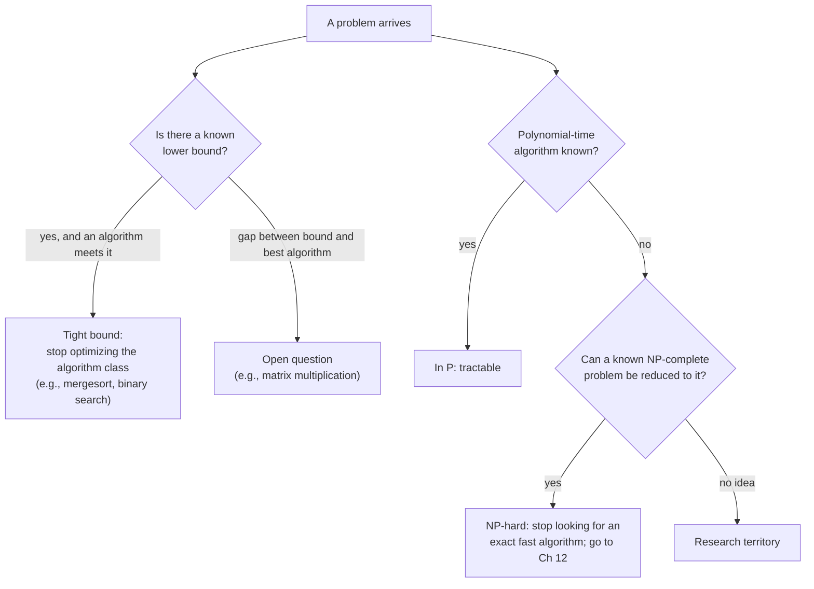
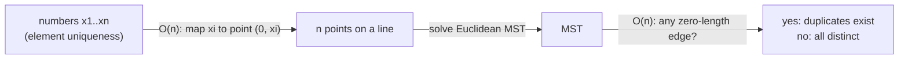
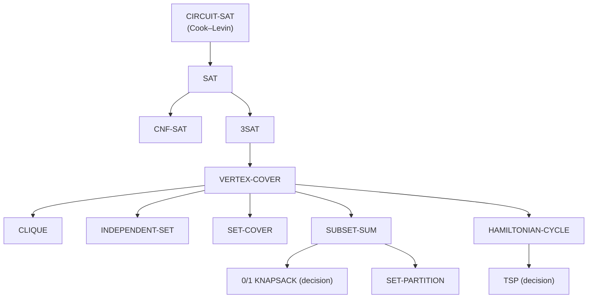

# 11 · Limitations of Algorithm Power — Lower Bounds, P, NP and NP-Completeness

> Every chapter so far asked "how fast *can* we solve this?" This chapter flips the question: **how fast is it
> *impossible* to go?** Some limits are hard proofs (no comparison sort can beat $\lceil \log_2 n! \rceil$
> comparisons in the worst case). Others are the most famous open question in computer science: for thousands of
> practical problems — scheduling, routing, packing, circuit verification — nobody knows a polynomial-time algorithm,
> and the theory of **NP-completeness** (NP stands for *Nondeterministic Polynomial* time) explains why they all stand or fall together. Knowing these limits is a
> professional skill: it stops you from wasting a month hunting for an algorithm that almost certainly does not
> exist, and points you to the coping strategies of [Chapter 12](../12-coping-with-limitations/README.md).

**Badges:** 🎮 [Decision trees](https://normansrule.github.io/algorithm-forge/sims/decision-trees.html) · [P vs NP lab](https://normansrule.github.io/algorithm-forge/sims/p-np.html) · 🏟️ [Arena problems](https://normansrule.github.io/algorithm-forge/arena/?chapter=11) · 🐍 [Code](../../src/python/algoforge/ch11_limitations.py) · 📝 [Practice](../../practice/) · ⬅️ [10 Iterative Improvement](../10-iterative-improvement/README.md) · ➡️ [12 Coping with Limitations](../12-coping-with-limitations/README.md)

---

## The big idea in 60 seconds

There are three different kinds of "you can't do better":

1. **Lower bounds for a specific problem** — *every* algorithm (in a stated model, e.g., "only compares keys") needs at
   least this much work. Tools: counting input/output (trivial bounds), decision trees (information), adversaries,
   and reductions from problems with known bounds.
2. **Intractability** — problems where the best known algorithms are exponential. We can't *prove* most of them need
   exponential time, but we can prove they are **NP-complete**: if any one of them has a polynomial-time algorithm,
   all of them do (P = NP). Decades of failure to find one is strong evidence they don't.
3. **Numerical limits** — computers store real numbers approximately, so continuous problems carry **truncation**
   and **round-off** error, and careless formulas can lose almost all their accuracy.



| Tool | Proves | Classic example |
|---|---|---|
| Trivial bound | "must read the input / write the output" | max of $n$ numbers is $\Omega(n)$ |
| Decision tree | "must learn $\log_2(\#\text{outcomes})$ bits" | comparison sorting needs $\lceil \log_2 n! \rceil$ |
| Adversary | "a devil choosing the input can force this many steps" | merging two sorted $n$-lists needs $2n-1$ comparisons |
| Reduction | "at least as hard as a problem already known to be hard" | element uniqueness ⇒ Euclidean Minimum Spanning Tree (MST) is $\Omega(n \log n)$ |
| NP-completeness | "polynomial here ⇒ P = NP" | Boolean satisfiability (SAT), 3SAT, vertex cover, the decision version of the Traveling Salesman Problem (TSP) |

---

## Card 1 · Lower Bounds — What No Algorithm Can Beat

### 🎯 Problem in one sentence
Find the minimum amount of work that *any* algorithm solving a given problem must do, so you know when your
algorithm is already as good as possible.

### 📖 Story
You are playing "guess my number between 1 and 1000" with yes/no questions. Could a genius ever guarantee success
in 5 questions? No: 5 yes/no answers can distinguish at most $2^5 = 32$ possibilities, and there are 1000. You need
at least $\lceil \log_2 1000 \rceil = 10$ questions — **no matter how clever you are**. That's a lower bound: a
statement about *all* algorithms, not about one.

### Definitions (Levitin §11.1)

- A **lower bound** is an estimate of the minimum work needed to solve a problem — either an **exact count** (e.g.,
  "at least $n-1$ comparisons") or an **efficiency class** ($\Omega(n \log n)$).
- A lower bound is **tight** if some algorithm actually achieves it (up to a constant factor for classes). Then the
  problem's complexity is *known*, and further improvement can only shave constants.

| Problem | Lower bound | Tight? |
|---|---|---|
| Sorting (comparison-based) | $\Omega(n \log n)$ | yes — mergesort, heapsort |
| Searching a sorted array (comparison-based) | $\Omega(\log n)$ | yes — binary search |
| Element uniqueness (comparison-based) | $\Omega(n \log n)$ | yes — presort then scan |
| Multiplying two $n$-digit integers | $\Omega(n)$ | unknown (best known is $O(n \log n)$, Harvey & van der Hoeven 2019) |
| Multiplying two $n \times n$ matrices | $\Omega(n^2)$ | unknown (best known exponent is about 2.37) |

### Method 1 — Trivial lower bounds (count what must be read or written)

Any algorithm must at least read all input that *could* change the answer and write all its output.

- **Max of $n$ numbers:** every element must be examined (an unexamined one could be the max) → $\Omega(n)$. Tight.
- **Evaluating a degree-$n$ polynomial** $a_nx^n + \dots + a_0$: all $n+1$ coefficients matter → $\Omega(n)$. Tight
  (Horner's rule, Chapter 6).
- **Generating all permutations of $n$ items:** the output has $n!$ items → $\Omega(n!)$. Tight.
- **Product of two $n \times n$ matrices:** must write $n^2$ entries → $\Omega(n^2)$. Tightness unknown.
- **Traveling Salesman Problem (TSP):** must read all $n(n-1)/2$ distances → $\Omega(n^2)$. True but useless: the
  best algorithms known are exponential.

⚠️ *Be careful deciding what must be processed.* Searching a **sorted** array does **not** need to read every
element — binary search reads $O(\log n)$ of them. "The input has $n$ items" is not automatically an $\Omega(n)$ bound.

### Method 2 — Information-theoretic arguments
Count how much *information* the algorithm must gather. If a problem has $N$ possible answers and each step yields a
yes/no (1 bit), at least $\lceil \log_2 N \rceil$ steps are needed. Card 2 makes this precise with **decision trees**.

### Method 3 — Adversary arguments
Imagine a malicious **adversary** who doesn't pick the input in advance but answers each of the algorithm's questions
**consistently** (some input must fit all answers so far) while trying to make the algorithm work as long as
possible. Whatever the adversary can force is a lower bound for every algorithm.

**Example A — guessing a number in $1..n$.** Each question splits the remaining candidates into "yes" and "no" sets.
The adversary always answers so that the **larger** set survives. After $k$ questions at least $n / 2^k$ candidates
remain, so the algorithm needs $k \ge \lceil \log_2 n \rceil$ questions.

**Example B — merging two sorted lists** $a_1 < a_2 < \dots < a_n$ and $b_1 < b_2 < \dots < b_n$.
The adversary answers every comparison by the rule "$a_i < b_j$ **if and only if** $i < j$." Those answers are
consistent with exactly one final order:

$$b_1 < a_1 < b_2 < a_2 < \dots < b_n < a_n$$

This order has $2n - 1$ **adjacent pairs** ($b_1a_1$, $a_1b_2$, $b_2a_2$, …). Suppose an algorithm never compared some
adjacent pair, say $a_i$ and $b_{i+1}$. Then swapping just those two values gives another input consistent with
*every* answer given — but with a different correct output. The algorithm can't tell them apart, so it would be wrong
on one of them. Therefore **every adjacent pair must be compared: at least $2n - 1$ comparisons**, which is exactly
what the standard merge uses in the worst case. Tight!

(For $n = 3$: order $b_1 < a_1 < b_2 < a_2 < b_3 < a_3$ has 5 adjacent pairs, and the standard merge on this input
makes exactly $5 = 2\cdot3-1$ comparisons.)

**Example C — max of $n$ numbers needs $n - 1$ comparisons.** Every element except the max must *lose* at least one
comparison (otherwise it could be the max). Each comparison produces at most one loser. So $\ge n-1$ comparisons.

### Method 4 — Problem reduction
If problem $Q$ has a known lower bound and $Q$ can be **reduced** to problem $P$ cheaply (transform a $Q$-instance
into a $P$-instance, solve $P$, transform back — all fast), then $P$ can't be easier than $Q$: **$Q$'s lower bound is
a lower bound for $P$** (minus the reduction cost).

**Worked example (course slides).** $P$ = Euclidean Minimum Spanning Tree (MST) of $n$ points in the plane.
$Q$ = **element uniqueness** ("are all $n$ numbers distinct?"), known to need $\Omega(n \log n)$ comparisons.

Reduction: given numbers $x_1, \dots, x_n$, build points $(0, x_1), (0, x_2), \dots, (0, x_n)$ — $O(n)$ work. Find
their Euclidean MST. The numbers are all distinct **if and only if** the MST has **no edge of length 0** (two equal
numbers give two identical points, and an MST always connects identical points by a zero-length edge; distinct
numbers give distinct points, so every edge has positive length). Checking the $n - 1$ MST edges is $O(n)$.

So if Euclidean MST could be solved in $o(n \log n)$, element uniqueness could too — impossible. Hence Euclidean MST
is $\Omega(n \log n)$.



Other classic reductions (Levitin §11.1): element uniqueness → closest pair (duplicates ⇔ closest distance 0);
sorting → convex hull (map $x_i$ to $(x_i, x_i^2)$ on a parabola; the hull lists them in sorted order); integer
multiplication ⇔ squaring (because $xy = \frac{(x+y)^2 - (x-y)^2}{4}$).

⚠️ **Direction matters.** To prove $P$ is hard, reduce the *known-hard* problem **to** $P$. Reducing $P$ to a hard
problem proves nothing about $P$ (you can always solve an easy problem with a hard tool).

---

## Card 2 · Decision Trees — The Information Lower Bound, Made Precise

### 🎯 Problem in one sentence
Model any comparison-based algorithm as a tree of questions, and use the tree's shape to prove a minimum number of
comparisons.

### 📖 Story
A decision tree is a "choose your own adventure" book: each page asks one question ("is $a < b$?") and sends you to
one of two pages; the last pages are the endings (the algorithm's outputs). The **longest adventure** is the
worst-case number of comparisons. A book with $l$ endings in which every page offers two choices must have some path
of length at least $\lceil \log_2 l \rceil$.

**Key fact.** A binary tree of height $h$ has at most $2^h$ leaves. So a binary tree with $l$ leaves has
$h \ge \lceil \log_2 l \rceil$. (For ternary trees — three-way comparisons $<, =, >$ — $h \ge \lceil \log_3 l \rceil$.)

### 👀 See it
🎮 Open the [Decision trees simulation](https://normansrule.github.io/algorithm-forge/sims/decision-trees.html): pick
an algorithm (insertion sort, selection sort, binary search) and a size, and it grows the full decision tree, marks
the longest path, and compares its height to the information-theoretic bound.

**Decision tree of insertion sort on three elements $a, b, c$** (built by running insertion sort on all $3! = 6$
orderings in Python):

```
                               a < b ?
                     yes /                \ no
                        /                  \
                  b < c ?                  a < c ?
               yes /    \ no            yes /    \ no
                  /      \                 /      \
             a<b<c      a < c ?        b<a<c      b < c ?
                     yes /   \ no              yes /   \ no
                        /     \                   /     \
                    a<c<b    c<a<b            b<c<a    c<b<a
```

- 6 leaves = the $3! = 6$ possible orders. Height 3 = $\lceil \log_2 6 \rceil = 3$, so insertion sort is **optimal**
  for $n = 3$ in the worst case.
- Average over the 6 equally likely orders: $(2 + 3 + 3 + 2 + 3 + 3)/6 = 16/6 \approx 2.67$ comparisons.

### Decision trees for sorting

Any comparison sort of $n$ distinct keys must be able to produce all $n!$ orderings, so its tree has at least $n!$
leaves:

$$C_{\text{worst}}(n) \;\ge\; \lceil \log_2 n! \rceil \;\approx\; n\log_2 n - 1.44\,n \quad\text{(by Stirling's formula)}.$$

The average case obeys the same bound: $C_{\text{avg}}(n) \ge \log_2 n!$ (Levitin §11.2). Numbers (computed exactly):

| $n$ | $n!$ | $\lceil \log_2 n! \rceil$ | $n\log_2 n$ | mergesort worst case $n\lceil\log_2 n\rceil - 2^{\lceil\log_2 n\rceil} + 1$ |
|---|---|---|---|---|
| 3 | 6 | 3 | 4.8 | 3 |
| 4 | 24 | 5 | 8.0 | 5 |
| 5 | 120 | 7 | 11.6 | 8 |
| 10 | 3,628,800 | 22 | 33.2 | 25 |
| 20 | ≈ $2.43 \times 10^{18}$ | 62 | 86.4 | 69 |
| 100 | — | 525 | 664.4 | 573 |
| 1000 | — | 8530 | 9965.8 | 8977 |

Mergesort is within a few percent of the bound — the $\Omega(n \log n)$ lower bound is **tight**. For small $n$ the
exact story is subtle: 5 keys can be sorted in 7 comparisons (the bound), but 12 keys need 30 even though
$\lceil \log_2 12! \rceil = 29$ (Knuth, *The Art of Computer Programming*, Vol. 3, §5.3.1). The bound is a floor, not a promise.

⚠️ The bound is for **comparison-based** sorting. Counting sort and radix sort (Chapter 7) don't compare keys, so they
can run in $O(n)$ for small integer keys. Always state the model.

### Decision trees for searching a sorted array

Searching $A[0..n-1]$ for $K$ with three-way comparisons (<, =, >) has $2n + 1$ outcomes: "found at $i$" for $n$
positions and "not found, falls in gap $j$" for the $n + 1$ gaps. A ternary tree gives
$C_{\text{worst}}(n) \ge \lceil \log_3 (2n+1) \rceil$. A sharper argument: the $n$ "found" outcomes are internal
nodes, and removing the middle "=" branches leaves a **binary** tree with $n+1$ leaves, so

$$C_{\text{worst}}(n) \ge \lceil \log_2 (n+1) \rceil,$$

exactly the worst case of binary search. Tight again. Ternary decision tree of binary search on 4 elements:

```
                              K vs A[1]
               <                  =                  >
          K vs A[0]           found A[1]         K vs A[2]
        <     =      >                         <      =       >
   K<A[0]  found  gap(A0,A1)            gap(A1,A2)  found   K vs A[3]
           A[0]                                     A[2]   <     =     >
                                                   gap(A2,A3) found  K>A[3]
                                                              A[3]
```

Height 3 = $\lceil \log_2 5 \rceil$. The two bounds compared:

| $n$ | $\lceil \log_2 (n+1) \rceil$ | $\lceil \log_3 (2n+1) \rceil$ |
|---|---|---|
| 4 | 3 | 2 |
| 10 | 4 | 3 |
| 100 | 7 | 5 |
| 1000 | 10 | 7 |
| $10^6$ | 20 | 14 |

### 💻 Code — build a decision tree by brute force

<details><summary>🐍 Python: compute the information-theoretic bound and the real insertion-sort decision tree</summary>

```python
import math
from itertools import permutations

def sorting_lower_bound(n):
    """Worst-case comparisons any comparison sort needs: ceil(log2(n!))."""
    return math.ceil(math.log2(math.factorial(n)))

def insertion_sort_comparisons(arr):
    """Returns the list of comparison outcomes insertion sort makes on arr."""
    a, outcomes = list(arr), []
    for i in range(1, len(a)):
        v, j = a[i], i - 1
        while j >= 0:
            outcomes.append(a[j] > v)
            if a[j] > v:
                a[j + 1] = a[j]
                j -= 1
            else:
                break
        a[j + 1] = v
    return outcomes

def tree_stats(n):
    """Every permutation is one root-to-leaf path; height = longest path."""
    paths = [insertion_sort_comparisons(p) for p in permutations(range(n))]
    lengths = [len(p) for p in paths]
    return max(lengths), sum(lengths) / len(lengths)

if __name__ == "__main__":
    for n in range(2, 8):
        h, avg = tree_stats(n)
        print(f"n={n}: bound {sorting_lower_bound(n)}, insertion sort worst {h}, average {avg:.2f}")
    # n=3: bound 3, insertion sort worst 3, average 2.67
```
</details>

### ⚠️ Common mistakes

- Writing $\log_2 n!$ without the ceiling for the worst case (the number of comparisons is an integer).
- Forgetting that the bound applies only to algorithms whose *only* way to learn about the keys is comparing them.
- Using $n$ leaves for searching instead of $n + 1$ (binary) or $2n + 1$ (ternary) — unsuccessful outcomes count too.

---

## Card 3 · P and NP — Tractable, Intractable, and "Easy to Check"

### 🎯 Problem in one sentence
Classify decision problems by whether they can be **solved** in polynomial time (P) or merely **verified** in
polynomial time given a proposed answer (NP).

### 📖 Story
A jigsaw puzzle with 5,000 pieces may take a week to solve. But if a friend hands you a finished one, checking it
takes a minute — just look for gaps. Many hard problems are like that: **finding** a solution seems to need a search
through exponentially many candidates, but **checking** a given candidate is quick. NP is the class of such
"easy-to-check" problems. The P vs. NP question asks: *is every problem that's easy to check also easy to solve?*

### Tractable vs. intractable

- A problem is **tractable** if it can be solved in polynomial time, $O(p(n))$ for some polynomial $p$ of the input
  size; otherwise **intractable**. Why the polynomial line? Polynomials are closed under addition, multiplication and
  composition (so combining polynomial algorithms stays polynomial), and their growth is gentle compared with
  exponentials — a table of $n^3$ vs. $2^n$ makes the case by itself.
- Some problems can't be solved by **any** algorithm: they are **undecidable**. The classic is Turing's **halting
  problem** (does program $P$ halt on input $I$?). Proof sketch: suppose algorithm $A(P, I)$ always answers correctly.
  Build $Q(P)$: "if $A(P, P)$ says *halts*, loop forever; otherwise halt." Now run $Q(Q)$: if it halts, $A$ said it
  loops… and vice versa. Contradiction — so $A$ can't exist.
- Some decidable problems provably need exponential time just because their **output** is exponential (list all
  subsets). The interesting cases are the ones with small (yes/no) answers where we simply don't know.

### Decision vs. optimization problems

- **Optimization:** find a best solution (shortest tour, most valuable knapsack load).
- **Decision:** yes/no question (is there a tour of length $\le K$? a load of value $\ge K$ that fits?).

Complexity theory works with **decision** problems because it makes the classes cleaner, and we lose little: if you
can solve the decision version fast, binary search on $K$ usually recovers the optimal value with a polynomial number
of calls.

### Class P

> **Class P** is the class of decision problems that can be solved in polynomial time by (deterministic) algorithms.

Examples: searching; element uniqueness; graph connectivity; graph acyclicity; "is there a path from $s$ to $t$ of
length $\le K$?"; "is there a spanning tree of weight $\le K$?"; primality testing (in P since the Agrawal–Kayal–Saxena (AKS)
algorithm, 2002).

### Nondeterministic algorithms and class NP

> A **nondeterministic algorithm** for a decision problem is a two-stage procedure that takes an instance $I$:
> 1. **Guessing stage (nondeterministic):** generate an arbitrary string $S$ — a candidate solution (certificate);
> 2. **Verification stage (deterministic):** take $I$ and $S$ and output *yes* if $S$ proves $I$ is a yes-instance
>    (otherwise output *no* or run forever).
>
> It **solves** the problem if for every yes-instance *some* guess makes it output yes, and for no no-instance does it
> ever output yes. It is **nondeterministic polynomial** if the verification stage runs in polynomial time.

> **Class NP** (Nondeterministic Polynomial) is the class of decision problems solvable by nondeterministic
> polynomial algorithms — equivalently, problems whose yes-answers have certificates that can be **verified in
> polynomial time**.

The "guess" is not a real computer instruction; it's a way to say "a proof of yes exists and is short." Nobody claims
a real machine guesses correctly.

**P ⊆ NP**: for a problem in P, the verifier can ignore the guess and just solve the instance.

### Example: Conjunctive Normal Form satisfiability (CNF-SAT) is in NP

A Boolean formula is in **Conjunctive Normal Form (CNF)** if it is an AND of **clauses**, each an OR of **literals**
(variables or their negations). CNF-SAT asks: is there a truth assignment making the formula true? The course
example:

$$(A \lor \neg B \lor \neg C) \land (A \lor B) \land (\neg B \lor \neg D \lor E) \land (\neg D \lor \neg E)$$

- **Guess** an assignment of $A..E$ (32 possibilities).
- **Verify**: substitute and evaluate each clause — linear in the formula's length.

For instance $A = 1, B = 0, C = 0, D = 0, E = 0$ satisfies all four clauses; brute force over all 32 assignments finds
12 satisfying ones. Solving deterministically by trying all $2^n$ assignments is exponential; checking one is $O(n)$.

Other problems in NP (the decision versions): Hamiltonian circuit, partition, TSP, knapsack, graph coloring, vertex
cover, clique. (MST and shortest paths are in NP too — they're in P.)

### 👀 See it
🎮 Open the [P vs NP lab](https://normansrule.github.io/algorithm-forge/sims/p-np.html): type a CNF formula and race
"brute-force search" (counts assignments tried, doubling with each new variable) against "verify one certificate"
(counts one pass over the clauses). A second tab animates the reductions in Card 4.

### 🧱 Build it in blocks — a verifier

**Block 1 — state.** The instance (clauses) and the certificate (truth values).
**Block 2 — skeleton.** Loop over clauses.
**Block 3 — decision.** A clause is satisfied if *any* literal is true; the formula fails if *any* clause is unsatisfied.
**Block 4 — return** true only if every clause passed.

```
ALGORITHM VerifyCNF(C, m, k, T)
    // Verification stage of the nondeterministic algorithm for CNF-SAT
    // Input: C — m × k matrix of literals: C[i, j] = +v means variable v,
    //        -v means "not v", 0 means an unused slot in a short clause;
    //        T[1..n] — the proposed truth values (the certificate)
    // Output: true if every clause contains at least one true literal
    for i ← 0 to m - 1 do
        satisfied ← false
        for j ← 0 to k - 1 do
            lit ← C[i, j]
            if lit > 0 then
                if T[lit] then
                    satisfied ← true
            else if lit < 0 then
                if not T[-lit] then
                    satisfied ← true
        if not satisfied then
            return false
    return true
```

Verification is $O(mk)$ — polynomial. The best known *solving* algorithms are exponential in the worst case.

<details><summary>🐍 Python: verifier vs. brute-force solver</summary>

```python
from itertools import product

def verify(clauses, assignment):
    """clauses: list of lists of ints (+v = variable v, -v = not v); assignment: dict v -> bool.
    Polynomial-time verification: O(total number of literals)."""
    return all(any(assignment[abs(l)] == (l > 0) for l in clause) for clause in clauses)

def brute_force_sat(clauses, n):
    """Tries all 2^n assignments -- exponential. Returns (first satisfying assignment, tries)."""
    tries = 0
    for bits in product([False, True], repeat=n):
        tries += 1
        a = {v + 1: bits[v] for v in range(n)}
        if verify(clauses, a):
            return a, tries
    return None, tries

if __name__ == "__main__":
    # (A or not B or not C) and (A or B) and (not B or not D or E) and (not D or not E); A..E = 1..5
    f = [[1, -2, -3], [1, 2], [-2, -4, 5], [-4, -5]]
    print(verify(f, {1: True, 2: False, 3: False, 4: False, 5: False}))   # True
    print(brute_force_sat(f, 5))
    count = sum(verify(f, {v + 1: b[v] for v in range(5)}) for b in product([False, True], repeat=5))
    print(count, "of 32 assignments satisfy f")                             # 12 of 32
```
</details>

<details><summary>☕ Java: verifier and brute force</summary>

```java
public class CnfSat {
    /** clauses[i] holds literals: +v = variable v, -v = not v (variables 1..n). */
    static boolean verify(int[][] clauses, boolean[] t) {
        for (int[] clause : clauses) {
            boolean sat = false;
            for (int lit : clause) {
                if (lit > 0 && t[lit]) sat = true;
                if (lit < 0 && !t[-lit]) sat = true;
            }
            if (!sat) return false;
        }
        return true;
    }

    /** Exponential search: returns number of satisfying assignments. */
    static int countSolutions(int[][] clauses, int n) {
        int count = 0;
        for (int mask = 0; mask < (1 << n); mask++) {
            boolean[] t = new boolean[n + 1];
            for (int v = 1; v <= n; v++) t[v] = ((mask >> (v - 1)) & 1) == 1;
            if (verify(clauses, t)) count++;
        }
        return count;
    }

    public static void main(String[] args) {
        int[][] f = {{1, -2, -3}, {1, 2}, {-2, -4, 5}, {-4, -5}};
        System.out.println(countSolutions(f, 5));   // 12
    }
}
```
</details>

### Course practice — "an $O(n^{\log_2 n})$ algorithm: tractable?"

> *A problem can be solved by an algorithm whose running time is in $O(n^{\log_2 n})$. Is the problem (a) tractable,
> (b) intractable, or (c) impossible to tell?*

**Answer: (c) impossible to tell.** Reasoning in two steps:

1. $n^{\log_2 n} = 2^{(\log_2 n)^2}$ is **not** bounded by any polynomial: for any fixed $k$, $\log_2 n$ eventually
   exceeds $k$, so $n^{\log_2 n} > n^k$. (It's "quasi-polynomial" — slower-growing than $2^n$ but faster than every
   $n^k$.) So this algorithm does **not** show the problem is tractable.
2. But it doesn't show intractability either: $O$ is only an **upper** bound on this algorithm (it might actually be
   faster), and a **different** algorithm might solve the problem in polynomial time. Intractability is a claim about
   *all* algorithms.

| $n$ | $n^3$ | $n^{\log_2 n}$ | $2^n$ |
|---|---|---|---|
| 8 | 512 | 512 | 256 |
| 16 | 4,096 | 65,536 | 65,536 |
| 64 | 262,144 | ≈ $6.9 \times 10^{10}$ | ≈ $1.8 \times 10^{19}$ |
| 1024 | ≈ $1.1 \times 10^{9}$ | ≈ $1.3 \times 10^{30}$ | ≈ $1.8 \times 10^{308}$ |

---

## Card 4 · NP-Complete and NP-Hard Problems — Reductions

### 🎯 Problem in one sentence
Show a problem is among the "hardest in NP" by transforming a known NP-complete problem into it in polynomial time.

### 📖 Story
Think of NP-complete problems as a giant web of secret tunnels: every NP problem has a tunnel (a polynomial
reduction) leading into each NP-complete problem. Dig a fast road through **any one** NP-complete problem and every
problem in NP becomes fast. That's why proving your product's problem NP-complete is like saying "thousands of
excellent researchers have, in effect, already failed to solve my problem efficiently."

### Definitions

> **Polynomial reduction.** A decision problem $D_1$ is **polynomially reducible** to $D_2$ (written
> $D_1 \le_p D_2$) if there is a function $t$, computable in polynomial time, that maps every instance of $D_1$ to an
> instance of $D_2$ such that **$I$ is a yes-instance of $D_1$ if and only if $t(I)$ is a yes-instance of $D_2$**.

Consequence: if $D_2$ has a polynomial algorithm, so does $D_1$ (transform, then solve).

> **NP-complete.** A decision problem $D$ is NP-complete if (1) $D \in$ NP and (2) **every** problem in NP is
> polynomially reducible to $D$.
>
> **NP-hard.** A problem is NP-hard if every problem in NP is polynomially reducible to it — condition (2) only.
> It need not be in NP; it need not even be a decision problem (optimization TSP is NP-hard; the halting problem is
> NP-hard but not in NP).

So: **NP-complete = NP-hard ∩ NP.**

**Transitivity.** If $A \le_p B$ and $B \le_p C$, then $A \le_p C$. *Proof:* compose the transformations,
$x \mapsto y = t_1(x) \mapsto z = t_2(y)$. Then $x \in A \iff y \in B \iff z \in C$. If $t_1$ runs in time $p_1(n)$,
its output has size at most $p_1(n)$, so $t_2$ runs in $p_2(p_1(n))$ — a polynomial of a polynomial is a polynomial.

This is why we never need to reduce *all* of NP to a new problem again: to show $D$ is NP-complete,
1. show $D \in$ NP (give a polynomial verifier), and
2. reduce **one known NP-complete problem** to $D$.

**The big picture.** If any NP-complete problem is in P, then P = NP. Most researchers believe P ≠ NP, i.e., P is a
proper subset of NP and NP-complete problems have no polynomial algorithms. It's one of the seven Clay Millennium
Prize Problems (a \$1,000,000 prize).

### The first NP-complete problem — Cook–Levin

> **Cook–Levin Theorem** (Cook 1971, Levin 1973). CIRCUIT-SAT is NP-complete. (Levitin and many textbooks state the
> equivalent result for CNF-SAT.)

**CIRCUIT-SAT:** given a Boolean circuit of AND, OR and NOT gates with one output, is there an assignment of 0s and 1s
to its inputs that makes the output 1?

- **In NP:** guess the inputs *and* the value on every gate's output wire; check each gate's truth table — linear time.
- **NP-hard (idea):** take any NP problem $M$ with a polynomial-time verifier $D$ that runs in $p(n)$ steps. A
  computer executing one step of $D$ is itself a fixed Boolean circuit $S$ (registers, program counter, memory in, the
  same things out). Stack $p(n)$ copies of $S$, one per step, wire the instance $x$ in as constants, leave the
  certificate $y$ as the only free inputs, and let the output be "verifier accepted." The circuit is satisfiable
  **iff** some certificate makes $D$ accept **iff** $x$ is a yes-instance of $M$. Its size is polynomial (the slides
  estimate $O(p(n)^3)$), so the construction is a polynomial reduction.

### The reduction chain



(Arrows mean "reduces to": each problem below is shown NP-hard by reducing the one above into it — this is the order
in the course slides.)

**SAT is NP-complete** (reduce CIRCUIT-SAT to SAT): make one variable per input and per gate; for each gate write a
small formula forcing its variable to equal the gate's function (e.g., $e \leftrightarrow (a \lor b)$ for an OR gate,
$f \leftrightarrow \neg c$ for a NOT gate); AND all of these with the output variable. Satisfiable ⇔ the circuit is.

**CNF-SAT and 3SAT.** SAT stays NP-complete when the formula must be in CNF, and even when every clause has exactly
3 literals (**3SAT**), e.g. $(a \lor b \lor \neg d)(\neg a \lor \neg c \lor e)(\neg b \lor d \lor e)(a \lor \neg c \lor \neg e)$.
A typical *local replacement* step: a long clause $(l_1 \lor l_2 \lor l_3 \lor l_4)$ becomes
$(l_1 \lor l_2 \lor y)(\neg y \lor l_3 \lor l_4)$ with a fresh variable $y$ — satisfiable for exactly the same
settings of the $l_i$ (checked exhaustively in Python). (2SAT, by contrast, is in P.)

### ✋ The star reduction: 3SAT → VERTEX-COVER (worked example)

**VERTEX-COVER:** given a graph $G$ and integer $K$, is there a set $W$ of at most $K$ vertices such that every edge
has at least one endpoint in $W$? It's in NP: the certificate is $W$; check $|W| \le K$ and every edge — $O(n + m)$.

**Construction** (a *component design* reduction). Given a 3-CNF formula with $n$ variables and $m$ clauses:

1. **Variable gadget:** for each variable $x$, two vertices $x$ and $\neg x$ joined by an edge.
2. **Clause gadget:** for each clause, a **triangle** of three vertices, one per literal.
3. **Connections:** join each triangle vertex to the variable-gadget vertex of the same literal.
4. Set $K = n + 2m$. The graph has $2n + 3m$ vertices and $n + 6m$ edges.

**Example (course slides):** $(a \lor b \lor c)(\neg a \lor b \lor \neg c)(\neg b \lor \neg c \lor \neg d)$.
$n = 4$, $m = 3$: $2\cdot4 + 3\cdot3 = 17$ vertices, $4 + 6\cdot3 = 22$ edges, $K = 4 + 2\cdot3 = 10$.

```
 variable gadgets:   a ─ ¬a       b ─ ¬b       c ─ ¬c       d ─ ¬d

 clause 1 (a ∨ b ∨ c)        clause 2 (¬a ∨ b ∨ ¬c)       clause 3 (¬b ∨ ¬c ∨ ¬d)
        a₁                           ¬a₂                          ¬b₃
       /  \                          /  \                         /  \
     b₁ ── c₁                      b₂ ── ¬c₂                   ¬c₃ ── ¬d₃

 connections: a₁─a  b₁─b  c₁─c   ¬a₂─¬a  b₂─b  ¬c₂─¬c   ¬b₃─¬b  ¬c₃─¬c  ¬d₃─¬d
```

**Satisfying assignment → cover of size 10.** Take $a = T$, $b = T$, $c = F$, $d = F$ (clause 1 is true via $a$,
clause 2 via $b$, clause 3 via $\neg c$).

- From each variable gadget take the **true** literal: $\{a, b, \neg c, \neg d\}$ — 4 vertices, covering the 4
  gadget edges.
- From each triangle take the two vertices **other than one true literal**: clause 1 leaves out $a_1$ →
  $\{b_1, c_1\}$; clause 2 leaves out $b_2$ → $\{\neg a_2, \neg c_2\}$; clause 3 leaves out $\neg c_3$ →
  $\{\neg b_3, \neg d_3\}$ — 6 vertices; two corners of a triangle cover all three triangle edges.
- Connection edges: those from the chosen triangle vertices are covered. The left-out vertices $a_1, b_2, \neg c_3$
  are true literals, so their partners $a, b, \neg c$ are in the cover. ✔

Total $4 + 6 = 10 = K$. (Verified in Python: this set covers all 22 edges, and brute force shows no cover of size 9
exists — as the proof below predicts.)

**Why it works — both directions.**

- *(⇒)* The construction above works for any satisfying assignment.
- *(⇐)* Any vertex cover must contain **at least one** vertex of each variable edge ($n$ total) and **at least two**
  vertices of each triangle ($2m$ total). If the cover has size $\le K = n + 2m$, it has **exactly** one per variable
  gadget and exactly two per triangle. Set each variable true or false according to which of its gadget vertices is
  in the cover (consistent: exactly one is). In each triangle, the one vertex **not** in the cover has a connection
  edge that still must be covered — by its partner in the variable gadget. So that literal is true, and the clause is
  satisfied. Every clause is satisfied.
- The graph is built in $O(n + m)$ time. ∎

### More reductions (short versions)

| Target | Reduction from | Idea (yes ⇔ yes) |
|---|---|---|
| **CLIQUE** ($G$ has $\ge K$ mutually adjacent vertices?) | VERTEX-COVER | $W$ is a vertex cover of $G$ ⇔ $V \setminus W$ has no edges of $G$ ⇔ $V \setminus W$ is a **clique in the complement** $\bar G$. So $G$ has a cover of size $K$ ⇔ $\bar G$ has a clique of size $n - K$. |
| **INDEPENDENT-SET** (no two chosen vertices adjacent) | VERTEX-COVER or CLIQUE | $I$ independent in $G$ ⇔ $V \setminus I$ is a vertex cover ⇔ $I$ is a clique in $\bar G$. |
| **SET-COVER** ($K$ sets whose union is everything) | VERTEX-COVER | universe = edges; for each vertex $v$, the set of edges touching $v$. $K$ sets cover all edges ⇔ $K$ vertices cover all edges. |
| **SUBSET-SUM** (subset summing to exactly $K$) | VERTEX-COVER | a digit-based encoding of edges and vertices into large numbers (see Cormen, Leiserson, Rivest & Stein (CLRS) §34.5.5, or Goodrich–Tamassia); details omitted here. |
| **0/1 KNAPSACK** (weight $\le W$, value $\ge K$?) | SUBSET-SUM | item $i$ gets weight = value = $a_i$; set $W = K$ and value target $K$. A load with weight $\le K$ and value $\ge K$ must have sum exactly $K$. |
| **HAMILTONIAN-CYCLE** | VERTEX-COVER | a gadget of 12 vertices per edge (see CLRS §34.5.3). |
| **TSP** (tour of total cost $\le K$ in a complete weighted graph?) | HAMILTONIAN-CYCLE | complete graph on the same vertices; weight 1 for edges of $G$, weight 2 for non-edges; $K = n$. A tour of cost $n$ uses only original edges ⇔ $G$ has a Hamiltonian cycle. |
| **SET-PARTITION** | SUBSET-SUM | see the practice problem below (both directions). |

### ✋ Course practice — prove SUBSET-SUM is NP-complete, given SET-PARTITION is

- **SET-PARTITION:** given a multiset $X$ of positive integers, can it be split into two parts with equal sums?
- **SUBSET-SUM:** given a multiset $X$ of positive integers and a target $K$, is there a sub-multiset summing to $K$?

**Step 1 — SUBSET-SUM ∈ NP.** Certificate: the chosen elements (or a 0/1 vector). Verify by adding them up and
comparing with $K$ — $O(n)$ additions of numbers no longer than the input. ✔

**Step 2 — SUBSET-SUM is NP-hard: reduce SET-PARTITION to it** (known-hard problem **→** new problem).

Given $X$, let $S = \sum X$.
- If $S$ is odd, output a fixed no-instance of SUBSET-SUM, e.g., $X' = \{1\}, K = 2$ (an odd total can't split
  evenly).
- Otherwise output $(X, K = S/2)$.

*Correctness:* if $X$ splits into $A$ and $X \setminus A$ with equal sums, then $\sum A = S/2 = K$ — yes-instance. If
some $A \subseteq X$ has $\sum A = S/2$, then $\sum(X \setminus A) = S - S/2 = S/2$ — a valid partition. The
transformation costs $O(n)$ additions. ∎ Together with Step 1, **SUBSET-SUM is NP-complete**.

*Example:* $X = \{3, 1, 1, 2, 2, 1\}$, $S = 10$ → SUBSET-SUM instance $(X, 5)$; $\{3, 2\}$ sums to 5, and indeed
$\{3,2\}$ vs. $\{1,1,2,1\}$ is a partition.

**The other direction — SUBSET-SUM ≤ₚ SET-PARTITION** (this is what you'd use to show SET-PARTITION is NP-hard if you
only knew SUBSET-SUM was). Given $(X, K)$ with $S = \sum X$:
- If $K > S$, output a fixed no-instance, e.g., $\{1, 2\}$.
- Otherwise output $X' = X \cup \{\,2S - K,\ S + K\,\}$.

*Correctness:* the total of $X'$ is $S + (2S-K) + (S+K) = 4S$, so each side of a partition must sum to $2S$. The two
new numbers sum to $3S > 2S$, so they must be on **opposite** sides. The side holding $2S - K$ needs exactly $K$ more
from $X$. So $X'$ can be partitioned ⇔ some subset of $X$ sums to $K$. (Both new numbers are positive because
$0 \le K \le S$.) ∎

*Example:* $X = \{5, 9, 4, 13\}$, $S = 31$, $K = 18$ → $X' = \{5, 9, 4, 13, 44, 49\}$ (total 124, half 62):
$\{44, 5, 13\}$ vs. $\{49, 9, 4\}$ ✔. With $K = 8$ (no subset sums to 8) → $\{5, 9, 4, 13, 54, 39\}$ has no
partition ✔. (Both reductions were checked against brute force on 3,000 random instances — zero mismatches.)

⚠️ The most common exam error is reducing in the **wrong direction**: "SUBSET-SUM reduces to SET-PARTITION, therefore
SUBSET-SUM is hard" is invalid. To transfer hardness **to** a problem, the known-hard problem must reduce **into** it.

### Course practice — which Venn diagrams don't contradict what we know?

The slides draw several pictures of P, NP and NPC (the NP-complete problems). Here is how to judge **any** such
picture — and the two that survive.

| Picture | Verdict | Why |
|---|---|---|
| P = NP = NPC (one single region) | ✘ contradicts | Even if P = NP, **trivial** decision problems (answer always yes, or always no) are in P but can't be NP-complete: no yes-instance can map into a problem that has no yes-instances. So NPC ≠ NP. |
| P = NP, with NPC a region **inside** it | ✔ consistent | This is what the world looks like **if** P = NP: then every nontrivial problem in NP is NP-complete, so NPC is all of NP except the two trivial problems. |
| P and NPC as **disjoint** regions inside NP, with room between them | ✔ consistent | This is what most researchers believe (P ≠ NP). Ladner's theorem (1975) adds that if P ≠ NP there are NP problems that are **neither** in P nor NP-complete — hence the gap. |
| P and NPC **overlapping** (but not equal to NP) | ✘ contradicts | A problem in both P and NPC would make P = NP, and then the picture would have to collapse to the P = NP picture. |
| NPC sticking **outside** NP, or NP drawn inside P with P ≠ NP | ✘ contradicts | By definition NPC ⊆ NP, and P ⊆ NP is a proven fact. |
| P and NPC together **exactly filling** NP (no gap) | ✘ contradicts (subtle) | If P ≠ NP, Ladner's theorem says NP \ (P ∪ NPC) is non-empty. |

So exactly two kinds of pictures are acceptable: the "P = NP with NPC inside" picture and the "P ≠ NP with P and NPC
disjoint and a gap" picture.

### 💻 Code — reductions you can run

**Forge Pseudocode** — the verifier for VERTEX-COVER and the SET-PARTITION → SUBSET-SUM transformation:

```
ALGORITHM VerifyVertexCover(U[0..m-1], V[0..m-1], inW, K, n)
    // Verification stage for VERTEX-COVER
    // Input: edges (U[i], V[i]) for i = 0..m-1; inW[0..n-1] — true if the vertex is in the
    //        proposed cover W; K — the size limit
    // Output: true if W has at most K vertices and touches every edge
    size ← 0
    for v ← 0 to n - 1 do
        if inW[v] then
            size ← size + 1
    if size > K then
        return false
    for i ← 0 to m - 1 do
        if not inW[U[i]] and not inW[V[i]] then
            return false
    return true

ALGORITHM PartitionToSubsetSum(X[0..n-1])
    // Polynomial reduction SET-PARTITION ≤p SUBSET-SUM
    // Output: the target K of a SUBSET-SUM instance on the same numbers X,
    //         or -1 to signal the fixed no-instance ({1}, K = 2) when the total is odd
    S ← 0
    for i ← 0 to n - 1 do
        S ← S + X[i]
    if S mod 2 = 1 then
        return -1
    return S div 2
```

<details><summary>🐍 Python: 3SAT → VERTEX-COVER, and both SUBSET-SUM ↔ SET-PARTITION reductions, checked by brute force</summary>

```python
from itertools import combinations, product

def three_sat_to_vertex_cover(clauses, variables):
    """clauses: list of 3-literal lists like ['a', '-b', 'c']. Returns (vertices, edges, K)."""
    V, E = [], []
    for x in variables:                                   # variable gadgets
        V += [x, "-" + x]
        E.append((x, "-" + x))
    for k, clause in enumerate(clauses, start=1):         # clause triangles + connections
        tri = [f"{lit}@{k}" for lit in clause]
        V += tri
        E += [(tri[0], tri[1]), (tri[1], tri[2]), (tri[0], tri[2])]
        E += [(t, lit) for t, lit in zip(tri, clause)]
    return V, E, len(variables) + 2 * len(clauses)

def is_vertex_cover(E, W, K):
    W = set(W)
    return len(W) <= K and all(a in W or b in W for a, b in E)

def cover_from_assignment(clauses, variables, value):
    """value: dict var -> bool (a satisfying assignment)."""
    true = lambda lit: (not value[lit[1:]]) if lit.startswith("-") else value[lit]
    W = [x if value[x] else "-" + x for x in variables]
    for k, clause in enumerate(clauses, start=1):
        skip = next(i for i, lit in enumerate(clause) if true(lit))   # leave out one true literal
        W += [f"{lit}@{k}" for i, lit in enumerate(clause) if i != skip]
    return W

def subset_sum(X, K):          # brute force, only for checking small cases
    return any(sum(c) == K for r in range(len(X) + 1) for c in combinations(X, r))

def partition_to_subset_sum(X):
    S = sum(X)
    return (list(X), S // 2) if S % 2 == 0 else ([1], 2)

def subset_sum_to_partition(X, K):
    S = sum(X)
    return list(X) + [2 * S - K, S + K] if 0 <= K <= S else [1, 2]

if __name__ == "__main__":
    clauses = [["a", "b", "c"], ["-a", "b", "-c"], ["-b", "-c", "-d"]]
    V, E, K = three_sat_to_vertex_cover(clauses, ["a", "b", "c", "d"])
    print(len(V), len(E), K)                                             # 17 22 10
    W = cover_from_assignment(clauses, ["a", "b", "c", "d"], {"a": True, "b": True, "c": False, "d": False})
    print(sorted(W), is_vertex_cover(E, W, K))                           # ... True
    print(any(is_vertex_cover(E, S, 9) for S in combinations(V, 9)))     # False: no cover of size 9

    X = [3, 1, 1, 2, 2, 1]
    print(partition_to_subset_sum(X), subset_sum(*partition_to_subset_sum(X)))   # ([...], 5) True
    print(subset_sum_to_partition([5, 9, 4, 13], 18))                    # [5, 9, 4, 13, 44, 49]
```
</details>

<details><summary>☕ Java: SET-PARTITION → SUBSET-SUM and the vertex-cover verifier</summary>

```java
import java.util.*;

public class Reductions {
    /** SET-PARTITION <=p SUBSET-SUM: returns the target K, or -1 for the fixed no-instance. */
    static long partitionToSubsetSum(long[] x) {
        long s = 0;
        for (long v : x) s += v;
        return (s % 2 == 1) ? -1 : s / 2;
    }

    /** SUBSET-SUM <=p SET-PARTITION: returns the new multiset (or {1,2}, a no-instance). */
    static long[] subsetSumToPartition(long[] x, long k) {
        long s = 0;
        for (long v : x) s += v;
        if (k < 0 || k > s) return new long[]{1, 2};
        long[] y = Arrays.copyOf(x, x.length + 2);
        y[x.length] = 2 * s - k;
        y[x.length + 1] = s + k;
        return y;
    }

    /** Polynomial-time verifier for VERTEX-COVER. */
    static boolean verifyCover(int[][] edges, Set<Integer> w, int k) {
        if (w.size() > k) return false;
        for (int[] e : edges) if (!w.contains(e[0]) && !w.contains(e[1])) return false;
        return true;
    }

    public static void main(String[] args) {
        System.out.println(partitionToSubsetSum(new long[]{3, 1, 1, 2, 2, 1}));                 // 5
        System.out.println(Arrays.toString(subsetSumToPartition(new long[]{5, 9, 4, 13}, 18))); // [5, 9, 4, 13, 44, 49]
        int[][] square = {{0, 1}, {1, 2}, {2, 3}, {3, 0}};
        System.out.println(verifyCover(square, Set.of(0, 2), 2));                               // true
    }
}
```
</details>

### 🧮 Analyze it

- Verifiers: $O(\text{input size})$ for SAT, vertex cover, subset sum, Hamiltonian cycle — that's what puts them in NP.
- Reductions: 3SAT → VERTEX-COVER is $O(n + m)$; SET-PARTITION ↔ SUBSET-SUM is $O(n)$. A reduction must be
  polynomial, and it must preserve yes **and** no answers.
- Solving: best known worst-case algorithms are exponential (e.g., $O(2^n \cdot \text{poly})$ brute force for SAT;
  $O(nK)$ dynamic programming for subset sum — which is **pseudo-polynomial**: polynomial in the *value* $K$ but
  exponential in the number of bits needed to write $K$).

### ⚠️ Common mistakes

- **Wrong direction of reduction** (see above). Hard → new, never new → hard.
- Proving only NP-hardness and calling the problem NP-complete — you must also show it's **in NP**.
- A reduction that preserves only "yes ⇒ yes." You need **iff**.
- Saying "NP means non-polynomial." It means *nondeterministic polynomial*. P ⊆ NP, so many NP problems are easy.
- Thinking "NP-hard" means "impossible in practice." Many NP-hard instances with thousands (or millions) of
  variables are solved daily by SAT and Integer Linear Programming (ILP) solvers. It means *no worst-case polynomial guarantee is known*.
- Treating a pseudo-polynomial algorithm (knapsack dynamic programming, $O(nW)$) as polynomial.

### 🔁 Where this shows up in real software

- **SAT solvers** (Conflict-Driven Clause Learning — CDCL — solvers like MiniSat, CaDiCaL, Kissat) verify
  **chip designs** at Intel, AMD, NVIDIA and Arm via bounded model checking and equivalence checking; they also
  power software verification and test generation.
- **Package managers** — installing packages with version constraints is NP-complete in general; several dependency
  resolvers (e.g., libsolv used by some Linux distributions, and SAT-based solvers in other ecosystems) hand the
  problem to a SAT solver.
- **Satisfiability Modulo Theories (SMT) solvers** such as Z3 check cloud access policies, compiler optimizations
  and smart contracts.
- **Integer programming** (Gurobi, CPLEX, Google's Operations Research toolkit OR-Tools) — airline crew scheduling, sports scheduling, chip
  placement: NP-hard in general, routinely solved to optimality or near it.
- **Cryptography relies on hardness** — but on problems like factoring that are *not* known to be NP-complete.

---

## Card 5 · Challenges of Numerical Algorithms

### 🎯 Problem in one sentence
Continuous mathematical problems (evaluate $e^x$, solve equations, integrate) can usually only be solved
approximately, and computers add their own errors — so a good numerical algorithm must control both.

### 📖 Story
A calculator shows $\sqrt{2} = 1.414213562$. That's not $\sqrt 2$ — it's a rounded approximation of an infinite
decimal, computed by an approximation algorithm. Most of the time the error is invisible. Occasionally, a
mathematically perfect formula loses almost *all* its correct digits. Rockets, bank ledgers and medical dosing
software have all been bitten by this.

### Accuracy metrics

- **Absolute error** of approximating $\alpha^*$ by $\alpha$: $|\alpha - \alpha^*|$.
- **Relative error**: $|\alpha - \alpha^*| / |\alpha^*|$ (undefined when $\alpha^* = 0$; often quoted in %).

### Two types of error

**Truncation error** — from replacing an infinite process by a finite one. Taylor's polynomial for $e^x$:

$$e^x \approx 1 + x + \frac{x^2}{2!} + \dots + \frac{x^n}{n!}, \qquad
|\text{error}| \le \frac{M\,|x|^{n+1}}{(n+1)!},\quad M = \max_{0 \le t \le x} e^t .$$

Our example: $x = 1$, $n = 4$: $1 + 1 + \tfrac12 + \tfrac16 + \tfrac1{24} = 2.708333\ldots$ vs. $e = 2.718281\ldots$,
actual error $\approx 0.00995$. The bound with $M = e < 3$: $3 \cdot 1^5/5! = 0.025$ — the true error is safely below
it. Similarly the composite trapezoidal rule for $\int_a^b f$ with $n$ strips of width $h$ has error at most
$\frac{(b-a)h^2}{12} M_2$ with $M_2 = \max |f''|$ (Levitin §11.4). Halving $h$ quarters the bound.

**Round-off error** — from representing real numbers with finitely many bits. A 64-bit double has about 15–16
significant decimal digits (machine epsilon $2^{-52} \approx 2.22 \times 10^{-16}$).
- `0.1 + 0.2` is `0.30000000000000004` in Python and Java, so `0.1 + 0.2 == 0.3` is **false**.
- **Overflow / underflow**: numbers too large or too small for the format (e.g., computing $n!$ or $e^{1000}$ directly).
- **Subtractive cancellation**: subtracting two nearly equal numbers wipes out their shared leading digits, leaving
  mostly noise. Example: for $x = 10^{12}$, `sqrt(x+1) - sqrt(x)` gives $5.00004 \times 10^{-7}$, but the
  algebraically equal `1 / (sqrt(x+1) + sqrt(x))` gives $4.99999999999875 \times 10^{-7}$ — the first loses about 10
  of its 16 digits.

### ✋ The quadratic formula — and how to fix it

$ax^2 + bx + c = 0$ has roots $x_{1,2} = \dfrac{-b \pm \sqrt{D}}{2a}$ with $D = b^2 - 4ac$. Correct math, dangerous
code. Take $x^2 - 10^8 x + 1 = 0$ (roots $\approx 10^8$ and $\approx 10^{-8}$). In double precision:

| Formula | Small root computed | True value | Relative error |
|---|---|---|---|
| $\dfrac{-b - \sqrt D}{2a}$ (textbook) | $7.450580596923828 \times 10^{-9}$ | $1.0000000000000000 \times 10^{-8}$ | ≈ 25% |
| $\dfrac{c}{a\,x_1}$ with $x_1 = \dfrac{-b - \operatorname{sign}(b)\sqrt{D}}{2a}$ (stable) | $1.0 \times 10^{-8}$ | $1.0000000000000000 \times 10^{-8}$ | ≈ 0 |

What went wrong: $\sqrt{D} \approx 10^8 - 2\times10^{-8}$, so $-b - \sqrt D = 10^8 - \sqrt D$ subtracts two nearly
equal numbers. **Fix:** compute the root where the signs *add* ($-b$ and $-\operatorname{sign}(b)\sqrt D$ have the
same sign), then get the other root from Vieta's formula $x_1 x_2 = c/a$. Other practical fixes from the slides:
compute $D$ in higher precision; compute $\sqrt D$ carefully (Newton's method, Chapter 12); guard against overflow
in $b^2$ (scale the coefficients).

<details><summary>🐍 Python: naive vs. stable quadratic roots</summary>

```python
import math

def roots_naive(a, b, c):
    r = math.sqrt(b * b - 4 * a * c)
    return (-b + r) / (2 * a), (-b - r) / (2 * a)

def roots_stable(a, b, c):
    """Avoids subtractive cancellation; assumes real roots and a != 0."""
    r = math.sqrt(b * b - 4 * a * c)
    q = -0.5 * (b + math.copysign(r, b))      # -b and -sign(b)*r have the same sign: no cancellation
    x1 = q / a
    x2 = c / q if q != 0 else x1              # Vieta: x1 * x2 = c / a
    return x1, x2

if __name__ == "__main__":
    print(roots_naive(1.0, -1e8, 1.0))     # (100000000.0, 7.450580596923828e-09)  <- 25% error
    print(roots_stable(1.0, -1e8, 1.0))    # (100000000.0, 1e-08)
    print(0.1 + 0.2, 0.1 + 0.2 == 0.3)     # 0.30000000000000004 False
```
</details>

<details><summary>☕ Java: the same experiment</summary>

```java
public class Quadratic {
    static double[] naive(double a, double b, double c) {
        double r = Math.sqrt(b * b - 4 * a * c);
        return new double[]{(-b + r) / (2 * a), (-b - r) / (2 * a)};
    }

    static double[] stable(double a, double b, double c) {
        double r = Math.sqrt(b * b - 4 * a * c);
        double q = -0.5 * (b + Math.copySign(r, b));
        return new double[]{q / a, c / q};
    }

    public static void main(String[] args) {
        System.out.println(naive(1, -1e8, 1)[1]);    // 7.450580596923828E-9
        System.out.println(stable(1, -1e8, 1)[1]);   // 1.0E-8
    }
}
```
</details>

### ⚠️ Common mistakes

- Comparing floating-point numbers with `==`. Use a tolerance: `abs(x - y) <= 1e-9 * max(1, abs(x), abs(y))`.
- Storing money in binary floating point. Use integer cents or a decimal type (`decimal.Decimal`, `BigDecimal`).
- Assuming more terms / smaller steps always help: shrinking $h$ reduces truncation error but eventually *increases*
  round-off error.
- Blaming the computer for an **ill-conditioned** problem — some problems amplify tiny input changes no matter which
  algorithm you use.

---

## How a senior engineer thinks about this chapter

1. **Recognize NP-hardness in a product requirement.** "Assign all technicians to all jobs to minimize total driving"
   (vehicle routing), "choose the fewest test machines that cover every configuration" (set cover), "pack these
   containers onto the fewest hosts" (bin packing), "build the conference schedule with no conflicts" (graph
   coloring). When you hear *optimal* + *combinations*, reach for Chapter 11 before you write code.
2. **NP-hard is the beginning of the design conversation, not the end.** Options, roughly in order:
   - **Is $n$ small?** Exact search (dynamic programming, branch-and-bound, backtracking) may be fine for $n \le 20$–$40$.
   - **Is there special structure?** Trees, bipartite graphs, interval graphs, planar graphs, small numbers
     (pseudo-polynomial DP), bounded treewidth — many NP-hard problems become polynomial on them.
   - **Use a solver.** Encode as SAT, SMT, Integer Linear Programming (ILP) or constraint programming and let
     OR-Tools, Gurobi, CPLEX or a SAT solver work — with a **time limit**.
   - **Approximate with a guarantee** (Chapter 12: twice-around-the-tree, greedy set cover, First-Fit Decreasing).
   - **Heuristics + time budget** ("anytime" algorithms): local search that always has a valid answer and improves it
     until the deadline. Report the gap to a lower bound so stakeholders know how good "good" is.
   - **Relax the requirement.** "Optimal" often really means "good enough by 6 a.m."
3. **Know your model when citing lower bounds.** "Sorting is $\Omega(n \log n)$" is false for 32-bit integer keys
   (radix sort). Interviewers and code reviewers love this one.
4. **Use lower bounds as stop signs.** If your algorithm already matches a tight lower bound, stop optimizing the
   algorithm and optimize constants, memory layout, or I/O instead.
5. **Numerics are part of correctness.** Money in integer cents, tolerances in comparisons, stable formulas in
   libraries (use `math.hypot`, `log1p`, `expm1`, `fsum` in Python — they exist precisely because of cancellation and
   overflow).

---

## ✅ Check yourself

<details><summary>1. What is the information-theoretic lower bound on worst-case comparisons for sorting 5 keys? Is it achievable?</summary>

$\lceil \log_2 5! \rceil = \lceil \log_2 120 \rceil = 7$. Yes: merge-insertion (Ford–Johnson) sorts 5 keys in 7
comparisons. (Mergesort needs 8 in the worst case.)
</details>

<details><summary>2. Use an adversary argument to show that finding the largest of $n$ numbers needs at least $n-1$ comparisons.</summary>

Every number except the maximum must lose at least one comparison — if some non-maximum never lost, the adversary
could make it the maximum without contradicting any answer. Each comparison creates at most one new loser, so at
least $n - 1$ comparisons are needed.
</details>

<details><summary>3. Why do merging two sorted lists of size $n$ require at least $2n-1$ comparisons?</summary>

The adversary answers "$a_i < b_j$ iff $i < j$," forcing the final order $b_1 < a_1 < b_2 < \dots < b_n < a_n$. If any
of its $2n - 1$ adjacent pairs were never compared, swapping those two values would give a different input
consistent with all answers but with a different sorted output — so the algorithm would be wrong on one of them.
</details>

<details><summary>4. Explain the reduction that proves Euclidean MST needs $\Omega(n \log n)$ time.</summary>

Reduce element uniqueness (known $\Omega(n \log n)$) to it: map $x_i$ to the point $(0, x_i)$, compute the MST, and
answer "not unique" iff some MST edge has length 0. The extra work is $O(n)$, so a faster MST algorithm would give a
faster element-uniqueness algorithm — impossible.
</details>

<details><summary>5. Draw the decision tree for sorting 3 elements by insertion sort. What are its height and average path length?</summary>

See Card 2: root "$a < b$?", then "$b < c$?" or "$a < c$?", then one more comparison on four of the six paths.
Height 3, average $16/6 \approx 2.67$.
</details>

<details><summary>6. Define P, NP, NP-complete and NP-hard precisely.</summary>

P: decision problems solvable in polynomial time by a deterministic algorithm. NP: decision problems solvable by a
nondeterministic polynomial algorithm (equivalently, whose yes-instances have polynomial-time-verifiable
certificates). NP-hard: every problem in NP polynomially reduces to it. NP-complete: in NP **and** NP-hard.
</details>

<details><summary>7. Is the halting problem NP-complete?</summary>

No. It's NP-hard (any NP problem can be reduced to it), but it's undecidable, so it isn't in NP.
</details>

<details><summary>8. In the 3SAT → VERTEX-COVER reduction for a formula with 5 variables and 7 clauses, how many vertices, how many edges, and what is $K$?</summary>

Vertices $2\cdot5 + 3\cdot7 = 31$; edges $5 + 6\cdot7 = 47$; $K = 5 + 2\cdot7 = 19$.
</details>

<details><summary>9. A graph on 10 vertices has a vertex cover of size 4. What clique statement follows?</summary>

Its complement has a clique of size $10 - 4 = 6$ (the 6 vertices outside the cover are pairwise non-adjacent in $G$,
hence pairwise adjacent in $\bar G$).
</details>

<details><summary>10. Give the TSP instance produced from the Hamiltonian-cycle question for the 4-cycle $1-2-3-4-1$ plus the edge $1-3$.</summary>

Complete graph on $\{1,2,3,4\}$: weight 1 on edges $12, 23, 34, 41, 13$; weight 2 on the missing edge $24$; $K = 4$.
The tour $1-2-3-4-1$ has cost 4, so the answer is yes, matching the Hamiltonian cycle.
</details>

<details><summary>11. Someone proves "my problem X reduces to 3SAT." Does that show X is NP-hard?</summary>

No — it only shows X is *no harder* than 3SAT (so X ∈ NP if the reduction is polynomial). To show X is NP-hard you
need 3SAT (or another NP-complete problem) reduced **to** X.
</details>

<details><summary>12. Why does the textbook quadratic formula lose accuracy for $x^2 - 10^8x + 1 = 0$, and how do you fix it?</summary>

$-b - \sqrt{D}$ subtracts two nearly equal numbers (subtractive cancellation), leaving mostly round-off noise (≈25%
error). Compute the large-magnitude root with matching signs, $x_1 = (-b - \operatorname{sign}(b)\sqrt D)/(2a)$, then
$x_2 = c/(a x_1)$.
</details>

---

## 📚 Go deeper

- **Levitin**, *Introduction to the Design and Analysis of Algorithms*, 3rd ed.: §11.1 (lower-bound arguments), §11.2
  (decision trees), §11.3 (P, NP, NP-complete), §11.4 (numerical algorithms). Try Levitin Exercises 11.1.2, 11.2.2,
  11.3.2, 11.3.11 and 11.4.8.
- **Massachusetts Institute of Technology (MIT) OpenCourseWare 6.046J** *Design and Analysis of Algorithms* (Spring 2015) — lectures on complexity and
  NP-completeness reductions: <https://ocw.mit.edu/courses/6-046j-design-and-analysis-of-algorithms-spring-2015/>
- **MIT OpenCourseWare 6.006** *Introduction to Algorithms* (Spring 2020) — the complexity lecture gives a clean
  overview of P, NP and reductions: <https://ocw.mit.edu/courses/6-006-introduction-to-algorithms-spring-2020/>
- **Abdul Bari** (YouTube, English) — *NP-Hard and NP-Complete Problems* (whiteboard explanation of reductions and
  the P vs NP picture).
- Garey & Johnson, *Computers and Intractability: A Guide to the Theory of NP-Completeness* — the classic catalog of
  NP-complete problems (and the cartoons the course instructor mentions).
- Cormen, Leiserson, Rivest, Stein (CLRS), *Introduction to Algorithms*, Chapter 34 — full proofs of the reductions in
  the chain above (including SUBSET-SUM and HAMILTONIAN-CYCLE).
- Michael Sipser, *Introduction to the Theory of Computation* — Cook–Levin with complete detail.
- Knuth, *The Art of Computer Programming*, Vol. 3, §5.3.1 — minimum-comparison sorting.
- David Goldberg, "What Every Computer Scientist Should Know About Floating-Point Arithmetic" (Association for Computing Machinery (ACM) *Computing
  Surveys*, 1991) — the standard reference on round-off.

⬅️ **Previous:** [10 · Iterative Improvement](../10-iterative-improvement/README.md) · ➡️ **Next:** [12 · Coping with the Limitations of Algorithm Power](../12-coping-with-limitations/README.md)
