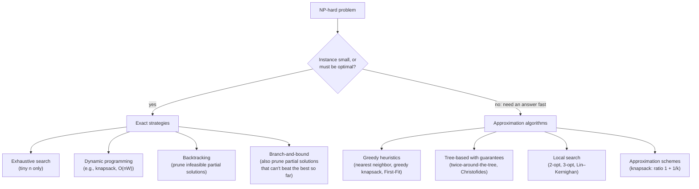
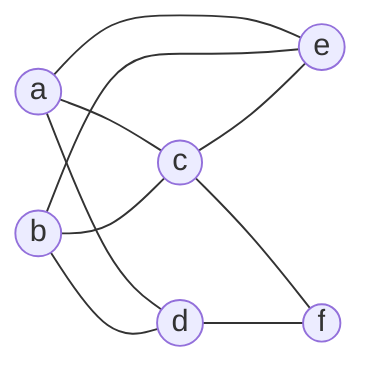
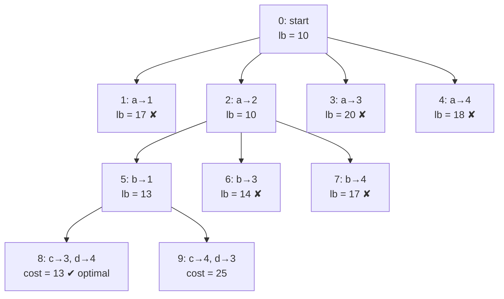
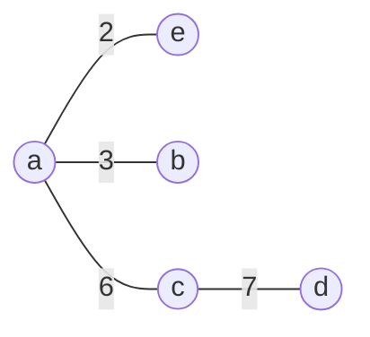

# Chapter 12 · Coping with the Limitations of Algorithm Power — Backtracking, Branch-and-Bound, Approximation, Numerical Methods

> [Chapter 11](../11-limitations/README.md) delivered the bad news: for NP-hard problems (NP = Nondeterministic Polynomial time) like the Traveling Salesman
> Problem (TSP), knapsack, bin packing and the assignment of jobs to machines, no polynomial-time exact algorithm is
> known and probably none exists. But delivery trucks still leave every morning and chips still get placed. This
> chapter is the good news: **how professionals get answers anyway.** Either you stay *exact* but search cleverly —
> **backtracking** and **branch-and-bound** prune away most of an exponential search space — or you give up a
> guaranteed optimum in exchange for speed and settle for a **provably good** answer with an **approximation
> algorithm**. The chapter ends with the continuous cousin of the same idea: finding roots of equations that have no
> formula, by **bisection**, **false position** and **Newton's method**.

**Badges:** 🎮 [Backtracking](https://normansrule.github.io/algorithm-forge/sims/backtracking.html) · [Branch-and-bound](https://normansrule.github.io/algorithm-forge/sims/branch-and-bound.html) · [TSP approximations](https://normansrule.github.io/algorithm-forge/sims/tsp-approx.html) · [Bin packing](https://normansrule.github.io/algorithm-forge/sims/bin-packing.html) · [Root finding](https://normansrule.github.io/algorithm-forge/sims/root-finding.html) · 🏟️ [Arena problems](https://normansrule.github.io/algorithm-forge/arena/?chapter=12) · 🐍 [Code](../../src/python/algoforge/ch12_coping.py) · 📝 [Practice](../../practice/) · ⬅️ [11 Limitations](../11-limitations/README.md) · ➡️ [13 Advanced Data Structures](../13-advanced-data-structures/README.md)

---

## The big idea in 60 seconds

Two strategies for a hard combinatorial problem:

1. **Stay exact, search smarter.** Exhaustive search (Chapter 3) builds every candidate. Backtracking builds
   candidates **one component at a time** and abandons a partial candidate the moment it *can't* lead to a solution.
   Branch-and-bound adds a **bound** — an optimistic estimate of the best value any completion could reach — and also
   abandons partial candidates that *can't beat the best solution found so far*. Worst case: still exponential. Typical
   case: dramatically faster.
2. **Give up exactness, get speed and a guarantee.** An approximation algorithm runs in polynomial time and returns
   a solution whose value is provably within a factor $c$ of optimal (for some problems; for others, like general TSP,
   no such $c$ exists unless P = NP).



---

## Card 1 · Backtracking

### 🎯 Problem in one sentence
Find a solution (or all solutions) to a constraint problem by building candidates one piece at a time, abandoning
each partial candidate as soon as it violates a constraint.

### 📖 Story
You're solving a Sudoku in pen… no, in pencil. You write a digit, move on, and as soon as a row has two 7s you erase
back to the last choice that still had options. You never finish a grid you already know is broken. That erase-and-try-
the-next-option move is **backtracking**.

### The vocabulary (Levitin §12.1)

- **State-space tree:** the root is the empty solution; nodes on level $i$ are partial solutions with $i$ components
  chosen; edges are choices for the next component.
- A node is **promising** if its partial solution might still be completed into a solution; otherwise
  **nonpromising**.
- Backtracking explores the tree **depth-first**. At a nonpromising node it **prunes** (doesn't generate the node's
  subtree) and **backtracks** to the parent to try the parent's next option.

### 🧱 Build it in blocks — the generic template

**Block 1 — state:** a tuple $X[1..i]$ of the components chosen so far.
**Block 2 — skeleton:** recursion; each call extends the tuple by one component.
**Block 3 — decision:** try only the options for component $i+1$ that are **consistent** with $X[1..i]$ and the
constraints (that's the pruning).
**Block 4 — return / report:** when $X[1..i]$ is a complete solution, report it.

```text
ALGORITHM Backtrack(X[1..i])
    // Generic backtracking template (after Levitin §12.1)
    // Input: X[1..i] — the first i promising components of a solution
    // Output: all tuples that are solutions to the problem
    if X[1..i] is a solution then
        write X[1..i]
    else
        for each element x in S(i+1) consistent with X[1..i] and the constraints do
            X[i + 1] ← x
            Backtrack(X[1..i + 1])
```

(This is a template outline, not runnable code — "is a solution", `S(i+1)`, `write` stand for problem-specific pieces. The three
problems below make them concrete. If one solution can be a *prefix* of another, remove the `else` so the search
continues past it — Levitin Exercise 12.1.9.)

### Example 1 — the $n$-Queens problem

Place $n$ queens on an $n \times n$ board so no two share a row, column or diagonal. Since each queen needs its own
row, the solution is a tuple $(c_1, \dots, c_n)$: **queen $r$ goes in column $c_r$**. Two queens in rows $i, j$
attack diagonally iff $|c_i - c_j| = |i - j|$. No solution exists for $n = 2, 3$; start with $n = 4$.

#### 👀 See it
🎮 Open the [Backtracking simulation](https://normansrule.github.io/algorithm-forge/sims/backtracking.html) (n-Queens
tab): the board and the state-space tree grow side by side; rejected squares flash, and backtracking steps are
narrated.

#### ✋ Trace it by hand — the 4-Queens state-space tree

Node numbers give the order in which nodes are generated; ✘ marks a column that fails the attack test.

```
(0) empty board
├── (1) Q1 → col 1
│   │   Q2: ✘1 (same column) ✘2 (diagonal)
│   ├── (2) Q2 → col 3
│   │       Q3: ✘1 ✘2 ✘3 ✘4  → dead end, backtrack
│   └── (3) Q2 → col 4
│       │   Q3: ✘1
│       └── (4) Q3 → col 2
│               Q4: ✘1 ✘2 ✘3 ✘4  → dead end, backtrack
│           Q3: ✘3 ✘4 → no more options, backtrack to Q1
└── (5) Q1 → col 2
    │   Q2: ✘1 ✘2 ✘3
    └── (6) Q2 → col 4
        └── (7) Q3 → col 1
            │   Q4: ✘1 ✘2
            └── (8) Q4 → col 3   ✔ solution (2, 4, 1, 3)
```

```
row 1   .  Q  .  .
row 2   .  .  .  Q
row 3   Q  .  .  .
row 4   .  .  Q  .
```

Only 9 nodes to find a solution, versus $4^4 = 256$ placements if exhaustive search put one queen per row
blindly. The mirror image $(3, 1, 4, 2)$ is the only other solution for $n = 4$. Counts from our Python run (full tree,
all solutions):

| $n$ | solutions | nodes in the backtracking tree | candidates for "one queen per row" brute force ($n^n$) |
|---|---|---|---|
| 4 | 2 | 17 | 256 |
| 6 | 4 | 153 | 46,656 |
| 8 | 92 | 2,057 | 16,777,216 |
| 10 | 724 | 35,539 | 10,000,000,000 |

Pruning is not a constant-factor trick; it changes the order of growth for typical instances (though it stays
exponential). And for $n$-Queens specifically, one solution for any $n \ge 4$ can be *constructed* in linear time by
known formulas — backtracking is the general tool, not always the best tool.

#### 💻 Code

```
ALGORITHM PlaceQueens(col, r, n)
    // Backtracking for n-Queens; col[0..r-1] hold safe columns for rows 0..r-1
    // Output: true if the placement can be completed (col then holds a solution)
    if r = n then
        return true
    for c ← 0 to n - 1 do
        if Safe(col, r, c) then
            col[r] ← c
            if PlaceQueens(col, r + 1, n) then
                return true
            col[r] ← -1                    // undo the choice: backtrack
    return false

ALGORITHM Safe(col, r, c)
    // Can a queen go in row r, column c, given queens in rows 0..r-1?
    for i ← 0 to r - 1 do
        if col[i] = c or abs(col[i] - c) = r - i then
            return false
    return true

ALGORITHM NQueens(n)
    col ← array(n, -1)
    if PlaceQueens(col, 0, n) then
        return col
    return null
```

<details><summary>🐍 Python: n-Queens, subset-sum and Hamiltonian circuit by backtracking</summary>

```python
def n_queens(n):
    """First solution found by backtracking, as a list of columns (0-based), or None."""
    col = []
    def safe(c):
        r = len(col)
        return all(c != cc and abs(c - cc) != r - rr for rr, cc in enumerate(col))
    def place():
        if len(col) == n:
            return True
        for c in range(n):
            if safe(c):
                col.append(c)
                if place():
                    return True
                col.pop()                       # backtrack
        return False
    return col if place() else None

def subset_sum(A, d):
    """All subsets of A (positive integers) that sum to d, using Levitin's two pruning tests."""
    A = sorted(A)
    out = []
    def go(i, s, chosen, rest):                 # rest = A[i] + ... + A[n-1]
        if s == d:
            out.append(list(chosen))
            return
        if i == len(A) or s + A[i] > d or s + rest < d:
            return                              # nonpromising
        chosen.append(A[i])
        go(i + 1, s + A[i], chosen, rest - A[i])
        chosen.pop()
        go(i + 1, s, chosen, rest - A[i])
    go(0, 0, [], sum(A))
    return out

def hamiltonian_circuit(adj, start):
    """adj: dict vertex -> set of neighbors. Tries neighbors in alphabetical order."""
    n, path = len(adj), [start]
    def extend():
        if len(path) == n:
            return start in adj[path[-1]]
        for v in sorted(adj[path[-1]]):
            if v not in path:
                path.append(v)
                if extend():
                    return True
                path.pop()                      # backtrack
        return False
    return path + [start] if extend() else None

if __name__ == "__main__":
    print(n_queens(4), n_queens(8))             # [1, 3, 0, 2] [0, 4, 7, 5, 2, 6, 1, 3]
    print(subset_sum([3, 5, 6, 7], 15))         # [[3, 5, 7]]
    edges = "ac ad ae bc bd be ce cf df".split()
    adj = {v: set() for v in "abcdef"}
    for u, v in edges:
        adj[u].add(v)
        adj[v].add(u)
    print(hamiltonian_circuit(adj, "a"))        # ['a', 'c', 'f', 'd', 'b', 'e', 'a']
```
</details>

<details><summary>☕ Java: count all n-Queens solutions</summary>

```java
public class NQueens {
    static int n, solutions;
    static int[] col;

    static boolean safe(int r, int c) {
        for (int i = 0; i < r; i++)
            if (col[i] == c || Math.abs(col[i] - c) == r - i) return false;
        return true;
    }

    static void place(int r) {
        if (r == n) { solutions++; return; }
        for (int c = 0; c < n; c++) {
            if (safe(r, c)) {
                col[r] = c;
                place(r + 1);        // returning from the call = backtracking
            }
        }
    }

    public static void main(String[] args) {
        for (n = 4; n <= 10; n++) {
            col = new int[n]; solutions = 0;
            place(0);
            System.out.println(n + ": " + solutions);   // 4: 2 ... 8: 92 ... 10: 724
        }
    }
}
```
</details>

### Example 2 — the subset-sum problem

Find a subset of $A = \{a_1, \dots, a_n\}$ (positive integers) summing to $d$. Sort $A$ increasingly. The
state-space tree is **binary**: at level $i$, the left branch **includes** $a_i$, the right branch **excludes** it.
Each node records $s$ = sum of included elements. A node is **nonpromising** (when $s \ne d$) if

$$s + a_{i+1} > d \quad (\text{even the smallest next element overshoots}) \qquad\text{or}\qquad s + \sum_{j=i+1}^{n} a_j < d \quad (\text{even taking everything left falls short}).$$

#### ✋ Trace it by hand — $A = \{3, 5, 6, 7\}$, $d = 15$ (the Levitin §12.1 example)

Node numbers are generation order (depth-first, "with" before "w/o").

```
[1] s=0
├── with 3 → [2] s=3
│   ├── with 5 → [3] s=8
│   │   ├── with 6 → [4] s=14        ✘ 14 + 7 = 21 > 15
│   │   └── w/o 6  → [5] s=8
│   │       ├── with 7 → [6] s=15    ✔ SOLUTION {3, 5, 7}
│   │       └── w/o 7  → [7] s=8     ✘ no elements left (8 < 15)
│   └── w/o 5  → [8] s=3
│       ├── with 6 → [9]  s=9        ✘ 9 + 7 = 16 > 15
│       └── w/o 6  → [10] s=3        ✘ 3 + 7 = 10 < 15
└── w/o 3  → [11] s=0
    ├── with 5 → [12] s=5
    │   ├── with 6 → [13] s=11       ✘ 11 + 7 = 18 > 15
    │   └── w/o 6  → [14] s=5        ✘ 5 + 7 = 12 < 15
    └── w/o 5  → [15] s=0            ✘ 0 + (6 + 7) = 13 < 15
```

15 nodes instead of the full tree's $2^5 - 1 = 31$, and $\{3, 5, 7\}$ is the only solution (the search above explores
the whole tree to prove it).

The Forge version, returning the first solution (`chosen[i]` marks included elements):

```
ALGORITHM SubsetSumBT(A, n, d, i, s, rest, chosen)
    // A[0..n-1] sorted increasingly; s = sum of chosen elements among A[0..i-1];
    // rest = A[i] + ... + A[n-1]. Returns true if a subset summing to d was found.
    if s = d then
        return true
    if i = n then
        return false
    if s + A[i] > d or s + rest < d then
        return false                                   // nonpromising node
    chosen[i] ← true
    if SubsetSumBT(A, n, d, i + 1, s + A[i], rest - A[i], chosen) then
        return true
    chosen[i] ← false
    return SubsetSumBT(A, n, d, i + 1, s, rest - A[i], chosen)
```

Call it as `SubsetSumBT(A, n, d, 0, 0, total, array(n, false))`, where `total` is the sum of all of $A$.

### Example 3 — the Hamiltonian circuit problem

Find a cycle through every vertex exactly once. Without loss of generality the circuit starts (and ends) at vertex
$a$, the root of the tree. Children are the unvisited neighbors of the last vertex, in alphabetical order. Our graph:



```
a
└── c                                 (a's neighbors: c, d, e → try c)
    ├── b
    │   ├── d
    │   │   └── f   ✘ dead end: f's neighbors c, d are used, but e is still unvisited
    │   └── e       ✘ dead end: e's neighbors a, b, c are all used
    ├── e
    │   └── b
    │       └── d
    │           └── f   ✘ all 6 vertices visited, but f is not adjacent to a
    └── f
        └── d
            └── b
                └── e   ✔ e is adjacent to a → circuit a, c, f, d, b, e, a
```

13 nodes generated after the root. Two standard tricks shrink such trees: fix the start vertex (done here), and — since
a circuit and its reverse are the same — require one chosen vertex to appear before another (the "b before c" trick,
used again for TSP below).

### 🧮 Analyze it

- Worst case: backtracking may generate the entire exponential state space ($n!$ for permutation problems, $2^n$ for
  subset problems). No worst-case improvement is promised.
- The hope: prune early and often. Success varies from problem to problem and even instance to instance.
- **Estimating tree size** (Knuth's method): walk one random root-to-leaf path; if the $i$-th node on it had
  $c_i$ promising children, estimate $1 + c_1 + c_1c_2 + \dots + c_1c_2\cdots c_n$ nodes. Average several runs.
- Helpful tricks: exploit symmetry (the first queen only needs the first $\lceil n/2 \rceil$ columns), preassign
  components, and presort data (subset-sum).

### ⚠️ Common mistakes

- Forgetting to **undo** the choice after the recursive call returns (`col.pop()`, `chosen[i] ← false`), which
  corrupts sibling branches.
- Testing constraints only at the leaves — that is exhaustive search in disguise; the point is to test at every node.
- In subset-sum, using the "too large" test with an **unsorted** array (the test assumes $a_{i+1}$ is the smallest
  remaining element).
- For Hamiltonian circuits, forgetting the final check that the last vertex is adjacent to the start.

### 🔁 Variations and real-world use

- **Constraint satisfaction:** Sudoku solvers, timetabling, register allocation, puzzle games.
- **Boolean satisfiability (SAT) solvers** are backtracking at heart (the Davis–Putnam–Logemann–Loveland (DPLL) procedure) plus clause learning,
  restarts and clever variable ordering.
- **Regular-expression engines** with backreferences, **Prolog**, and **parsers** use backtracking.
- **Game-tree search** (minimax with alpha–beta pruning) is the two-player cousin.

---

## Card 2 · Branch-and-Bound (B&B)

### 🎯 Problem in one sentence
Solve an optimization problem exactly by exploring a state-space tree while computing, for every node, a **bound** on
the best objective value any completion could achieve, and discarding nodes whose bound can't beat the best complete
solution found so far.

### 📖 Story
You're shopping for the cheapest flight with a layover. Your best itinerary so far costs \$420. Any route through
Frankfurt has a first leg costing at least \$450 — you don't need to look at a single Frankfurt connection. That "at
least \$450" is a **bound**; skipping Frankfurt is **pruning**.

### What B&B adds to backtracking (Levitin §12.2)

A node is **nonpromising** (pruned) if

1. its bound is **not better** than the value of the best solution seen so far, or
2. it violates the problem's constraints (as in backtracking), or
3. its subset of solutions has only one point (then just compare it with the best so far).

And instead of depth-first, B&B often uses **best-first** search: always expand the **live** node (generated, not yet
expanded or pruned) with the most promising bound. A **priority queue** holds the live nodes.

For a **minimization** problem the bound is a **lower bound** (lb): "every completion costs at least lb." For
**maximization**, an **upper bound** (ub).

### Example 1 — the assignment problem

Assign $n$ people to $n$ jobs, one each, minimizing total cost — equivalently, select one entry in each row of the
cost matrix, no two in the same column, with minimum sum. The Levitin §12.2 instance:

| | Job 1 | Job 2 | Job 3 | Job 4 |
|---|---|---|---|---|
| **a** | 9 | 2 | 7 | 8 |
| **b** | 6 | 4 | 3 | 7 |
| **c** | 5 | 8 | 1 | 8 |
| **d** | 7 | 6 | 9 | 4 |

**Lower bound.** Any assignment costs at least the sum of the row minima: $2 + 3 + 1 + 4 = 10$. (Column minima give
$5 + 2 + 1 + 4 = 12$ — also valid; we use rows.) For a partial assignment: cost of the rows already assigned + for each
remaining row, its minimum among the **columns not yet used**.

#### 🧱 Build it in blocks

**Block 1 — state:** a node = the jobs chosen for persons $a, b, \dots$ so far, plus its lb.
**Block 2 — skeleton:** priority queue of live nodes, ordered by lb (smallest first).
**Block 3 — decision:** pop the node with the smallest lb; if lb ≥ best cost so far, discard it; otherwise generate
its children (next person × each unused job) and compute their lbs. When only one person is left, the assignment is
forced, so compute its actual cost and update the best.
**Block 4 — return** the best complete assignment when the queue is empty.

```
ALGORITHM AssignmentLowerBound(C, n, job, k)
    // Lower bound for all assignments that give person i job[i] for i = 0..k-1
    // Input: C — n × n cost matrix; job[0..k-1] — distinct jobs already assigned
    // Output: cost of the k assignments + the cheapest free job of every other person
    used ← array(n, false)
    lb ← 0
    for i ← 0 to k - 1 do
        lb ← lb + C[i, job[i]]
        used[job[i]] ← true
    for i ← k to n - 1 do
        best ← ∞
        for j ← 0 to n - 1 do
            if not used[j] then
                best ← min(best, C[i, j])
        lb ← lb + best
    return lb
```

#### ✋ Trace it by hand — best-first B&B

| Step | Node | Partial assignment | Lower bound computation | lb |
|---|---|---|---|---|
| start | 0 | — | $2 + 3 + 1 + 4$ | **10** |
| expand 0 | 1 | a→1 | $9 + \min(4,3,7) + \min(8,1,8) + \min(6,9,4) = 9 + 3 + 1 + 4$ | 17 |
| | 2 | a→2 | $2 + 3 + 1 + 4$ | **10** |
| | 3 | a→3 | $7 + \min(6,4,7) + \min(5,8,8) + \min(7,6,4) = 7 + 4 + 5 + 4$ | 20 |
| | 4 | a→4 | $8 + \min(6,4,3) + \min(5,8,1) + \min(7,6,9) = 8 + 3 + 1 + 6$ | 18 |
| expand 2 (smallest lb) | 5 | a→2, b→1 | $2 + 6 + \min(1,8) + \min(9,4) = 2 + 6 + 1 + 4$ | **13** |
| | 6 | a→2, b→3 | $2 + 3 + \min(5,8) + \min(7,4) = 2 + 3 + 5 + 4$ | 14 |
| | 7 | a→2, b→4 | $2 + 7 + \min(5,1) + \min(7,9) = 2 + 7 + 1 + 7$ | 17 |
| expand 5 | 8 | a→2, b→1, c→3, d→4 | complete: $2 + 6 + 1 + 4$ | cost **13** ✔ best |
| | 9 | a→2, b→1, c→4, d→3 | complete: $2 + 6 + 8 + 9$ | cost 25 |
| prune | 6, 1, 7, 4, 3 | | lbs 14, 17, 17, 18, 20 are all ≥ 13 | — |

**Optimal assignment: a→2, b→1, c→3, d→4, total cost 13** (confirmed by trying all $4! = 24$ assignments). The
tree has 10 nodes instead of the $1 + 4 + 12 + 24 + 24 = 65$ of a full permutation tree.



🎮 Watch this exact tree grow in the [Branch-and-bound simulation](https://normansrule.github.io/algorithm-forge/sims/branch-and-bound.html)
(assignment tab); switch the bound to "columns" to see how a different bound changes the tree.

<details><summary>🐍 Python: best-first B&B for the assignment problem</summary>

```python
import heapq

def assignment_bb(C):
    """Best-first branch-and-bound. Returns (min cost, job list), job[i] = job of person i."""
    n = len(C)
    def lb(jobs):
        used = set(jobs)
        return (sum(C[i][j] for i, j in enumerate(jobs)) +
                sum(min(C[i][j] for j in range(n) if j not in used) for i in range(len(jobs), n)))
    best_cost, best = float("inf"), None
    live = [(lb([]), [])]                       # priority queue ordered by lower bound
    while live:
        bound, jobs = heapq.heappop(live)
        if bound >= best_cost:
            continue                            # prune: can't beat the best so far
        for j in range(n):
            if j in jobs:
                continue
            child = jobs + [j]
            if len(child) == n - 1:             # last person's job is forced
                child.append(next(k for k in range(n) if k not in child))
            if len(child) == n:
                cost = sum(C[i][child[i]] for i in range(n))
                if cost < best_cost:
                    best_cost, best = cost, child
            else:
                heapq.heappush(live, (lb(child), child))
    return best_cost, best

if __name__ == "__main__":
    C = [[9, 2, 7, 8], [6, 4, 3, 7], [5, 8, 1, 8], [7, 6, 9, 4]]
    cost, jobs = assignment_bb(C)
    print(cost, {"abcd"[i]: j + 1 for i, j in enumerate(jobs)})   # 13 {'a': 2, 'b': 1, 'c': 3, 'd': 4}
```
</details>

<details><summary>☕ Java: the same with a PriorityQueue</summary>

```java
import java.util.*;

public class AssignmentBB {
    static int[][] c;
    static int n;

    static int lowerBound(List<Integer> jobs) {
        boolean[] used = new boolean[n];
        int lb = 0;
        for (int i = 0; i < jobs.size(); i++) { lb += c[i][jobs.get(i)]; used[jobs.get(i)] = true; }
        for (int i = jobs.size(); i < n; i++) {
            int best = Integer.MAX_VALUE;
            for (int j = 0; j < n; j++) if (!used[j]) best = Math.min(best, c[i][j]);
            lb += best;
        }
        return lb;
    }

    public static void main(String[] args) {
        c = new int[][]{{9, 2, 7, 8}, {6, 4, 3, 7}, {5, 8, 1, 8}, {7, 6, 9, 4}};
        n = c.length;
        PriorityQueue<Object[]> live = new PriorityQueue<>(Comparator.comparingInt(o -> (Integer) o[0]));
        live.add(new Object[]{lowerBound(new ArrayList<>()), new ArrayList<Integer>()});
        int bestCost = Integer.MAX_VALUE;
        List<Integer> best = null;
        while (!live.isEmpty()) {
            Object[] node = live.poll();
            @SuppressWarnings("unchecked") List<Integer> jobs = (List<Integer>) node[1];
            if ((Integer) node[0] >= bestCost) continue;            // prune
            for (int j = 0; j < n; j++) {
                if (jobs.contains(j)) continue;
                List<Integer> child = new ArrayList<>(jobs);
                child.add(j);
                if (child.size() == n - 1)
                    for (int k = 0; k < n; k++) if (!child.contains(k)) { child.add(k); break; }
                if (child.size() == n) {
                    int cost = 0;
                    for (int i = 0; i < n; i++) cost += c[i][child.get(i)];
                    if (cost < bestCost) { bestCost = cost; best = child; }
                } else {
                    live.add(new Object[]{lowerBound(child), child});
                }
            }
        }
        System.out.println(bestCost + " " + best);   // 13 [1, 0, 2, 3]  (0-based jobs)
    }
}
```
</details>

### Example 2 — the 0/1 knapsack problem

Maximize total value of items that fit in capacity $W$. Order items by **value-to-weight ratio** $v_i/w_i$,
decreasing. A node on level $i$ (decisions made for items $1..i$) with total weight $w$ and value $v$ gets the
**upper bound**

$$ub = v + (W - w)\cdot \frac{v_{i+1}}{w_{i+1}},$$

"what we have + fill the remaining room with the best remaining ratio" — optimistic, so no completion can exceed it.
For knapsack every node is itself a feasible subset, so the best-so-far can be updated at every node.

#### ✋ Trace it by hand — an example instance, $W = 16$

| Item | Weight | Value | $v/w$ |
|---|---|---|---|
| 1 | 2 | \$40 | 20 |
| 2 | 5 | \$30 | 6 |
| 3 | 10 | \$50 | 5 |
| 4 | 5 | \$10 | 2 |

| Node | Decision path | $w$ | $v$ | $ub$ | Notes |
|---|---|---|---|---|---|
| 0 | — | 0 | 0 | $0 + 16\cdot20 = 320$ | root |
| 1 | with 1 | 2 | 40 | $40 + 14\cdot6 = 124$ | best = 40 |
| 2 | w/o 1 | 0 | 0 | $0 + 16\cdot6 = 96$ | live |
| 3 | 1, with 2 | 7 | 70 | $70 + 9\cdot5 = 115$ | best = 70 |
| 4 | 1, w/o 2 | 2 | 40 | $40 + 14\cdot5 = 110$ | live |
| 5 | 1, 2, with 3 | 17 | — | — | ✘ exceeds $W$ |
| 6 | 1, 2, w/o 3 | 7 | 70 | $70 + 9\cdot2 = 88$ | live |
| 7 | 1, w/o 2, with 3 | 12 | 90 | $90 + 4\cdot2 = 98$ | **best = 90**; now prune 6 (88 ≤ 90) |
| 8 | 1, w/o 2, w/o 3 | 2 | 40 | $40 + 14\cdot2 = 68$ | ✘ 68 ≤ 90 |
| 9 | 1, 3, with 4 | 17 | — | — | ✘ exceeds $W$ |
| 10 | 1, 3, w/o 4 | 12 | 90 | 90 | leaf, value 90 |
| 11 | w/o 1, with 2 | 5 | 30 | $30 + 11\cdot5 = 85$ | ✘ 85 ≤ 90 |
| 12 | w/o 1, w/o 2 | 0 | 0 | $0 + 16\cdot5 = 80$ | ✘ 80 ≤ 90 |

Best-first order of expansion: 0, 1, 3, 4, 7, 2 (its ub 96 > 90 forces a look). **Optimal: items {1, 3}, weight 12,
value \$90** (confirmed by trying all 16 subsets).

```
ALGORITHM KnapsackBB(w, v, n, W, i, curW, curV, best)
    // Depth-first branch-and-bound for 0/1 knapsack; items 0..n-1 sorted by v/w decreasing
    // Input: decisions made for items 0..i-1 giving weight curW and value curV;
    //        best — value of the best subset found so far
    // Output: the best value found in this subtree (or the old best if nothing better)
    if curV > best then
        best ← curV
    if i = n then
        return best
    ub ← curV + (W - curW) * v[i] / w[i]
    if ub ≤ best then
        return best                                    // bound can't beat the best: prune
    if curW + w[i] ≤ W then
        best ← KnapsackBB(w, v, n, W, i + 1, curW + w[i], curV + v[i], best)
    return KnapsackBB(w, v, n, W, i + 1, curW, curV, best)
```

(Depth-first B&B uses the same bound but a simpler control structure than best-first; the Python version below is
best-first.)

<details><summary>🐍 Python: best-first B&B for 0/1 knapsack</summary>

```python
import heapq

def knapsack_bb(items, W):
    """items: list of (weight, value). Returns (best value, chosen item numbers, 1-based in ratio order)."""
    items = sorted(items, key=lambda it: it[1] / it[0], reverse=True)
    n = len(items)
    def ub(i, w, v):
        return v + (W - w) * (items[i][1] / items[i][0]) if i < n else v
    best, best_set = 0, []
    live = [(-ub(0, 0, 0), 0, 0, 0, [])]           # max-heap via negated bound
    while live:
        neg, i, w, v, chosen = heapq.heappop(live)
        if -neg <= best or i == n:
            continue                               # prune
        for take in (True, False):
            w2 = w + items[i][0] * take
            v2 = v + items[i][1] * take
            if w2 > W:
                continue                           # infeasible
            c2 = chosen + [i + 1] if take else chosen
            if v2 > best:
                best, best_set = v2, c2
            if ub(i + 1, w2, v2) > best:
                heapq.heappush(live, (-ub(i + 1, w2, v2), i + 1, w2, v2, c2))
    return best, best_set

if __name__ == "__main__":
    print(knapsack_bb([(2, 40), (5, 30), (10, 50), (5, 10)], 16))   # (90, [1, 3])
```
</details>

### Example 3 — the Traveling Salesman Problem (TSP)

**Lower bound** for a symmetric instance with integer distances (Levitin §12.2): for each city $i$ let $s_i$ = sum of
the distances to its **two nearest** cities; with $s = \sum s_i$,

$$lb = \lceil s/2 \rceil .$$

*Why it's valid:* in any tour, each city has exactly two tour edges, whose lengths add up to at least $s_i$. Summing
over all cities counts every tour edge twice, so $2 \cdot \text{length} \ge s$. When a partial tour **forces** some
edges, use them in the $s_i$ of their endpoints.

Our 5-city delivery instance (distances in minutes; symmetric, obeys the triangle inequality):

| | a | b | c | d | e |
|---|---|---|---|---|---|
| **a** | 0 | 3 | 6 | 12 | 2 |
| **b** | 3 | 0 | 9 | 10 | 4 |
| **c** | 6 | 9 | 0 | 7 | 8 |
| **d** | 12 | 10 | 7 | 0 | 11 |
| **e** | 2 | 4 | 8 | 11 | 0 |

Root: $lb = \lceil [(2+3) + (3+4) + (6+7) + (7+10) + (2+4)]/2 \rceil = \lceil 48/2 \rceil = 24$.

Two standard tricks cut the tree: all tours start at $a$, and since a tour and its reverse have the same
length, consider only tours where **$b$ is visited before $c$**. Once 4 cities are fixed, the tour is determined.

| Node | Partial tour | Forced edges used in $s$ | lb | Result |
|---|---|---|---|---|
| 0 | a | — | 24 | expand |
| 1 | a,b | ab | $\lceil 48/2 \rceil = 24$ | expand |
| 2 | a,c | — | — | ✘ c before b |
| 3 | a,d | ad | $\lceil (14+7+13+19+6)/2 \rceil = \lceil 59/2 \rceil = 30$ | pruned at the end (30 ≥ 29) |
| 4 | a,e | ae | 24 | expand |
| 5 | a,b,c | ab, bc | $\lceil 55/2 \rceil = 28$ | expand |
| 6 | a,b,d | ab, bd | $\lceil 54/2 \rceil = 27$ | expand |
| 7 | a,b,e | ab, be | 24 | expand |
| 8 | a,e,b | ae, eb | 24 | expand |
| 9 | a,e,c | — | — | ✘ c before b |
| 10 | a,e,d | ae, ed | $\lceil 56/2 \rceil = 28$ | expand |
| 11 | a,b,e,c,d,a | complete | length 34 | first tour, best = 34 |
| 12 | a,b,e,d,c,a | complete | length 31 | best = 31 |
| 13 | a,e,b,c,d,a | complete | length 34 | inferior |
| 14 | a,e,b,d,c,a | complete | length **29** | **best = 29** |
| 15, 16 | a,b,d,c,e,a / a,b,d,e,c,a | complete | 30 / 38 | inferior |
| 17, 18 | a,b,c,d,e,a / a,b,c,e,d,a | complete | 32 / 43 | inferior |
| 19 | a,e,d,b,c,a | complete | 38 | inferior (node 20, a,e,d,c, skipped: c before b) |

**Optimal tour: a → e → b → d → c → a, length 29** (= $2 + 4 + 10 + 7 + 6$; confirmed by checking all 12 distinct
tours). Nodes 5, 6 and 10 had to be expanded because their bounds (28, 27, 28) were still below 29 — a bound that is
*too weak* costs work. The root bound 24 is 17% below the optimum; better bounds (e.g., based on 1-trees or the Linear
Programming (LP) relaxation) prune much more.

### 🧮 Analyze it (B&B in general)

- Worst case: exponential, like backtracking.
- Two design choices decide real performance: the **bounding function** (tight vs. cheap to compute — a trade-off)
  and the **node-selection rule** (best-first finds good solutions early but can use lots of memory; depth-first uses
  little memory).
- Seeding the best-so-far with a good heuristic solution (for instance, from the approximation algorithms in Card 3)
  lets B&B prune from the very first node.

### ⚠️ Common mistakes

- Using a bound in the wrong direction (an *upper* bound for a minimization problem prunes the optimum away).
- Pruning with **strict** instead of **non-strict** comparison when you only need one optimal solution (a node whose
  bound *equals* the best can't do better — prune it).
- Computing the TSP bound without including the **forced** edges of the partial tour.
- Forgetting to sort knapsack items by ratio before using the ratio-based upper bound (the bound is only valid if
  $v_{i+1}/w_{i+1}$ is the largest remaining ratio).

### 🔁 Variations and real-world use

- **Mixed-Integer Programming (MIP) solvers** (Gurobi, CPLEX, HiGHS, SCIP, Google's Operations Research toolkit OR-Tools) are branch-and-bound engines whose
  bound at each node is an **LP relaxation** solved by simplex ([Chapter 10](../10-iterative-improvement/README.md)).
  Airline **crew scheduling**, power-grid unit commitment, and supply-chain network design run on them daily.
- **Concorde**, the famous exact TSP solver, is branch-and-cut (B&B + cutting planes); it has solved instances with
  tens of thousands of cities to proven optimality.
- **A\* search** in games and robotics is best-first search with an optimistic bound (an "admissible heuristic").

---

## Card 3 · Approximation Algorithms for NP-Hard Problems

### 🎯 Problem in one sentence
Find a good — provably not-too-bad — solution to an NP-hard optimization problem in polynomial time.

### 📖 Story
A delivery company with 200 stops doesn't need the *optimal* route; it needs a route by 6 a.m. that's not wasteful.
If you can promise "at most 50% longer than optimal, computed in a second," that's a product. Approximation
algorithms are that promise, made mathematical.

### Measuring accuracy (Levitin §12.3)

For a minimization problem with optimal solution $s^*$ and approximate solution $s_a$:

- **accuracy ratio** $r(s_a) = \dfrac{f(s_a)}{f(s^*)}$ (for maximization, $\dfrac{f(s^*)}{f(s_a)}$ so that it's
  always $\ge 1$; closer to 1 is better);
- an algorithm is a **$c$-approximation algorithm** if $r(s_a) \le c$ on **every** instance;
- its **performance ratio** $R_A$ is the smallest such $c$ (possibly $\infty$).

Usually we can't compute $r(s_a)$ for a real instance (we don't know $f(s^*)$), which is exactly why a proven bound
on $R_A$ is valuable.

### 👀 See it
🎮 Open the [TSP approximations simulation](https://normansrule.github.io/algorithm-forge/sims/tsp-approx.html): place
cities, then run nearest neighbor, multifragment, twice-around-the-tree, Christofides and 2-opt on the same instance
and compare their tours to the optimum (computed exactly for small $n$).

### TSP 1 — Nearest-neighbor (greedy)

Start at a city; repeatedly go to the nearest unvisited city; return home.

On our 5-city instance from $a$: $a \xrightarrow{2} e \xrightarrow{4} b \xrightarrow{9} c \xrightarrow{7} d \xrightarrow{12} a$,
length **34**; optimum 29; accuracy ratio $34/29 \approx 1.17$. The starting city matters: starting from $b$ gives 30,
from $c$ or $d$ gives 29, from $e$ gives 32.

**It can be arbitrarily bad.** Example (after Levitin §12.3): 4 cities with $ab = 1$, $bc = 2$, $cd = 1$, $ac = 3$, $bd = 3$, and
$ad = w$. From $a$: $a\,b\,c\,d\,a$ of length $4 + w$. For $w = 6$ that's 10 vs. the optimal $a\,b\,d\,c\,a$ of length
8 ($r = 1.25$), but as $w \to \infty$ the optimal tour (which avoids $ad$) stays 8 while nearest neighbor is forced to
take $ad$ at the end: $R_A = \infty$.

### TSP 2 — Multifragment heuristic (greedy on edges)

Sort edges by weight; add the next edge unless it would give a vertex degree 3 or close a cycle shorter than $n$;
stop at $n$ edges. On our instance: take $ae\,(2)$, $ab\,(3)$; skip $be\,(4)$ (closes a 3-cycle); skip $ac\,(6)$ ($a$
would have degree 3); take $cd\,(7)$, $ce\,(8)$; skip $bc\,(9)$ ($c$ has degree 2); take $bd\,(10)$ → tour
$a\,b\,d\,c\,e\,a$, length **30**. Also $R_A = \infty$ in general, but it tends to beat nearest neighbor.

For **Euclidean** instances (symmetric distances satisfying the triangle inequality), both greedy methods satisfy
$r \le \tfrac12(\lceil \log_2 n \rceil + 1)$.

### TSP 3 — Twice-around-the-tree (a 2-approximation for Euclidean instances)

1. Build a Minimum Spanning Tree (MST) (Prim or Kruskal, Chapter 9).
2. Walk around the tree (a depth-first traversal that records each vertex when entered and again when returned to):
   every tree edge is traversed twice.
3. **Shortcut**: list the vertices in the order they first appear; skip repeats; return to the start.

On our instance: MST edges $ae\,(2)$, $ab\,(3)$, $ac\,(6)$, $cd\,(7)$ — weight 18. Walk from $a$ (neighbors in
alphabetical order): $a, b, a, c, d, c, a, e, a$, length $36 = 2 \cdot 18$. Shortcut: $a, b, c, d, e, a$, length
$3 + 9 + 7 + 11 + 2 = $ **32** $\le 36$. Ratio $32/29 \approx 1.10$.



**Theorem: for Euclidean instances, twice-around-the-tree is a 2-approximation.**
*Proof.* Let $s^*$ be an optimal tour. Deleting one edge from $s^*$ leaves a spanning path, which is a spanning tree,
so $w(\text{MST}) \le f(s^*)$ (strictly less, since the deleted edge has positive length). The walk has length
$2\,w(\text{MST})$. Each shortcut replaces a detour $x \to \dots \to y$ by the direct edge $x \to y$, which by the
**triangle inequality** is no longer. So $f(s_a) \le 2\,w(\text{MST}) < 2\,f(s^*)$. ∎

### TSP 4 — Christofides (a 1.5-approximation for Euclidean instances)

1. Build an MST.
2. Find the vertices of **odd degree** in it (there's always an even number of them) and add a **minimum-weight
   perfect matching** on them.
3. The resulting multigraph has all degrees even, so it has an **Euler circuit**; find one.
4. Shortcut repeated vertices.

On our instance the MST degrees are $a{:}3, b{:}1, c{:}2, d{:}1, e{:}1$ → odd vertices $a, b, d, e$. Their three
possible perfect matchings: $\{ae, bd\} = 2 + 10 = 12$, $\{ab, de\} = 3 + 11 = 14$, $\{ad, be\} = 12 + 4 = 16$; take
$\{ae, bd\}$. Multigraph: MST + $ae$ + $bd$ (total 30). Euler circuit $a, e, a, b, d, c, a$ → shortcut
$a, e, b, d, c, a$ = **29** — optimal on this instance. (A different Euler circuit, e.g. $a, b, d, c, a, e, a$, gives
$a, b, d, c, e, a$ = 30; either way $\le 1.5 \times 29 = 43.5$.)

*Why 1.5:* the MST weighs less than the optimal tour; and shortcutting the optimal tour to visit only the odd vertices
gives a cycle of length $\le f(s^*)$ that splits into two perfect matchings of those vertices, so the cheaper one —
and hence the minimum matching — weighs $\le f(s^*)/2$. Total $\le 1.5\,f(s^*)$. (For decades 1.5 was the best known
ratio for metric TSP; in 2020 Karlin, Klein and Oveis Gharan improved it by a microscopically small constant.)

### TSP 5 — Local search: 2-opt, 3-opt, Lin–Kernighan

Start from some tour (e.g., nearest neighbor). Repeatedly look for a **2-change**: delete two non-adjacent edges and
reconnect the two paths the other way (equivalently, reverse a segment). Accept it if the tour gets shorter. Stop when
no 2-change helps — a **2-optimal** tour.

From the nearest-neighbor tour $a\,e\,b\,c\,d\,a$ (34), first-improvement 2-opt makes three moves:

| Move | Remove | Add | New tour | Length |
|---|---|---|---|---|
| 1 | $eb\,(4)$, $da\,(12)$ | $ed\,(11)$, $ba\,(3)$ | $a\,e\,d\,c\,b\,a$ | 32 |
| 2 | $ae\,(2)$, $cb\,(9)$ | $ac\,(6)$, $eb\,(4)$ | $a\,c\,d\,e\,b\,a$ | 31 |
| 3 | $de\,(11)$, $ba\,(3)$ | $db\,(10)$, $ea\,(2)$ | $a\,c\,d\,b\,e\,a$ | **29** |

The result is optimal here — but in general 2-opt only reaches a **local** optimum (Chapter 10's warning).
**3-opt** exchanges three edges; **Lin–Kernighan** makes variable-depth exchanges and is the basis of the best
practical heuristics (Helsgaun's Lin–Kernighan–Helsgaun (LKH) program).

**How good are they in practice?** On random uniform Euclidean instances with 10,000 cities, a large empirical study
(Johnson & McGeoch, reported in Levitin §12.3) found average excess over a lower bound of about: nearest neighbor 25%,
multifragment 16%, Christofides 10%, 2-opt 5%, 3-opt 3%, Lin–Kernighan 2% — all in a second or two.

### Why general TSP has no $c$-approximation (unless P = NP)

**Theorem.** If P ≠ NP, no polynomial-time $c$-approximation algorithm exists for the general TSP, for any constant $c$.

*Proof sketch.* Suppose algorithm $A$ always returns a tour of length $\le c \cdot$ optimal. Use it to decide the
NP-complete **Hamiltonian circuit** problem: given graph $G$ with $n$ vertices, build a complete graph $G'$ where
edges of $G$ get weight 1 and non-edges get weight $cn + 1$.
- If $G$ has a Hamiltonian circuit, the optimal tour in $G'$ has length $n$, so $A$ returns a tour of length
  $\le cn$.
- If not, every tour uses at least one weight-$(cn+1)$ edge, so $A$'s tour is longer than $cn$.

Comparing $A$'s answer with $cn$ decides Hamiltonicity in polynomial time — so P = NP. ∎ (The huge weights break the
triangle inequality, which is why Euclidean instances escape this theorem.)

### 💻 Code for the TSP heuristics

<details><summary>🐍 Python: nearest neighbor, twice-around-the-tree, 2-opt</summary>

```python
def tour_length(tour, D):
    return sum(D[tour[i]][tour[i + 1]] for i in range(len(tour) - 1))

def nearest_neighbor(D, start):
    tour, unvisited = [start], set(D) - {start}
    while unvisited:
        nxt = min(sorted(unvisited), key=lambda v: D[tour[-1]][v])   # ties: alphabetical
        tour.append(nxt)
        unvisited.remove(nxt)
    return tour + [start]

def twice_around_the_tree(D, start):
    # Prim's MST
    in_tree, adj = {start}, {v: [] for v in D}
    while len(in_tree) < len(D):
        w, u, v = min((D[u][v], u, v) for u in in_tree for v in D if v not in in_tree)
        adj[u].append(v)
        adj[v].append(u)
        in_tree.add(v)
    # preorder DFS = the walk with repeated vertices shortcut away
    tour, seen = [], set()
    def dfs(u):
        seen.add(u)
        tour.append(u)
        for v in sorted(adj[u]):
            if v not in seen:
                dfs(v)
    dfs(start)
    return tour + [start]

def two_opt(tour, D):
    """First-improvement 2-opt: reverse tour[i..j] while that shortens the tour."""
    tour, improved = list(tour), True
    while improved:
        improved = False
        for i in range(1, len(tour) - 2):
            for j in range(i + 1, len(tour) - 1):
                a, b, c, d = tour[i - 1], tour[i], tour[j], tour[j + 1]
                if D[a][c] + D[b][d] < D[a][b] + D[c][d]:
                    tour[i:j + 1] = reversed(tour[i:j + 1])
                    improved = True
    return tour

if __name__ == "__main__":
    names, rows = "abcde", [[0, 3, 6, 12, 2], [3, 0, 9, 10, 4], [6, 9, 0, 7, 8],
                            [12, 10, 7, 0, 11], [2, 4, 8, 11, 0]]
    D = {u: {v: rows[i][j] for j, v in enumerate(names)} for i, u in enumerate(names)}
    nn = nearest_neighbor(D, "a")
    tw = twice_around_the_tree(D, "a")
    print(nn, tour_length(nn, D))                    # ['a','e','b','c','d','a'] 34
    print(tw, tour_length(tw, D))                    # ['a','b','c','d','e','a'] 32
    t2 = two_opt(nn, D)
    print(t2, tour_length(t2, D))                    # ['a','c','d','b','e','a'] 29
```
</details>

<details><summary>☕ Java: nearest neighbor + 2-opt</summary>

```java
import java.util.*;

public class TspHeuristics {
    static int length(int[] t, int[][] d) {
        int s = 0;
        for (int i = 0; i + 1 < t.length; i++) s += d[t[i]][t[i + 1]];
        return s;
    }

    static int[] nearestNeighbor(int[][] d, int start) {
        int n = d.length;
        int[] tour = new int[n + 1];
        boolean[] seen = new boolean[n];
        tour[0] = start; seen[start] = true;
        for (int k = 1; k < n; k++) {
            int last = tour[k - 1], best = -1;
            for (int v = 0; v < n; v++)
                if (!seen[v] && (best == -1 || d[last][v] < d[last][best])) best = v;
            tour[k] = best; seen[best] = true;
        }
        tour[n] = start;
        return tour;
    }

    static void twoOpt(int[] t, int[][] d) {
        boolean improved = true;
        while (improved) {
            improved = false;
            for (int i = 1; i < t.length - 2; i++)
                for (int j = i + 1; j < t.length - 1; j++)
                    if (d[t[i - 1]][t[j]] + d[t[i]][t[j + 1]] < d[t[i - 1]][t[i]] + d[t[j]][t[j + 1]]) {
                        for (int l = i, r = j; l < r; l++, r--) { int x = t[l]; t[l] = t[r]; t[r] = x; }
                        improved = true;
                    }
        }
    }

    public static void main(String[] args) {
        int[][] d = {{0, 3, 6, 12, 2}, {3, 0, 9, 10, 4}, {6, 9, 0, 7, 8}, {12, 10, 7, 0, 11}, {2, 4, 8, 11, 0}};
        int[] t = nearestNeighbor(d, 0);
        System.out.println(Arrays.toString(t) + " " + length(t, d));   // [0, 4, 1, 2, 3, 0] 34
        twoOpt(t, d);
        System.out.println(Arrays.toString(t) + " " + length(t, d));   // [0, 2, 3, 1, 4, 0] 29
    }
}
```
</details>

### Knapsack 1 — the greedy algorithm, and why it needs a fix

**Greedy:** sort by $v_i/w_i$ decreasing; take each item that still fits. The example instance ($W = 16$): take item 1
(w 2), item 2 (w 7), skip item 3 (would be 17), take item 4 (w 12) → value **\$80**; optimum \$90 (items 1, 3), ratio
$90/80 = 1.125$.

**Unbounded ratio.** Two items: $w_1 = 1, v_1 = 2$ and $w_2 = W, v_2 = W$. Ratios 2 and 1, so greedy takes item 1,
then item 2 doesn't fit: value 2 vs. optimum $W$. Ratio $W/2 \to \infty$.

**The fix: return the better of the greedy solution and the single most valuable item that fits.** Now
$R_A = 2$. *Proof sketch:* let item $k$ be the first item (in ratio order) that greedy has to skip, and $P$ = value of
the items before it (all taken). The **fractional** (continuous) knapsack optimum, which is at least the 0/1 optimum,
is at most $P + v_k$ (it takes the same prefix plus at most all of item $k$). So, writing OPT for the optimal value,
$\text{OPT} \le P + v_k \le \text{greedy} + \max_i v_i \le 2 \max(\text{greedy}, \max_i v_i)$. ∎ (Greedy by ratio is
*exactly optimal* for the continuous version — Chapter 9.)

### Knapsack 2 — an approximation scheme (Sahni)

For an integer parameter $k$ ($0 \le k \le n$): for **every subset of at most $k$ items** that fits, add the
remaining items greedily by ratio; return the best result. Performance: $\dfrac{f(s^*)}{f(s_a)} \le 1 + \dfrac1k$ for
every instance; time $O(k\,n^{k+1})$ — polynomial for fixed $k$, so you can buy any accuracy you want with time.

Practice, $k = 2$ (all 11 subsets of size $\le 2$; items listed in ratio order):

| Start subset | Greedy completion | Weight | Value |
|---|---|---|---|
| ∅ | {1, 2, 4} | 12 | 80 |
| {1} | {1, 2, 4} | 12 | 80 |
| {2} | {1, 2, 4} | 12 | 80 |
| {3} | {1, 3} | 12 | **90** |
| {4} | {1, 2, 4} | 12 | 80 |
| {1, 2} | {1, 2, 4} | 12 | 80 |
| {1, 3} | {1, 3} | 12 | **90** |
| {1, 4} | {1, 2, 4} | 12 | 80 |
| {2, 3} | {2, 3} | 15 | 80 |
| {2, 4} | {1, 2, 4} | 12 | 80 |
| {3, 4} | {3, 4} | 15 | 60 |

Best: {1, 3}, value \$90 — optimal here, well within the guarantee $1 + 1/2 = 1.5$. (With $k = 1$ the scheme also
finds 90; $k = 0$ is plain greedy, 80.) *Fully polynomial* schemes (polynomial in both $n$ and $1/\varepsilon$) also
exist for knapsack, based on rounding values and dynamic programming.

<details><summary>🐍 Python: greedy, the ratio-2 fix, and the approximation scheme</summary>

```python
from itertools import combinations

def greedy_fill(items, W, start=()):
    """items: list of (weight, value) already sorted by value/weight decreasing."""
    chosen = list(start)
    w = sum(items[i][0] for i in chosen)
    for i in range(len(items)):
        if i not in chosen and w + items[i][0] <= W:
            chosen.append(i)
            w += items[i][0]
    return sum(items[i][1] for i in chosen), sorted(i + 1 for i in chosen)

def greedy_plus_best_item(items, W):
    g = greedy_fill(items, W)
    single = max(((v, [i + 1]) for i, (w, v) in enumerate(items) if w <= W), default=(0, []))
    return max(g, single)                                  # ratio <= 2

def knapsack_scheme(items, W, k):
    best = (0, [])
    for r in range(k + 1):
        for S in combinations(range(len(items)), r):
            if sum(items[i][0] for i in S) <= W:
                best = max(best, greedy_fill(items, W, S))
    return best                                            # ratio <= 1 + 1/k

if __name__ == "__main__":
    items = [(2, 40), (5, 30), (10, 50), (5, 10)]          # already in ratio order: 20, 6, 5, 2
    print(greedy_fill(items, 16))                          # (80, [1, 2, 4])
    print(knapsack_scheme(items, 16, 2))                   # (90, [1, 3])
    print(greedy_fill([(1, 2), (100, 100)], 100), greedy_plus_best_item([(1, 2), (100, 100)], 100))
    # (2, [1])  (100, [2])
```
</details>

<details><summary>☕ Java: greedy knapsack with the best-single-item fix</summary>

```java
public class GreedyKnapsack {
    /** w, v sorted by v/w decreasing. Returns max(greedy, best single item): a 2-approximation. */
    static int approx(int[] w, int[] v, int cap) {
        int load = 0, value = 0, bestSingle = 0;
        for (int i = 0; i < w.length; i++) {
            if (load + w[i] <= cap) { load += w[i]; value += v[i]; }
            if (w[i] <= cap) bestSingle = Math.max(bestSingle, v[i]);
        }
        return Math.max(value, bestSingle);
    }

    public static void main(String[] args) {
        System.out.println(approx(new int[]{2, 5, 10, 5}, new int[]{40, 30, 50, 10}, 16));  // 80
        System.out.println(approx(new int[]{1, 100}, new int[]{2, 100}, 100));             // 100
    }
}
```
</details>

### Bin packing — First-Fit and First-Fit Decreasing

**Problem:** $n$ items with sizes $s_i \in (0, 1]$; pack them into the fewest bins of capacity 1.

- **First-Fit (FF):** take items in the given order; put each into the **first** bin with room; open a new bin if none.
  Guarantee: never more than about 70% above optimal ($R_A \le 1.7$).
- **First-Fit Decreasing (FFD):** sort sizes decreasing first, then run FF. A simple guarantee: never more than
  50% above optimal ($R_A \le 1.5$); asymptotically it is even better — at most $\tfrac{11}{9}\text{OPT} + \tfrac69$
  bins. Empirically both are far better than their worst cases.

✋ **Trace — sizes 0.4, 0.2, 0.6, 0.7**:

| FF step | Item | Bin 1 | Bin 2 | Bin 3 |
|---|---|---|---|---|
| 1 | 0.4 | 0.4 | | |
| 2 | 0.2 | 0.4 + 0.2 = 0.6 | | |
| 3 | 0.6 | (0.6 + 0.6 = 1.2 ✘) | 0.6 | |
| 4 | 0.7 | ✘ (1.3) | ✘ (1.3) | 0.7 |

**FF uses 3 bins.**

| FFD step | Item (sorted) | Bin 1 | Bin 2 |
|---|---|---|---|
| 1 | 0.7 | 0.7 | |
| 2 | 0.6 | ✘ (1.3) | 0.6 |
| 3 | 0.4 | ✘ (1.1) | 0.6 + 0.4 = 1.0 |
| 4 | 0.2 | 0.7 + 0.2 = 0.9 | |

**FFD uses 2 bins — optimal**, since the sizes add up to 1.9 > 1. 🎮 Try your own lists in the
[Bin packing simulation](https://normansrule.github.io/algorithm-forge/sims/bin-packing.html).

⚠️ Implementation note: in floating point `0.6 + 0.4 <= 1.0` happens to work, but `0.1 + 0.2 + 0.7` is exactly the kind
of sum that can land a hair above 1.0 on other inputs. Work in **integer units** (e.g., hundredths) as below.

<details><summary>🐍 Python: FF and FFD in integer units</summary>

```python
def first_fit(sizes, capacity):
    bins = []                                  # each bin is a list of item sizes
    for s in sizes:
        for b in bins:
            if sum(b) + s <= capacity:
                b.append(s)
                break
        else:
            bins.append([s])                   # no bin had room: open a new one
    return bins

def first_fit_decreasing(sizes, capacity):
    return first_fit(sorted(sizes, reverse=True), capacity)

if __name__ == "__main__":
    items = [40, 20, 60, 70]                   # sizes in hundredths: 0.4, 0.2, 0.6, 0.7
    print(first_fit(items, 100))               # [[40, 20], [60], [70]]
    print(first_fit_decreasing(items, 100))    # [[70, 20], [60, 40]]
```
</details>

<details><summary>☕ Java: First-Fit Decreasing</summary>

```java
import java.util.*;

public class BinPacking {
    static List<List<Integer>> firstFitDecreasing(int[] sizes, int cap) {
        Integer[] s = Arrays.stream(sizes).boxed().toArray(Integer[]::new);
        Arrays.sort(s, Collections.reverseOrder());
        List<List<Integer>> bins = new ArrayList<>();
        List<Integer> load = new ArrayList<>();
        for (int x : s) {
            int k = 0;
            while (k < bins.size() && load.get(k) + x > cap) k++;
            if (k == bins.size()) { bins.add(new ArrayList<>()); load.add(0); }
            bins.get(k).add(x);
            load.set(k, load.get(k) + x);
        }
        return bins;
    }

    public static void main(String[] args) {
        System.out.println(firstFitDecreasing(new int[]{40, 20, 60, 70}, 100));   // [[70, 20], [60, 40]]
    }
}
```
</details>

### 🧮 Analyze it (approximation algorithms)

| Algorithm | Time | Performance ratio $R_A$ |
|---|---|---|
| Nearest neighbor (TSP) | $\Theta(n^2)$ | $\infty$ in general; $\le \tfrac12(\lceil\log_2 n\rceil+1)$ Euclidean |
| Multifragment (TSP) | $\Theta(n^2 \log n)$ (sort the edges) | $\infty$ in general; same Euclidean bound |
| Twice-around-the-tree (TSP) | MST + depth-first search (DFS): $O(n^2)$ | $2$ (Euclidean) |
| Christofides (TSP) | dominated by matching, $O(n^3)$ | $1.5$ (Euclidean) |
| 2-opt (TSP) | $O(n^2)$ per pass; number of passes not polynomially bounded in theory | no constant guarantee in general |
| Greedy knapsack | $O(n \log n)$ | $\infty$ |
| Greedy + best single item | $O(n \log n)$ | $2$ |
| Approximation scheme, parameter $k$ | $O(k\,n^{k+1})$ | $1 + 1/k$ |
| First-Fit / First-Fit Decreasing | $O(n^2)$ simple; $O(n \log n)$ with a tree | $\le 1.7$ / $\le 1.5$ |

### ⚠️ Common mistakes

- Computing the accuracy ratio upside down for maximization (it should be $\text{OPT}/\text{approx} \ge 1$).
- Claiming twice-around-the-tree's factor 2 for **non-Euclidean** instances — the proof needs the triangle inequality.
- In the twice-around walk, listing each vertex once per *visit* in the final tour — shortcuts must remove every repeat
  except the final return.
- Believing 2-opt output is optimal because it "can't be improved" — it's only locally optimal.

### 🔁 Variations and real-world use

- **Vehicle routing** (the TSP with trucks, capacities and time windows): Google OR-Tools' routing library, and
  commercial logistics platforms, combine construction heuristics (nearest-neighbor-like, savings) with local search
  (2-opt, Or-opt) and metaheuristics (guided local search, simulated annealing) under a **time limit**.
- **Bin packing** in the wild: packing virtual machines or containers onto servers (Kubernetes-style schedulers use
  first-fit/best-fit style scoring), cutting stock in factories, memory allocation.
- **Knapsack**: ad-slot selection, budget allocation, cargo loading; in practice, dynamic programming for moderate
  capacities and approximation schemes or MIP solvers otherwise.
- **Printed circuit board drilling and chip wiring** are literal TSP instances with millions of points, solved to within
  a fraction of a percent by Lin–Kernighan-style methods.

---

## Card 4 · Solving Nonlinear Equations — Bisection, False Position, Newton's Method

### 🎯 Problem in one sentence
Find $x$ with $f(x) = 0$ to a required accuracy when no formula for the root exists.

### 📖 Story
There's a formula for the roots of a quadratic, messier ones for cubics and quartics — and **none** built from
arithmetic and radicals for general polynomials of degree 5 and up (Abel–Ruffini). Engineering is full of equations
like $x^3 - x - 1 = 0$, $\cos x = x$, or an interest rate hidden in a loan formula. We need methods that **zoom in** on
a root. An equation can have no roots, one, many, or infinitely many — sketching $f$ first to **separate** the roots
into intervals that contain exactly one each is always step zero.

### Method 1 — Bisection (binary search for roots)

**Theorem.** If $f$ is continuous on $[a, b]$ and $f(a)$, $f(b)$ have opposite signs, then $f$ has a root in $(a, b)$.

Take the midpoint $x = (a+b)/2$; keep whichever half still has a sign change; repeat. After $n$ steps,
$|x_n - x^*| \le (b - a)/2^n$ — a **guaranteed**, input-independent error bound.

For $x^3 - x - 1 = 0$ on $[0, 2]$ with $|\text{error}| \le 0.01$: we need $2/2^n \le 0.01$, i.e., $2^n \ge 200$,
so **$n = 8$ iterations**. All 8 rows, recomputed in Python (the sign after $a_n$, $b_n$ is the sign of $f$ there):

| $n$ | $a_n$ | $b_n$ | $x_n$ | $f(x_n)$ |
|---|---|---|---|---|
| 1 | 0.0 − | 2.0 + | 1.0 | −1.0 |
| 2 | 1.0 − | 2.0 + | 1.5 | 0.875 |
| 3 | 1.0 − | 1.5 + | 1.25 | −0.296875 |
| 4 | 1.25 − | 1.5 + | 1.375 | 0.224609 |
| 5 | 1.25 − | 1.375 + | 1.3125 | −0.051514 |
| 6 | 1.3125 − | 1.375 + | 1.34375 | 0.082611 |
| 7 | 1.3125 − | 1.34375 + | 1.328125 | 0.014576 |
| 8 | 1.3125 − | 1.328125 + | 1.3203125 | −0.018711 |

**$x \approx 1.3203125$.** The true root is $1.3247179\ldots$, so the actual error is $0.0044 \le 0.01$ ✔. (Row 7's
$x_7$ happened to be even closer, but only row 8 is *guaranteed*.)

```
ALGORITHM F(x)
    // The function whose root we want
    return x * x * x - x - 1

ALGORITHM Bisection(a, b, eps, N)
    // Implements the bisection method for F(x) = 0
    // Input: a < b with F(a) and F(b) of opposite signs; eps — upper bound on the absolute
    //        error; N — upper bound on the number of iterations
    // Output: an approximate root x (or the last midpoint if N iterations were not enough)
    n ← 1
    while n ≤ N do
        x ← (a + b) / 2
        if x - a < eps then
            return x                     // the root is within eps of x
        fval ← F(x)
        if fval = 0 then
            return x
        if fval * F(a) < 0 then
            b ← x
        else
            a ← x
        n ← n + 1
    return x
```

`Bisection(0, 2, 0.01, 100)` returns 1.3203125, matching row 8.

### Method 2 — False position (regula falsi)

Like bisection, but instead of the midpoint use the $x$-intercept of the line through $(a, f(a))$ and $(b, f(b))$:

$$x_n = \frac{a_n f(b_n) - b_n f(a_n)}{f(b_n) - f(a_n)}.$$

Same example, same interval:

| $n$ | $a_n$ | $b_n$ | $x_n$ | $f(x_n)$ | $|x_n - x^*|$ |
|---|---|---|---|---|---|
| 1 | 0.000000 | 2.000000 | 0.333333 | −1.296296 | 0.991 |
| 2 | 0.333333 | 2.000000 | 0.676471 | −1.366909 | 0.648 |
| 3 | 0.676471 | 2.000000 | 0.960619 | −1.074171 | 0.364 |
| 4 | 0.960619 | 2.000000 | 1.144425 | −0.645561 | 0.180 |
| 5 | 1.144425 | 2.000000 | 1.242259 | −0.325196 | 0.0825 |
| 6 | 1.242259 | 2.000000 | 1.288532 | −0.149163 | 0.0362 |
| 7 | 1.288532 | 2.000000 | 1.309142 | −0.065464 | 0.0156 |
| 8 | 1.309142 | 2.000000 | 1.318071 | −0.028173 | 0.00665 |

Notice $b_n = 2$ never moves: $f$ is convex here, so every secant lands on the left of the root and only $a$ creeps
up. That "stuck endpoint" is why false position — usually faster than bisection — can sometimes be slow; here it
needs 8 iterations to get within 0.01, slightly worse than bisection, and it offers no simple a-priori error bound.

### Method 3 — Newton's method

Use the tangent line at $x_n$ instead of a secant: its $x$-intercept is

$$x_{n+1} = x_n - \frac{f(x_n)}{f'(x_n)}.$$

For $f(x) = x^3 - x - 1$, $f'(x) = 3x^2 - 1$, starting at $x_0 = 2$:

| $n$ | $x_n$ | $f(x_n)$ | $|x_n - x^*|$ |
|---|---|---|---|
| 0 | 2.0000000000 | 5.0 | 0.675 |
| 1 | 1.5454545455 | 1.146 | 0.221 |
| 2 | 1.3596149159 | 0.1537 | 0.0349 |
| 3 | 1.3258013450 | 0.004625 | 0.00108 |
| 4 | 1.3247190494 | 0.00000466 | 0.00000109 |
| 5 | 1.3247179572 | ≈ 4.7 × 10⁻¹² | ≈ 1.1 × 10⁻¹² |

The number of correct digits roughly **doubles** every step (**quadratic convergence**), once $x_n$ is close.

**But it can misbehave with a bad start.** From $x_0 = 0$: $x_1 = -1$, $x_2 = -0.5$, $x_3 = -3$,
$x_4 \approx -2.04$, $x_5 \approx -1.39$, … the iterates wander around the negative axis (near the local extremum at
$x = -1/\sqrt3$ where $f'(x) = 0$, tangents shoot far away) instead of converging. Newton is fast *locally*; combine it
with bisection ("safeguarded Newton") when you need both speed and a guarantee.

**Square roots by Newton.** For $f(x) = x^2 - D$: $x_{n+1} = x_n - \frac{x_n^2 - D}{2x_n} = \tfrac12\left(x_n + \frac{D}{x_n}\right)$.
For $D = 2$ from $x_0 = 1$: $1 \to 1.5 \to 1.41666\ldots \to 1.4142156\ldots \to 1.41421356237469 \to 1.414213562373095$
(correct to double precision after 5 steps). This is essentially how hardware and math libraries compute square roots.

```
ALGORITHM Newton(x0, eps, N)
    // Newton's method for F(x) = 0 with derivative FP(x)
    // Input: initial approximation x0; tolerance eps; iteration limit N
    // Output: approximate root (stops when two successive approximations are within eps)
    x ← x0
    for n ← 1 to N do
        xnew ← x - F(x) / FP(x)
        if abs(xnew - x) < eps then
            return xnew
        x ← xnew
    return x

ALGORITHM FP(x)
    return 3 * x * x - 1

ALGORITHM SqrtNewton(D, eps)
    // Square root of D > 0 by Newton's method: x ← (x + D / x) / 2
    x ← max(D, 1)
    repeat
        xold ← x
        x ← (x + D / x) / 2
    until abs(x - xold) < eps
    return x
```

### Convergence comparison — $x^3 - x - 1$, start $[0, 2]$ or $x_0 = 2$

Iterations until the *actual* error drops below a tolerance (Python):

| Tolerance | Bisection | False position | Newton |
|---|---|---|---|
| $10^{-2}$ | 7 | 8 | 3 |
| $10^{-6}$ | 19 | 19 | 5 |
| $10^{-12}$ | 40 | 35 | 6 |

- **Bisection:** always converges (given a sign change), linearly — one bit per step; slowest but bulletproof.
- **False position:** always converges, usually faster than bisection, but can stall on one endpoint.
- **Newton:** quadratic convergence near a simple root; needs $f'$; may diverge or cycle from a poor start or near
  $f'(x) = 0$.

🎮 Try your own functions and starting points in the [Root finding simulation](https://normansrule.github.io/algorithm-forge/sims/root-finding.html).

<details><summary>🐍 Python: all three methods and Newton's square root</summary>

```python
def bisection(f, a, b, eps, max_iter=100):
    """Assumes f(a) and f(b) have opposite signs. Returns (x, rows)."""
    rows = []
    for n in range(1, max_iter + 1):
        x = (a + b) / 2
        rows.append((n, a, b, x, f(x)))
        if x - a < eps or f(x) == 0:
            return x, rows
        if f(x) * f(a) < 0:
            b = x
        else:
            a = x
    return x, rows

def false_position(f, a, b, n_iter):
    for _ in range(n_iter):
        x = (a * f(b) - b * f(a)) / (f(b) - f(a))
        if f(x) * f(a) < 0:
            b = x
        else:
            a = x
    return x

def newton(f, fprime, x0, eps=1e-12, max_iter=50):
    x = x0
    for _ in range(max_iter):
        x_new = x - f(x) / fprime(x)
        if abs(x_new - x) < eps:
            return x_new
        x = x_new
    return x

def sqrt_newton(D, eps=1e-15):
    x = max(D, 1.0)
    while True:
        x_new = 0.5 * (x + D / x)
        if abs(x_new - x) < eps * x_new:
            return x_new
        x = x_new

if __name__ == "__main__":
    f = lambda x: x ** 3 - x - 1
    x, rows = bisection(f, 0.0, 2.0, 0.01)
    for n, a, b, xn, fx in rows:
        print(n, a, b, xn, round(fx, 6))             # the 8-row table; last row: 8 1.3125 1.328125 1.3203125 -0.018711
    print(false_position(f, 0.0, 2.0, 8))            # 1.3180...
    print(newton(f, lambda x: 3 * x * x - 1, 2.0))   # 1.324717957244746
    print(sqrt_newton(2.0))                          # 1.414213562373095
```
</details>

<details><summary>☕ Java: bisection and Newton</summary>

```java
import java.util.function.DoubleUnaryOperator;

public class RootFinding {
    static double bisection(DoubleUnaryOperator f, double a, double b, double eps) {
        double x = a;
        for (int n = 1; n <= 100; n++) {
            x = (a + b) / 2;
            if (x - a < eps) return x;
            double fx = f.applyAsDouble(x);
            if (fx == 0) return x;
            if (fx * f.applyAsDouble(a) < 0) b = x; else a = x;
        }
        return x;
    }

    static double newton(DoubleUnaryOperator f, DoubleUnaryOperator fp, double x0, double eps) {
        double x = x0;
        for (int n = 0; n < 50; n++) {
            double next = x - f.applyAsDouble(x) / fp.applyAsDouble(x);
            if (Math.abs(next - x) < eps) return next;
            x = next;
        }
        return x;
    }

    public static void main(String[] args) {
        DoubleUnaryOperator f = x -> x * x * x - x - 1, fp = x -> 3 * x * x - 1;
        System.out.println(bisection(f, 0, 2, 0.01));      // 1.3203125
        System.out.println(newton(f, fp, 2, 1e-12));       // 1.324717957244746
    }
}
```
</details>

### ⚠️ Common mistakes

- Starting bisection on an interval **without** a sign change (e.g., an interval containing two roots) — the method's
  guarantee is gone.
- Testing `f(x) == 0` as the only stopping rule — in floating point it may never happen. Stop on interval width or
  step size.
- Using Newton without checking that $f'(x_n) \ne 0$, or without an iteration limit.
- Mixing up false position's formula with the midpoint, or forgetting to keep the sign change when updating $a$/$b$.

---

## How a senior engineer thinks about this chapter

1. **Recognize the shape, then pick the weapon.** "Assign 40 nurses to 60 shifts with rules" → constraint
   programming / MIP. "Route 300 vans" → vehicle-routing heuristics with a time budget. "Pack containers onto
   machines" → First-Fit Decreasing-style scoring, maybe with a solver for the hard core. "Exactly optimal, $n = 25$"
   → branch-and-bound or dynamic programming might be fine. Don't write backtracking from scratch for a production problem a solver
   already handles.
2. **Always have a baseline and a bound.** Ship a fast heuristic first (nearest neighbor, greedy, FFD). Compute a
   *lower bound* (LP relaxation, MST, $\lceil s/2 \rceil$, sum of sizes for bin packing) so you can tell stakeholders
   "we're within 4% of optimal" instead of guessing.
3. **Time budgets and anytime algorithms.** Production optimizers run "improve until the deadline, return the best
   so far." Branch-and-bound and local search both fit this pattern: they always hold a valid solution and a gap.
4. **Exploit structure and symmetry.** Real instances aren't adversarial: they have clusters, small numbers, near-trees.
   Symmetry breaking ("b before c"), presorting and good bounds are often worth more than faster hardware.
5. **Guarantees vs. typical behavior.** Twice-around-the-tree has the nicer theorem; 2-opt/Lin–Kernighan have the
   nicer results. Know both, and measure on *your* data.
6. **Numerical code needs guardrails.** Bracket roots before Newton, cap iterations, use relative tolerances, and
   prefer library routines (`scipy.optimize.brentq`, which combines bisection's safety with faster interpolation).

---

## ✅ Check yourself

<details><summary>1. What is the difference between backtracking and branch-and-bound?</summary>

Both explore a state-space tree and prune. Backtracking prunes nodes that can't lead to *any* solution (constraint
violations) and typically goes depth-first. Branch-and-bound is for *optimization*: it also computes a bound for each
node and prunes nodes whose bound can't beat the best solution found so far; it often expands the best-bound node
first.
</details>

<details><summary>2. In the 4-Queens backtracking tree, why is node (2) — Q1 in column 1, Q2 in column 3 — a dead end?</summary>

Queen 3 (row 3) has no safe column: column 1 is Q1's column; column 2 is diagonal to Q2 (rows 2→3, columns 3→2);
column 3 is Q2's column; column 4 is diagonal to Q2 (columns 3→4). So the node is nonpromising.
</details>

<details><summary>3. For subset-sum with $A = \{3,5,6,7\}$, $d = 15$, why is the node "without 3, without 5" (s = 0) pruned?</summary>

Only 6 and 7 remain; $0 + 6 + 7 = 13 < 15$, so even taking everything left falls short.
</details>

<details><summary>4. Compute the lower bound for the assignment node "a→3" in the example matrix.</summary>

$7$ (a→3) $+ \min(6,4,7) = 4$ for b $+ \min(5,8,8) = 5$ for c $+ \min(7,6,4) = 4$ for d $= 20$.
</details>

<details><summary>5. Why is it safe to prune a node whose lower bound equals the best cost found so far?</summary>

Every completion of that node costs at least the bound, which already equals the best — so none can be strictly better.
(Keep it only if you need *all* optimal solutions.)
</details>

<details><summary>6. For the knapsack instance (W = 16), compute ub for the node "with item 1, without item 2."</summary>

$w = 2$, $v = 40$, next best ratio is item 3's 5: $ub = 40 + (16 - 2)\cdot 5 = 110$.
</details>

<details><summary>7. Compute the TSP lower bound $\lceil s/2 \rceil$ for our 5-city matrix restricted to tours containing edge $a$–$d$.</summary>

$a{:}\ 12 + 2$, $b{:}\ 3 + 4$, $c{:}\ 6 + 7$, $d{:}\ 12 + 7$, $e{:}\ 2 + 4$; $s = 14 + 7 + 13 + 19 + 6 = 59$;
$lb = \lceil 29.5 \rceil = 30$.
</details>

<details><summary>8. Prove that twice-around-the-tree returns a tour at most twice the optimum on Euclidean instances.</summary>

MST weight < optimal tour length (delete an edge of the optimal tour → spanning tree). The walk costs 2·MST.
Shortcuts never increase length thanks to the triangle inequality. So tour ≤ 2·MST < 2·OPT.
</details>

<details><summary>9. Why can't there be a 1000-approximation algorithm for general TSP (if P ≠ NP)?</summary>

It would decide Hamiltonian circuit: give graph edges weight 1 and non-edges weight $1000n + 1$; a Hamiltonian circuit
exists iff the algorithm's tour has length $\le 1000n$. That would put an NP-complete problem in P.
</details>

<details><summary>10. Greedy knapsack can be arbitrarily bad. What one-line change gives a 2-approximation, and why?</summary>

Return the better of the greedy load and the single most valuable item that fits. OPT ≤ fractional OPT ≤ (greedy
prefix) + (first skipped item) ≤ greedy + max item ≤ 2·max(greedy, max item).
</details>

<details><summary>11. Run First-Fit and First-Fit Decreasing on 0.5, 0.7, 0.5, 0.2, 0.4, 0.2, 0.5, 0.1, 0.6.</summary>

FF: [0.5, 0.5], [0.7, 0.2, 0.1], [0.4, 0.2], [0.5], [0.6] → 5 bins. FFD (0.7, 0.6, 0.5, 0.5, 0.5, 0.4, 0.2, 0.2, 0.1):
[0.7, 0.2, 0.1], [0.6, 0.4], [0.5, 0.5], [0.5, 0.2] → 4 bins, optimal because the sizes total 3.7.
</details>

<details><summary>12. How many bisection iterations guarantee error ≤ $10^{-6}$ on an interval of length 2? Why does Newton usually need far fewer?</summary>

Need $2/2^n \le 10^{-6}$ → $2^n \ge 2\times10^6$ → $n = 21$. Newton converges quadratically near a simple root (correct
digits roughly double per step), so ~5 iterations from $x_0 = 2$ suffice for $x^3 - x - 1$ — but it has no such
global guarantee.
</details>

---

## 📚 Go deeper

- **Levitin**, *Introduction to the Design and Analysis of Algorithms*, 3rd ed.: §12.1 (backtracking), §12.2
  (branch-and-bound), §12.3 (approximation algorithms for NP-hard problems), §12.4 (algorithms for solving nonlinear
  equations). Recommended: Levitin Exercises 12.1.1, 12.1.8, 12.2.2, 12.2.5, 12.3.2, 12.3.8, 12.4.2.
- **Massachusetts Institute of Technology (MIT) OpenCourseWare 6.046J** (Spring 2015) — video session on approximation algorithms (vertex cover, set cover,
  partition): <https://ocw.mit.edu/courses/6-046j-design-and-analysis-of-algorithms-spring-2015/>
- **Abdul Bari** (YouTube, English) — *Backtracking* (N-Queens, sum of subsets, Hamiltonian cycle) and *Branch and
  Bound* (job sequencing, 0/1 knapsack, TSP) videos: clear board-work traces of exactly these trees.
- **William Cook** — the TSP website with Concorde, history and record instances: <https://www.math.uwaterloo.ca/tsp/>;
  and his book *In Pursuit of the Traveling Salesman* (Princeton, 2012), very readable.
- **Google OR-Tools** — routing, bin packing, knapsack and assignment guides with runnable code:
  <https://developers.google.com/optimization>
- Vazirani, *Approximation Algorithms*; Williamson & Shmoys, *The Design of Approximation Algorithms* — for proofs
  beyond this chapter.
- **cp-algorithms.com** — Newton's method for roots: <https://cp-algorithms.com/num_methods/roots_newton.html>

⬅️ **Previous:** [11 · Limitations of Algorithm Power](../11-limitations/README.md) · ➡️ **Next:** [13 · Advanced Data Structures](../13-advanced-data-structures/README.md)
