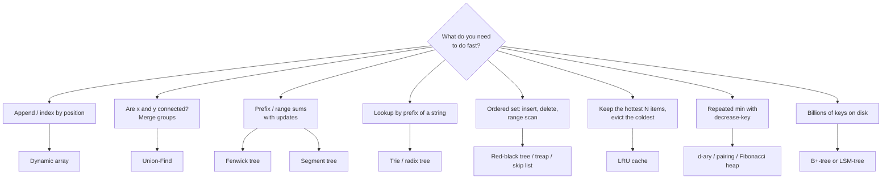
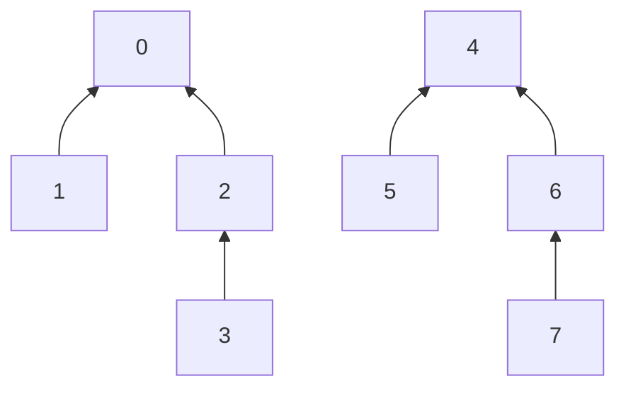
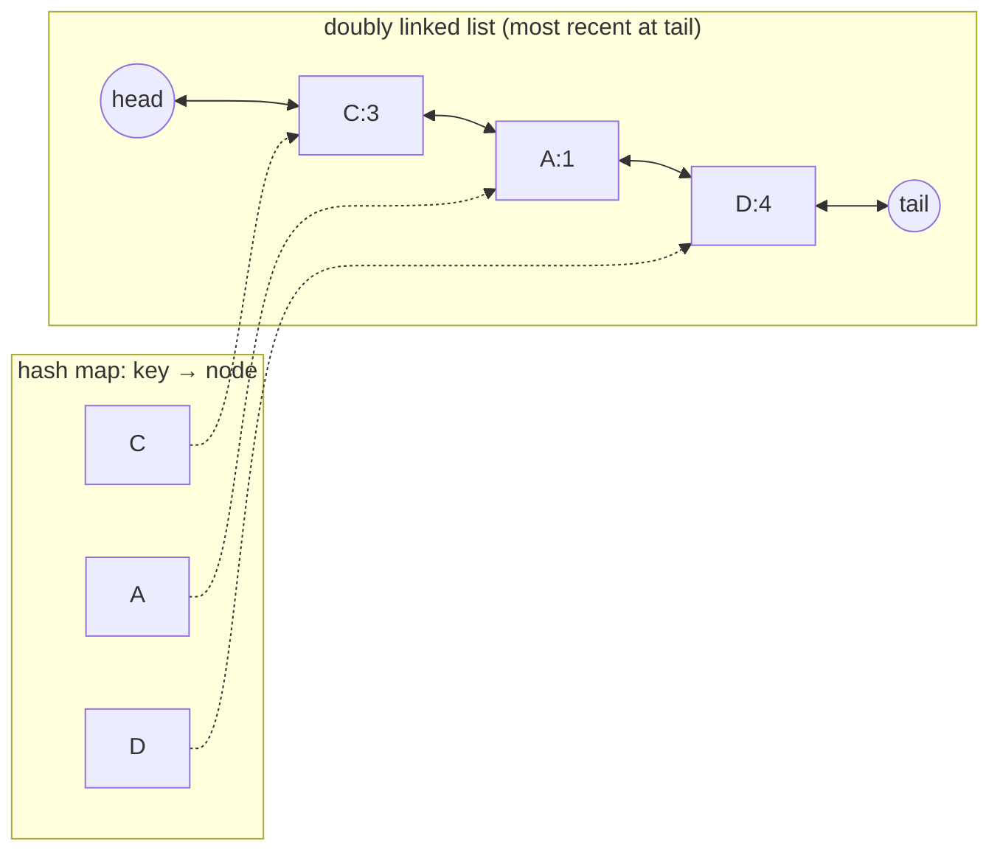
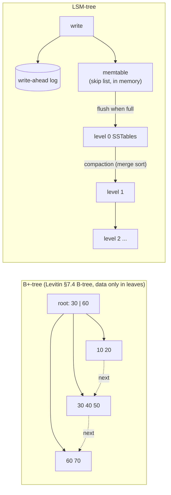

# Chapter 13 · Advanced Data Structures (Beyond the Textbook)

> **Why this matters.** Levitin gives you the classic toolbox: arrays, linked lists, stacks, queues, heaps, Binary Search Trees (BSTs), Adelson-Velsky and Landis (AVL) trees, 2-3 trees, hash tables and B-trees (Levitin §1.4, §6.3, §6.4, §7.3, §7.4). Professional code leans on a second layer built from those parts: arrays that grow for free, sets that merge in almost constant time, trees that answer "sum of this range?" in $O(\log n)$, Least Recently Used (LRU) caches that forget the right thing, and storage engines (B+-trees and Log-Structured Merge trees (LSM-trees)) that survive billions of writes. This lesson builds that second layer, one card at a time.

| 🎮 Simulations | 🏟️ Arena | 🐍 Code |
|---|---|---|
| [Union-Find](https://normansrule.github.io/algorithm-forge/sims/union-find.html) · [Segment Tree](https://normansrule.github.io/algorithm-forge/sims/segment-tree.html) · [Trie](https://normansrule.github.io/algorithm-forge/sims/trie.html) · [Amortized (dynamic array)](https://normansrule.github.io/algorithm-forge/sims/amortized.html) | [Chapter 13 problems](https://normansrule.github.io/algorithm-forge/arena/?chapter=13) | [`ch13_advanced_ds.py`](../../src/python/algoforge/ch13_advanced_ds.py) |

**Prerequisites:** heaps and heapsort ([Lesson 6](../06-transform-and-conquer/README.md)), hashing and B-trees ([Lesson 7](../07-space-time-tradeoffs/README.md)), Kruskal's algorithm ([Lesson 9](../09-greedy/README.md)).

**Conventions.** Pseudocode is Forge Pseudocode (see [Lesson 0](../00-start-here/README.md)). When a structure needs records (a tree node with fields), we write `x.key`, `x.left` and create one with `new Node`, then assign its fields (a field never assigned is `null`); when it needs a dictionary we say so in a comment (`// pos is a hash map`).

---

## The big idea in 60 seconds

A data structure is a **promise about operations**. You pick one by listing the operations your program performs most often and asking "which structure makes *those* cheap?" Every structure below keeps an **invariant** (a fact that stays true after every operation) and that invariant is exactly what makes its operations fast.



| Structure | Main operations | Cost |
|---|---|---|
| Dynamic array | append, index | $O(1)$ amortized, $O(1)$ |
| Union-Find (rank + compression) | find, union | $O(\alpha(n))$ amortized |
| Fenwick tree | prefix sum, point update | $O(\log n)$ each |
| Segment tree (lazy) | range query, range update | $O(\log n)$ each |
| Trie | insert, search, prefix search | $O(L)$ for a key of length $L$ |
| Skip list / treap | search, insert, delete | $O(\log n)$ expected |
| Red-black tree | search, insert, delete | $O(\log n)$ worst case |
| LRU cache | get, put | $O(1)$ |
| B+-tree | point lookup, range scan | $O(\log_B n)$ disk reads |
| LSM-tree | write | $O(1)$ amortized in memory + sequential disk writes |

---

## Build Card 1 · Dynamic array (amortized doubling)

🎯 **Problem.** Store a list whose final size you don't know, keep $O(1)$ indexing, and make `append` cheap.

📖 **Story.** You rent a row of lockers. When it fills up, you rent a row **twice as long** and move everything over. Moving is expensive, but it happens so rarely that, averaged over all your moves-in, each item pays only a small constant.

👀 **Picture.**

```
append 1..9, starting capacity 1        (| = capacity boundary)
[1]                cap 1
[1 2]              cap 2   copied 1
[1 2 3 _]          cap 4   copied 2
[1 2 3 4 5 _ _ _]  cap 8   copied 4
[1 ... 9 _ ... _]  cap 16  copied 8     total copies 1+2+4+8 = 15
```

Try it live: [amortized.html](https://normansrule.github.io/algorithm-forge/sims/amortized.html).

🧱 **Build it in blocks.**

1. Keep three things: a raw array `data`, its `capacity`, and the logical `size`.
2. `append(x)`: if `size < capacity`, write `data[size] ← x` and increment.
3. If full, allocate `2 · capacity`, copy, then write.
4. (Optional) `pop`: shrink to half **only when size drops to a quarter** to avoid thrashing.

✋ **Trace.** Append 1 through 9 from capacity 1. Grows happen at appends #2, #3, #5, #9 copying 1, 2, 4, 8 items. Total work = 9 writes + 15 copies = **24 ≤ 3 · 9 = 27**. In general $n$ appends cost fewer than $3n$ element writes.

💻 **Forge Pseudocode**

```
ALGORITHM Append(D, x)
    // D is a record with fields data, size, capacity
    if D.size = D.capacity then
        bigger ← array(2 * D.capacity, null)
        for i ← 0 to D.size - 1 do
            bigger[i] ← D.data[i]
        D.data ← bigger
        D.capacity ← 2 * D.capacity
    D.data[D.size] ← x
    D.size ← D.size + 1
```

<details><summary>Python</summary>

```python
class DynamicArray:
    """Growable array with doubling; counts element copies to show the amortized bound."""
    def __init__(self):
        self.capacity, self.size = 1, 0
        self.data = [None] * self.capacity
        self.copies = 0

    def append(self, x):
        if self.size == self.capacity:
            bigger = [None] * (2 * self.capacity)
            for i in range(self.size):
                bigger[i] = self.data[i]
                self.copies += 1
            self.data, self.capacity = bigger, 2 * self.capacity
        self.data[self.size] = x
        self.size += 1

    def pop(self):
        x = self.data[self.size - 1]
        self.size -= 1
        if self.capacity > 1 and self.size <= self.capacity // 4:   # shrink at 1/4, not 1/2
            self.capacity //= 2
            self.data = self.data[:self.capacity]
        return x

    def __getitem__(self, i):
        if not 0 <= i < self.size:
            raise IndexError(i)
        return self.data[i]

if __name__ == "__main__":
    d = DynamicArray()
    for v in range(1, 10):
        d.append(v)
    assert d.copies == 15 and d.capacity == 16 and d[8] == 9
    n = 100_000
    d = DynamicArray()
    for v in range(n):
        d.append(v)
    assert d.copies + n < 3 * n
    print("copies for 9 appends = 15; total work for", n, "appends <", 3 * n)
```

</details>

<details><summary>Java</summary>

```java
import java.util.Arrays;

class DynamicArray {
    private int[] data = new int[1];
    private int size = 0;
    long copies = 0;

    void append(int x) {
        if (size == data.length) {
            int[] bigger = new int[2 * data.length];
            for (int i = 0; i < size; i++) { bigger[i] = data[i]; copies++; }
            data = bigger;
        }
        data[size++] = x;
    }

    int get(int i) {
        if (i < 0 || i >= size) throw new IndexOutOfBoundsException(i);
        return data[i];
    }

    public static void main(String[] args) {
        DynamicArray d = new DynamicArray();
        for (int v = 1; v <= 9; v++) d.append(v);
        System.out.println("copies = " + d.copies + ", capacity = " + d.data.length); // 15, 16
    }
}
```

</details>

🧮 **Analysis.** Appending $n$ items copies at most $1 + 2 + 4 + \dots + 2^{k} < 2n$ elements (a geometric series whose last term is below $n$), plus $n$ direct writes, so the total is $< 3n$ and the **amortized** cost per append is $O(1)$. A single append can still cost $\Theta(n)$. Growing by a constant *amount* (say +10) instead of a constant *factor* gives $\Theta(n^2)$ total. Any factor $r > 1$ works; [Lesson 16](../16-randomized-amortized-streaming/README.md) proves the bound three ways.

⚠️ **Pitfalls.**
- Shrinking when half empty: alternate push/pop at the boundary and every operation reallocates. Shrink at one quarter.
- Holding a pointer or reference into the old buffer after a grow (a classic C++ `std::vector` iterator-invalidation bug).
- Latency-sensitive code (games, trading) may not tolerate the occasional $\Theta(n)$ spike; pre-size with `reserve` or use a chunked structure.

🔁 **Where it's used.** Python `list` (over-allocates by roughly 1/8 plus a constant), Java `ArrayList` (grows by 1.5×), C++ `std::vector` (2× in the common Linux implementation, 1.5× in Microsoft's), Rust `Vec` (2×), Go slices (2× while small, a smaller factor when large). Hash tables resize with the same doubling trick.

---

## Build Card 2 · Union-Find (disjoint sets)

🎯 **Problem.** Maintain a partition of $n$ items into groups under two operations: `find(x)` (which group is $x$ in?) and `union(x, y)` (merge their groups). Levitin introduces it for Kruskal's algorithm (Levitin §9.2).

📖 **Story.** Every group has a **boss**. Each person knows someone higher up; follow the chain to reach the boss. Two people are in the same group exactly when they reach the same boss. Merging groups means one boss starts reporting to the other.

👀 **Picture.** Play with it: [union-find.html](https://normansrule.github.io/algorithm-forge/sims/union-find.html).



🧱 **Build it in blocks.** Four versions, each fixing the previous one's weakness.

| Version | Idea | find | union | Weakness |
|---|---|---|---|---|
| Quick-find | `id[x]` = group name | $O(1)$ | $O(n)$ (relabel a whole group) | union too slow |
| Quick-union | `parent[x]`, roots are bosses | $O(h)$ | $O(h)$ | trees can become a chain, $h = n$ |
| + union by size/rank | hang the **smaller** tree under the larger | $O(\log n)$ | $O(\log n)$ | still walks the path every time |
| + path compression | during find, point every visited node at the root | $O(\alpha(n))$ amortized | $O(\alpha(n))$ amortized | none that matters |

✋ **Trace.** $n = 8$, union by size (ties: the first argument's root stays root), with path compression.

| Operation | `parent[0..7]` after | Notes |
|---|---|---|
| start | 0 1 2 3 4 5 6 7 | everyone is their own boss |
| union(0,1) | 0 **0** 2 3 4 5 6 7 | sizes tie, 1 hangs under 0 |
| union(2,3) | 0 0 2 **2** 4 5 6 7 | |
| union(0,2) | 0 0 **0** 2 4 5 6 7 | group {0,1,2,3}, size 4 |
| union(4,5) | 0 0 0 2 4 **4** 6 7 | |
| union(6,7) | 0 0 0 2 4 4 6 **6** | |
| union(4,6) | 0 0 0 2 4 4 **4** 6 | group {4,5,6,7}, size 4 |
| union(3,5) | 0 0 0 **0** **0** 4 4 6 | find(3) compresses 3→0; roots 0 and 4 tie, 4 hangs under 0 |
| find(7) | 0 0 0 0 0 4 **0** **0** | path 7→6→4→0; 7 and 6 now point straight at 0 |

💻 **Forge Pseudocode**

```
ALGORITHM MakeSets(n)
    parent ← array(n, 0)
    size ← array(n, 1)
    for i ← 0 to n - 1 do
        parent[i] ← i
    return parent, size

ALGORITHM Find(parent[0..n-1], x)
    // Returns the root of x's tree and compresses the path
    root ← x
    while parent[root] ≠ root do
        root ← parent[root]
    while parent[x] ≠ root do
        next ← parent[x]
        parent[x] ← root
        x ← next
    return root

ALGORITHM Union(parent[0..n-1], size[0..n-1], a, b)
    // Merges the sets containing a and b; returns false if already together
    ra ← Find(parent, a)
    rb ← Find(parent, b)
    if ra = rb then
        return false
    if size[ra] < size[rb] then
        swap ra and rb
    parent[rb] ← ra
    size[ra] ← size[ra] + size[rb]
    return true
```

<details><summary>Python</summary>

```python
class UnionFind:
    """Disjoint-set union with union by size and path compression."""
    def __init__(self, n):
        self.parent = list(range(n))
        self.size = [1] * n
        self.components = n

    def find(self, x):
        root = x
        while self.parent[root] != root:
            root = self.parent[root]
        while self.parent[x] != root:          # path compression, iterative (no recursion limit)
            self.parent[x], x = root, self.parent[x]
        return root

    def union(self, a, b):
        ra, rb = self.find(a), self.find(b)
        if ra == rb:
            return False
        if self.size[ra] < self.size[rb]:
            ra, rb = rb, ra
        self.parent[rb] = ra
        self.size[ra] += self.size[rb]
        self.components -= 1
        return True

if __name__ == "__main__":
    uf = UnionFind(8)
    for a, b in [(0, 1), (2, 3), (0, 2), (4, 5), (6, 7), (4, 6), (3, 5)]:
        uf.union(a, b)
    assert uf.parent == [0, 0, 0, 0, 0, 4, 4, 6]
    assert uf.find(7) == 0 and uf.parent == [0, 0, 0, 0, 0, 4, 0, 0]
    assert uf.components == 1
    print("trace matches the table")
```

</details>

<details><summary>Java</summary>

```java
class UnionFind {
    final int[] parent, size;
    UnionFind(int n) {
        parent = new int[n]; size = new int[n];
        for (int i = 0; i < n; i++) { parent[i] = i; size[i] = 1; }
    }
    int find(int x) {
        int root = x;
        while (parent[root] != root) root = parent[root];
        while (parent[x] != root) { int next = parent[x]; parent[x] = root; x = next; }
        return root;
    }
    boolean union(int a, int b) {
        int ra = find(a), rb = find(b);
        if (ra == rb) return false;
        if (size[ra] < size[rb]) { int t = ra; ra = rb; rb = t; }
        parent[rb] = ra; size[ra] += size[rb];
        return true;
    }
    public static void main(String[] args) {
        UnionFind uf = new UnionFind(8);
        int[][] ops = {{0,1},{2,3},{0,2},{4,5},{6,7},{4,6},{3,5}};
        for (int[] op : ops) uf.union(op[0], op[1]);
        System.out.println(uf.find(7) + " " + java.util.Arrays.toString(uf.parent));
    }
}
```

</details>

🧮 **Analysis.**
- **Union by size keeps height ≤ $\log_2 n$.** A node's depth grows by 1 only when its tree is hung under a tree at least as large, so the size of the tree containing it at least doubles. Sizes can't exceed $n$, so that happens at most $\log_2 n$ times.
- **With path compression too**, any sequence of $m$ operations costs $O(m\,\alpha(n))$ (Tarjan, 1975), where $\alpha$ is the inverse Ackermann function. $\alpha(n) \le 4$ for every $n$ you will ever store, so in practice it is constant. It is still not *truly* constant: Tarjan also proved this bound is tight for this family of algorithms.
- Union by **rank** (an upper bound on height) gives the same guarantees and uses a tiny counter instead of a size.

⚠️ **Pitfalls.** Forgetting to call `find` on both arguments before linking (linking non-roots corrupts the forest). Recursive `find` overflowing the stack in Python on a long chain; use the iterative version. Union-Find **cannot split** groups; for deletions you need other tools (offline tricks or link-cut trees).

🔁 **Where it's used.** Kruskal's Minimum Spanning Tree (MST) algorithm; connected components of images (blob labeling in computer vision); type inference by unification in compilers; network connectivity checks; percolation simulations; merging duplicate accounts ("these two emails belong to one person").

---

## Build Card 3 · Fenwick tree (Binary Indexed Tree (BIT))

🎯 **Problem.** An array changes over time. Answer "sum of $A[1..i]$" and "add $\delta$ to $A[i]$" in $O(\log n)$ each. A plain array gives $O(1)$ update but $O(n)$ query; a prefix-sum array gives the reverse.

📖 **Story.** Each cell of a Fenwick array is a manager who knows the total of a **block** of employees ending at their own index. The block length is the lowest set bit of the index: cell 6 (binary `110`) covers 2 cells, cell 8 (`1000`) covers 8.

👀 **Picture.** `T[i]` stores the sum of $A(i - \text{lowbit}(i),\ i]$ where $\text{lowbit}(i) = i \,\&\, (-i)$.

```
index   1    2     3    4      5    6     7    8
binary  001  010   011  100    101  110   111  1000
covers  1    1..2  3    1..4   5    5..6  7    1..8
```

- **Query prefix(i):** add `T[i]`, then strip the lowest bit (`i ← i - lowbit(i)`), repeat until 0.
- **Update(i, δ):** add δ to `T[i]`, then climb (`i ← i + lowbit(i)`), repeat while `i ≤ n`.

🧱 **Build it in blocks.** (1) `lowbit(i) = i & -i`. (2) query loop. (3) update loop. (4) build by calling update $n$ times ($O(n \log n)$) or with the $O(n)$ trick "add `T[i]` into `T[i + lowbit(i)]`". (5) range sum $[l..r]$ = prefix$(r)$ − prefix$(l-1)$.

✋ **Trace.** $A[1..8] = [3, 2, -1, 6, 5, 4, -3, 3]$.

| i | 1 | 2 | 3 | 4 | 5 | 6 | 7 | 8 |
|---|---|---|---|---|---|---|---|---|
| `T[i]` | 3 | 5 | −1 | 10 | 5 | 9 | −3 | 19 |

- prefix(6): visit 6 (`110`) → 4 (`100`) → 0. Sum = `T[6] + T[4]` = 9 + 10 = **19** = 3+2−1+6+5+4. ✔
- sum $A[3..6]$ = prefix(6) − prefix(2) = 19 − 5 = **14**. ✔
- update(3, +2): visit 3 → 4 → 8. `T` becomes `[3, 5, 1, 12, 5, 9, −3, 21]`; prefix(6) is now 21.

💻 **Forge Pseudocode**

```
ALGORITHM FenwickUpdate(T[0..n], i, delta)
    // T[1..n] holds the tree (T[0] unused); adds delta to A[i]
    while i ≤ n do
        T[i] ← T[i] + delta
        i ← i + LowBit(i)

ALGORITHM FenwickPrefix(T[0..n], i)
    // Returns A[1] + ... + A[i]
    s ← 0
    while i > 0 do
        s ← s + T[i]
        i ← i - LowBit(i)
    return s

ALGORITHM LowBit(i)
    // The value of i's lowest 1-bit, i.e. i AND (-i) in two's complement:
    // LowBit(6) = 2, LowBit(8) = 8, LowBit(7) = 1 (Forge has no bit operators, so we halve instead)
    p ← 1
    while i mod (2 * p) = 0 do
        p ← 2 * p
    return p
```

The header `T[0..n]` binds $n$ to the number of real cells; `T[0]` is an unused placeholder so that indices start at 1.

<details><summary>Python</summary>

```python
class Fenwick:
    """1-indexed Binary Indexed Tree for prefix sums with point updates."""
    def __init__(self, values):
        self.n = len(values)
        self.t = [0] * (self.n + 1)
        for i, v in enumerate(values, start=1):       # O(n) build
            self.t[i] += v
            j = i + (i & -i)
            if j <= self.n:
                self.t[j] += self.t[i]

    def add(self, i, delta):
        while i <= self.n:
            self.t[i] += delta
            i += i & -i

    def prefix(self, i):
        s = 0
        while i > 0:
            s += self.t[i]
            i -= i & -i
        return s

    def range_sum(self, l, r):
        return self.prefix(r) - self.prefix(l - 1)

if __name__ == "__main__":
    f = Fenwick([3, 2, -1, 6, 5, 4, -3, 3])
    assert f.t[1:] == [3, 5, -1, 10, 5, 9, -3, 19]
    assert f.prefix(6) == 19 and f.range_sum(3, 6) == 14
    f.add(3, 2)
    assert f.t[1:] == [3, 5, 1, 12, 5, 9, -3, 21] and f.prefix(6) == 21
    print("Fenwick trace verified")
```

</details>

<details><summary>Java</summary>

```java
class Fenwick {
    final long[] t; final int n;
    Fenwick(int n) { this.n = n; t = new long[n + 1]; }
    void add(int i, long delta) { for (; i <= n; i += i & -i) t[i] += delta; }
    long prefix(int i) { long s = 0; for (; i > 0; i -= i & -i) s += t[i]; return s; }
    long rangeSum(int l, int r) { return prefix(r) - prefix(l - 1); }
    public static void main(String[] args) {
        int[] a = {3, 2, -1, 6, 5, 4, -3, 3};
        Fenwick f = new Fenwick(a.length);
        for (int i = 0; i < a.length; i++) f.add(i + 1, a[i]);
        System.out.println(f.prefix(6) + " " + f.rangeSum(3, 6)); // 19 14
    }
}
```

</details>

🧮 **Analysis.** Each query step clears one 1-bit of $i$; each update step moves to an index with a strictly higher lowest bit. Both loops run at most $\lfloor \log_2 n \rfloor + 1$ times. Memory: $n + 1$ numbers, no pointers. Tiny code, great cache behavior.

⚠️ **Pitfalls.** It is **1-indexed**: `i = 0` makes the update loop spin forever (`0 & -0 = 0`). It needs an *invertible* operation for range queries (sums, exclusive or (XOR)). For range **min/max** use a segment tree.

🔁 **Where it's used.** Counting inversions in $O(n \log n)$, order-statistics on bounded keys ("how many scores ≤ x?"), cumulative-frequency tables in arithmetic coding (the original 1994 motivation by Peter Fenwick), competitive programming everywhere.

---

## Build Card 4 · Segment tree (and the lazy-propagation idea)

🎯 **Problem.** Range queries for **any associative** operation (sum, min, max, gcd) plus updates, all in $O(\log n)$. With lazy propagation, even **range updates** ("add 10 to every element in $[l..r]$").

📖 **Story.** A tournament bracket. Each match (internal node) records a summary of the players below it. To ask about a stretch of players you combine a handful of match results instead of asking every player.

👀 **Picture.** Build and query interactively in [segment-tree.html](https://normansrule.github.io/algorithm-forge/sims/segment-tree.html). Sum tree over $B = [2, 5, 1, 4, 9, 3]$:

```
                    [0..5] 24
            /                     \
       [0..2] 8                 [3..5] 16
       /      \                 /       \
  [0..1] 7   [2..2] 1      [3..4] 13   [5..5] 3
   /    \                   /    \
[0]2   [1]5               [3]4  [4]9
```

🧱 **Build it in blocks.**

1. Store nodes in an array: node `k` has children `2k` and `2k+1` (root is 1). Size `4n` is always enough.
2. **Build** recursively: leaf = element; internal = combine(children).
3. **Query** $[q_l..q_r]$ at node covering $[l..r]$: *outside* → identity (0 for sum); *fully inside* → node value; *partial* → recurse both sides.
4. **Point update**: walk to the leaf, then recombine on the way up.
5. **Lazy propagation**: for "add $v$ to $[l..r]$", stop at fully-covered nodes, update their sum by $v \cdot$(length), and leave a **tag** "my children still owe $+v$". Push the tag down only when a later operation needs to go below that node.

✋ **Trace.** Query sum $[1..4]$ on the tree above.

| Node | Relation to [1..4] | Action |
|---|---|---|
| [0..5] | partial | recurse |
| [0..2] | partial | recurse |
| [0..1] | partial | recurse |
| [0..0] | outside | 0 |
| [1..1] | inside | 5 |
| [2..2] | inside | 1 |
| [3..5] | partial | recurse |
| [3..4] | inside | 13 |
| [5..5] | outside | 0 |

Answer $5 + 1 + 13 = 19$ ✔ ($5+1+4+9$). Range-add $+10$ on $[1..4]$ touches the same nodes: sums at [1..1], [2..2] each gain 10, [3..4] gains 20 and gets tag $+10$ (its leaves are not touched yet), and ancestors are recombined; the root becomes $24 + 40 = 64$.

💻 **Forge Pseudocode**

```
ALGORITHM SegBuild(B[0..n-1], S, node, l, r)
    // S is an array of size 4n; node covers B[l..r]
    if l = r then
        S[node] ← B[l]
        return
    mid ← (l + r) div 2
    SegBuild(B, S, 2 * node, l, mid)
    SegBuild(B, S, 2 * node + 1, mid + 1, r)
    S[node] ← S[2 * node] + S[2 * node + 1]

ALGORITHM SegQuery(S, node, l, r, ql, qr)
    // Sum of B[ql..qr] restricted to this node's range [l..r]
    if qr < l or r < ql then
        return 0
    if ql ≤ l and r ≤ qr then
        return S[node]
    mid ← (l + r) div 2
    return SegQuery(S, 2 * node, l, mid, ql, qr) + SegQuery(S, 2 * node + 1, mid + 1, r, ql, qr)

ALGORITHM SegUpdate(S, node, l, r, i, value)
    // Sets B[i] ← value
    if l = r then
        S[node] ← value
        return
    mid ← (l + r) div 2
    if i ≤ mid then
        SegUpdate(S, 2 * node, l, mid, i, value)
    else
        SegUpdate(S, 2 * node + 1, mid + 1, r, i, value)
    S[node] ← S[2 * node] + S[2 * node + 1]
```

<details><summary>Python (with lazy range-add)</summary>

```python
class LazySegTree:
    """Range add + range sum, both O(log n)."""
    def __init__(self, a):
        self.n = len(a)
        self.s = [0] * (4 * self.n)
        self.tag = [0] * (4 * self.n)       # pending add for the node's children
        self._build(a, 1, 0, self.n - 1)

    def _build(self, a, k, l, r):
        if l == r:
            self.s[k] = a[l]; return
        m = (l + r) // 2
        self._build(a, 2 * k, l, m); self._build(a, 2 * k + 1, m + 1, r)
        self.s[k] = self.s[2 * k] + self.s[2 * k + 1]

    def _apply(self, k, l, r, v):
        self.s[k] += v * (r - l + 1)
        self.tag[k] += v

    def _push(self, k, l, r):
        if self.tag[k]:
            m = (l + r) // 2
            self._apply(2 * k, l, m, self.tag[k])
            self._apply(2 * k + 1, m + 1, r, self.tag[k])
            self.tag[k] = 0

    def add(self, ql, qr, v, k=1, l=0, r=None):
        if r is None: r = self.n - 1
        if qr < l or r < ql: return
        if ql <= l and r <= qr:
            self._apply(k, l, r, v); return
        self._push(k, l, r)
        m = (l + r) // 2
        self.add(ql, qr, v, 2 * k, l, m); self.add(ql, qr, v, 2 * k + 1, m + 1, r)
        self.s[k] = self.s[2 * k] + self.s[2 * k + 1]

    def query(self, ql, qr, k=1, l=0, r=None):
        if r is None: r = self.n - 1
        if qr < l or r < ql: return 0
        if ql <= l and r <= qr: return self.s[k]
        self._push(k, l, r)
        m = (l + r) // 2
        return self.query(ql, qr, 2 * k, l, m) + self.query(ql, qr, 2 * k + 1, m + 1, r)

if __name__ == "__main__":
    import random
    t = LazySegTree([2, 5, 1, 4, 9, 3])
    assert t.query(1, 4) == 19 and t.s[1] == 24
    t.add(1, 4, 10)
    assert t.s[1] == 64 and t.query(4, 4) == 19 and t.query(0, 5) == 64
    # brute-force oracle test
    a = [random.randint(-9, 9) for _ in range(50)]
    t = LazySegTree(a)
    for _ in range(2000):
        l = random.randrange(50); r = random.randrange(l, 50)
        if random.random() < 0.5:
            v = random.randint(-5, 5); t.add(l, r, v)
            for i in range(l, r + 1): a[i] += v
        else:
            assert t.query(l, r) == sum(a[l:r + 1])
    print("lazy segment tree agrees with brute force")
```

</details>

<details><summary>Java (point update, range sum)</summary>

```java
class SegTree {
    final long[] s; final int n;
    SegTree(int[] a) { n = a.length; s = new long[4 * n]; build(a, 1, 0, n - 1); }
    private void build(int[] a, int k, int l, int r) {
        if (l == r) { s[k] = a[l]; return; }
        int m = (l + r) / 2;
        build(a, 2 * k, l, m); build(a, 2 * k + 1, m + 1, r);
        s[k] = s[2 * k] + s[2 * k + 1];
    }
    long query(int ql, int qr) { return query(1, 0, n - 1, ql, qr); }
    private long query(int k, int l, int r, int ql, int qr) {
        if (qr < l || r < ql) return 0;
        if (ql <= l && r <= qr) return s[k];
        int m = (l + r) / 2;
        return query(2 * k, l, m, ql, qr) + query(2 * k + 1, m + 1, r, ql, qr);
    }
    void set(int i, int v) { set(1, 0, n - 1, i, v); }
    private void set(int k, int l, int r, int i, int v) {
        if (l == r) { s[k] = v; return; }
        int m = (l + r) / 2;
        if (i <= m) set(2 * k, l, m, i, v); else set(2 * k + 1, m + 1, r, i, v);
        s[k] = s[2 * k] + s[2 * k + 1];
    }
    public static void main(String[] args) {
        SegTree t = new SegTree(new int[]{2, 5, 1, 4, 9, 3});
        System.out.println(t.query(1, 4)); // 19
        t.set(2, 7);
        System.out.println(t.query(1, 4)); // 25
    }
}
```

</details>

🧮 **Analysis.** Height $\lceil \log_2 n \rceil$. A query visits at most **4 nodes per level** (at most two "partial" nodes per level keep recursing), so $O(\log n)$. Build is $O(n)$ (about $2n$ nodes). Lazy tags keep range updates at $O(\log n)$ instead of $O(n)$. Memory $4n$ is a safe bound; an iterative bottom-up version uses exactly $2n$.

⚠️ **Pitfalls.** Allocating `2n` for the recursive version when $n$ isn't a power of 2 (index out of range). Forgetting to **push** tags before descending. Combining lazy tags wrong when updates don't commute (for example "set to $v$" followed by "add $w$" needs a composed tag).

🔁 **Where it's used.** Interval scheduling and booking systems ("max concurrent reservations in this window"), computational geometry sweep lines (area of union of rectangles), time-series dashboards with range aggregates, and a huge share of competitive programming problems.

---

## Build Card 5 · Trie and compressed trie (radix tree)

🎯 **Problem.** Store a set of strings so that "is $w$ in the set?", "which words start with `ca`?" and "longest stored prefix of $s$" take time proportional to the **length of the key**, not the number of keys.

📖 **Story.** A phone tree: press the first letter, then the second... Everyone who shares a prefix shares the same path of menu choices.

👀 **Picture.** Words: `car, card, care, cat, dog, dot` (● marks end of word). Play with inserts in [trie.html](https://normansrule.github.io/algorithm-forge/sims/trie.html).

```
Trie (one letter per edge)            Compressed trie / radix tree
root                                  root
├─ c ─ a ─┬─ r● ─┬─ d●                ├─ "ca" ─┬─ "r"● ─┬─ "d"●
│         │      └─ e●                │        │        └─ "e"●
│         └─ t●                       │        └─ "t"●
└─ d ─ o ─┬─ g●                       └─ "do" ─┬─ "g"●
          └─ t●                                └─ "t"●
10 nodes (plus root)                   8 nodes: chains with one child are merged
```

🧱 **Build it in blocks.**

1. A node = map from character to child + a boolean `isEnd`.
2. **Insert** $w$: walk from the root, creating missing children, mark the last node `isEnd`.
3. **Search** $w$: walk; fail on a missing child; succeed only if the last node has `isEnd`.
4. **StartsWith** $p$: walk $p$, then Depth-First Search (DFS) the subtree to list completions.
5. **Compress**: merge every chain of single-child, non-end nodes into one edge labeled by a string (radix tree, also called a Practical Algorithm To Retrieve Information Coded In Alphanumeric (PATRICIA) tree).

✋ **Trace.** Insert `car`, `card`, `care`, `cat`, `dog`, `dot` in that order.
- `car` creates c, a, r (3 nodes), marks r.
- `card` reuses c-a-r, creates d, marks it. `care` creates e. `cat` creates t under a.
- `dog` creates d, o, g. `dot` creates t under o.
- Total $3 + 1 + 1 + 1 + 3 + 1 = 10$ letter nodes, plus the root: **11 nodes** in all.
- `search("ca")` walks c-a and finds `isEnd = false` → not a word, but `startsWith("ca")` is true and lists `car, card, care, cat`.

💻 **Forge Pseudocode**

```
ALGORITHM TrieInsert(root, w[0..m-1])
    // Each node has a hash map node.child (character → node) and a boolean node.isEnd
    node ← root
    for i ← 0 to m - 1 do
        if not contains(node.child, w[i]) then
            node.child[w[i]] ← NewTrieNode()
        node ← node.child[w[i]]
    node.isEnd ← true

ALGORITHM TrieSearch(root, w[0..m-1])
    node ← root
    for i ← 0 to m - 1 do
        node ← get(node.child, w[i], null)
        if node = null then
            return false
    return node.isEnd

ALGORITHM NewTrieNode()
    // Also use it for the root: root ← NewTrieNode()
    t ← new Node
    t.child ← map()
    t.isEnd ← false
    return t
```

<details><summary>Python</summary>

```python
class TrieNode:
    __slots__ = ("child", "is_end")
    def __init__(self):
        self.child = {}
        self.is_end = False

class Trie:
    def __init__(self):
        self.root = TrieNode()
        self.nodes = 1

    def insert(self, w):
        node = self.root
        for ch in w:
            if ch not in node.child:
                node.child[ch] = TrieNode(); self.nodes += 1
            node = node.child[ch]
        node.is_end = True

    def _walk(self, s):
        node = self.root
        for ch in s:
            node = node.child.get(ch)
            if node is None:
                return None
        return node

    def search(self, w):
        node = self._walk(w)
        return node is not None and node.is_end

    def starts_with(self, p):
        node, out = self._walk(p), []
        def dfs(n, path):
            if n.is_end: out.append(path)
            for ch in sorted(n.child):
                dfs(n.child[ch], path + ch)
        if node: dfs(node, p)
        return out

if __name__ == "__main__":
    t = Trie()
    for w in ["car", "card", "care", "cat", "dog", "dot"]:
        t.insert(w)
    assert t.nodes == 11
    assert not t.search("ca") and t.search("card")
    assert t.starts_with("ca") == ["car", "card", "care", "cat"]
    print(t.starts_with("do"))
```

</details>

<details><summary>Java</summary>

```java
import java.util.*;

class Trie {
    static class Node { Map<Character, Node> child = new TreeMap<>(); boolean isEnd; }
    final Node root = new Node();

    void insert(String w) {
        Node node = root;
        for (char c : w.toCharArray()) node = node.child.computeIfAbsent(c, k -> new Node());
        node.isEnd = true;
    }
    boolean search(String w) {
        Node node = root;
        for (char c : w.toCharArray()) { node = node.child.get(c); if (node == null) return false; }
        return node.isEnd;
    }
    public static void main(String[] args) {
        Trie t = new Trie();
        for (String w : new String[]{"car", "card", "care", "cat", "dog", "dot"}) t.insert(w);
        System.out.println(t.search("ca") + " " + t.search("card")); // false true
    }
}
```

</details>

🧮 **Analysis.** Insert/search/prefix-walk cost $O(L)$ map operations for a key of length $L$, independent of the number of keys $n$. Space is the big cost: up to (total characters) nodes, each carrying a child map. A fixed array of 26 children per node is fastest but wastes memory; a hash map or sorted small array is leaner. A radix tree has at most $2n$ nodes for $n$ keys because every internal node branches.

⚠️ **Pitfalls.** Forgetting `isEnd` (then `ca` would be "found"). Unicode: decide whether edges are bytes, code points or grapheme clusters. Deep recursion when listing completions of very long keys.

🔁 **Where it's used.** Autocomplete and spell-check dictionaries; Internet Protocol (IP) routers doing longest-prefix match on compressed binary tries; the Linux kernel's page cache index (its radix tree, now the XArray); Redis's `rax` radix tree behind Streams; Ethereum's Merkle Patricia Trie for account state.

---

## Build Card 6 · Skip list

🎯 **Problem.** An ordered set with $O(\log n)$ search, insert and delete, but **without rotations**, and friendly to concurrent access.

📖 **Story.** A subway with local and express lines. The express stops at every other station, the super-express at every fourth. Ride the fastest line until you'd overshoot, then drop down a level.

👀 **Picture.**

```
L3: -∞ ─────────────────────────────► 30 ───────────────────────► +∞
L2: -∞ ─────────► 12 ───────────────► 30 ───────────► 50 ───────► +∞
L1: -∞ ──► 7 ───► 12 ───► 19 ───────► 30 ──► 41 ────► 50 ───────► +∞
L0: -∞ ─► 7 ─► 9 ─► 12 ─► 19 ─► 25 ─► 30 ─► 41 ─► 44 ─► 50 ─► 62 ─► +∞
search(44): L3 30 → (+∞ too far) ↓ L2 30 → 50 too far ↓ L1 41 → 50 too far ↓ L0 44 ✔
```

🧱 **Build it in blocks.**
1. Level 0 is a sorted linked list. Each node also appears in level 1 with probability $1/2$, level 2 with probability $1/4$, and so on (flip coins until tails).
2. **Search**: start at the top-left sentinel; move right while the next key < target; otherwise go down.
3. **Insert**: search, remembering the last node visited on each level (`update[level]`); flip coins for the new node's height; splice it in after `update[i]` on each of its levels.
4. **Delete**: search the same way and unlink on every level.

✋ **Trace.** In the picture, `search(44)` inspects 30 (L3), 50 (L2, too big), 41 then 50 (L1), 44 (L0): about 5 comparisons for 11 keys; a plain linked list would need 9.

💻 **Forge Pseudocode**

```
ALGORITHM SkipSearch(head, maxLevel, target)
    // head is the -∞ sentinel; x.next[i] is x's successor on level i
    x ← head
    for i ← maxLevel downto 0 do
        while x.next[i] ≠ null and x.next[i].key < target do
            x ← x.next[i]
    x ← x.next[0]
    return x ≠ null and x.key = target
```

<details><summary>Python</summary>

```python
import random

class SkipNode:
    def __init__(self, key, level):
        self.key = key
        self.next = [None] * (level + 1)

class SkipList:
    MAX = 16
    def __init__(self, seed=None):
        self.rng = random.Random(seed)
        self.head = SkipNode(float("-inf"), self.MAX)
        self.level = 0

    def _random_level(self):
        lvl = 0
        while lvl < self.MAX and self.rng.random() < 0.5:
            lvl += 1
        return lvl

    def contains(self, key):
        x = self.head
        for i in range(self.level, -1, -1):
            while x.next[i] and x.next[i].key < key:
                x = x.next[i]
        x = x.next[0]
        return x is not None and x.key == key

    def insert(self, key):
        update, x = [self.head] * (self.MAX + 1), self.head
        for i in range(self.level, -1, -1):
            while x.next[i] and x.next[i].key < key:
                x = x.next[i]
            update[i] = x
        if x.next[0] and x.next[0].key == key:
            return False
        lvl = self._random_level()
        self.level = max(self.level, lvl)
        node = SkipNode(key, lvl)
        for i in range(lvl + 1):
            node.next[i], update[i].next[i] = update[i].next[i], node
        return True

    def delete(self, key):
        update, x = [self.head] * (self.MAX + 1), self.head
        for i in range(self.level, -1, -1):
            while x.next[i] and x.next[i].key < key:
                x = x.next[i]
            update[i] = x
        x = x.next[0]
        if x is None or x.key != key:
            return False
        for i in range(len(x.next)):
            update[i].next[i] = x.next[i]
        return True

    def keys(self):
        out, x = [], self.head.next[0]
        while x:
            out.append(x.key); x = x.next[0]
        return out

if __name__ == "__main__":
    s, ref = SkipList(seed=1), set()
    rng = random.Random(2)
    for _ in range(5000):
        k = rng.randrange(300)
        op = rng.random()
        if op < 0.5: assert s.insert(k) == (k not in ref); ref.add(k)
        elif op < 0.8: assert s.delete(k) == (k in ref); ref.discard(k)
        else: assert s.contains(k) == (k in ref)
    assert s.keys() == sorted(ref)
    print("skip list agrees with Python set;", len(ref), "keys")
```

</details>

<details><summary>Java</summary>

```java
import java.util.Random;

class SkipList {
    static final int MAX = 16;
    static class Node { int key; Node[] next; Node(int k, int lvl) { key = k; next = new Node[lvl + 1]; } }
    final Node head = new Node(Integer.MIN_VALUE, MAX);
    int level = 0; final Random rng = new Random(1);

    boolean contains(int key) {
        Node x = head;
        for (int i = level; i >= 0; i--)
            while (x.next[i] != null && x.next[i].key < key) x = x.next[i];
        x = x.next[0];
        return x != null && x.key == key;
    }
    void insert(int key) {
        Node[] update = new Node[MAX + 1]; Node x = head;
        for (int i = level; i >= 0; i--) {
            while (x.next[i] != null && x.next[i].key < key) x = x.next[i];
            update[i] = x;
        }
        if (x.next[0] != null && x.next[0].key == key) return;
        int lvl = 0; while (lvl < MAX && rng.nextBoolean()) lvl++;
        for (int i = level + 1; i <= lvl; i++) update[i] = head;
        level = Math.max(level, lvl);
        Node n = new Node(key, lvl);
        for (int i = 0; i <= lvl; i++) { n.next[i] = update[i].next[i]; update[i].next[i] = n; }
    }
    public static void main(String[] args) {
        SkipList s = new SkipList();
        for (int k : new int[]{30, 7, 50, 12, 19, 41, 9, 25, 44, 62}) s.insert(k);
        System.out.println(s.contains(44) + " " + s.contains(45)); // true false
    }
}
```

</details>

🧮 **Analysis.** Expected number of levels is about $\log_2 n$; on each level the search moves right an expected $\le 2$ times (read the search path backwards: each step up happens with probability $1/2$). So search, insert and delete are $O(\log n)$ **expected**, independent of the input order, and space is $n$ nodes with $2$ pointers each on average. The worst case is $O(n)$ but vanishingly unlikely.

⚠️ **Pitfalls.** Using a predictable random generator that an attacker can control. Forgetting to initialize `update[i]` to the head for newly created top levels (the Java version does this explicitly).

🔁 **Where it's used.** Redis sorted sets (`ZSET`: a skip list plus a hash table); the in-memory write buffer (memtable) of LevelDB and RocksDB; Java's `ConcurrentSkipListMap`. Skip lists are popular for concurrency because inserts only touch local pointers.

---

## Build Card 7 · Least Recently Used (LRU) cache

🎯 **Problem.** A cache of capacity $C$ with `get(key)` and `put(key, value)` in $O(1)$; when full, evict the entry used longest ago.

📖 **Story.** A desk with room for three books. Every time you touch a book you put it on top of the pile. When you need room, you remove the one at the bottom.

👀 **Picture.** Two structures cooperate (snapshot after `put D` in the trace below):



The map finds a node in $O(1)$; the doubly linked list lets us **unlink** that node and **move it to the tail** in $O(1)$; the least recent node sits right after the head sentinel.

🧱 **Build it in blocks.** (1) sentinels `head` and `tail`. (2) `unlink(node)` and `appendTail(node)`. (3) `get`: miss → null; hit → move to tail, return value. (4) `put`: existing → update + move to tail; new → if full, evict `head.next` and delete it from the map; then append.

✋ **Trace.** Capacity 3 (order shown least → most recent).

| Operation | Result | Order after |
|---|---|---|
| put A=1, put B=2, put C=3 | | A B C |
| get A | 1 | B C A |
| put D=4 | evicts **B** | C A D |
| get B | miss | C A D |
| get C | 3 | A D C |
| put E=5 | evicts **A** | D C E |
| get A | miss | D C E |

💻 **Forge Pseudocode**

```
ALGORITHM LRUGet(cache, key)
    // cache.map is a hash map key → node; cache.head/tail are sentinels
    node ← get(cache.map, key, null)
    if node = null then
        return null
    Unlink(node)
    AppendBeforeTail(cache, node)
    return node.value

ALGORITHM LRUPut(cache, key, value)
    node ← get(cache.map, key, null)
    if node ≠ null then
        node.value ← value
        Unlink(node)
    else
        if cache.size = cache.capacity then
            oldest ← cache.head.next               // the least recently used node
            Unlink(oldest)
            remove(cache.map, oldest.key)
            cache.size ← cache.size - 1
        node ← new Node
        node.key ← key
        node.value ← value
        cache.map[key] ← node
        cache.size ← cache.size + 1
    AppendBeforeTail(cache, node)

ALGORITHM NewLRU(capacity)
    // An empty cache: head ⇄ tail sentinels, nothing in between
    cache ← new Cache
    cache.map ← map()
    cache.size ← 0
    cache.capacity ← capacity
    cache.head ← new Node
    cache.tail ← new Node
    cache.head.next ← cache.tail
    cache.tail.prev ← cache.head
    return cache

ALGORITHM Unlink(node)
    node.prev.next ← node.next
    node.next.prev ← node.prev

ALGORITHM AppendBeforeTail(cache, node)
    // the most recently used node sits just before the tail sentinel
    node.prev ← cache.tail.prev
    node.next ← cache.tail
    cache.tail.prev.next ← node
    cache.tail.prev ← node
```

<details><summary>Python</summary>

```python
class _Node:
    __slots__ = ("key", "val", "prev", "next")
    def __init__(self, key=None, val=None):
        self.key, self.val, self.prev, self.next = key, val, None, None

class LRUCache:
    def __init__(self, capacity):
        self.cap, self.map = capacity, {}
        self.head, self.tail = _Node(), _Node()
        self.head.next, self.tail.prev = self.tail, self.head

    def _unlink(self, n):
        n.prev.next, n.next.prev = n.next, n.prev

    def _append(self, n):                       # insert just before tail (most recent)
        n.prev, n.next = self.tail.prev, self.tail
        self.tail.prev.next = n
        self.tail.prev = n

    def get(self, key):
        n = self.map.get(key)
        if n is None:
            return None
        self._unlink(n); self._append(n)
        return n.val

    def put(self, key, val):
        n = self.map.get(key)
        if n:
            n.val = val; self._unlink(n)
        else:
            if len(self.map) == self.cap:
                old = self.head.next
                self._unlink(old); del self.map[old.key]
            n = _Node(key, val); self.map[key] = n
        self._append(n)

    def order(self):
        out, n = [], self.head.next
        while n is not self.tail:
            out.append(n.key); n = n.next
        return out

if __name__ == "__main__":
    c = LRUCache(3)
    c.put("A", 1); c.put("B", 2); c.put("C", 3)
    assert c.get("A") == 1 and c.order() == ["B", "C", "A"]
    c.put("D", 4); assert c.order() == ["C", "A", "D"]
    assert c.get("B") is None and c.get("C") == 3
    c.put("E", 5); assert c.order() == ["D", "C", "E"] and c.get("A") is None
    print("LRU trace verified")
```

</details>

<details><summary>Java (the idiomatic way: <code>LinkedHashMap</code> in access order)</summary>

```java
import java.util.*;

class LRUCache<K, V> extends LinkedHashMap<K, V> {
    private final int capacity;
    LRUCache(int capacity) { super(16, 0.75f, true); this.capacity = capacity; } // true = access order
    @Override protected boolean removeEldestEntry(Map.Entry<K, V> eldest) { return size() > capacity; }

    public static void main(String[] args) {
        LRUCache<String, Integer> c = new LRUCache<>(3);
        c.put("A", 1); c.put("B", 2); c.put("C", 3);
        c.get("A"); c.put("D", 4);
        System.out.println(c.keySet()); // [C, A, D]
    }
}
```

</details>

🧮 **Analysis.** Every operation does $O(1)$ expected hash-map work and a constant number of pointer updates. Space $O(C)$.

⚠️ **Pitfalls.** Forgetting to delete the evicted key from the map (memory leak, stale hits). Using a singly linked list (unlinking needs the predecessor). Concurrency: a global lock around the list becomes a bottleneck, which is why real caches use sharding or approximations. LRU is a bad fit for one-time scans (a full table scan flushes the whole cache); databases defend with scan-resistant variants.

🔁 **Where it's used.** Python `functools.lru_cache`; Memcached (a segmented LRU); Redis `maxmemory-policy allkeys-lru` (approximates LRU by sampling a few keys); operating-system page replacement (approximations such as CLOCK); Content Delivery Network (CDN) edge caches; Central Processing Unit (CPU) caches use cheap pseudo-LRU in hardware.

---

## Build Card 8 · Heap variants: d-ary, pairing, Fibonacci

🎯 **Problem.** A priority queue tuned to your operation mix. Levitin's binary heap (Levitin §6.4) does insert and delete-min in $O(\log n)$. Algorithms like Dijkstra and Prim also need **decrease-key**, often far more times than delete-min.

📖 **Story.** A company org chart where each boss outranks their reports. Wider charts (more reports per boss) are shallower: promotions (sift-up) are quick, but picking the best report to promote after the boss leaves (sift-down) means comparing more people.

👀 **Picture.** A 3-ary heap stored in an array, children of index $i$ are $3i+1, 3i+2, 3i+3$:

```
index:  0 | 1  2  3 | 4 5 6   7 8 9   10 11 12
value:  1 | 4  2  6 | 7 9 5   3 8 8   10 12 7
```

🧱 **Build it in blocks.** Take the binary heap and replace the 2s: children of $i$ are $d\,i+1 \dots d\,i+d$, parent is $\lfloor (i-1)/d \rfloor$. Sift-up is unchanged; sift-down picks the smallest of up to $d$ children.

✋ **Trace.** Insert 0 at index 13 in the 3-ary heap above: parent $\lfloor 12/3 \rfloor = 4$ (value 7) → swap; parent of 4 is $\lfloor 3/3 \rfloor = 1$ (value 4) → swap; parent of 1 is 0 (value 1) → swap. The new minimum reaches the root after 3 swaps, and $\lceil \log_3 14 \rceil = 3$.

💻 **Forge Pseudocode**

```
ALGORITHM DarySiftDown(H[0..n-1], i, d)
    // Restores the min-heap property below index i in a d-ary heap
    while d * i + 1 ≤ n - 1 do
        best ← d * i + 1
        for c ← d * i + 2 to min(d * i + d, n - 1) do
            if H[c] < H[best] then
                best ← c
        if H[i] ≤ H[best] then
            return
        swap H[i] and H[best]
        i ← best
```

<details><summary>Python</summary>

```python
class DaryHeap:
    def __init__(self, d=4):
        self.d, self.h = d, []

    def push(self, x):
        h, d = self.h, self.d
        h.append(x); i = len(h) - 1
        while i > 0 and h[(i - 1) // d] > h[i]:
            p = (i - 1) // d
            h[i], h[p] = h[p], h[i]; i = p

    def pop(self):
        h, d = self.h, self.d
        top, last = h[0], h.pop()
        if h:
            h[0], i, n = last, 0, len(h)
            while d * i + 1 < n:
                best = min(range(d * i + 1, min(d * i + d, n - 1) + 1), key=h.__getitem__)
                if h[i] <= h[best]: break
                h[i], h[best] = h[best], h[i]; i = best
        return top

if __name__ == "__main__":
    import random
    for d in (2, 3, 4, 8):
        hp, xs = DaryHeap(d), [random.randint(0, 999) for _ in range(500)]
        for x in xs: hp.push(x)
        assert [hp.pop() for _ in xs] == sorted(xs)
    print("d-ary heaps sort correctly for d = 2, 3, 4, 8")
```

</details>

<details><summary>Java</summary>

```java
import java.util.*;

class DaryHeap {
    final int d; final ArrayList<Integer> h = new ArrayList<>();
    DaryHeap(int d) { this.d = d; }
    void push(int x) {
        h.add(x); int i = h.size() - 1;
        while (i > 0 && h.get((i - 1) / d) > h.get(i)) { int p = (i - 1) / d; Collections.swap(h, i, p); i = p; }
    }
    int pop() {
        int top = h.get(0), last = h.remove(h.size() - 1);
        if (!h.isEmpty()) {
            h.set(0, last); int i = 0, n = h.size();
            while (d * i + 1 < n) {
                int best = d * i + 1;
                for (int c = d * i + 2; c <= Math.min(d * i + d, n - 1); c++) if (h.get(c) < h.get(best)) best = c;
                if (h.get(i) <= h.get(best)) break;
                Collections.swap(h, i, best); i = best;
            }
        }
        return top;
    }
    public static void main(String[] args) {
        DaryHeap hp = new DaryHeap(4);
        for (int x : new int[]{9, 4, 7, 1, 8, 2}) hp.push(x);
        StringBuilder sb = new StringBuilder();
        for (int k = 0; k < 6; k++) sb.append(hp.pop()).append(' ');
        System.out.println(sb); // 1 2 4 7 8 9
    }
}
```

</details>

🧮 **Analysis.**

| Heap | insert | find-min | delete-min | decrease-key | merge |
|---|---|---|---|---|---|
| Binary (Levitin §6.4) | $O(\log n)$ | $O(1)$ | $O(\log n)$ | $O(\log n)$ | $O(n)$ |
| d-ary | $O(\log_d n)$ | $O(1)$ | $O(d \log_d n)$ | $O(\log_d n)$ | $O(n)$ |
| Pairing | $O(1)$ | $O(1)$ | $O(\log n)$ amortized | sub-logarithmic amortized (not $O(1)$) | $O(1)$ |
| Fibonacci | $O(1)$ | $O(1)$ | $O(\log n)$ amortized | $O(1)$ amortized | $O(1)$ |

Dijkstra does $V$ delete-mins and up to $E$ decrease-keys. With a binary heap that is $O((V+E)\log V)$; with a Fibonacci heap, $O(E + V \log V)$; with a d-ary heap and $d \approx E/V$, $O(E \log_{E/V} V)$, which is linear for dense graphs.

⚠️ **Pitfalls.** Fibonacci heaps win on paper and usually lose in practice: pointer-heavy nodes, poor cache locality, big constants. Measure before switching. The common practical choice is a binary or 4-ary array heap with **lazy deletion** (push duplicates, skip stale entries on pop) instead of decrease-key.

🔁 **Where it's used.** .NET's `PriorityQueue` is a 4-ary array heap; Python `heapq` and Java `PriorityQueue` are binary heaps; operating-system timer queues and event simulators use heaps; pairing heaps appear in some libraries (for example Boost.Heap) and are popular in functional programming because they are easy to make persistent.

---

## Build Card 9 · Balanced trees beyond AVL: red-black trees and treaps

🎯 **Problem.** An ordered dictionary with guaranteed (or expected) $O(\log n)$ operations and cheap rebalancing, supporting successor, predecessor and range scans that hash tables cannot do.

📖 **Story.** Levitin shows two ways to stay balanced (Levitin §6.3): **AVL** trees fix any height difference greater than 1 with rotations, and **2-3 trees** let nodes hold 1 or 2 keys and grow at the root. Red-black trees are a clever *binary* encoding of 2-3-4 trees; treaps replace rules with coin flips.

👀 **Picture.** Color the link to a child red when that child is "glued" to its parent into one fat 2-3-4 node:

```
2-3 tree node [20 | 40] with three children       red-black (left-leaning) encoding
          [20 | 40]                                           40
         /    |    \                                        //   \        // = red link
      [10]  [30]  [50]                                    20      50
                                                         /  \
                                                       10    30
```

Explore AVL and 2-3 trees in [search-trees.html](https://normansrule.github.io/algorithm-forge/sims/search-trees.html).

🧱 **Build it in blocks.**

- **Red-black rules:** (1) every node is red or black; (2) the root is black; (3) a red node has no red child; (4) every root-to-null path has the same number of black nodes. Insert as in a BST, color the new node red, then fix violations of rule 3 by **recoloring** (a 4-node splits) or **rotating** (at most 2 rotations per insert). Rules 3 + 4 force height $\le 2\log_2(n+1)$.
- **Treap = tree + heap:** each node gets a random **priority**. Keys are in BST order; priorities are in max-heap order. Insert as in a BST, then rotate the new node up while its priority beats its parent's. The shape equals the BST you'd get by inserting keys in decreasing-priority order, i.e. a *random* BST, so the expected depth is $O(\log n)$.

✋ **Trace (treap).** Insert (key/priority): 50/40, 30/70, 70/20, 60/90, 20/10.

| Insert | Rotations | Tree after (key/priority) |
|---|---|---|
| 50/40 | none | 50 |
| 30/70 | 70 > 40: rotate right at 50 | 30 → right 50 |
| 70/20 | 20 < 40: none | 30 → right 50 → right 70 |
| 60/90 | beats 70/20: rotate right at 70; beats 50/40: rotate left at 50; beats 30/70: rotate left at 30 | 60 at root; left 30 (right child 50); right 70 |
| 20/10 | none | 20 becomes 30's left child |

Final: root 60/90; its left child 30/70 has children 20/10 and 50/40; its right child is 70/20. BST order ✔, heap order on priorities ✔.

💻 **Forge Pseudocode (treap insert)**

```
ALGORITHM TreapInsert(t, key, priority)
    // Returns the new root of the subtree t
    if t = null then
        t ← new Node                    // a new leaf: left and right start as null
        t.key ← key
        t.priority ← priority
        return t
    if key < t.key then
        t.left ← TreapInsert(t.left, key, priority)
        if t.left.priority > t.priority then
            t ← RotateRight(t)
    else
        t.right ← TreapInsert(t.right, key, priority)
        if t.right.priority > t.priority then
            t ← RotateLeft(t)
    return t

ALGORITHM RotateRight(t)
    x ← t.left
    t.left ← x.right
    x.right ← t
    return x

ALGORITHM RotateLeft(t)
    x ← t.right
    t.right ← x.left
    x.left ← t
    return x
```

<details><summary>Python</summary>

```python
import random

class TNode:
    __slots__ = ("key", "pri", "left", "right")
    def __init__(self, key, pri):
        self.key, self.pri, self.left, self.right = key, pri, None, None

def rot_right(t):
    x = t.left; t.left = x.right; x.right = t; return x

def rot_left(t):
    x = t.right; t.right = x.left; x.left = t; return x

def insert(t, key, pri=None):
    if pri is None:
        pri = random.random()
    if t is None:
        return TNode(key, pri)
    if key < t.key:
        t.left = insert(t.left, key, pri)
        if t.left.pri > t.pri: t = rot_right(t)
    else:
        t.right = insert(t.right, key, pri)
        if t.right.pri > t.pri: t = rot_left(t)
    return t

def show(t):
    return "." if t is None else f"{t.key}({show(t.left)},{show(t.right)})"

def depth(t):
    return 0 if t is None else 1 + max(depth(t.left), depth(t.right))

if __name__ == "__main__":
    t = None
    for k, p in [(50, 40), (30, 70), (70, 20), (60, 90), (20, 10)]:
        t = insert(t, k, p)
    assert show(t) == "60(30(20(.,.),50(.,.)),70(.,.))"
    t = None
    for k in range(1, 2001):             # sorted input: a plain BST would have depth 2000
        t = insert(t, k)
    print("treap depth for 2000 sorted keys:", depth(t))
```

</details>

<details><summary>Java (use the library)</summary>

```java
import java.util.*;

class OrderedDemo {
    public static void main(String[] args) {
        TreeMap<Integer, String> m = new TreeMap<>();   // a red-black tree
        for (int k : new int[]{50, 30, 70, 60, 20}) m.put(k, "v" + k);
        System.out.println(m.firstKey() + " " + m.ceilingKey(55) + " " + m.subMap(25, 65).keySet());
        // 20 60 [30, 50, 60]
    }
}
```

</details>

🧮 **Analysis.**

| Tree | Height bound | Rotations per insert | Guarantee |
|---|---|---|---|
| AVL | $\approx 1.44 \log_2 n$ | $\le 2$ | worst case |
| Red-black | $\le 2 \log_2(n+1)$ | $\le 2$ (plus recolorings) | worst case |
| Treap | $O(\log n)$ expected | expected $< 2$ | expected, any input order |
| Skip list | $O(\log n)$ levels expected | none | expected |

AVL trees are more rigidly balanced (faster lookups); red-black trees do less restructuring on updates. Both beat plain BSTs, whose height is $n$ on sorted input.

⚠️ **Pitfalls.** Implementing red-black deletion from memory (it has many cases; use a library or the Left-Leaning Red-Black (LLRB) variant from Sedgewick). Treaps with a fixed random seed exposed to adversarial input.

🔁 **Where it's used.** Java `TreeMap`/`TreeSet` and C++ `std::map`/`std::set` (red-black trees in the major implementations); the Linux kernel's `rbtree` (used by the CPU scheduler, high-resolution timers and many drivers); treaps and "implicit treaps" in competitive programming for split/merge on sequences.

---

## Build Card 10 · Storage engines: B+-trees and Log-Structured Merge trees (LSM-trees)

🎯 **Problem.** Keep billions of key-value pairs on disk or Solid-State Drive (SSD), where one random read costs as much as millions of CPU instructions. Minimize disk accesses per lookup and per write.

📖 **Story.** Two librarians. The **B+-tree** librarian files every new book on the correct shelf immediately (reads are quick, each write walks to its shelf). The **LSM** librarian drops new books in an inbox, and when the inbox is full, writes a sorted box of books to the basement in one trip; later she merges boxes (reads may check several boxes, writes are cheap and sequential).

👀 **Picture.**



Revisit B-trees in [b-tree.html](https://normansrule.github.io/algorithm-forge/sims/b-tree.html).

🧱 **Build it in blocks.**

- **B+-tree** (Levitin §7.4 describes the B-tree family). Internal nodes hold only separator keys; all records live in leaves; leaves are linked left to right. A node holds up to $m-1$ keys, so a tree with fan-out $m \approx 100{-}500$ and height 3–4 indexes billions of rows. Insert splits a full leaf and pushes one separator up; the tree grows at the root, always perfectly balanced.
- **LSM-tree.** (1) Append the write to a Write-Ahead Log (WAL) for crash safety. (2) Insert into a sorted in-memory **memtable**. (3) When the memtable is full, write it out as an immutable Sorted String Table (SSTable). (4) Reads check the memtable, then SSTables from newest to oldest; a per-SSTable **Bloom filter** ([Lesson 16](../16-randomized-amortized-streaming/README.md)) skips files that definitely lack the key. (5) Background **compaction** merges SSTables (the merge step of mergesort, Levitin §5.1), dropping overwritten values and deletion markers ("tombstones").

✋ **Trace (toy LSM, memtable capacity 2).** `put(k1,a) put(k2,b)` → flush SSTable#1 `{k1:a, k2:b}`. `put(k1,c) put(k3,d)` → flush SSTable#2 `{k1:c, k3:d}`. `get(k1)` checks memtable (empty), SSTable#2 → `c` (newest wins). `compact` merges #1 and #2 → `{k1:c, k2:b, k3:d}`.

💻 **Forge Pseudocode (LSM get)**

```
ALGORITHM LSMGet(db, key)
    // db.memtable is a sorted map; db.tables is a list of SSTables, newest first
    v ← get(db.memtable, key, null)
    if v ≠ null then
        return v
    for each T in db.tables do
        if MightContain(T.bloom, key) then
            v ← BinarySearchTable(T, key)
            if v ≠ null then
                return v
    return null

ALGORITHM MightContain(bloom, key)
    // Stand-in: here bloom is simply the set of the table's keys, so it never gives a false positive.
    // A real SSTable stores a Bloom filter (Lesson 16) and may occasionally answer "maybe" wrongly
    return contains(bloom, key)

ALGORITHM BinarySearchTable(T, key)
    // An SSTable: T.keys sorted increasingly, T.values[i] belongs to T.keys[i]
    lo ← 0
    hi ← length(T.keys) - 1
    while lo ≤ hi do
        mid ← (lo + hi) div 2
        if T.keys[mid] = key then
            return T.values[mid]
        else if T.keys[mid] < key then
            lo ← mid + 1
        else
            hi ← mid - 1
    return null
```

<details><summary>Python (toy LSM-tree)</summary>

```python
import bisect

class ToyLSM:
    def __init__(self, memtable_cap=2):
        self.cap, self.mem, self.tables = memtable_cap, {}, []   # tables: newest first

    def put(self, k, v):
        self.mem[k] = v
        if len(self.mem) >= self.cap:
            self.tables.insert(0, sorted(self.mem.items()))       # flush as an immutable sorted run
            self.mem = {}

    def get(self, k):
        if k in self.mem:
            return self.mem[k]
        for t in self.tables:
            i = bisect.bisect_left(t, (k,))
            if i < len(t) and t[i][0] == k:
                return t[i][1]
        return None

    def compact(self):
        merged = {}
        for t in reversed(self.tables):          # oldest first, newer values overwrite
            merged.update(t)
        self.tables = [sorted(merged.items())]

if __name__ == "__main__":
    db = ToyLSM()
    db.put("k1", "a"); db.put("k2", "b"); db.put("k1", "c"); db.put("k3", "d")
    assert len(db.tables) == 2 and db.get("k1") == "c"
    db.compact()
    assert db.tables == [[("k1", "c"), ("k2", "b"), ("k3", "d")]]
    print("toy LSM trace verified")
```

</details>

<details><summary>Java (toy LSM-tree)</summary>

```java
import java.util.*;

class ToyLSM {
    final int cap; TreeMap<String, String> mem = new TreeMap<>();
    final Deque<TreeMap<String, String>> tables = new ArrayDeque<>();   // newest first
    ToyLSM(int cap) { this.cap = cap; }
    void put(String k, String v) {
        mem.put(k, v);
        if (mem.size() >= cap) { tables.addFirst(mem); mem = new TreeMap<>(); }
    }
    String get(String k) {
        if (mem.containsKey(k)) return mem.get(k);
        for (TreeMap<String, String> t : tables) if (t.containsKey(k)) return t.get(k);
        return null;
    }
    public static void main(String[] args) {
        ToyLSM db = new ToyLSM(2);
        db.put("k1", "a"); db.put("k2", "b"); db.put("k1", "c"); db.put("k3", "d");
        System.out.println(db.get("k1") + " " + db.get("k2")); // c b
    }
}
```

</details>

🧮 **Analysis.** With page size giving fan-out $B$, a B+-tree lookup reads $O(\log_B n)$ pages (in practice the top levels are cached, so 1–2 disk reads). An LSM-tree turns random writes into large sequential writes (great for SSDs and spinning disks) at the cost of **read amplification** (checking several runs) and **write amplification** (data is rewritten by each compaction level). Rule of thumb: B+-trees for read-heavy, update-in-place workloads; LSM-trees for write-heavy ingestion.

⚠️ **Pitfalls.** Forgetting tombstones (a deleted key "reappears" from an older SSTable). Compaction falling behind under sustained writes (write stalls). Confusing B-trees (records in every node) with B+-trees (records only in leaves, linked for range scans).

🔁 **Where it's used.** B+-trees: PostgreSQL's default index, MySQL InnoDB tables and indexes, SQLite, most file systems' directory indexes. LSM-trees: Google Bigtable, LevelDB, RocksDB (inside many databases), Apache Cassandra, Apache HBase, ScyllaDB; they all attach Bloom filters to their SSTables.

---

## How a senior engineer thinks about this

- **Start from the operation mix, not from the structure.** Write down the operations and their frequencies ("10⁶ lookups per second, 10³ updates, occasional range scan"). The right structure falls out.
- **Prefer the boring library first.** `dict`, `TreeMap`, `heapq`, `LinkedHashMap`, SQLite. Hand-roll only when profiling proves the library is the bottleneck or when the library lacks an operation (for example decrease-key, range-add, or "k-th smallest").
- **Amortized vs worst case is a product decision.** Doubling arrays and path compression have great averages but occasional spikes; a real-time system may need de-amortized or worst-case structures.
- **Memory layout is part of the complexity.** An array-based Fenwick tree or d-ary heap often beats a pointer-based balanced tree with a better asymptotic bound, because of cache lines (see [Lesson 17](../17-senior-engineer-playbook/README.md)).
- **Test against a brute-force oracle.** Every structure above has a trivially correct slow twin (a list, a Python `set`, `sum(a[l:r+1])`). Random operations + compare = most bugs found in minutes. The Python blocks in this lesson do exactly that.
- **Know the invariant, and you can debug it.** Write `check_invariants()` (heap order, BST order, black-height, parent pointers) and call it after every operation in tests.

---

## ✅ Check yourself

1. Why does a dynamic array grow by a constant **factor** rather than a constant **amount**? What total cost do $n$ appends have in each case?
2. A dynamic array doubles when full and halves when half full. Give a sequence of operations that costs $\Theta(n)$ each.
3. In union by size, why can a node's depth increase at most $\log_2 n$ times?
4. After `union(0,1), union(2,3), union(1,3)` on 4 elements (union by size, first root wins ties, path compression), what is `parent`?
5. What is `LowBit(12)`, and which range of $A$ does `T[12]` cover in a Fenwick tree?
6. Why can't a Fenwick tree (without tricks) answer range **minimum** queries, while a segment tree can?
7. In a lazy segment tree, what does a tag at a node mean, and when must it be pushed?
8. How many nodes does a trie need for the words `a, an, and, ant` (count the root)?
9. Why is an LRU cache built from a hash map **and** a doubly linked list? What goes wrong with only one of them?
10. In a treap, why is the resulting shape independent of the order in which keys were inserted?
11. Why does Dijkstra with a Fibonacci heap run in $O(E + V\log V)$, and why do people still use binary heaps?
12. Name one workload where you'd choose an LSM-tree over a B+-tree, and one cost you pay for it.

<details><summary>Answers</summary>

1. Factor $r$: total copies form a geometric series $< \frac{r}{r-1} n$, so $O(n)$ total and $O(1)$ amortized. Constant amount $c$: copies are $c + 2c + 3c + \dots \approx n^2/(2c)$, so $\Theta(n^2)$ total.
2. Fill to exactly a power of two $N$, then alternate `append, pop, append, pop, ...`: the append doubles to $2N$ (copy $N$), the pop brings size back to $N$ = half of $2N$ and halves (copy $N$), and so on. Fix: shrink at one quarter full.
3. Its depth increases only when its tree's root is hung below a root of a tree at least as large, so the size of its tree at least doubles each time; sizes are at most $n$.
4. `union(0,1)`: parent[1]=0. `union(2,3)`: parent[3]=2. `union(1,3)`: roots 0 and 2, both size 2, 0 wins: parent[2]=0. Result `[0, 0, 0, 2]` (node 3 still points to 2 until a find on 3 compresses it).
5. $12 = 1100_2$, lowbit = $4$. `T[12]` covers $A[9..12]$.
6. Prefix-sum style answers subtract two prefixes; min has no inverse ("min of [l..r]" can't be recovered from min of [1..r] and min of [1..l−1]). A segment tree combines disjoint covering nodes directly, needing only associativity.
7. The node's own value is already correct, but its children have not yet received the update. Push before any operation descends into the children.
8. Root + a + n + d + t = **5** nodes (`an` and `and`/`ant` share the path).
9. The map gives $O(1)$ lookup but no recency order; the list gives $O(1)$ reorder/evict but $O(n)$ lookup. Together, both are $O(1)$.
10. For distinct priorities there is exactly one tree that is a BST by key and a heap by priority (the max-priority key must be the root, then recurse on each side). So the shape depends only on the key/priority pairs.
11. $V$ delete-mins at $O(\log V)$ amortized plus $E$ decrease-keys at $O(1)$ amortized. Binary heaps have far better constants and cache behavior, and with lazy deletion they are simple and fast.
12. Write-heavy ingestion (metrics, logs, event streams, messaging). You pay read amplification (checking several SSTables, mitigated by Bloom filters) and write amplification from compaction.

</details>

---

## 📚 Go deeper

- **CLRS**: Cormen, Leiserson, Rivest and Stein (CLRS), *Introduction to Algorithms*, 3rd ed.: Ch. 17 (Amortized Analysis, dynamic tables), Ch. 21 (Data Structures for Disjoint Sets), Ch. 13 (Red-Black Trees), Ch. 18 (B-Trees), Ch. 19 (Fibonacci Heaps), Problem 6-2 (d-ary heaps).
- **Sedgewick & Wayne, *Algorithms*, 4th ed.**: [Section 1.5 Union-Find](https://algs4.cs.princeton.edu/15uf/) and [Section 3.3 Balanced Search Trees](https://algs4.cs.princeton.edu/33balanced/) (left-leaning red-black trees).
- **cp-algorithms.com** pages: [Disjoint Set Union](https://cp-algorithms.com/data_structures/disjoint_set_union.html), [Fenwick Tree](https://cp-algorithms.com/data_structures/fenwick.html), [Segment Tree](https://cp-algorithms.com/data_structures/segment_tree.html), [Treap (Cartesian tree)](https://cp-algorithms.com/data_structures/treap.html).
- **VisuAlgo** animations: [Union-Find Disjoint Sets](https://visualgo.net/en/ufds), [Fenwick Tree](https://visualgo.net/en/fenwicktree), [Segment Tree](https://visualgo.net/en/segmenttree).
- **Massachusetts Institute of Technology (MIT) OpenCourseWare** [6.006 Introduction to Algorithms (Spring 2020)](https://ocw.mit.edu/courses/6-006-introduction-to-algorithms-spring-2020/) and [6.046J Design and Analysis of Algorithms (Spring 2015)](https://ocw.mit.edu/courses/6-046j-design-and-analysis-of-algorithms-spring-2015/) (video sessions on union-find, skip lists, amortization).
- **William Fiset** (YouTube): data-structure playlists on union-find, Fenwick trees and segment trees.
- **Martin Kleppmann, *Designing Data-Intensive Applications***, Chapter 3 "Storage and Retrieval": the clearest explanation of B-trees vs LSM-trees.
- **Classic papers** (all in English): W. Pugh, "Skip Lists: A Probabilistic Alternative to Balanced Trees" (1990); R. E. Tarjan, "Efficiency of a Good But Not Linear Set Union Algorithm" (1975); P. Fenwick, "A New Data Structure for Cumulative Frequency Tables" (1994); P. O'Neil et al., "The Log-Structured Merge-Tree (LSM-Tree)" (1996).

**Next:** [Lesson 14 · Advanced Graphs](../14-advanced-graphs/README.md) uses union-find, heaps and directed acyclic graph (DAG) ordering as building blocks.
