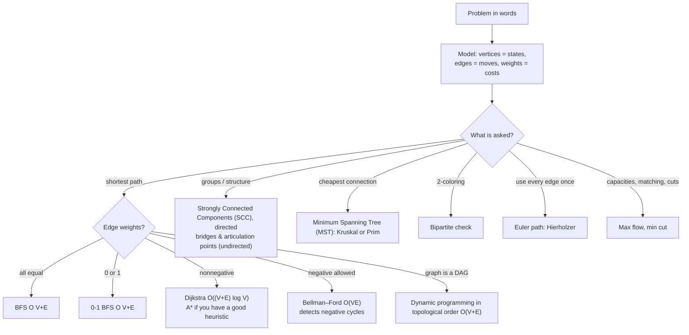
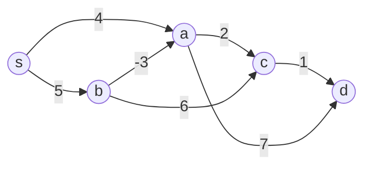
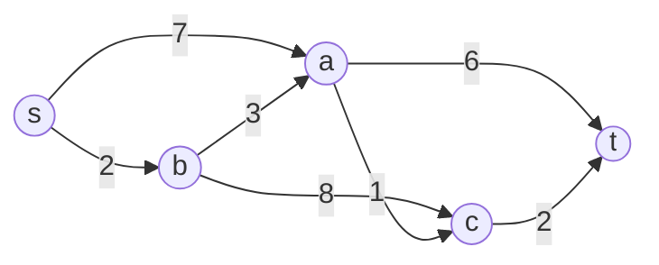
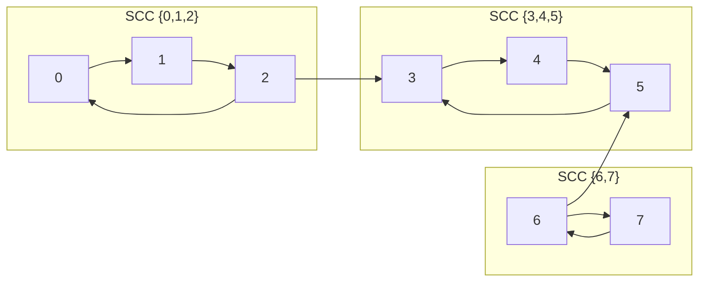
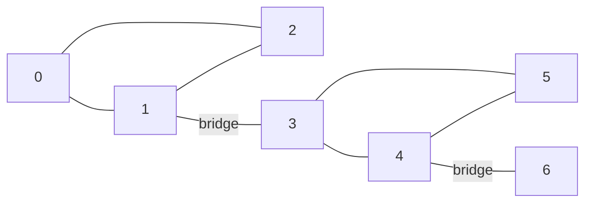
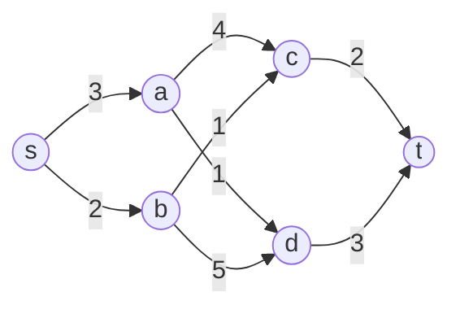
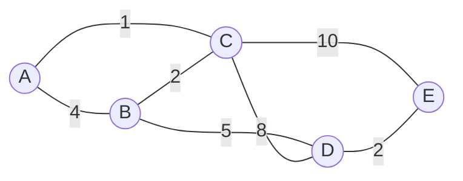
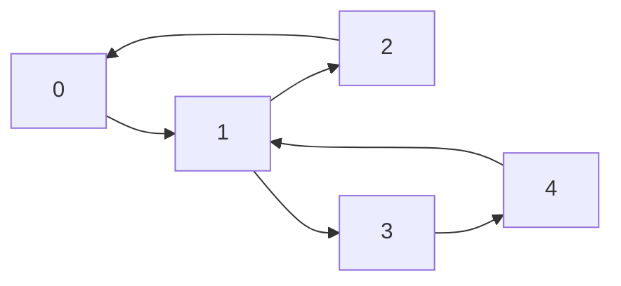
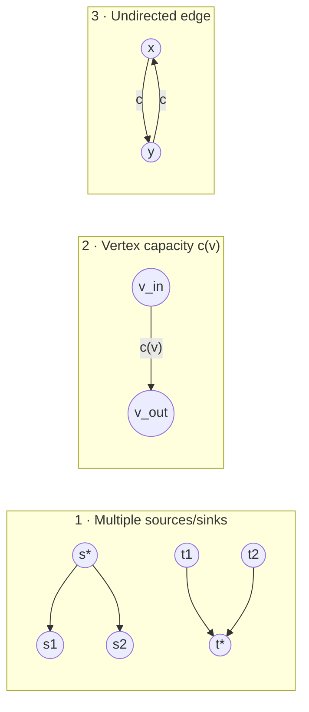

# Chapter 14 · Advanced Graph Algorithms (Beyond the Textbook)

> **Why this matters.** Levitin covers the graph classics: Depth-First Search (DFS) and Breadth-First Search (BFS) (Levitin §3.5), topological sorting (§4.2), Warshall and Floyd (§8.4), Prim, Kruskal and Dijkstra (§9.1–9.3), maximum flow and bipartite matching (§10.2–10.3). Professionals use those as parts. The real skill is **modeling**: seeing that a scheduling question is a longest path in a Directed Acyclic Graph (DAG), that "which projects should we fund?" is a minimum cut, or that a puzzle is BFS over states. This lesson adds the algorithms you need once a problem is a graph, and the proofs that tell you *when* each one is safe.

| 🎮 Simulations | 🏟️ Arena | 🐍 Code |
|---|---|---|
| [Shortest Paths+ (Bellman–Ford, A*)](https://normansrule.github.io/algorithm-forge/sims/shortest-paths-plus.html) · [Strongly Connected Components](https://normansrule.github.io/algorithm-forge/sims/scc.html) · also [graph-traversal](https://normansrule.github.io/algorithm-forge/sims/graph-traversal.html), [topo-sort](https://normansrule.github.io/algorithm-forge/sims/topo-sort.html), [greedy-graphs](https://normansrule.github.io/algorithm-forge/sims/greedy-graphs.html), [max-flow](https://normansrule.github.io/algorithm-forge/sims/max-flow.html) · [Shortest paths to the 2025 frontier](https://normansrule.github.io/algorithm-forge/sims/shortest-path-frontier.html) · [Max flow: Dinic & push–relabel](https://normansrule.github.io/algorithm-forge/sims/flow-modern.html) | [Chapter 14 problems](https://normansrule.github.io/algorithm-forge/arena/?chapter=14) | [`ch14_advanced_graphs.py`](../../src/python/algoforge/ch14_advanced_graphs.py) |

**Prerequisites:** [Lesson 3](../03-brute-force/README.md) (DFS/BFS), [Lesson 4](../04-decrease-and-conquer/README.md) (topological sort), [Lesson 9](../09-greedy/README.md) (Prim, Kruskal, Dijkstra), [Lesson 10](../10-iterative-improvement/README.md) (max flow), [Lesson 13](../13-advanced-data-structures/README.md) (union-find, heaps).

**Notation.** $V$ = number of vertices, $E$ = number of edges, $w(u,v)$ = weight of edge $(u,v)$, $\delta(s,v)$ = true shortest-path distance, $d[v]$ = the algorithm's current estimate. Adjacency lists are written `adj[u]`, a list of `(v, w)` pairs.

---

## The big idea in 60 seconds

Most graph problems are solved by answering three questions in order: **What are the vertices? What are the edges? What property of paths/cuts/orderings am I asking about?** Once modeled, the algorithm choice is almost a lookup table:



---

## Modeling skills: turning words into graphs

Before any algorithm, practice these five moves. Each appears again in the cards below.

| Move | Example | Graph |
|---|---|---|
| **States as vertices** | Word ladder `COLD → CORD → CARD → WARD → WARM` | vertex = word, edge = change one letter; BFS gives the fewest steps |
| **Layered (product) graph** | "Shortest route if you may use one free toll" | vertex = (city, coupons left); an edge either pays or spends the coupon; run Dijkstra on the bigger graph |
| **Reverse the edges** | "Shortest distance from every city **to** the hospital" | one Dijkstra from the hospital on the reversed graph, not $V$ runs |
| **Super source / super sink** | Several warehouses supply several stores | add a source $s^*$ with edges $s^* \to$ each warehouse (and stores $\to t^*$) |
| **Constraints as edges** | $x_j - x_i \le c$ (difference constraints in scheduling) | edge $i \to j$ with weight $c$; Bellman–Ford finds a solution or proves none (negative cycle) |

**Implicit graphs.** You rarely build the graph up front. A Rubik's-cube solver, a chess engine or a maze solver generates neighbors on the fly. Your algorithm only needs a function `neighbors(state)`.

**Weights need care.** Currency exchange rates multiply, but shortest paths add. Take $w = -\log(\text{rate})$: a product of rates $> 1$ becomes a sum $< 0$, so **an arbitrage opportunity is a negative cycle**.

---

## Build Card 1 · Bellman–Ford (negative edges, negative-cycle detection)

🎯 **Problem.** Single-source shortest paths when some weights are negative; report if a negative cycle is reachable (then "shortest" is undefined).

📖 **Story.** Rumors spread in rounds. After round $k$, everyone knows the best route that uses at most $k$ hops. A simple path has at most $V-1$ hops, so $V-1$ rounds are enough. If round $V$ still improves something, the rumors are circling a loop that keeps getting "cheaper": a negative cycle.

👀 **Picture.** Step through it in [shortest-paths-plus.html](https://normansrule.github.io/algorithm-forge/sims/shortest-paths-plus.html).



🧱 **Build it in blocks.**
1. `relax(u, v, w)`: if `d[u] + w < d[v]` then `d[v] ← d[u] + w`, `pred[v] ← u`.
2. Repeat $V-1$ times: relax **every** edge.
3. One more pass: if any edge still relaxes, a negative cycle is reachable.
4. Early exit: stop when a whole pass changes nothing.

✋ **Trace.** Edge order (deliberately unlucky): c→d, a→d, a→c, b→c, b→a, s→a, s→b.

| After pass | s | a | b | c | d |
|---|---|---|---|---|---|
| 0 (init) | 0 | ∞ | ∞ | ∞ | ∞ |
| 1 | 0 | 4 | 5 | ∞ | ∞ |
| 2 | 0 | **2** (via b) | 5 | 6 | 11 |
| 3 | 0 | 2 | 5 | **4** | 7 |
| 4 | 0 | 2 | 5 | 4 | **5** |

Pass 4 = $V-1$ still changed something (information travels one hop per pass here), so all 4 passes were needed. A 5th check pass finds nothing: no negative cycle. Now add edge **d→b with weight −3**: cycle b→a→c→d→b has weight $-3+2+1-3 = -3 < 0$, and the check pass keeps finding improvements (the distances fall by 3 every lap).

💻 **Forge Pseudocode**

```
ALGORITHM BellmanFord(n, edges[0..m-1], s)
    // edges[i] = (u, v, w); vertices are 0..n-1
    // Output: d[0..n-1], pred[0..n-1], and whether a negative cycle is reachable
    d ← array(n, ∞)
    pred ← array(n, null)
    d[s] ← 0
    for pass ← 1 to n - 1 do
        changed ← false
        for each (u, v, w) in edges do
            if d[u] + w < d[v] then
                d[v] ← d[u] + w
                pred[v] ← u
                changed ← true
        if not changed then
            return d, pred, false
    for each (u, v, w) in edges do
        if d[u] + w < d[v] then
            return d, pred, true
    return d, pred, false
```

<details><summary>Python</summary>

```python
INF = float("inf")

def bellman_ford(n, edges, s):
    """edges: list of (u, v, w). Returns (dist, pred, has_negative_cycle)."""
    d, pred = [INF] * n, [None] * n
    d[s] = 0
    for _ in range(n - 1):
        changed = False
        for u, v, w in edges:
            if d[u] + w < d[v]:
                d[v], pred[v], changed = d[u] + w, u, True
        if not changed:
            return d, pred, False
    neg = any(d[u] + w < d[v] for u, v, w in edges)
    return d, pred, neg

if __name__ == "__main__":
    S, A, B, C, D = range(5)
    edges = [(C, D, 1), (A, D, 7), (A, C, 2), (B, C, 6), (B, A, -3), (S, A, 4), (S, B, 5)]
    dist, pred, neg = bellman_ford(5, edges, S)
    assert dist == [0, 2, 5, 4, 5] and not neg
    _, _, neg = bellman_ford(5, edges + [(D, B, -3)], S)
    assert neg
    print("distances", dist, "| negative cycle detected after adding d->b (-3)")
```

</details>

<details><summary>Java</summary>

```java
import java.util.*;

class BellmanFord {
    static final long INF = Long.MAX_VALUE / 4;
    /** Returns null if a negative cycle is reachable from s. */
    static long[] run(int n, int[][] edges, int s) {
        long[] d = new long[n]; Arrays.fill(d, INF); d[s] = 0;
        for (int pass = 1; pass < n; pass++) {
            boolean changed = false;
            for (int[] e : edges)
                if (d[e[0]] < INF && d[e[0]] + e[2] < d[e[1]]) { d[e[1]] = d[e[0]] + e[2]; changed = true; }
            if (!changed) return d;
        }
        for (int[] e : edges) if (d[e[0]] < INF && d[e[0]] + e[2] < d[e[1]]) return null;
        return d;
    }
    public static void main(String[] args) {
        int[][] edges = {{3,4,1},{1,4,7},{1,3,2},{2,3,6},{2,1,-3},{0,1,4},{0,2,5}};
        System.out.println(Arrays.toString(run(5, edges, 0))); // [0, 2, 5, 4, 5]
    }
}
```

</details>

🧮 **Analysis.** $O(VE)$ time, $O(V)$ space. **Correctness:** by induction, after pass $k$, $d[v] \le$ the length of the shortest path to $v$ with at most $k$ edges. Without negative cycles a shortest path is simple (at most $V-1$ edges), so after $V-1$ passes $d = \delta$. If $d$ can still decrease, some shortest walk needs $\ge V$ edges, so it repeats a vertex and contains a negative cycle.

⚠️ **Pitfalls.** Adding to `∞` in languages with fixed-width integers (`Long.MAX_VALUE + w` overflows; guard with `d[u] < INF`). Reporting "negative cycle" for one that is **not reachable** from $s$ (standard Bellman–Ford ignores those, which is usually what you want). To find the cycle itself, take the vertex relaxed in the check pass, follow `pred` $V$ times to land inside the cycle, then walk around it.

🔁 **Where it's used.** Distance-vector routing (the Routing Information Protocol (RIP) is a distributed Bellman–Ford); currency-arbitrage detection with $-\log$ rates; solving difference constraints in schedulers and timing analysis; Johnson's all-pairs algorithm uses one Bellman–Ford to reweight edges so Dijkstra can run from every vertex.

---

## Build Card 2 · Dijkstra with a heap (and why it is correct)

🎯 **Problem.** Single-source shortest paths with **nonnegative** weights, fast. Levitin presents the algorithm (Levitin §9.3); here we make it production-grade and prove it.

📖 **Story.** Pour water at $s$. It reaches places in order of distance. The first time water reaches a vertex, that arrival time is final: nothing that arrives later can come back "earlier", because pipes never have negative length.

👀 **Picture.**



🧱 **Build it in blocks.**
1. `d[s] ← 0`, push `(0, s)` into a min-heap.
2. Pop the smallest `(du, u)`. If `du > d[u]`, it is a **stale** entry: skip it (this is *lazy deletion*, replacing decrease-key).
3. Relax each edge `(u, v, w)`; on improvement push `(d[v], v)`.
4. Stop when the heap is empty, or as soon as the target is popped.

✋ **Trace.**

| Pop | d[s] | d[a] | d[b] | d[c] | d[t] | Heap after relaxing |
|---|---|---|---|---|---|---|
| — | 0 | ∞ | ∞ | ∞ | ∞ | (0,s) |
| s (0) | **0** | 7 | 2 | ∞ | ∞ | (2,b) (7,a) |
| b (2) | | 5 | **2** | 10 | | (5,a) (7,a) (10,c) |
| a (5) | | **5** | | 6 | 11 | (6,c) (7,a) (10,c) (11,t) |
| c (6) | | | | **6** | 8 | (7,a) (8,t) (10,c) (11,t) |
| (7,a) | stale, skipped | | | | | (8,t) (10,c) (11,t) |
| t (8) | | | | | **8** | stale entries skipped |

Shortest path to $t$: s → b → a → c → t, length $2+3+1+2 = 8$.

**Why negative edges break it.** With $s \to a$ (2), $s \to b$ (5), $b \to a$ (−4), Dijkstra finalizes $a$ at 2, but the true distance is $5 - 4 = 1$. (If you run the lazy-deletion version below on this example, it prints 1: it re-pushes $a$ and processes it again. That repair is not free: with negative edges a vertex can be re-processed exponentially many times, and the proof below no longer applies.)

🧮 **Correctness proof (the invariant).** Let $S$ be the set of popped (finalized) vertices. **Claim:** when $u$ is popped, $d[u] = \delta(s,u)$.

Suppose not, and let $u$ be the first vertex popped with $d[u] > \delta(s,u)$. Take a true shortest path $P$ from $s$ to $u$. It starts inside $S$ and ends outside, so it has a first edge $(x, y)$ with $x \in S$, $y \notin S$. Since $x$ was finalized correctly and edge $(x,y)$ was relaxed when $x$ was popped, $d[y] \le \delta(s,x) + w(x,y) = \delta(s,y)$. Because all weights are $\ge 0$, the rest of $P$ does not decrease length: $\delta(s,y) \le \delta(s,u)$. So $d[y] \le \delta(s,u) < d[u]$, meaning the heap held $y$ with a smaller key than $u$, and it would have popped $y$ first. Contradiction. ∎

The proof uses non-negativity in exactly one place ("the rest of $P$ does not decrease length"), which is why one negative edge breaks it.

💻 **Forge Pseudocode**

```
ALGORITHM Dijkstra(adj[0..n-1], s)
    // adj[u] is a list of (v, w) with w ≥ 0; H is a min-heap of (distance, vertex) pairs
    d ← array(n, ∞)
    d[s] ← 0
    H ← priorityQueue()
    insert(H, (0, s), 0)                // item (0, s) with priority 0
    while not isEmpty(H) do
        (du, u) ← deleteMin(H)
        if du = d[u] then               // otherwise a stale entry: skip it
            for each (v, w) in adj[u] do
                if du + w < d[v] then
                    d[v] ← du + w
                    insert(H, (d[v], v), d[v])
    return d
```

<details><summary>Python</summary>

```python
import heapq

def dijkstra(adj, s):
    """adj: dict u -> list of (v, w), w >= 0. Returns dict of distances and predecessors."""
    d, pred = {s: 0}, {s: None}
    heap = [(0, s)]
    while heap:
        du, u = heapq.heappop(heap)
        if du > d[u]:
            continue                      # lazy deletion of stale entries
        for v, w in adj.get(u, ()):
            nd = du + w
            if nd < d.get(v, float("inf")):
                d[v], pred[v] = nd, u
                heapq.heappush(heap, (nd, v))
    return d, pred

def path_to(pred, t):
    out = []
    while t is not None:
        out.append(t); t = pred[t]
    return out[::-1]

if __name__ == "__main__":
    adj = {"s": [("a", 7), ("b", 2)], "b": [("a", 3), ("c", 8)],
           "a": [("c", 1), ("t", 6)], "c": [("t", 2)]}
    d, pred = dijkstra(adj, "s")
    assert d == {"s": 0, "a": 5, "b": 2, "c": 6, "t": 8}
    assert path_to(pred, "t") == ["s", "b", "a", "c", "t"]
    print(d, path_to(pred, "t"))
```

</details>

<details><summary>Java</summary>

```java
import java.util.*;

class Dijkstra {
    static long[] run(List<List<int[]>> adj, int s) {
        long[] d = new long[adj.size()]; Arrays.fill(d, Long.MAX_VALUE); d[s] = 0;
        PriorityQueue<long[]> pq = new PriorityQueue<>(Comparator.comparingLong(x -> x[0]));
        pq.add(new long[]{0, s});
        while (!pq.isEmpty()) {
            long[] top = pq.poll(); int u = (int) top[1];
            if (top[0] > d[u]) continue;                       // stale
            for (int[] e : adj.get(u))
                if (d[u] + e[1] < d[e[0]]) { d[e[0]] = d[u] + e[1]; pq.add(new long[]{d[e[0]], e[0]}); }
        }
        return d;
    }
    public static void main(String[] args) {
        int n = 5; // s=0 a=1 b=2 c=3 t=4
        List<List<int[]>> adj = new ArrayList<>();
        for (int i = 0; i < n; i++) adj.add(new ArrayList<>());
        int[][] es = {{0,1,7},{0,2,2},{2,1,3},{2,3,8},{1,3,1},{1,4,6},{3,4,2}};
        for (int[] e : es) adj.get(e[0]).add(new int[]{e[1], e[2]});
        System.out.println(Arrays.toString(run(adj, 0))); // [0, 5, 2, 6, 8]
    }
}
```

</details>

🧮 **Analysis.** Each edge pushes at most once, so the heap holds $O(E)$ entries: $O((V+E)\log V)$ time (note $\log E \le 2\log V$). With a Fibonacci heap, $O(E + V\log V)$ ([Lesson 13](../13-advanced-data-structures/README.md#build-card-8--heap-variants-d-ary-pairing-fibonacci)). For dense graphs ($E \approx V^2$), Levitin's array version at $O(V^2)$ is actually optimal.

⚠️ **Pitfalls.** Negative edges (use Bellman–Ford or Johnson's reweighting). Marking a vertex "done" when it is **pushed** instead of when it is **popped**. Forgetting the stale check (still correct, but slower). Integer overflow of `∞ + w`.

🔁 **Where it's used.** Link-state routing protocols Open Shortest Path First (OSPF) and Intermediate System to Intermediate System (IS-IS) run Dijkstra on each router; map and navigation engines (usually with preprocessing such as contraction hierarchies on top); network-latency-aware load balancers.

---

## Build Card 3 · A* search with admissible heuristics

🎯 **Problem.** Shortest path from $s$ to **one** target $t$, exploring as little as possible, when you can estimate the remaining distance (for example straight-line or Manhattan distance on a map or grid).

📖 **Story.** Dijkstra explores in growing circles around $s$. A* explores an ellipse stretched toward the goal, because it ranks each vertex by "cost so far + optimistic guess of cost to go".

👀 **Picture.** On a 7×10 grid with a short wall (`#`), both find the optimal 13-step path. `*` = expanded cells.

```
Dijkstra: 67 expansions          A* (Manhattan): 21 expansions
**********                        ..........
**********                        ...*******
****#*****                        ****#....*
S***#****G                        S***#....G
****#*****                        ****#.....
**********                        ..........
**********                        ..........
```

Compare them side by side in [shortest-paths-plus.html](https://normansrule.github.io/algorithm-forge/sims/shortest-paths-plus.html).

🧱 **Build it in blocks.**
1. $g(v)$ = best known cost from $s$; $h(v)$ = heuristic estimate of cost from $v$ to $t$; $f(v) = g(v) + h(v)$.
2. It's Dijkstra with the heap keyed by $f$ instead of $g$.
3. **Admissible:** $h(v) \le \delta(v, t)$ for all $v$ (never overestimates) → the first time $t$ is popped, its $g$ is optimal.
4. **Consistent (monotone):** $h(u) \le w(u,v) + h(v)$ for every edge → no vertex ever needs to be re-expanded, and A* is exactly Dijkstra on the reweighted edges $w'(u,v) = w(u,v) - h(u) + h(v) \ge 0$.
5. Tie-break equal $f$ toward larger $g$ (deeper nodes), which avoids expanding whole plateaus.

✋ **Trace (first steps).** Start S = (3,0), goal G = (3,9), $h$ = Manhattan distance. $f(S) = 0 + 9 = 9$. Its neighbors (2,0), (4,0), (3,1) get $g = 1$ and $h = 10, 10, 8$, so $f = 11, 11, 9$: A* pops (3,1) next, heading straight at the goal, and keeps popping $f = 9$ cells until (3,3) hits the wall. Every way around the wall costs 4 extra steps, so the remaining cells have $f = 11$ or $13$. A* never expands a cell with $f$ above the optimal cost 13, and the deeper-first tie-break means it commits to one detour instead of expanding every $f = 13$ cell. Dijkstra, blind to the goal, expands every cell within distance 13 of S.

💻 **Forge Pseudocode**

```
ALGORITHM AStar(adj[0..n-1], h[0..n-1], s, t)
    // adj[u] is a list of (v, w); h[v] is an admissible estimate of the cost from v to t
    g ← array(n, ∞)                       // best known cost from s
    g[s] ← 0
    H ← priorityQueue()                   // (f, vertex) pairs keyed by f = g + h
    insert(H, (h[s], s), h[s])
    while not isEmpty(H) do
        (f, u) ← deleteMin(H)
        if f = g[u] + h[u] then           // otherwise the entry is stale: skip it
            if u = t then
                return g[t]
            for each (v, w) in adj[u] do
                if g[u] + w < g[v] then
                    g[v] ← g[u] + w
                    insert(H, (g[v] + h[v], v), g[v] + h[v])
    return ∞
```

To run it on a grid, number the cells, list each cell's open neighbours (weight 1) in `adj`, and fill `h` with each
cell's Manhattan distance to the goal. (The Python version below also breaks ties toward larger $g$; the Forge
priority queue breaks ties first-in, first-out.)

<details><summary>Python</summary>

```python
import heapq

def astar(grid, start, goal, use_heuristic=True):
    """4-neighbour grid, '#' = wall. Returns (path_length, expansions)."""
    R, C = len(grid), len(grid[0])
    def h(v):
        return abs(v[0] - goal[0]) + abs(v[1] - goal[1]) if use_heuristic else 0
    g = {start: 0}
    heap = [(h(start), 0, start)]                 # (f, -g, cell): ties go to deeper nodes
    expanded = 0
    while heap:
        f, neg_g, u = heapq.heappop(heap)
        if -neg_g > g[u]:
            continue
        expanded += 1
        if u == goal:
            return g[u], expanded
        r, c = u
        for v in ((r + 1, c), (r - 1, c), (r, c + 1), (r, c - 1)):
            if 0 <= v[0] < R and 0 <= v[1] < C and grid[v[0]][v[1]] != "#":
                if g[u] + 1 < g.get(v, float("inf")):
                    g[v] = g[u] + 1
                    heapq.heappush(heap, (g[v] + h(v), -g[v], v))
    return None, expanded

if __name__ == "__main__":
    grid = ["..........",
            "..........",
            "....#.....",
            "S...#....G",
            "....#.....",
            "..........",
            ".........."]
    assert astar(grid, (3, 0), (3, 9), False) == (13, 67)   # Dijkstra
    assert astar(grid, (3, 0), (3, 9), True) == (13, 21)    # A*
    print("Dijkstra: 67 expansions, A*: 21 expansions, both length 13")
```

</details>

<details><summary>Java</summary>

```java
import java.util.*;

class AStarGrid {
    static int[] run(String[] grid, int sr, int sc, int gr, int gc, boolean useH) {
        int R = grid.length, C = grid[0].length();
        int[][] g = new int[R][C]; for (int[] row : g) Arrays.fill(row, Integer.MAX_VALUE);
        g[sr][sc] = 0;
        // entries: {f, -g, r, c}
        PriorityQueue<int[]> pq = new PriorityQueue<>((x, y) -> x[0] != y[0] ? x[0] - y[0] : x[1] - y[1]);
        int h0 = useH ? Math.abs(sr - gr) + Math.abs(sc - gc) : 0;
        pq.add(new int[]{h0, 0, sr, sc});
        int expanded = 0; int[][] dirs = {{1,0},{-1,0},{0,1},{0,-1}};
        while (!pq.isEmpty()) {
            int[] e = pq.poll(); int r = e[2], c = e[3];
            if (-e[1] > g[r][c]) continue;
            expanded++;
            if (r == gr && c == gc) return new int[]{g[r][c], expanded};
            for (int[] d : dirs) {
                int nr = r + d[0], nc = c + d[1];
                if (nr < 0 || nc < 0 || nr >= R || nc >= C || grid[nr].charAt(nc) == '#') continue;
                if (g[r][c] + 1 < g[nr][nc]) {
                    g[nr][nc] = g[r][c] + 1;
                    int h = useH ? Math.abs(nr - gr) + Math.abs(nc - gc) : 0;
                    pq.add(new int[]{g[nr][nc] + h, -g[nr][nc], nr, nc});
                }
            }
        }
        return new int[]{-1, expanded};
    }
    public static void main(String[] args) {
        String[] grid = {"..........", "..........", "....#.....", "S...#....G", "....#.....", "..........", ".........."};
        System.out.println(Arrays.toString(run(grid, 3, 0, 3, 9, false)) + " " + Arrays.toString(run(grid, 3, 0, 3, 9, true)));
        // [13, 67] [13, 21]
    }
}
```

</details>

🧮 **Analysis.** Worst case equals Dijkstra ($h \equiv 0$ *is* Dijkstra). With a perfect heuristic ($h = \delta(\cdot, t)$) A* expands only vertices on a shortest path. Between those extremes, a larger consistent $h$ never expands more vertices, apart from ties. **Proof sketch of optimality:** while $t$ is not yet popped with its optimal cost, some vertex $y$ on an optimal path sits in the heap with $f(y) = g(y) + h(y) \le \delta(s,y) + \delta(y,t) = \delta(s,t)$, so $t$ cannot be popped with a worse cost first.

⚠️ **Pitfalls.** An inadmissible heuristic (e.g. Euclidean distance times 2) returns fast but possibly **non-optimal** paths; that is sometimes a deliberate trade ("weighted A*"). Using Manhattan distance when diagonal moves are allowed (it overestimates, so it's inadmissible). Memory: A* stores every generated state; for huge state spaces use Iterative Deepening A* (IDA*).

🔁 **Where it's used.** Pathfinding in games (unit movement on tile maps and navigation meshes), robot motion planning, puzzle solvers (15-puzzle with Manhattan or pattern-database heuristics), route planners (landmark-based heuristics).

---

## Build Card 4 · 0-1 BFS

🎯 **Problem.** Shortest paths when every weight is 0 or 1, in $O(V+E)$ (no heap).

📖 **Story.** A deque is a two-door waiting room. Free moves (weight 0) jump to the **front** door, paid moves (weight 1) join at the **back**. The room is always sorted by distance, with at most two distinct distances inside.

👀 **Picture.** Classic modeling trick, "minimum edge reversals": you may walk a directed edge forward for free or backward for cost 1 (you reverse it).

```
edges: 0→1, 2→1, 2→3, 3→4        model: forward u→v weight 0, backward v→u weight 1
path 0 → 1 ⇢ 2 → 3 → 4  (⇢ = reversed 2→1)       answer: 1 reversal
```

🧱 **Build it in blocks.** Replace Dijkstra's heap with a deque: pop from the front; relax weight-0 edges with `pushFront`, weight-1 edges with `pushBack`. A vertex may be pushed twice; skip it if already finalized.

✋ **Trace.** Start deque `[0]`, d = `[0, ∞, ∞, ∞, ∞]`. Pop 0: edge 0→1 (w 0) → d[1]=0, push front. Pop 1: backward edge 1⇢0 would give 1 (not better); backward 1⇢2 (w 1) → d[2]=1, push back. Pop 2: 2→1 (w 0, no gain), 2→3 (w 0) → d[3]=1, push front. Pop 3: 3→4 (w 0) → d[4]=1. Answer d[4] = **1**.

💻 **Forge Pseudocode**

```
ALGORITHM ZeroOneBFS(adj[0..n-1], s)
    // adj[u] is a list of (v, w) with w in {0, 1}
    // The deque is built from two halves: the stack F (its top is the front) followed by the queue B
    d ← array(n, ∞)
    d[s] ← 0
    F ← stack()
    B ← queue()
    push(F, s)                                // pushFront
    while not isEmpty(F) or not isEmpty(B) do
        if not isEmpty(F) then                // popFront
            u ← pop(F)
        else
            u ← dequeue(B)
        for each (v, w) in adj[u] do
            if d[u] + w < d[v] then
                d[v] ← d[u] + w
                if w = 0 then
                    push(F, v)                // pushFront
                else
                    enqueue(B, v)             // pushBack
    return d
```

<details><summary>Python</summary>

```python
from collections import deque

def zero_one_bfs(n, adj, s):
    d = [float("inf")] * n
    d[s] = 0
    dq = deque([s])
    while dq:
        u = dq.popleft()
        for v, w in adj[u]:
            if d[u] + w < d[v]:
                d[v] = d[u] + w
                (dq.appendleft if w == 0 else dq.append)(v)
    return d

def min_reversals(n, directed_edges, s, t):
    adj = [[] for _ in range(n)]
    for u, v in directed_edges:
        adj[u].append((v, 0))     # walk it as given: free
        adj[v].append((u, 1))     # walk it backwards: reverse it, cost 1
    return zero_one_bfs(n, adj, s)[t]

if __name__ == "__main__":
    assert min_reversals(5, [(0, 1), (2, 1), (2, 3), (3, 4)], 0, 4) == 1
    print("minimum reversals from 0 to 4 = 1")
```

</details>

<details><summary>Java</summary>

```java
import java.util.*;

class ZeroOneBFS {
    static int[] run(List<List<int[]>> adj, int s) {
        int[] d = new int[adj.size()]; Arrays.fill(d, Integer.MAX_VALUE); d[s] = 0;
        Deque<Integer> dq = new ArrayDeque<>(); dq.add(s);
        while (!dq.isEmpty()) {
            int u = dq.pollFirst();
            for (int[] e : adj.get(u))
                if (d[u] + e[1] < d[e[0]]) {
                    d[e[0]] = d[u] + e[1];
                    if (e[1] == 0) dq.addFirst(e[0]); else dq.addLast(e[0]);
                }
        }
        return d;
    }
    public static void main(String[] args) {
        List<List<int[]>> adj = new ArrayList<>();
        for (int i = 0; i < 5; i++) adj.add(new ArrayList<>());
        int[][] es = {{0,1},{2,1},{2,3},{3,4}};
        for (int[] e : es) { adj.get(e[0]).add(new int[]{e[1], 0}); adj.get(e[1]).add(new int[]{e[0], 1}); }
        System.out.println(run(adj, 0)[4]); // 1
    }
}
```

</details>

🧮 **Analysis.** Each vertex's distance is set at most twice (once to $k+1$, once to $k$), so $O(V+E)$. Correctness: the deque always holds vertices with distances $k$ (front part) and $k+1$ (back part), mimicking Dijkstra's heap order.

⚠️ **Pitfalls.** Using it with weights other than 0/1 (generalization: "Dial's algorithm" with buckets for small integer weights). Plain BFS on a 0/1 graph is **wrong**: it counts edges, not cost.

🔁 **Where it's used.** Grid puzzles where some moves are free (following conveyor belts, doors already open), minimum "number of walls to break", minimum edge reversals, and layered-graph problems in routing.

---

## Build Card 5 · Strongly Connected Components (SCC): Kosaraju and Tarjan

🎯 **Problem.** In a directed graph, group vertices so that within a group every vertex reaches every other. Collapsing each group to one vertex yields a DAG (the **condensation**).

📖 **Story.** Cities with one-way streets. A "neighborhood" is a set where you can drive from any place to any other and back. Between neighborhoods, traffic flows one way only.

👀 **Picture.** Watch both algorithms in [scc.html](https://normansrule.github.io/algorithm-forge/sims/scc.html).



🧱 **Build it in blocks.**

**Kosaraju (two DFS passes).**
1. DFS the graph; record vertices in order of **finish** time.
2. Reverse all edges.
3. Take vertices in **decreasing finish time**; each DFS on the reversed graph from an unvisited vertex collects exactly one SCC.

Why: the vertex that finishes last lies in a "source" SCC of the condensation. In the reversed graph that SCC becomes a sink, so a DFS from it cannot leak into other components.

**Tarjan (one DFS pass).**
1. Give each vertex a discovery index `idx[v]` and a **low-link** `low[v]` = smallest index reachable from $v$'s DFS subtree using at most one edge back to a vertex still on the stack.
2. Push vertices on a stack when discovered.
3. After exploring $v$: if `low[v] = idx[v]`, $v$ is the root of an SCC; pop the stack down to $v$.

✋ **Trace.** Edges 0→1, 1→2, 2→0, 2→3, 3→4, 4→5, 5→3, 6→5, 6→7, 7→6; start DFS at 0, neighbors in listed order.

- **Kosaraju.** Finish order: 5, 4, 3, 2, 1, 0, 7, 6. Reverse-graph DFS in order 6, 7, 0, 1, 2, 3, 4, 5 gives {6,7}, then {0,1,2}, then {3,4,5}.
- **Tarjan.**

| v | 0 | 1 | 2 | 3 | 4 | 5 | 6 | 7 |
|---|---|---|---|---|---|---|---|---|
| idx | 0 | 1 | 2 | 3 | 4 | 5 | 6 | 7 |
| low | 0 | 0 | 0 | 3 | 3 | 3 | 6 | 6 |

Roots (low = idx): 3, then 0, then 6. Output order {3,4,5}, {0,1,2}, {6,7}: Tarjan emits SCCs in **reverse topological order** of the condensation.

💻 **Forge Pseudocode (Tarjan)**

```
ALGORITHM TarjanSCC(adj[0..n-1])
    // idx, low, onStack, S, counter, comps are shared (global) with Visit
    idx ← array(n, -1)
    low ← array(n, 0)
    onStack ← array(n, false)
    S ← stack()
    counter ← 0
    comps ← []
    for v ← 0 to n - 1 do
        if idx[v] = -1 then
            Visit(v)
    return comps

ALGORITHM Visit(v)
    idx[v] ← counter
    low[v] ← counter
    counter ← counter + 1
    push(S, v)
    onStack[v] ← true
    for each w in adj[v] do
        if idx[w] = -1 then
            Visit(w)
            low[v] ← min(low[v], low[w])
        else if onStack[w] then
            low[v] ← min(low[v], idx[w])
    if low[v] = idx[v] then
        C ← []
        repeat
            w ← pop(S)
            onStack[w] ← false
            append(C, w)
        until w = v
        append(comps, C)
```

<details><summary>Python (both algorithms)</summary>

```python
import sys
sys.setrecursionlimit(10_000)

def kosaraju(n, adj):
    radj = [[] for _ in range(n)]
    for u in range(n):
        for v in adj[u]:
            radj[v].append(u)
    seen, order = [False] * n, []
    def dfs1(u):
        seen[u] = True
        for v in adj[u]:
            if not seen[v]: dfs1(v)
        order.append(u)
    for u in range(n):
        if not seen[u]: dfs1(u)
    comp = [-1] * n
    comps = []
    def dfs2(u, c):
        comp[u] = c; comps[c].append(u)
        for v in radj[u]:
            if comp[v] == -1: dfs2(v, c)
    for u in reversed(order):
        if comp[u] == -1:
            comps.append([]); dfs2(u, len(comps) - 1)
    return [sorted(c) for c in comps]

def tarjan(n, adj):
    idx, low, on = [-1] * n, [0] * n, [False] * n
    stack, comps, counter = [], [], [0]
    def visit(v):
        idx[v] = low[v] = counter[0]; counter[0] += 1
        stack.append(v); on[v] = True
        for w in adj[v]:
            if idx[w] == -1:
                visit(w); low[v] = min(low[v], low[w])
            elif on[w]:
                low[v] = min(low[v], idx[w])
        if low[v] == idx[v]:
            c = []
            while True:
                w = stack.pop(); on[w] = False; c.append(w)
                if w == v: break
            comps.append(sorted(c))
    for v in range(n):
        if idx[v] == -1: visit(v)
    return comps, low

if __name__ == "__main__":
    edges = [(0, 1), (1, 2), (2, 0), (2, 3), (3, 4), (4, 5), (5, 3), (6, 5), (6, 7), (7, 6)]
    adj = [[] for _ in range(8)]
    for u, v in edges: adj[u].append(v)
    assert kosaraju(8, adj) == [[6, 7], [0, 1, 2], [3, 4, 5]]
    comps, low = tarjan(8, adj)
    assert comps == [[3, 4, 5], [0, 1, 2], [6, 7]] and low == [0, 0, 0, 3, 3, 3, 6, 6]
    print("Kosaraju:", kosaraju(8, adj), "Tarjan:", comps)
```

</details>

<details><summary>Java (Tarjan)</summary>

```java
import java.util.*;

class TarjanSCC {
    int[] idx, low; boolean[] on; Deque<Integer> st = new ArrayDeque<>();
    int counter = 0; List<List<Integer>> comps = new ArrayList<>(); List<List<Integer>> adj;
    TarjanSCC(List<List<Integer>> adj) {
        this.adj = adj; int n = adj.size();
        idx = new int[n]; low = new int[n]; on = new boolean[n]; Arrays.fill(idx, -1);
        for (int v = 0; v < n; v++) if (idx[v] == -1) visit(v);
    }
    void visit(int v) {
        idx[v] = low[v] = counter++; st.push(v); on[v] = true;
        for (int w : adj.get(v)) {
            if (idx[w] == -1) { visit(w); low[v] = Math.min(low[v], low[w]); }
            else if (on[w]) low[v] = Math.min(low[v], idx[w]);
        }
        if (low[v] == idx[v]) {
            List<Integer> c = new ArrayList<>(); int w;
            do { w = st.pop(); on[w] = false; c.add(w); } while (w != v);
            Collections.sort(c); comps.add(c);
        }
    }
    public static void main(String[] args) {
        List<List<Integer>> adj = new ArrayList<>();
        for (int i = 0; i < 8; i++) adj.add(new ArrayList<>());
        int[][] es = {{0,1},{1,2},{2,0},{2,3},{3,4},{4,5},{5,3},{6,5},{6,7},{7,6}};
        for (int[] e : es) adj.get(e[0]).add(e[1]);
        System.out.println(new TarjanSCC(adj).comps); // [[3, 4, 5], [0, 1, 2], [6, 7]]
    }
}
```

</details>

🧮 **Analysis.** Both are $O(V+E)$. Kosaraju is easier to explain and prove; Tarjan does one pass and needs no reversed copy of the graph. For graphs with millions of vertices, write the DFS iteratively (explicit stack) to avoid stack overflow.

⚠️ **Pitfalls.** In Tarjan, using `low[w]` instead of `idx[w]` for the back-edge case works for SCCs but is wrong for bridges/articulation points; keep the textbook form. Forgetting the `onStack` check (edges into already-finished SCCs must be ignored).

🔁 **Where it's used.** 2-Satisfiability (2-SAT) solvers (a formula is unsatisfiable exactly when some $x$ and $\lnot x$ share an SCC); detecting circular dependencies in package managers, build systems and module imports; compilers' call-graph analysis (mutually recursive functions); web-graph analysis ("bow-tie" structure of the web).

---

## Build Card 6 · Bridges and articulation points (low-link)

🎯 **Problem.** In an undirected network, find the **bridges** (edges whose removal disconnects the graph) and **articulation points** (vertices whose removal disconnects it): the single points of failure.

📖 **Story.** In a DFS tree, a subtree is "trapped" if nothing inside it has a back edge that climbs above its parent. Then the tree edge to that subtree is the only way out.

👀 **Picture.**



🧱 **Build it in blocks.**
1. DFS assigns discovery time `disc[v]`.
2. `low[v]` = min of `disc[v]`, `disc` of any vertex reached by a back edge from $v$'s subtree.
3. Tree edge $(u, v)$ is a **bridge** iff `low[v] > disc[u]` (the subtree of $v$ cannot reach $u$ or above).
4. Non-root $u$ is an **articulation point** iff some child $v$ has `low[v] ≥ disc[u]`. The DFS root is one iff it has ≥ 2 tree children.

✋ **Trace.** Edges 0-1, 1-2, 2-0, 1-3, 3-4, 4-5, 5-3, 4-6; DFS from 0.

| v | 0 | 1 | 2 | 3 | 4 | 5 | 6 |
|---|---|---|---|---|---|---|---|
| disc | 0 | 1 | 2 | 3 | 4 | 5 | 6 |
| low | 0 | 0 | 0 | 3 | 3 | 3 | 6 |

- Edge 1-3: `low[3] = 3 > disc[1] = 1` → **bridge**. Edge 4-6: `low[6] = 6 > 4` → **bridge**. Edge 3-4: `low[4] = 3`, not $> 3$ → not a bridge (cycle 3-4-5).
- Articulation points: 1 (child 3 has `low 3 ≥ 1`), 3 (child 4 has `low 3 ≥ 3`), 4 (child 6 has `low 6 ≥ 4`). Root 0 has one tree child → not an articulation point. Answer **{1, 3, 4}**.

💻 **Forge Pseudocode**

```
ALGORITHM BridgesAndCuts(adj[0..n-1])
    // Sets up the shared state and runs BridgeDFS from every unvisited vertex
    disc ← array(n, -1)
    low ← array(n, 0)
    isCut ← array(n, false)
    bridges ← []
    time ← 0
    for u ← 0 to n - 1 do
        if disc[u] = -1 then
            BridgeDFS(u, null)
    return (bridges, isCut)

ALGORITHM BridgeDFS(u, parent)
    // disc (all -1 at start), low, isCut, bridges and the counter time are shared with BridgesAndCuts
    // adj is undirected; with parallel edges, skip the parent EDGE instead of the parent vertex
    disc[u] ← time
    low[u] ← time
    time ← time + 1
    children ← 0
    for each v in adj[u] do
        if v ≠ parent then
            if disc[v] ≠ -1 then
                low[u] ← min(low[u], disc[v])          // back edge
            else
                children ← children + 1
                BridgeDFS(v, u)
                low[u] ← min(low[u], low[v])
                if low[v] > disc[u] then
                    append(bridges, (u, v))
                if parent ≠ null and low[v] ≥ disc[u] then
                    isCut[u] ← true
    if parent = null and children > 1 then
        isCut[u] ← true
```

<details><summary>Python</summary>

```python
def bridges_and_cuts(n, edges):
    adj = [[] for _ in range(n)]
    for i, (u, v) in enumerate(edges):
        adj[u].append((v, i)); adj[v].append((u, i))
    disc, low = [-1] * n, [0] * n
    bridges, cuts, time = [], set(), [0]
    def dfs(u, parent_edge):
        disc[u] = low[u] = time[0]; time[0] += 1
        children = 0
        for v, eid in adj[u]:
            if eid == parent_edge:          # skip the edge we came in on (handles parallel edges)
                continue
            if disc[v] != -1:
                low[u] = min(low[u], disc[v])
            else:
                children += 1
                dfs(v, eid)
                low[u] = min(low[u], low[v])
                if low[v] > disc[u]:
                    bridges.append((u, v))
                if parent_edge is not None and low[v] >= disc[u]:
                    cuts.add(u)
        if parent_edge is None and children > 1:
            cuts.add(u)
    for s in range(n):
        if disc[s] == -1:
            dfs(s, None)
    return bridges, sorted(cuts), low

if __name__ == "__main__":
    E = [(0, 1), (1, 2), (2, 0), (1, 3), (3, 4), (4, 5), (5, 3), (4, 6)]
    br, cuts, low = bridges_and_cuts(7, E)
    assert sorted(br) == [(1, 3), (4, 6)] and cuts == [1, 3, 4] and low == [0, 0, 0, 3, 3, 3, 6]
    print("bridges", sorted(br), "articulation points", cuts)
```

</details>

<details><summary>Java</summary>

```java
import java.util.*;

class Bridges {
    List<List<int[]>> adj = new ArrayList<>(); int[] disc, low; int time = 0;
    List<int[]> bridges = new ArrayList<>(); TreeSet<Integer> cuts = new TreeSet<>();
    Bridges(int n, int[][] edges) {
        for (int i = 0; i < n; i++) adj.add(new ArrayList<>());
        for (int i = 0; i < edges.length; i++) {
            adj.get(edges[i][0]).add(new int[]{edges[i][1], i});
            adj.get(edges[i][1]).add(new int[]{edges[i][0], i});
        }
        disc = new int[n]; low = new int[n]; Arrays.fill(disc, -1);
        for (int s = 0; s < n; s++) if (disc[s] == -1) dfs(s, -1);
    }
    void dfs(int u, int parentEdge) {
        disc[u] = low[u] = time++; int children = 0;
        for (int[] e : adj.get(u)) {
            int v = e[0];
            if (e[1] == parentEdge) continue;
            if (disc[v] != -1) low[u] = Math.min(low[u], disc[v]);
            else {
                children++; dfs(v, e[1]); low[u] = Math.min(low[u], low[v]);
                if (low[v] > disc[u]) bridges.add(new int[]{u, v});
                if (parentEdge != -1 && low[v] >= disc[u]) cuts.add(u);
            }
        }
        if (parentEdge == -1 && children > 1) cuts.add(u);
    }
    public static void main(String[] args) {
        Bridges b = new Bridges(7, new int[][]{{0,1},{1,2},{2,0},{1,3},{3,4},{4,5},{5,3},{4,6}});
        for (int[] e : b.bridges) System.out.print(Arrays.toString(e) + " ");
        System.out.println(b.cuts); // [4, 6] [1, 3] [1, 3, 4]
    }
}
```

</details>

🧮 **Analysis.** One DFS: $O(V+E)$. The key lemma: in an undirected DFS every non-tree edge connects an ancestor and a descendant (there are no "cross edges"), so `low` captures every way out of a subtree.

⚠️ **Pitfalls.** Skipping the parent **vertex** instead of the parent **edge** misses bridges doubled by parallel edges. Forgetting the special rule for the DFS root.

🔁 **Where it's used.** Network reliability audits (which link or router is a single point of failure), power-grid and road-network vulnerability studies, and biconnected-component decomposition in graph drawing and circuit layout.

---

## Build Card 7 · Dynamic programming on DAGs (longest path, counting paths)

🎯 **Problem.** On a DAG, compute longest or shortest paths, the number of paths, or any "best over all paths" value in $O(V+E)$. Longest simple path is NP-hard in general graphs (NP = Nondeterministic Polynomial time; see [Lesson 11](../11-limitations/README.md)) but easy on DAGs.

📖 **Story.** A project plan: tasks must wait for their prerequisites. The project cannot finish sooner than its **critical path**, the longest chain of dependent work. Process tasks in topological order (Levitin §4.2), and when you reach a task, all its prerequisites already have final answers.

👀 **Picture.** Edge weights are task durations.



🧱 **Build it in blocks.**
1. Topologically sort (Kahn's in-degree queue or DFS finish order reversed). See [topo-sort.html](https://normansrule.github.io/algorithm-forge/sims/topo-sort.html).
2. Initialize `L[s] = 0`, `L[others] = -∞`; `cnt[s] = 1`, `cnt[others] = 0`.
3. For each $u$ in topological order, for each edge $(u, v, w)$: `L[v] ← max(L[v], L[u] + w)` and `cnt[v] ← cnt[v] + cnt[u]`.

✋ **Trace.** Topological order s, a, b, c, d, t.

| Vertex | L (longest from s) | cnt (paths from s) |
|---|---|---|
| s | 0 | 1 |
| a | 3 | 1 |
| b | 2 | 1 |
| c | max(3+4, 2+1) = 7 | 1 + 1 = 2 |
| d | max(3+1, 2+5) = 7 | 1 + 1 = 2 |
| t | max(7+2, 7+3) = **10** | 2 + 2 = **4** |

Critical path: s → b → d → t (length 10). Four distinct s→t paths.

💻 **Forge Pseudocode**

```
ALGORITHM DagLongestAndCount(adj[0..n-1], topo[0..n-1], s)
    // topo is a topological order; adj[u] lists (v, w)
    L ← array(n, -∞)
    cnt ← array(n, 0)
    L[s] ← 0
    cnt[s] ← 1
    for i ← 0 to n - 1 do
        u ← topo[i]
        if cnt[u] > 0 then              // skip vertices not reachable from s
            for each (v, w) in adj[u] do
                L[v] ← max(L[v], L[u] + w)
                cnt[v] ← cnt[v] + cnt[u]
    return L, cnt
```

<details><summary>Python</summary>

```python
from collections import deque

def topo_order(n, adj):
    indeg = [0] * n
    for u in range(n):
        for v, _ in adj[u]:
            indeg[v] += 1
    q = deque(u for u in range(n) if indeg[u] == 0)
    order = []
    while q:
        u = q.popleft(); order.append(u)
        for v, _ in adj[u]:
            indeg[v] -= 1
            if indeg[v] == 0: q.append(v)
    if len(order) != n:
        raise ValueError("graph has a cycle")
    return order

def dag_longest_and_count(n, adj, s):
    L, cnt = [float("-inf")] * n, [0] * n
    L[s], cnt[s] = 0, 1
    for u in topo_order(n, adj):
        if cnt[u] == 0:
            continue
        for v, w in adj[u]:
            L[v] = max(L[v], L[u] + w)
            cnt[v] += cnt[u]
    return L, cnt

if __name__ == "__main__":
    s, a, b, c, d, t = range(6)
    adj = [[] for _ in range(6)]
    for u, v, w in [(s, a, 3), (s, b, 2), (a, c, 4), (b, c, 1), (b, d, 5), (c, t, 2), (d, t, 3), (a, d, 1)]:
        adj[u].append((v, w))
    L, cnt = dag_longest_and_count(6, adj, s)
    assert L == [0, 3, 2, 7, 7, 10] and cnt == [1, 1, 1, 2, 2, 4]
    print("critical path length", L[t], "number of paths", cnt[t])
```

</details>

<details><summary>Java</summary>

```java
import java.util.*;

class DagDP {
    public static void main(String[] args) {
        int n = 6; // s a b c d t
        int[][] es = {{0,1,3},{0,2,2},{1,3,4},{2,3,1},{2,4,5},{3,5,2},{4,5,3},{1,4,1}};
        List<List<int[]>> adj = new ArrayList<>(); int[] indeg = new int[n];
        for (int i = 0; i < n; i++) adj.add(new ArrayList<>());
        for (int[] e : es) { adj.get(e[0]).add(new int[]{e[1], e[2]}); indeg[e[1]]++; }
        Deque<Integer> q = new ArrayDeque<>();
        for (int u = 0; u < n; u++) if (indeg[u] == 0) q.add(u);
        long[] L = new long[n]; long[] cnt = new long[n];
        Arrays.fill(L, Long.MIN_VALUE); L[0] = 0; cnt[0] = 1;
        while (!q.isEmpty()) {
            int u = q.poll();
            for (int[] e : adj.get(u)) {
                if (cnt[u] > 0) { L[e[0]] = Math.max(L[e[0]], L[u] + e[1]); cnt[e[0]] += cnt[u]; }
                if (--indeg[e[0]] == 0) q.add(e[0]);
            }
        }
        System.out.println(L[5] + " " + cnt[5]); // 10 4
    }
}
```

</details>

🧮 **Analysis.** $O(V+E)$ time, $O(V)$ space. It is Dynamic Programming (DP), see [Lesson 8](../08-dynamic-programming/README.md), where the DAG *is* the subproblem dependency graph. Conversely, **every** DP is a path problem on the DAG of its subproblems.

⚠️ **Pitfalls.** Running it on a graph with a cycle (Kahn's algorithm detects this: fewer than $V$ vertices come out). Path counts overflow quickly (the number of paths can be exponential): use big integers or a modulus.

🔁 **Where it's used.** Critical Path Method (CPM) in project management; build systems (Make, Bazel, Gradle) schedule tasks along the dependency DAG; spreadsheet recalculation; Git's commit history is a DAG (merge bases, `git log --graph`); data-pipeline orchestrators such as Apache Airflow and Spark's stage scheduler.

---

## Build Card 8 · Minimum Spanning Tree (MST): the cut and cycle properties

🎯 **Problem.** Levitin gives Prim and Kruskal (Levitin §9.1–9.2). Here are the two theorems that prove both correct, and let you invent or verify other MST algorithms.

📖 **Story.** **Cut property:** split the towns into any two groups; the cheapest road crossing between the groups is safe to build. **Cycle property:** in any loop of roads, the most expensive road is never needed.

👀 **Picture.** Try both algorithms in [greedy-graphs.html](https://normansrule.github.io/algorithm-forge/sims/greedy-graphs.html).



🧱 **The two theorems (assume distinct weights for uniqueness).**

- **Cut property.** For any partition $(S, V \setminus S)$, the lightest edge $e$ crossing the cut belongs to every MST. *Proof (exchange argument):* suppose an MST $T$ lacks $e = (u,v)$. Adding $e$ to $T$ creates a cycle; that cycle crosses the cut an even number of times, so it contains another crossing edge $e'$. $T - e' + e$ is a spanning tree lighter than $T$. Contradiction.
- **Cycle property.** For any cycle, its heaviest edge $f$ belongs to no MST. *Proof:* if an MST $T$ contained $f$, removing $f$ splits $T$ into two parts; the rest of the cycle crosses that cut via some lighter edge $f'$, and $T - f + f'$ is lighter. Contradiction.
- **Prim** = repeatedly apply the cut property to the cut (tree so far, rest). **Kruskal** = take edges lightest-first and skip any edge that would close a cycle; the cycle property says the skipped edge is the heaviest on that cycle, and the cut property justifies every accepted edge.

✋ **Trace (Kruskal).** Sorted edges: A-C 1, B-C 2, D-E 2, A-B 4, B-D 5, C-D 8, C-E 10.

| Edge | Union-find says | Action |
|---|---|---|
| A-C 1 | different sets | take |
| B-C 2 | different sets | take |
| D-E 2 | different sets | take |
| A-B 4 | A, B already joined (cycle A-B-C) | skip: heaviest on cycle A-B-C |
| B-D 5 | different sets | take: now $V-1 = 4$ edges, stop |

MST weight $1 + 2 + 2 + 5 = 10$.

💻 **Forge Pseudocode**

```
ALGORITHM Kruskal(n, edges[0..m-1])
    // edges[i] = (w, u, v); uses MakeSets/Find/Union from Lesson 13 (paste them below this)
    E ← sorted(edges)                   // by w in nondecreasing order (pairs compare left to right)
    (parent, size) ← MakeSets(n)
    T ← []
    for each (w, u, v) in E do
        if Union(parent, size, u, v) then
            append(T, (u, v, w))
            if length(T) = n - 1 then
                return T
    return T                            // a spanning forest if the graph is disconnected
```

<details><summary>Python</summary>

```python
def kruskal(n, edges):
    parent = list(range(n))
    def find(x):
        while parent[x] != x:
            parent[x] = parent[parent[x]]      # path halving
            x = parent[x]
        return x
    tree, total = [], 0
    for w, u, v in sorted(edges):
        ru, rv = find(u), find(v)
        if ru != rv:
            parent[ru] = rv
            tree.append((u, v, w)); total += w
            if len(tree) == n - 1:
                break
    return tree, total

if __name__ == "__main__":
    A, B, C, D, E = range(5)
    edges = [(4, A, B), (1, A, C), (2, B, C), (5, B, D), (8, C, D), (10, C, E), (2, D, E)]
    tree, total = kruskal(5, edges)
    assert total == 10 and len(tree) == 4
    print("MST edges", tree, "weight", total)
```

</details>

<details><summary>Java</summary>

```java
import java.util.*;

class Kruskal {
    static int[] parent;
    static int find(int x) { while (parent[x] != x) { parent[x] = parent[parent[x]]; x = parent[x]; } return x; }
    public static void main(String[] args) {
        int n = 5; parent = new int[n]; for (int i = 0; i < n; i++) parent[i] = i;
        int[][] edges = {{4,0,1},{1,0,2},{2,1,2},{5,1,3},{8,2,3},{10,2,4},{2,3,4}}; // {w,u,v}
        Arrays.sort(edges, Comparator.comparingInt(e -> e[0]));
        int total = 0, taken = 0;
        for (int[] e : edges) {
            int ru = find(e[1]), rv = find(e[2]);
            if (ru != rv) { parent[ru] = rv; total += e[0]; if (++taken == n - 1) break; }
        }
        System.out.println(total); // 10
    }
}
```

</details>

🧮 **Analysis.** Kruskal $O(E \log E)$ (sorting dominates; union-find is nearly free). Prim with a binary heap $O(E \log V)$; with an array $O(V^2)$ (best for dense graphs). The properties also give fast **MST verification** and the **uniqueness** test: the MST is unique if no non-tree edge ties with the heaviest tree edge on the cycle it closes.

⚠️ **Pitfalls.** Applying MST to a *directed* graph (you need an arborescence algorithm, Chu–Liu/Edmonds). Assuming the MST contains the shortest path between two vertices (it doesn't). With equal weights the MST may not be unique; the theorems still hold with "a lightest edge".

🔁 **Where it's used.** Network design (cabling, pipelines), single-linkage clustering (build the MST, remove the $k-1$ heaviest edges → $k$ clusters), image segmentation, and the 2-approximation for the metric Traveling Salesman Problem (TSP) ([Lesson 12](../12-coping-with-limitations/README.md)).

---

## Build Card 9 · Bipartite check (2-coloring)

🎯 **Problem.** Can the vertices be split into two sides with every edge crossing between them? Needed before bipartite matching (Levitin §10.3).

📖 **Story.** Seat guests at two tables so that no two people who dislike each other share a table. It's impossible exactly when there's a **cycle of odd length** of dislikes.

👀 **Picture.**

```
6-cycle 0-1-2-3-4-5-0: colors A B A B A B  ✔ bipartite
add chord 0-2:         0 and 2 are both A  ✘ odd cycle 0-1-2-0
```

🧱 **Build it in blocks.** BFS (or DFS) from each uncolored vertex; color the start 0; color each neighbor with the opposite color; if a neighbor already has the **same** color, report "not bipartite" (and the edge is part of an odd cycle).

✋ **Trace.** 6-cycle plus chord 0-2. Color 0 → A. Neighbors 1, 5, 2 → B. Pop 1: neighbor 2 is B, same as 1 → **conflict**: edge 1-2 closes the odd cycle 0-1-2.

💻 **Forge Pseudocode**

```
ALGORITHM IsBipartite(adj[0..n-1])
    color ← array(n, -1)
    for s ← 0 to n - 1 do
        if color[s] = -1 then
            color[s] ← 0
            Q ← queue()
            enqueue(Q, s)
            while not isEmpty(Q) do
                u ← dequeue(Q)
                for each v in adj[u] do
                    if color[v] = -1 then
                        color[v] ← 1 - color[u]
                        enqueue(Q, v)
                    else if color[v] = color[u] then
                        return false
    return true
```

<details><summary>Python</summary>

```python
from collections import deque

def is_bipartite(n, edges):
    adj = [[] for _ in range(n)]
    for u, v in edges:
        adj[u].append(v); adj[v].append(u)
    color = [-1] * n
    for s in range(n):
        if color[s] != -1:
            continue
        color[s] = 0
        q = deque([s])
        while q:
            u = q.popleft()
            for v in adj[u]:
                if color[v] == -1:
                    color[v] = 1 - color[u]; q.append(v)
                elif color[v] == color[u]:
                    return False, (u, v)
    return True, color

if __name__ == "__main__":
    cycle6 = [(0, 1), (1, 2), (2, 3), (3, 4), (4, 5), (5, 0)]
    assert is_bipartite(6, cycle6) == (True, [0, 1, 0, 1, 0, 1])
    ok, bad_edge = is_bipartite(6, cycle6 + [(0, 2)])
    assert not ok and bad_edge == (1, 2)
    print("6-cycle bipartite; with chord 0-2 conflict on edge", bad_edge)
```

</details>

<details><summary>Java</summary>

```java
import java.util.*;

class Bipartite {
    static boolean check(int n, int[][] edges) {
        List<List<Integer>> adj = new ArrayList<>();
        for (int i = 0; i < n; i++) adj.add(new ArrayList<>());
        for (int[] e : edges) { adj.get(e[0]).add(e[1]); adj.get(e[1]).add(e[0]); }
        int[] color = new int[n]; Arrays.fill(color, -1);
        for (int s = 0; s < n; s++) {
            if (color[s] != -1) continue;
            color[s] = 0; Deque<Integer> q = new ArrayDeque<>(List.of(s));
            while (!q.isEmpty()) {
                int u = q.poll();
                for (int v : adj.get(u)) {
                    if (color[v] == -1) { color[v] = 1 - color[u]; q.add(v); }
                    else if (color[v] == color[u]) return false;
                }
            }
        }
        return true;
    }
    public static void main(String[] args) {
        int[][] c6 = {{0,1},{1,2},{2,3},{3,4},{4,5},{5,0}};
        int[][] c6chord = {{0,1},{1,2},{2,3},{3,4},{4,5},{5,0},{0,2}};
        System.out.println(check(6, c6) + " " + check(6, c6chord)); // true false
    }
}
```

</details>

🧮 **Analysis.** $O(V+E)$. **Theorem (König):** a graph is bipartite iff it has no odd cycle. BFS proves it constructively: a same-color edge $(u,v)$ plus the two BFS-tree paths up to their lowest common ancestor forms an odd cycle.

⚠️ **Pitfalls.** Only starting from vertex 0 (disconnected graphs need the outer loop). Using it on directed graphs without first ignoring edge directions.

🔁 **Where it's used.** Validating inputs for matching (job ↔ worker assignment, ad slots ↔ advertisers), conflict-free scheduling with two time slots, register allocation with two registers, detecting inconsistent "A and B must differ" constraints.

---

## Build Card 10 · Euler paths and circuits (Hierholzer)

🎯 **Problem.** Find a walk that uses **every edge exactly once** (an Euler path), returning to the start if possible (an Euler circuit).

📖 **Story.** Euler's 1736 answer to the bridges of Königsberg: you can cross every bridge once only if the degree conditions hold. Hierholzer's 1873 algorithm actually builds the walk: walk until stuck, then splice in detours from vertices that still have unused edges.

👀 **Picture.** Directed graph: two loops sharing vertex 1.



🧱 **Build it in blocks.**
1. **Check existence.** Undirected: connected (ignoring isolated vertices) and 0 odd-degree vertices (circuit) or exactly 2 (path, start at one of them). Directed: in-degree = out-degree everywhere (circuit), or exactly one vertex with out − in = 1 (start) and one with in − out = 1 (end); plus connectivity.
2. **Hierholzer with a stack.** Push the start. Loop: if the top vertex has an unused out-edge, follow it and push the endpoint; otherwise pop it onto the output. Reverse the output at the end.

✋ **Trace.** Start at 0; each vertex uses its out-edges in listed order (1 goes to 2 before 3).

| Step | Stack | Output (popped) |
|---|---|---|
| push 1, 2, 0 | 0 1 2 0 | |
| 0 stuck → pop | 0 1 2 | 0 |
| 2 stuck → pop | 0 1 | 0 2 |
| 1 has 1→3: push 3, 4, 1 | 0 1 3 4 1 | 0 2 |
| pop 1, 4, 3, 1, 0 | (empty) | 0 2 1 4 3 1 0 |

Reversed: **0 → 1 → 3 → 4 → 1 → 2 → 0**, all 6 edges once. Notice the detour 1→3→4→1 was spliced into the first loop automatically.

💻 **Forge Pseudocode**

```
ALGORITHM Hierholzer(adj[0..n-1], start)
    // adj[u] is a list of out-neighbours; next[u] indexes the first unused edge
    next ← array(n, 0)
    S ← stack()
    out ← []
    push(S, start)
    while not isEmpty(S) do
        u ← top(S)
        if next[u] < length(adj[u]) then
            v ← adj[u][next[u]]
            next[u] ← next[u] + 1
            push(S, v)
        else
            append(out, pop(S))
    out ← reverse(out)
    return out                           // valid only if length(out) = m + 1
```

<details><summary>Python</summary>

```python
def hierholzer(n, edges, start):
    adj = [[] for _ in range(n)]
    for u, v in edges:
        adj[u].append(v)
    nxt, stack, out = [0] * n, [start], []
    while stack:
        u = stack[-1]
        if nxt[u] < len(adj[u]):
            stack.append(adj[u][nxt[u]]); nxt[u] += 1
        else:
            out.append(stack.pop())
    out.reverse()
    if len(out) != len(edges) + 1:
        raise ValueError("no Euler path from this start (graph not connected enough)")
    return out

if __name__ == "__main__":
    E = [(0, 1), (1, 2), (2, 0), (1, 3), (3, 4), (4, 1)]
    assert hierholzer(5, E, 0) == [0, 1, 3, 4, 1, 2, 0]
    print("Euler circuit:", hierholzer(5, E, 0))
```

</details>

<details><summary>Java</summary>

```java
import java.util.*;

class Hierholzer {
    public static void main(String[] args) {
        int n = 5; int[][] es = {{0,1},{1,2},{2,0},{1,3},{3,4},{4,1}};
        List<List<Integer>> adj = new ArrayList<>();
        for (int i = 0; i < n; i++) adj.add(new ArrayList<>());
        for (int[] e : es) adj.get(e[0]).add(e[1]);
        int[] next = new int[n]; Deque<Integer> st = new ArrayDeque<>(); List<Integer> out = new ArrayList<>();
        st.push(0);
        while (!st.isEmpty()) {
            int u = st.peek();
            if (next[u] < adj.get(u).size()) st.push(adj.get(u).get(next[u]++));
            else out.add(st.pop());
        }
        Collections.reverse(out);
        System.out.println(out); // [0, 1, 3, 4, 1, 2, 0]
    }
}
```

</details>

🧮 **Analysis.** Every edge is pushed once and popped once: $O(V+E)$. Contrast with the **Hamiltonian** cycle problem (visit every *vertex* once), which is NP-complete ([Lesson 11](../11-limitations/README.md)): a tiny change in wording, a huge change in difficulty.

⚠️ **Pitfalls.** Starting from the wrong vertex when an Euler *path* (not circuit) is required. Forgetting the connectivity check (degrees can be fine while the edges form two separate loops; the length test at the end catches that). For undirected graphs, mark each edge used in **both** adjacency lists.

🔁 **Where it's used.** Genome assembly (short deoxyribonucleic acid (DNA) reads become edges of a de Bruijn graph; the genome is an Euler path), route inspection for snowplows, mail and street sweepers (the "Chinese postman" problem), and generating de Bruijn sequences used in testing and combination-lock puzzles.

---

## Build Card 11 · Network-flow modeling tricks

🎯 **Problem.** Levitin solves maximum flow with augmenting paths and proves the max-flow min-cut theorem (Levitin §10.2). In practice the hard part is the **reduction**: turning a problem into a flow network.

📖 **Story.** A flow network is a plumbing diagram. Capacities are pipe widths. The max flow equals the capacity of the narrowest "cut" separating source from sink. Many optimization questions secretly ask for that narrowest cut.

👀 **Picture: the five tricks.**



| Trick | How |
|---|---|
| **1. Several sources/sinks** | Super source $s^*$ with edges to each source (capacity = its supply, or ∞); same for a super sink. |
| **2. Vertex capacities** | Split $v$ into $v_{in} \to v_{out}$ with capacity $c(v)$; incoming edges go to $v_{in}$, outgoing leave $v_{out}$. |
| **3. Undirected edges** | Two directed edges, each with capacity $c$. |
| **4. Edge-disjoint / vertex-disjoint paths** | All capacities 1 (plus trick 2 for vertex-disjoint). Max flow = number of disjoint paths (Menger's theorem). |
| **5. Min cut as a decision** | "Which items go on which side?" Put infinite-capacity edges where a choice is **forbidden**; the min cut is the cheapest consistent choice. |

**Project selection (trick 5 in action).** Projects have profits (possibly negative = costs), and some projects require others. Choose a set closed under requirements that maximizes total profit.

Construction: source $s \to p$ with capacity = profit for each profitable project; $p \to t$ with capacity = cost for each costly project; for "$p$ requires $q$" add $p \to q$ with capacity ∞. Then

$$\text{best profit} = \sum_{\text{profit} > 0} \text{profit} \;-\; \text{min cut}(s, t),$$

and the chosen projects are the vertices reachable from $s$ in the final residual graph.

✋ **Trace.** Projects A (+10), B (+3), C (−7), D (−4). A requires C; B requires C and D.

- Positive total = 13. Edges: s→A 10, s→B 3, C→t 7, D→t 4, A→C ∞, B→C ∞, B→D ∞.
- Augmenting paths: s→A→C→t carries 7 (C→t saturated); s→B→D→t carries 3 (s→B saturated). Max flow = **10**.
- Residual reachability from s: A (s→A still has 3 spare), then C (via ∞ edge). B is not reachable. Chosen set = **{A, C}**, profit $13 - 10 = 3$ ✔ (check: $10 - 7 = 3$; taking everything gives only $13 - 11 = 2$).

💻 **Forge Pseudocode (Edmonds–Karp)**

```
ALGORITHM EdmondsKarp(cap[0..n-1, 0..n-1], s, t)
    // cap is an n × n residual-capacity matrix, modified in place
    flow ← 0
    while true do
        pred ← array(n, -1)
        pred[s] ← s
        Q ← queue()
        enqueue(Q, s)
        while not isEmpty(Q) and pred[t] = -1 do
            u ← dequeue(Q)
            for v ← 0 to n - 1 do
                if cap[u, v] > 0 and pred[v] = -1 then
                    pred[v] ← u
                    enqueue(Q, v)
        if pred[t] = -1 then
            return flow                  // vertices with pred ≠ -1 form the source side of a min cut
        b ← ∞
        v ← t
        while v ≠ s do
            b ← min(b, cap[pred[v], v])
            v ← pred[v]
        v ← t
        while v ≠ s do
            cap[pred[v], v] ← cap[pred[v], v] - b
            cap[v, pred[v]] ← cap[v, pred[v]] + b
            v ← pred[v]
        flow ← flow + b
```

<details><summary>Python (Edmonds–Karp + project selection, checked against brute force)</summary>

```python
from collections import deque
from itertools import combinations

def edmonds_karp(n, cap, s, t):
    """cap: n x n residual matrix (modified). Returns (max_flow, source_side_set)."""
    flow = 0
    while True:
        pred = [-1] * n
        pred[s] = s
        q = deque([s])
        while q and pred[t] == -1:
            u = q.popleft()
            for v in range(n):
                if cap[u][v] > 0 and pred[v] == -1:
                    pred[v] = u; q.append(v)
        if pred[t] == -1:
            return flow, {v for v in range(n) if pred[v] != -1}
        b, v = float("inf"), t
        while v != s:
            b = min(b, cap[pred[v]][v]); v = pred[v]
        v = t
        while v != s:
            cap[pred[v]][v] -= b; cap[v][pred[v]] += b; v = pred[v]
        flow += b

def project_selection(profit, requires):
    names = list(profit)
    k = len(names); s, t = k, k + 1
    idx = {p: i for i, p in enumerate(names)}
    INF = 10 ** 18
    cap = [[0] * (k + 2) for _ in range(k + 2)]
    for p, w in profit.items():
        if w > 0: cap[s][idx[p]] += w
        else:     cap[idx[p]][t] += -w
    for p, q in requires:
        cap[idx[p]][idx[q]] = INF
    cut, side = edmonds_karp(k + 2, cap, s, t)
    positive = sum(w for w in profit.values() if w > 0)
    return positive - cut, sorted(names[i] for i in side if i < k)

if __name__ == "__main__":
    profit = {"A": 10, "B": 3, "C": -7, "D": -4}
    requires = [("A", "C"), ("B", "C"), ("B", "D")]
    best, chosen = project_selection(profit, requires)
    assert (best, chosen) == (3, ["A", "C"])
    brute = max(sum(profit[x] for x in S)
                for r in range(5) for S in combinations("ABCD", r)
                if all(q in S for p, q in requires if p in S))
    assert brute == best
    print("best profit", best, "choose", chosen)
```

</details>

<details><summary>Java (Edmonds–Karp)</summary>

```java
import java.util.*;

class EdmondsKarp {
    static long maxFlow(long[][] cap, int s, int t) {
        int n = cap.length; long flow = 0;
        while (true) {
            int[] pred = new int[n]; Arrays.fill(pred, -1); pred[s] = s;
            Deque<Integer> q = new ArrayDeque<>(List.of(s));
            while (!q.isEmpty() && pred[t] == -1) {
                int u = q.poll();
                for (int v = 0; v < n; v++) if (cap[u][v] > 0 && pred[v] == -1) { pred[v] = u; q.add(v); }
            }
            if (pred[t] == -1) return flow;
            long b = Long.MAX_VALUE;
            for (int v = t; v != s; v = pred[v]) b = Math.min(b, cap[pred[v]][v]);
            for (int v = t; v != s; v = pred[v]) { cap[pred[v]][v] -= b; cap[v][pred[v]] += b; }
            flow += b;
        }
    }
    public static void main(String[] args) {
        long INF = (long) 1e15; // vertices A=0 B=1 C=2 D=3 s=4 t=5
        long[][] cap = new long[6][6];
        cap[4][0] = 10; cap[4][1] = 3; cap[2][5] = 7; cap[3][5] = 4;
        cap[0][2] = INF; cap[1][2] = INF; cap[1][3] = INF;
        System.out.println("min cut = " + maxFlow(cap, 4, 5) + ", best profit = " + (13 - 10)); // 10, 3
    }
}
```

</details>

🧮 **Analysis.** Edmonds–Karp (shortest augmenting paths by BFS) runs in $O(VE^2)$ with adjacency lists; the matrix version above is $O(V^3 E)$ in the worst case, fine for small models. Dinic's algorithm, $O(V^2 E)$ and $O(E\sqrt{V})$ on unit-capacity bipartite graphs, is the usual production choice. **Why the formula works:** a finite cut must not cut an ∞ edge, so if a project is on the source side, all its requirements are too (closure). Its capacity = (profits of projects **not** chosen) + (costs of projects chosen) = positive total − (profit of chosen set).

⚠️ **Pitfalls.** Using a huge "∞" that overflows when added. Forgetting reverse residual edges (without them augmenting paths can't "undo" earlier choices). Reading the cut from the wrong side (use vertices *reachable* from $s$ in the final residual graph).

🔁 **Where it's used.** Bipartite matching and assignment (ride-hailing, job scheduling), image segmentation with graph cuts (foreground/background as a min cut), airline crew and baseball-elimination problems, network reliability (edge connectivity), open-pit mining (a project-selection instance).

---

## How a senior engineer thinks about this

- **Model first, code second.** Most of the work is choosing vertices and edges. Write the model in one sentence ("vertex = (cell, keys held); edge = one step; weight 1; BFS") before touching code. If the state space explodes, that sentence is where you'll notice.
- **Check the preconditions of the algorithm you picked.** Dijkstra: nonnegative weights. DAG DP: no cycles. A*: admissible heuristic. Bipartite matching: actually bipartite. A one-line `assert` saves a day of debugging.
- **Use the proof as a debugging tool.** If Dijkstra returns a wrong answer, the proof tells you where to look: a negative weight, a vertex finalized too early, or an overflowed `∞`.
- **Graph size decides the representation.** $V = 10^7$, $E = 5 \cdot 10^7$ fits in memory as a Compressed Sparse Row (CSR) array (two integer arrays), but not as Python lists of tuples. Recursion depth of $10^6$ kills a naive DFS: go iterative.
- **Don't run all-pairs when you need one pair.** Reverse the graph, add a super source, or use bidirectional search.
- **Real road networks use preprocessing.** Production routing engines precompute structure (contraction hierarchies, landmarks) so each query touches a tiny fraction of the graph. The textbook algorithm is the inner loop, not the whole system.

---

## ✅ Check yourself

1. Why does Bellman–Ford need exactly $V-1$ passes in the worst case, and what does an improvement in pass $V$ mean?
2. Give a 3-vertex graph where Dijkstra returns a wrong distance. Which line of the correctness proof fails?
3. Model "shortest route from $s$ to $t$ where you may skip the cost of at most one edge" as a graph problem.
4. Is the heuristic $h(v) = 0$ admissible? What does A* become with it?
5. On a grid where moving right or down is free and moving left or up costs 1, which algorithm finds the cheapest path in linear time?
6. In Kosaraju's algorithm, why must the second pass run on the **reversed** graph in **decreasing finish-time** order?
7. For the bridge test, why is the condition `low[v] > disc[u]` (strict) while the articulation-point test uses `≥`?
8. How many paths go from $s$ to $t$ in a DAG shaped like a "ladder" of $k$ diamonds in series (each diamond offers 2 parallel routes)?
9. Use the cut property to argue that the lightest edge in the whole graph is in every MST (distinct weights).
10. An undirected connected graph has degrees 2, 3, 3, 4, 2. Does it have an Euler circuit? An Euler path? Where must the path start?
11. How do you model "each intermediate router can carry at most 5 units of traffic" in a max-flow network?
12. In project selection, why must requirement edges have infinite capacity?

<details><summary>Answers</summary>

1. A shortest simple path has at most $V-1$ edges, and in the worst edge order each pass extends correct distances by one edge. An improvement in pass $V$ proves a reachable negative cycle.
2. $s \to a$ (2), $s \to b$ (5), $b \to a$ (−4): Dijkstra finalizes $a = 2$, true distance 1. The step "the rest of $P$ doesn't decrease the length" fails because $b \to a$ is negative.
3. Layered graph: vertices $(v, 0)$ and $(v, 1)$ = coupon unused/used. Edge $u \to v$ with weight $w$ gives $(u,k) \to (v,k)$ weight $w$ and $(u,0) \to (v,1)$ weight 0. Dijkstra from $(s,0)$; answer $\min(d(t,0), d(t,1))$.
4. Yes (it never overestimates, since distances are $\ge 0$). A* with $h = 0$ is exactly Dijkstra.
5. 0-1 BFS.
6. The last-finishing vertex lies in a source component of the condensation; in the reversed graph that component has no outgoing edges to unvisited components, so the DFS collects exactly that SCC. Repeating in decreasing finish order peels components one at a time.
7. A bridge must separate $v$'s subtree from $u$ itself; if the subtree can reach $u$ (`low[v] = disc[u]`), edge $(u,v)$ lies on a cycle. For an articulation point, reaching $u$ itself doesn't help once $u$ is removed, so equality still means "trapped".
8. $2^k$ (the count doubles at each diamond; path counts multiply along series and add across parallel branches).
9. Take the cut that separates one endpoint $u$ of the lightest edge $e$ from everything else ($S = \{u\}$). $e$ is the lightest edge crossing it, so it belongs to every MST.
10. Two vertices have odd degree (3 and 3). No Euler circuit; yes, an Euler path, starting at one odd-degree vertex and ending at the other.
11. Split each router $v$ into $v_{in} \to v_{out}$ with capacity 5; redirect incoming edges to $v_{in}$ and outgoing edges from $v_{out}$.
12. So that no finite (minimum) cut can put a project on the source side (chosen) while its requirement is on the sink side (not chosen). The ∞ edge makes that choice infinitely expensive, enforcing closure.

</details>

---

## 📚 Go deeper

- **CLRS**: Cormen, Leiserson, Rivest and Stein (CLRS), *Introduction to Algorithms*, 3rd ed.: Ch. 22 (Elementary Graph Algorithms: DFS, topological sort, SCC), Ch. 23 (Minimum Spanning Trees: cut property as the "safe edge" theorem), Ch. 24 (Single-Source Shortest Paths: Bellman–Ford, DAG shortest paths, Dijkstra, difference constraints), Ch. 25 (All-Pairs, including Johnson's algorithm), Ch. 26 (Maximum Flow). Problem 22-2 covers articulation points and bridges.
- **Kleinberg & Tardos, *Algorithm Design***, Ch. 7 (Network Flow): the best collection of flow **modeling** examples, including project selection, image segmentation and baseball elimination.
- **cp-algorithms.com** pages: [Bellman-Ford](https://cp-algorithms.com/graph/bellman_ford.html), [Dijkstra on sparse graphs](https://cp-algorithms.com/graph/dijkstra_sparse.html), [0-1 BFS](https://cp-algorithms.com/graph/01_bfs.html), [Strongly Connected Components](https://cp-algorithms.com/graph/strongly-connected-components.html), [Finding bridges](https://cp-algorithms.com/graph/bridge-searching.html), [Finding articulation points](https://cp-algorithms.com/graph/cutpoints.html), [Euler path](https://cp-algorithms.com/graph/euler_path.html), [Edmonds-Karp / Ford-Fulkerson](https://cp-algorithms.com/graph/edmonds_karp.html).
- **Sedgewick & Wayne, *Algorithms*, 4th ed.**: [Section 4.2 Directed Graphs](https://algs4.cs.princeton.edu/42digraph/) (Kosaraju–Sharir), [4.3 MSTs](https://algs4.cs.princeton.edu/43mst/), [4.4 Shortest Paths](https://algs4.cs.princeton.edu/44sp/) (including arbitrage).
- **Red Blob Games, "Introduction to the A\* Algorithm"** by Amit Patel: an outstanding interactive explanation of BFS vs Dijkstra vs A* on grids.
- **VisuAlgo**: [Single-Source Shortest Paths](https://visualgo.net/en/sssp), [Graph Traversal](https://visualgo.net/en/dfsbfs), [Minimum Spanning Tree](https://visualgo.net/en/mst), [Network Flow](https://visualgo.net/en/maxflow).
- **Massachusetts Institute of Technology (MIT) OpenCourseWare** [6.006 (Spring 2020)](https://ocw.mit.edu/courses/6-006-introduction-to-algorithms-spring-2020/) video sessions on Bellman–Ford, Dijkstra and DAG shortest paths; [6.046J (Spring 2015)](https://ocw.mit.edu/courses/6-046j-design-and-analysis-of-algorithms-spring-2015/) on network flow.
- **William Fiset** (YouTube): graph theory playlist (Tarjan's SCC, bridges and articulation points, Eulerian paths, network flow).

**Next:** [Lesson 15 · DP and Interview Patterns](../15-dp-and-interview-patterns/README.md) turns these tools into a pattern catalog you can recognize in seconds.
