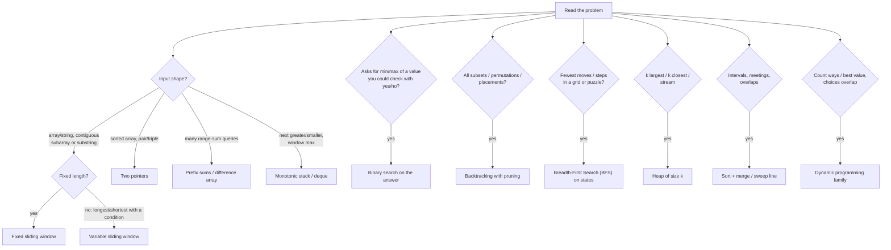
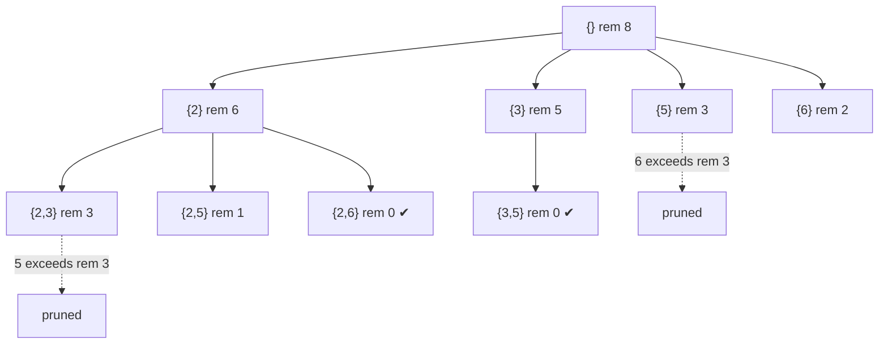
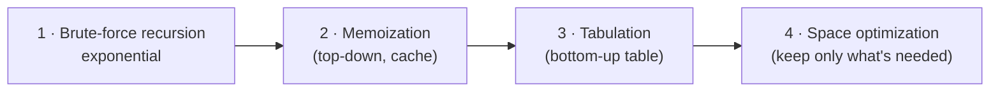
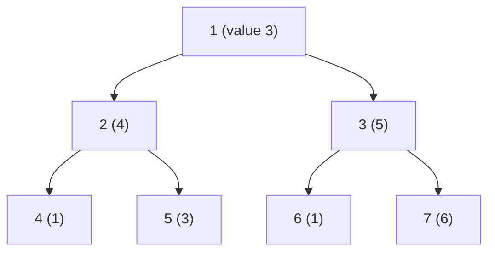

# Lesson 15 · Dynamic Programming and Interview Patterns (Beyond the Textbook)

> **Why this matters.** Strong engineers don't invent every solution from scratch. They recognize a **pattern** in the problem statement within seconds ("contiguous subarray" + "at most k" → sliding window), recall a **template**, and adapt it. This lesson is a catalog of the patterns that show up again and again in coding interviews, programming contests and real code reviews. Each one is a named, reusable version of a design technique from Levitin: decrease-and-conquer, transform-and-conquer, space-for-time, greedy, backtracking and, above all, Dynamic Programming (DP) (Levitin Ch. 4–8, 12).

| 🎮 Simulations | 🏟️ Arena | 🐍 Code |
|---|---|---|
| [Patterns (two pointers, sliding window, monotonic stack, prefix sums, binary search on answer)](https://normansrule.github.io/algorithm-forge/sims/patterns.html) · [DP Studio](https://normansrule.github.io/algorithm-forge/sims/dp-studio.html) · [Backtracking](https://normansrule.github.io/algorithm-forge/sims/backtracking.html) | [Chapter 15 problems](https://normansrule.github.io/algorithm-forge/arena/?chapter=15) | [`ch15_patterns.py`](../../src/python/algoforge/ch15_patterns.py) |

**Prerequisites:** [Lesson 4](../04-decrease-and-conquer/README.md) (binary search), [Lesson 8](../08-dynamic-programming/README.md) (coin-row, knapsack, memory functions), [Lesson 12](../12-coping-with-limitations/README.md) (backtracking), [Lesson 13](../13-advanced-data-structures/README.md) (heaps).

**How to read each card.** 🔎 **Signal words** (what in the problem statement triggers the pattern) · 🧱 **Template** in Forge Pseudocode · ✋ **Worked example** traced by hand · 💻 **Python** (in a fold) · 🧮 **Complexity** · ⚠️ **Pitfalls** · 🔁 **Where it's used**. Java versions of the core templates are collected in one compiled [Java template pack](#java-template-pack) at the end.

---

## The big idea in 60 seconds

Read the problem, underline the **signal words**, and follow the arrows. Most problems land on one pattern (sometimes two combined, like "binary search on the answer + greedy check").



| Pattern | Typical cost | Replaces |
|---|---|---|
| Two pointers | $O(n)$ after sorting | $O(n^2)$ pairs |
| Sliding window | $O(n)$ | $O(nk)$ or $O(n^2)$ windows |
| Prefix sums / difference array | $O(n)$ build, $O(1)$ query/update | $O(n)$ per query |
| Monotonic stack / deque | $O(n)$ | $O(n^2)$ scans |
| Binary search on the answer | $O(\log(\text{range}) \cdot \text{check})$ | trying every candidate |
| Backtracking | exponential, but pruned | blind exhaustive search |
| BFS on states | $O(\text{states} + \text{moves})$ | Depth-First Search (DFS), which may not find the shortest |
| Top-k with a heap | $O(n \log k)$ | $O(n \log n)$ full sort |
| Intervals (sort + scan) | $O(n \log n)$ | $O(n^2)$ pairwise overlaps |
| Dynamic programming | (#states) × (work per state) | exponential recursion |

---

# Part A · Array and search patterns

## Pattern 1 · Two pointers

🔎 **Signal words:** *sorted array*, *pair / triplet that sums to*, *remove duplicates in place*, *palindrome*, *merge two sorted lists*, *container with the most water*.

📖 **Story.** Two people walk toward each other from the ends of a sorted street. If their combined "score" is too big, the person on the right (holding the bigger number) steps left; if too small, the left one steps right. Neither ever needs to walk back.

👀 **Picture.** Try it in [patterns.html](https://normansrule.github.io/algorithm-forge/sims/patterns.html).

```
A = [1, 3, 4, 6, 8, 11], target 10
     L              R      1+11 = 12 > 10 → R moves left
```

🧱 **Template**

```
ALGORITHM PairWithSum(A[0..n-1], target)
    // A is sorted in nondecreasing order
    l ← 0
    r ← n - 1
    while l < r do
        s ← A[l] + A[r]
        if s = target then
            return (l, r)
        else if s < target then
            l ← l + 1
        else
            r ← r - 1
    return null
```

✋ **Worked example.** `A = [1, 3, 4, 6, 8, 11]`, target 10.

| l | r | A[l] + A[r] | Move |
|---|---|---|---|
| 0 | 5 | 1 + 11 = 12 | too big, r ← 4 |
| 0 | 4 | 1 + 8 = 9 | too small, l ← 1 |
| 1 | 4 | 3 + 8 = 11 | too big, r ← 3 |
| 1 | 3 | 3 + 6 = 9 | too small, l ← 2 |
| 2 | 3 | 4 + 6 = 10 | **found** (2, 3) |

**Why it's correct (the invariant):** every pair $(i, j)$ with $i < l$ or $j > r$ has already been ruled out. When $A[l] + A[r] > \text{target}$, pairing $A[r]$ with anything $\ge A[l]$ is also too big, so discarding $r$ loses nothing.

<details><summary>Python</summary>

```python
def pair_with_sum(a, target):
    l, r = 0, len(a) - 1
    while l < r:
        s = a[l] + a[r]
        if s == target:
            return l, r
        if s < target:
            l += 1
        else:
            r -= 1
    return None

def three_sum_zero(a):
    """All unique triples summing to 0: sort + fix one + two pointers, O(n^2)."""
    a, out = sorted(a), []
    for i in range(len(a) - 2):
        if i and a[i] == a[i - 1]:
            continue
        l, r = i + 1, len(a) - 1
        while l < r:
            s = a[i] + a[l] + a[r]
            if s == 0:
                out.append((a[i], a[l], a[r]))
                l += 1
                while l < r and a[l] == a[l - 1]:
                    l += 1
            elif s < 0:
                l += 1
            else:
                r -= 1
    return out

if __name__ == "__main__":
    assert pair_with_sum([1, 3, 4, 6, 8, 11], 10) == (2, 3)
    assert three_sum_zero([-3, 1, 2, -1, 0, 3, -2]) == [(-3, 0, 3), (-3, 1, 2), (-2, -1, 3), (-2, 0, 2), (-1, 0, 1)]
    print("two pointers OK")
```

</details>

🧮 **Complexity.** $O(n)$ time, $O(1)$ space (plus $O(n \log n)$ if you must sort first). 3-sum: $O(n^2)$ instead of $O(n^3)$.

⚠️ **Pitfalls.** Using it on an **unsorted** array (use a hash set instead: $O(n)$ expected). Skipping duplicates incorrectly in 3-sum.

🔁 **Where it's used.** The merge step of mergesort (Levitin §5.1), deduplicating sorted logs, merging sorted posting lists in search engines, Hoare's partition in quicksort (Levitin §5.2).

---

## Pattern 2 · Sliding window (fixed and variable)

🔎 **Signal words:** *contiguous subarray / substring*, *of length k* (fixed), *longest / shortest ... such that* (variable), *at most k distinct*, *without repeating characters*.

📖 **Story.** A picture frame slides along a strip of film. Instead of recounting everything inside the frame at each position, you add the frame that enters on the right and subtract the one that leaves on the left.

👀 **Picture.**

```
fixed k = 3:   [2 1 5] 1 3 2   sum 8
                2 [1 5 1] 3 2  sum 8 - 2 + 1 = 7
variable (sum ≥ 8): grow right until valid, then shrink left while still valid
```

🧱 **Template (variable window).**

```
ALGORITHM ShortestSubarrayAtLeast(A[0..n-1], S)
    // A has nonnegative values; returns the length of the shortest window with sum ≥ S (0 if none)
    best ← ∞
    l ← 0
    sum ← 0
    for r ← 0 to n - 1 do
        sum ← sum + A[r]                 // expand: include A[r]
        while sum ≥ S do                 // window valid: try to shrink
            best ← min(best, r - l + 1)
            sum ← sum - A[l]
            l ← l + 1
    if best = ∞ then
        return 0
    return best
```

✋ **Worked examples.**

*Fixed:* max sum of 3 consecutive in `[2, 1, 5, 1, 3, 2]`: window sums 8, 7, 9, 6 → **9** (`[5, 1, 3]`).

*Variable:* shortest window with sum ≥ 8 in `[4, 1, 1, 3, 2, 5]`.

| r | add | sum | shrink steps (window, sum) | best |
|---|---|---|---|---|
| 0–2 | 4, 1, 1 | 6 | — | ∞ |
| 3 | 3 | 9 | [0..3] 9 → drop 4 → 5 | 4 |
| 4 | 2 | 7 | — | 4 |
| 5 | 5 | 12 | [1..5] 12, [2..5] 11, [3..5] 10 → drop 3 → 7 | **3** |

Answer 3 (`[3, 2, 5]`). *Longest substring without repeats* in `"abacdbe"`: the window jumps its left edge past the previous copy of a repeated letter; answer **5** (`"acdbe"`).

<details><summary>Python</summary>

```python
def max_sum_fixed(a, k):
    s = best = sum(a[:k])
    for r in range(k, len(a)):
        s += a[r] - a[r - k]
        best = max(best, s)
    return best

def shortest_at_least(a, S):
    best, l, s = float("inf"), 0, 0
    for r, x in enumerate(a):
        s += x
        while s >= S:
            best = min(best, r - l + 1)
            s -= a[l]; l += 1
    return 0 if best == float("inf") else best

def longest_no_repeat(t):
    last, l, best = {}, 0, 0
    for r, ch in enumerate(t):
        if last.get(ch, -1) >= l:
            l = last[ch] + 1
        last[ch] = r
        best = max(best, r - l + 1)
    return best

if __name__ == "__main__":
    assert max_sum_fixed([2, 1, 5, 1, 3, 2], 3) == 9
    assert shortest_at_least([4, 1, 1, 3, 2, 5], 8) == 3
    assert longest_no_repeat("abacdbe") == 5
    print("sliding window OK")
```

</details>

🧮 **Complexity.** $O(n)$: each index enters and leaves the window once (amortized argument, [Lesson 16](../16-randomized-amortized-streaming/README.md)). Space $O(1)$ or $O(\sigma)$ for a character map.

⚠️ **Pitfalls.** The "shrink while valid" trick needs **monotonicity**: adding elements never makes the window "less valid". With negative numbers, sums aren't monotone; use prefix sums + a monotonic deque or a hash map instead.

🔁 **Where it's used.** Rate limiters ("at most 100 requests per sliding minute"), moving averages in monitoring dashboards, Transmission Control Protocol (TCP) flow control (literally called the sliding window), streaming anomaly detection.

---

## Pattern 3 · Prefix sums and difference arrays

🔎 **Signal words:** *sum of range [l, r]* asked many times, *number of subarrays with sum k*, *add v to every element in [l, r]* many times, *2-D region sums*.

📖 **Story.** An odometer. To know how far you drove between mile marker $l$ and $r$, subtract the readings: $P[r+1] - P[l]$. A **difference array** is the reverse trick: to add to a whole stretch, note "+v starts here" and "−v stops after there", then run the odometer once.

👀 **Picture.**

```
A = [1, 2, 1, -1, 2, 1]
P = [0, 1, 3, 4, 3, 5, 6]         P[i] = A[0] + ... + A[i-1]
sum A[1..3] = P[4] - P[1] = 3 - 1 = 2
```

🧱 **Template (count subarrays with sum k).**

```
ALGORITHM CountSubarraysWithSum(A[0..n-1], k)
    // seen is a hash map: prefix value → how many times it occurred so far (missing = 0)
    seen ← map()
    seen[0] ← 1
    p ← 0
    count ← 0
    for i ← 0 to n - 1 do
        p ← p + A[i]
        count ← count + get(seen, p - k, 0)      // earlier prefixes q with p - q = k
        seen[p] ← get(seen, p, 0) + 1
    return count
```

✋ **Worked examples.**

*Subarrays of `[1, 2, 1, -1, 2, 1]` with sum 3:* prefix sums $P = 0, 1, 3, 4, 3, 5, 6$. A subarray $A[i..j]$ has sum $P[j+1] - P[i]$, so we need pairs of prefixes (earlier, later) that differ by 3: $(P_0, P_2)$, $(P_0, P_4)$, $(P_1, P_3)$, $(P_2, P_6)$, $(P_4, P_6)$, i.e. $A[0..1]$, $A[0..3]$, $A[1..2]$, $A[2..5]$, $A[4..5]$ → **5** subarrays. The hash map finds each pair in $O(1)$ when the later prefix arrives.

*Difference array:* 8 zeros, then add 5 to [1..4], 2 to [3..6], 1 to [0..2]. `D = [1, 5, 0, 1, 0, −5, 0, −2, 0]`; running sum → **`[1, 6, 6, 7, 7, 2, 2, 0]`**. Three range updates cost $O(1)$ each plus one $O(n)$ pass.

<details><summary>Python</summary>

```python
from collections import Counter
from itertools import accumulate

def prefix(a):
    return [0] + list(accumulate(a))

def count_subarrays_sum(a, k):
    seen, p, count = Counter({0: 1}), 0, 0
    for x in a:
        p += x
        count += seen[p - k]
        seen[p] += 1
    return count

def apply_range_adds(n, updates):
    d = [0] * (n + 1)
    for l, r, v in updates:
        d[l] += v; d[r + 1] -= v
    return list(accumulate(d[:n]))

def matrix_prefix(M):
    """2-D prefix sums: region sum = P[r2+1][c2+1] - P[r1][c2+1] - P[r2+1][c1] + P[r1][c1]."""
    R, C = len(M), len(M[0])
    P = [[0] * (C + 1) for _ in range(R + 1)]
    for i in range(R):
        for j in range(C):
            P[i + 1][j + 1] = M[i][j] + P[i][j + 1] + P[i + 1][j] - P[i][j]
    return P

if __name__ == "__main__":
    a = [1, 2, 1, -1, 2, 1]
    P = prefix(a)
    assert P == [0, 1, 3, 4, 3, 5, 6] and P[4] - P[1] == 2
    assert count_subarrays_sum(a, 3) == 5
    assert apply_range_adds(8, [(1, 4, 5), (3, 6, 2), (0, 2, 1)]) == [1, 6, 6, 7, 7, 2, 2, 0]
    Q = matrix_prefix([[1, 2, 3], [4, 5, 6], [7, 8, 9]])
    assert Q[3][3] - Q[1][3] - Q[3][1] + Q[1][1] == 5 + 6 + 8 + 9
    print("prefix sums OK")
```

</details>

🧮 **Complexity.** Build $O(n)$, each range query $O(1)$. Counting subarrays: $O(n)$ expected with a hash map (vs $O(n^2)$ brute force). With updates interleaved with queries, upgrade to a Fenwick tree ([Lesson 13](../13-advanced-data-structures/README.md)).

⚠️ **Pitfalls.** Off-by-one: use the length-$(n+1)$ convention with $P[0] = 0$. Forgetting `seen[0] = 1` (misses subarrays starting at index 0). Integer overflow in fixed-width languages.

🔁 **Where it's used.** Summed-area tables (integral images) in computer vision (the Viola–Jones face detector), cumulative metrics in analytics databases, calendar/booking systems that apply bulk range changes.

---

## Pattern 4 · Monotonic stack and monotonic deque

🔎 **Signal words:** *next greater / smaller element*, *previous smaller*, *stock span*, *largest rectangle in histogram*, *daily temperatures*, *sliding window maximum/minimum*.

📖 **Story.** People in a queue for a parade, each looking right. A tall person arriving **answers the question** of every shorter person still waiting ("who's the first taller one to my right?") and those people leave. The waiting line is always sorted from tall to short: that's the monotonic stack.

👀 **Picture.**

```
A = [3, 7, 1, 4, 2, 6]
i=1 (7): pops 3  → NGE[0] = 7        stack (values): 7
i=3 (4): pops 1  → NGE[2] = 4        stack: 7 4
i=5 (6): pops 2, 4 → NGE[4] = NGE[3] = 6   stack: 7 6
```

🧱 **Template (next greater element).**

```
ALGORITHM NextGreater(A[0..n-1])
    res ← array(n, -1)
    S ← stack()                         // holds indices whose answer is unknown; values decreasing
    for i ← 0 to n - 1 do
        while not isEmpty(S) and A[top(S)] < A[i] do
            res[pop(S)] ← A[i]
        push(S, i)
    return res
```

✋ **Worked examples.**
- Next greater of `[3, 7, 1, 4, 2, 6]` → **`[7, −1, 4, 6, 6, −1]`**.
- Sliding window maximum of `[4, 2, 12, 3, 8, 1, 7]` with $k = 3$ → **`[12, 12, 12, 8, 8]`**. The deque holds indices with **decreasing** values; the front is the current max; drop the front when it leaves the window, and drop smaller values from the back when a bigger one arrives (they can never be a max again).

<details><summary>Python</summary>

```python
from collections import deque

def next_greater(a):
    res, st = [-1] * len(a), []
    for i, x in enumerate(a):
        while st and a[st[-1]] < x:
            res[st.pop()] = x
        st.append(i)
    return res

def sliding_max(a, k):
    dq, out = deque(), []
    for i, x in enumerate(a):
        while dq and a[dq[-1]] <= x:
            dq.pop()
        dq.append(i)
        if dq[0] <= i - k:
            dq.popleft()
        if i >= k - 1:
            out.append(a[dq[0]])
    return out

def largest_rectangle(h):
    """Largest rectangle in a histogram with a monotonic (increasing) stack."""
    st, best = [], 0
    for i, x in enumerate(h + [0]):
        start = i
        while st and st[-1][1] >= x:
            j, height = st.pop()
            best = max(best, height * (i - j))
            start = j
        st.append((start, x))
    return best

if __name__ == "__main__":
    assert next_greater([3, 7, 1, 4, 2, 6]) == [7, -1, 4, 6, 6, -1]
    assert sliding_max([4, 2, 12, 3, 8, 1, 7], 3) == [12, 12, 12, 8, 8]
    assert largest_rectangle([2, 4, 3, 5, 1]) == 9
    print("monotonic stack/deque OK")
```

</details>

🧮 **Complexity.** $O(n)$ total even though there's a `while` inside a `for`: each index is pushed once and popped at most once (aggregate amortized analysis). Space $O(n)$.

⚠️ **Pitfalls.** `<` vs `≤` decides how equal values are handled; decide deliberately ("next **strictly** greater"). Storing values instead of indices loses the ability to expire elements from a window.

🔁 **Where it's used.** Stock-span and trading indicators, skyline and histogram problems in graphics, the deque-based sliding min/max in streaming monitors, and as a subroutine in $O(n)$ DP optimizations.

---

## Pattern 5 · Binary search on the answer

🔎 **Signal words:** *minimum capacity / speed / time such that ...*, *maximize the minimum distance*, *smallest largest sum when splitting into k parts*, any answer where "if $x$ works, then every larger $x$ works too".

📖 **Story.** You don't know the answer, but you can **check** a guess quickly ("with trucks of capacity 12, can we ship in 3 days?"). If checks are monotone (a bigger truck never hurts), binary-search the guess instead of the array. This is Levitin's decrease-by-half idea (Levitin §4.4) applied to the answer space.

👀 **Picture.**

```
capacity:  8  9  10 11 | 12 13 14 ... 30
feasible:  ✘  ✘  ✘  ✘  | ✔  ✔  ✔  ...  ✔      find the first ✔
```

🧱 **Template.**

```
ALGORITHM MinShipCapacity(W[0..n-1], D)
    // Smallest capacity that ships all packages, in order, within D days
    lo ← max(W)                          // must fit the heaviest package
    hi ← sum(W)                          // ships everything in one day
    while lo < hi do
        mid ← (lo + hi) div 2
        if DaysNeeded(W, mid) ≤ D then
            hi ← mid                     // mid works: answer is mid or smaller
        else
            lo ← mid + 1                 // mid fails: answer is bigger
    return lo

ALGORITHM DaysNeeded(W[0..n-1], cap)
    days ← 1
    load ← 0
    for i ← 0 to n - 1 do
        if load + W[i] > cap then
            days ← days + 1
            load ← 0
        load ← load + W[i]
    return days
```

✋ **Worked example.** `W = [4, 8, 2, 5, 3, 7, 1]`, $D = 3$. Range [8, 30].

| lo | hi | mid | days(mid) | Decision |
|---|---|---|---|---|
| 8 | 30 | 19 | 2 | ✔ → hi = 19 |
| 8 | 19 | 13 | 3 | ✔ → hi = 13 |
| 8 | 13 | 10 | 4 | ✘ → lo = 11 |
| 11 | 13 | 12 | 3 | ✔ → hi = 12 |
| 11 | 12 | 11 | 4 | ✘ → lo = 12 |

Answer **12**: days `[4, 8] [2, 5, 3] [7, 1]` with loads 12, 10, 8.

<details><summary>Python</summary>

```python
def days_needed(w, cap):
    days, load = 1, 0
    for x in w:
        if load + x > cap:
            days, load = days + 1, 0
        load += x
    return days

def min_ship_capacity(w, D):
    lo, hi = max(w), sum(w)
    while lo < hi:
        mid = (lo + hi) // 2
        if days_needed(w, mid) <= D:
            hi = mid
        else:
            lo = mid + 1
    return lo

def first_true(lo, hi, ok):
    """Generic: smallest x in [lo, hi] with ok(x) True, assuming ok is monotone False...True."""
    while lo < hi:
        mid = (lo + hi) // 2
        if ok(mid): hi = mid
        else: lo = mid + 1
    return lo

if __name__ == "__main__":
    W = [4, 8, 2, 5, 3, 7, 1]
    assert min_ship_capacity(W, 3) == 12
    assert all(min_ship_capacity(W, D) == min(c for c in range(8, 31) if days_needed(W, c) <= D) for D in range(1, 8))
    assert first_true(0, 10**6, lambda x: x * x >= 2_000_000) == 1415     # integer ceil(sqrt)
    print("binary search on the answer OK")
```

</details>

🧮 **Complexity.** $O(n \log(\sum W))$: about $\log_2(\text{range})$ checks, each $O(n)$.

⚠️ **Pitfalls.** Non-monotone check (then binary search is simply wrong). Infinite loop from `lo = mid` with `mid = (lo+hi) div 2`; match the update rules to the rounding. Wrong initial bounds (the lower bound must be feasible-or-less, the upper bound must be feasible).

🔁 **Where it's used.** Capacity planning ("smallest cluster that meets the latency target"), `git bisect` (binary search over commits for the first bad one), tuning thresholds, and parametric search in optimization.

---

## Pattern 6 · Backtracking (subsets, permutations, combinations) with pruning

🔎 **Signal words:** *all* subsets / permutations / combinations / arrangements, *generate every*, *n-queens*, *sudoku*, *word search*, small $n$ (≤ 20 or so).

📖 **Story.** Explore a maze of decisions: choose, go deeper, and when you hit a dead end, **un-choose** and try the next option. **Pruning** is noticing a dead end early (Levitin §12.1).

👀 **Picture.** Subset-sum on `[2, 3, 5, 6]`, target 8 (sorted, so we can stop a loop as soon as a value is too big). Explore it in [backtracking.html](https://normansrule.github.io/algorithm-forge/sims/backtracking.html).



🧱 **Template.**

```
ALGORITHM Backtrack(state)
    if IsSolution(state) then
        Record(state)
        return
    for each choice in Candidates(state) do
        if Promising(state, choice) then  // prune
            Apply(state, choice)
            Backtrack(state)
            Undo(state, choice)
```

The three classic shapes differ only in `Candidates`:

| Shape | Candidates at depth | Count |
|---|---|---|
| Subsets | take / skip element $i$ (or: any $j \ge$ start) | $2^n$ |
| Combinations $\binom{n}{k}$ | any $j \ge$ start, stop at size $k$ | $\binom{n}{k}$ |
| Permutations | any unused element | $n!$ |

✋ **Worked example.** Subsets of `[2, 3, 5, 6]` summing to 8 → **{2, 6}** and **{3, 5}**. With sorting + "break when value > remaining", only **9 calls** are made (the full subset tree has 16 leaves and 31 nodes).

The template above names its pieces (`IsSolution`, `Candidates`, …) instead of defining them. Here it is made
concrete for this example, ready to run:

```
ALGORITHM SubsetSum(A[0..n-1], target)
    // All subsets of A (positive numbers) that sum to target
    A ← sorted(A)
    out ← []
    path ← array(n, 0)                     // path[0..d-1] = the numbers chosen so far
    Go(0, target, 0)
    return out

ALGORITHM Go(start, rem, d)
    // A, out and path are shared with SubsetSum
    if rem = 0 then                        // IsSolution
        chosen ← path[0..d - 1]            // a copy
        append(out, chosen)                // Record
        return
    for j ← start to length(A) - 1 do      // Candidates: any element after the last one taken
        if A[j] > rem then
            break                          // not Promising: A is sorted, so every later value is too big
        path[d] ← A[j]                     // Apply (the next choice overwrites path[d]: that is the Undo)
        Go(j + 1, rem - A[j], d + 1)
```

<details><summary>Python</summary>

```python
def subsets(a):
    out, path = [], []
    def go(i):
        if i == len(a):
            out.append(path[:]); return
        go(i + 1)                        # skip a[i]
        path.append(a[i]); go(i + 1); path.pop()   # take a[i]
    go(0)
    return out

def permutations(a):
    out, path, used = [], [], [False] * len(a)
    def go():
        if len(path) == len(a):
            out.append(path[:]); return
        for i in range(len(a)):
            if not used[i]:
                used[i] = True; path.append(a[i])
                go()
                path.pop(); used[i] = False
    go()
    return out

def combinations(n, k):
    out, path = [], []
    def go(start):
        if len(path) == k:
            out.append(path[:]); return
        for j in range(start, n - (k - len(path)) + 1):   # prune: enough numbers left?
            path.append(j); go(j + 1); path.pop()
    go(0)
    return out

def subset_sum(a, target):
    a, out, path, calls = sorted(a), [], [], [0]
    def go(start, rem):
        calls[0] += 1
        if rem == 0:
            out.append(path[:]); return
        for j in range(start, len(a)):
            if a[j] > rem:
                break                    # prune: sorted, so every later value is too big
            path.append(a[j]); go(j + 1, rem - a[j]); path.pop()
    go(0, target)
    return out, calls[0]

if __name__ == "__main__":
    assert len(subsets([1, 2, 3])) == 8
    assert len(permutations([1, 2, 3, 4])) == 24
    assert combinations(4, 2) == [[0, 1], [0, 2], [0, 3], [1, 2], [1, 3], [2, 3]]
    assert subset_sum([2, 3, 5, 6], 8) == ([[2, 6], [3, 5]], 9)
    print("backtracking OK")
```

</details>

🧮 **Complexity.** Output-sensitive: $O(2^n \cdot n)$ for subsets, $O(n! \cdot n)$ for permutations (copying each answer costs $n$). Pruning doesn't change the worst case but often shrinks real runs by orders of magnitude.

⚠️ **Pitfalls.** Appending `path` instead of a **copy** (every answer ends up being the same final list). Forgetting to undo. Duplicate answers when the input has duplicates (sort and skip equal neighbors at the same depth).

🔁 **Where it's used.** Constraint solvers (Sudoku, scheduling; Boolean satisfiability (SAT) solvers are industrial-strength backtracking), regular-expression engines with backtracking, test-case generation, puzzle games.

---

## Pattern 7 · BFS on grids and state spaces

🔎 **Signal words:** *minimum number of moves / steps / operations*, *shortest path in a maze/grid*, *fewest transformations* (word ladder), *lock combination*, all moves cost the same.

📖 **Story.** Drop a stone in a pond: ripples reach every state at distance 1, then 2, then 3. The first ripple to touch the goal is the shortest route (Levitin §3.5 for BFS on explicit graphs).

👀 **Picture.** State = (liters in 3-L jug, liters in 5-L jug). Moves: fill, empty, pour. Goal: exactly 4 liters.

```
(0,0) → (0,5) → (3,2) → (0,2) → (2,0) → (2,5) → (3,4)   6 moves
```

🧱 **Template.**

```
ALGORITHM BFSStates(start)
    // dist is a hash map from state to number of moves
    // IsGoal(s) and Moves(s) are the problem-specific helpers (here: the 3-L / 5-L jug puzzle)
    dist ← map()
    dist[start] ← 0
    Q ← queue()
    enqueue(Q, start)
    while not isEmpty(Q) do
        s ← dequeue(Q)
        if IsGoal(s) then
            return dist[s]
        for each t in Moves(s) do
            if not contains(dist, t) then
                dist[t] ← dist[s] + 1
                enqueue(Q, t)
    return -1

ALGORITHM IsGoal(s)
    // a state is (liters in the 3-L jug, liters in the 5-L jug)
    return s[1] = 4                         // only the 5-L jug can hold 4 liters

ALGORITHM Moves(s)
    (a, b) ← s
    pourAB ← min(a, 5 - b)                  // how much fits when pouring 3-L into 5-L
    pourBA ← min(b, 3 - a)
    return [(3, b), (a, 5), (0, b), (a, 0), (a - pourAB, b + pourAB), (a + pourBA, b - pourBA)]
```

✋ **Worked example.** Jugs 3 L and 5 L, target 4 L. BFS explores 2 states at distance 1 ((3,0), (0,5)), and so on; it first reaches a state containing 4 at distance **6** via the path above. At most $4 \times 6 = 24$ states exist, so BFS finishes instantly.

<details><summary>Python</summary>

```python
from collections import deque

def bfs_states(start, is_goal, moves):
    dist, parent = {start: 0}, {start: None}
    q = deque([start])
    while q:
        s = q.popleft()
        if is_goal(s):
            path = []
            while s is not None:
                path.append(s); s = parent[s]
            return path[::-1]
        for t in moves(s):
            if t not in dist:
                dist[t], parent[t] = dist[s] + 1, s
                q.append(t)
    return None

def jug_moves(state, A=3, B=5):
    a, b = state
    pour_ab, pour_ba = min(a, B - b), min(b, A - a)
    return [(A, b), (a, B), (0, b), (a, 0), (a - pour_ab, b + pour_ab), (a + pour_ba, b - pour_ba)]

def grid_moves(grid):
    R, C = len(grid), len(grid[0])
    def moves(p):
        r, c = p
        for nr, nc in ((r + 1, c), (r - 1, c), (r, c + 1), (r, c - 1)):
            if 0 <= nr < R and 0 <= nc < C and grid[nr][nc] != "#":
                yield (nr, nc)
    return moves

if __name__ == "__main__":
    path = bfs_states((0, 0), lambda s: 4 in s, jug_moves)
    assert path == [(0, 0), (0, 5), (3, 2), (0, 2), (2, 0), (2, 5), (3, 4)]
    maze = ["..#.", ".##.", "...."]
    p = bfs_states((0, 0), lambda s: s == (0, 3), grid_moves(maze))
    assert len(p) - 1 == 7
    print("BFS on states OK:", path)
```

</details>

🧮 **Complexity.** $O(S + M)$ for $S$ reachable states and $M$ moves. The real question is always "how many states are there?": estimate it before coding (e.g. positions × keys-held bitmask).

⚠️ **Pitfalls.** Marking visited when **dequeuing** instead of when **enqueuing** (states get enqueued many times). Using DFS (finds *a* path, not the shortest). Different move costs → Dijkstra or 0-1 BFS ([Lesson 14](../14-advanced-graphs/README.md)). For huge spaces, **bidirectional BFS** from both ends cuts $b^d$ to about $2b^{d/2}$.

🔁 **Where it's used.** Puzzle solvers, robot navigation on occupancy grids, flood fill in image editors ("paint bucket"), social-network "degrees of separation", web crawlers (BFS by link depth), garbage collectors (marking reachable objects).

---

## Pattern 8 · Top-k with a heap

🔎 **Signal words:** *k largest / smallest*, *k most frequent*, *k closest points*, *median of a stream*, *merge k sorted lists*, data too big to sort or arriving as a **stream**.

📖 **Story.** A bouncer at a club with $k$ seats keeps the **least impressive** current guest by the door. A newcomer gets in only by beating that guest, who is then shown out. At the end, the club holds the top $k$.

👀 **Picture.** `[5, 1, 9, 3, 7, 2, 8]`, $k = 3$, min-heap of the best 3 so far:

```
5 → {5}   1 → {1,5}   9 → {1,5,9}   3 → {3,5,9}   7 → {5,7,9}   2 → {5,7,9}   8 → {7,8,9}
```

🧱 **Template.**

```
ALGORITHM TopK(A[0..n-1], k)
    H ← priorityQueue()                  // a min-heap: the smallest of the best k is on top
    for i ← 0 to n - 1 do
        if length(H) < k then
            insert(H, A[i], A[i])
        else if A[i] > peek(H) then
            deleteMin(H)                 // evict the current minimum
            insert(H, A[i], A[i])
    R ← []
    while not isEmpty(H) do
        append(R, deleteMin(H))
    return R                             // the k largest values, smallest first
```

✋ **Worked example.** Above: after processing all 7 values the heap holds **{7, 8, 9}**. Watch value 3: the heap was full with {1, 5, 9} and 3 beats the minimum 1, so 1 is evicted. Value 2 arrives when the minimum is 5, so it is ignored in $O(1)$. Every element costs at most one pop and one push on a heap of size $k$.

<details><summary>Python</summary>

```python
import heapq
from collections import Counter

def top_k(a, k):
    h = []
    for x in a:
        if len(h) < k:
            heapq.heappush(h, x)
        elif x > h[0]:
            heapq.heapreplace(h, x)
    return sorted(h, reverse=True)

def k_most_frequent(words, k):
    return [w for w, _ in heapq.nlargest(k, Counter(words).items(), key=lambda p: (p[1], p[0]))]

class RunningMedian:
    """Two heaps: max-heap of the lower half (negated) and min-heap of the upper half."""
    def __init__(self):
        self.lo, self.hi = [], []
    def add(self, x):
        heapq.heappush(self.lo, -x)
        heapq.heappush(self.hi, -heapq.heappop(self.lo))
        if len(self.hi) > len(self.lo):
            heapq.heappush(self.lo, -heapq.heappop(self.hi))
    def median(self):
        if len(self.lo) > len(self.hi):
            return -self.lo[0]
        return (-self.lo[0] + self.hi[0]) / 2

if __name__ == "__main__":
    assert top_k([5, 1, 9, 3, 7, 2, 8], 3) == [9, 8, 7]
    assert k_most_frequent("a b a c b a d".split(), 2) == ["a", "b"]
    m = RunningMedian()
    for x in [5, 1, 9, 3]:
        m.add(x)
    assert m.median() == 4.0
    print("top-k OK")
```

</details>

🧮 **Complexity.** $O(n \log k)$ time, $O(k)$ space. For a one-shot array, **quickselect** (Levitin §4.5) finds the $k$-th largest in $O(n)$ average; heaps win for streams and when $k \ll n$.

⚠️ **Pitfalls.** Using a **max**-heap for "k largest" (you'd need to keep all $n$). Ties in "k most frequent": specify an order.

🔁 **Where it's used.** "Trending" lists and leaderboards, search engines keeping the $k$ best-scored documents, database `ORDER BY ... LIMIT k`, merging $k$ sorted runs in external sort ([Lesson 17](../17-senior-engineer-playbook/README.md)).

---

## Pattern 9 · Intervals: merge and sweep line

🔎 **Signal words:** *intervals*, *meetings*, *overlapping*, *merge*, *minimum number of rooms / platforms*, *free time*, *insert interval*.

📖 **Story.** Sort events by time and walk through the day once. Merging: keep extending the current block while the next interval starts before it ends. Sweep line: count "+1 when a meeting starts, −1 when it ends"; the peak is how many rooms you need.

👀 **Picture.**

```
merge: [1,4] [2,5] [7,9] [8,10] [12,13]  →  [1,5] [7,10] [12,13]
sweep (half-open meetings [s, e)): (1,4) (2,6) (5,8) (7,9) (3,5)
time:   1  2  3  4  5  5  6  7  8  9      (at equal times, ends before starts)
count:  1  2  3  2  1  2  1  2  1  0      peak = 3 rooms
```

🧱 **Template (merge).**

```
ALGORITHM MergeIntervals(I[0..n-1])
    // I[i] = (start, end)
    J ← sorted(I)                         // by start (pairs compare left to right)
    out ← []
    for each (s, e) in J do
        k ← length(out) - 1                // the last merged block (-1 if none yet)
        if k ≥ 0 and s ≤ out[k][1] then
            out[k][1] ← max(out[k][1], e)  // overlap: stretch the last block
        else
            append(out, [s, e])            // gap: start a new block
    return out
```

✋ **Worked example.** Merge: `[1,4]` and `[2,5]` overlap → `[1,5]`; `[7,9]` starts after 5 → new block; `[8,10]` overlaps → `[7,10]`; `[12,13]` → new. Result **`[[1,5], [7,10], [12,13]]`**. Sweep: peak concurrency **3** (between times 3 and 4, meetings (1,4), (2,6), (3,5) overlap).

<details><summary>Python</summary>

```python
def merge_intervals(intervals):
    out = []
    for s, e in sorted(intervals):
        if out and s <= out[-1][1]:
            out[-1][1] = max(out[-1][1], e)
        else:
            out.append([s, e])
    return out

def max_concurrent(meetings):
    """Half-open [s, e): at equal times process ends (-1) before starts (+1)."""
    events = sorted([(s, 1) for s, e in meetings] + [(e, -1) for s, e in meetings])
    cur = best = 0
    for _, delta in events:
        cur += delta
        best = max(best, cur)
    return best

def max_non_overlapping(intervals):
    """Greedy activity selection (see Lesson 9): sort by END time."""
    count, end = 0, float("-inf")
    for s, e in sorted(intervals, key=lambda x: x[1]):
        if s >= end:
            count, end = count + 1, e
    return count

if __name__ == "__main__":
    assert merge_intervals([[1, 4], [2, 5], [7, 9], [8, 10], [12, 13]]) == [[1, 5], [7, 10], [12, 13]]
    assert max_concurrent([(1, 4), (2, 6), (5, 8), (7, 9), (3, 5)]) == 3
    assert max_non_overlapping([(1, 4), (2, 6), (5, 8), (7, 9), (3, 5)]) == 2
    print("intervals OK")
```

</details>

🧮 **Complexity.** $O(n \log n)$ for sorting, then $O(n)$.

⚠️ **Pitfalls.** Closed vs half-open intervals: does a meeting ending at 5 conflict with one starting at 5? Decide, then encode it in the tie-break. Sorting by start for activity selection (wrong: sort by **end**).

🔁 **Where it's used.** Calendar apps (free/busy), resource allocation (rooms, gates, cloud instances), genome annotation (overlapping features), merging Internet Protocol (IP) address ranges in firewall rules, computational-geometry sweeps.

---

# Part B · The dynamic programming family

## From brute-force recursion to optimized DP: the four-step pipeline

Levitin introduces DP with the coin-row problem (Levitin §8.1). Interviewers call the same problem **"house robber"**: pick non-adjacent houses to maximize loot. Walk it through the four steps that work for every DP.

**Step 0: define the state in words.** $F(i)$ = best total using only the first $i$ coins. **Recurrence:** either skip coin $i$, or take it and skip coin $i-1$:

$$F(i) = \max\big(c_i + F(i-2),\; F(i-1)\big), \qquad F(0) = 0,\; F(1) = c_1.$$



<details><summary>Python: the same problem, four ways</summary>

```python
from functools import lru_cache

coins = [6, 2, 1, 9, 4, 3, 5]

# 1. Brute-force recursion: correct but exponential (calls grow like Fibonacci numbers)
calls = 0
def rob_rec(i):
    global calls
    calls += 1
    if i <= 0:
        return 0
    if i == 1:
        return coins[0]
    return max(coins[i - 1] + rob_rec(i - 2), rob_rec(i - 1))

# 2. Memoization (top-down): same code + a cache; each i computed once
@lru_cache(maxsize=None)
def rob_memo(i):
    if i <= 0:
        return 0
    if i == 1:
        return coins[0]
    return max(coins[i - 1] + rob_memo(i - 2), rob_memo(i - 1))

# 3. Tabulation (bottom-up): fill F[0..n] in dependency order
def rob_table(c):
    F = [0] * (len(c) + 1)
    if c:
        F[1] = c[0]
    for i in range(2, len(c) + 1):
        F[i] = max(c[i - 1] + F[i - 2], F[i - 1])
    return F

# 4. Space optimization: F[i] only needs F[i-1] and F[i-2]
def rob_o1(c):
    prev2, prev1 = 0, 0
    for x in c:
        prev2, prev1 = prev1, max(x + prev2, prev1)
    return prev1

if __name__ == "__main__":
    assert rob_rec(7) == 20 and calls == 41
    assert rob_memo(7) == 20
    assert rob_table(coins) == [0, 6, 6, 7, 15, 15, 18, 20]
    assert rob_o1(coins) == 20
    print("all four agree: 20 (coins 6 + 9 + 5); naive recursion made", calls, "calls")
```

</details>

✋ **Worked example.** Coins `[6, 2, 1, 9, 4, 3, 5]`:

| i | 0 | 1 | 2 | 3 | 4 | 5 | 6 | 7 |
|---|---|---|---|---|---|---|---|---|
| $c_i$ | | 6 | 2 | 1 | 9 | 4 | 3 | 5 |
| $F(i)$ | 0 | 6 | 6 | 7 | 15 | 15 | 18 | **20** |

Backtrack: $F(7) = 5 + F(5)$ (took coin 7), $F(5) = F(4)$ (skipped 5), $F(4) = 9 + F(2)$, $F(2) = F(1) = 6$ → coins **6, 9, 5**.

| $n$ | naive recursive calls | memo/table work |
|---|---|---|
| 7 | 41 | 7 |
| 10 | 177 | 10 |
| 20 | 21,891 | 20 |
| 30 | 2,692,537 | 30 |

**The pipeline in one sentence each.**
1. **Recursion** makes the recurrence executable; test it on tiny inputs against brute force.
2. **Memoization** (Levitin's "memory functions", §8.2) adds a cache; solves only the states you actually reach. Easiest to write, but has recursion overhead and depth limits.
3. **Tabulation** orders states so dependencies are ready; no recursion, easy to analyze, often faster.
4. **Space optimization** notices that row $i$ only depends on rows $i-1$ (and $i-2$): keep 1–2 rows instead of the whole table. You lose the ability to reconstruct the solution unless you store choices separately.

🧮 **Complexity rule:** DP time = (number of states) × (transitions per state). Coin-row: $n$ states × 2 = $O(n)$.

---

## Pattern 10 · 1-D DP

🔎 **Signal words:** *maximum / minimum / number of ways* along a **sequence**, *you can't pick adjacent*, *climb stairs 1 or 2 at a time*, *decode ways*, *jump game*, *minimum coins for amount*.

🧱 **Template.**

```
ALGORITHM MinCoins(coins[0..m-1], amount)
    // F[a] = fewest coins that make amount a (unbounded supply of each coin)
    F ← array(amount + 1, ∞)
    F[0] ← 0
    for a ← 1 to amount do
        for j ← 0 to m - 1 do
            if coins[j] ≤ a and F[a - coins[j]] + 1 < F[a] then
                F[a] ← F[a - coins[j]] + 1
    return F[amount]
```

✋ **Worked example.** Coins `{1, 4, 5}`, amount 8. `F = [0, 1, 2, 3, 1, 1, 2, 3, 2]` → **2 coins** (4 + 4). Greedy (largest first) would take 5 + 1 + 1 + 1 = 4 coins: this is exactly why change-making needs DP for arbitrary coin systems (Levitin §8.1 and §9 intro).

<details><summary>Python</summary>

```python
def min_coins(coins, amount):
    INF = float("inf")
    F = [0] + [INF] * amount
    for a in range(1, amount + 1):
        F[a] = min((F[a - c] + 1 for c in coins if c <= a), default=INF)
    return F

def climb_ways(n):
    """Ways to climb n stairs taking 1 or 2 steps: Fibonacci."""
    a, b = 1, 1
    for _ in range(n):
        a, b = b, a + b
    return a

if __name__ == "__main__":
    assert min_coins([1, 4, 5], 8) == [0, 1, 2, 3, 1, 1, 2, 3, 2]
    assert climb_ways(5) == 8
    print("1-D DP OK")
```

</details>

🧮 $O(\text{amount} \cdot m)$ time, $O(\text{amount})$ space. ⚠️ Initialize unreachable states to ∞, not 0. 🔁 Used in: text justification and line breaking (TeX), speech and handwriting decoding, pricing and resource-allocation engines.

---

## Pattern 11 · 2-D grid DP

🔎 **Signal words:** *grid*, *only move right or down*, *number of unique paths*, *minimum path sum*, *largest square of 1s*, robot collecting coins (Levitin §8.1).

🧱 **Template.**

```
ALGORITHM MinPathSum(G[0..R-1, 0..C-1])
    D ← matrix(R, C, 0)
    for i ← 0 to R - 1 do
        for j ← 0 to C - 1 do
            if i = 0 and j = 0 then
                D[i, j] ← G[0, 0]
            else if i = 0 then
                D[i, j] ← D[i, j - 1] + G[i, j]
            else if j = 0 then
                D[i, j] ← D[i - 1, j] + G[i, j]
            else
                D[i, j] ← min(D[i - 1, j], D[i, j - 1]) + G[i, j]
    return D[R - 1, C - 1]
```

✋ **Worked example.**

```
G:  3 1 4 2        D:  3  4  8 10
    1 5 9 2            4  9 17 12
    6 5 3 5           10 14 17 17
```

Answer **17**: right, right, right, down, down (3 + 1 + 4 + 2 + 2 + 5).

<details><summary>Python</summary>

```python
def min_path_sum(G):
    R, C = len(G), len(G[0])
    row = [0] * C                        # space-optimized: one row
    for i in range(R):
        for j in range(C):
            if i == 0 and j == 0:
                row[j] = G[0][0]
            elif i == 0:
                row[j] = row[j - 1] + G[i][j]
            elif j == 0:
                row[j] = row[j] + G[i][j]
            else:
                row[j] = min(row[j], row[j - 1]) + G[i][j]
    return row[-1]

def unique_paths(R, C):
    row = [1] * C
    for _ in range(1, R):
        for j in range(1, C):
            row[j] += row[j - 1]
    return row[-1]

if __name__ == "__main__":
    assert min_path_sum([[3, 1, 4, 2], [1, 5, 9, 2], [6, 5, 3, 5]]) == 17
    assert unique_paths(3, 4) == 10      # C(5, 2)
    print("grid DP OK")
```

</details>

🧮 $O(RC)$ time; $O(C)$ space with one rolling row. ⚠️ Handle the first row/column separately (or pad with ∞). 🔁 Used in: image seam carving (content-aware resize), sequence alignment (next pattern), dynamic time warping for time-series matching.

---

## Pattern 12 · The knapsack family

🔎 **Signal words:** *capacity / budget / weight limit*, *choose items*, *each at most once* (0/1) or *unlimited* (unbounded), *can we reach exactly sum S* (subset sum), *partition into two equal halves*, *number of ways to make change*.

🧱 **Template (0/1 knapsack, Levitin §8.2, one-row version).**

```
ALGORITHM Knapsack01(w[0..n-1], v[0..n-1], W)
    F ← array(W + 1, 0)                  // F[c] = best value with capacity c
    for i ← 0 to n - 1 do
        for c ← W downto w[i] do         // downward: each item used at most once
            F[c] ← max(F[c], F[c - w[i]] + v[i])
    return F[W]
```

| Variant | Inner loop | Recurrence |
|---|---|---|
| 0/1 knapsack | capacity **downward** | $F[c] = \max(F[c], F[c-w_i] + v_i)$ |
| Unbounded knapsack | capacity **upward** | same formula; upward lets item $i$ be reused |
| Subset sum (feasibility) | downward | $F[c] = F[c] \lor F[c - w_i]$ |
| Count ways to make change | coins outer, amounts upward | $F[a] \mathrel{+}= F[a - c]$ (combinations, not orderings) |

✋ **Worked example.** Items (weight, value): (1, 1), (3, 4), (4, 5), (5, 7); $W = 7$. Full table (rows = items considered):

| items \ c | 0 | 1 | 2 | 3 | 4 | 5 | 6 | 7 |
|---|---|---|---|---|---|---|---|---|
| none | 0 | 0 | 0 | 0 | 0 | 0 | 0 | 0 |
| +(1,1) | 0 | 1 | 1 | 1 | 1 | 1 | 1 | 1 |
| +(3,4) | 0 | 1 | 1 | 4 | 5 | 5 | 5 | 5 |
| +(4,5) | 0 | 1 | 1 | 4 | 5 | 6 | 6 | 9 |
| +(5,7) | 0 | 1 | 1 | 4 | 5 | 7 | 8 | **9** |

Best value **9** = items (3, 4) + (4, 5). Ways to make 8 from `{1, 4, 5}`: **4** (1×8, 4+1×4, 4+4, 5+1×3).

<details><summary>Python</summary>

```python
def knapsack01(items, W):
    F = [0] * (W + 1)
    for w, v in items:
        for c in range(W, w - 1, -1):
            F[c] = max(F[c], F[c - w] + v)
    return F[W]

def knapsack_unbounded(items, W):
    F = [0] * (W + 1)
    for w, v in items:
        for c in range(w, W + 1):
            F[c] = max(F[c], F[c - w] + v)
    return F[W]

def subset_sum_possible(a, S):
    reach = 1                            # bitset: bit s set <=> sum s reachable
    for x in a:
        reach |= reach << x
    return bool(reach >> S & 1)

def count_change(coins, amount):
    F = [1] + [0] * amount
    for c in coins:
        for a in range(c, amount + 1):
            F[a] += F[a - c]
    return F[amount]

if __name__ == "__main__":
    items = [(1, 1), (3, 4), (4, 5), (5, 7)]
    assert knapsack01(items, 7) == 9
    assert knapsack_unbounded(items, 7) == 9      # e.g. (3,4)+(4,5) or (1,1)x2+(5,7)
    assert subset_sum_possible([3, 34, 4, 12, 5, 2], 9) and not subset_sum_possible([3, 34, 4, 12, 5, 2], 30)
    assert count_change([1, 4, 5], 8) == 4
    print("knapsack family OK")
```

</details>

🧮 $O(nW)$ time, $O(W)$ space. This is **pseudo-polynomial**: polynomial in the *value* $W$, exponential in the number of bits of $W$. Knapsack is NP-hard in general (NP = Nondeterministic Polynomial time; Levitin §11.3), which is consistent. ⚠️ Loop direction is the whole difference between 0/1 and unbounded. 🔁 Used in: budget allocation, cargo loading, cutting-stock problems, ad-slot selection, cryptography history (Merkle–Hellman knapsack cryptosystem).

---

## Pattern 13 · Longest Common Subsequence (LCS) and edit distance

🔎 **Signal words:** *two strings / sequences*, *minimum insertions/deletions/substitutions*, *diff*, *longest common subsequence*, *align*, *similarity*.

🧱 **Template (edit distance, also called Levenshtein distance).**

```
ALGORITHM EditDistance(a[0..m-1], b[0..n-1])
    D ← matrix(m + 1, n + 1, 0)
    for i ← 0 to m do
        D[i, 0] ← i                      // delete all of a's prefix
    for j ← 0 to n do
        D[0, j] ← j                      // insert all of b's prefix
    for i ← 1 to m do
        for j ← 1 to n do
            if a[i - 1] = b[j - 1] then
                cost ← 0
            else
                cost ← 1
            D[i, j] ← min(D[i - 1, j] + 1, D[i, j - 1] + 1, D[i - 1, j - 1] + cost)
    return D[m, n]
```

LCS is the same shape: $L[i,j] = L[i-1,j-1] + 1$ on a match, otherwise $\max(L[i-1,j], L[i,j-1])$.

✋ **Worked example.** `FORGE` → `FROG`:

```
        ""  F  R  O  G
    ""   0  1  2  3  4
    F    1  0  1  2  3
    O    2  1  1  1  2
    R    3  2  1  2  2
    G    4  3  2  2  2
    E    5  4  3  3  3
```

Edit distance **3**: FORGE → FRORGE (insert R) → FROGE (delete R) → FROG (delete E). LCS length is **3** (`FOG` or `FRG`). Classic check: `KITTEN` → `SITTING` = 3.

<details><summary>Python</summary>

```python
def edit_distance(a, b):
    prev = list(range(len(b) + 1))
    for i in range(1, len(a) + 1):
        cur = [i] + [0] * len(b)
        for j in range(1, len(b) + 1):
            cur[j] = min(prev[j] + 1, cur[j - 1] + 1, prev[j - 1] + (a[i - 1] != b[j - 1]))
        prev = cur
    return prev[-1]

def lcs(a, b):
    L = [[0] * (len(b) + 1) for _ in range(len(a) + 1)]
    for i in range(1, len(a) + 1):
        for j in range(1, len(b) + 1):
            L[i][j] = L[i - 1][j - 1] + 1 if a[i - 1] == b[j - 1] else max(L[i - 1][j], L[i][j - 1])
    out, i, j = [], len(a), len(b)             # reconstruct one LCS by walking back
    while i and j:
        if a[i - 1] == b[j - 1]:
            out.append(a[i - 1]); i -= 1; j -= 1
        elif L[i - 1][j] >= L[i][j - 1]:
            i -= 1
        else:
            j -= 1
    return "".join(reversed(out))

if __name__ == "__main__":
    assert edit_distance("FORGE", "FROG") == 3
    assert edit_distance("KITTEN", "SITTING") == 3
    assert len(lcs("FORGE", "FROG")) == 3
    print("LCS of FORGE/FROG:", lcs("FORGE", "FROG"))
```

</details>

🧮 $O(mn)$ time; $O(\min(m,n))$ space for the distance alone (Hirschberg's trick also reconstructs the alignment in linear space). ⚠️ Off-by-one between string indices and table indices. 🔁 Used in: `diff` and `git diff` (Myers' algorithm, an LCS variant), spell-checkers ("did you mean"), deoxyribonucleic acid (DNA) and protein alignment (Needleman–Wunsch, Smith–Waterman), fuzzy search.

---

## Pattern 14 · Longest Increasing Subsequence (LIS) with patience sorting

🔎 **Signal words:** *longest increasing / non-decreasing subsequence*, *nesting envelopes / boxes*, *maximum chain*, *minimum number of decreasing sequences to cover*.

📖 **Story.** Patience (the card game): deal cards left to right; put each card on the **leftmost** pile whose top is ≥ it, or start a new pile. The number of piles equals the LIS length.

🧱 **Template.** Keep `tails[k]` = smallest possible tail of an increasing subsequence of length $k+1$. `tails` stays sorted, so binary search.

```
ALGORITHM LISLength(A[0..n-1])
    tails ← []
    for i ← 0 to n - 1 do
        // lowest index j with tails[j] ≥ A[i] (binary search, Levitin §4.4)
        j ← LowerBound(tails, A[i])
        if j = length(tails) then
            append(tails, A[i])
        else
            tails[j] ← A[i]
    return length(tails)

ALGORITHM LowerBound(L[0..m-1], x)
    // The first index j with L[j] ≥ x (m if none), by binary search on the sorted list L
    lo ← 0
    hi ← m
    while lo < hi do
        mid ← (lo + hi) div 2
        if L[mid] < x then
            lo ← mid + 1
        else
            hi ← mid
    return lo
```

✋ **Worked example.** `[3, 1, 4, 1, 5, 9, 2, 6]`:

| x | tails after |
|---|---|
| 3 | [3] |
| 1 | [1] |
| 4 | [1, 4] |
| 1 | [1, 4] |
| 5 | [1, 4, 5] |
| 9 | [1, 4, 5, 9] |
| 2 | [1, 2, 5, 9] |
| 6 | [1, 2, 5, 6] |

LIS length **4** (e.g. 1, 4, 5, 9 or 1, 4, 5, 6). Note `tails` itself (`1, 2, 5, 6`) is **not** necessarily a valid subsequence; store predecessor links to reconstruct one.

<details><summary>Python</summary>

```python
import bisect

def lis_length(a):
    tails = []
    for x in a:
        j = bisect.bisect_left(tails, x)       # bisect_right for non-decreasing
        if j == len(tails):
            tails.append(x)
        else:
            tails[j] = x
    return len(tails)

def lis_quadratic(a):
    """O(n^2) DP: L[i] = 1 + max L[j] over j < i with a[j] < a[i]. Good as a test oracle."""
    L = [1] * len(a)
    for i in range(len(a)):
        for j in range(i):
            if a[j] < a[i]:
                L[i] = max(L[i], L[j] + 1)
    return max(L, default=0)

if __name__ == "__main__":
    import random
    assert lis_length([3, 1, 4, 1, 5, 9, 2, 6]) == 4
    for _ in range(500):
        a = [random.randint(0, 20) for _ in range(random.randint(0, 15))]
        assert lis_length(a) == lis_quadratic(a)
    print("LIS OK (patience sorting agrees with O(n^2) DP)")
```

</details>

🧮 $O(n \log n)$ vs the $O(n^2)$ DP. ⚠️ Strict vs non-strict increase ↔ `bisect_left` vs `bisect_right`. 🔁 Used in: the "patience diff" algorithm (used by Git's `--patience` option), scheduling chains of compatible jobs, box-stacking and envelope-nesting problems.

---

## Pattern 15 · Interval DP (matrix-chain multiplication)

🔎 **Signal words:** *best way to split / parenthesize / merge a sequence*, *burst balloons*, *optimal binary search tree* (Levitin §8.3), *minimum cost to merge stones*, *palindrome partitioning*. The state is a **range** $[i..j]$.

📖 **Story.** Multiplying $A_1 A_2 A_3 A_4$ gives the same matrix in any parenthesization, but the number of scalar multiplications can differ hugely. Try every "last split point" $k$ for each range, reusing the best answers for smaller ranges.

🧱 **Template.** Matrix $A_i$ has shape $d_{i-1} \times d_i$ (1-based).

```
ALGORITHM MatrixChain(d[0..n])
    // n matrices; M[i, j] = min cost to multiply A_i .. A_j
    M ← matrix(n + 1, n + 1, 0)
    for len ← 2 to n do
        for i ← 1 to n - len + 1 do
            j ← i + len - 1
            M[i, j] ← ∞
            for k ← i to j - 1 do
                cost ← M[i, k] + M[k + 1, j] + d[i - 1] * d[k] * d[j]
                if cost < M[i, j] then
                    M[i, j] ← cost
    return M[1, n]
```

✋ **Worked example.** $d = [5, 10, 3, 12, 5]$ (so $A_1$ is 5×10, $A_2$ 10×3, $A_3$ 3×12, $A_4$ 12×5).

| len | range | best | split |
|---|---|---|---|
| 2 | $A_1A_2$ | 150 | |
| 2 | $A_2A_3$ | 360 | |
| 2 | $A_3A_4$ | 180 | |
| 3 | $A_1..A_3$ | 330 = 150 + 0 + 5·3·12 | $(A_1A_2)A_3$ |
| 3 | $A_2..A_4$ | 330 = 0 + 180 + 10·3·5 | $A_2(A_3A_4)$ |
| 4 | $A_1..A_4$ | **405** = 150 + 180 + 5·3·5 | $(A_1A_2)(A_3A_4)$ |

Compare: $((A_1A_2)A_3)A_4$ costs 630 and $A_1(A_2(A_3A_4))$ costs 580.

<details><summary>Python</summary>

```python
def matrix_chain(d):
    n = len(d) - 1
    M = [[0] * (n + 1) for _ in range(n + 1)]
    S = [[0] * (n + 1) for _ in range(n + 1)]
    for length in range(2, n + 1):
        for i in range(1, n - length + 2):
            j = i + length - 1
            M[i][j] = float("inf")
            for k in range(i, j):
                cost = M[i][k] + M[k + 1][j] + d[i - 1] * d[k] * d[j]
                if cost < M[i][j]:
                    M[i][j], S[i][j] = cost, k
    def paren(i, j):
        return f"A{i}" if i == j else "(" + paren(i, S[i][j]) + paren(S[i][j] + 1, j) + ")"
    return M[1][n], paren(1, n)

if __name__ == "__main__":
    assert matrix_chain([5, 10, 3, 12, 5]) == (405, "((A1A2)(A3A4))")
    print(matrix_chain([5, 10, 3, 12, 5]))
```

</details>

🧮 $O(n^3)$ time ($O(n^2)$ states × $O(n)$ splits), $O(n^2)$ space. ⚠️ Fill by increasing **length**, not by $i$ then $j$ (smaller ranges must be ready). 🔁 Used in: database query optimizers choosing join orders (same DP idea over subsets/ranges), compilers' expression evaluation order, ribonucleic acid (RNA) secondary-structure prediction (Nussinov/Zuker algorithms), parsing (the Cocke–Younger–Kasami (CYK) algorithm).

---

## Pattern 16 · Bitmask DP (Held–Karp for the Traveling Salesman Problem (TSP))

🔎 **Signal words:** $n \le 20$, *visit all*, *assign each of n tasks to n people*, *subsets of a small set*, *cover all*. The state includes a **set**, stored as bits of an integer.

📖 **Story.** Brute-force TSP tries $(n-1)!$ tours (Levitin §3.4). Held–Karp notices that the best way to finish a tour depends only on **which** cities you've visited and **where** you are now, not on the order you visited them. That collapses $(n-1)!$ orders into $2^n \cdot n$ states.

🧱 **Template.** $\text{dp}[S][j]$ = shortest path that starts at city 0, visits exactly the set $S$ (which contains 0 and $j$), and ends at $j$.

$$\text{dp}[S \cup \{k\}][k] = \min_{j \in S} \big(\text{dp}[S][j] + D[j][k]\big), \qquad \text{answer} = \min_j \big(\text{dp}[\text{all}][j] + D[j][0]\big).$$

```
ALGORITHM HeldKarp(D[0..n-1, 0..n-1])
    dp ← matrix(2^n, n, ∞)
    dp[1, 0] ← 0                         // set {0} is the bitmask 1
    for S ← 1 to 2^n - 1 do
        for j ← 0 to n - 1 do
            if dp[S, j] < ∞ then
                for k ← 0 to n - 1 do
                    if (S div 2^k) mod 2 = 0 then        // bit k of S is 0: city k not visited yet
                        T ← S + 2^k
                        dp[T, k] ← min(dp[T, k], dp[S, j] + D[j, k])
    best ← ∞
    for j ← 1 to n - 1 do
        best ← min(best, dp[2^n - 1, j] + D[j, 0])
    return best
```

✋ **Worked example.** Directed distances:

```
      to 0  1  2  3
from 0   0  3  8  5
     1   4  0  2  7
     2   6  5  0  3
     3   2  9  4  0
```

$\text{dp}[\{0,1,2,3\}][j] = 14, 14, 8$ for $j = 1, 2, 3$; adding the return edge gives $14+4$, $14+6$, $8+2$. Best tour **10**: 0 → 1 → 2 → 3 → 0 ($3 + 2 + 3 + 2$). Brute force over all 6 tours agrees.

<details><summary>Python</summary>

```python
from itertools import permutations

def held_karp(D):
    n, INF = len(D), float("inf")
    dp = [[INF] * n for _ in range(1 << n)]
    dp[1][0] = 0
    for S in range(1 << n):
        for j in range(n):
            if dp[S][j] == INF:
                continue
            for k in range(n):
                if not S >> k & 1:
                    T = S | 1 << k
                    dp[T][k] = min(dp[T][k], dp[S][j] + D[j][k])
    full = (1 << n) - 1
    return min(dp[full][j] + D[j][0] for j in range(1, n))

def tsp_brute(D):
    n = len(D)
    return min(sum(D[a][b] for a, b in zip((0,) + p, p + (0,))) for p in permutations(range(1, n)))

if __name__ == "__main__":
    import random
    D = [[0, 3, 8, 5], [4, 0, 2, 7], [6, 5, 0, 3], [2, 9, 4, 0]]
    assert held_karp(D) == tsp_brute(D) == 10
    for _ in range(50):
        n = random.randint(2, 7)
        R = [[0 if i == j else random.randint(1, 20) for j in range(n)] for i in range(n)]
        assert held_karp(R) == tsp_brute(R)
    print("Held-Karp agrees with brute force")
```

</details>

🧮 $O(n^2 2^n)$ time, $O(n 2^n)$ space. For $n = 20$: about $4 \times 10^8$ steps (feasible) vs $19! \approx 1.2 \times 10^{17}$ tours (not). Still exponential, as expected for an NP-hard problem (Levitin §11.3). ⚠️ Memory: $2^{20} \times 20$ entries is 20 million numbers; use compact arrays. 🔁 Used in: exact solvers for small routing sub-problems (delivery with a handful of stops), assignment problems with $n \le 20$, and as a subroutine inside branch-and-bound (Levitin §12.2).

---

## Pattern 17 · DP on trees

🔎 **Signal words:** *tree*, *choose nodes with no parent-child pair* (independent set, "house robber III"), *diameter*, *subtree sizes*, *minimum cameras/guards to cover all nodes*, *rerooting*.

📖 **Story.** Each node asks its children for a small **summary** (e.g., "best if you are taken" and "best if you are not"), combines them, and reports upward. A post-order DFS (Levitin §5.3) guarantees children answer first.

🧱 **Template (maximum-weight independent set).**

```
ALGORITHM TreeMIS(u, value, children)
    // returns (take, skip): best total in u's subtree if u is taken / not taken
    // children[u] lists u's children; the answer for the whole tree is max(take, skip) at the root
    take ← value[u]
    skip ← 0
    for each c in children[u] do
        (ct, cs) ← TreeMIS(c, value, children)
        take ← take + cs                  // u taken → children must be skipped
        skip ← skip + max(ct, cs)         // u skipped → children are free
    return (take, skip)
```

✋ **Worked example.**



Leaves return (value, 0): 4 → (1, 0), 5 → (3, 0), 6 → (1, 0), 7 → (6, 0). Node 2 → (4 + 0 + 0, 1 + 3) = (4, 4). Node 3 → (5, 1 + 6) = (5, 7). Root → (3 + 4 + 7, 4 + 7) = (14, 11). Answer **14**: nodes {1, 4, 5, 6, 7}.

<details><summary>Python</summary>

```python
from itertools import combinations

def tree_mis(value, children, root):
    def go(u):
        take, skip = value[u], 0
        for c in children.get(u, []):
            ct, cs = go(c)
            take += cs
            skip += max(ct, cs)
        return take, skip
    return max(go(root))

def tree_diameter(adj, start=0):
    """Longest path (in edges) via DP: each node returns its deepest downward branch."""
    best = 0
    def depth(u, parent):
        nonlocal best
        top1 = top2 = 0
        for v in adj[u]:
            if v != parent:
                d = depth(v, u) + 1
                top1, top2 = max(d, top1), max(min(d, top1), top2)
        best = max(best, top1 + top2)
        return top1
    depth(start, -1)
    return best

if __name__ == "__main__":
    value = {1: 3, 2: 4, 3: 5, 4: 1, 5: 3, 6: 1, 7: 6}
    children = {1: [2, 3], 2: [4, 5], 3: [6, 7]}
    assert tree_mis(value, children, 1) == 14
    parent = {c: p for p, cs in children.items() for c in cs}
    brute = max(sum(value[x] for x in S) for r in range(8) for S in combinations(value, r)
                if all(not (c in S and parent[c] in S) for c in parent))
    assert brute == 14
    adj = {0: [1, 2], 1: [0, 3, 4], 2: [0], 3: [1], 4: [1, 5], 5: [4]}
    assert tree_diameter(adj) == 4          # 3-1-4-5 ... 2-0-1-4-5
    print("tree DP OK")
```

</details>

🧮 $O(n)$: each node is processed once with work proportional to its number of children. ⚠️ Deep trees overflow the recursion stack; process nodes in reverse BFS order instead. 🔁 Used in: network design on tree topologies, phylogenetics (Felsenstein's pruning algorithm), compilers (optimal instruction selection by tree tiling), organizational/hierarchy analytics.

---

## How a senior engineer thinks about this

- **Patterns are hypotheses, not answers.** When a signal word fires, write down the pattern's precondition and check it: sliding window needs monotonicity, binary search on the answer needs a monotone check, two pointers needs sorted input, DP needs **optimal substructure** and **overlapping subproblems**.
- **Always start with the brute force.** Say it out loud, state its complexity, and keep it: it becomes the **test oracle** for the optimized version (every Python block above that says "agrees with brute force" does this). Interviewers and code reviewers both reward this.
- **For DP, the state is the design.** "What do I need to know about the past to decide the future?" If the answer is "the whole past", there's no DP; if it's "the last index and the remaining capacity", you've found it. Count states × transitions to get the complexity **before** coding.
- **Top-down or bottom-up?** Memoization is faster to write and only visits reachable states; tabulation avoids recursion limits and enables space optimization. Production code often prefers tabulation; exploration and interviews often start with memoization.
- **Combine patterns.** Binary search on the answer + greedy check; sliding window + hash map; DP + monotonic deque; BFS + bitmask state. Hard problems are usually two easy patterns glued together.
- **Know when to stop.** If $n \le 20$, exponential with pruning or bitmask DP is fine. If $n = 10^6$, anything above $O(n \log n)$ is out. See the complexity budget table in [Lesson 17](../17-senior-engineer-playbook/README.md).

---

## ✅ Check yourself

1. "Find the longest subarray with sum ≤ K" when all numbers are positive: which pattern, and why does it fail when negatives are allowed?
2. Why is the monotonic-stack "next greater element" algorithm $O(n)$ despite the nested loop?
3. You need the minimum eating speed so that piles of bananas are finished within $H$ hours. What's the monotone predicate for binary search on the answer?
4. In the 0/1 knapsack one-row version, what goes wrong if the capacity loop runs **upward**?
5. Write the recurrence for "number of ways to climb $n$ stairs with steps of 1, 2 or 3".
6. Coins {1, 3, 4}, amount 6: what does greedy give, and what does DP give?
7. Why can't `tails` in patience sorting be printed as the LIS itself?
8. What are the state and the transition count for matrix-chain multiplication, and hence its complexity?
9. Held–Karp for $n = 25$: estimate the number of steps. Is it feasible in one second?
10. For the subset-sum backtracking with sorted input, why is `break` (not `continue`) correct when `a[j] > rem`?
11. Which pattern solves "minimum number of meeting rooms"? What tie-break matters?
12. Convert this recurrence into a bottom-up loop with $O(1)$ extra space: $T(i) = T(i-1) + T(i-2)$, $T(0) = 1$, $T(1) = 1$.

<details><summary>Answers</summary>

1. Variable sliding window: with positives, extending the window only increases the sum, so once invalid you shrink from the left and never need to look back. With negatives, a longer window can become valid again, breaking monotonicity; use prefix sums with a sorted structure or monotonic deque instead.
2. Each index is pushed once and popped at most once, so the total number of inner-loop iterations over the whole run is at most $n$ (aggregate analysis).
3. `ok(speed)` = total hours $\sum \lceil p_i / \text{speed} \rceil \le H$. Faster speeds never need more hours, so ok is monotone (False...False, True...True).
4. Upward reuses the updated `F[c - w]` from the same item, so an item can be taken multiple times: you've written the unbounded knapsack.
5. $W(n) = W(n-1) + W(n-2) + W(n-3)$ with $W(0) = 1$ and $W(k) = 0$ for $k < 0$.
6. Greedy: 4 + 1 + 1 = 3 coins. DP: 3 + 3 = **2** coins.
7. `tails[k]` is the smallest tail among increasing subsequences of length $k+1$, possibly coming from different subsequences, so its entries may appear out of order in the input. Store predecessor indices to reconstruct.
8. State = range $[i..j]$: $O(n^2)$ states, each tries $O(n)$ split points → $O(n^3)$.
9. $n^2 2^n = 625 \times 3.4 \times 10^7 \approx 2 \times 10^{10}$ steps: minutes, not one second (and $n 2^n \approx 8 \times 10^8$ table entries is too much memory for most machines).
10. The array is sorted, so every later `a[j']` is at least `a[j]` and also exceeds `rem`. `continue` would be correct but waste time.
11. Sweep line: +1 at each start, −1 at each end, answer = peak. With half-open meetings, process ends before starts at equal times (a meeting ending at 5 frees the room for one starting at 5).
12. `a, b = 1, 1; repeat i-1 times: a, b = b, a + b; answer b` (for $i \ge 1$).

</details>

---

## Java template pack

One compiled class with the core templates, useful if you practice in Java.

<details><summary>Java: <code>Patterns.java</code></summary>

```java
import java.util.*;

class Patterns {
    // Pattern 1: two pointers on a sorted array
    static int[] pairWithSum(int[] a, int target) {
        int l = 0, r = a.length - 1;
        while (l < r) {
            int s = a[l] + a[r];
            if (s == target) return new int[]{l, r};
            if (s < target) l++; else r--;
        }
        return null;
    }
    // Pattern 2: variable sliding window (nonnegative values)
    static int shortestAtLeast(int[] a, int S) {
        int best = Integer.MAX_VALUE, l = 0; long sum = 0;
        for (int r = 0; r < a.length; r++) {
            sum += a[r];
            while (sum >= S) { best = Math.min(best, r - l + 1); sum -= a[l++]; }
        }
        return best == Integer.MAX_VALUE ? 0 : best;
    }
    // Pattern 3: count subarrays with sum k via prefix sums + hash map
    static int countSubarrays(int[] a, int k) {
        Map<Long, Integer> seen = new HashMap<>(); seen.put(0L, 1);
        long p = 0; int count = 0;
        for (int x : a) { p += x; count += seen.getOrDefault(p - k, 0); seen.merge(p, 1, Integer::sum); }
        return count;
    }
    // Pattern 4: next greater element and sliding-window maximum
    static int[] nextGreater(int[] a) {
        int[] res = new int[a.length]; Arrays.fill(res, -1);
        Deque<Integer> st = new ArrayDeque<>();
        for (int i = 0; i < a.length; i++) {
            while (!st.isEmpty() && a[st.peek()] < a[i]) res[st.pop()] = a[i];
            st.push(i);
        }
        return res;
    }
    static int[] slidingMax(int[] a, int k) {
        int[] out = new int[a.length - k + 1]; Deque<Integer> dq = new ArrayDeque<>();
        for (int i = 0; i < a.length; i++) {
            while (!dq.isEmpty() && a[dq.peekLast()] <= a[i]) dq.pollLast();
            dq.addLast(i);
            if (dq.peekFirst() <= i - k) dq.pollFirst();
            if (i >= k - 1) out[i - k + 1] = a[dq.peekFirst()];
        }
        return out;
    }
    // Pattern 5: binary search on the answer
    static int daysNeeded(int[] w, int cap) {
        int days = 1, load = 0;
        for (int x : w) { if (load + x > cap) { days++; load = 0; } load += x; }
        return days;
    }
    static int minShipCapacity(int[] w, int D) {
        int lo = Arrays.stream(w).max().getAsInt(), hi = Arrays.stream(w).sum();
        while (lo < hi) { int mid = (lo + hi) >>> 1; if (daysNeeded(w, mid) <= D) hi = mid; else lo = mid + 1; }
        return lo;
    }
    // Pattern 6: backtracking subset sum with pruning (input sorted)
    static void subsetSum(int[] a, int start, int rem, Deque<Integer> path, List<List<Integer>> out) {
        if (rem == 0) { out.add(new ArrayList<>(path)); return; }
        for (int j = start; j < a.length && a[j] <= rem; j++) {
            path.addLast(a[j]); subsetSum(a, j + 1, rem - a[j], path, out); path.pollLast();
        }
    }
    // Pattern 8: top-k largest with a min-heap
    static List<Integer> topK(int[] a, int k) {
        PriorityQueue<Integer> h = new PriorityQueue<>();
        for (int x : a) { if (h.size() < k) h.add(x); else if (x > h.peek()) { h.poll(); h.add(x); } }
        List<Integer> out = new ArrayList<>(h); out.sort(Collections.reverseOrder()); return out;
    }
    // Pattern 9: merge intervals
    static List<int[]> merge(int[][] iv) {
        int[][] s = iv.clone(); Arrays.sort(s, Comparator.comparingInt(x -> x[0]));
        List<int[]> out = new ArrayList<>();
        for (int[] x : s) {
            if (!out.isEmpty() && x[0] <= out.get(out.size() - 1)[1])
                out.get(out.size() - 1)[1] = Math.max(out.get(out.size() - 1)[1], x[1]);
            else out.add(new int[]{x[0], x[1]});
        }
        return out;
    }
    // DP: coin-row / house robber, O(1) space
    static int coinRow(int[] c) { int p2 = 0, p1 = 0; for (int x : c) { int t = Math.max(x + p2, p1); p2 = p1; p1 = t; } return p1; }
    // DP: 0/1 knapsack, one row
    static int knapsack(int[] w, int[] v, int W) {
        int[] F = new int[W + 1];
        for (int i = 0; i < w.length; i++) for (int c = W; c >= w[i]; c--) F[c] = Math.max(F[c], F[c - w[i]] + v[i]);
        return F[W];
    }
    // DP: edit distance
    static int editDistance(String a, String b) {
        int[] prev = new int[b.length() + 1];
        for (int j = 0; j <= b.length(); j++) prev[j] = j;
        for (int i = 1; i <= a.length(); i++) {
            int[] cur = new int[b.length() + 1]; cur[0] = i;
            for (int j = 1; j <= b.length(); j++)
                cur[j] = Math.min(Math.min(prev[j] + 1, cur[j - 1] + 1), prev[j - 1] + (a.charAt(i - 1) == b.charAt(j - 1) ? 0 : 1));
            prev = cur;
        }
        return prev[b.length()];
    }
    // DP: LIS by patience sorting
    static int lis(int[] a) {
        int[] tails = new int[a.length]; int size = 0;
        for (int x : a) { int j = Arrays.binarySearch(tails, 0, size, x); if (j < 0) j = -j - 1; tails[j] = x; if (j == size) size++; }
        return size;
    }
    // DP: matrix chain
    static long matrixChain(int[] d) {
        int n = d.length - 1; long[][] M = new long[n + 1][n + 1];
        for (int len = 2; len <= n; len++)
            for (int i = 1; i + len - 1 <= n; i++) {
                int j = i + len - 1; M[i][j] = Long.MAX_VALUE;
                for (int k = i; k < j; k++) M[i][j] = Math.min(M[i][j], M[i][k] + M[k + 1][j] + (long) d[i - 1] * d[k] * d[j]);
            }
        return M[1][n];
    }
    // DP: Held-Karp
    static int heldKarp(int[][] D) {
        int n = D.length, INF = Integer.MAX_VALUE / 2; int[][] dp = new int[1 << n][n];
        for (int[] row : dp) Arrays.fill(row, INF);
        dp[1][0] = 0;
        for (int S = 1; S < (1 << n); S++)
            for (int j = 0; j < n; j++) {
                if (dp[S][j] >= INF) continue;
                for (int k = 0; k < n; k++)
                    if ((S >> k & 1) == 0) dp[S | 1 << k][k] = Math.min(dp[S | 1 << k][k], dp[S][j] + D[j][k]);
            }
        int best = INF;
        for (int j = 1; j < n; j++) best = Math.min(best, dp[(1 << n) - 1][j] + D[j][0]);
        return best;
    }

    public static void main(String[] args) {
        System.out.println(Arrays.toString(pairWithSum(new int[]{1, 3, 4, 6, 8, 11}, 10)));      // [2, 3]
        System.out.println(shortestAtLeast(new int[]{4, 1, 1, 3, 2, 5}, 8));                      // 3
        System.out.println(countSubarrays(new int[]{1, 2, 1, -1, 2, 1}, 3));                      // 5
        System.out.println(Arrays.toString(nextGreater(new int[]{3, 7, 1, 4, 2, 6})));            // [7, -1, 4, 6, 6, -1]
        System.out.println(Arrays.toString(slidingMax(new int[]{4, 2, 12, 3, 8, 1, 7}, 3)));      // [12, 12, 12, 8, 8]
        System.out.println(minShipCapacity(new int[]{4, 8, 2, 5, 3, 7, 1}, 3));                   // 12
        List<List<Integer>> ss = new ArrayList<>(); subsetSum(new int[]{2, 3, 5, 6}, 0, 8, new ArrayDeque<>(), ss);
        System.out.println(ss);                                                                   // [[2, 6], [3, 5]]
        System.out.println(topK(new int[]{5, 1, 9, 3, 7, 2, 8}, 3));                              // [9, 8, 7]
        for (int[] x : merge(new int[][]{{1,4},{2,5},{7,9},{8,10},{12,13}})) System.out.print(Arrays.toString(x));
        System.out.println();                                                                     // [1, 5][7, 10][12, 13]
        System.out.println(coinRow(new int[]{6, 2, 1, 9, 4, 3, 5}));                              // 20
        System.out.println(knapsack(new int[]{1, 3, 4, 5}, new int[]{1, 4, 5, 7}, 7));            // 9
        System.out.println(editDistance("FORGE", "FROG") + " " + editDistance("KITTEN", "SITTING")); // 3 3
        System.out.println(lis(new int[]{3, 1, 4, 1, 5, 9, 2, 6}));                               // 4
        System.out.println(matrixChain(new int[]{5, 10, 3, 12, 5}));                              // 405
        System.out.println(heldKarp(new int[][]{{0,3,8,5},{4,0,2,7},{6,5,0,3},{2,9,4,0}}));       // 10
    }
}
```

</details>

---

## 📚 Go deeper

- **CLRS**: Cormen, Leiserson, Rivest and Stein (CLRS), *Introduction to Algorithms*, 3rd ed.: Ch. 15 (Dynamic Programming: rod cutting, matrix-chain, LCS, optimal binary search trees), Ch. 16 (Greedy: activity selection), Section 2.3 (merge), Problem 15-1 (longest simple path in a directed acyclic graph) and Problem 15-4 (printing neatly).
- **Kleinberg & Tardos, *Algorithm Design***, Ch. 6 (Dynamic Programming): weighted interval scheduling, segmented least squares, sequence alignment (with Hirschberg's linear-space version), knapsack.
- **cp-algorithms.com** pages: [Longest increasing subsequence](https://cp-algorithms.com/sequences/longest_increasing_subsequence.html), [Minimum stack / Minimum queue](https://cp-algorithms.com/data_structures/stack_queue_modification.html), [Binary search](https://cp-algorithms.com/num_methods/binary_search.html), "Introduction to Dynamic Programming", "Knapsack Problem".
- **Massachusetts Institute of Technology (MIT) OpenCourseWare** [6.006 (Spring 2020)](https://ocw.mit.edu/courses/6-006-introduction-to-algorithms-spring-2020/): the four dynamic-programming lectures use the Subproblems, Relations, Topological order, Base cases, Original problem, Time (SRTBOT) framework, an excellent recipe for defining DP states.
- **Back To Back SWE** (YouTube): clear walkthroughs of classic interview problems (edit distance, knapsack, LIS, sliding window).
- **Abdul Bari** (YouTube): dynamic programming series (matrix-chain, 0/1 knapsack, TSP, optimal binary search tree).
- **Steven Halim & Felix Halim, *Competitive Programming*** (book, 3rd/4th ed.): catalog of problem patterns with thousands of practice links to the University of Valladolid (UVa) and Kattis online judges.
- **VisuAlgo** [Recursion Tree / Directed Acyclic Graph (DAG)](https://visualgo.net/en/recursion) visualizations show exactly how memoization collapses a recursion tree into a DAG.

**Next:** [Lesson 16 · Randomized, Amortized and Streaming Algorithms](../16-randomized-amortized-streaming/README.md) explains *why* the sliding window and monotonic stack are linear (amortized analysis) and adds randomness to the toolbox.
