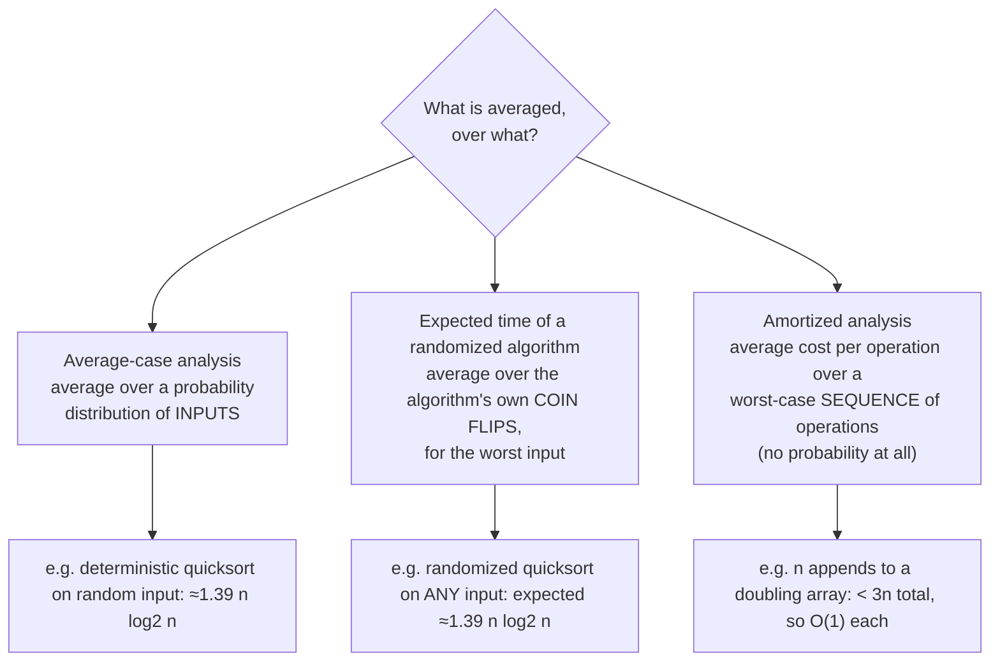
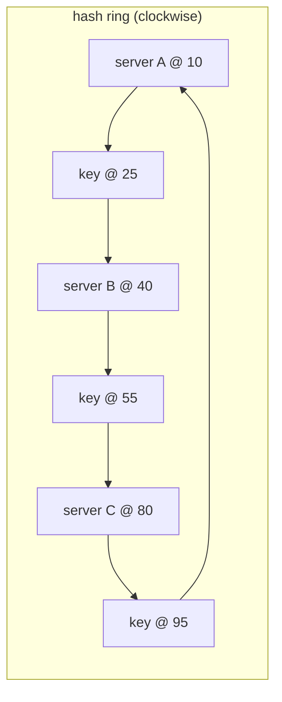

# Lesson 16 · Randomized, Amortized and Streaming Algorithms (Beyond the Textbook)

> **Why this matters.** Two ideas quietly power most large systems. **Amortized analysis** explains why "sometimes expensive" operations (resizing a hash table, compressing paths in union-find) are cheap on the whole. **Randomization** gives simple algorithms with excellent expected performance (randomized quicksort), fast tests that are wrong with astronomically small probability (Miller–Rabin), and tiny summaries of huge data streams (Bloom filters, Count-Min, HyperLogLog). Levitin touches both (average-case quicksort in §5.2, hashing in §7.3, the "amortized efficiency" remark in §2.1); this lesson turns them into working tools with proofs.

| 🎮 Simulations | 🏟️ Arena | 🐍 Code |
|---|---|---|
| [Amortized (dynamic array doubling, potential method)](https://normansrule.github.io/algorithm-forge/sims/amortized.html) · [Bloom filter](https://normansrule.github.io/algorithm-forge/sims/bloom-filter.html) · also [sorting-studio](https://normansrule.github.io/algorithm-forge/sims/sorting-studio.html) (quicksort), [search-lab](https://normansrule.github.io/algorithm-forge/sims/search-lab.html) (quickselect), [hashing](https://normansrule.github.io/algorithm-forge/sims/hashing.html) | [Chapter 16 problems](https://normansrule.github.io/algorithm-forge/arena/?chapter=16) | [`ch16_randomized.py`](../../src/python/algoforge/ch16_randomized.py) |

**Prerequisites:** [Lesson 2](../02-analysis-framework/README.md) (worst/average case, summations), [Lesson 5](../05-divide-and-conquer/README.md) (quicksort), [Lesson 7](../07-space-time-tradeoffs/README.md) (hashing), [Lesson 13](../13-advanced-data-structures/README.md) (dynamic arrays, union-find).

**Conventions.** `Random(a, b)` returns a uniformly random integer in $[a, b]$; `RandomReal()` returns a uniform real in $[0, 1)$. $H_n = 1 + \frac12 + \dots + \frac1n \approx \ln n + 0.577$ is the $n$-th harmonic number.

---

## The big idea in 60 seconds

Three different kinds of "average" appear in algorithm analysis, and mixing them up is the most common mistake on exams and in design reviews:



Then **streaming** algorithms add a fourth constraint: the data passes by once, and you may keep only a tiny summary (kilobytes for billions of items), accepting a small, *quantified* error.

---

# Part A · Amortized analysis done right

> 📝 **Course quiz insight.** Amortized analysis bounds the **average cost per operation over a worst-case sequence** of operations. It is **not** an average over random inputs (that is average-case analysis), it involves **no probability**, and it is **not** a bound on each operation separately (a single operation may be expensive). If an amortized bound is $O(1)$, then **any** sequence of $m$ operations costs $O(m)$ in total, guaranteed.

## Build Card 1 · Three methods on three classic examples

🎯 **Problem.** Some operations are usually cheap but occasionally expensive. Bound the **total** cost of any sequence of $m$ operations, then divide by $m$.

📖 **Story.** A monthly transit pass: some days you ride once, some days ten times. The fair "cost per ride" is the total bill over the whole month divided by rides, not the most expensive day and not a guess about a typical day.

👀 **Picture.** Watch credits accumulate and get spent in [amortized.html](https://normansrule.github.io/algorithm-forge/sims/amortized.html).

```
binary counter (4 bits), 8 increments
n  bits  flips  total   #ones (= potential Φ)
1  0001    1      1       1
2  0010    2      3       1
3  0011    1      4       2
4  0100    3      7       1
5  0101    1      8       2
6  0110    2     10       2
7  0111    1     11       3
8  1000    4     15       1        total 15 < 2·8 = 16
```

🧱 **The three methods.**

| Method | Idea | How you write the proof |
|---|---|---|
| **Aggregate** | Bound the total $T(m)$ directly | "Bit $i$ flips $\lfloor m/2^i \rfloor$ times, so $T(m) < \sum_i m/2^i = 2m$." |
| **Accounting** (banker's) | Charge each operation a fixed **amortized price**; cheap operations overpay and store **credits** on the data structure; expensive ones spend credits | Show credit never goes negative. |
| **Potential** (physicist's) | Define $\Phi(\text{state}) \ge 0$ with $\Phi_0 = 0$; amortized cost $\hat c_i = c_i + \Phi_i - \Phi_{i-1}$ | Sum telescopes: $\sum c_i = \sum \hat c_i - \Phi_m + \Phi_0 \le \sum \hat c_i$. |

**Example 1: binary counter.** An increment that flips $t$ trailing 1s to 0 and one 0 to 1 costs $t + 1$.
- *Accounting:* charge 2 per increment: 1 pays for setting a bit to 1, and 1 credit stays on that bit to pay for resetting it later. Every 1-bit holds a credit, so resets are prepaid.
- *Potential:* $\Phi$ = number of 1-bits. $\hat c = (t + 1) + (1 - t) = 2$. So $m$ increments cost $\le 2m$.

**Example 2: stack with `multipop(k)`.** Push costs 1, pop costs 1, `multipop(k)` pops $\min(k, \text{size})$ items. One multipop can cost $n$, yet any $m$ operations cost $\le 2m$: each item is popped at most once per push (aggregate), or charge 2 per push and 0 for pops (accounting), or $\Phi$ = stack size (potential: push $1 + 1 = 2$; pop and multipop $c - c = 0$).

**Example 3: dynamic array with doubling** ([Lesson 13](../13-advanced-data-structures/README.md#build-card-1--dynamic-array-amortized-doubling)). Let $\Phi = 2\cdot\text{size} - \text{capacity}$ (nonnegative once the array is at least half full, which doubling guarantees).
- Append without growth: $c = 1$, $\Delta\Phi = 2$, $\hat c = 3$.
- Append that doubles from capacity $k$ (size $k$ → $k+1$): $c = k + 1$, $\Phi$ goes from $2k - k = k$ to $2(k+1) - 2k = 2$, so $\hat c = (k+1) + (2 - k) = 3$.
- So every append costs 3 amortized; $m$ appends cost $\le 3m$.

✋ **Trace.** In the table above, increments 4 and 8 are expensive (3 and 4 flips), but the running total never exceeds $2n$, and $\hat c = \text{flips} + \Delta\Phi$ is exactly 2 on every row (for row 8: $4 + (1 - 3) = 2$).

💻 **Forge Pseudocode**

```
ALGORITHM Increment(B[0..k-1])
    // B is a binary counter, B[0] is the least significant bit
    i ← 0
    while i < k and B[i] = 1 do
        B[i] ← 0                          // spends the credit stored on this bit
        i ← i + 1
    if i < k then
        B[i] ← 1                          // pays 1 now, stores 1 credit on the bit
```

<details><summary>Python: measure actual cost and check the potential-method bound</summary>

```python
class Counter:
    def __init__(self, k):
        self.b = [0] * k
    def increment(self):
        i = cost = 0
        while i < len(self.b) and self.b[i] == 1:
            self.b[i] = 0; i += 1; cost += 1
        if i < len(self.b):
            self.b[i] = 1; cost += 1
        return cost
    def potential(self):
        return sum(self.b)

class MultipopStack:
    def __init__(self):
        self.s = []
    def push(self, x):
        self.s.append(x); return 1
    def multipop(self, k):
        c = 0
        while self.s and c < k:
            self.s.pop(); c += 1
        return c

if __name__ == "__main__":
    import random
    c, flips = Counter(32), 0
    for _ in range(1000):
        before = c.potential()
        cost = c.increment()
        assert cost + c.potential() - before == 2          # amortized cost exactly 2
        flips += cost
    assert flips == 1994 and flips <= 2 * 1000
    st, total, ops = MultipopStack(), 0, 0
    for _ in range(10_000):
        total += st.push(0) if random.random() < 0.7 else st.multipop(random.randint(1, 50))
        ops += 1
    assert total <= 2 * ops
    print("counter: 1000 increments cost", flips, "flips (bound 2000); multipop bound holds")
```

</details>

<details><summary>Java</summary>

```java
class AmortizedDemo {
    public static void main(String[] args) {
        int[] b = new int[32]; long total = 0;
        for (int n = 1; n <= 1000; n++) {
            int i = 0;
            while (b[i] == 1) { b[i] = 0; i++; total++; }
            b[i] = 1; total++;
        }
        System.out.println("1000 increments -> " + total + " bit flips (bound 2000)"); // 1994
    }
}
```

</details>

🧮 **Analysis summary.** Counter: $O(1)$ amortized, $O(\log n)$ worst single increment. Multipop stack: $O(1)$ amortized, $O(n)$ worst single operation. Doubling array: $O(1)$ amortized, $O(n)$ worst single append. The same "each element is charged a constant number of times" argument shows why sliding windows and monotonic stacks are linear ([Lesson 15](../15-dp-and-interview-patterns/README.md)).

⚠️ **Pitfalls.** Calling an amortized bound "average case". Choosing a potential that can go **negative** (the telescoping argument then fails). Forgetting that amortized bounds say nothing about latency of an individual operation: real-time systems care.

🔁 **Where it's used.** Every growable container (Python `list`, Java `ArrayList`, C++ `vector`), hash-table resizing, union-find, splay trees, garbage collectors (the cost of a collection is amortized over allocations), write-ahead logs with periodic compaction.

---

# Part B · Randomized algorithms

## Build Card 2 · Las Vegas vs Monte Carlo

🎯 **Problem.** Use random choices to make algorithms simpler, faster on every input in expectation, or able to do things deterministic methods can't do cheaply.

📖 **Story.** A **Las Vegas** algorithm is a gambler who always leaves with the right answer, but you don't know how long they'll play. A **Monte Carlo** algorithm leaves at closing time for sure, but might occasionally be wrong.

| | Las Vegas | Monte Carlo |
|---|---|---|
| Answer | always correct | correct with probability $\ge 1 - \varepsilon$ |
| Running time | random (analyze its **expectation**) | bounded |
| Examples | randomized quicksort, quickselect, treaps, skip lists | Miller–Rabin, Karger's min cut, Bloom filters, sketches |
| Improve by | nothing needed (or restart if slow) | repeating independent runs: error $\varepsilon^k$ |

A Monte Carlo algorithm whose answer you can **verify** cheaply becomes Las Vegas: repeat until the check passes.

**Why randomize at all?** (1) No adversary can craft a bad input, because the bad cases depend on coin flips, not on the input. (2) Simplicity: randomized quicksort, treaps and skip lists are shorter than their deterministic worst-case cousins. (3) Some problems (primality in practice, distinct counting in small memory) have far cheaper randomized solutions.

---

## Build Card 3 · Randomized quicksort: expected $2n\ln n \approx 1.39\, n\log_2 n$ comparisons

🎯 **Problem.** Levitin's quicksort (Levitin §5.2) is $\Theta(n^2)$ on sorted input with a first-element pivot. Pick the pivot **uniformly at random** so that every input has the good expected cost.

📖 **Story.** Instead of hoping the input is shuffled, shuffle your pivot choices.

👀 **Picture.** Compare pivot rules in [sorting-studio.html](https://normansrule.github.io/algorithm-forge/sims/sorting-studio.html).

🧱 **Build it in blocks.** Take any partition-based quicksort and add one line: swap a random element into the pivot position before partitioning.

✋ **The expected-comparisons proof (indicator variables).** Let $z_1 < z_2 < \dots < z_n$ be the sorted values. $z_i$ and $z_j$ ($i < j$) are compared **at most once**, and only if one of them is the **first pivot chosen** among $\{z_i, \dots, z_j\}$ (any pivot strictly between them separates them forever). All $j - i + 1$ candidates are equally likely to be first, so

$$\Pr[z_i \text{ and } z_j \text{ compared}] = \frac{2}{j - i + 1}.$$

By linearity of expectation, with $k = j - i + 1$:

$$E[C] = \sum_{i<j} \frac{2}{j-i+1} = \sum_{k=2}^{n} (n - k + 1)\frac{2}{k} = 2(n+1)H_n - 4n \approx 2n\ln n - 2.85n.$$

Since $\ln n = \ln 2 \cdot \log_2 n$, the leading term is $2\ln 2 \cdot n\log_2 n \approx 1.386\, n\log_2 n$, matching Levitin's average-case figure for quicksort, but now it holds **for every input**.

| $n$ | measured average (20 runs, sorted input!) | exact $2(n+1)H_n - 4n$ | leading term $2n\ln n$ |
|---|---|---|---|
| 100 | 643 | 648 | 921 |
| 1,000 | 11,093 | 10,986 | 13,816 |
| 10,000 | 156,787 | 155,772 | 184,207 |

The lower-order $-2.85n$ term matters at practical sizes; the ratio to $2n \ln n$ approaches 1 only slowly.

💻 **Forge Pseudocode**

```
ALGORITHM RandomizedQuicksort(A[l..r])
    if l < r then
        p ← Random(l, r)
        swap A[p] and A[r]                // random pivot moved to the end
        s ← LomutoPartition(A[l..r])
        RandomizedQuicksort(A[l..s-1])
        RandomizedQuicksort(A[s+1..r])

ALGORITHM LomutoPartition(A[l..r])
    // pivot is A[r]; returns its final index
    pivot ← A[r]
    i ← l
    for j ← l to r - 1 do
        if A[j] < pivot then
            swap A[i] and A[j]
            i ← i + 1
    swap A[i] and A[r]
    return i
```

<details><summary>Python (counts comparisons)</summary>

```python
import random

def randomized_quicksort(a, rng=random):
    comparisons = 0
    def sort(lo, hi):
        nonlocal comparisons
        while lo < hi:
            p = rng.randint(lo, hi)
            a[p], a[hi] = a[hi], a[p]
            pivot, i = a[hi], lo
            for j in range(lo, hi):
                comparisons += 1
                if a[j] < pivot:
                    a[i], a[j] = a[j], a[i]; i += 1
            a[i], a[hi] = a[hi], a[i]
            if i - lo < hi - i:                 # recurse on the smaller side: O(log n) stack
                sort(lo, i - 1); lo = i + 1
            else:
                sort(i + 1, hi); hi = i - 1
    sort(0, len(a) - 1)
    return comparisons

if __name__ == "__main__":
    import math
    rng = random.Random(1)
    n = 1000
    runs = [randomized_quicksort(list(range(n)), rng) for _ in range(20)]   # sorted input
    avg = sum(runs) / len(runs)
    exact = 2 * (n + 1) * sum(1 / k for k in range(1, n + 1)) - 4 * n
    assert abs(avg - exact) / exact < 0.05
    b = [rng.randint(0, 99) for _ in range(500)]
    randomized_quicksort(b, rng)
    assert b == sorted(b)
    print(f"n={n}: average {avg:.0f} comparisons vs exact expectation {exact:.0f}")
```

</details>

🧮 **Analysis.** Expected $\Theta(n \log n)$ for every input; worst case still $\Theta(n^2)$ but with probability that is vanishingly small for large $n$. Recursing on the smaller side first bounds the stack at $O(\log n)$.

⚠️ **Pitfalls.** Many equal keys: Lomuto partition degrades to $\Theta(n^2)$ on all-equal input; use three-way partitioning ("Dutch national flag"). Using a predictable seed on attacker-controlled data.

🔁 **Where it's used.** Most standard-library sorts descend from quicksort with pivot sampling: C++ `std::sort` (introsort), Java's dual-pivot quicksort for primitives, Go's pattern-defeating quicksort (pdqsort) and Rust's pdqsort-derived unstable sort.

---

## Build Card 4 · Randomized quickselect

🎯 **Problem.** Find the $k$-th smallest element (median, percentiles) in expected linear time. Levitin presents quickselect with Lomuto partitioning (Levitin §4.5); randomizing the pivot removes the bad inputs.

📖 **Story.** Quicksort that recurses into **only one** side: the side that contains position $k$.

🧱 **Build it in blocks.** Partition around a random pivot at final index $s$. If $s = k$, done; if $k < s$, continue on the left; else on the right.

✋ **Trace.** Find the $k = 3$ (0-based, i.e. 4th smallest) of `[9, 4, 7, 1, 8, 2, 6]`. Suppose the random pivot is 6 (already last): Lomuto partitioning gives `[4, 1, 2, 6, 8, 7, 9]` with 6 at index 3 = $k$ → answer **6**. (Sorted: 1, 2, 4, **6**, 7, 8, 9.) With a pivot of 2 instead: 2 lands at index 1 < 3, so continue on the right part only.

💻 **Forge Pseudocode**

```
ALGORITHM QuickSelect(A[l..r], k)
    // returns the element that would be at index k if A were sorted (l ≤ k ≤ r)
    while true do
        p ← Random(l, r)
        swap A[p] and A[r]
        s ← LomutoPartition(A[l..r])
        if s = k then
            return A[s]
        else if k < s then
            r ← s - 1
        else
            l ← s + 1
```

<details><summary>Python</summary>

```python
import random

def quickselect(a, k, rng=random):
    a = list(a)
    lo, hi = 0, len(a) - 1
    while True:
        p = rng.randint(lo, hi)
        a[p], a[hi] = a[hi], a[p]
        pivot, i = a[hi], lo
        for j in range(lo, hi):
            if a[j] < pivot:
                a[i], a[j] = a[j], a[i]; i += 1
        a[i], a[hi] = a[hi], a[i]
        if i == k:
            return a[i]
        if k < i:
            hi = i - 1
        else:
            lo = i + 1

if __name__ == "__main__":
    data = [9, 4, 7, 1, 8, 2, 6]
    assert [quickselect(data, k) for k in range(7)] == sorted(data)
    rng = random.Random(3)
    for _ in range(200):
        xs = [rng.randint(0, 50) for _ in range(rng.randint(1, 40))]
        k = rng.randrange(len(xs))
        assert quickselect(xs, k, rng) == sorted(xs)[k]
    print("median of", data, "=", quickselect(data, 3))
```

</details>

🧮 **Analysis.** Expected $O(n)$ comparisons. Crude argument: with probability $\ge 1/2$ the pivot lands in the middle half of the range, shrinking it to at most $3/4$ of its size, so on average at most 2 partitions happen per "shrink phase", and the expected work is at most $2(n + \frac34 n + (\frac34)^2 n + \dots) = 8n$. The exact analysis (Knuth) gives about $2(1 + \ln 2)\,n \approx 3.39n$ for the median, the worst choice of $k$. The deterministic "median of medians" achieves $O(n)$ worst case but with much larger constants.

⚠️ **Pitfalls.** Same equal-keys issue as quicksort (use three-way partitioning). Off-by-one between "$k$-th smallest" (1-based) and index $k$ (0-based).

🔁 **Where it's used.** C++ `std::nth_element`, NumPy `np.partition`, percentile computations in monitoring (p50/p99 latency) when data fits in memory.

---

## Build Card 5 · Karger's min-cut (Monte Carlo)

🎯 **Problem.** Find a minimum cut of an undirected graph: the fewest edges whose removal disconnects it.

📖 **Story.** Pick a random edge and **contract** it (merge its endpoints, keep parallel edges, drop self-loops). Repeat until two super-vertices remain; the edges between them form a cut. Min-cut edges are few, so random contractions rarely hit them.

👀 **Picture.** Two 4-cliques joined by 2 bridge edges: min cut = 2.

```
  (0)-(1)            (4)-(5)
   | \/ |    0—4     | \/ |
   | /\ |    3—7     | /\ |
  (3)-(2)            (7)-(6)
```

🧱 **Build it in blocks.** Contracting edges in a uniformly random order until 2 components remain is the same as running **Kruskal on a random permutation of edges** with union-find ([Lesson 13](../13-advanced-data-structures/README.md)), stopping at 2 components. The cut = edges whose endpoints end in different components.

✋ **Why it works (probability bound).** Let the min cut have $c$ edges. Every vertex has degree $\ge c$, so there are $\ge nc/2$ edges. The chance the first contraction hits a cut edge is $\le c / (nc/2) = 2/n$. Continuing with $n-1, n-2, \dots, 3$ vertices:

$$\Pr[\text{cut survives}] \ge \prod_{i=3}^{n}\Big(1 - \frac{2}{i}\Big) = \frac{2}{n(n-1)}.$$

Repeat $T = \binom{n}{2}\ln n$ independent times and keep the smallest cut: failure probability $\le (1 - 1/\binom n2)^T \le e^{-\ln n} = 1/n$. On the 8-vertex example the bound says $\ge 2/56 \approx 3.6\%$ per run; measured over 10,000 runs, **22%** of runs find the cut of size 2.

💻 **Forge Pseudocode**

```
ALGORITHM KargerOnce(n, edges[0..m-1])
    // uses MakeSets/Find/Union from Lesson 13 (paste them below this)
    for i ← m - 1 downto 1 do               // shuffle edges uniformly at random:
        j ← Random(0, i)                    // Fisher–Yates, Build Card 13
        swap edges[i] and edges[j]
    (parent, size) ← MakeSets(n)
    components ← n
    for each (u, v) in edges do
        if components > 2 and Union(parent, size, u, v) then
            components ← components - 1
    cut ← 0
    for each (u, v) in edges do
        if Find(parent, u) ≠ Find(parent, v) then
            cut ← cut + 1
    return cut
```

<details><summary>Python</summary>

```python
import random, math

def karger_once(n, edges, rng):
    parent = list(range(n))
    def find(x):
        while parent[x] != x:
            parent[x] = parent[parent[x]]; x = parent[x]
        return x
    order = edges[:]
    rng.shuffle(order)
    comps = n
    for u, v in order:
        if comps == 2:
            break
        ru, rv = find(u), find(v)
        if ru != rv:
            parent[ru] = rv; comps -= 1
    return sum(1 for u, v in edges if find(u) != find(v))

def karger(n, edges, seed=0):
    rng = random.Random(seed)
    trials = int(n * (n - 1) / 2 * math.log(n)) + 1
    return min(karger_once(n, edges, rng) for _ in range(trials))

if __name__ == "__main__":
    E = [(i, j) for i in range(4) for j in range(i + 1, 4)] + \
        [(i, j) for i in range(4, 8) for j in range(i + 1, 8)] + [(0, 4), (3, 7)]
    rng = random.Random(7)
    success = sum(karger_once(8, E, rng) == 2 for _ in range(10_000)) / 10_000
    assert success >= 2 / (8 * 7)
    assert karger(8, E) == 2
    print(f"single-run success {success:.1%} (bound {2/56:.1%}); repeated runs find min cut 2")
```

</details>

🧮 **Analysis.** One run is $O(m\,\alpha(n))$ with union-find; $O(n^2 \log n)$ runs give $O(n^2 m \log n)$ total. The Karger–Stein refinement (recursive contraction, sharing early work) brings it to $O(n^2 \log^3 n)$. Deterministic alternatives: max-flow-based ($n-1$ flow computations) or Stoer–Wagner in $O(nm + n^2\log n)$.

⚠️ **Pitfalls.** Sampling an edge uniformly means **with multiplicity** (parallel edges after contraction count separately); the random-permutation trick handles this automatically. One run is not enough: always repeat.

🔁 **Where it's used.** As a teaching gem more than production code, but the ideas (random contraction, sampling to sparsify graphs) power modern network-reliability estimation and graph sparsifiers; Karger's analysis style is the template for many randomized graph algorithms.

---

## Build Card 6 · Miller–Rabin primality test (Monte Carlo)

🎯 **Problem.** Decide whether a large $n$ (hundreds of digits) is prime. Trial division needs $\sqrt n$ steps: hopeless for 2048-bit numbers.

📖 **Story.** Fermat's little theorem: if $n$ is prime, $a^{n-1} \equiv 1 \pmod n$. Checking this is fast (exponentiation by squaring, Levitin §6.5), but some composites (**Carmichael numbers**, like 561) pass for every base coprime to them. Miller–Rabin adds a second check: modulo a prime, the only square roots of 1 are $\pm 1$.

🧱 **Build it in blocks.**
1. Write $n - 1 = 2^s d$ with $d$ odd.
2. Pick a base $a$. Compute $x = a^d \bmod n$. If $x = 1$ or $x = n - 1$, $a$ is **not a witness** (probably prime).
3. Square up to $s - 1$ times; if you hit $n - 1$, not a witness.
4. Otherwise $a$ **proves** $n$ composite.
5. Repeat with $k$ random bases. For composite $n$, at least $3/4$ of bases are witnesses (Rabin), so error $\le 4^{-k}$.

✋ **Trace: $n = 561 = 3 \cdot 11 \cdot 17$.** $560 = 2^4 \cdot 35$. Base 2: $2^{35} \bmod 561 = 263$ (not $\pm 1$). Squaring: $263^2 \equiv 166$, $166^2 \equiv 67$, $67^2 \equiv 1$. We reached 1 without passing through 560, so **67 is a nontrivial square root of 1**: 561 is composite. (Fermat alone is fooled: $2^{560} \equiv 1 \pmod{561}$.)

💻 **Forge Pseudocode**

```
ALGORITHM MillerRabin(n, k)
    // n > 3 odd; returns false if definitely composite, true if probably prime
    d ← n - 1
    s ← 0
    while d mod 2 = 0 do
        d ← d div 2
        s ← s + 1
    for round ← 1 to k do
        a ← Random(2, n - 2)
        x ← PowerMod(a, d, n)             // exponentiation by squaring
        if x ≠ 1 and x ≠ n - 1 then
            witness ← true
            for r ← 1 to s - 1 do
                x ← (x * x) mod n
                if x = n - 1 then
                    witness ← false
            // (a real implementation stops the loop as soon as x = n - 1)
            if witness then
                return false
    return true

ALGORITHM PowerMod(a, e, n)
    // a^e mod n by repeated squaring (Forge numbers are exact below 2^53, so keep n < 90,000,000)
    result ← 1
    a ← a mod n
    while e > 0 do
        if e mod 2 = 1 then
            result ← (result * a) mod n
        a ← (a * a) mod n
        e ← e div 2
    return result
```

<details><summary>Python</summary>

```python
import random

def is_probable_prime(n, k=20, rng=random):
    if n < 2:
        return False
    small = [2, 3, 5, 7, 11, 13, 17, 19, 23, 29, 31, 37]
    for p in small:
        if n % p == 0:
            return n == p
    d, s = n - 1, 0
    while d % 2 == 0:
        d //= 2; s += 1
    def witness(a):
        x = pow(a, d, n)
        if x in (1, n - 1):
            return False
        for _ in range(s - 1):
            x = x * x % n
            if x == n - 1:
                return False
        return True
    # these 12 bases are a proven deterministic set for every n < 3.18 * 10^23 (so all 64-bit n)
    bases = small if n < 318_665_857_834_031_151_167_461 else [rng.randrange(2, n - 1) for _ in range(k)]
    return not any(witness(a) for a in bases)

if __name__ == "__main__":
    def trial(n):
        return n >= 2 and all(n % p for p in range(2, int(n ** 0.5) + 1))
    assert all(is_probable_prime(n) == trial(n) for n in range(2, 20_000))
    assert not is_probable_prime(561) and pow(2, 560, 561) == 1           # Carmichael number
    assert is_probable_prime(2 ** 127 - 1)                                  # a Mersenne prime
    assert not is_probable_prime((2 ** 61 - 1) * (2 ** 31 - 1))
    print("Miller-Rabin agrees with trial division below 20000; 2^127 - 1 is prime")
```

</details>

🧮 **Analysis.** Each round is one modular exponentiation: $O(\log n)$ multiplications of $O(\log n)$-bit numbers, so $O(k \log^3 n)$ with schoolbook multiplication. Error $\le 4^{-k}$; with $k = 40$, that's below $10^{-24}$, far less than the chance of a hardware fault during the computation. (A deterministic polynomial test, the Agrawal–Kayal–Saxena (AKS) test of 2002, exists but is much slower in practice.)

⚠️ **Pitfalls.** Forgetting small cases ($n < 4$, even $n$). Overflow when squaring 64-bit values (use 128-bit multiplication or big integers). Using a fixed small set of bases on adversarial inputs larger than the proven range.

🔁 **Where it's used.** Generating Rivest–Shamir–Adleman (RSA) keys and Diffie–Hellman parameters in OpenSSL and other cryptographic libraries; Java's `BigInteger.isProbablePrime`; computer-algebra systems.

---

# Part C · Hashing, sketches and sampling

## Build Card 7 · Universal hashing

🎯 **Problem.** Hash tables are $O(1)$ on average only if keys spread evenly. A fixed hash function has bad inputs, and attackers can find them ("hash flooding"). Choose the hash function **at random** from a family so that no input is bad in expectation.

📖 **Story.** The attacker writes the guest list, but you pick the seating rule after seeing it... or rather, you pick it secretly at random, so the attacker can't plan collisions.

🧱 **Definition and construction.** A family $\mathcal H$ of functions $U \to \{0, \dots, m-1\}$ is **universal** if for all keys $x \ne y$: $\Pr_{h \in \mathcal H}[h(x) = h(y)] \le 1/m$. The Carter–Wegman family: pick a prime $p > |U|$, random $a \in \{1, \dots, p-1\}$, $b \in \{0, \dots, p-1\}$:

$$h_{a,b}(x) = \big((a x + b) \bmod p\big) \bmod m.$$

**Consequence:** with chaining, the expected length of the chain that key $x$ lands in is $\le 1 + n/m$ (the load factor $\alpha$), for **every** set of $n$ keys.

✋ **Trace.** $p = 17$, $m = 5$, $a = 3$, $b = 7$: keys 0..9 hash to `2, 0, 3, 1, 2, 0, 3, 1, 4, 0`. A different random $(a, b)$ would scatter the same keys differently; no fixed key set is bad for most choices.

💻 **Forge Pseudocode**

```
ALGORITHM MakeUniversalHash(p, m)
    // p prime, larger than any key
    a ← Random(1, p - 1)
    b ← Random(0, p - 1)
    return (a, b)

ALGORITHM UniversalHash(a, b, p, m, x)
    return ((a * x + b) mod p) mod m
```

<details><summary>Python (empirical collision rate)</summary>

```python
import random

P = 2_147_483_647          # the Mersenne prime 2^31 - 1

def make_hash(m, rng):
    a, b = rng.randrange(1, P), rng.randrange(0, P)
    return lambda x: ((a * x + b) % P) % m

if __name__ == "__main__":
    rng = random.Random(0)
    x, y, m, trials = 1234, 98765, 100, 20_000
    collisions = 0
    for _ in range(trials):
        h = make_hash(m, rng)
        collisions += h(x) == h(y)
    rate = collisions / trials
    assert rate < 1.5 / m
    h = make_hash(5, rng)
    print(f"collision rate for a fixed pair over random h: {rate:.4f} (bound 1/m = {1/m})")
```

</details>

🧮 **Analysis.** Evaluating $h$ is $O(1)$. For strings, use polynomial hashing with a random base modulo a prime, or keyed hash functions (SipHash) that are designed to resist attackers who see outputs.

⚠️ **Pitfalls.** Choosing $m$ with a common factor structure and a weak hash (e.g. `x mod 2^k` on keys that are multiples of 8). Re-seeding per process only: long-running servers leaking hash order can still be attacked.

🔁 **Where it's used.** Python randomizes string hashing per process (SipHash, since Python 3.4) and Rust's `HashMap` uses randomly keyed SipHash by default: both are defenses against hash-flooding denial-of-service attacks. Universal families also power the sketches below (Count-Min needs pairwise-independent hashes).

---

## Build Card 8 · Bloom filters

🎯 **Problem.** Answer "have I seen $x$?" for millions or billions of items using a few bits per item, allowing **false positives** but **no false negatives**.

📖 **Story.** A wall of light switches. Each item flips on $k$ specific switches. To ask about an item, check its $k$ switches: if any is off, it was **definitely never** added; if all are on, it was **probably** added (other items may have turned those switches on).

👀 **Picture.** Play with $m$, $k$ and insertions in [bloom-filter.html](https://normansrule.github.io/algorithm-forge/sims/bloom-filter.html).

```
m = 10 bits, k = 2 toy hashes h1(x) = x mod 10, h2(x) = (3x + 1) mod 10
insert 12 → bits 2, 7      insert 37 → bits 7, 2      insert 41 → bits 1, 4
bits: index 0 1 2 3 4 5 6 7 8 9
            0 1 1 0 1 0 0 1 0 0
query 45 → bit 5 is 0          → "definitely not"
query 14 → bits 4 ✔, 3 ✘       → "definitely not"
query 22 → bits 2 ✔, 7 ✔       → "maybe" — a FALSE POSITIVE (22 was never inserted)
```

🧱 **The math.**
- After inserting $n$ items with $k$ hash functions into $m$ bits, a given bit is still 0 with probability $(1 - 1/m)^{kn} \approx e^{-kn/m}$.
- A false positive (FP) needs all $k$ probed bits to be 1:

$$\boxed{\;p_{\text{FP}} \approx \left(1 - e^{-kn/m}\right)^{k}\;}$$

- Minimizing over $k$ gives $k_{\text{opt}} = \frac{m}{n}\ln 2$, where exactly half the bits are 1, and then $p_{\text{FP}} = 2^{-k_{\text{opt}}} \approx 0.6185^{m/n}$.
- Bits needed for a target rate $p$: $\frac{m}{n} = \frac{-\ln p}{(\ln 2)^2} \approx 1.44 \log_2(1/p)$. For $p = 1\%$: **9.6 bits per item** with $k = 7$, no matter how large the items are.

✋ **Worked numbers** (from the formula, $n = 1000$):

| bits per item $m/n$ | $k_{\text{opt}}$ | FP with $k = 3$ | FP with $k_{\text{opt}}$ (rounded) |
|---|---|---|---|
| 8 | 5.5 | 3.06% | 2.16% ($k = 6$) |
| 10 | 6.9 | 1.74% | 0.82% ($k = 7$) |
| 16 | 11.1 | 0.50% | ≈ 0.05% ($k = 11$) |

💻 **Forge Pseudocode**

```
ALGORITHM BloomAdd(B[0..m-1], x, k)
    for i ← 1 to k do
        B[Hash(i, x) mod m] ← 1

ALGORITHM BloomMightContain(B[0..m-1], x, k)
    for i ← 1 to k do
        if B[Hash(i, x) mod m] = 0 then
            return false                  // definitely not present
    return true                           // probably present

ALGORITHM Hash(i, x)
    // Toy hash functions: i = 1 gives x, i = 2 gives 3x + 1 (the picture above).
    // A real filter uses k independent, well-mixed hash functions
    return (2 * i - 1) * x + (i - 1)
```

<details><summary>Python (with double hashing and an empirical false-positive check)</summary>

```python
import hashlib, math

class BloomFilter:
    def __init__(self, n_expected, fp_rate):
        self.m = max(8, int(-n_expected * math.log(fp_rate) / math.log(2) ** 2))
        self.k = max(1, round(self.m / n_expected * math.log(2)))
        self.bits = bytearray((self.m + 7) // 8)

    def _positions(self, item):
        d = hashlib.blake2b(str(item).encode(), digest_size=16).digest()
        h1, h2 = int.from_bytes(d[:8], "big"), int.from_bytes(d[8:], "big") | 1
        return [(h1 + i * h2) % self.m for i in range(self.k)]   # Kirsch–Mitzenmacher double hashing

    def add(self, item):
        for p in self._positions(item):
            self.bits[p >> 3] |= 1 << (p & 7)

    def __contains__(self, item):
        return all(self.bits[p >> 3] >> (p & 7) & 1 for p in self._positions(item))

if __name__ == "__main__":
    n = 10_000
    bf = BloomFilter(n, 0.01)
    for i in range(n):
        bf.add(f"user{i}")
    assert all(f"user{i}" in bf for i in range(n))                  # no false negatives, ever
    fp = sum(f"other{i}" in bf for i in range(100_000)) / 100_000
    predicted = (1 - math.exp(-bf.k * n / bf.m)) ** bf.k
    assert fp < 0.02
    print(f"m={bf.m} bits ({bf.m / n:.1f}/item), k={bf.k}, measured FP {fp:.3%}, formula {predicted:.3%}")
```

</details>

🧮 **Analysis.** Add and query are $O(k)$ hash computations; memory is $m$ bits regardless of item size. Two hash values suffice to simulate $k$ ($h_1 + i\,h_2$) with no loss in the asymptotic false-positive rate.

⚠️ **Pitfalls.** You **cannot delete** from a plain Bloom filter (clearing a bit may create false negatives); use a counting Bloom filter or a cuckoo filter. Adding far more than the planned $n$ items makes the FP rate climb toward 100%. Hashes must be independent-looking; `hash(x) mod m` and `hash(x) mod (m-1)` are not a good pair.

🔁 **Where it's used.** Log-Structured Merge-tree (LSM-tree) databases (LevelDB, RocksDB, Cassandra, HBase) keep one per Sorted String Table (SSTable) file to skip disk reads ([Lesson 13](../13-advanced-data-structures/README.md#build-card-10--storage-engines-b-trees-and-log-structured-merge-trees-lsm-trees)); Content Delivery Networks (CDNs) avoid caching "one-hit wonders"; web crawlers skip already-seen Uniform Resource Locators (URLs); Bitcoin lightweight clients used them to request relevant transactions (Bitcoin Improvement Proposal (BIP) 37).

---

## Build Card 9 · Count-Min sketch

🎯 **Problem.** Estimate how many times each item appears in a stream of $N$ events (heavy hitters, "top talkers"), in memory far smaller than the number of distinct items.

📖 **Story.** Several tally boards, each with a few columns. Every event adds 1 to one column per board (chosen by that board's hash). Collisions only ever **add** extra counts, so each board **overestimates**; the smallest of the boards' counts is the best guess.

🧱 **Build it in blocks.** A $d \times w$ counter matrix with $d$ independent hash functions.
- `update(x, c)`: for each row $i$, `C[i][h_i(x)] += c`.
- `estimate(x)`: $\min_i$ `C[i][h_i(x)]`.
- Guarantee: $\text{true}(x) \le \text{estimate}(x) \le \text{true}(x) + \varepsilon N$ with probability $\ge 1 - \delta$, when $w = \lceil e/\varepsilon \rceil$ and $d = \lceil \ln(1/\delta) \rceil$.

✋ **Trace.** $d = 2$, $w = 4$, toy hashes $h_1(x) = x \bmod 4$, $h_2(x) = \lfloor x/4 \rfloor \bmod 4$. Stream: 1, 5, 1, 2, 1, 9 (true counts: 1→3, 5→1, 2→1, 9→1).

```
row 1 (x mod 4):        col0 0 | col1 5 (1,1,1,5,9) | col2 1 (2) | col3 0
row 2 (x div 4 mod 4):  col0 4 (1,1,1,2) | col1 1 (5) | col2 1 (9) | col3 0
estimate(1) = min(5, 4) = 4   (true 3: overestimate from collisions)
estimate(5) = min(5, 1) = 1   (exact: row 2 had no collision)
```

💻 **Forge Pseudocode**

```
ALGORITHM CMUpdate(C[0..d-1, 0..w-1], x, c)
    for i ← 0 to d - 1 do
        j ← Hash(i, x) mod w
        C[i, j] ← C[i, j] + c

ALGORITHM CMEstimate(C[0..d-1, 0..w-1], x)
    best ← ∞
    for i ← 0 to d - 1 do
        best ← min(best, C[i, Hash(i, x) mod w])
    return best

ALGORITHM Hash(i, x)
    // Toy hash for row i: row 0 gives x, row 1 gives x div 4 (the trace above, with w = 4).
    // A real sketch uses d independent hash functions
    return x div 4^i
```

<details><summary>Python</summary>

```python
import math, random

class CountMin:
    P = 2_147_483_647
    def __init__(self, eps, delta, seed=0):
        self.w = math.ceil(math.e / eps)
        self.d = math.ceil(math.log(1 / delta))
        rng = random.Random(seed)
        self.ab = [(rng.randrange(1, self.P), rng.randrange(self.P)) for _ in range(self.d)]
        self.C = [[0] * self.w for _ in range(self.d)]
        self.N = 0
    def _cols(self, x):
        key = hash(x) & 0x7FFFFFFF
        return [((a * key + b) % self.P) % self.w for a, b in self.ab]
    def update(self, x, c=1):
        self.N += c
        for row, j in enumerate(self._cols(x)):
            self.C[row][j] += c
    def estimate(self, x):
        return min(self.C[row][j] for row, j in enumerate(self._cols(x)))

if __name__ == "__main__":
    rng = random.Random(1)
    stream = [int(rng.paretovariate(1.2)) for _ in range(100_000)]   # skewed, like real traffic
    cm = CountMin(eps=0.001, delta=0.01)
    true = {}
    for x in stream:
        cm.update(x); true[x] = true.get(x, 0) + 1
    worst = max(cm.estimate(x) - c for x, c in true.items())
    assert all(cm.estimate(x) >= c for x, c in true.items())            # never underestimates
    assert worst <= 0.001 * len(stream)
    print(f"{cm.d}x{cm.w} counters for {len(true)} distinct items; max overestimate {worst} <= eps*N = {len(stream) * 0.001:.0f}")
```

</details>

🧮 **Analysis.** $O(d)$ per update/query; memory $O(\frac{1}{\varepsilon}\log\frac1\delta)$ counters, independent of the number of distinct items. **Why the bound holds:** in one row, the expected extra count from colliding items is $\le N/w = \varepsilon N / e$; by Markov's inequality it exceeds $\varepsilon N$ with probability $\le 1/e$; all $d$ rows fail with probability $\le e^{-d} \le \delta$.

⚠️ **Pitfalls.** Relative error is poor for **rare** items (the error is additive, $\varepsilon N$). With deletions (negative updates) take the median, not the min (Count-Median / Count sketch).

🔁 **Where it's used.** Network monitoring (heavy-hitter flows in routers), trending topics, Apache Spark's `countMinSketch` for approximate frequencies, the RedisBloom module's `CMS.*` commands, query planners estimating value frequencies.

---

## Build Card 10 · HyperLogLog (distinct counting)

🎯 **Problem.** Count distinct items (unique visitors, distinct Internet Protocol (IP) addresses) in a stream of billions using about **1–16 KB**, within ~1% error.

📖 **Story.** Flip coins until heads. If someone tells you the longest run of tails they saw was 20, they probably flipped about $2^{20}$ times. Hash each item to random bits; the maximum number of leading zeros seen estimates $\log_2(\text{distinct count})$. Duplicates hash identically, so they don't change the maximum. One estimate is noisy, so split the stream into $m$ buckets and combine them with a **harmonic mean**.

🧱 **Build it in blocks.**
1. Hash $x$ to 64 bits. The low $b$ bits choose a register $j$ ($m = 2^b$ registers).
2. $\rho$ = position of the first 1-bit in the remaining bits (1 + number of leading zeros).
3. $M[j] \leftarrow \max(M[j], \rho)$.
4. Estimate $E = \alpha_m\, m^2 \big/ \sum_j 2^{-M[j]}$ with $\alpha_m \approx 0.7213/(1 + 1.079/m)$; use linear counting $m \ln(m/V)$ when $E$ is small and $V$ registers are still 0.
5. Standard error $\approx 1.04/\sqrt m$. Two HyperLogLog sketches **merge** by taking the register-wise max (count distinct over the union of two streams).

✋ **Numbers.** With $b = 10$ ($m = 1024$ registers of 6 bits, under 1 KB), expected error $1.04/\sqrt{1024} = 3.25\%$. Measured on 1,000 distinct items: estimate 1,007 (+0.7%); on 100,000 distinct items: 102,414 (+2.4%).

💻 **Forge Pseudocode**

```
ALGORITHM HLLAdd(M[0..m-1], b, x)
    // m = 2^b registers. Forge numbers are exact only below 2^53, so this runnable version
    // uses a 32-bit hash; real sketches (and the Python below) use 64 bits
    h ← Hash32(x)
    j ← h mod m                          // low b bits pick a register
    w ← h div m                          // remaining 32 - b bits
    rho ← (32 - b) - BitLength(w) + 1    // leading zeros of w, plus one
    M[j] ← max(M[j], rho)

ALGORITHM Hash32(x)
    // Toy hash of a number to 32 bits: the far decimal digits of sin(x) look random enough here
    t ← abs(sin(x + 1) * 43758.5453)
    return ⌊(t - ⌊t⌋) * 4294967296⌋

ALGORITHM BitLength(w)
    // Number of bits needed to write w in binary (0 for w = 0)
    len ← 0
    while w > 0 do
        w ← w div 2
        len ← len + 1
    return len
```

<details><summary>Python</summary>

```python
import hashlib, math

class HyperLogLog:
    def __init__(self, b=10):
        self.b, self.m = b, 1 << b
        self.M = [0] * self.m
    def add(self, x):
        h = int.from_bytes(hashlib.blake2b(str(x).encode(), digest_size=8).digest(), "big")
        j, w = h & (self.m - 1), h >> self.b
        self.M[j] = max(self.M[j], (64 - self.b) - w.bit_length() + 1)
    def count(self):
        m = self.m
        alpha = 0.7213 / (1 + 1.079 / m)
        E = alpha * m * m / sum(2.0 ** -r for r in self.M)
        zeros = self.M.count(0)
        if E <= 2.5 * m and zeros:
            E = m * math.log(m / zeros)                       # small-range correction
        return E
    def merge(self, other):
        self.M = [max(a, c) for a, c in zip(self.M, other.M)]

if __name__ == "__main__":
    for n in (1_000, 100_000):
        h = HyperLogLog(10)
        for i in range(n):
            h.add(i); h.add(i)                               # duplicates don't matter
        err = abs(h.count() - n) / n
        assert err < 4 * 1.04 / math.sqrt(1024)
        print(f"n={n}: estimate {h.count():.0f} (error {err:.2%}, std error 3.25%)")
    a, c = HyperLogLog(), HyperLogLog()
    for i in range(5000): a.add(i)
    for i in range(3000, 8000): c.add(i)
    a.merge(c)
    assert abs(a.count() - 8000) / 8000 < 0.13
```

</details>

🧮 **Analysis.** $O(1)$ per add, $O(m)$ per count, memory $m$ registers of $\lceil \log_2 64 \rceil = 6$ bits. Error shrinks like $1/\sqrt m$: 4× the memory for half the error.

⚠️ **Pitfalls.** A poor hash (non-uniform bits) biases everything. Very small cardinalities need the linear-counting correction (implemented above); "HyperLogLog++" adds a bias table and a sparse representation.

🔁 **Where it's used.** Redis `PFADD`/`PFCOUNT` (16,384 registers, 12 KB, 0.81% standard error), Google BigQuery `APPROX_COUNT_DISTINCT` (HyperLogLog++), Presto/Trino `approx_distinct`, Apache Druid and many analytics dashboards.

---

## Build Card 11 · Reservoir sampling (with proof)

🎯 **Problem.** Pick $k$ items **uniformly at random** from a stream whose length $n$ is unknown in advance, using $O(k)$ memory and one pass.

📖 **Story.** A jar holds $k$ marbles. The first $k$ go straight in. Marble number $i$ gets into the jar with probability $k/i$, replacing a random marble already there.

🧱 **Algorithm R.**

```
ALGORITHM ReservoirSample(stream, k)
    R ← array(k, null)
    i ← 0
    for each x in stream do
        i ← i + 1
        if i ≤ k then
            R[i - 1] ← x
        else
            j ← Random(1, i)
            if j ≤ k then
                R[j - 1] ← x              // replace a uniformly random slot
    return R
```

✋ **Proof that every item ends up in the sample with probability $k/n$.** Consider item $i$.
- If $i \le k$, it enters for sure. If $i > k$, it enters with probability $k/i$.
- At a later step $t > \max(i, k)$, it is evicted only if item $t$ is accepted (probability $k/t$) **and** picks its slot (probability $1/k$): eviction probability $1/t$, survival $\frac{t-1}{t}$.
- For $i > k$: $\Pr = \frac{k}{i} \cdot \frac{i}{i+1} \cdot \frac{i+1}{i+2} \cdots \frac{n-1}{n} = \frac{k}{n}$ (the product telescopes).
- For $i \le k$: $\Pr = 1 \cdot \frac{k}{k+1} \cdots \frac{n-1}{n} = \frac{k}{n}$. ∎

<details><summary>Python (with an empirical uniformity check)</summary>

```python
import random

def reservoir_sample(stream, k, rng=random):
    R = []
    for i, x in enumerate(stream, start=1):
        if i <= k:
            R.append(x)
        else:
            j = rng.randint(1, i)
            if j <= k:
                R[j - 1] = x
    return R

if __name__ == "__main__":
    rng = random.Random(42)
    counts, trials = [0] * 10, 100_000
    for _ in range(trials):
        for x in reservoir_sample(range(10), 3, rng):
            counts[x] += 1
    freqs = [c / trials for c in counts]
    assert all(abs(f - 0.3) < 0.01 for f in freqs)
    print("inclusion frequencies (expected 0.30 each):", [round(f, 3) for f in freqs])
```

</details>

🧮 **Analysis.** One pass, $O(k)$ memory, one random number per item. Vitter's "Algorithm Z" and the "Algorithm L" variant skip ahead by computing how many items to ignore, needing only $O(k(1 + \log(n/k)))$ random numbers.

⚠️ **Pitfalls.** `Random(1, i)` must include $i$ (off-by-one bias). Weighted sampling needs a different method (e.g. keys $u^{1/w}$ with a top-$k$ heap, Efraimidis–Spirakis).

🔁 **Where it's used.** Sampling logs and traces for debugging and distributed tracing, database `TABLESAMPLE`-style sampling, A/B-testing pipelines, approximate query engines, keeping a representative sample of a sensor stream on a microcontroller.

---

## Build Card 12 · Consistent hashing

🎯 **Problem.** Spread keys over $N$ servers so that when a server is added or removed, **few keys move**. With `hash(key) mod N`, changing $N$ remaps almost everything.

📖 **Story.** Put servers on a clock face at hashed positions. Each key walks clockwise from its own hashed position to the first server it meets. Adding a server only steals the keys in the arc just before it.

👀 **Picture.**



Keys go to the next server clockwise: key@25 → B, key@55 → C, key@95 → A (wraps around).

🧱 **Build it in blocks.**
1. Hash each server to many points ("virtual nodes", e.g. 100–200 each) for even load.
2. Keep all points in a sorted array (or balanced tree).
3. Lookup: binary-search the first point $\ge \text{hash(key)}$, wrapping to the start.
4. Add/remove a server: insert/delete its points; only keys in the affected arcs move.

✋ **Measured.** 10,000 keys, going from 4 to 5 servers: with `mod N`, **79.6%** of keys change server (expected $N/(N+1) = 80\%$: a key stays only if $h \bmod 4 = h \bmod 5$). With a ring of 100 virtual nodes per server, **20.7%** move (expected $1/(N+1) = 20\%$), and every moved key goes to the new server.

💻 **Forge Pseudocode**

```
ALGORITHM RingLookup(points[0..p-1], key)
    // points sorted by position; each point is (position, server)
    h ← Hash(key)
    lo ← 0                               // binary search for the first position ≥ h
    hi ← p
    while lo < hi do
        mid ← (lo + hi) div 2
        if points[mid][0] < h then
            lo ← mid + 1
        else
            hi ← mid
    i ← lo
    if i = p then
        i ← 0                            // wrap around the ring
    return points[i][1]                  // the server

ALGORITHM Hash(key)
    // Toy hash: the ring in the picture has positions 0..99
    return key mod 100
```

<details><summary>Python</summary>

```python
import bisect, hashlib

def h64(s):
    return int.from_bytes(hashlib.blake2b(s.encode(), digest_size=8).digest(), "big")

class HashRing:
    def __init__(self, servers, vnodes=100):
        self.vnodes, self.points = vnodes, []
        for s in servers:
            self.add(s)
    def add(self, server):
        for i in range(self.vnodes):
            bisect.insort(self.points, (h64(f"{server}#{i}"), server))
    def remove(self, server):
        self.points = [p for p in self.points if p[1] != server]
    def lookup(self, key):
        i = bisect.bisect(self.points, (h64(key), ""))
        return self.points[i % len(self.points)][1]

if __name__ == "__main__":
    keys = [f"user{i}" for i in range(10_000)]
    mod4 = {k: h64(k) % 4 for k in keys}
    mod5 = {k: h64(k) % 5 for k in keys}
    moved_mod = sum(mod4[k] != mod5[k] for k in keys) / len(keys)
    ring = HashRing("ABCD")
    before = {k: ring.lookup(k) for k in keys}
    ring.add("E")
    after = {k: ring.lookup(k) for k in keys}
    moved = [k for k in keys if before[k] != after[k]]
    assert all(after[k] == "E" for k in moved)
    assert 0.15 < len(moved) / len(keys) < 0.25 and moved_mod > 0.7
    print(f"mod-N moved {moved_mod:.1%}; ring moved {len(moved) / len(keys):.1%} (all to the new server)")
```

</details>

🧮 **Analysis.** Lookup $O(\log(Nv))$ for $N$ servers with $v$ virtual nodes; adding a server moves about $K/(N+1)$ of $K$ keys (optimal). Load imbalance shrinks as $v$ grows. Alternatives: **rendezvous (highest-random-weight) hashing** ($O(N)$ per lookup, no ring) and **jump consistent hash** (Lamping & Veach, $O(\log N)$ time, $O(1)$ memory, for numbered buckets).

⚠️ **Pitfalls.** Too few virtual nodes → very uneven load. Forgetting replication: real systems store each key on the next $r$ distinct servers clockwise.

🔁 **Where it's used.** Amazon's Dynamo design and Apache Cassandra's token ring, memcached client libraries (the "ketama" scheme), load balancers and Content Delivery Networks routing requests to cache servers; the original 1997 paper is by Karger et al., the same Karger as the min-cut algorithm.

---

## Build Card 13 · Fisher–Yates shuffle (and the classic wrong shuffle)

🎯 **Problem.** Produce a uniformly random permutation: each of the $n!$ orders with probability exactly $1/n!$.

📖 **Story.** Draw cards from a hat one at a time. Fisher–Yates does this in place: the "hat" is the unshuffled prefix of the array.

🧱 **Algorithm (Durstenfeld's in-place version).**

```
ALGORITHM FisherYates(A[0..n-1])
    for i ← n - 1 downto 1 do
        j ← Random(0, i)                  // includes i itself
        swap A[i] and A[j]
```

**Why it's uniform:** the loop makes $n \cdot (n-1) \cdots 2 = n!$ equally likely choice sequences, and each produces a different permutation (position $i$ is fixed forever after step $i$). A bijection between $n!$ equally likely sequences and $n!$ permutations means each permutation has probability $1/n!$.

✋ **The classic wrong shuffle.** "For each $i$, swap $A[i]$ with $A[\text{Random}(0, n-1)]$" makes $n^n$ equally likely choice sequences. For $n = 3$ that's 27 sequences over 6 permutations, and 27 is not divisible by 6, so it **cannot** be uniform. Exact counts for `[1, 2, 3]`:

| permutation | 123 | 132 | 213 | 231 | 312 | 321 |
|---|---|---|---|---|---|---|
| wrong shuffle (out of 27) | 4 | **5** | **5** | **5** | 4 | 4 |
| Fisher–Yates (out of 6) | 1 | 1 | 1 | 1 | 1 | 1 |

Another famous mistake: sorting with a random comparator (`sort(a, (x, y) => random() - 0.5)`), which produces biased orders that depend on the sorting algorithm.

<details><summary>Python (exact enumeration of both shuffles)</summary>

```python
import itertools, random
from collections import Counter

def fisher_yates(a, rng=random):
    a = list(a)
    for i in range(len(a) - 1, 0, -1):
        j = rng.randint(0, i)
        a[i], a[j] = a[j], a[i]
    return a

def enumerate_wrong(n):
    counts = Counter()
    for js in itertools.product(range(n), repeat=n):        # all n^n choice sequences
        a = list(range(1, n + 1))
        for i, j in enumerate(js):
            a[i], a[j] = a[j], a[i]
        counts[tuple(a)] += 1
    return counts

def enumerate_fisher_yates(n):
    counts = Counter()
    for js in itertools.product(*[range(i + 1) for i in range(n - 1, 0, -1)]):   # n! sequences
        a = list(range(1, n + 1))
        for i, j in zip(range(n - 1, 0, -1), js):
            a[i], a[j] = a[j], a[i]
        counts[tuple(a)] += 1
    return counts

if __name__ == "__main__":
    wrong = enumerate_wrong(3)
    assert sorted(wrong.values()) == [4, 4, 4, 5, 5, 5] and wrong[(1, 3, 2)] == 5
    fy = enumerate_fisher_yates(4)
    assert len(fy) == 24 and set(fy.values()) == {1}
    print("wrong shuffle counts:", dict(wrong))
    print("Fisher-Yates on 4 items: each of 24 permutations exactly once")
```

</details>

🧮 **Analysis.** $O(n)$ time, $O(1)$ extra space, $n - 1$ random numbers. It is only as good as the random generator: a generator with a $2^{32}$-state seed cannot reach most of the $52! \approx 8 \times 10^{67}$ deck orders, a real concern for online card games.

⚠️ **Pitfalls.** `Random(0, i - 1)` instead of `Random(0, i)` gives **Sattolo's algorithm** (only cyclic permutations: the element never stays put). `Random(0, n-1)` gives the biased shuffle above. Modulo bias when reducing a random integer with `% (i + 1)`.

🔁 **Where it's used.** Python `random.shuffle`, Java `Collections.shuffle`, and every well-implemented deck shuffle, playlist shuffle and randomized experiment assignment. The 2010 European "browser choice" ballot screen was criticized for using a random-comparator sort that favored some positions.

---

## How a senior engineer thinks about this

- **Name the guarantee precisely.** "$O(1)$ amortized", "$O(n \log n)$ expected", "error $\le 1\%$ with probability 99%" are three different promises. Design docs and code comments should say which one, because the failure modes differ (latency spikes, rare slow runs, wrong answers).
- **Randomness is a dependency.** Seed it deliberately: fixed seeds in tests (reproducible failures), unpredictable seeds (from the operating system) in production when inputs may be adversarial. Log the seed when a randomized job fails.
- **Sketches trade exactness for memory, and that trade must be explicit.** Ask "is 1% error acceptable for this dashboard? for billing?" Distinct-user counts on a dashboard: HyperLogLog is perfect. Invoicing: exact counts only.
- **Mergeability is a superpower.** Bloom filters (bitwise OR), Count-Min (add matrices) and HyperLogLog (register max) can be computed per shard and merged, which is why they dominate distributed analytics.
- **Verify randomized code statistically.** Uniformity tests (like the reservoir and shuffle checks above), measured false-positive rates versus the formula, and brute-force enumeration for tiny sizes. See the testing section of [Lesson 17](../17-senior-engineer-playbook/README.md).

---

## ✅ Check yourself

1. True or false: "Amortized analysis assumes the inputs are random." Explain.
2. A dynamic array **triples** its capacity when full. Using the aggregate method, bound the total copying cost of $n$ appends.
3. With potential $\Phi$ = number of 1-bits, what is the amortized cost of an increment that turns `0111` into `1000`?
4. Why is randomized quicksort's $O(n \log n)$ an *expected* bound but not an *average-case* bound?
5. In the quicksort proof, why are $z_i$ and $z_j$ never compared if a value strictly between them is chosen as a pivot first?
6. Is Karger's algorithm Las Vegas or Monte Carlo? How would you make its error probability below $10^{-6}$?
7. Why does the Fermat test fail on 561, and what extra check does Miller–Rabin add?
8. A Bloom filter has $m = 1{,}000{,}000$ bits and will hold $n = 100{,}000$ items. What is the optimal $k$ and the resulting false-positive rate?
9. Why can a Count-Min sketch overestimate but never underestimate (with non-negative updates)?
10. HyperLogLog with $m = 4096$ registers: what is the standard error? How much memory with 6-bit registers?
11. In reservoir sampling with $k = 1$, what is the probability that the 3rd item of a 5-item stream is the final sample? Show the product.
12. Why is "swap $A[i]$ with $A[\text{Random}(0, n-1)]$ for each $i$" biased for $n = 3$, without computing the table?

<details><summary>Answers</summary>

1. False. Amortized analysis involves no probability: it bounds the total cost of the **worst-case sequence** of operations, then divides by the number of operations.
2. Copies at sizes $1, 3, 9, \dots < n$: a geometric series with sum $< \frac{3}{2} n$. Total $O(n)$, so $O(1)$ amortized per append (with slightly fewer copies than doubling, but more wasted space).
3. Actual cost 4 flips; $\Delta\Phi = 1 - 3 = -2$; amortized $4 - 2 = 2$.
4. The expectation is over the algorithm's own random pivot choices, and it holds for **every** input (including sorted ones). Average-case analysis instead averages over a distribution of inputs for a fixed deterministic algorithm.
5. Partitioning around that pivot sends $z_i$ to the left part and $z_j$ to the right part; the parts are then sorted independently, so the two never meet again.
6. Monte Carlo (fixed running time, possibly wrong answer). One run succeeds with probability $\ge 2/(n(n-1))$; repeating $T = \binom n2 \ln(10^6)$ times gives failure $\le e^{-\ln 10^6} = 10^{-6}$.
7. 561 is a Carmichael number: $a^{560} \equiv 1 \pmod{561}$ for all $a$ coprime to 561. Miller–Rabin also checks the chain of square roots: $67^2 \equiv 1$ but $67 \ne \pm 1$, which is impossible modulo a prime.
8. $m/n = 10$, $k_{\text{opt}} = 10 \ln 2 \approx 6.93$, use 7; FP $\approx (1 - e^{-0.7})^7 \approx 0.82\%$.
9. Each row's counter for $x$ includes all of $x$'s occurrences plus any colliding items' counts (non-negative), so every row is $\ge$ the true count, and so is their minimum.
10. $1.04/\sqrt{4096} = 1.04/64 \approx 1.6\%$. Memory $4096 \times 6$ bits $= 3$ KB.
11. It must be accepted at step 3 (probability $1/3$) and survive steps 4 and 5 (probabilities $3/4$ and $4/5$): $\frac13 \cdot \frac34 \cdot \frac45 = \frac15$. Uniform, as the proof says.
12. There are $3^3 = 27$ equally likely choice sequences but $3! = 6$ permutations. Uniform would require each permutation to get $27/6 = 4.5$ sequences, which isn't an integer.

</details>

---

## Java template pack

<details><summary>Java: <code>RandomizedPack.java</code> (shuffle, reservoir, quicksort, quickselect, Miller–Rabin, Bloom, Count-Min, consistent hashing)</summary>

```java
import java.math.BigInteger;
import java.util.*;

class RandomizedPack {
    static final Random RNG = new Random(42);

    static void fisherYates(int[] a) {
        for (int i = a.length - 1; i > 0; i--) { int j = RNG.nextInt(i + 1); int t = a[i]; a[i] = a[j]; a[j] = t; }
    }
    static int[] reservoir(Iterator<Integer> stream, int k) {
        int[] r = new int[k]; int i = 0;
        while (stream.hasNext()) {
            int x = stream.next(); i++;
            if (i <= k) r[i - 1] = x;
            else { int j = RNG.nextInt(i) + 1; if (j <= k) r[j - 1] = x; }
        }
        return r;
    }
    static int partition(int[] a, int lo, int hi) {
        int p = lo + RNG.nextInt(hi - lo + 1); int t = a[p]; a[p] = a[hi]; a[hi] = t;
        int pivot = a[hi], i = lo;
        for (int j = lo; j < hi; j++) if (a[j] < pivot) { t = a[i]; a[i] = a[j]; a[j] = t; i++; }
        t = a[i]; a[i] = a[hi]; a[hi] = t;
        return i;
    }
    static void quicksort(int[] a, int lo, int hi) {
        while (lo < hi) {
            int s = partition(a, lo, hi);
            if (s - lo < hi - s) { quicksort(a, lo, s - 1); lo = s + 1; } else { quicksort(a, s + 1, hi); hi = s - 1; }
        }
    }
    static int quickselect(int[] a, int k) {
        int lo = 0, hi = a.length - 1;
        while (true) {
            int s = partition(a, lo, hi);
            if (s == k) return a[s];
            if (k < s) hi = s - 1; else lo = s + 1;
        }
    }
    static boolean millerRabin(long n) {
        if (n < 2) return false;
        long[] bases = {2, 3, 5, 7, 11, 13, 17, 19, 23, 29, 31, 37};
        for (long p : bases) if (n % p == 0) return n == p;
        long d = n - 1; int s = 0;
        while (d % 2 == 0) { d /= 2; s++; }
        BigInteger N = BigInteger.valueOf(n), N1 = N.subtract(BigInteger.ONE);
        for (long a : bases) {
            BigInteger x = BigInteger.valueOf(a).modPow(BigInteger.valueOf(d), N);
            if (x.equals(BigInteger.ONE) || x.equals(N1)) continue;
            boolean composite = true;
            for (int r = 1; r < s && composite; r++) { x = x.multiply(x).mod(N); if (x.equals(N1)) composite = false; }
            if (composite) return false;
        }
        return true;                        // deterministic for all 64-bit n with these bases
    }
    static class Bloom {
        final BitSet bits; final int m, k;
        Bloom(int m, int k) { this.m = m; this.k = k; bits = new BitSet(m); }
        int pos(String x, int i) {
            int h1 = x.hashCode(), h2 = (h1 >>> 16) * 0x45d9f3b | 1;
            return Math.floorMod(h1 + i * h2, m);
        }
        void add(String x) { for (int i = 0; i < k; i++) bits.set(pos(x, i)); }
        boolean mightContain(String x) { for (int i = 0; i < k; i++) if (!bits.get(pos(x, i))) return false; return true; }
    }
    static class CountMin {
        final long[][] c; final int w, d; final long[] a, b; static final long P = 2147483647L;
        CountMin(int w, int d) {
            this.w = w; this.d = d; c = new long[d][w]; a = new long[d]; b = new long[d];
            for (int i = 0; i < d; i++) { a[i] = 1 + RNG.nextInt((int) P - 1); b[i] = RNG.nextInt((int) P); }
        }
        int col(int i, int x) { return (int) (((a[i] * (x & 0x7fffffffL) + b[i]) % P) % w); }
        void update(int x) { for (int i = 0; i < d; i++) c[i][col(i, x)]++; }
        long estimate(int x) { long best = Long.MAX_VALUE; for (int i = 0; i < d; i++) best = Math.min(best, c[i][col(i, x)]); return best; }
    }
    static class Ring {
        final TreeMap<Integer, String> points = new TreeMap<>();
        void add(String server) { for (int i = 0; i < 100; i++) points.put((server + "#" + i).hashCode() * 0x9E3779B9, server); }
        String lookup(String key) {
            Map.Entry<Integer, String> e = points.ceilingEntry(key.hashCode() * 0x9E3779B9);
            return (e != null ? e : points.firstEntry()).getValue();
        }
    }

    public static void main(String[] args) {
        int[] a = {9, 4, 7, 1, 8, 2, 6};
        System.out.println("median: " + quickselect(a.clone(), 3));                       // 6
        int[] b = a.clone(); quicksort(b, 0, b.length - 1); System.out.println(Arrays.toString(b));
        System.out.println("561 prime? " + millerRabin(561) + ", 2^61-1 prime? " + millerRabin((1L << 61) - 1)); // false, true
        Bloom bf = new Bloom(96_000, 7);
        for (int i = 0; i < 10_000; i++) bf.add("user" + i);
        int fp = 0; for (int i = 0; i < 100_000; i++) if (bf.mightContain("other" + i)) fp++;
        System.out.println("Bloom false-positive rate ~ " + fp / 1000.0 + "%");
        CountMin cm = new CountMin(2719, 5);
        for (int i = 0; i < 1000; i++) cm.update(i % 10);
        System.out.println("CountMin estimate(3) >= 100: " + cm.estimate(3));
        int[] deck = {1, 2, 3, 4, 5}; fisherYates(deck); System.out.println("shuffled " + Arrays.toString(deck));
        System.out.println("reservoir " + Arrays.toString(reservoir(java.util.stream.IntStream.range(0, 100).iterator(), 3)));
        Ring ring = new Ring(); for (String s : new String[]{"A", "B", "C", "D"}) ring.add(s);
        System.out.println("user42 -> server " + ring.lookup("user42"));
    }
}
```

</details>

---

## 📚 Go deeper

- **CLRS**: Cormen, Leiserson, Rivest and Stein (CLRS), *Introduction to Algorithms*, 3rd ed.: Ch. 17 (Amortized Analysis: aggregate, accounting, potential; binary counter; multipop; dynamic tables), Ch. 5 (Probabilistic Analysis and Randomized Algorithms: indicator random variables, random permutations), Section 7.3–7.4 (randomized quicksort analysis), Section 9.2 (randomized select), Section 11.3.3 (universal hashing), Section 31.8 (primality testing, Miller–Rabin).
- **Motwani & Raghavan, *Randomized Algorithms*** (1995): the classic text; Karger's min cut, Las Vegas vs Monte Carlo, and more.
- **Mitzenmacher & Upfal, *Probability and Computing***: Bloom filters, balls-and-bins, and the probability tools behind sketches.
- **Massachusetts Institute of Technology (MIT) OpenCourseWare** [6.046J Design and Analysis of Algorithms (Spring 2015)](https://ocw.mit.edu/courses/6-046j-design-and-analysis-of-algorithms-spring-2015/): lectures on amortized analysis, randomized algorithms (quicksort, Karger's min cut), and universal/perfect hashing.
- **cp-algorithms.com** pages: [Primality tests](https://cp-algorithms.com/algebra/primality_tests.html) (Fermat, Miller–Rabin, deterministic bases), [Randomized Heap](https://cp-algorithms.com/data_structures/randomized_heap.html), "String Hashing".
- **Papers (English):** B. Bloom, "Space/Time Trade-offs in Hash Coding with Allowable Errors" (1970); G. Cormode & S. Muthukrishnan, "An Improved Data Stream Summary: The Count-Min Sketch and its Applications" (2005); P. Flajolet et al., "HyperLogLog: the analysis of a near-optimal cardinality estimation algorithm" (2007); J. S. Vitter, "Random Sampling with a Reservoir" (1985); D. Karger et al., "Consistent Hashing and Random Trees" (1997); J. Lamping & E. Veach, "A Fast, Minimal Memory, Consistent Hash Algorithm" (2014).
- **Redis documentation** on HyperLogLog (`PFADD`, `PFCOUNT`, `PFMERGE`): a short, practical tour of a production sketch.

**Next:** [Lesson 17 · The Senior Engineer's Playbook](../17-senior-engineer-playbook/README.md) puts everything together: budgets, testing, profiling and design reviews.
