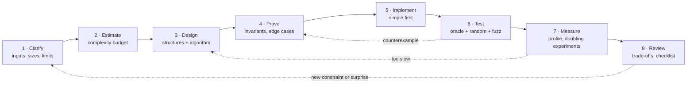
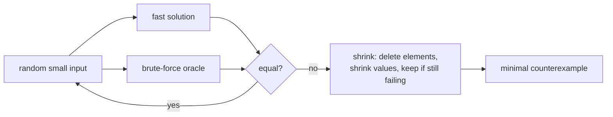
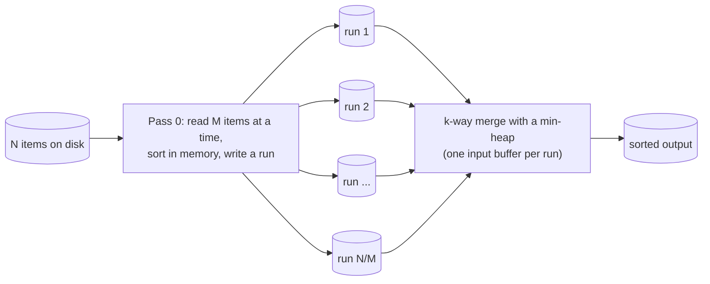
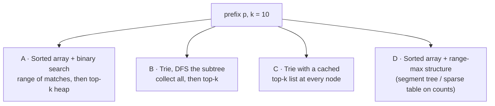

# Chapter 17 · The Senior Engineer's Playbook (Beyond the Textbook)

> **Why this matters.** Knowing 200 algorithms is not what makes someone a senior engineer or an algorithm designer. What does is a **process**: clarify what is really being asked, estimate what is affordable before writing code, choose structures from the operation mix, prove the core invariant, test against a slow-but-obvious oracle, measure instead of guessing, respect the memory hierarchy, and explain trade-offs in a design review. Levitin's §1.2 ("Fundamentals of Algorithmic Problem Solving") sketches this loop in miniature; this lesson is the professional, expanded version, and it ties together every earlier lesson.

| 🎮 Simulations | 🏟️ Arena | 🐍 Code |
|---|---|---|
| [Empirical Lab](https://normansrule.github.io/algorithm-forge/sims/empirical-lab.html) · [Growth Rates](https://normansrule.github.io/algorithm-forge/sims/growth-rates.html) · [Sorting Studio](https://normansrule.github.io/algorithm-forge/sims/sorting-studio.html) · [B-tree](https://normansrule.github.io/algorithm-forge/sims/b-tree.html) · [Trie](https://normansrule.github.io/algorithm-forge/sims/trie.html) · [all simulations](https://normansrule.github.io/algorithm-forge/sims/index.html) · [Raft consensus](https://normansrule.github.io/algorithm-forge/sims/raft-consensus.html) | [Chapter 17 problems](https://normansrule.github.io/algorithm-forge/arena/?chapter=17) | [`ch17_systems.py`](../../src/python/algoforge/ch17_systems.py): LRU cache, LSM compaction, write-ahead-log recovery, external-sort planning, consistent and rendezvous hashing, backoff, clocks, Raft rules, Merkle diff, CRDT counters (plus the whole library in [`src/python/algoforge/`](../../src/python/algoforge/)) |

**Prerequisites:** everything, but especially [Lesson 2](../02-analysis-framework/README.md) (analysis framework, empirical analysis), [Lesson 13](../13-advanced-data-structures/README.md) and [Lesson 15](../15-dp-and-interview-patterns/README.md).

---

## The big idea in 60 seconds

Senior engineers run the same loop on every non-trivial problem, and they go back a step whenever a later step surprises them.



The cards below walk through the loop. Each one ends with the concrete habit to steal.

---

## Playbook Card 1 · Clarify the problem and its constraints

🎯 **Goal.** Turn a vague request ("make search faster", "detect duplicates") into a precise problem with numbers.

📖 **Story.** Two engineers get "find duplicate files on the server". One writes an $O(n^2)$ byte-by-byte comparison. The other asks four questions, learns there are $10^8$ files averaging 2 MB on network storage, and designs "group by size → hash the first 4 KB → full hash only on collisions": a 1000× difference decided before any code.

🧱 **The questions to ask (memorize this list).**

| Ask about | Why it changes the design |
|---|---|
| **Size**: $n$, value ranges, string lengths, $V$ and $E$ | picks the complexity class (Card 2) and integer widths (overflow) |
| **Memory**: Random-Access Memory (RAM) budget, does it fit in memory? | in-memory vs external-memory algorithms (Card 7) |
| **Latency vs throughput**: one query in 10 ms, or $10^6$ queries per hour? | precompute/index vs compute on demand |
| **Online vs offline**: do all queries arrive up front? | offline allows sorting queries, batch processing, answering in any order |
| **Static vs dynamic**: are there updates? how often? | prefix sums vs Fenwick tree; sorted array vs balanced tree |
| **Exact vs approximate**: is 1% error acceptable? | sketches, sampling, heuristics ([Lesson 16](../16-randomized-amortized-streaming/README.md)) |
| **Input distribution / adversary**: random, nearly sorted, attacker-controlled? | randomization, worst-case guarantees, hash-flooding defenses |
| **Correctness requirements**: deterministic output? stable ordering? ties? | stable sorts, tie-breaking rules, reproducibility |
| **Environment**: language, single machine or cluster, Graphics Processing Unit (GPU)? | constant factors, parallelism (Card 8) |

✋ **Trace: "find duplicates in a list".** $n = 10^3$ → nested loops are fine (only $5 \times 10^5$ pairs). $n = 10^7$ integers in memory → hash set, $O(n)$ expected. $n = 10^{10}$ records on disk → external sort then scan, or hash-partition into files that each fit in memory. Same sentence, three different algorithms.

⚠️ **Pitfalls.** Solving the problem you assumed. Optimizing a path that runs once a day. Not writing the clarified problem down (a two-line spec prevents most review arguments).

🔁 **Habit.** Before designing, write: *Input:* ... *Output:* ... *Sizes:* ... *Limits:* ... *Updates:* ... *Exact?* ...

---

## Playbook Card 2 · Back-of-the-envelope complexity budgets

🎯 **Goal.** Know in 30 seconds whether an approach can possibly meet the limit.

📖 **Story.** Levitin's analysis framework (Levitin §2.1–2.2) counts basic operations. Engineers turn counts into seconds with one rule of thumb: **a compiled language does roughly $10^8$ simple operations per second** (C, C++, Java, Rust, Go; within a factor of a few). Interpreted Python does roughly $10^7$ simple loop iterations per second (about $1.5 \times 10^7$ measured on the machine that built this lesson), so divide the $n$ limits below accordingly, or push the inner loop into NumPy / built-ins.

👀 **The table.** Largest $n$ such that $f(n) \le 10^8$ (about one second in a compiled language):

| Complexity | Max $n$ (≈1 s) | Typical algorithms |
|---|---|---|
| $O(n!)$ | 11 | brute-force permutations, Traveling Salesman Problem (TSP) by exhaustive search (Levitin §3.4) |
| $O(2^n)$ | 26 | subsets, exhaustive knapsack |
| $O(n^2 2^n)$ | 18 | Held–Karp bitmask dynamic programming ([Lesson 15](../15-dp-and-interview-patterns/README.md)) |
| $O(n^4)$ | 100 | naive Dynamic Programming (DP) over pairs of pairs |
| $O(n^3)$ | ≈ 460 | Floyd–Warshall, matrix-chain, Gaussian elimination |
| $O(n^2)$ | 10,000 | simple DP on pairs, all pairs comparison |
| $O(n\sqrt n)$ | ≈ 200,000 | square-root decomposition |
| $O(n \log n)$ | ≈ 4,500,000 | sorting, heaps, segment trees |
| $O(n)$ | 100,000,000 | a single scan, hashing, two pointers |
| $O(\log n)$, $O(1)$ | any | binary search, hash lookup, formula |

**Latency numbers every programmer should know** (orders of magnitude, popularized by Jeff Dean; exact values vary by hardware generation):

| Operation | Time |
|---|---|
| L1 cache reference | ~1 ns |
| Branch mispredict | ~5 ns |
| Main-memory reference | ~100 ns |
| Read 1 MB sequentially from memory | ~10–50 µs |
| Solid-State Drive (SSD) random read | ~16–100 µs |
| Round trip within a data center | ~0.5 ms |
| Read 1 MB sequentially from SSD | ~0.2–1 ms |
| Disk seek (spinning disk) | ~10 ms |
| Round trip California ↔ Europe | ~150 ms |

✋ **Trace: "can we answer $10^5$ queries on an array of $10^6$ values in 1 second?"** Naive scan per query: $10^{11}$ operations, **no**. Sort once + binary search per query: $2 \times 10^7 + 10^5 \times 20 \approx 2.2 \times 10^7$, **yes**. With arbitrary range-sum queries and updates: Fenwick tree, $10^5 \times 2 \times 20 = 4 \times 10^6$, **easily**.

🧮 **Memory budget too.** $10^8$ 64-bit integers = 800 MB. A Python `int` object costs about 28 bytes plus an 8-byte pointer in a list: the same $10^8$ values need ~3.6 GB. A `HashMap<Long, Long>` entry in Java costs roughly 50–80 bytes.

⚠️ **Pitfalls.** Forgetting constant factors when $n$ is near a boundary (an $O(n \log n)$ with a heavy constant may lose to a tight $O(n^2)$ at $n = 1000$). Forgetting that "1 second" often means **all** test cases together.

🔁 **Habit.** Multiply it out before coding: "$n^2$ with $n = 2 \times 10^5$ is $4 \times 10^{10}$: no."

---

## Playbook Card 3 · Choosing data structures from the operation mix

🎯 **Goal.** Pick the structure by listing operations and their frequencies, not by habit.

🧱 **The lookup table.**

| You need mostly... | Choose | Cost |
|---|---|---|
| index by position, append | dynamic array | $O(1)$, $O(1)$ amortized |
| membership / key → value | hash table | $O(1)$ expected |
| ordered keys, successor, range scans | balanced Binary Search Tree (BST) / B-tree / skip list | $O(\log n)$ |
| repeated min/max with inserts | binary heap | $O(\log n)$ |
| First-In First-Out (FIFO) / Last-In First-Out (LIFO) | queue / stack (array-backed) | $O(1)$ |
| both ends | deque | $O(1)$ |
| prefix/range sums with point updates | Fenwick tree | $O(\log n)$ |
| range queries + range updates | lazy segment tree | $O(\log n)$ |
| connectivity under merges | union-find | $O(\alpha(n))$ |
| string prefixes | trie / radix tree | $O(L)$ |
| recency-based eviction | Least Recently Used (LRU) cache: hash map + linked list | $O(1)$ |
| approximate membership / counts / distinct | Bloom filter / Count-Min / HyperLogLog | $O(k)$, tiny memory |

✋ **Trace: a leaderboard.** Operations: update a player's score ($10^4$/s), show top 10 (100/s), show a player's rank (10/s). A heap gives top-10 but not rank. A sorted array makes updates $O(n)$. A **balanced tree keyed by (score, player) augmented with subtree sizes** (an order-statistic tree), or a Fenwick tree over score buckets, handles all three in $O(\log n)$. Redis sorted sets (skip list + hash map) are exactly this, off the shelf.

⚠️ **Pitfalls.** Using a list for membership tests inside a loop (hidden $O(n^2)$). Using a tree where a hash map suffices (slower, for ordering you never use). Premature custom structures: first check the standard library.

🔁 **Habit.** Write the operation mix as a table with counts per second; circle the most frequent operation; choose the structure that makes *that* one cheapest while keeping the others acceptable.

---

## Playbook Card 4 · Invariants and loop-invariant proofs

🎯 **Goal.** Be able to say *why* the code is correct, not only *that* it passed tests.

📖 **Story.** A loop invariant is a statement true before every iteration. Like mathematical induction, you check three things:
1. **Initialization:** true before the first iteration.
2. **Maintenance:** if true before an iteration, still true after it.
3. **Termination:** when the loop stops, the invariant plus the stop condition give the result.

Levitin uses exactly this reasoning for insertion sort (Levitin §4.1: after pass $i$, $A[0..i]$ is sorted) and for Euclid's algorithm (§1.1).

✋ **Worked proof: lower-bound binary search.** Find the first index $i$ with $A[i] \ge x$ in a sorted array (or $n$ if none).

**Invariant:** every index $< lo$ holds a value $< x$, and every index $\ge hi$ holds a value $\ge x$ (treat $A[n] = +\infty$).

- *Initialization:* $lo = 0$, $hi = n$: both statements are vacuous or true.
- *Maintenance:* $mid = \lfloor (lo + hi)/2 \rfloor$. If $A[mid] < x$, sortedness makes all of $A[lo..mid]$ smaller than $x$, so $lo \leftarrow mid + 1$ keeps the invariant. Otherwise $A[mid] \ge x$, and $hi \leftarrow mid$ keeps it.
- *Termination:* $hi - lo$ strictly decreases, so the loop ends with $lo = hi$; by the invariant, $lo$ is the first index with $A[lo] \ge x$.

💻 **Forge Pseudocode**

```
ALGORITHM LowerBound(A[0..n-1], x)
    // Invariant: A[0..lo-1] < x and A[hi..n-1] ≥ x
    lo ← 0
    hi ← n
    while lo < hi do
        mid ← lo + (hi - lo) div 2        // avoids overflow of lo + hi (Card 9)
        if A[mid] < x then
            lo ← mid + 1
        else
            hi ← mid
    return lo
```

<details><summary>Python (invariant checked with assertions in debug mode)</summary>

```python
def lower_bound(a, x, check=False):
    lo, hi = 0, len(a)
    while lo < hi:
        if check:                                  # the invariant, verified literally
            assert all(v < x for v in a[:lo]) and all(v >= x for v in a[hi:])
        mid = lo + (hi - lo) // 2
        if a[mid] < x:
            lo = mid + 1
        else:
            hi = mid
    return lo

if __name__ == "__main__":
    import bisect, random
    rng = random.Random(0)
    for _ in range(2000):
        a = sorted(rng.randint(0, 20) for _ in range(rng.randint(0, 15)))
        x = rng.randint(-1, 21)
        assert lower_bound(a, x, check=True) == bisect.bisect_left(a, x)
    print("lower_bound: invariant held in every iteration of 2000 random tests")
```

</details>

⚠️ **Pitfalls.** Invariants that are true but too weak to imply the result at termination. Loops whose "progress measure" might not decrease (infinite loops with `lo = mid`). Checking the invariant only at the end.

🔁 **Habit.** For every non-trivial loop, write its invariant as a one-line comment. For data structures, write a `check_invariants()` method (heap order, BST order, sizes) and call it after every operation in tests.

---

## Playbook Card 5 · Testing algorithms: oracles, random tests, property-based testing, fuzzing, shrinking

🎯 **Goal.** Find the bug before your users (or the grader) do, and turn it into the **smallest** failing example.

📖 **Story.** Hand-written examples test what you already thought of. Algorithms break on what you didn't think of: empty input, all-equal values, negative numbers, duplicates, maximum sizes. The professional recipe:

1. **Brute-force oracle:** a slow, obviously-correct implementation (try all subarrays, try all permutations).
2. **Random tests:** generate many *small* random inputs; compare fast vs oracle.
3. **Properties:** when no oracle exists, check invariants of the output ("sorted and a permutation of the input", "distance satisfies the triangle inequality", "`decode(encode(x)) == x`").
4. **Shrinking (counterexample minimization):** when a test fails, repeatedly try smaller variants (delete an element, move a value toward 0) and keep any that still fail.
5. **Fuzzing:** coverage-guided tools mutate inputs to reach new code paths; they find crashes and memory errors at scale.

**This is exactly how the Arena checker works:** your submission runs against hidden tests plus random inputs, its output is compared with a reference oracle, and a failing case is reported to you (small cases first).

👀 **Picture.**



✋ **Trace.** A Kadane's maximum-subarray implementation with a subtle bug (`best` starts at 0, so all-negative arrays return 0). Random testing against the $O(n^3)$ oracle fails on test 28 with input `[-10]` (fast says 0, oracle says −10); shrinking reduces it to **`[-1]`**: the bug is obvious at a glance.

💻 **Forge Pseudocode**

```
ALGORITHM StressTest(trials)
    // Fast, Oracle, Generate and SmallerVariants are the ALGORITHMs below: swap in your own
    for t ← 1 to trials do
        x ← Generate()                    // small random input
        if Fast(x) ≠ Oracle(x) then
            return Shrink(x)
    return null                           // no counterexample found

ALGORITHM Shrink(x)
    repeat
        improved ← false
        for each y in SmallerVariants(x) do
            if not improved and Fast(y) ≠ Oracle(y) then
                x ← y                     // y still fails and is smaller: keep it
                improved ← true
    until not improved
    return x

ALGORITHM Fast(A[0..n-1])
    // Kadane's maximum subarray with the bug from the trace: best should start at A[0], not 0
    best ← 0
    cur ← 0
    for each v in A do
        cur ← max(v, cur + v)
        best ← max(best, cur)
    return best

ALGORITHM Oracle(A[0..n-1])
    // Brute force over all subarrays: slow but obviously correct
    best ← -∞
    for i ← 0 to n - 1 do
        for j ← i to n - 1 do
            s ← 0
            for k ← i to j do
                s ← s + A[k]
            best ← max(best, s)
    return best

ALGORITHM Generate()
    // 1 to 6 random values in -10..10
    A ← []
    for i ← 1 to random(1, 6) do
        append(A, random(-10, 10))
    return A

ALGORITHM SmallerVariants(x[0..n-1])
    // Every copy of x with one element deleted, or with one value moved one step toward 0
    out ← []
    for i ← 0 to n - 1 do
        if n > 1 then
            y ← []
            for j ← 0 to n - 1 do
                if j ≠ i then append(y, x[j])
            append(out, y)
        if x[i] ≠ 0 then
            y ← copy(x)
            if x[i] > 0 then y[i] ← x[i] - 1 else y[i] ← x[i] + 1
            append(out, y)
    return out
```

<details><summary>Python (stress tester with shrinking, catching a real bug)</summary>

```python
import random

def buggy_max_subarray(a):
    best = cur = 0                         # BUG: should start from a[0] / -infinity
    for x in a:
        cur = max(x, cur + x)
        best = max(best, cur)
    return best

def fixed_max_subarray(a):
    best = cur = a[0]
    for x in a[1:]:
        cur = max(x, cur + x)
        best = max(best, cur)
    return best

def oracle_max_subarray(a):
    return max(sum(a[i:j + 1]) for i in range(len(a)) for j in range(i, len(a)))

def smaller_variants(a):
    for i in range(len(a)):                              # 1) delete one element
        if len(a) > 1:
            yield a[:i] + a[i + 1:]
    for i, v in enumerate(a):                            # 2) move one value toward 0
        for w in (0, v // 2, v - 1 if v > 0 else v + 1):
            if abs(w) < abs(v):
                yield a[:i] + [w] + a[i + 1:]

def shrink(a, fails):
    improved = True
    while improved:
        improved = False
        for b in smaller_variants(a):
            if fails(b):
                a, improved = b, True
                break
    return a

def stress(fast, oracle, trials=1000, seed=2026):
    rng = random.Random(seed)
    fails = lambda a: fast(a) != oracle(a)
    for t in range(1, trials + 1):
        a = [rng.randint(-50, 50) for _ in range(rng.randint(1, 8))]
        if fails(a):
            return t, a, shrink(a, fails)
    return None

if __name__ == "__main__":
    t, original, minimal = stress(buggy_max_subarray, oracle_max_subarray)
    assert (t, original, minimal) == (28, [-10], [-1])
    print(f"test {t} failed on {original}; shrunk to {minimal}")
    assert stress(fixed_max_subarray, oracle_max_subarray) is None
    print("fixed version survives 1000 random tests")
```

</details>

**Property-based testing libraries** automate generation and shrinking: Hypothesis (Python), jqwik (Java), QuickCheck (Haskell, the original, 2000), proptest (Rust). For example, with Hypothesis: `@given(st.lists(st.integers(), min_size=1))` above a test function that asserts `fast(a) == oracle(a)`.

**Fuzzers** (American Fuzzy Lop (AFL++), libFuzzer, Jazzer for Java, Atheris for Python) mutate inputs guided by code coverage; Google's open-source fuzzing service OSS-Fuzz runs them continuously on open-source projects and has found tens of thousands of bugs.

⚠️ **Pitfalls.** Random tests that are too large (failures become unreadable, and oracles too slow): keep $n \le 8$ or so. An oracle that shares the bug (write it differently, as dumbly as possible). Non-reproducible failures: always fix and log the seed.

🔁 **Habit.** For every algorithm you write, keep three files: `fast`, `oracle`, `stress`. Run the stress test for a minute before trusting it.

---

## Playbook Card 6 · Empirical analysis and profiling

🎯 **Goal.** Confirm (or refute) the theoretical complexity on real inputs, and find where time actually goes.

📖 **Story.** Levitin §2.6 lays out the plan for an empirical study: decide the purpose, choose the metric (operation **count** or **time**), choose input sizes and a generator, run, and analyze the data (tables, scatter plots, ratios). The **SortAnalysis** [empirical-analysis lab](../../practice/empirical-analysis-lab/README.md) applies this plan to insertion sort in Java and Python (Levitin Exercises 2.6.1–2.6.3). Play with it visually in [empirical-lab.html](https://normansrule.github.io/algorithm-forge/sims/empirical-lab.html).

🧱 **The doubling experiment.** If $T(n) \approx c\,n^b$, then

$$\frac{T(2n)}{T(n)} \approx 2^b \quad\Longrightarrow\quad b \approx \log_2 \frac{T(2n)}{T(n)}.$$

Ratio ≈ 2 means linear, ≈ 2.1–2.2 means $n \log n$ at these sizes, ≈ 4 quadratic, ≈ 8 cubic. On a log-log plot, the slope is $b$.

✋ **Trace (comparison counts, random input, one run each).**

| $n$ | insertion sort | ratio | mergesort | ratio |
|---|---|---|---|---|
| 500 | 61,170 | | 3,845 | |
| 1,000 | 253,777 | 4.15 | 8,719 | 2.27 |
| 2,000 | 990,550 | 3.90 | 19,383 | 2.22 |
| 4,000 | 4,006,083 | 4.04 | 42,828 | 2.21 |

Insertion sort: ratio ≈ 4, so $b \approx 2$, and the counts sit near $n^2/4$ (Levitin's average case). Mergesort: ratio ≈ $2 \cdot \frac{\log_2 2n}{\log_2 n} \approx 2.2$, as predicted for $n \log n$.

<details><summary>Python (doubling experiment with operation counts)</summary>

```python
import math, random

def insertion_comparisons(a):
    a, c = a[:], 0
    for i in range(1, len(a)):
        v, j = a[i], i - 1
        while j >= 0:
            c += 1
            if a[j] > v:
                a[j + 1] = a[j]; j -= 1
            else:
                break
        a[j + 1] = v
    return c

def merge_comparisons(a):
    c = 0
    def ms(x):
        nonlocal c
        if len(x) <= 1:
            return x
        m = len(x) // 2
        l, r, out, i, j = ms(x[:m]), ms(x[m:]), [], 0, 0
        while i < len(l) and j < len(r):
            c += 1
            if l[i] <= r[j]: out.append(l[i]); i += 1
            else: out.append(r[j]); j += 1
        return out + l[i:] + r[j:]
    ms(a)
    return c

if __name__ == "__main__":
    rng = random.Random(1)
    prev = None
    for n in (500, 1000, 2000, 4000):
        a = [rng.random() for _ in range(n)]
        cur = (insertion_comparisons(a), merge_comparisons(a))
        if prev:
            ri, rm = cur[0] / prev[0], cur[1] / prev[1]
            assert 3.5 < ri < 4.5 and 2.0 < rm < 2.4
            print(f"n={n}: insertion ratio {ri:.2f} (b~{math.log2(ri):.2f}), merge ratio {rm:.2f}")
        prev = cur
```

</details>

<details><summary>Java (SortAnalysis-style timing harness)</summary>

```java
import java.util.*;

class DoublingTimer {
    static void insertionSort(int[] a) {
        for (int i = 1; i < a.length; i++) {
            int v = a[i], j = i - 1;
            while (j >= 0 && a[j] > v) { a[j + 1] = a[j]; j--; }
            a[j + 1] = v;
        }
    }
    static double timeMs(int n, Random rng) {
        int reps = 5; long best = Long.MAX_VALUE;           // best-of-5 reduces noise
        for (int r = 0; r < reps; r++) {
            int[] a = rng.ints(n).toArray();
            long t0 = System.nanoTime(); insertionSort(a); best = Math.min(best, System.nanoTime() - t0);
        }
        return best / 1e6;
    }
    public static void main(String[] args) {
        Random rng = new Random(1);
        for (int w = 0; w < 3; w++) timeMs(2000, rng);        // JIT warm-up
        double prev = -1;
        for (int n = 2000; n <= 16000; n *= 2) {
            double t = timeMs(n, rng);
            System.out.printf("n=%6d  %8.2f ms  %s%n", n, t, prev > 0 ? String.format("ratio %.2f", t / prev) : "");
            prev = t;
        }
    }
}
```

</details>

🧱 **Profiling: find the hot spot before optimizing.**

| Language | Tools |
|---|---|
| Python | `cProfile` + `snakeviz`, `py-spy` (sampling), `line_profiler`, `timeit` |
| Java | Java Microbenchmark Harness (JMH) for microbenchmarks, Java Flight Recorder, async-profiler |
| C/C++/Rust | `perf`, Valgrind's `callgrind`/`cachegrind`, flame graphs |

⚠️ **Pitfalls.** Timing one run (noise), timing without warm-up in Java (the Just-In-Time (JIT) compiler changes speed during the first runs), timing input generation along with the algorithm, dead-code elimination (the compiler removes work whose result is unused), and small $n$ where constant overhead dominates. Prefer operation counts for comparing algorithms, times for comparing implementations.

🔁 **Habit.** "Measure, don't guess." Profile first; the hot spot is rarely where you expect.

---

## Playbook Card 7 · Cache, memory and constant factors

🎯 **Goal.** Understand why two $O(n^2)$ loops can differ 10×, and why an "asymptotically worse" algorithm sometimes wins.

📖 **Story.** Memory is a hierarchy: registers → L1 → L2 → L3 caches → main memory → SSD → disk → network. Each level is roughly 3–100× slower and bigger than the one above. Data moves in **cache lines** (typically 64 bytes). Reading `a[i]` loads `a[i..i+7]` (8-byte values) for free; jumping around in memory pays full price each time.

✋ **Trace: row-major vs column-major traversal.** Summing a 4096 × 4096 `int` matrix in Java on the machine that built this lesson: **row by row ≈ 25 ms**, **column by column ≈ 210–280 ms**. Same $n^2$ additions; the column order touches a new cache line (and often a new page) on almost every access.

<details><summary>Java (run it yourself; timings vary by machine)</summary>

```java
class CacheDemo {
    public static void main(String[] args) {
        int n = 4096; int[][] m = new int[n][n];
        for (int i = 0; i < n; i++) for (int j = 0; j < n; j++) m[i][j] = i ^ j;
        for (int rep = 0; rep < 3; rep++) {
            long t0 = System.nanoTime(), s1 = 0, s2 = 0;
            for (int i = 0; i < n; i++) for (int j = 0; j < n; j++) s1 += m[i][j];   // row-major: sequential
            long t1 = System.nanoTime();
            for (int j = 0; j < n; j++) for (int i = 0; i < n; i++) s2 += m[i][j];   // column-major: strided
            long t2 = System.nanoTime();
            System.out.printf("row %.1f ms, column %.1f ms (sums equal: %b)%n", (t1 - t0) / 1e6, (t2 - t1) / 1e6, s1 == s2);
        }
    }
}
```

</details>

🧱 **Rules of thumb.**
- **Arrays beat linked structures** for scans: contiguous memory, hardware prefetching. A linked list traversal is a chain of cache misses.
- **Structure of Arrays (SoA) vs Array of Structures (AoS):** if a loop reads only one field, storing that field contiguously (SoA) moves less memory.
- **Blocking/tiling:** process a matrix in tiles that fit in cache (the trick behind fast matrix multiplication libraries).
- **Branch prediction:** unpredictable `if`s in hot loops cost ~5 ns each; sorted data or branch-free code can be much faster.
- **Constant factors matter at real sizes:** insertion sort beats mergesort for $n \lesssim 16$–$32$, which is why production sorts (Timsort, introsort, pdqsort) switch to insertion sort on small subarrays. Binary heaps beat Fibonacci heaps in practice ([Lesson 13](../13-advanced-data-structures/README.md)).

⚠️ **Pitfalls.** Micro-optimizing before fixing the algorithm (a better complexity class beats any constant factor for large $n$). Trusting asymptotics blindly for small $n$.

🔁 **Habit.** Ask "how many cache misses?" alongside "how many operations?", especially for anything that walks pointers.

---

## Playbook Card 8 · External-memory algorithms (external merge sort, B-trees)

🎯 **Goal.** Process data that does **not** fit in memory, where the cost is dominated by disk or SSD transfers.

📖 **Story.** The **external-memory model**, also called the Input/Output (I/O) model (Aggarwal & Vitter, 1988): memory holds $M$ items, the disk transfers **blocks** of $B$ items, and we count **block transfers**, not Central Processing Unit (CPU) operations. Scanning $N$ items costs $N/B$ I/Os. Levitin's B-trees (Levitin §7.4) are the search structure for this model: $O(\log_B N)$ I/Os per lookup.

👀 **Picture.**



🧱 **External merge sort.**
1. **Run formation:** read $M$ items, sort them in memory, write a sorted run. That gives $\lceil N/M \rceil$ runs.
2. **Merge:** merge up to $k \approx M/B - 1$ runs at once with a heap of their current heads ([Lesson 15](../15-dp-and-interview-patterns/README.md) top-k pattern). Each merge pass reads and writes everything once.
3. **Cost:** $2\frac{N}{B}\left(1 + \left\lceil \log_{M/B} \frac{N}{M} \right\rceil\right)$ I/Os, which matches the lower bound $\Theta\!\left(\frac{N}{B}\log_{M/B}\frac{N}{B}\right)$.

✋ **Trace.** $N = 10^{10}$ records of 100 bytes (1 TB), $M$ = 10 GB of memory, $B$ = 1 MB blocks (10,000 records). Pass 0 makes $N/M = 100$ runs; one merge pass with $k = 100 \le M/B = 10{,}000$ finishes. Total: read and write 1 TB twice. That's why sorting a terabyte takes minutes, not days.

<details><summary>Python (external merge sort with a small memory budget)</summary>

```python
import heapq, os, random, tempfile

def external_sort(values, memory_items):
    """Sort an iterable using at most `memory_items` values in memory per run; runs are temp files."""
    run_files, buf = [], []
    def flush():
        buf.sort()
        f = tempfile.NamedTemporaryFile("w+", delete=False, suffix=".run")
        f.write("\n".join(map(str, buf)) + "\n"); f.flush(); f.seek(0)
        run_files.append(f); buf.clear()
    for v in values:
        buf.append(v)
        if len(buf) == memory_items:
            flush()
    if buf:
        flush()
    streams = [(int(line) for line in f) for f in run_files]
    try:
        yield from heapq.merge(*streams)          # k-way merge with a heap
    finally:
        for f in run_files:
            f.close(); os.unlink(f.name)

if __name__ == "__main__":
    rng = random.Random(5)
    data = [rng.randint(-10**6, 10**6) for _ in range(10_000)]
    out = list(external_sort(data, memory_items=1_000))   # 10 runs of 1000
    assert out == sorted(data)
    print("external merge sort OK: 10 runs merged")
```

</details>

⚠️ **Pitfalls.** Random access on disk (each costs a seek or a full block read); many tiny files; forgetting that the Operating System (OS) page cache may make "external" tests accidentally in-memory.

🔁 **Where it's used.** Database `ORDER BY` and sort-merge joins spill to disk exactly like this; Unix `sort` on huge files; MapReduce's shuffle phase; B+-tree and Log-Structured Merge-tree (LSM-tree) storage engines ([Lesson 13](../13-advanced-data-structures/README.md#build-card-10--storage-engines-b-trees-and-log-structured-merge-trees-lsm-trees)).

---

## Playbook Card 9 · Parallel and distributed patterns (MapReduce, parallel prefix)

🎯 **Goal.** Use many cores or machines, and know how much speedup is even possible.

📖 **Story.** Two numbers describe a parallel algorithm: **work** $W$ (total operations) and **span** $S$ (the longest chain of dependent operations, also called depth). With $p$ processors, a good scheduler achieves time $\approx W/p + S$ (Brent's theorem). And **Amdahl's law** caps speedup: if a fraction $f$ must run serially, speedup $\le 1/(f + (1-f)/p) < 1/f$.

🧱 **Parallel prefix sum (scan).** Prefix sums look inherently sequential, but the Blelloch scan does them with $O(n)$ work and $O(\log n)$ span:
1. **Up-sweep (reduce):** build partial sums in a balanced tree: pairs, then pairs of pairs...
2. **Down-sweep:** push prefix totals back down the tree: each left child receives its parent's prefix; each right child receives parent's prefix + left sibling's sum.

✋ **Trace (exclusive scan) on `[3, 1, 7, 0, 4, 1, 6, 3]`.**

```
up-sweep  d=0: [3, 4, 7, 7, 4, 5, 6, 9]
          d=1: [3, 4, 7, 11, 4, 5, 6, 14]
          d=2: [3, 4, 7, 11, 4, 5, 6, 25]      (25 = total)
set last to 0: [3, 4, 7, 11, 4, 5, 6, 0]
down-sweep d=2: [3, 4, 7, 0, 4, 5, 6, 11]
          d=1: [3, 0, 7, 4, 4, 11, 6, 16]
          d=0: [0, 3, 4, 11, 11, 15, 16, 22]   exclusive prefix sums ✔
```

**MapReduce** (Dean & Ghemawat, 2004) structures a distributed job as **map** (emit key-value pairs from each input chunk, in parallel), **shuffle** (group by key across machines, an external sort/hash partition), and **reduce** (combine each key's values). Word count: map emits `(word, 1)`; reduce sums. Any associative, commutative combine step (sum, max, HyperLogLog merge, Count-Min add) parallelizes this way.

<details><summary>Python (Blelloch scan simulation with work/span counts, and a MapReduce word count)</summary>

```python
from collections import defaultdict
from itertools import accumulate

def blelloch_exclusive_scan(a):
    """In-place work-efficient scan (length must be a power of 2). Returns (result, work, span)."""
    x, n = list(a), len(a)
    work = span = 0
    d = 1
    while d < n:                                    # up-sweep: each level is one parallel step
        for i in range(2 * d - 1, n, 2 * d):
            x[i] += x[i - d]; work += 1
        span += 1; d *= 2
    x[n - 1] = 0
    d = n // 2
    while d >= 1:                                   # down-sweep
        for i in range(2 * d - 1, n, 2 * d):
            x[i - d], x[i] = x[i], x[i] + x[i - d]; work += 1
        span += 1; d //= 2
    return x, work, span

def map_reduce_word_count(documents):
    mapped = [(w, 1) for doc in documents for w in doc.lower().split()]   # map (parallel per doc)
    groups = defaultdict(list)
    for k, v in mapped:                                                   # shuffle (group by key)
        groups[k].append(v)
    return {k: sum(vs) for k, vs in groups.items()}                       # reduce (parallel per key)

if __name__ == "__main__":
    a = [3, 1, 7, 0, 4, 1, 6, 3]
    res, work, span = blelloch_exclusive_scan(a)
    assert res == [0, 3, 4, 11, 11, 15, 16, 22] == [0] + list(accumulate(a))[:-1]
    import random
    big = [random.randint(0, 9) for _ in range(1024)]
    r, w, s = blelloch_exclusive_scan(big)
    assert r == [0] + list(accumulate(big))[:-1] and w == 2 * (1024 - 1) and s == 2 * 10
    counts = map_reduce_word_count(["the forge", "The algorithm forge", "forge ahead"])
    assert counts == {"the": 2, "forge": 3, "algorithm": 1, "ahead": 1}
    print(f"scan OK: n=1024 needs work {w} (~2n) and span {s} (2 log2 n)")
```

</details>

<details><summary>Java (the standard library does parallel prefix for you)</summary>

```java
import java.util.Arrays;

class ParallelPrefixDemo {
    public static void main(String[] args) {
        long[] a = new long[1 << 20];
        Arrays.setAll(a, i -> i % 10);
        long[] seq = a.clone();
        for (int i = 1; i < seq.length; i++) seq[i] += seq[i - 1];      // sequential inclusive scan
        Arrays.parallelPrefix(a, Long::sum);                             // fork-join parallel scan
        System.out.println("equal: " + Arrays.equals(a, seq) + ", total = " + a[a.length - 1]);
        long total = Arrays.stream(seq).parallel().map(x -> 1).sum();     // parallel map-reduce
        System.out.println("count via parallel stream = " + total);
    }
}
```

</details>

⚠️ **Pitfalls.** Parallelizing a loop with a serial dependency. Shared mutable state (data races). Ignoring communication: in distributed systems, moving data dominates; the shuffle is usually the bottleneck. Too-fine tasks (scheduling overhead beats the work).

🔁 **Where it's used.** GPU libraries implement scan as a building block (stream compaction, radix sort); Apache Hadoop and Spark implement MapReduce-style dataflows; Java's fork-join framework powers parallel streams; database engines parallelize scans, aggregations and sorts.

---

## Playbook Card 10 · Numerical robustness

🎯 **Goal.** Avoid the silent bugs that come from finite-precision arithmetic.

📖 **Story.** Computers store integers in fixed widths and reals as binary floating point. Neither behaves like the math on paper. Levitin discusses the numerical side of Gaussian elimination and root finding (Levitin §6.2, §12.4); in production these issues are everywhere.

✋ **Five classic traps (all reproduced in the code below).**

| Trap | Example | Fix |
|---|---|---|
| Decimal fractions aren't exact | `0.1` added 10 times gives `0.9999999999999999`; `0.1 + 0.2 == 0.3` is false | compare with a tolerance: `abs(x - y) <= 1e-9 * max(1, abs(x), abs(y))`; use decimal/rational types for money |
| Catastrophic cancellation | variance via $\frac{\sum x^2 - (\sum x)^2/n}{n-1}$ on `[1e9+4, 1e9+7, 1e9+13, 1e9+16]` gives **−170.67** (a negative variance!) | two-pass formula or Welford's online algorithm: **30.0** |
| Accumulated rounding | adding $10^6$ copies of $10^{-16}$ to 1.0 naively leaves 1.0 | Kahan compensated summation or `math.fsum`: 1.0000000001 |
| Integer overflow | `(lo + hi) / 2` overflows when `lo + hi > 2^31 - 1`: a bug that sat in Java's `Arrays.binarySearch` for about nine years (reported by Joshua Bloch, 2006) | `lo + (hi - lo) / 2` or `(lo + hi) >>> 1` |
| Inexact geometric predicates | orientation test with floats misclassifies nearly collinear points, breaking convex hulls (Levitin §3.3, §5.5) | integer/exact arithmetic for predicates; robust predicates (Shewchuk) |

<details><summary>Python (each trap, demonstrated and fixed)</summary>

```python
import math

def welford_variance(xs):
    n, mean, m2 = 0, 0.0, 0.0
    for x in xs:
        n += 1
        d = x - mean
        mean += d / n
        m2 += d * (x - mean)
    return m2 / (n - 1)

def kahan_sum(xs):
    s = c = 0.0
    for x in xs:
        y = x - c
        t = s + y
        c = (t - s) - y              # the low-order bits lost when adding y to s
        s = t
    return s

def orientation(p, q, r):
    """Sign of the cross product (q - p) x (r - p): >0 left turn, <0 right turn, 0 collinear. Exact on ints."""
    return (q[0] - p[0]) * (r[1] - p[1]) - (q[1] - p[1]) * (r[0] - p[0])

if __name__ == "__main__":
    assert sum([0.1] * 10) != 1.0 and math.isclose(sum([0.1] * 10), 1.0)
    data = [1e9 + 4, 1e9 + 7, 1e9 + 13, 1e9 + 16]
    n = len(data)
    naive = (sum(x * x for x in data) - sum(data) ** 2 / n) / (n - 1)
    assert naive < 0                                  # nonsense: variance can't be negative
    assert welford_variance(data) == 30.0
    xs = [1.0] + [1e-16] * 10**6
    assert sum(xs) == 1.0 and abs(kahan_sum(xs) - 1.0000000001) < 1e-15
    lo, hi = 2**31 - 10, 2**31 - 2
    as_int32 = lambda v: (v + 2**31) % 2**32 - 2**31 # simulate Java's 32-bit int
    assert as_int32(lo + hi) // 2 < 0                 # the overflowed midpoint is negative
    assert lo + (hi - lo) // 2 == 2**31 - 6
    assert orientation((0, 0), (10**9, 1), (2 * 10**9, 2)) == 0     # exactly collinear with ints
    print("naive variance", naive, "| Welford", welford_variance(data), "| Kahan", kahan_sum(xs))
```

</details>

⚠️ **Pitfalls.** Testing floating-point results with `==`. Using floats for money. Assuming associativity: $(a + b) + c \ne a + (b + c)$ in floating point, so parallel sums can differ run to run.

🔁 **Habit.** For every arithmetic expression in an algorithm, ask: "what is the largest value this can reach?" and "does subtracting nearly equal numbers happen here?"

---

## Playbook Card 11 · Reading research papers

🎯 **Goal.** Extract a usable algorithm from a paper efficiently, and judge whether its claims apply to your problem.

🧱 **The three-pass method** (S. Keshav, "How to Read a Paper", 2007):
1. **Pass 1 (5–10 min):** title, abstract, introduction, section headings, conclusion, glance at figures. Answer the "five Cs": Category, Context, Correctness (are the assumptions plausible?), Contributions, Clarity. Decide whether to continue.
2. **Pass 2 (≈1 hour):** read the body, skip proofs. Study figures and experiments. Write down the **model** (what counts as a step? the Random-Access Machine model, the I/O model, a parallel model?), the **claimed bounds**, and the **key idea** in two sentences.
3. **Pass 3 (hours):** re-derive the algorithm and the main proof yourself; implement a toy version and test it against brute force (Card 5).

**What to extract into your notes:** problem definition; model and assumptions (worst case vs expected vs amortized; adversary; word size); the algorithm in your own pseudocode; the invariant or potential function; complexity bounds; experimental setup (hardware, datasets, baselines); limitations stated or unstated.

**Where algorithm papers live:** arXiv (`cs.DS` = data structures and algorithms), the Association for Computing Machinery (ACM) Digital Library, and conference proceedings: Symposium on Discrete Algorithms (SODA), Symposium on Theory of Computing (STOC), Foundations of Computer Science (FOCS), European Symposium on Algorithms (ESA), and, for practical/experimental work, Algorithm Engineering and Experiments (ALENEX) and the Symposium on Experimental Algorithms (SEA).

✋ **Readable classics to practice on** (all short and influential): Pugh's skip lists (1990); Bloom's filter paper (1970); Dean & Ghemawat's MapReduce (2004); Karger et al. on consistent hashing (1997); Flajolet et al. on HyperLogLog (2007); Tarjan's "Depth-First Search and Linear Graph Algorithms" (1972).

⚠️ **Pitfalls.** Trusting asymptotic claims with hidden huge constants ("galactic algorithms"); benchmarks on unrepresentative data; ignoring the model (an $O(n)$ algorithm in a model with unbounded word size may not be $O(n)$ on your machine).

🔁 **Habit.** Keep a one-page summary per paper: *problem, model, idea, bound, catch.*

---

## Playbook Card 12 · The design-review checklist

Use this before submitting a design, a pull request with a new algorithm, or an assignment.

**Problem and constraints**
- [ ] The problem is written precisely: inputs, outputs, sizes, limits, update pattern, exact vs approximate.
- [ ] Edge cases listed: empty input, one element, duplicates, all equal, negative values, maximum size, disconnected graph, cycles.

**Algorithm and complexity**
- [ ] Time and space complexity stated, with **which kind** of bound (worst case, expected, amortized).
- [ ] Back-of-the-envelope numbers fit the budget with margin (≥ 3×).
- [ ] Simpler alternatives considered and rejected for a stated reason.
- [ ] Preconditions of each algorithm checked (nonnegative weights, sorted input, directed acyclic graph, monotone predicate).

**Correctness**
- [ ] Core invariant or proof sketch written down (loop invariant, exchange argument, potential function).
- [ ] Brute-force oracle + random stress test + shrinking in the test suite; seeds logged.
- [ ] Numerical issues reviewed: overflow, floating-point comparisons, cancellation.

**Performance and operations**
- [ ] Measured, not assumed: doubling experiment or profile on realistic data.
- [ ] Memory layout considered (arrays vs pointers, cache behavior); worst-case latency acceptable (amortized spikes, garbage collection).
- [ ] Randomness: seeded for tests, unpredictable in production where adversaries exist.
- [ ] Failure modes: what happens on bad input, on timeouts, when data grows 10×?

**Communication**
- [ ] Trade-offs explained in a short table; the decision and the rejected options are recorded.

---

## Playbook Card 13 · Design problem walkthrough: autocomplete, end to end

🎯 **Problem.** "As a user types in a search box, suggest the 10 most popular completions of what they've typed."

**Step 1 · Clarify.** Questions and (assumed) answers: vocabulary of $n = 10^6$ distinct query strings with popularity counts; average length 20 characters; $10^4$ keystroke requests per second at peak; latency target 20 ms at the 99th percentile (p99), of which the algorithm gets ~1 ms; $k = 10$; counts are rebuilt hourly from logs (offline), no per-keystroke updates; lowercase American Standard Code for Information Interchange (ASCII) text for now, Unicode later.

**Step 2 · Estimate.** A full scan per keystroke is $10^6 \times 20 = 2 \times 10^7$ character comparisons, about 20 ms: too slow at $10^4$ requests/s ($2 \times 10^{11}$ ops/s). We need roughly $O(L + k)$ or $O(\log n + k \log k)$ per request.

**Step 3 · Design options.**



| Option | Query time | Memory | Build / update | Verdict |
|---|---|---|---|---|
| **A** sorted array + binary search + heap over the $r$ matches | $O(\log n + r \log k)$; $r$ can be $10^5$ for prefix "a" | $O(n)$ strings, ~40 MB | sort $O(n \log n)$ | great for long prefixes, bad for 1–2 letter prefixes |
| **B** trie + Depth-First Search (DFS) of subtree | $O(L + \text{subtree size})$, same problem as A | trie nodes: up to $2 \times 10^7$ unless compressed | $O(\text{total chars})$ | no better than A for short prefixes |
| **C** trie with top-$k$ cached per node | $O(L + k)$: walk the prefix, read the list | + $k$ ids per node: $4k$ bytes × nodes; with a radix tree ($\le 2n$ nodes) ≈ 80 MB | offline rebuild $O(\text{nodes} \cdot k)$; one count change updates $O(L)$ lists | **best latency**, fits in memory, easy to rebuild hourly |
| **D** sorted array + range-max over counts | $O(\log n + k \log k)$: find the range, then repeatedly take the max and split the range | $O(n)$ extra | $O(n)$ or $O(n \log n)$ | strong alternative when memory is tight |

**Decision:** C for serving (predictable ~microsecond queries), rebuilt offline every hour from the logs; keep A as the **oracle** for testing C. Add a cache of the most frequent prefixes (1–3 characters) in front, since a handful of short prefixes receive most keystrokes.

**Step 4 · Prove.** Invariant for C: *each node's list holds the $k$ highest-count terms in its subtree, sorted by count.* Built bottom-up: a node's list = top $k$ of (its own term, if any) ∪ (children's lists). Correct because any term in the subtree's top $k$ is in the top $k$ of the child subtree that contains it.

**Step 5–6 · Implement and test** against option A on random vocabularies:

<details><summary>Python (options A and C, cross-checked on random data)</summary>

```python
import bisect, heapq, random

class SortedArrayAutocomplete:                      # option A, also the test oracle
    def __init__(self, counts):
        self.terms = sorted(counts)
        self.counts = counts
    def top(self, prefix, k=10):
        lo = bisect.bisect_left(self.terms, prefix)
        hi = bisect.bisect_left(self.terms, prefix + "￿")
        return heapq.nsmallest(k, self.terms[lo:hi], key=lambda t: (-self.counts[t], t))

class TopKTrie:                                    # option C
    def __init__(self, counts, k=10):
        self.k, self.root = k, {}
        for term in counts:
            node = self.root
            for ch in term:
                node = node.setdefault(ch, {})
            node["$term"] = term
        self.counts = counts
        self._build(self.root)
    def _build(self, node):
        cands = [node["$term"]] if "$term" in node else []
        for ch, child in node.items():
            if ch not in ("$term", "$top"):
                cands.extend(self._build(child))
        node["$top"] = heapq.nsmallest(self.k, cands, key=lambda t: (-self.counts[t], t))
        return node["$top"]
    def top(self, prefix, k=10):
        node = self.root
        for ch in prefix:
            node = node.get(ch)
            if node is None:
                return []
        return node["$top"][:k]

if __name__ == "__main__":
    rng = random.Random(17)
    words = {"".join(rng.choice("abc") for _ in range(rng.randint(1, 6))) for _ in range(3000)}
    counts = {w: rng.randint(1, 1000) for w in words}
    A, C = SortedArrayAutocomplete(counts), TopKTrie(counts)
    for _ in range(2000):
        p = "".join(rng.choice("abcd") for _ in range(rng.randint(0, 4)))
        assert A.top(p) == C.top(p), p
    demo = {"forge": 50, "form": 80, "formal": 30, "format": 90, "fork": 10, "algorithm": 70}
    t = TopKTrie(demo, k=3)
    assert t.top("for") == ["format", "form", "forge"] and t.top("x") == []
    print("option C agrees with option A on 2000 random prefixes; top('for') =", t.top("for"))
```

</details>

**Step 7 · Measure.** Load-test with a realistic prefix distribution (short prefixes dominate). Expect trie walks of ~20 pointer hops: cache misses dominate, so a compact array-based radix tree or storing the top-$k$ lists contiguously can be 2–5× faster than nested hash maps.

**Step 8 · Review and extend.** What happens when...
- **counts change in real time?** Keep C for the hourly baseline plus a small "recent trends" structure (Count-Min + heap, [Lesson 16](../16-randomized-amortized-streaming/README.md)) merged at query time.
- **the vocabulary doesn't fit on one machine?** Shard by prefix range (like a B-tree split across servers), replicate hot shards.
- **users make typos?** Add fuzzy matching: edit distance ≤ 1–2 via a Levenshtein automaton or a Burkhard–Keller (BK) tree ([Lesson 15](../15-dp-and-interview-patterns/README.md) edit distance).
- **personalization?** Re-rank the top 50 candidates with per-user signals; the index still supplies candidates.

This is what an interviewer or a design reviewer wants to see: clarified numbers, several options with honest trade-offs, a decision, an invariant, a test strategy, and a plan for scale.

---

## How a senior engineer thinks (all of Algorithm Forge in ten lines)

1. Write the problem down with numbers before designing.
2. Multiply it out: operations × constant against the budget, and memory in bytes.
3. Choose structures from the operation mix; start with the standard library.
4. Prefer simple algorithms whose correctness you can argue in two sentences.
5. Name the guarantee: worst case, expected, amortized, approximate.
6. Keep a brute-force oracle; stress-test with random small inputs and shrink failures.
7. Measure with doubling experiments and a profiler; don't guess.
8. Respect the memory hierarchy: contiguous beats clever-but-scattered.
9. Guard arithmetic: overflow, floating-point comparisons, cancellation.
10. Communicate trade-offs in a table and record why you chose.

---

## ✅ Check yourself

1. A problem has $n \le 2 \times 10^5$ and a 1-second limit. Which complexity classes are safe, borderline, or impossible?
2. Your Python solution is $O(n \log n)$ with $n = 10^7$. Is it likely to run in 1 second? What can you do?
3. State the three parts of a loop-invariant proof and apply them to "after iteration $i$ of selection sort, $A[0..i]$ holds the $i+1$ smallest elements in sorted order".
4. Why should random stress tests use **small** inputs?
5. What is "shrinking", and why does it matter for debugging?
6. A doubling experiment gives times 1.1 s, 4.3 s, 17.5 s for $n$, $2n$, $4n$. Estimate the exponent $b$.
7. Why can column-major traversal of a row-major matrix be ~10× slower even though it performs the same additions?
8. Sort 500 GB with 8 GB of memory and 4 MB blocks: how many runs after pass 0, and how many merge passes?
9. A job is 10% serial. What's the maximum speedup on 64 cores (Amdahl)? On infinitely many?
10. Why is `mid = (lo + hi) / 2` dangerous in Java or C, and what is the fix?
11. In the autocomplete walkthrough, why is option A kept even though option C is chosen for production?
12. Name two questions from the clarification list that would change the autocomplete design, and how.

<details><summary>Answers</summary>

1. Safe: $O(n)$, $O(n \log n)$ ($\approx 3.5 \times 10^6$), $O(n \sqrt n)$ ($\approx 9 \times 10^7$, borderline-safe in a compiled language). Impossible: $O(n^2) = 4 \times 10^{10}$ and above.
2. $n \log_2 n \approx 2.3 \times 10^8$ basic steps, and Python does ~$10^7$ simple steps per second: no, likely 10–30 s. Use built-ins (`sorted`, `heapq`, NumPy) that run in C, or a compiled language.
3. Initialization (true before the first iteration), maintenance (preserved by one iteration), termination (at the end it gives the desired result). Selection sort: before iteration 0 the claim about $A[0..-1]$ is vacuous; iteration $i$ swaps the minimum of $A[i..n-1]$ into position $i$, which is $\ge$ everything in $A[0..i-1]$ (they were the smallest) and $\le$ everything after it, so $A[0..i]$ holds the $i+1$ smallest in order; at termination ($i = n - 2$) the whole array is sorted.
4. The oracle is usually exponential or high-degree polynomial, and small failing cases are easy to understand; most bugs already show up on inputs of size 0–8.
5. Automatically reducing a failing input to a minimal one that still fails (removing elements, shrinking values). A 3-element counterexample points to the bug; a 1000-element one doesn't.
6. Ratios ≈ 3.9 and 4.07, so $2^b \approx 4$ and $b \approx 2$: quadratic.
7. Row-major storage makes consecutive `j` values adjacent in memory; column order jumps a full row (16 KB here) per access, missing the cache (and often the page translation cache) almost every time.
8. $500/8 \approx 63$ runs. $M/B = 8\text{ GB}/4\text{ MB} = 2048$ possible input buffers, so a single 63-way merge pass suffices: pass 0 + 1 merge pass (read and write the data twice).
9. $1/(0.1 + 0.9/64) \approx 8.8\times$. With infinitely many cores, at most $1/0.1 = 10\times$.
10. `lo + hi` can exceed the maximum `int` and wrap negative, producing a negative index. Use `lo + (hi - lo) / 2` (or `(lo + hi) >>> 1` in Java).
11. It is simple and obviously correct, so it serves as the test oracle for the faster, more complex trie; it's also a fallback that uses less memory.
12. For example: real-time count updates (forces an incrementally maintainable structure or a merge with a streaming sketch); memory limit (might favor option D or a compressed radix tree); typo tolerance (adds fuzzy search); multilingual input (changes the alphabet and normalization).

</details>

---

## 📚 Go deeper

- **Steven Skiena, *The Algorithm Design Manual*** (3rd ed.): the "war stories" and the catalog of problems are the best bridge from textbook to practice.
- **Jon Bentley, *Programming Pearls*** (2nd ed.): back-of-the-envelope estimates, invariants (the famous binary search column), and performance tuning.
- **Martin Kleppmann, *Designing Data-Intensive Applications***: storage engines, partitioning (consistent hashing), batch processing (MapReduce) and stream processing.
- **CLRS**: Cormen, Leiserson, Rivest and Stein (CLRS), *Introduction to Algorithms*, 3rd ed.: Section 2.1 (loop invariants), Ch. 18 (B-trees and the disk-access model), Ch. 27 (Multithreaded Algorithms: work, span, parallel loops).
- **Massachusetts Institute of Technology (MIT) OpenCourseWare** [6.172 Performance Engineering of Software Systems (Fall 2018)](https://ocw.mit.edu/courses/6-172-performance-engineering-of-software-systems-fall-2018/): caches, parallelism, work/span and measurement, taught by practitioners.
- **Ulrich Drepper, "What Every Programmer Should Know About Memory"** (2007): the definitive long read on caches and memory.
- **S. Keshav, "How to Read a Paper"** (*Computer Communication Review*, 2007): the three-pass method in three pages.
- **Hypothesis documentation** ([hypothesis.readthedocs.io](https://hypothesis.readthedocs.io/)): property-based testing and shrinking in Python.
- **Brendan Gregg's site** ([brendangregg.com](https://www.brendangregg.com/)): profiling on Linux, `perf`, and flame graphs.
- **Jeff Dean, "Latency Numbers Every Programmer Should Know"**: many interactive versions exist; the orders of magnitude matter more than the exact values.
- In this repo: [Lesson 2](../02-analysis-framework/README.md) (empirical analysis, Levitin §2.6), the [practice labs](../../practice/), and the Java SortAnalysis project in [`src/java/`](../../src/java/).

**You've reached the end of the Beyond track.** Go back to [Lesson 0](../00-start-here/README.md) for the full path, or head to the [Arena](https://normansrule.github.io/algorithm-forge/arena/?chapter=17) and practice the loop: clarify, estimate, design, prove, implement, test, measure, review.
