# Chapter 18 · The Frontier — From the Classic Algorithm to the Cutting Edge

> **Why this matters.** Every algorithm in Lessons 1–17 is still alive, but most of them have descendants. The sort inside Python is not the mergesort of Lesson 5; the hash map inside Rust and Go is not the linear-probing table of Lesson 7; and in 2025 Dijkstra's algorithm (Lesson 9) was beaten on sparse directed graphs with real weights for the first time (in the comparison-addition model; integer-weight and undirected algorithms had beaten it earlier). This lesson walks ten famous families from the version you already know to what runs in production today and to what was proved in the last few years. For each one you get the problem, the classic idea it extends, the new insight in plain words, a small runnable core in Forge Pseudocode where one fits, the exact bound **and the model it holds in**, where it runs, and the papers to read next.

| 🗺️ Atlas | 🎮 Frontier simulations | 🏟️ Arena |
|---|---|---|
| [Algorithm Atlas](https://normansrule.github.io/algorithm-forge/atlas.html): 16 families, each a ladder from the first idea to the research frontier, every rung cited | [Sorting evolution](https://normansrule.github.io/algorithm-forge/sims/sorting-evolution.html) · [Vector search](https://normansrule.github.io/algorithm-forge/sims/vector-search.html) · [Cuckoo filters](https://normansrule.github.io/algorithm-forge/sims/cuckoo-filters.html) · [Skip list](https://normansrule.github.io/algorithm-forge/sims/skip-list.html) · [Parallel prefix](https://normansrule.github.io/algorithm-forge/sims/parallel-prefix.html) · [Streaming sketches](https://normansrule.github.io/algorithm-forge/sims/streaming-sketches.html) · [Shortest paths to 2025](https://normansrule.github.io/algorithm-forge/sims/shortest-path-frontier.html) · [Dinic & push–relabel](https://normansrule.github.io/algorithm-forge/sims/flow-modern.html) · [Suffix structures](https://normansrule.github.io/algorithm-forge/sims/suffix-structures.html) · [Modern MST](https://normansrule.github.io/algorithm-forge/sims/mst-modern.html) · [Raft consensus](https://normansrule.github.io/algorithm-forge/sims/raft-consensus.html) | [Level 7 · Modern Systems & Research Frontier](https://normansrule.github.io/algorithm-forge/arena/?level=7) |

**Prerequisites:** [Lesson 2](../02-analysis-framework/README.md) (asymptotic notation), [Lesson 5](../05-divide-and-conquer/README.md) (mergesort, quicksort, Karatsuba, Strassen), [Lesson 7](../07-space-time-tradeoffs/README.md) (hashing, B-trees), [Lesson 9](../09-greedy/README.md) (Dijkstra, Prim, Kruskal), [Lesson 10](../10-iterative-improvement/README.md) (max flow, simplex), [Lesson 16](../16-randomized-amortized-streaming/README.md) (expected and amortized bounds, Bloom filters, HyperLogLog). The runnable cores below are Forge Pseudocode, so you can paste them into the [Playground](https://normansrule.github.io/algorithm-forge/playground.html); tested Python versions of many of these algorithms are in [`ch18_frontier.py`](../../src/python/algoforge/ch18_frontier.py).

**Conventions.**
- $n$ = input size; for graphs $n$ = number of vertices and $m$ = number of edges (so $V = n$, $E = m$).
- $\tilde O(f)$ ("soft-O") hides polylogarithmic factors: $\tilde O(m) = O(m \log^c m)$ for some constant $c$.
- $m^{1+o(1)}$ ("almost linear") means $m \cdot m^{\epsilon(m)}$ where $\epsilon(m) \to 0$; it is slower than any $O(m \log^c m)$ only by factors that grow more slowly than any power of $m$.
- **A bound is only meaningful with its model.** "Comparison-addition model": the algorithm may only compare and add edge weights. "Word RAM" (a Random-Access Memory machine): arithmetic on machine words of $\Theta(\log n)$ bits costs $O(1)$. "Multitape Turing machine": the standard model for counting bit operations. "Expected": averaged over the algorithm's own random choices, for the worst input. "Amortized": averaged over a worst-case sequence of operations. "With high probability" (w.h.p.): failure probability at most $1/n^c$.

---

## The big idea in 60 seconds

Algorithms evolve along three pressures, and every rung of the [Atlas](https://normansrule.github.io/algorithm-forge/atlas.html) is a response to one of them:

1. **Real data is not random.** It has sorted runs, repeated keys, skewed distributions, structure. Production algorithms *adapt* (Timsort, pdqsort, learned indexes).
2. **Real machines are not the idealized RAM model.** Caches, vector instructions, Solid-State Drives (SSDs) and Graphics Processing Units (GPUs) reward locality and parallelism. Production algorithms *move data cleverly* (SwissTable, B-trees, DiskANN, tuned matrix kernels).
3. **Theory keeps asking "is this optimal?"** Sometimes the answer is a new bound that changes the textbook (shortest paths in 2025, max flow in 2022, integer multiplication in 2019), even when the new algorithm is too complicated to run.

Here is the family tree of the ten headline topics in this lesson. Solid arrows are "evolved into"; dotted arrows are ideas that jumped between families. Abbreviations in the diagram, each explained in its card: BFS = Breadth-First Search, LSH = Locality-Sensitive Hashing, PQ = Product Quantization, HNSW = Hierarchical Navigable Small World graphs, HLL++ = HyperLogLog++, FFT = Fast Fourier Transform.

```mermaid
flowchart TB
    subgraph SORT["1 · Sorting"]
        direction LR
        s1["Insertion sort"] --> s2["Mergesort,<br/>quicksort"] --> s3["Introsort<br/>1997"] --> s4["Timsort<br/>2002"] --> s5["Powersort 2018,<br/>pdqsort 2021"]
    end
    subgraph ORD["2 · Ordered sets and indexes"]
        direction LR
        o1["Binary search"] --> o2["Balanced trees,<br/>B-trees"] --> o3["Skip list<br/>1990"] --> o4["Learned index 2018,<br/>PGM-index 2020"]
    end
    subgraph HASH["3 · Hash tables and filters"]
        direction LR
        h1["Chaining,<br/>linear probing"] --> h2["Cuckoo hashing<br/>2001"] --> h3["SwissTable<br/>2017"] --> h4["Optimal open<br/>addressing 2024"]
        h5["Bloom filter<br/>1970"] --> h6["Cuckoo filter<br/>2014"] --> h7["Xor 2020,<br/>binary fuse 2022"]
    end
    subgraph VEC["4 · Vector search"]
        direction LR
        v1["Brute-force scan"] --> v2["k-d tree<br/>1975"] --> v3["LSH 1998,<br/>PQ 2011"] --> v4["HNSW 2016,<br/>DiskANN 2019"] --> v5["RaBitQ<br/>2024"]
    end
    subgraph DIST["5 · Distinct counting"]
        direction LR
        d1["Exact set"] --> d2["Flajolet–Martin<br/>1985"] --> d3["HyperLogLog 2007,<br/>HLL++ 2013"] --> d4["CVM sampling<br/>2022"]
    end
    subgraph SP["6 · Shortest paths"]
        direction LR
        p1["BFS"] --> p2["Dijkstra<br/>1959"] --> p3["Fibonacci heap<br/>1984"] --> p4["Universal optimality<br/>2024"]
        p3 --> p5["Breaking the sorting<br/>barrier 2025"]
    end
    subgraph FLOW["7 · Maximum flow"]
        direction LR
        f1["Ford–Fulkerson<br/>1956"] --> f2["Edmonds–Karp,<br/>Dinic"] --> f3["Push–relabel 1986,<br/>Goldberg–Rao 1997"] --> f4["Almost-linear<br/>2022–2023"]
    end
    subgraph MM["8 · Matrix multiplication"]
        direction LR
        m1["n³"] --> m2["Strassen<br/>1969"] --> m3["Laser method<br/>1990–2024"] --> m4["ω below 2.371339<br/>2025"]
    end
    subgraph IM["9 · Integer multiplication"]
        direction LR
        i1["Schoolbook n²"] --> i2["Karatsuba<br/>1962"] --> i3["FFT: Schönhage–<br/>Strassen 1971"] --> i4["O(n log n)<br/>2019"]
    end
    subgraph CONS["10 · Consensus"]
        direction LR
        c1["One server<br/>+ log"] --> c2["Two-phase<br/>commit"] --> c3["Paxos<br/>1989/1998"] --> c4["Raft<br/>2014"] --> c5["Flexible Paxos<br/>2016"]
    end
    o3 -.->|"layers"| v4
    h2 -.->|"fingerprints"| h6
    p3 -.->|"working-set heap"| p4
    o2 -.->|"skip disk reads"| h5
```



---

## How to read a research paper (and a complexity claim)

Every card below ends with papers. Here is how to get value from one without reading every line.

**The three-pass method** (S. Keshav, "How to Read a Paper," *ACM SIGCOMM Computer Communication Review* 37(3), 2007; ACM is the Association for Computing Machinery):

1. **Pass 1, ten minutes.** Title, abstract, introduction, section headings, conclusion. Goal: answer the "five Cs": category (new algorithm? lower bound? experiments?), context (what it improves), correctness (do the assumptions look reasonable?), contributions, clarity.
2. **Pass 2, an hour.** Read the body, skip proofs. Study every figure and the comparison table with earlier work. Write the main idea in three sentences.
3. **Pass 3, as long as it takes.** Re-derive the key lemma yourself, as if you were the author. Only now do you really own the idea.

**Decode the headline bound.** For algorithm papers, the first page usually states one theorem. Before you believe or repeat it, find:

| Ask | Example from this lesson |
|---|---|
| **What problem exactly?** | "Distances" vs "vertices sorted by distance" are different problems: that is how a 2024 paper can prove Dijkstra optimal and a 2025 paper can beat it. |
| **What model?** | $O(m \log^{2/3} n)$ holds in the *comparison-addition* model with real non-negative weights. A word-RAM algorithm with integer weights is a different race. |
| **Deterministic, expected, amortized, or with high probability?** | Karger–Klein–Tarjan's Minimum Spanning Tree (MST) is linear *in expectation*; Chazelle's is deterministic. |
| **What does the notation hide?** | $m^{1+o(1)}$ and $\tilde O$ can hide factors that are enormous at realistic sizes. |
| **Is it galactic?** | Harvey–van der Hoeven's $O(n \log n)$ multiplication only wins for numbers far bigger than any computer's memory. Such *galactic algorithms* still matter: they show what is possible and their ideas trickle down. |
| **Peer reviewed or preprint?** | arXiv preprints are not yet refereed. Top theory venues are STOC (ACM Symposium on Theory of Computing), FOCS (IEEE Symposium on Foundations of Computer Science; IEEE is the Institute of Electrical and Electronics Engineers) and SODA (the Symposium on Discrete Algorithms of the ACM and SIAM, the Society for Industrial and Applied Mathematics); systems and data venues include SIGMOD (ACM Special Interest Group on Management of Data) and VLDB (Very Large Data Bases) for databases and NeurIPS (Neural Information Processing Systems) for machine learning. |
| **Is there an implementation and an experiment?** | Learned indexes and DiskANN report measured speed; the 2022 max-flow algorithm does not, because it is not (yet) practical. |

**A habit:** after reading, write one line in this format, as the Atlas does for every rung: *Problem · bound · model · year · venue · one-sentence idea · one limitation.*

---

# Part A · Data structures that adapt to data and hardware

## Frontier Card 1 · Adaptive sorting: Timsort, Powersort and pdqsort

🎯 **Problem.** Sort $n$ items by comparisons, as fast as possible *on real inputs*, which are often partly sorted or full of repeated keys.

🧬 **Extends.** Mergesort and quicksort ([Lesson 5](../05-divide-and-conquer/README.md)), insertion sort ([Lesson 4](../04-decrease-and-conquer/README.md)), heapsort ([Lesson 6](../06-transform-and-conquer/README.md)). The decision-tree lower bound ([Lesson 11](../11-limitations/README.md)) says about $n \log_2 n$ comparisons are unavoidable in the worst case, so the gains must come from *adapting*.

💡 **The new insight.**
- **Timsort** (Tim Peters, 2002) treats the input as a sequence of *runs* that are already sorted (it reverses strictly descending runs, and extends short runs with insertion sort). Merging $r$ runs costs far less than sorting from scratch when $r$ is small. It keeps pending runs on a stack and merges by a size rule, with *galloping* (exponential search) when one run keeps winning.
- **Powersort** (Munro and Wild, 2018) fixes Timsort's ad-hoc merge rule with a provably near-optimal one. Picture a perfectly balanced binary tree over the positions $0..n$. Each boundary between two neighbouring runs falls somewhere in that tree; its **power** is the depth where the two runs' midpoints first separate. Merge pending runs whenever the boundary on the stack is deeper (more powerful) than the new one. The merge tree then imitates a nearly optimal binary search tree over the runs.
- **Pattern-defeating quicksort (pdqsort)** (Orson Peters, 2021) is introsort plus detectors: it notices sorted stretches, falls back to a three-way split when many keys are equal (so $k$ distinct keys cost $O(nk)$), and shuffles pivots when partitions look lopsided.

👀 **See it.** [Sorting evolution](https://normansrule.github.io/algorithm-forge/sims/sorting-evolution.html): race insertion sort, mergesort, quicksort and the run-adaptive sorts on random, nearly sorted and "few distinct keys" inputs.

🧱 **Core in Forge Pseudocode: the power of a run boundary.**

<!-- test: {"args": [0, 4, 4, 8], "expect": 1} -->
```
ALGORITHM NodePower(s1, n1, n2, n)
    // Runs A = [s1, s1 + n1) and B = [s1 + n1, s1 + n1 + n2) are neighbours in an array of size n.
    // Returns the depth of the boundary between them in a perfectly balanced tree over [0, n)
    a ← (2 * s1 + n1) / (2 * n)              // midpoint of A, as a fraction of the array
    b ← (2 * s1 + 2 * n1 + n2) / (2 * n)     // midpoint of B
    k ← 0
    repeat
        k ← k + 1
        a ← 2 * a
        b ← 2 * b
    until ⌊a⌋ ≠ ⌊b⌋                           // first level where the midpoints land in different halves
    return k
```

✋ **Trace.** $n = 8$. Runs $[0,4)$ and $[4,8)$: midpoints $0.25$ and $0.75$; after one doubling they are $0.5$ and $1.5$, floors $0 \ne 1$, so power 1 (the root split). Runs $[0,2)$ and $[2,4)$: midpoints $0.125$ and $0.375$; doubling once gives $0.25, 0.75$ (same floor 0), twice gives $0.5, 1.5$, so power 2.

<details><summary>Full runnable Powersort (natural runs + power-driven merging), tested on 300 seeded random arrays, including the empty array</summary>

<!-- test: {"args": [[5, 6, 7, 1, 2, 9, 8, 3, 3, 4, 10, 0]], "expect": [0, 1, 2, 3, 3, 4, 5, 6, 7, 8, 9, 10], "random": {"oracle": "sort", "trials": 300, "minLen": 0, "maxLen": 40, "maxVal": 20}} -->
```
ALGORITHM Powersort(A[0..n-1])
    // Stable natural mergesort with the powersort merge policy (Munro and Wild, 2018)
    if n ≤ 1 then
        return A                             // nothing to merge (and RunLength needs n ≥ 1)
    runStart ← stack()                       // pending runs: start, length, power of the boundary to their right
    runLen ← stack()
    runPow ← stack()
    s ← 0
    len ← RunLength(A, s)
    while s + len < n do
        s2 ← s + len
        len2 ← RunLength(A, s2)
        p ← NodePower(s, len, len2, n)
        while not isEmpty(runPow) and top(runPow) > p do
            s0 ← pop(runStart)               // a deeper boundary is waiting: merge it first
            len0 ← pop(runLen)
            pop(runPow)
            Merge(A, s0, s, s + len)
            s ← s0
            len ← len0 + len
        push(runStart, s)
        push(runLen, len)
        push(runPow, p)
        s ← s2
        len ← len2
    while not isEmpty(runStart) do
        s0 ← pop(runStart)
        len0 ← pop(runLen)
        pop(runPow)
        Merge(A, s0, s, s + len)
        s ← s0
        len ← len0 + len
    return A

ALGORITHM NodePower(s1, n1, n2, n)
    a ← (2 * s1 + n1) / (2 * n)
    b ← (2 * s1 + 2 * n1 + n2) / (2 * n)
    k ← 0
    repeat
        k ← k + 1
        a ← 2 * a
        b ← 2 * b
    until ⌊a⌋ ≠ ⌊b⌋
    return k

ALGORITHM RunLength(A[0..n-1], s)
    // Length of the run that starts at s; a strictly descending run is reversed in place
    e ← s + 1
    if e = n then
        return 1
    if A[e] < A[s] then
        while e < n and A[e] < A[e - 1] do
            e ← e + 1
        Reverse(A, s, e - 1)
    else
        while e < n and A[e] ≥ A[e - 1] do
            e ← e + 1
    return e - s

ALGORITHM Reverse(A[0..n-1], i, j)
    while i < j do
        swap A[i] and A[j]
        i ← i + 1
        j ← j - 1

ALGORITHM Merge(A[0..n-1], lo, mid, hi)
    // Stable merge of the sorted runs A[lo..mid-1] and A[mid..hi-1]
    B ← A[lo..mid-1]
    i ← 0
    j ← mid
    k ← lo
    while i < length(B) and j < hi do
        if A[j] < B[i] then                  // strict <, so equal keys keep their order (stability)
            A[k] ← A[j]
            j ← j + 1
        else
            A[k] ← B[i]
            i ← i + 1
        k ← k + 1
    while i < length(B) do
        A[k] ← B[i]
        i ← i + 1
        k ← k + 1
```

Real implementations also extend short runs to a minimum length with insertion sort and add galloping inside `Merge`.

</details>

🧮 **Complexity and model.** All three are comparison sorts with $O(n \log n)$ worst case. Timsort and Powersort take $O(n)$ on an already sorted input; Powersort's comparison count is $O(n + nH)$, where $H = \sum_i \frac{\ell_i}{n} \log_2 \frac{n}{\ell_i} \le \log_2 r$ is the entropy of the run lengths $\ell_1, \dots, \ell_r$. pdqsort is $O(n \log n)$ worst case and $O(nk)$ with $k$ distinct keys; it is not stable.

🏭 **Where it runs today.** Timsort: Python's `list.sort` (2.3–3.10), Java's sort for object arrays (since Java SE 7), Android, and V8's `Array.prototype.sort` from V8 7.0 (2018). Powersort's merge policy: CPython 3.11 and later, PyPy, NumPy, and V8's current source tree (`third_party/v8/builtins/array-sort.tq` now implements PowerSort). pdqsort: Go's `sort` since Go 1.19; Rust's `sort_unstable` used a pdqsort port until Rust 1.81 replaced it with *ipnsort*, its successor (and the stable sort with *driftsort*).

⚠️ **Fine print.** Clever merge rules are easy to get subtly wrong: in 2015 a formal-verification project showed that Timsort's stack-size invariant could be violated on huge, specially built inputs. Powersort's rule has a short proof.

📚 **References.**
- T. Peters, [listsort.txt](https://github.com/python/cpython/blob/main/Objects/listsort.txt) (the original Timsort design notes, now describing the powersort merge policy), CPython source.
- J. I. Munro and S. Wild, "[Nearly-Optimal Mergesorts: Fast, Practical Sorting Methods That Optimally Adapt to Existing Runs](https://drops.dagstuhl.de/entities/document/10.4230/LIPIcs.ESA.2018.63)," ESA (European Symposium on Algorithms) 2018. Project page: [powersort.github.io](https://powersort.github.io/).
- O. R. L. Peters, "[Pattern-defeating Quicksort](https://arxiv.org/abs/2106.05123)," arXiv:2106.05123, 2021.
- [Go 1.19 release notes](https://tip.golang.org/doc/go1.19) (sort rewritten to use pdqsort) · [Rust 1.81.0 release notes](https://releases.rs/docs/1.81.0/) (driftsort and ipnsort).
- Atlas ladder: [Sorting](https://normansrule.github.io/algorithm-forge/atlas.html#sorting).

---

## Frontier Card 2 · Skip lists and learned indexes

🎯 **Problem.** Find a key in a large sorted collection, possibly while keys are being inserted.

🧬 **Extends.** Binary search ([Lesson 4](../04-decrease-and-conquer/README.md)), balanced search trees and B-trees ([Lesson 6](../06-transform-and-conquer/README.md), [Lesson 7](../07-space-time-tradeoffs/README.md)), interpolation search (Levitin §4.5).

💡 **The new insight.**
- **Skip list** (W. Pugh, 1990). Start with a sorted linked list. Promote each node to a second "express lane" list with probability 1/2, to a third with probability 1/4, and so on. A search runs along the top lane and drops a level whenever the next step would overshoot. Coin flips replace the rotations of balanced trees, which makes insertion simple and concurrency-friendly. In 2019, Tarjan, Levy and Timmel showed that their *zip trees* (a binary search tree with random geometric ranks) are the same structure as skip lists, drawn as a tree.
- **Learned index** (Kraska et al., 2018). In a sorted array, "position of key $x$" is just $n$ times the cumulative distribution function of the keys. So *learn* that function with a small model, predict the position, and correct the guess with a search confined to the model's maximum error. If the data is regular (timestamps, sequential identifiers), the model is tiny and the error window is a few slots. The **PGM-index** (Ferragina and Vinciguerra, 2020) makes this rigorous: it covers the keys with the fewest line segments whose error is at most a chosen $\varepsilon$, giving worst-case guarantees.

👀 **See it.** [Skip list](https://normansrule.github.io/algorithm-forge/sims/skip-list.html): watch searches drop through the levels and see how coin flips shape the lanes. Compare with binary and interpolation search in [Search Lab](https://normansrule.github.io/algorithm-forge/sims/search-lab.html).

🧱 **Core in Forge Pseudocode: a one-line learned index.** The "model" is a single straight line from the first key to the last; its recorded worst error bounds the search window.

<!-- test: {"args": [[3, 8, 12, 20, 21, 30, 41, 47, 55, 60], 41], "expect": 6, "random": {"oracle": "search-sorted-distinct", "trials": 300, "minLen": 1, "maxLen": 40, "maxVal": 200}} -->
```
ALGORITHM LearnedLookup(A[0..n-1], key)
    // A holds distinct keys in increasing order. Returns the index of key in A, or -1
    model ← BuildLinearModel(A)
    return ModelSearch(A, key, model)

ALGORITHM BuildLinearModel(A[0..n-1])
    // One straight line through (A[0], 0) and (A[n-1], n-1), plus its worst error on the stored keys
    if n = 1 then
        return [0, 0]                        // one key: slope 0, error 0 (avoids dividing by zero)
    slope ← (n - 1) / (A[n - 1] - A[0])
    err ← 0
    for i ← 0 to n - 1 do
        guess ← round(slope * (A[i] - A[0]))
        err ← max(err, abs(guess - i))
    return [slope, err]

ALGORITHM ModelSearch(A[0..n-1], key, model)
    // Predict a position, then binary-search only inside the model's error window
    slope ← model[0]
    err ← model[1]
    guess ← round(slope * (key - A[0]))
    lo ← max(0, guess - err)
    hi ← min(n - 1, guess + err)
    while lo ≤ hi do
        mid ← (lo + hi) div 2
        if A[mid] = key then
            return mid
        else if A[mid] < key then
            lo ← mid + 1
        else
            hi ← mid - 1
    return -1
```

✋ **Trace.** For `A = [3, 8, 12, 20, 21, 30, 41, 47, 55, 60]`, slope $= 9/57 \approx 0.158$. The worst stored error is 1 slot, so every lookup inspects at most 3 positions. For key 41: guess $= \text{round}(0.158 \times 38) = 6$, window $[5, 7]$, and `A[6] = 41`. Why is it correct? If the key is stored at index $i$, the model makes exactly the guess it made while building, which was within `err` of $i$.

🧮 **Complexity and model.**
- Skip list: $O(\log n)$ *expected* time per search, insert and delete; $O(n)$ expected space.
- Learned index: build $O(n)$ here; lookup $O(1)$ for the prediction plus $O(\log \text{err})$ for the window search. Kraska et al. report up to 70% faster lookups than cache-optimized B-trees with an order of magnitude less memory on their datasets: an *empirical* result without worst-case guarantees.
- PGM-index: provable worst-case query bounds matching a B-tree in the external-memory model ($O(\log_B n)$ block reads in the static case), in much less space when the keys are close to linear.

🏭 **Where it runs today.** Skip lists: Redis sorted sets (a skip list plus a hash table, "almost a C translation" of Pugh's algorithm according to the source), the in-memory table of LevelDB, Java's `ConcurrentSkipListMap`. Learned indexes: research systems and specialised databases; B-trees remain the default index of relational databases.

⚠️ **Fine print.** A learned model can be fooled by adversarial or shifting key distributions; inserts change the distribution. That is exactly the gap the PGM-index and later "updatable" learned indexes target.

📚 **References.**
- W. Pugh, "[Skip lists: a probabilistic alternative to balanced trees](https://doi.org/10.1145/78973.78977)," *Communications of the ACM* 33(6), 1990.
- R. E. Tarjan, C. C. Levy and S. Timmel, "[Zip Trees](https://arxiv.org/abs/1806.06726)," WADS (Algorithms and Data Structures Symposium) 2019.
- T. Kraska, A. Beutel, E. H. Chi, J. Dean and N. Polyzotis, "[The Case for Learned Index Structures](https://research.google/pubs/the-case-for-learned-index-structures/)," SIGMOD 2018.
- P. Ferragina and G. Vinciguerra, "The PGM-index: a fully-dynamic compressed learned index with provable worst-case bounds," *Proceedings of the VLDB Endowment* 13(8), 2020 ([project page](https://pgm.di.unipi.it/)).
- Redis source, [`src/t_zset.c`](https://github.com/redis/redis/blob/unstable/src/t_zset.c).
- Atlas ladders: [Searching a sorted collection](https://normansrule.github.io/algorithm-forge/atlas.html#searching-sorted) · [Ordered dictionaries](https://normansrule.github.io/algorithm-forge/atlas.html#ordered-dictionaries).

---

## Frontier Card 3 · Modern hash tables and filters: cuckoo hashing, SwissTable, xor and binary fuse filters

🎯 **Problem.** (a) A dictionary with constant-time operations that also uses memory and caches well. (b) A *filter*: answer "is $x$ in the set?" in a few bits per key, allowing a false-positive rate $\varepsilon$ but no false negatives.

🧬 **Extends.** Separate chaining and linear probing ([Lesson 7](../07-space-time-tradeoffs/README.md)), Bloom filters ([Lesson 16](../16-randomized-amortized-streaming/README.md)).

💡 **The new insight.**
- **Cuckoo hashing** (Pagh and Rodler, 2001). Give each key exactly two possible homes, one in each of two tables. A lookup checks two slots, so it is $O(1)$ *in the worst case*. An insertion that finds both homes full evicts one occupant, which moves to *its* other home, possibly evicting another, like a cuckoo chick pushing eggs out of a nest. If the chain gets too long, rebuild with new hash functions.
- **SwissTable** (Google, presented at CppCon 2017). Keep open addressing but store a separate array of one-byte *control tags*: 7 bits of the hash plus a "full / empty / deleted" marker. One Single Instruction, Multiple Data (SIMD) comparison checks 16 tags at once, so a long probe sequence costs a handful of instructions and touches few cache lines.
- **Theory moved too.** In 2024, Farach-Colton, Krapivin and Kuszmaul studied open-addressing tables that never move a key after inserting it, when a $1 - \delta$ fraction of slots is full. They gave two schemes. **Funnel hashing** is *greedy* (each key takes the first free slot in its probe sequence) and reaches $O(\log^2 \delta^{-1})$ worst-case expected probes, against the $\Theta(\delta^{-1})$ of uniform probing. That disproves Yao's 1985 conjecture that uniform probing is essentially optimal among greedy schemes, and a matching $\Omega(\log^2 \delta^{-1})$ lower bound shows funnel hashing is optimal among them. **Elastic hashing** is *non-greedy* (it may skip a free slot to keep later insertions cheap) and reaches $O(1)$ amortized expected probes and $O(\log \delta^{-1})$ worst-case expected probes; a matching $\Omega(\log \delta^{-1})$ lower bound holds for every scheme that does not move keys.
- **Filters near the information limit.** Any filter needs at least $\log_2(1/\varepsilon)$ bits per key. A Bloom filter uses about $1.44\log_2(1/\varepsilon)$ (44% extra). The **cuckoo filter** (2014) stores short fingerprints in a cuckoo table and supports deletion; it uses less space than a Bloom filter when $\varepsilon < 3\%$. For sets that do not change, the **xor filter** (2020) stores a table such that the xor of three hashed entries equals the key's fingerprint (about 23% extra), and the **binary fuse filter** (2022) arranges those three slots in nearby overlapping segments to get within 13% of the bound. The **Ribbon filter** (2021) solves a banded linear system over bits instead.

👀 **See it.** [Cuckoo filters](https://normansrule.github.io/algorithm-forge/sims/cuckoo-filters.html): watch eviction chains and compare false-positive rates and bits per key with a Bloom filter. The classic tables are in [Hashing](https://normansrule.github.io/algorithm-forge/sims/hashing.html) and [Bloom filter](https://normansrule.github.io/algorithm-forge/sims/bloom-filter.html).

🧱 **Core in Forge Pseudocode: cuckoo hashing.** Toy hash functions $h_1(x) = x \bmod m$ and $h_2(x) = \lfloor x/m \rfloor \bmod m$; empty slots hold `null`.

<!-- test: {"entry": "CuckooBuild", "args": [[20, 50, 53, 75, 100, 67, 105, 3, 36, 39], 11], "expect": [[null, 100, null, 36, null, null, 50, null, null, 75, null], [3, 20, null, 39, 53, null, 67, null, null, 105, null]]} -->
```
ALGORITHM CuckooBuild(keys, m)
    // Inserts the keys one by one into two tables of size m; returns both tables
    T1 ← array(m, null)
    T2 ← array(m, null)
    for each x in keys do
        if not CuckooInsert(T1, T2, x, 10) then
            return "rehash needed"
    return [T1, T2]

ALGORITHM CuckooLookup(T1[0..m-1], T2[0..m-1], x)
    // Constant time in the worst case: x can only live in one of its two homes
    return T1[H1(x, m)] = x or T2[H2(x, m)] = x

ALGORITHM CuckooInsert(T1[0..m-1], T2[0..m-1], x, maxKicks)
    // Returns true, or false when a rehash with new hash functions is needed
    if CuckooLookup(T1, T2, x) then
        return true
    for kick ← 1 to maxKicks do
        i ← H1(x, m)
        if T1[i] = null then
            T1[i] ← x
            return true
        y ← T1[i]                            // x takes the nest; the old occupant y must move
        T1[i] ← x
        x ← y
        j ← H2(x, m)
        if T2[j] = null then
            T2[j] ← x
            return true
        y ← T2[j]
        T2[j] ← x
        x ← y
    return false

ALGORITHM H1(x, m)
    return x mod m

ALGORITHM H2(x, m)
    return (x div m) mod m
```

✋ **Trace** ($m = 11$). 20 goes to $T_1[9]$ and 50 to $T_1[6]$. 53 also hashes to $T_1[9]$: it takes the slot and 20 moves to its other home $T_2[h_2(20)] = T_2[1]$. 75 wants $T_1[9]$ too: it evicts 53, which moves to $T_2[h_2(53)] = T_2[4]$. The last key, 39, sets off a chain of seven evictions (105, 100, 67, 75, 53, 50, and finally 39 itself, which lands in the empty $T_2[3]$). Lookups never pay for that chain: each one still checks exactly two slots. Run the block above, or watch the chain in the sim, and compare with your own trace.

🧮 **Complexity and model.**
- Cuckoo hashing: $O(1)$ worst-case lookup and delete; $O(1)$ expected amortized insertion with random hash functions, provided the overall load (keys divided by the total number of slots in both tables) stays below $1/2$.
- SwissTable: $O(1)$ expected (same theory as open addressing), with much better constants.
- Farach-Colton–Krapivin–Kuszmaul, at load $1 - \delta$ without moving keys after insertion: elastic hashing (non-greedy) $O(1)$ amortized expected and $O(\log \delta^{-1})$ worst-case expected probes, optimal against the $\Omega(\log \delta^{-1})$ lower bound for all such schemes; funnel hashing (greedy) $O(\log^2 \delta^{-1})$ worst-case expected probes, optimal among greedy schemes.
- Filters (bits per key for false-positive rate $\varepsilon$): Bloom $\approx 1.44\log_2(1/\varepsilon)$, xor $\approx 1.23\log_2(1/\varepsilon)$, binary fuse within 13% of $\log_2(1/\varepsilon)$ (8% for a slower variant).

🏭 **Where it runs today.** SwissTable: Abseil's `flat_hash_map`, Rust's standard `HashMap` since Rust 1.36 (via the `hashbrown` crate), Go's built-in `map` since Go 1.24. Ribbon filters: an option in RocksDB since version 6.15.0 (November 2020). Bloom filters remain everywhere because they are simple and support inserts.

⚠️ **Fine print.** Cuckoo tables need a rehash plan and good hash functions; adversarial keys can force long eviction chains. Xor, binary fuse and Ribbon filters are *static*: rebuild them when the set changes.

📚 **References.**
- R. Pagh and F. F. Rodler, "[Cuckoo hashing](https://doi.org/10.1016/j.jalgor.2003.12.002)," ESA 2001; *Journal of Algorithms* 51(2), 2004.
- Abseil, "[Swiss Tables Design Notes](https://abseil.io/about/design/swisstables)" · [hashbrown](https://github.com/rust-lang/hashbrown) · [Go 1.24 release notes](https://go.dev/doc/go1.24).
- M. Farach-Colton, A. Krapivin and W. Kuszmaul, "[Optimal Bounds for Open Addressing Without Reordering](https://arxiv.org/abs/2501.02305)," FOCS 2024 (arXiv 2025). Accessible story: Quanta Magazine, "[Undergraduate Upends a 40-Year-Old Data Science Conjecture](https://www.quantamagazine.org/undergraduate-upends-a-40-year-old-data-science-conjecture-20250210/)."
- B. Fan, D. G. Andersen, M. Kaminsky and M. D. Mitzenmacher, "[Cuckoo Filter: Practically Better Than Bloom](https://www.cs.cmu.edu/~dga/papers/cuckoo-conext2014.pdf)," CoNEXT (Conference on emerging Networking Experiments and Technologies) 2014.
- T. M. Graf and D. Lemire, "[Xor Filters: Faster and Smaller Than Bloom and Cuckoo Filters](https://arxiv.org/abs/1912.08258)," *ACM Journal of Experimental Algorithmics* 25, 2020; "[Binary Fuse Filters: Fast and Smaller Than Xor Filters](https://arxiv.org/abs/2201.01174)," same journal, 27, 2022.
- P. C. Dillinger and S. Walzer, "[Ribbon filter: practically smaller than Bloom and Xor](https://arxiv.org/abs/2103.02515)," 2021.
- Atlas ladders: [Hash tables](https://normansrule.github.io/algorithm-forge/atlas.html#hash-tables) · [Membership filters](https://normansrule.github.io/algorithm-forge/atlas.html#membership-filters).

---

## Frontier Card 4 · Vector search: from k-d trees to HNSW and DiskANN

🎯 **Problem.** Given $n$ vectors in $d$ dimensions ($d$ often 100–1000) and a query vector $q$, return the $k$ nearest. Search engines, recommendation systems and retrieval for Large Language Models (LLMs) all embed items as vectors and ask this question.

🧬 **Extends.** Closest pair by brute force ([Lesson 3](../03-brute-force/README.md)), binary search trees ([Lesson 6](../06-transform-and-conquer/README.md)), hashing ([Lesson 7](../07-space-time-tradeoffs/README.md)), and the skip list from Card 2.

💡 **The new insight.** In high dimensions, exact nearest-neighbor search seems to need almost a full scan (the "curse of dimensionality": k-d trees stop pruning). So practice switched to **Approximate Nearest Neighbor (ANN)** search, measured by *recall* (what fraction of the true top-$k$ you return) versus speed.
- **Locality-Sensitive Hashing (LSH)** (Indyk and Motwani, 1998): hash functions that make close vectors collide more often than far ones; look only in the query's buckets. First sublinear-time guarantees for approximate answers.
- **Product Quantization (PQ)** (Jégou, Douze and Schmid, 2011): cut each vector into $M$ pieces and replace each piece by the id of its nearest centroid from a small codebook. A vector shrinks to a few bytes, and a distance becomes $M$ table lookups.
- **Hierarchical Navigable Small World (HNSW) graphs** (Malkov and Yashunin, 2016): connect each vector to a few near neighbors and search *greedily*, always stepping to the neighbor closest to the query. Greedy search can get stuck in a local minimum, so HNSW (1) keeps a candidate list of size `ef` instead of a single current node, and (2) builds a hierarchy exactly like a skip list: each node joins higher, sparser layers with exponentially decreasing probability, so the search makes long hops at the top and short hops at the bottom.
- **DiskANN** (Subramanya et al., 2019): a graph (Vamana) designed so searches need few hops, stored on an SSD, steered by PQ codes held in RAM. One machine can serve a billion vectors.
- **RaBitQ** (Gao and Long, 2024): one bit per dimension after a random rotation, with an unbiased distance estimator and a proven error bound, so the system knows which candidates to re-rank exactly.

👀 **See it.** [Vector search](https://normansrule.github.io/algorithm-forge/sims/vector-search.html): drop points, build the graph, and watch greedy and layered searches walk toward the query; compare their recall with a brute-force scan.

🧱 **Core in Forge Pseudocode: greedy search on one graph layer** (beam width 1, the building block HNSW runs on every layer).

<!-- test: {"args": [[[0, 0], [2, 0], [4, 1], [6, 3], [3, 4], [7, 6]], [[1, 4], [0, 2, 4], [1, 3, 4], [2, 5], [0, 1, 2], [3]], [6, 5], 2], "expect": 5} -->
```
ALGORITHM GreedySearch(P, adj, q, start)
    // P[i] = coordinates of point i; adj[i] = list of i's neighbours in the graph.
    // Keep moving to the neighbour closest to q until no neighbour is closer
    cur ← start
    best ← Dist2(P[cur], q)
    repeat
        next ← cur
        for each v in adj[cur] do
            d ← Dist2(P[v], q)
            if d < best then
                best ← d
                next ← v
        moved ← next ≠ cur
        cur ← next
    until not moved
    return cur

ALGORITHM Dist2(a, b)
    // Squared Euclidean distance (enough for comparing distances)
    s ← 0
    for i ← 0 to length(a) - 1 do
        s ← s + (a[i] - b[i]) * (a[i] - b[i])
    return s
```

✋ **Trace: success and failure.** Points 0–5 at $(0,0), (2,0), (4,1), (6,3), (3,4), (7,6)$, query $q = (6,5)$; the true nearest is point 5 (squared distance 2).
- Start at 2: neighbours 1, 3, 4; point 3 is closest (distance 4), move. From 3: point 5 (distance 2), move. From 5: nothing closer. **Found 5.**
- Start at 0: neighbours 1 (distance 41) and 4 (distance 10); move to 4. From 4: neighbours 0, 1, 2 are all farther. **Stuck at 4**, a local minimum. This is precisely why HNSW keeps `ef` candidates and adds long-range upper layers.

🧮 **Complexity and model.** Brute force: $\Theta(nd)$ per query, exact. k-d tree: fast in low $d$, close to a scan in high $d$. LSH: query time $n^{\rho}$ with $\rho < 1$ for $c$-approximate answers (a provable guarantee). HNSW: the paper reports *logarithmic scaling* of query cost, an empirical observation, not a worst-case bound. DiskANN: more than 5000 queries per second at under 3 ms mean latency with at least 95% 1-recall@1 on a billion points, using 64 GB of RAM plus an SSD (reported on the SIFT1B benchmark).

🏭 **Where it runs today.** HNSW is the default index in many vector databases and libraries; for example, pgvector (vector search inside PostgreSQL) offers HNSW and IVFFlat (inverted-file) indexes. PQ powers compressed indexes in libraries such as Faiss. DiskANN-style graphs serve billion-scale collections.

⚠️ **Fine print.** Always report recall with speed: any index is fast if it may return wrong answers. Filtered queries ("nearest neighbors that are also in stock") and frequent updates are open engineering problems.

📚 **References.**
- J. L. Bentley, "[Multidimensional binary search trees used for associative searching](https://doi.org/10.1145/361002.361007)," *Communications of the ACM* 18(9), 1975.
- P. Indyk and R. Motwani, "Approximate nearest neighbors: towards removing the curse of dimensionality," STOC 1998.
- H. Jégou, M. Douze and C. Schmid, "Product quantization for nearest neighbor search," *IEEE Transactions on Pattern Analysis and Machine Intelligence* 33(1), 2011.
- Y. A. Malkov and D. A. Yashunin, "[Efficient and robust approximate nearest neighbor search using Hierarchical Navigable Small World graphs](https://arxiv.org/abs/1603.09320)," arXiv 2016; *IEEE Transactions on Pattern Analysis and Machine Intelligence* 42(4), 2020.
- S. Jayaram Subramanya, Devvrit, R. Kadekodi, R. Krishnaswamy and H. V. Simhadri, "[DiskANN: Fast Accurate Billion-point Nearest Neighbor Search on a Single Node](https://www.microsoft.com/en-us/research/publication/diskann-fast-accurate-billion-point-nearest-neighbor-search-on-a-single-node/)," NeurIPS 2019.
- J. Gao and C. Long, "[RaBitQ: Quantizing High-Dimensional Vectors with a Theoretical Error Bound for Approximate Nearest Neighbor Search](https://arxiv.org/abs/2405.12497)," SIGMOD 2024.
- [pgvector](https://github.com/pgvector/pgvector) documentation.
- Atlas ladder: [Nearest-neighbor and vector search](https://normansrule.github.io/algorithm-forge/atlas.html#vector-search).

---

## Frontier Card 5 · Counting distinct items: HyperLogLog and the CVM algorithm

🎯 **Problem.** Estimate the number of distinct items in a stream of billions while storing only kilobytes, within a relative error $\varepsilon$ with probability at least $1 - \delta$.

🧬 **Extends.** Element uniqueness by hashing or presorting ([Lesson 6](../06-transform-and-conquer/README.md)), HyperLogLog (HLL) and reservoir sampling ([Lesson 16](../16-randomized-amortized-streaming/README.md)).

🎮 **Watch it run:** [Counting in a stream: HyperLogLog, CVM, Count–Min and Misra–Gries side by side](https://normansrule.github.io/algorithm-forge/sims/streaming-sketches.html).

💡 **The new insight.**
- **HyperLogLog** (Flajolet, Fusy, Gandouet and Meunier, 2007) hashes items and remembers, in each of $m$ registers, the longest run of leading zeros seen; a harmonic mean of the registers gives the estimate with standard error about $1.04/\sqrt m$. **HyperLogLog++** (Heule, Nunkesser and Hall at Google, 2013) is the production version: 64-bit hashes, an empirical bias correction, and a sparse encoding for small counts. [Lesson 16, Build Card 10](../16-randomized-amortized-streaming/README.md#build-card-10--hyperloglog-distinct-counting) builds it from scratch.
- **Kane, Nelson and Woodruff** (2010) found an algorithm with *optimal* space, $O(\varepsilon^{-2} + \log n)$ bits, and $O(1)$ update and query time.
- **CVM** (Chakraborty, Vinodchandran and Meel, 2022) is the one you can explain in a minute and prove in a couple of pages, with no hash functions at all. Keep a set $X$ of at most `thresh` items and a sampling probability $p$, starting at 1. For each arriving item $a$: forget any earlier decision about $a$, then keep it with probability $p$. Whenever $X$ fills up, flip a coin for every stored item to throw out about half, and halve $p$. At the end, each distinct item is in $X$ with probability $p$, so $|X|/p$ estimates the count.

👀 **See it.** The register picture for HyperLogLog is in Lesson 16; the [Amortized](https://normansrule.github.io/algorithm-forge/sims/amortized.html) sim shows why "occasionally halve everything" stays cheap on average.

🧱 **Core in Forge Pseudocode: CVM.** `random()` returns a uniform real in $[0, 1)$.

<!-- test: {"args": [[1, 2, 3, 2, 1, 4, 4, 4], 100], "expect": 4} -->
```
ALGORITHM CVM(S[0..m-1], thresh)
    // Estimates how many distinct values the stream S contains while storing at most thresh of them
    p ← 1
    X ← set()
    for each a in S do
        remove(X, a)                         // forget any earlier coin flip for a
        if random() < p then
            add(X, a)                        // keep a with probability p
        if size(X) = thresh then
            for each x in copy(X) do         // evict each stored value with probability 1/2
                if random() < 1/2 then
                    remove(X, x)
            p ← p / 2
            if size(X) = thresh then
                return -1                    // fails with tiny probability when thresh is large enough
    return size(X) / p
```

✋ **Trace.** With `thresh` larger than the number of distinct values, $p$ stays 1, $X$ ends up holding every distinct value, and the answer is exact: the test above returns 4. In a quick experiment on a 20,000-item stream with 4,910 distinct values and `thresh = 400` (under 10% of the values stored), one run estimated 4,768, about 3% low. Try it in the [Playground](https://normansrule.github.io/algorithm-forge/playground.html) with different seeds.

🧮 **Complexity and model.** HyperLogLog: $O(1)$ per item, $m$ registers of about 6 bits, standard error about $1.04/\sqrt m$ (the paper: cardinalities beyond $10^9$ at about 2% error with 1.5 KB). CVM: a $(1 \pm \varepsilon)$-approximation with probability at least $1 - \delta$ when `thresh` $= \lceil 12\varepsilon^{-2} \log(8m/\delta) \rceil$ for a stream of $m$ items, using $O(\varepsilon^{-2} \log n\,(\log m + \log \delta^{-1}))$ bits. Kane–Nelson–Woodruff: $O(\varepsilon^{-2} + \log n)$ bits, optimal.

🏭 **Where it runs today.** HyperLogLog++ behind Google BigQuery's HyperLogLog++ functions; HyperLogLog in Redis (`PFADD`, `PFCOUNT`) and many analytics systems. CVM is new; its appeal is teaching and simple implementations.

⚠️ **Fine print.** "Optimal" (Kane–Nelson–Woodruff) does not mean "most used": HyperLogLog's constants, mergeability and simplicity win in practice.

📚 **References.**
- P. Flajolet, É. Fusy, O. Gandouet and F. Meunier, "[HyperLogLog: the analysis of a near-optimal cardinality estimation algorithm](https://dmtcs.episciences.org/3545)," AofA (Analysis of Algorithms) 2007.
- S. Heule, M. Nunkesser and A. Hall, "[HyperLogLog in Practice](https://research.google/pubs/hyperloglog-in-practice-algorithmic-engineering-of-a-state-of-the-art-cardinality-estimation-algorithm/)," EDBT (Extending Database Technology) 2013.
- D. M. Kane, J. Nelson and D. P. Woodruff, "An optimal algorithm for the distinct elements problem," PODS (Principles of Database Systems) 2010.
- S. Chakraborty, N. V. Vinodchandran and K. S. Meel, "[Distinct Elements in Streams: An Algorithm for the (Text) Book](https://drops.dagstuhl.de/entities/document/10.4230/LIPIcs.ESA.2022.34)," ESA 2022. Accessible story: Quanta Magazine, "[Computer Scientists Invent an Efficient New Way to Count](https://www.quantamagazine.org/computer-scientists-invent-an-efficient-new-way-to-count-20240516/)."
- Atlas ladder: [Counting distinct items](https://normansrule.github.io/algorithm-forge/atlas.html#distinct-counting).

---

# Part B · Theory breakthroughs on classic problems

## Frontier Card 6 · Shortest paths: Dijkstra beaten, and Dijkstra proved optimal

🎯 **Problem.** Single-Source Shortest Paths (SSSP): distances from a source $s$ to every vertex of a directed graph with $n$ vertices, $m$ edges and non-negative weights.

🧬 **Extends.** Breadth-First Search (BFS) ([Lesson 3](../03-brute-force/README.md)), Dijkstra ([Lesson 9](../09-greedy/README.md)), Bellman–Ford ([Lesson 14](../14-advanced-graphs/README.md)), heaps ([Lesson 6](../06-transform-and-conquer/README.md)).

🎮 **Watch it run:** [Bellman–Ford, heap Dijkstra, Dial, Δ-stepping and the FindPivots step, on one graph](https://normansrule.github.io/algorithm-forge/sims/shortest-path-frontier.html).

💡 **The new insight.** With a Fibonacci heap (Fredman and Tarjan, 1984; journal version 1987), Dijkstra runs in $O(m + n \log n)$. The $n \log n$ term looked unbeatable because Dijkstra *outputs the vertices in sorted order of distance*, and sorting $n$ numbers needs about $n \log n$ comparisons. Two recent papers sharpen this "sorting barrier" from opposite sides:
- **Universal optimality (2024).** Haeupler, Hladík, Rozhoň, Tarjan and Tětek proved that if the task really is to *order* vertices by distance, Dijkstra with a new heap is optimal not just in the worst case but on *every* graph. The heap has the *working-set property*: deleting an item costs time logarithmic only in the number of items inserted after it.
- **Breaking the barrier (2025).** Duan, Mao, Mao, Shu and Yin asked for distances only, not the order, and got $O(m \log^{2/3} n)$, deterministic, in the comparison-addition model. The trick is to avoid keeping the whole frontier sorted. Work on a band of distances below a bound $B$; from the current frontier run only $k \approx \log^{1/3} n$ rounds of Bellman–Ford-style relaxation. Vertices of the frontier that root large shortest-path trees after those rounds become *pivots*, and there are few of them (at most $|W|/k$, where $W$ is everything reached in those rounds), so the expensive, heap-like work is done only on pivots, recursively, with a data structure that inserts and extracts in batches.
- **What "first time" means.** The 2025 result is the first to beat $O(m + n \log n)$ for *directed* graphs with *real* weights in the comparison-addition model (the only operations on weights are comparing and adding them). Other settings fell earlier: Thorup (1999) solved *undirected* graphs with *integer* weights in linear time on a word RAM, Thorup (2004) got $O(m + n \log \log n)$ for directed integer weights, and Duan, Mao, Shu and Yin (FOCS 2023) gave a randomized $O(m\sqrt{\log n \log \log n})$ algorithm for *undirected* real-weighted graphs in the comparison-addition model.
- **Negative weights (2022, 2023).** Bernstein, Nanongkai and Wulff-Nilsen beat Bellman–Ford's $O(mn)$ with an $O(m \log^8 n \log W)$ randomized algorithm for integer weights $\ge -W$, using only combinatorial tools (graph decomposition plus Dijkstra with potentials). Bringmann, Cassis and Fischer (FOCS 2023) cut this to $O(m \log^2 n \log(nW) \log \log n)$, the current bound.

👀 **See it.** Dijkstra step by step in [Greedy Graphs](https://normansrule.github.io/algorithm-forge/sims/greedy-graphs.html); Bellman–Ford rounds and A* in [Shortest Paths+](https://normansrule.github.io/algorithm-forge/sims/shortest-paths-plus.html). Watch how Bellman–Ford's rounds settle vertices *without* any priority queue: that is the ingredient the 2025 algorithm borrows.

🧱 **The pivot-finding step, as an outline.** The full algorithm is a page of recursion with a custom data structure; this sketch (simplified from the paper's `FindPivots`) is the heart of it. It is an outline, not runnable code.

```text
FindPivots(B, S)          // S = current frontier, all with tentative distances d[·] < B
    W ← S                 // vertices reached so far
    repeat k times:       // k ≈ log^{1/3} n rounds of Bellman–Ford relaxation from the frontier
        for each edge (u, v) with u newly reached in the previous round:
            if d[u] + w(u, v) ≤ d[v]: d[v] ← d[u] + w(u, v); if d[v] < B, v is newly reached
        add the newly reached vertices to W
        if |W| > k · |S|: return (pivots = S, W)          // frontier grows fast: keep all of S
    F ← the tight edges (d[v] = d[u] + w(u, v)) inside W, a forest rooted in S
    pivots ← vertices of S whose tree in F has at least k vertices      // at most |W| / k of them
    return (pivots, W)
```

Vertices in small trees are already finished after $k$ rounds; only the pivots need further, sorted processing.

🧮 **Complexity and model.**

| Algorithm | Bound | Model |
|---|---|---|
| Dijkstra + binary heap | $O((n + m) \log n)$ | comparison-addition |
| Dijkstra + Fibonacci heap (1984) | $O(m + n \log n)$ | comparison-addition; amortized heap |
| Universally optimal Dijkstra (FOCS 2024) | $O(m + n \log n)$ worst case, optimal on every graph for *distance ordering* | comparison-addition |
| Duan–Mao–Mao–Shu–Yin (STOC 2025) | $O(m \log^{2/3} n)$ | deterministic; comparison-addition; directed, real non-negative weights |
| Bernstein–Nanongkai–Wulff-Nilsen (FOCS 2022) | $O(m \log^8 n \log W)$ | randomized; integer weights $\ge -W$ |
| Bringmann–Cassis–Fischer (FOCS 2023) | $O(m \log^2 n \log(nW) \log \log n)$ | randomized; integer weights $\ge -W$ |

🏭 **Where it runs today.** Road routing does not use these; it preprocesses: A* with good lower bounds, and contraction hierarchies, which the Open Source Routing Machine (OSRM) offers alongside multi-level Dijkstra. Binary-heap Dijkstra stays the everyday tool. The new results change the *textbook*, not yet the *toolbox*.

⚠️ **Fine print.** $O(m \log^{2/3} n)$ beats $O(m + n \log n)$ only on sparse graphs ($m$ not much larger than $n$), and the constants are large. Both 2024 and 2025 results are correct at the same time because they solve different problems (order vs distances).

📚 **References.**
- M. L. Fredman and R. E. Tarjan, "[Fibonacci heaps and their uses in improved network optimization algorithms](https://doi.org/10.1145/28869.28874)," FOCS 1984; *Journal of the ACM* 34(3), 1987.
- M. Thorup, "Undirected single-source shortest paths with positive integer weights in linear time," *Journal of the ACM* 46(3), 1999; "Integer priority queues with decrease key in constant time and the single source shortest paths problem," *Journal of Computer and System Sciences* 69(3), 2004.
- R. Duan, J. Mao, X. Shu and L. Yin, "[A Randomized Algorithm for Single-Source Shortest Path on Undirected Real-Weighted Graphs](https://arxiv.org/abs/2307.04139)," FOCS 2023.
- B. Haeupler, R. Hladík, V. Rozhoň, R. E. Tarjan and J. Tětek, "[Universal Optimality of Dijkstra via Beyond-Worst-Case Heaps](https://arxiv.org/abs/2311.11793)," FOCS 2024, Best Paper Award.
- R. Duan, J. Mao, X. Mao, X. Shu and L. Yin, "[Breaking the Sorting Barrier for Directed Single-Source Shortest Paths](https://doi.org/10.1145/3717823.3718179)," STOC 2025, Best Paper Award ([arXiv:2504.17033](https://arxiv.org/abs/2504.17033)).
- A. Bernstein, D. Nanongkai and C. Wulff-Nilsen, "[Negative-Weight Single-Source Shortest Paths in Near-linear Time](https://arxiv.org/abs/2203.03456)," FOCS 2022, Best Paper Award.
- K. Bringmann, A. Cassis and N. Fischer, "[Negative-Weight Single-Source Shortest Paths in Near-Linear Time: Now Faster!](https://arxiv.org/abs/2304.05279)," FOCS 2023.
- Accessible stories (Quanta Magazine): "[New Method Is the Fastest Way To Find the Best Routes](https://www.quantamagazine.org/new-method-is-the-fastest-way-to-find-the-best-routes-20250806/)" (2025) · "[Computer Scientists Establish the Best Way to Traverse a Graph](https://www.quantamagazine.org/computer-scientists-establish-the-best-way-to-traverse-a-graph-20241025/)" (2024) · "[Finally, a Fast Algorithm for Shortest Paths on Negative Graphs](https://www.quantamagazine.org/finally-a-fast-algorithm-for-shortest-paths-on-negative-graphs-20230118/)" (2023).
- Atlas ladder: [Shortest paths](https://normansrule.github.io/algorithm-forge/atlas.html#shortest-paths).

---

## Frontier Card 7 · Maximum flow in almost-linear time

🎯 **Problem.** Maximum $s$–$t$ flow (and minimum-cost flow) in a directed graph with $m$ edges and integer capacities.

🧬 **Extends.** Ford–Fulkerson and the shortest-augmenting-path method (Edmonds–Karp), max-flow min-cut ([Lesson 10](../10-iterative-improvement/README.md)); flow modeling ([Lesson 14](../14-advanced-graphs/README.md)); the interior-point idea behind modern Linear Programming (LP) solvers.

🎮 **Watch it run:** [Dinic and push–relabel, then how almost-linear flow differs](https://normansrule.github.io/algorithm-forge/sims/flow-modern.html).

💡 **The new insight.** Augmenting-path methods push flow along one path at a time and can need many paths. The 2022 algorithm instead follows an **Interior-Point Method (IPM)**: it moves a fractional flow through the inside of the feasible region, guided by a barrier function, so that about $m^{1+o(1)}$ small steps suffice. Each step needs an approximately best *cycle* to push flow around (a "minimum-ratio cycle": most improvement per unit of barrier-weighted length). The breakthrough is a *dynamic data structure*, built on trees that approximate distances well on average, that finds such a cycle in $m^{o(1)}$ amortized time while the edge weights keep changing. Exact integral flow is recovered at the end.

The story so far:

| Year | Result | Bound |
|---|---|---|
| 1956 | Ford–Fulkerson | $O(m\,\lvert f^*\rvert)$ for integer capacities |
| 1970 | Dinic | $O(n^2 m)$ |
| 1972 | Edmonds–Karp | $O(n m^2)$ |
| 1986 | Goldberg–Tarjan push–relabel | $O(n^2 m)$ generic, $O(n^3)$ first-in first-out |
| 1997 | Goldberg–Rao | $O(\min(n^{2/3}, m^{1/2})\, m \log(n^2/m) \log U)$ |
| 2013 | Mądry | $\tilde O(m^{10/7})$ for *unit* capacities: the first algorithm to beat $m^{1.5}$ on sparse unit-capacity graphs |
| 2021 | Gao, Liu, Peng | $\tilde O(m^{3/2 - 1/328} \log U)$: the first to beat Goldberg–Rao on sparse graphs with general integer capacities |
| 2022 | Chen, Kyng, Liu, Peng, Probst Gutenberg, Sachdeva | $m^{1+o(1)}$, randomized |
| 2023 | van den Brand et al. (same group plus Sidford) | $m^{1+o(1)}$, deterministic |
| 2024 | Bernstein, Blikstad, Saranurak, Tu | $n^{2+o(1)} \log U$, randomized and *combinatorial* (augmenting paths, no IPM): almost optimal on dense graphs |

👀 **See it.** [Max flow](https://normansrule.github.io/algorithm-forge/sims/max-flow.html): augmenting paths and residual graphs. The almost-linear algorithm is not animated: its steps are fractional and its data structures are deep, which is a good lesson in itself.

🧱 **Outline** (not runnable).

```text
MaxFlowAlmostLinear(G, s, t)
    start from a feasible fractional flow (with an extra edge that makes the problem easy to start)
    repeat about m^(1+o(1)) times:            // interior-point steps, each improving the potential function
        give every edge a length and a gradient from the current flow and the barrier
        C ← an approximate minimum-ratio cycle, found by the dynamic data structure in m^(o(1)) amortized time
        push a small amount of flow around C
    round the nearly optimal fractional flow to an exact integral maximum flow
```

🧮 **Complexity and model.** $m^{1+o(1)}$ time for exact max flow and min-cost flow with integer capacities and costs bounded by a polynomial in $m$; randomized in 2022, deterministic in 2023.

🏭 **Where it runs today.** Not in production: the $m^{o(1)}$ factors are large. Practical codes use push–relabel variants, and image segmentation often uses the Boykov–Kolmogorov augmenting-path algorithm (2004). The theoretical message is still huge: max flow, min-cost flow, bipartite matching and many problems reducible to them are, in principle, *almost as easy as reading the input*.

⚠️ **Fine print.** "Almost linear" is not "linear": $m^{o(1)}$ can be bigger than $\log^{10} m$ at every realistic size.

📚 **References.**
- L. Chen, R. Kyng, Y. P. Liu, R. Peng, M. Probst Gutenberg and S. Sachdeva, "[Maximum Flow and Minimum-Cost Flow in Almost-Linear Time](https://arxiv.org/abs/2203.00671)," FOCS 2022, Best Paper Award.
- J. van den Brand, L. Chen, R. Kyng, Y. P. Liu, R. Peng, M. Probst Gutenberg, S. Sachdeva and A. Sidford, "[A Deterministic Almost-Linear Time Algorithm for Minimum-Cost Flow](https://arxiv.org/abs/2309.16629)," FOCS 2023.
- A. Bernstein, J. Blikstad, T. Saranurak and T.-W. Tu, "[Maximum Flow by Augmenting Paths in n^{2+o(1)} Time](https://arxiv.org/abs/2406.03648)," FOCS 2024.
- A. V. Goldberg and S. Rao, "[Beyond the flow decomposition barrier](https://doi.org/10.1145/290179.290181)," FOCS 1997; *Journal of the ACM* 45(5), 1998.
- Y. Gao, Y. P. Liu and R. Peng, "[Fully Dynamic Electrical Flows: Sparse Maxflow Faster Than Goldberg–Rao](https://arxiv.org/abs/2101.07233)," FOCS 2021.
- Accessible story: Quanta Magazine, "[Researchers Achieve 'Absurdly Fast' Algorithm for Network Flow](https://www.quantamagazine.org/researchers-achieve-absurdly-fast-algorithm-for-network-flow-20220608/)."
- Atlas ladder: [Maximum flow](https://normansrule.github.io/algorithm-forge/atlas.html#maximum-flow).

---

## Frontier Card 8 · The matrix multiplication exponent ω

🎯 **Problem.** Multiply two $n \times n$ matrices. Define $\omega$ as the smallest exponent such that $O(n^{\omega + \epsilon})$ arithmetic operations suffice for every $\epsilon > 0$. Clearly $2 \le \omega \le 3$.

🧬 **Extends.** Definition-based multiplication (Levitin §2.3) and Strassen's algorithm ([Lesson 5](../05-divide-and-conquer/README.md), Levitin §5.4).

💡 **The new insight.** Strassen (1969) showed that 2 × 2 *block* matrices can be multiplied with 7 block products instead of 8, so $T(n) = 7T(n/2) + O(n^2)$ gives $\Theta(n^{\log_2 7}) \approx n^{2.807}$. Since then, every improvement has come from studying the *tensor* that describes matrix multiplication and its powers. Coppersmith and Winograd (1990) introduced a tensor whose high powers can be "zeroed out" into many independent matrix products (the *laser method*). Each recent record is a sharper analysis of the same construction:

| Year (venue) | Authors | Bound |
|---|---|---|
| 1969 | Strassen | $\omega < 2.8074$ |
| 1990 | Coppersmith, Winograd | $\omega < 2.375477$ |
| 2014 | Le Gall | $\omega < 2.3728639$ |
| 2021 | Alman, Vassilevska Williams | $\omega < 2.3728596$ |
| 2023 (FOCS) | Duan, Wu, Zhou ("asymmetric hashing") | $\omega < 2.371866$ |
| 2024 (SODA) | Vassilevska Williams, Xu, Xu, Zhou | $\omega < 2.371552$ |
| 2025 (SODA) | Alman, Duan, Vassilevska Williams, Xu, Xu, Zhou ("more asymmetry") | $\omega < 2.371339$ |
| 2026 (preprint) | Dupont, Eisenberger, Kozlovskii, Mehrabian, Ruiz, See, Zhou, Alman, Vassilevska Williams, Balog | $\omega < 2.371177$, not yet peer reviewed |

The 2026 preprint recasts the analysis as a numerical optimization problem and uses gradient methods plus the AlphaEvolve system to reach a deeper level of the construction. Separately, machine search has also found small explicit schemes: AlphaTensor (2022) found a way to multiply 4 × 4 matrices with 47 multiplications in arithmetic modulo 2.

👀 **See it.** [Karatsuba and Strassen](https://normansrule.github.io/algorithm-forge/sims/karatsuba-strassen.html): count the multiplications as the recursion unfolds.

🧱 **Core in Forge Pseudocode: Strassen's seven products** on a 2 × 2 example. In the real algorithm each entry is an $(n/2) \times (n/2)$ block and each product is a recursive call.

<!-- test: {"args": [[[1, 2], [3, 4]], [[5, 6], [7, 8]]], "expect": [[19, 22], [43, 50]]} -->
```
ALGORITHM Strassen2x2(A, B)
    // Multiplies two 2 × 2 matrices with 7 multiplications instead of 8
    m1 ← (A[0][0] + A[1][1]) * (B[0][0] + B[1][1])
    m2 ← (A[1][0] + A[1][1]) * B[0][0]
    m3 ← A[0][0] * (B[0][1] - B[1][1])
    m4 ← A[1][1] * (B[1][0] - B[0][0])
    m5 ← (A[0][0] + A[0][1]) * B[1][1]
    m6 ← (A[1][0] - A[0][0]) * (B[0][0] + B[0][1])
    m7 ← (A[0][1] - A[1][1]) * (B[1][0] + B[1][1])
    C ← matrix(2, 2, 0)
    C[0][0] ← m1 + m4 - m5 + m7
    C[0][1] ← m3 + m5
    C[1][0] ← m2 + m4
    C[1][1] ← m1 - m2 + m3 + m6
    return C
```

✋ **Trace.** $\begin{pmatrix}1&2\\3&4\end{pmatrix}\begin{pmatrix}5&6\\7&8\end{pmatrix}$: $m_1 = 5 \cdot 13 = 65$, $m_2 = 7 \cdot 5 = 35$, $m_3 = 1 \cdot (-2) = -2$, $m_4 = 4 \cdot 2 = 8$, $m_5 = 3 \cdot 8 = 24$, $m_6 = 2 \cdot 11 = 22$, $m_7 = (-2) \cdot 15 = -30$. Then $C_{00} = 65 + 8 - 24 - 30 = 19$, $C_{01} = -2 + 24 = 22$, $C_{10} = 35 + 8 = 43$, $C_{11} = 65 - 35 - 2 + 22 = 50$.

🧮 **Complexity and model.** Counting arithmetic operations over a field. Strassen: $\Theta(n^{\log_2 7})$. Every bound after Coppersmith–Winograd is *galactic*: the hidden constants are so large that nobody runs these algorithms.

🏭 **Where it runs today.** Practical libraries run the $\Theta(n^3)$ algorithm, extraordinarily well tuned: blocked into cache- and register-sized tiles, vectorized, and on GPUs (the Basic Linear Algebra Subprograms (BLAS) libraries behind NumPy and deep-learning frameworks; see Goto and van de Geijn, 2008). Strassen is occasionally used for very large matrices.

⚠️ **Fine print.** Why does $\omega$ matter if nobody runs these algorithms? Because many problems are reduced *to* matrix multiplication (solving linear systems, transitive closure, some graph problems, and even linear programming, see the Atlas), so every improvement in $\omega$ improves their best known bounds too.

📚 **References.**
- V. Strassen, "Gaussian elimination is not optimal," *Numerische Mathematik* 13, 1969.
- D. Coppersmith and S. Winograd, "Matrix multiplication via arithmetic progressions," *Journal of Symbolic Computation* 9(3), 1990.
- R. Duan, H. Wu and R. Zhou, "[Faster Matrix Multiplication via Asymmetric Hashing](https://arxiv.org/abs/2210.10173)," FOCS 2023.
- V. Vassilevska Williams, Y. Xu, Z. Xu and R. Zhou, "[New Bounds for Matrix Multiplication: from Alpha to Omega](https://arxiv.org/abs/2307.07970)," SODA 2024.
- J. Alman, R. Duan, V. Vassilevska Williams, Y. Xu, Z. Xu and R. Zhou, "[More Asymmetry Yields Faster Matrix Multiplication](https://arxiv.org/abs/2404.16349)," SODA 2025.
- E. Dupont et al., "[Improving the matrix multiplication exponent with modern optimization and AlphaEvolve](https://arxiv.org/abs/2608.16884)," arXiv preprint, August 2026.
- A. Fawzi et al., "[Discovering faster matrix multiplication algorithms with reinforcement learning](https://www.nature.com/articles/s41586-022-05172-4)," *Nature*, 2022.
- K. Goto and R. A. van de Geijn, "Anatomy of high-performance matrix multiplication," *ACM Transactions on Mathematical Software* 34(3), 2008.
- Atlas ladder: [Matrix multiplication](https://normansrule.github.io/algorithm-forge/atlas.html#matrix-multiplication).

---

## Frontier Card 9 · Integer multiplication in O(n log n)

🎯 **Problem.** Multiply two $n$-bit (or $n$-digit) integers, counting bit operations.

🧬 **Extends.** Karatsuba ([Lesson 5](../05-divide-and-conquer/README.md), Levitin §5.4); polynomial evaluation and Horner's rule ([Lesson 6](../06-transform-and-conquer/README.md)).

💡 **The new insight.** Multiplying numbers is *convolving their digit sequences* and then propagating carries. Karatsuba (1962) saves one of four half-size products ($n^{1.585}$); Toom–Cook generalizes this by evaluating and interpolating polynomials. The Fast Fourier Transform (FFT) computes a whole convolution in $O(n \log n)$ arithmetic operations, and **Schönhage and Strassen** (1971) made that exact over integers: $O(n \log n \log \log n)$ bit operations. **Fürer** (2007) shrank the extra factor to $2^{O(\log^* n)}$. **Harvey and van der Hoeven** (2019, *Annals of Mathematics* 2021) removed it: $O(n \log n)$, the bound Schönhage and Strassen conjectured to be optimal. Their key move turns one huge one-dimensional FFT into a multidimensional one with carefully chosen sizes, so the recursion overhead vanishes.

👀 **See it.** [Karatsuba and Strassen](https://normansrule.github.io/algorithm-forge/sims/karatsuba-strassen.html): the three-instead-of-four trick on digits.

🧱 **Core in Forge Pseudocode: multiplication = convolution + carries.** Step 1 is the convolution that FFT-based algorithms compute in $O(n \log n)$ arithmetic steps; here it is done the direct $\Theta(pq)$ way so you can see its shape.

<!-- test: {"args": [[9, 9, 9], [9, 9]], "expect": [1, 0, 9, 8, 9]} -->
```
ALGORITHM MultiplyDigits(X[0..p-1], Y[0..q-1])
    // X and Y hold decimal digits, least significant first; returns the digits of X × Y
    C ← array(p + q, 0)
    for i ← 0 to p - 1 do                    // step 1: convolution, C[k] = sum of X[i] · Y[j] with i + j = k
        for j ← 0 to q - 1 do
            C[i + j] ← C[i + j] + X[i] * Y[j]
    carry ← 0
    for k ← 0 to p + q - 1 do                // step 2: carries turn the sums back into digits
        t ← C[k] + carry
        C[k] ← t mod 10
        carry ← t div 10
    return C
```

✋ **Trace.** $999 \times 99$: digits $X = [9, 9, 9]$, $Y = [9, 9]$. The convolution is $[81, 162, 162, 81, 0]$; carrying gives $[1, 0, 9, 8, 9]$, that is $98901$.

🧮 **Complexity and model** (multitape Turing machine, bit operations).

| Year | Algorithm | Bound |
|---|---|---|
| — | Schoolbook | $\Theta(n^2)$ |
| 1962 | Karatsuba | $\Theta(n^{\log_2 3}) \approx n^{1.585}$ |
| 1963/1966 | Toom–Cook (3-way) | $\Theta(n^{\log_3 5}) \approx n^{1.465}$ |
| 1971 | Schönhage–Strassen | $O(n \log n \log\log n)$ |
| 2007 | Fürer | $O(n \log n \cdot 2^{O(\log^* n)})$ |
| 2019 | Harvey–van der Hoeven | $O(n \log n)$ |

🏭 **Where it runs today.** The GNU Multiple Precision (GMP) library switches algorithm by size: basecase, Karatsuba, Toom-3, Toom-4, Toom-6.5, Toom-8.5, and an FFT method, each above a tuned threshold. Harvey–van der Hoeven is galactic: it only wins for numbers far larger than any computer can store.

⚠️ **Fine print.** $O(n \log n)$ is *conjectured* optimal, not proved; no superlinear lower bound for integer multiplication is known in the general model.

📚 **References.**
- A. Karatsuba and Yu. Ofman, "Multiplication of multidigit numbers on automata," *Doklady Akademii Nauk SSSR* 145, 1962.
- A. Schönhage and V. Strassen, "Schnelle Multiplikation großer Zahlen," *Computing* 7, 1971.
- M. Fürer, "[Faster integer multiplication](https://doi.org/10.1137/070711761)," STOC 2007; *SIAM Journal on Computing* 39(3), 2009.
- D. Harvey and J. van der Hoeven, "[Integer multiplication in time O(n log n)](https://www.texmacs.org/joris/nlogn/nlogn-abs.html)," *Annals of Mathematics* 193(2), 2021.
- GNU MP manual, "[Multiplication Algorithms](https://gmplib.org/manual/Multiplication-Algorithms)."
- Accessible story: Quanta Magazine, "[Mathematicians Discover the Perfect Way to Multiply](https://www.quantamagazine.org/mathematicians-discover-the-perfect-way-to-multiply-20190411/)."
- Atlas ladder: [Multiplying large integers](https://normansrule.github.io/algorithm-forge/atlas.html#integer-multiplication).

---

# Part C · Systems that must not lose data

## Frontier Card 10 · Consensus logs: from Paxos to Raft and beyond

🎯 **Problem.** Several servers must agree on one ordered log of commands (a *replicated state machine*), so that the service survives crashes of a minority of them.

🧬 **Extends.** The Write-Ahead Log (WAL) and crash recovery, and the Log-Structured Merge (LSM) storage engines of [Lesson 17](../17-senior-engineer-playbook/README.md); the "majority vote" idea behind quorums.

🎮 **Watch it run:** [five servers, elections, log replication, crashes and partitions](https://normansrule.github.io/algorithm-forge/sims/raft-consensus.html).

💡 **The new insight.**
- **Impossibility first.** Fischer, Lynch and Paterson (1985) proved that no deterministic protocol can guarantee to reach agreement in a fully asynchronous network if even one process may crash. So practical protocols are **always safe** (never disagree) and **live when the network behaves** (timeouts eventually work).
- **Paxos** (Lamport; written 1989, published 1998). Any two majorities of $2f + 1$ servers share a member, so a value accepted by a majority can never be lost. A new proposer first asks a majority what they have accepted (phase 1) and must re-propose the most recent such value (phase 2). Two-Phase Commit (2PC), by contrast, blocks when its coordinator fails.
- **Raft** (Ongaro and Ousterhout, 2014) was designed to be understandable: a strong leader, randomized election timeouts, and a simple **log-matching rule**. Every append from the leader names the index and term of the entry *just before* the new ones; a follower accepts only if its log has that exact entry, so logs that agree on one entry agree on everything before it.
- **Flexible Paxos** (Howard, Malkhi and Spiegelman, 2016) noticed that majorities everywhere are more than needed: only election quorums must intersect replication quorums. Small replication quorums (fast, every command) are safe if election quorums are correspondingly large (rare).

👀 **See it.** The official [Raft site](https://raft.github.io/) has an interactive visualization of elections and log replication.

🧱 **Core in Forge Pseudocode: Raft's follower-side consistency check.** `logTerms[i]` is the term of log entry $i$; entry 0 is a sentinel with term 0.

<!-- test: {"args": [[0, 1, 1, 2], 2, 1, [3, 3]], "expect": true, "argsAfter": [[0, 1, 1, 3, 3], 2, 1, [3, 3]]} -->
```
ALGORITHM AppendEntries(logTerms, prevIndex, prevTerm, entries)
    // Follower side of Raft log replication. The leader names the entry just before the new ones
    if prevIndex ≥ length(logTerms) then
        return false                          // gap: the leader will retry with an earlier prevIndex
    if logTerms[prevIndex] ≠ prevTerm then
        return false                          // conflict at prevIndex: retry earlier as well
    i ← prevIndex + 1
    for each t in entries do
        if i < length(logTerms) and logTerms[i] ≠ t then
            while length(logTerms) > i do     // conflicting entry: delete it and everything after it
                removeLast(logTerms)
        if i = length(logTerms) then
            append(logTerms, t)
        i ← i + 1
    return true
```

✋ **Trace.** Follower log terms `[0, 1, 1, 2]`. The new leader (term 3) sends `prevIndex = 2, prevTerm = 1, entries = [3, 3]`. Entry 2 has term 1, so the check passes. Entry 3 has term 2 but the leader says 3: a conflict, so the follower deletes entry 3 and appends: `[0, 1, 1, 3, 3]`. Had the leader sent `prevIndex = 4`, the follower would answer `false` (a gap) and the leader would retry from an earlier index. Matching entries are never deleted: that is what makes retries safe.

🧮 **Complexity and model.** In the steady state, each command costs one round trip from the leader to a majority, plus a durable log write on each of them. With $2f + 1$ servers, up to $f$ may crash. Model: asynchronous network with crash failures (not malicious ones; those need Byzantine fault-tolerant protocols).

🏭 **Where it runs today.** Google's Chubby lock service replicates with Paxos (Burrows, 2006). etcd, the key-value store behind Kubernetes clusters, "uses the Raft consensus algorithm to manage a highly-available replicated log" (its README).

⚠️ **Fine print.** The core rule fits on a page; a production system also needs log compaction (snapshots), membership changes and careful handling of clocks and disks. "Paxos Made Live" (Chandra, Griesemer and Redstone, 2007) is a classic account of that gap.

📚 **References.**
- M. J. Fischer, N. A. Lynch and M. S. Paterson, "Impossibility of distributed consensus with one faulty process," *Journal of the ACM* 32(2), 1985.
- L. Lamport, "[The Part-Time Parliament](https://lamport.azurewebsites.net/pubs/lamport-paxos.pdf)," *ACM Transactions on Computer Systems* 16(2), 1998.
- M. Burrows, "[The Chubby lock service for loosely-coupled distributed systems](https://research.google/pubs/the-chubby-lock-service-for-loosely-coupled-distributed-systems/)," OSDI (Operating Systems Design and Implementation) 2006.
- D. Ongaro and J. Ousterhout, "[In Search of an Understandable Consensus Algorithm](https://www.usenix.org/conference/atc14/technical-sessions/presentation/ongaro)," USENIX Annual Technical Conference 2014.
- H. Howard, D. Malkhi and A. Spiegelman, "[Flexible Paxos: Quorum intersection revisited](https://arxiv.org/pdf/1608.06696)," OPODIS (Principles of Distributed Systems) 2016.
- [etcd](https://github.com/etcd-io/etcd) README.
- Atlas ladder: [Consensus and replicated logs](https://normansrule.github.io/algorithm-forge/atlas.html#consensus).

---

## More frontiers in brief (all in the Atlas)

| Family | Classic you know | Frontier result | Why it is interesting |
|---|---|---|---|
| [Minimum spanning tree](https://normansrule.github.io/algorithm-forge/atlas.html#minimum-spanning-tree) | Prim, Kruskal: $O(m \log n)$ | Randomized $O(m)$ expected (Karger–Klein–Tarjan; Klein–Tarjan STOC 1994, journal 1995); deterministic $O(m\,\alpha(m, n))$ (Chazelle 2000); a provably optimal algorithm whose running time is unknown (Pettie–Ramachandran, International Colloquium on Automata, Languages and Programming (ICALP) 2000, journal 2002) | Is there a deterministic linear-time MST algorithm? Still open. |
| [Traveling Salesman Problem (TSP)](https://normansrule.github.io/algorithm-forge/atlas.html#traveling-salesman) | Twice-around-the-tree (2-approximation), Christofides–Serdyukov (1.5) | $(3/2 - \epsilon)$-approximation for some $\epsilon > 10^{-36}$ (Karlin, Klein and Oveis Gharan, STOC 2021) | A 45-year-old barrier was not fundamental. |
| [Linear programming](https://normansrule.github.io/algorithm-forge/atlas.html#linear-programming) | Simplex (Lesson 10) | LP in about the time of one matrix multiplication, $\tilde O(n^\omega \log(n/\delta))$ (Cohen, Lee and Song, STOC 2019); the first-order method PDLP (Primal-Dual hybrid gradient for Linear Programming, NeurIPS 2021) at scale, now in Google's OR-Tools | Theory and practice both moved, in different directions. |
| [String indexing](https://normansrule.github.io/algorithm-forge/atlas.html#string-indexing) | Knuth–Morris–Pratt (KMP), suffix arrays | Linear-time suffix arrays by induced sorting (SA-IS, 2009); the Burrows–Wheeler Transform (BWT) with the FM-index inside aligners for deoxyribonucleic acid (DNA) reads; r-index in $O(r)$ space for repetitive collections (2018) | Search a thousand genomes in the space of a few. |
| [Parallel prefix sums](https://normansrule.github.io/algorithm-forge/sims/parallel-prefix.html) | The one-line running-sum loop | Work-efficient parallel scan (Blelloch, 1990), a building block of parallel sorting and stream compaction on GPUs | Turns "inherently sequential" loops into $O(\log n)$-depth parallel ones. |

---

## How a senior engineer thinks about this

- **Know the frontier, ship the production rung.** You should know that max flow is almost linear in theory and that the 2025 shortest-path algorithm exists, but you deploy push–relabel and binary-heap Dijkstra, or a routing engine with preprocessing. The Atlas marks both on purpose.
- **Read the model before quoting the bound.** "Beats Dijkstra" is true in the comparison-addition model, on sparse directed graphs, for distances only. Say all three.
- **Constant factors are an algorithmic topic.** SwissTable, pdqsort and tuned matrix kernels changed nothing asymptotically and everything in practice. Measure ([Lesson 17](../17-senior-engineer-playbook/README.md)).
- **Adaptivity is free speed.** Real inputs have runs, duplicates and skew. Prefer algorithms whose cost improves on easy inputs (Timsort, Powersort, pdqsort, learned indexes), and test on realistic data, not only random arrays.
- **Probabilistic structures need written guarantees.** "Expected $O(1)$", "1.04/√m standard error", "false-positive rate 1%": put the number in the design document and test it statistically.
- **Follow the people, not just the papers.** The same names (Tarjan, Vassilevska Williams, Kyng, Sachdeva, Duan) appear across several ladders. Their talks are often the clearest introductions.

---

## ✅ Check yourself

1. Why does Dijkstra's $O(m + n \log n)$ seem to need the $n \log n$ term, and how can a 2024 paper prove Dijkstra optimal while a 2025 paper beats it?
2. Compute `NodePower(0, 2, 6, 8)` by hand. Is the boundary between these runs deeper or shallower than the root split?
3. In the cuckoo trace with $m = 11$, where does key 20 end up after 53 is inserted, and why?
4. A filter must have false-positive rate $\varepsilon = 1/256$. About how many bits per key do a Bloom filter, an xor filter and the information-theoretic lower bound need?
5. Give an input to `GreedySearch` on which the greedy walk returns a point that is not the nearest. Which two HNSW features fix this?
6. In CVM, why must the algorithm *remove* $a$ from $X$ before flipping the coin for it?
7. State the bound and the model of the 2022 max-flow algorithm. Why is it not used in production?
8. Why do improvements in $\omega$ matter even though nobody runs the algorithms that achieve them?
9. What does "galactic algorithm" mean? Name two from this lesson.
10. In Raft, why does the follower check the term of the entry at `prevIndex` before appending?
11. Read the abstract of one paper from this lesson and write its one-line summary in the format *Problem · bound · model · year · venue · idea · limitation*.

<details><summary>Answers</summary>

1. Dijkstra outputs vertices in sorted order of distance, and sorting $n$ values needs about $n \log n$ comparisons. The 2024 paper proves optimality for *ordering* vertices by distance; the 2025 paper computes only the *distances*, without the order, in $O(m \log^{2/3} n)$ (comparison-addition model, directed graphs, non-negative real weights).
2. Midpoints: $a = (0 + 2)/16 = 0.125$, $b = (0 + 4 + 6)/16 = 0.625$. Doubling once: $0.25$ and $1.25$, floors $0 \ne 1$, so power 1: as shallow as the root split (the boundary at position 2 is "promoted" because the long right run crosses the middle).
3. In $T_2[1]$: 53 wanted $T_1[9]$, which held 20; 53 takes the slot and 20 moves to its other home $T_2[h_2(20)] = T_2[\lfloor 20/11 \rfloor \bmod 11] = T_2[1]$, which was empty.
4. $\log_2 256 = 8$. Bloom $\approx 1.44 \times 8 \approx 11.5$ bits; xor $\approx 1.23 \times 8 \approx 9.8$ bits; lower bound 8 bits (binary fuse: within 13%, about 9 bits).
5. The example in Card 4 started at point 0 stops at point 4 although point 5 is nearest. HNSW keeps a list of `ef` candidates instead of one, and starts from upper, sparser layers that make long jumps toward the right region.
6. So that every distinct value's presence in $X$ depends only on its *last* occurrence's coin flips: each distinct value is in $X$ with probability exactly $p$, which is exactly what justifies dividing $|X|$ by $p$. Without the removal, frequent values would get many chances to stay and would be over-represented.
7. $m^{1+o(1)}$ for exact max flow and min-cost flow with polynomially bounded integer capacities and costs; randomized (2022) and deterministic (2023). The $m^{o(1)}$ factor and the complex data structures make it slower than push–relabel at every realistic size.
8. Many problems (linear systems, transitive closure, some graph problems, linear programming) reduce to matrix multiplication, so their best known bounds are expressed in terms of $\omega$.
9. An algorithm that is asymptotically faster but only beats simpler methods on inputs too large to ever occur. Examples: Harvey–van der Hoeven multiplication, the laser-method matrix multiplication algorithms (and, in practice, the almost-linear max-flow algorithm).
10. It guarantees the log-matching property: if two logs have an entry with the same index and term, they agree on every earlier entry. Checking `prevIndex` inductively extends agreement one entry at a time, so a follower never appends after a gap or a divergent history.
11. Example: *Distinct elements · $(1 \pm \varepsilon)$ with probability $1 - \delta$ using $O(\varepsilon^{-2} \log n(\log m + \log \delta^{-1}))$ bits · sampling only, no hashing · 2022 · ESA · keep each item with probability $p$, halve $p$ when the buffer fills · considerably more memory than HyperLogLog (it stores sampled items, not small registers); its appeal is simplicity.*

</details>

---

## 📚 What to learn next

English resources, from gentle to deep:

- **The [Algorithm Atlas](https://normansrule.github.io/algorithm-forge/atlas.html).** Pick one family and climb it rung by rung; every rung links to the lesson, simulation, Arena problem and paper.
- **[Arena Level 7](https://normansrule.github.io/algorithm-forge/arena/?level=7).** Implement frontier ideas in Forge Pseudocode against hidden tests.
- **Quanta Magazine** writes clear, accurate stories on new algorithms; the articles linked in Cards 3, 5, 6, 7 and 9 are a good start.
- **Massachusetts Institute of Technology (MIT) OpenCourseWare, [6.046J Design and Analysis of Algorithms (Spring 2015)](https://ocw.mit.edu/courses/6-046j-design-and-analysis-of-algorithms-spring-2015/)**: free videos and notes on amortization, randomization, network flow and more.
- **MIT OpenCourseWare, [6.851 Advanced Data Structures (Spring 2012)](https://ocw.mit.edu/courses/6-851-advanced-data-structures-spring-2012/)**, by Erik Demaine: free graduate-level videos that reach current research on data structures.
- **Jeff Erickson, [*Algorithms*](https://jeffe.cs.illinois.edu/teaching/algorithms/)**: a free, rigorous textbook with excellent chapters on shortest paths, flows and randomized algorithms.
- **T. Roughgarden (ed.), *Beyond the Worst-Case Analysis of Algorithms*** (Cambridge University Press, 2020): smoothed analysis, instance optimality and the theory behind "why does it work in practice?"
- **Primary sources with great design notes:** [listsort.txt](https://github.com/python/cpython/blob/main/Objects/listsort.txt) (Timsort/Powersort), [Swiss Tables Design Notes](https://abseil.io/about/design/swisstables), the [Raft site](https://raft.github.io/).
- **Follow new results** on the arXiv [Data Structures and Algorithms (cs.DS) recent listing](https://arxiv.org/list/cs.DS/recent), and in the best-paper lists of STOC, FOCS and SODA.
- **How to read them:** S. Keshav, "[How to Read a Paper](https://dl.acm.org/doi/10.1145/1273445.1273458)," 2007.

**Back to the beginning:** [Lesson 0](../00-start-here/README.md) has the full learning path. You now have every rung of the ladder, from the brute-force first idea to the research frontier.
