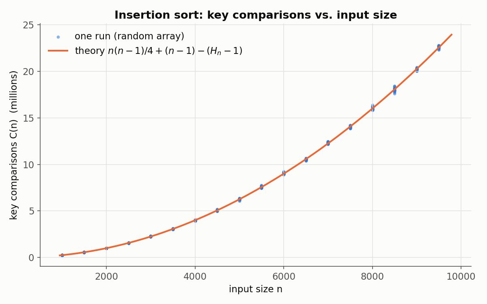
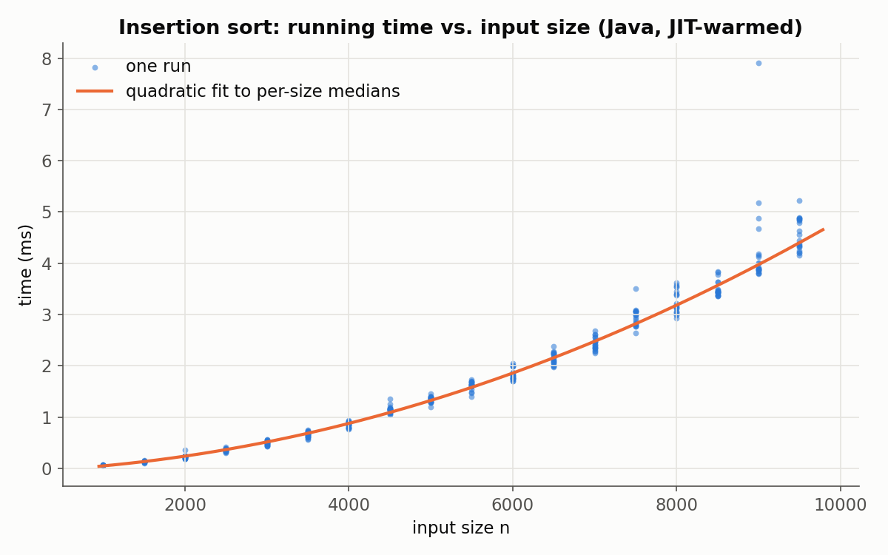
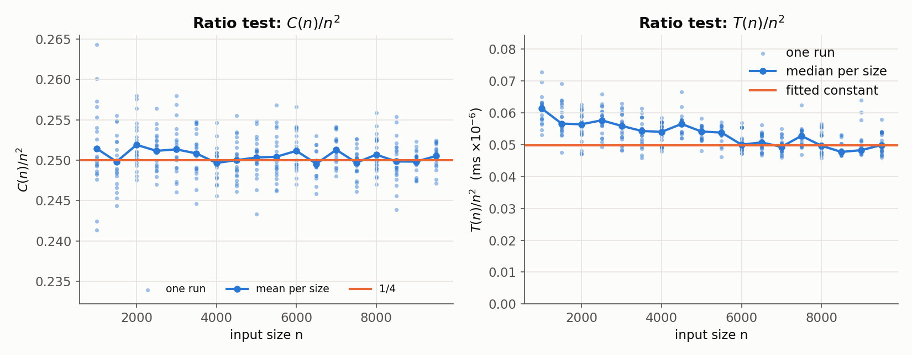
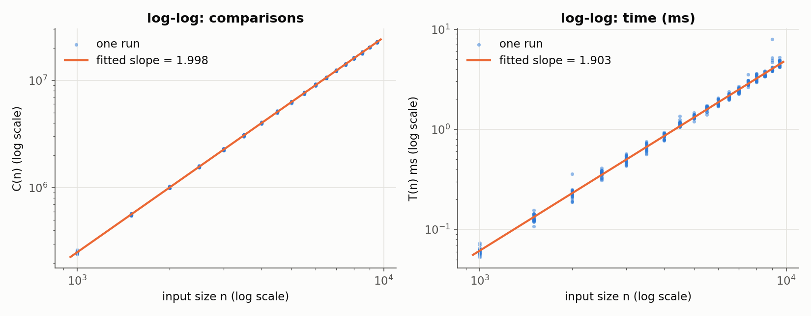

# 🧪 Lab: Empirical Analysis of Insertion Sort

> A complete empirical study built on Levitin Exercises 2.6.1–2.6.3 (§2.6, "Empirical Analysis of Algorithms").
> You will find a bug in a comparison counter, fix it, run a real experiment in Java (and Python),
> plot the results, fit a model, and predict what happens at n = 10,000 **before** you measure it.

**Try it in the browser first:** the interactive version of this lab lives at
<https://normansrule.github.io/algorithm-forge/sims/empirical-lab.html> (pick sizes, run trials, watch the scatter plot grow).

| File | What it is |
|------|------------|
| [`SortAnalysis.java`](SortAnalysis.java) | Corrected counter + experiment driver (18 sizes × 20 random arrays), writes the Comma-Separated Values (CSV) files |
| [`sort_analysis.py`](sort_analysis.py) | The same experiment in Python (slower; good for cross-checking) |
| [`plot_results.py`](plot_results.py) | Scatter plots, ratio plots, log-log plot with fitted slope, fitted constants → `results/` |
| [`results/`](results/) | The real data and Portable Network Graphics (PNG) plots produced by the run documented below |

---

## Step 0 — What you are given

```
ALGORITHM SortAnalysis(A[0..n-1])
    count ← 0
    for i ← 1 to n - 1 do
        v ← A[i]
        j ← i - 1
        while j ≥ 0 and A[j] > v do
            count ← count + 1
            A[j + 1] ← A[j]
            j ← j - 1
        A[j + 1] ← v
    return count
```

The goal of `count` is to be the number of **key comparisons** `A[j] > v` — the basic operation of insertion sort
(Levitin §4.1). Levitin Exercise 2.6.1 asks whether the counter is in the right place. Exercises 2.6.2–2.6.3
then ask you to run the corrected program on random arrays, analyze the counts and the times, and extrapolate to a
bigger size. This lab uses a laptop-friendly version of that experiment: 20 random arrays at each of the sizes
1000, 1500, 2000, …, 9500, a scatter plot, a fitted model, and a prediction for n = 10,000.

> **What "20 random arrays" means here.** There are **18** sizes (1000, 1500, …, 9500), and for **each** size we run
> 20 independent random arrays (360 runs total), record **every** run, and also report the per-size mean. Every
> script takes the number of trials as a parameter (`java SortAnalysis 20`, `python3 sort_analysis.py --trials 20`),
> so a different design is a one-number change. Say which design you used in your write-up.

---

## Step 1 — Find the bug (✋ trace it by hand)

Look at **where** `count ← count + 1` sits: *inside* the loop body. The body only runs when the whole
condition `j ≥ 0 and A[j] > v` is **true**. So the counter counts only the comparisons that came out
**true** (which is exactly the number of shifts).

But every insertion that stops because `A[j] > v` came out **false** (with `j ≥ 0`) also made a comparison — the one
that told us to stop. That comparison is never counted.

**Tiny trace 1 — an already-sorted array `10 20 30 40 50` (n = 5):**

| i | v | comparison made | result | counted by the given code? |
|---|---|-----------------|--------|---------------------------|
| 1 | 20 | 10 > 20 | false → stop | ❌ |
| 2 | 30 | 20 > 30 | false → stop | ❌ |
| 3 | 40 | 30 > 40 | false → stop | ❌ |
| 4 | 50 | 40 > 50 | false → stop | ❌ |

The given code reports **0**, but insertion sort made **n − 1 = 4** comparisons. On a sorted array the true
answer is $C_{best}(n) = n-1$, not 0.

**Tiny trace 2 — `5 2 4 6 1 3`:**

| i | v | comparisons actually made | why the scan stopped | true count | given code |
|---|---|---------------------------|----------------------|-----------:|-----------:|
| 1 | 2 | 5>2 ✔ | ran off the left end (j < 0) | 1 | 1 |
| 2 | 4 | 5>4 ✔, 2>4 ✘ | `A[j] ≤ v` | 2 | 1 |
| 3 | 6 | 5>6 ✘ | `A[j] ≤ v` | 1 | 0 |
| 4 | 1 | 6>1 ✔, 5>1 ✔, 4>1 ✔, 2>1 ✔ | ran off the left end | 4 | 4 |
| 5 | 3 | 6>3 ✔, 5>3 ✔, 4>3 ✔, 2>3 ✘ | `A[j] ≤ v` | 4 | 3 |
| | | | **total** | **12** | **9** |

Rule you just discovered: the given code misses **exactly one comparison per insertion that stops with
`j ≥ 0`**. Insertions that run off the left end (`j` becomes −1) are counted correctly, because the loop never
evaluates `A[-1] > v` (the `and` short-circuits).

> The given code is right only when **every** insertion runs off the left end, which happens exactly for a
> strictly decreasing (reverse-sorted, worst-case) array. Then both versions report $n(n-1)/2$.

---

## Step 2 — The corrected algorithm (two correct styles)

**Style 1 — count *before* the test, loop on `j ≥ 0` only, leave with an explicit `break`.**
(This is what [`SortAnalysis.java`](SortAnalysis.java) uses.)

```
ALGORITHM SortAnalysis(A[0..n-1])
    // Sorts A by insertion sort and returns the number of key comparisons A[j] > v
    // Input: An array A[0..n-1] of n orderable elements
    // Output: count = number of key comparisons made (A is sorted as a side effect)
    count ← 0
    for i ← 1 to n - 1 do
        v ← A[i]
        j ← i - 1
        while j ≥ 0 do
            count ← count + 1            // A[j] > v is evaluated now — count it, true OR false
            if A[j] > v then
                A[j + 1] ← A[j]
                j ← j - 1
            else
                break
        A[j + 1] ← v
    return count
```

> If your dialect has no `break`, use a Boolean flag: `while j ≥ 0 and not done do`, setting `done ← true`
> in the `else` branch.

**Style 2 — keep the original loop, add the missing comparison afterwards.**
(This is what [`sort_analysis.py`](sort_analysis.py) uses.)

```
ALGORITHM SortAnalysis2(A[0..n-1])
    count ← 0
    for i ← 1 to n - 1 do
        v ← A[i]
        j ← i - 1
        while j ≥ 0 and A[j] > v do
            count ← count + 1            // a comparison that came out true
            A[j + 1] ← A[j]
            j ← j - 1
        if j ≥ 0 then
            count ← count + 1            // the loop stopped because A[j] > v was false: count it too
        A[j + 1] ← v
    return count
```

✅ **Check yourself:** both styles return 4 on `10 20 30 40 50`, 12 on `5 2 4 6 1 3`, and 10 on `50 40 30 20 10`.
The Java program prints these sanity checks every time it starts.

**Common wrong fixes** (don't do these):
- `count ← count + 1` once per outer iteration *plus* the inner increment, unconditionally — double-counts the
  insertions that ran off the left end.
- Counting `j ≥ 0` tests — those are index checks, not key comparisons.

---

## Step 3 — Java implementation

[`SortAnalysis.java`](SortAnalysis.java) does the following:

1. Runs the **sanity checks** from Step 1–2.
2. **Warms up the Java Virtual Machine (JVM).** HotSpot starts by interpreting bytecode and only compiles
   hot loops to machine code after a while (Just-In-Time (JIT) compilation). The first few sorts are therefore
   much slower than later ones. We sort 300 throw-away arrays first so every timed run uses compiled code.
3. For each size n = 1000, 1500, …, 9500 and each trial t = 1…20:
   - makes a random `int` array (seeded `java.util.Random`, so the run is reproducible),
   - sorts one copy with the **corrected counter** and one with the **original buggy counter**,
   - times an **uninstrumented** insertion sort on identical copies with `System.nanoTime()`; it repeats the
     timing 3 times and keeps the fastest (the least disturbed by the operating system or Garbage Collection (GC)),
   - checks that every copy really is sorted.
4. Writes `results/comparisons.csv` (`n,trial,comparisons,buggy_count,expected_exact`),
   `results/timing.csv` (`n,trial,time_ms`) and `results/summary.csv` (per-size means and medians).

```bash
cd practice/empirical-analysis-lab
javac SortAnalysis.java
java SortAnalysis            # defaults: 20 trials per size, seed 501, output to results/
java SortAnalysis 20 7 out   # 20 trials, seed 7, output directory out/
```

Why time an uninstrumented copy? The counter itself costs time. We want the time of *insertion sort*, not of
insertion sort plus bookkeeping. (The counts and the times still describe the very same arrays.)

---

## Step 4 — Python version

[`sort_analysis.py`](sort_analysis.py) is a line-by-line twin (Style 2 counter, same CSV columns). Python is
about 230 times slower than JIT-compiled Java on this loop, so for quick experiments use fewer trials:

```bash
python3 sort_analysis.py --trials 3          # ~75 s on our machine; writes results/python/
python3 sort_analysis.py                     # the full 20 trials (~8–9 minutes)
python3 sort_analysis.py --sizes 500 1000 2000 --trials 5
```

We ran it with `--trials 3`; its data and plots are in [`results/python/`](results/python/).

---

## Step 5 — Plots

```bash
python3 plot_results.py                      # reads results/, writes the PNGs + results/fit_summary.txt
python3 plot_results.py --dir results/python # same analysis for the Python run
```

| Plot | What to look for |
|------|------------------|
|  | Every dot is one run. The dots hug the theoretical curve; the vertical spread at each n is the run-to-run variation. |
|  | Same shape, but noisier: time depends on the machine, not only on the algorithm. |
|  | **Ratio test.** If $C(n) \in \Theta(n^2)$, then $C(n)/n^2$ should level off at a constant. It does: at 1/4. |
|  | On log-log axes, $C(n) \approx a n^b$ becomes a straight line with slope $b$. We get $b \approx 2$. |

---

## Step 6 — Analysis (🧮 the math, then the numbers)

### 6a. Hypothesis from theory: $C_{avg}(n) \approx n^2/4$

Assume the input is a random permutation (all orders equally likely; with random 31-bit integers, ties are so rare
they do not matter).

Look at the moment element `A[i]` is inserted into the sorted prefix `A[0..i-1]` (i elements). Let $K$ be the
number of those i elements that are **larger** than $v = A[i]$. For a random permutation, $v$ is equally likely to
rank anywhere among the $i + 1$ elements `A[0..i]`, so $K$ is uniform on $\{0, 1, \dots, i\}$.

- If $K < i$: the scan makes $K$ true comparisons, then one false comparison → $K + 1$ comparisons.
- If $K = i$: the scan makes $i$ true comparisons and runs off the left end → $i$ comparisons.

$$
E[\text{comparisons for } A[i]] = \frac{1}{i+1}\left(\sum_{k=0}^{i-1}(k+1) + i\right)
= \frac{1}{i+1}\left(\frac{i(i+1)}{2} + i\right) = \frac{i}{2} + 1 - \frac{1}{i+1}.
$$

Add over $i = 1, \dots, n-1$:

$$
C_{avg}(n) = \sum_{i=1}^{n-1}\left(\frac{i}{2} + 1 - \frac{1}{i+1}\right)
= \frac{n(n-1)}{4} + (n-1) - (H_n - 1),
\qquad H_n = 1 + \tfrac12 + \dots + \tfrac1n \approx \ln n + 0.5772.
$$

The leading term is $n^2/4$, so $C_{avg}(n) \in \Theta(n^2)$ with constant **1/4**.
(The buggy counter's expectation is just the inversion count $n(n-1)/4$; it misses about $n - \ln n$ comparisons.)

For n = 10,000: $H_{10000} \approx 9.787606$, so

$$
C_{avg}(10000) = 24{,}997{,}500 + 9{,}999 - 8.787606 \approx \mathbf{25{,}007{,}490.2}.
$$

### 6b. What our experiment measured

**Machine:** cloud Virtual Machine (VM), Intel Xeon @ 2.10 GHz, 2 virtual CPUs; OpenJDK 21.0.10 (HotSpot); Python 3.11.15.
**Run:** `java SortAnalysis 20 501 results` → 18 sizes × 20 arrays = 360 runs.

Per-size means (from [`results/summary.csv`](results/summary.csv), a few rows):

| n | mean C(n) (20 runs) | theory $E[C(n)]$ | mean C / n² | mean buggy count | median time (ms) |
|---:|---:|---:|---:|---:|---:|
| 1000 | 251,451.8 | 250,742.5 | 0.25145 | 250,459.7 | 0.061 |
| 3000 | 2,262,042.9 | 2,252,241.4 | 0.25134 | 2,259,051.3 | 0.503 |
| 5000 | 6,258,223.1 | 6,253,740.9 | 0.25033 | 6,253,231.1 | 1.353 |
| 7000 | 12,313,146.1 | 12,255,240.6 | 0.25129 | 12,306,156.4 | 2.416 |
| 9500 | 22,609,024.5 | 22,569,615.3 | 0.25052 | 22,599,533.0 | 4.500 |

At n = 9500 the buggy counter is on average **9,491.5** comparisons short; theory says $(n-1) - (H_n - 1) \approx 9{,}490.3$. ✔

**Fitted models** (from [`results/fit_summary.txt`](results/fit_summary.txt)):

| Quantity | Model | Fitted value |
|----------|-------|-------------:|
| Comparisons | $C(n) \approx a n^2$ (least squares through the origin, all 360 runs) | $a = $ **0.25025** |
| Comparisons | full quadratic | $0.24990 n^2 + 2.906 n - 1343$ |
| Comparisons | log-log slope | **1.998** |
| Time (per-size medians) | $T(n) \approx a n^2$ | $a = 4.98 \times 10^{-8}$ ms |
| Time | full quadratic | $4.29\times10^{-8} n^2 + 6.19\times10^{-5} n - 0.057$ ms |
| Time | log-log slope | **1.90** |

The comparison constant 0.25025 is within 0.1% of the theoretical 1/4. The run-to-run spread is real, not an
error: the standard deviation of the count for one random array is about $\sqrt{n(n-1)(2n+5)/72}$, roughly
167,000 at n = 10,000 (±0.7%).

### 6c. Predictions for n = 10,000 — then check them

| Prediction for n = 10,000 | Comparisons | Time (this machine) |
|---------------------------|------------:|--------------------:|
| Theory | **25,007,490** | — (theory gives counts, not milliseconds) |
| One-constant fit $a n^2$ | 25,024,680 | 4.98 ms |
| Full quadratic fit | 25,017,466 | 4.85 ms |
| **Measured afterwards** (20 new arrays of size 10,000) | 25,110,328 (mean) | 4.85 ms (median) |

The measured mean is 0.4% above theory; with 20 runs the standard error of the mean is about 37,000, so this
batch happened to be on the high side. A larger check (300 arrays, three different seeds) gave means of
25,007,325, 25,010,469 and 25,011,313, which match theory closely. **Lesson:** small samples wobble. Report
the spread, not just the mean.

### 6d. Why is the time slope 1.90 and not 2.00?

- **Fixed overheads.** Every sort has linear work (the outer loop, `v ← A[i]`, `A[j+1] ← v`) plus timer
  overhead. These matter more at small n and flatten the log-log slope. That is also why the quadratic fit has a
  positive linear term.
- **Caches.** An array of 9,500 `int`s is 38 kilobytes, about the size of a Level-1 (L1) data cache, so the smallest
  and largest runs sit in slightly different memory regimes.
- **Noise.** The operating system, other virtual machines on the same host, and GC can all pause a run. Taking
  the best of 3 repetitions and fitting to **medians** filters most of this out.
  The occasional high dot in the timing scatter plot is exactly this kind of hiccup.
- **JIT.** Without warm-up, the first sizes would be timed partly in the interpreter and look far slower. That
  error is worse than noise because it is *systematic*.

The ratio plot for time drifts down a little and then levels off near $5\times10^{-8}$ ms per $n^2$. That
works out to about **0.2 ns per key comparison** here: roughly half a clock cycle, because the compiled loop is
unrolled and the processor overlaps iterations. On your laptop the constant will be different. The **shape**
(quadratic) will not.

> **Counts are machine-independent; times are not.** This is exactly the point of quiz-bank question Q1.3: running
> time is roughly $T(n) \approx c_{op} \cdot C(n)$, where the constant $c_{op}$ belongs to the machine, the language
> and the compiler. Our Python run (see [`results/python/fit_summary.txt`](results/python/fit_summary.txt)) has the
> same comparison constant (0.2505) but about 45 ns per comparison, roughly 230 times slower.

---

## Step 7 — Write-up checklist and how to present the plot

**Your report should contain:**

- [ ] The bug, stated in one sentence, plus a two-line trace that proves it (for example the sorted array: reported 0, actual n − 1).
- [ ] The corrected pseudocode (either style) and one sentence on why it is correct.
- [ ] The experiment design: sizes, trials per size (**state your interpretation of "20 random arrays"**), how
      the arrays were generated (distribution, seed), what exactly you timed, the JIT warm-up, and the machine,
      Operating System (OS), Java version and Central Processing Unit (CPU).
- [ ] A table of per-size means, including at least n, mean C(n), C(n)/n² and mean time.
- [ ] The comparison **scatter plot** (below).
- [ ] The hypothesis $C_{avg}(n) \approx n^2/4$ with the derivation (or cite Levitin §4.1), and the evidence for it:
      ratio test (C/n² levels off at ≈ 0.25) and log-log slope (≈ 2).
- [ ] The fitted constant(s) and the **prediction for n = 10,000** made *before* measuring it, then the measurement.
- [ ] The same for time, with the honest caveat that the constant is machine-specific.
- [ ] Limitations: sample size, random-input assumption (sorted or nearly sorted inputs behave very differently),
      timer resolution, noise.

**Presenting the scatter plot the way Levitin does (§2.6):**

- **x-axis = input size n, y-axis = the measured metric** (count or time). Label both, with units.
- **Plot every run as an unconnected dot.** A scatter plot shows the *spread*. Connecting the dots would suggest
  a trend between sizes that you never measured.
- Overlay the **theoretical or fitted curve** as a smooth line in a contrasting color, with a legend.
- Start the y-axis at 0 so the curvature is honest, and use the same n-range for the count plot and the time plot so they can be compared.
- Add a **ratio plot** (metric / n²) or a **log-log plot**. The human eye is bad at telling $n^2$ from $n^{2.2}$ on
  a plain scatter plot, and these two views make it obvious.
- Caption each figure with what it shows and what you conclude from it.

---

## Going further

- Run it on **sorted** and **reverse-sorted** arrays: you should get exactly $n - 1$ and $n(n-1)/2$.
- Replace insertion sort with **selection sort** (its count is exactly $n(n-1)/2$ for every input: no scatter at all!)
  or with **mergesort** (the ratio test should use $n \log_2 n$).
- Add **binary insertion sort** (find the insertion spot by binary search) and compare comparisons versus time. Comparisons
  drop to about $n \log_2 n$, but time stays quadratic because of the shifts. This is a great example of choosing
  the wrong basic operation.

Related: [Chapter 2 lesson](../../lessons/02-analysis-framework/README.md) ·
[Growth-rates simulation](https://normansrule.github.io/algorithm-forge/sims/growth-rates.html) ·
[Practice home](../README.md)
